# ArXiv Daily Digest - 2026-10-05 (AIGC - Audio Generation & Editing (TTS / Music / Voice), 10 papers)

**Generated**: 2026-10-05 17:30 CST
**Source**: arXiv cs.SD, eess.AS submissions, window 2026-10-01/02 UTC (the latest announced batch as of 2026-10-05)
**Track**: aigc_audio (top 10 of 648 papers scanned)
**Scope**: text-to-speech, text-to-music, voice conversion, accent conversion, speech tokenization, music-model interpretability

---

Audio generation is the thin track in this batch, and the strongest papers are about *reward design* and *what the metrics actually measure*. The CMU/UW music paper shows ALM rubric rewards improve CLAP, SongEval and Audiobox simultaneously while any single automatic evaluator produces cross-metric trade-offs - and that for tempo, key and instrumentation you should just optimize the specialized reward directly. The masked-diffusion TTS scaling study is the most rigorous audio paper here: across 15 models it finds refinement and depth are not interchangeable, that refinement closes 86% of the intelligibility range but only 46% of identity, and that 62% of the residual identity deficit lives in the codec rather than the generator. On the modelling side, DriftTTS reaches Matcha-TTS-level quality at NFE=4 with no teacher, no distillation and no adversarial loss, and StateVC does training-free one-shot voice conversion without any explicit frame matching. The Jazz-pianist and multi-SAE papers are included as wild-cards: both treat a pretrained music model as an object of study rather than a thing to beat.

---

## Top 10 - AIGC - Audio Generation & Editing (TTS / Music / Voice)

### 1. Rubric-Based Optimization for Text-to-Music Generation

**arXiv**: [2610.03589](https://arxiv.org/abs/2610.03589) | **Score**: 9.7 (relevance 10 x 0.7 + quality 9 x 0.3) | **Tags**: AIGC-audio, rlhf | **Categories**: cs.SD | **Pages**: 27

**Authors**: Ping Wang, Guang Yang, Shao-Rong Su, Junkai Wu, Pang Wei Koh, Noah A. Smith

**Affiliation**: Paul G. Allen School of Computer Science & Engineering, University of Washington | Department of Electrical and Computer Engineering, University of Washington | Allen Institute for AI | @cs.washington.edu

**Abstract**

> Post-training text-to-music generation requires reward signals that capture multiple aspects of musical quality beyond what any single automatic metric can measure. We study structured, rubric-based rewards from pretrained audio-language models (ALMs) as training signals for both autoregressive and diffusion-based music generators. An ALM scores each generated clip against the rubric; we rank candidates generated for the same text prompt by their scores and convert these rankings into preference pairs for DPO on both MusicGen-small and ACE-Step~v1, and additionally use the rubric scores directly as scalar rewards for DiffusionNFT on ACE-Step~v1. On MusicCaps, rubric-based optimization improves CLAP, SongEval, and Audiobox-Aesthetics simultaneously, with the strongest gains obtained by DiffusionNFT on ACE-Step. By contrast, on MusicGen-small, building preferences from any one of these automatic evaluators produces clear cross-metric trade-offs: the targeted evaluator improves while other independent evaluators deteriorate. We further study tempo, key, and instrumentation, where precise objective rewards are available. Directly optimizing these specialized rewards reliably improves the target attributes, whereas ALM rubrics provide only partial transfer for tempo and instrumentation and no measurable improvement for key. Together, these results suggest a practical division of labor: ALM rubrics are effective for broad perceptual qualities that are difficult to formalize, while specialized objective rewards remain preferable when reliable measurements are available.

**Key findings**

- **Finding**: Uses pretrained audio-language models (ALMs) as **rubric-based** reward scorers for music generation: an ALM scores each generated clip against the rubric, candidates for the same text prompt are ranked by score, and rankings are converted into preference pairs for DPO on MusicGen-small and ACE-Step-v1.

- **Finding**: On MusicCaps, rubric-based optimization improves CLAP, SongEval and Audiobox-Aesthetics **simultaneously**, with the strongest gains from DiffusionNFT on ACE-Step.

- **Finding**: In contrast, on MusicGen-small, building preferences from any *single* automatic evaluator produces clear cross-metric trade-offs - the targeted evaluator improves while independent evaluators deteriorate.

- **Finding**: For tempo, key and instrumentation, where precise objective rewards exist, directly optimizing those specialized rewards reliably improves the attribute, whereas ALM rubrics give only partial transfer for tempo and instrumentation and **no measurable improvement for key**.

**Key figures**

*Results / analysis - Figure 1: DPO on MusicCaps: change in each evaluator as a percentage of the untrained generator’s score (positive is better), for MusicGen-small (top row) and ACE-Step v1 (bottom row). Each panel is one DPO run, named by its preference source: the candidates were ranked either by a single automatic metric (hatched, left three panels) or b*

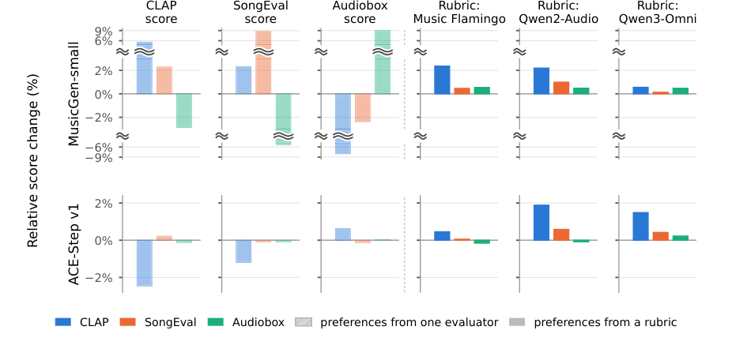

*Results / analysis - Figure 2: ACE-Step v1 under different post-training methods: DPO versus DiffusionNFT for each ALM rater. One panel per rater; within each panel, the three groups are DPO on rubric preferences (hatched; the ACE-Step rubric runs of § 5.1), DiffusionNFT with joint prompting (all rubric di- mensions rated in one request), and DiffusionNFT wit*

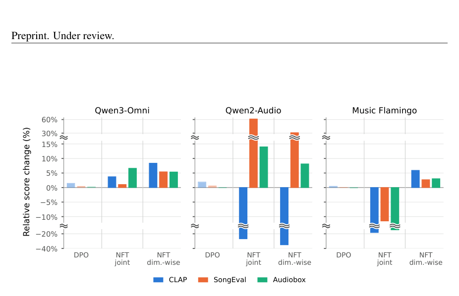

**Why this ranks #1**: Cleanest study of reward design for generative post-training: ALM rubrics improve three metrics at once while single automatic evaluators trade off. Concrete division-of-labor conclusion.

---

### 2. DriftTTS: Few-Step Text-to-Speech Without Distillation via Distribution-Matching Drift

**arXiv**: [2610.03390](https://arxiv.org/abs/2610.03390) | **Score**: 9.4 (relevance 10 x 0.7 + quality 8 x 0.3) | **Tags**: AIGC-audio | **Categories**: cs.SD, cs.AI | **Pages**: 5

**Authors**: Mohammad Nur Hossain Khan, Subrata Biswas, Bashima Islam

**Affiliation**: ⋆University of Massachusetts Amherst, MA, USA | Worcester Polytechnic Institute, MA, USA

**Abstract**

> Few-step neural text-to-speech models often rely on short- ened diffusion or flow-matching schedules, or on distillation from pretrained multi-step teachers. To avoid these depen- dencies, we present DriftTTS, a few-step mel-spectrogram generator trained without a generative teacher, distillation, or adversarial discrimination. DriftTTS uses a distribution- matching drift objective in a mel-domain feature space defined by raw mels and a frozen masked-autoencoder encoder pretrained on the same LJSpeech training split. On-policy rollout trains the decoder on its own interme- diate states and supports inference up to the trained roll- out depth. On LJSpeech, DriftTTS at NFE=4 achieves 3.87 dB MCD and 3.7% WER, compared with 3.85 dB and 3.4% for Matcha-TTS. In a fully paired blind listen- ing test, DriftTTS obtains 4.18 MOS, compared with 3.96 for Matcha-TTS and 4.22 for ground truth. These results demonstrate competitive few-step synthesis without a pre- trained generative teacher. Code can be found at https: //github.com/BASHLab/driftTTS.git

**Key findings**

- **Finding**: DriftTTS is a few-step mel-spectrogram generator trained **without a generative teacher, without distillation and without adversarial discrimination** - avoiding the dependencies that dominate few-step TTS.

- **Finding**: Uses a distribution-matching drift objective in a mel-domain feature space defined by raw mels plus a frozen masked-autoencoder encoder pretrained on the same LJSpeech split. On-policy rollout trains the decoder on its own intermediate states and supports inference up to the trained rollout depth.

- **Finding**: On LJSpeech at NFE=4, DriftTTS reaches 3.87 dB MCD and 3.7% WER, versus 3.85 dB and 3.4% for Matcha-TTS. In a fully paired blind listening test it obtains 4.18 MOS, versus 3.96 for Matcha-TTS and 4.22 for ground truth.

**Key figures**

*Framework / architecture - Fig. 1. Overview of DriftTTS. Text-conditioned Gaussian noise is iteratively refined by a few-step drift decoder to generate mel-spectrograms, which are converted to waveform by HiFi-GAN. During training, the decoder is optimized with an on-policy distribution-matching drift objective computed in a mel-domain feature space using real and*

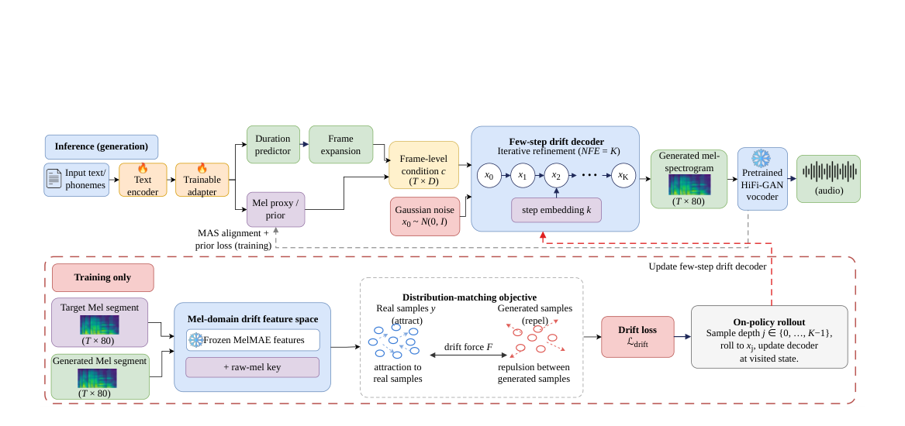

**Why this ranks #2**: Few-step TTS with no teacher, no distillation, no adversarial loss - matches Matcha-TTS MOS at NFE=4 on a single-corpus scale test. Code released.

---

### 3. Refinement Buys Intelligibility, Search Buys Identity: What Test-Time Compute Buys in Masked-Diffusion TTS

**arXiv**: [2610.03320](https://arxiv.org/abs/2610.03320) | **Score**: 9.0 (relevance 9 x 0.7 + quality 9 x 0.3) | **Tags**: AIGC-audio | **Categories**: cs.AI | **Pages**: 15

**Authors**: Nityanand Mathur, Hamees Sayed, Ayush Pratap Singh

**Affiliation**: Work done outside of Blackstar Inc.

**Abstract**

> Diffusion language models for text-to-speech combine two forms of computation: model depth (parameters) and refinement steps (inference budget). We ask whether they scale equally across capabilities. We train 15 masked-diffusion codec TTS models varying depth (19-133M parameters, 3 seeds) on 2,000 hours of speech and sweep refinement steps T in [1,16] at inference, measuring zero-shot synthesis via ASR word error rate (intelligibility) and speaker verification (identity) on 174 held-out speakers. Against measured floors, refinement closes 86.2% of the intelligibility range but only 46.4% of the identity range - a 1.86x asymmetry robust across multiple error metrics. Retraining at 3x and 6x schedule attenuates but does not reverse this gap (1.84 to 1.36 to 1.23x), because intelligibility saturates with steps while identity continues improving. Best-of-K search recovers speaker identity where refinement fails, with 64.6-79.0% win rates across four independent encoders. Depth and steps are not interchangeable: separable B(d)B(T) fits significantly better (Delta AICc=+69.3) than substitution models. Analysis shows 62% of remaining identity deficit lies in the codec, not the generator. We conclude that refinement and depth target different bottlenecks and should be optimized separately.

**Key findings**

- **Finding**: Trains 15 masked-diffusion codec TTS models (19-133M parameters, 3 seeds) on 2,000 hours of speech and sweeps refinement steps T in [1,16], measuring zero-shot synthesis via ASR word error rate (intelligibility) and speaker verification (identity) on 174 held-out speakers.

- **Finding**: Against measured floors, refinement closes **86.2% of the intelligibility range but only 46.4% of the identity range** - a 1.86x asymmetry robust across multiple error metrics.

- **Finding**: Retraining at 3x and 6x schedule attenuates but does not reverse the gap (1.84 -> 1.36 -> 1.23x), because intelligibility saturates with steps while identity keeps improving. Best-of-K search recovers identity where refinement fails, with 64.6-79.0% win rates across four independent encoders.

- **Finding**: Depth and steps are not interchangeable - separable B(d)B(T) fits significantly better than substitution models (Delta AICc = +69.3). **62% of the remaining identity deficit lies in the codec, not the generator.**

**Key figures**

*Results / analysis - Figure 2: Left: iso-error contours in (w, d) at T=16. The two capabilities do not share a preferred shape, but the width amplitude saturates its bound, so the anisotropy ratio ρ is not identified. Right: iso-WER contours in (log T, log d): a single substitution factor d T κ cannot reproduce both the depth ordering at fixed T and the T*

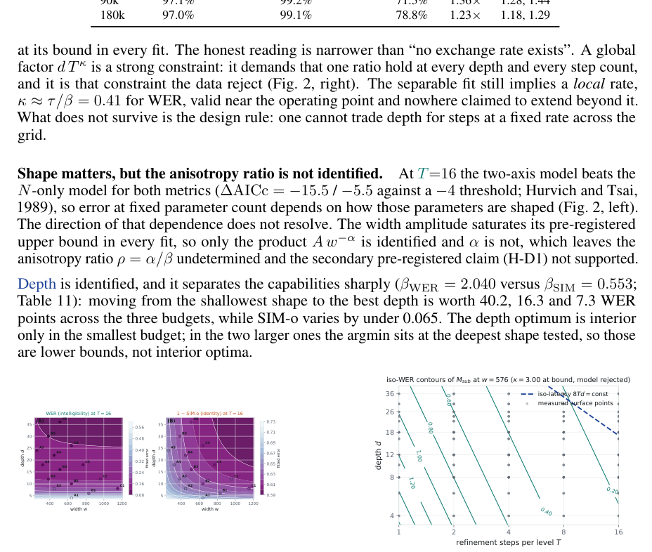

*Framework / architecture - Figure 3: Identity is mostly not the model’s to win. (A) what each axis buys in speaker similarity, against the headroom that remains to the codec ceiling; bars are coloured by which lever they are (rented at serve time, owned in training, shape). Refinement’s bar is the largest only because it is measured from one-step decoding, which is*

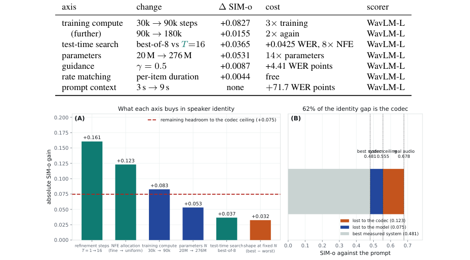

**Why this ranks #3**: The most rigorous audio paper in the batch: a 15-model scaling study with a specific testable asymmetry and the finding that 62% of the residual identity gap lives in the codec, not the generator.

---

### 4. Watch Your Speech: Text-aware Video-to-Speech Synthesis with Textual Conditioning

**arXiv**: [2610.01012](https://arxiv.org/abs/2610.01012) | **Score**: 9.0 (relevance 9 x 0.7 + quality 9 x 0.3) | **Tags**: AIGC-audio | **Categories**: cs.CV, cs.SD, eess.AS | **Pages**: 28

**Authors**: Gunwoo Lee, Yoori Oh, Yoseob Han

**Affiliation**: Department of Information and | Soongsil University | Seoul, Republic of Korea | Graduate School of Data Science | Seoul National University | Department of Electronic Engineering

**Abstract**

> Video-to-speech synthesis aims to generate natural-sounding speech from silent talking-face videos while ensuring phonetic accuracy. A fundamental challenge in this task is the inherent one-to-many mapping problem, where visual dynamics often lack sufficient information to uniquely determine the corresponding utterance. To address this, we propose Watch Your Speech (WYS), a video-to-speech synthesis framework that incorporates textual conditioning as an explicit linguistic cue to mitigate visual ambiguity. Our framework features an attention-based embedding fusion module that synergistically integrates textual context with video sequences, coupled with a conditional flow matching objective for high-fidelity speech generation. Extensive experiments on the LRS2 and LRS3 datasets demonstrate that WYS achieves superior performance, establishing new state-of-the-art results in audio-visual synchronization (LSE-C/D) while maintaining highly competitive textual accuracy (WER). Subjective evaluations further confirm that our model generates speech with near-human naturalness, validating the effectiveness of textual conditioning in content-controlled video-to-speech synthesis. Project page: https://github.com/gunwoo5034/Watch-your-Speech

**Key findings**

- **Finding**: Identifies the **one-to-many mapping problem** in video-to-speech synthesis - visual dynamics often lack sufficient information to uniquely determine the utterance.

- **Finding**: Watch Your Speech (WYS) adds textual conditioning as an explicit linguistic cue, via an attention-based embedding fusion module that synergistically integrates textual context with video sequences, coupled with a conditional flow matching objective for high-fidelity speech.

- **Finding**: On LRS2 and LRS3, WYS establishes new state of the art in audio-visual synchronization (LSE-C / LSE-D) while maintaining highly competitive textual accuracy (WER); subjective evaluation confirms near-human naturalness.

**Key figures**

*Framework / architecture - Figure 3: Details of the back-end components: (a) Text Encoder, (b) Image Encoder for speaker identity, (c) Video Encoder for lip movements, (d) embedding fusion module that aligns video and text features via attention and injects speaker identity to produce efus, and (e) legend.*

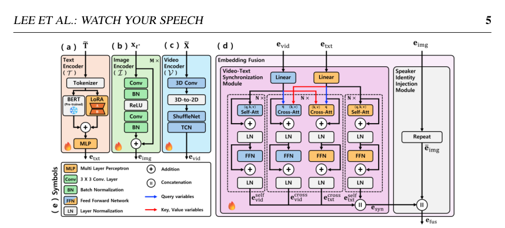

**Why this ranks #4**: Correctly identifies the one-to-many mapping problem in V2S and fixes it with text conditioning; SOTA LSE-C/D with competitive WER, human-rated near-natural.

---

### 5. Shared-State Local Translations for Training-Free Voice Conversion

**arXiv**: [2610.01952](https://arxiv.org/abs/2610.01952) | **Score**: 8.6 (relevance 9 x 0.7 + quality 8 x 0.3) | **Tags**: AIGC-audio | **Categories**: eess.AS | **Pages**: 5

**Authors**: Yangyang Qu, Michele Panariello, Massimiliano Todisco, Nicholas Evans

**Affiliation**: Shared GMM | Rank & Select | Weighted Mean

**Abstract**

> In one-shot training-free voice conversion (VC), the source and reference utterances may contain different linguistic content, so reliable frame-level correspondence between them cannot be assumed. We propose StateVC, which jointly defines a common set of local regions from pooled frame-level WavLM representations of the source and reference utterances; we refer to these regions as states. These shared states are obtained by fitting a pair-specific Gaussian mixture model to the pooled representations, without explicit source--reference frame matching. Within each state, StateVC estimates a source-to-reference mean shift in the original WavLM space. Source-frame posterior probabilities then combine the state-specific shifts so that different frames can receive different local updates. For the LibriSpeech one-shot protocol, StateVC achieves the lowest word error rate (WER) and character error rate (CER) among the evaluated systems, at 8.01% and 3.22%, respectively, with a speaker similarity (SIM) of 0.9512. It also achieves the highest mean perceived speaker similarity among the evaluated systems and the highest mean naturalness among the evaluated training-free systems.

**Key findings**

- **Finding**: In one-shot training-free voice conversion, source and reference utterances may contain different linguistic content, so reliable frame-level correspondence cannot be assumed.

- **Finding**: StateVC jointly defines a common set of local regions - **states** - from pooled frame-level WavLM representations, by fitting a pair-specific Gaussian mixture model to the pooled representations, with **no explicit source-reference frame matching**.

- **Finding**: Within each state it estimates a source-to-reference mean shift in the original WavLM space; source-frame posterior probabilities then combine the state-specific shifts so different frames receive different local updates.

- **Finding**: On the LibriSpeech one-shot protocol, StateVC achieves the lowest WER (8.01%) and CER (3.22%) among evaluated systems with speaker similarity 0.9512, plus the highest mean perceived speaker similarity and the highest naturalness among training-free systems.

**Key figures**

*Framework / architecture - Fig. 1. Overview of StateVC. Source and reference representations jointly define a common set of shared states through a pair-specific GMM in a compact routing space. Source and reference means within each state define full-dimensional local shifts. Source-frame posterior probabilities combine these shifts before frozen HiFi-GAN synthesis*

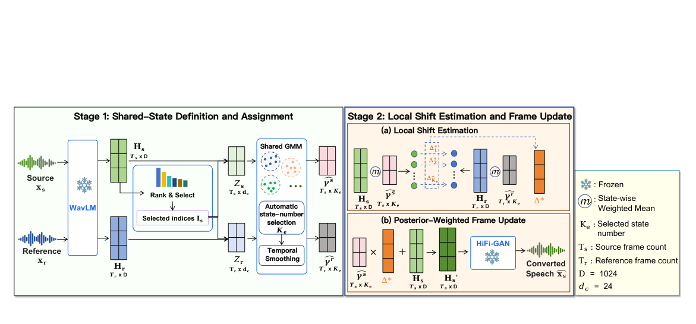

*Framework / architecture - Fig. 2. Sensitivity and design analyses for (a) conversion strength λ, (b) candidate-state limit Kmax, (c) reference duration, and (d) state transformation. SIM and WER use the left and right axes, respectively. Panels (a–c) use Mean, while panel (d) compares state-specific transformations. Shaded regions indicate the selected settings; c*

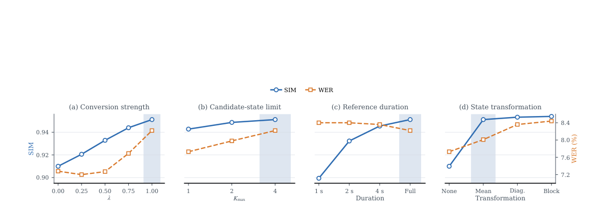

**Why this ranks #5**: Training-free one-shot VC that avoids explicit frame matching via pooled GMM states; best WER/CER/SIM among evaluated systems. A technique other VC work can reuse directly.

---

### 6. Q-SPT: Learnable Query-Based Compression for Low-Frame-Rate Speech Tokenization

**arXiv**: [2610.01492](https://arxiv.org/abs/2610.01492) | **Score**: 8.3 (relevance 8 x 0.7 + quality 9 x 0.3) | **Tags**: AIGC-audio, audio-LM | **Categories**: cs.SD, cs.CL, eess.AS | **Pages**: 5

**Authors**: Jeeyoung Yun, Seohwan Yun, Sungwoong Kim

**Affiliation**: Korea University, Seoul, Republic of Korea | @korea.ac.kr

**Abstract**

> Neural speech codecs increasingly serve as tokenizers for speech language models (SLMs). Lowering the frame rate reduces the computational and memory costs of SLMs, but makes it difficult to preserve both linguistic information and acoustic detail. Existing approaches rely on rule-based compression: average pooling can discard linguistic information, whereas similarity-based merging uses a fixed threshold on adjacent-frame similarity and applies the resulting boundaries to the acoustic stream. We propose Q-SPT, a low-frame-rate dual-stream speech tokenizer with separate, context-aware, learnable query-based compressors specialized for semantic and acoustic representations. In particular, queries at a fixed rate independently attend to the semantic and acoustic streams as separate key-value sources, enabling stream-specific, context-aware aggregation through two separately learned compressors. In addition, an autoregressive text loss explicitly supervises the semantic compressor to preserve linguistic information. Experimental results show that Q-SPT achieves the best reconstruction among the evaluated codecs at the same frame rate. In downstream SLMs, it yields the best speech recognition accuracy and text-to-speech perceptual quality with competitive intelligibility.

**Key findings**

- **Finding**: Lowering speech-codec frame rate cuts SLM compute and memory but makes it hard to preserve both linguistic information and acoustic detail. Rule-based compression fails asymmetrically: average pooling discards linguistic information, while similarity-based merging uses a fixed threshold on adjacent-frame similarity and applies those boundaries to the acoustic stream too.

- **Finding**: Q-SPT uses a low-frame-rate dual-stream tokenizer with **separate, context-aware, learnable query-based compressors** for semantic and acoustic representations. Queries at a fixed rate independently attend to the two streams as distinct key-value sources.

- **Finding**: An autoregressive text loss explicitly supervises the semantic compressor to preserve linguistic information.

- **Finding**: Best reconstruction among evaluated codecs at the same frame rate; in downstream SLMs it yields the best speech recognition accuracy and TTS perceptual quality with competitive intelligibility.

**Key figures**

*Framework / architecture - Fig. 1. Comparison of temporal compression strategies for low-frame-rate speech tokenization: (a) average pooling in DualCodec [12], (b) similarity-based merging in FlexiCodec [9], and (c) learnable query-based compression in Q-SPT. (d) Detailed architecture and training objectives of Q-SPT. Dashed elements indicate components and connect*

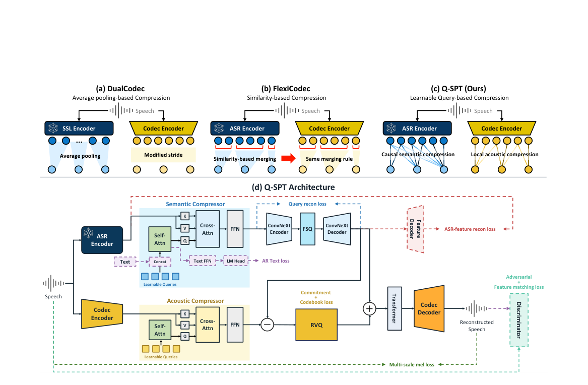

**Why this ranks #6**: Dual-stream learnable compressors directly address the frame-rate / linguistic-detail tradeoff that all speech-LM tokenizer work hits.

---

### 7. Multi-sample Synthetic Supervision for Accent Conversion

**arXiv**: [2610.01961](https://arxiv.org/abs/2610.01961) | **Score**: 8.0 (relevance 8 x 0.7 + quality 8 x 0.3) | **Tags**: AIGC-audio | **Categories**: eess.AS | **Pages**: 5

**Authors**: Yangyang Qu, Michele Panariello, Massimiliano Todisco, Nicholas Evans

**Affiliation**: Stage1: Synthetic Training Data Construction | Frozen AR | × Fail  Pass | Supervision Selection

**Abstract**

> Accent conversion (AC) requires changing accent while preserving speaker identity and linguistic content, yet parallel recordings are scarce. Speech synthesis provides an alternative source of supervision, but generated targets vary in accent realization and source preservation. We propose a multi-sample synthetic supervision framework that constructs conversion targets by jointly assessing these properties across candidate waveforms for each source--accent condition. Selected candidates provide associated discrete speech codes, representing linguistic content, prosody, and speaking style, as targets for accent-conditioned autoregressive adaptation. Compared with using one generated target per training example, our method improves target-accent classification accuracy by 2.49 percentage points, while speaker similarity remains nearly unchanged, and word error rate increases by 0.29 percentage points. Across six target accents, our method achieves 7.81% WER and the highest mean listening ratings among evaluated systems.

**Key findings**

- **Finding**: Accent conversion must change accent while preserving speaker identity and linguistic content, but parallel recordings are scarce and synthesized targets vary in accent realization and source preservation.

- **Finding**: The multi-sample synthetic supervision framework constructs conversion targets by **jointly assessing accent realization and source preservation across multiple candidate waveforms** for each source-accent condition.

- **Finding**: Selected candidates supply associated discrete speech codes (linguistic content, prosody, speaking style) as targets for accent-conditioned autoregressive adaptation.

- **Finding**: Versus one generated target per training example, target-accent classification accuracy improves by 2.49 percentage points while speaker similarity stays nearly unchanged (WER +0.29pp). Across six target accents: 7.81% WER and the highest mean listening ratings among evaluated systems.

**Key figures**

*Framework / architecture - Fig. 1. Overview of multi-sample synthetic supervision and accent conversion. A reference-conditioned generation stage first provides token targets for adapting the categorical candidate generator Gϕ. The fixed Gϕ then samples N token sequences from the source transcript t and target-accent label a, while frozen acoustic synthesis uses th*

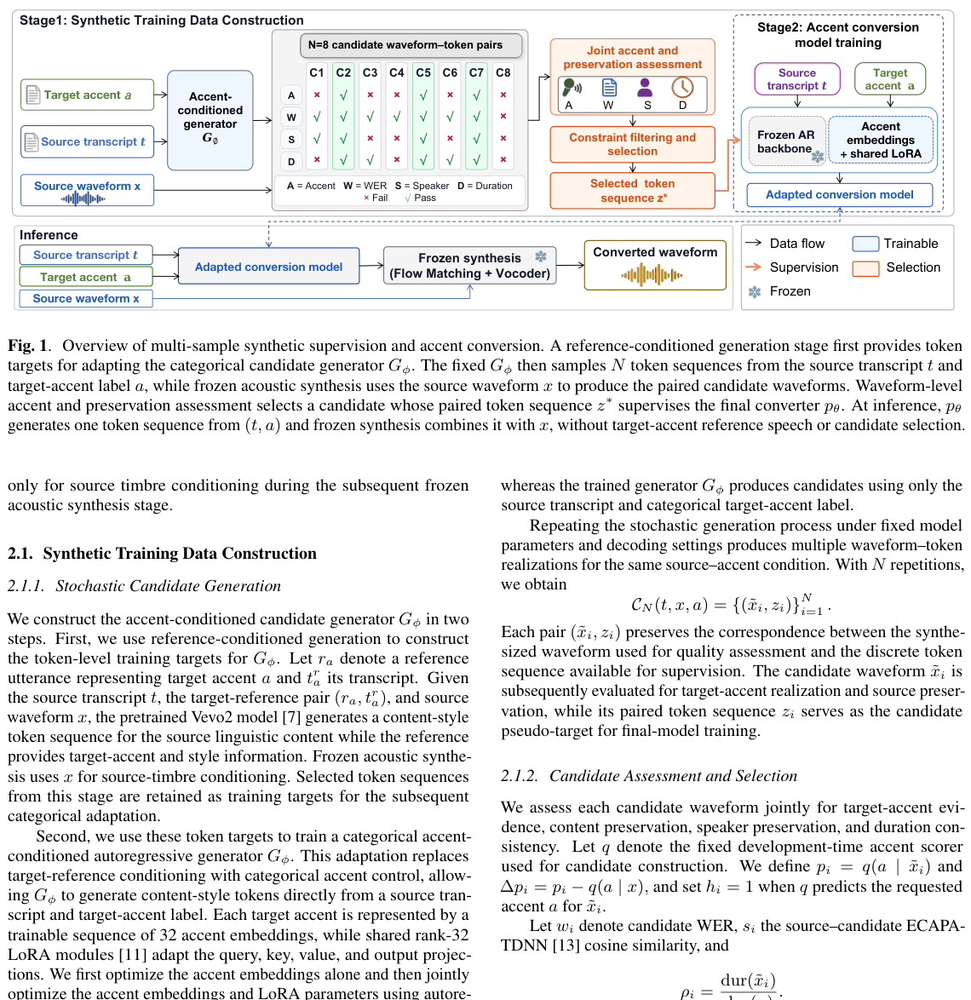

*Results / analysis - Figure shown on p.4 of the paper.*

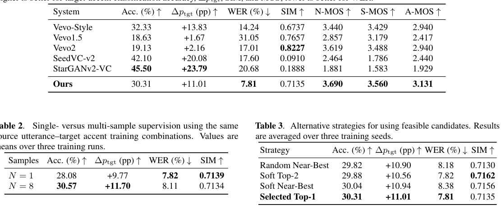

**Why this ranks #7**: Practical data-construction recipe: select among multiple synthesized targets on accent plus speaker preservation jointly.

---

### 8. Learning Jazz Pianist Style with Cross-Attention Conditioning

**arXiv**: [2610.02918](https://arxiv.org/abs/2610.02918) | **Score**: 8.0 (relevance 8 x 0.7 + quality 8 x 0.3) | **Tags**: AIGC-audio | **Categories**: cs.SD, cs.LG, eess.AS | **Pages**: 8

**Authors**: Drew Edwards, Akira Maezawa, Simon Dixon

**Affiliation**: Centre for Digital Music | Queen Mary University of London

**Abstract**

> Jazz pianists develop distinctive traits that experienced listeners can often identify within seconds, yet the features underlying this recognition resist formal description. We study jazz pianist style through the lens of a pretrained symbolic music transformer, showing that its learned representations already encode pianist identity well enough for highly accurate classification across two benchmarks. We then augment the transformer with cross-attention over learned pianist identity embeddings, enabling it to generate music conditioned on a specific artist's style. Two evaluation protocols confirm that the generator captures meaningful stylistic structure: a sliding-window classifier consistently attributes conditioned continuations to the correct artist, far above unconditioned baselines; and a classifier trained entirely on synthetic generations identifies real pianists across 12 classes with 87% chunk-level and 95% song-level accuracy. Finally, we repurpose the classifier to locate the most characteristic moments within a performance, surfacing the specific musical gestures that distinguish each pianist's voice.

**Key findings**

- **Finding**: Shows a pretrained symbolic music transformer's learned representations already encode pianist identity well enough for highly accurate classification across two benchmarks.

- **Finding**: Augments the transformer with cross-attention over learned pianist identity embeddings, enabling music generation conditioned on a specific artist's style.

- **Finding**: Validated two ways - a sliding-window classifier consistently attributes conditioned continuations to the correct artist, far above unconditioned baselines; and a classifier trained *entirely on synthetic generations* identifies real pianists across 12 classes with 87% chunk-level and 95% song-level accuracy.

- **Finding**: The same classifier is repurposed to locate the most characteristic moments within a performance, surfacing the musical gestures that distinguish each pianist.

**Key figures**

*Results / analysis - Figure 1. t-SNE [20] projection of Aria-CL track em- beddings for all PiJAMA-30 pianists. The 12 selected pi- anists (colored) occupy distinct clusters; remaining artists are shown in light gray.*

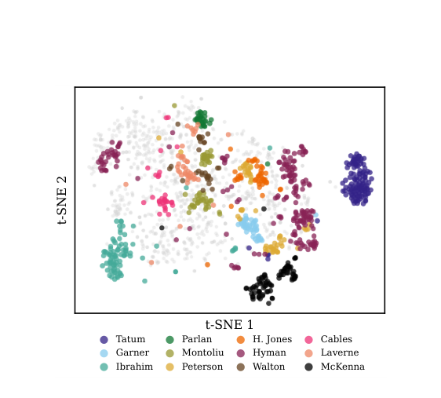

*Results / analysis - Figure 6. Characteristic region detection for Art Tatum, “Sophisticated Lady.” Top: within-track z-score of the classifier’s logit margin; red fill marks confidence above the track average, blue below. Bottom: piano rolls of the most (left, z=1.9) and least (right, z=−1.2) characteristic 15-second regions, notes colored by z-score. The pe*

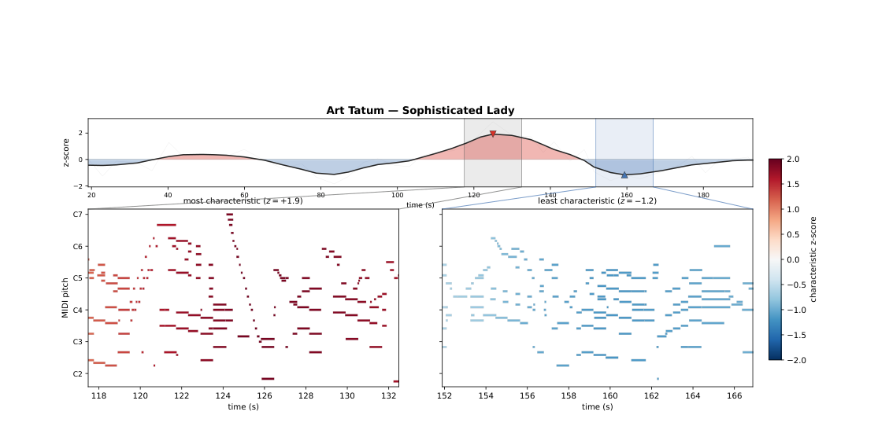

**Why this ranks #8**: Shows a pretrained symbolic-music transformer already encodes artist identity, then exploits it for controllable generation. 87% chunk / 95% song ID from a synthetic-only classifier is a strong validation.

---

### 9. From Isolated Feature to Orbits: Discovering Music Concepts via Multi-SAE Alignment

**arXiv**: [2610.01864](https://arxiv.org/abs/2610.01864) | **Score**: 8.0 (relevance 8 x 0.7 + quality 8 x 0.3) | **Tags**: AIGC-audio | **Categories**: cs.SD, cs.AI | **Pages**: 33

**Authors**: Liwei Lin, Gus Xia

**Affiliation**: Computer Science Department, NYU Shanghai | Machine Learning Department, MBZUAI

**Abstract**

> How can we understand what a music foundation model has learned \textit{internally}? Most interpretability approaches, such as probing and Sparse Autoencoders (SAEs), focus on identifying individual features with minimal structural assumptions. We argue that many concepts are better understood as \textit{structured relations} rather than isolated features. This is especially prominent in music, where tonal structures are organized in the space of pitch and time. For example, concepts such as chords or keys are naturally expressed as structured sets (e.g., the 12 transpositions of a chord or the diatonic system within a key), rather than isolated features. In this study, \textbf{we shift from feature identification to structure-based analysis}, asking whether the learned inner representations of music foundation model emerge as organized structures over features. To this end, we introduce a framework that uses pitch transposition as an inductive bias to induce ordered orbits via multi-view SAE alignment. Concretely, we generate pitch-shifted input pairs and align their SAE representations to discover structured groups of pitch-related features. Experimental results show that this approach recovers orbit structures corresponding to chords, keys, and melodic patterns across two state-of-the-art music foundation models, while requiring only minimal grounding (e.g., a few anchor examples) to interpret entire concept families.

**Key findings**

- **Finding**: Argues many music concepts are better understood as **structured relations** rather than isolated features - chords and keys are naturally expressed as structured sets (12 transpositions of a chord, the diatonic system within a key) rather than single features.

- **Finding**: Introduces a framework using pitch transposition as an inductive bias to induce ordered orbits via multi-view SAE alignment: generate pitch-shifted input pairs and align their SAE representations to discover structured groups of pitch-related features.

- **Finding**: Recovers orbit structures corresponding to chords, keys and melodic patterns across two state-of-the-art music foundation models, requiring only minimal grounding (a few anchor examples) to interpret entire concept families.

**Key figures**

*Results / analysis - Figure 1: Recovered orbits over SAE features (left) and orbit recovery via two aligned SAEs (right). The i-th feature in SAE-2 is the one-semitone-up version of the i-th feature in SAE-1. We pair each feature i in SAE-2 with its semantically closest counterpart in SAE-1, measured by decoder vector similarity. This semantically matched fea*

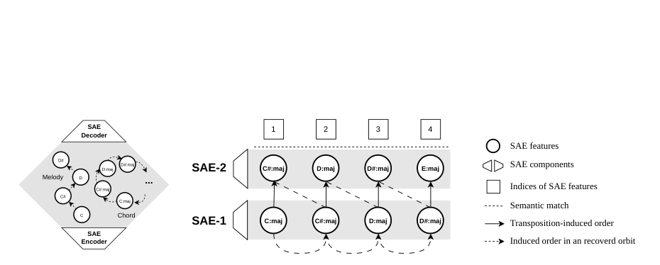

*Results / analysis - Figure 2: Activations of MuQ SAE features extracted from different-key songs, organized according to recovered orbits. The horizontal axis is song time with annotated chord roots. The vertical axis is feature indices. We append the the piano-roll ground truth as the bottom row. Vertical grid lines separate chord segments, and horizontal g*

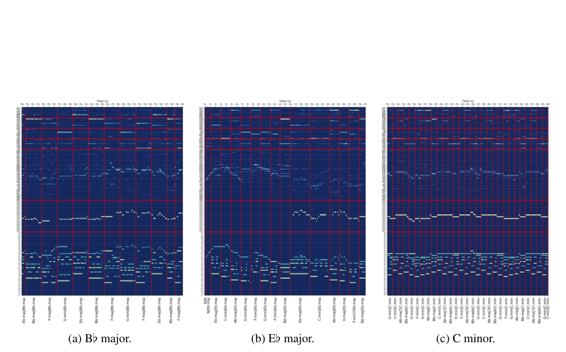

**Why this ranks #9**: Reframes interpretability from feature identification to structure recovery; pitch transposition as inductive bias recovers chord/key orbits. Novel, cheap, applied to two music foundation models.

---

### 10. How Far Back Should a Transformer Look? Repetition and Copying in Music Sequence Models `[wild-card]`

**arXiv**: [2610.02837](https://arxiv.org/abs/2610.02837) | **Score**: 7.3 (relevance 7 x 0.7 + quality 8 x 0.3) | **Tags**: AIGC-audio | **Categories**: cs.SD | **Pages**: 17

**Authors**: Amir Fathi

**Affiliation**: Department of Computing Science | University of Alberta

**Abstract**

> We investigate how predictive performance depends on the maximum context available to an autoregressive model of symbolic music, and what information long-context models exploit. A small causal Transformer is trained separately at each context length T in {6, 18, 48, 96, 192, 336} and evaluated on the same target positions, both over raw tokens and over non-overlapping binary latent codes. On Nottingham folk tunes, the token predictor's test NLL decreases by 71% (0.986 bits per token) between 6 and 336 tokens, and by 71% on the O'Neill's tunes long enough for the same sweep (129 of 302 test tunes). Most of the long-context gain is explained by exact copying: the improvement appears when an earlier occurrence of the target's 16-token history enters the available context; overwriting that occurrence removes the gain, whereas equally large unrelated corruption does not; and a simple copy baseline recovers 94% of the reduction. A trained 336-token model likewise loses most of this gain when its history is restricted to recent tokens at test time. Because many repeats arise from written repeat signs expanded in the score, this result pertains specifically to these rendered score representations. By contrast, on MAESTRO performances and MusicNet scores, where exact repeats are substantially less frequent, the reduction is smaller (9% and 18%) and is largely attained by 96 tokens. Finally, an audit of an earlier draft that reported saturation at 16 tokens identified split leakage, overlapping latent receptive fields, an averaging predictor, and a per-file tempo grid; we present these as methodological checks for context-length measurements.

**Key findings**

- **Finding**: Trains a small causal Transformer separately at each context length T in {6, 18, 48, 96, 192, 336} over symbolic music and evaluates on the same target positions, over raw tokens and over non-overlapping binary latent codes.

- **Finding**: On Nottingham folk tunes, test NLL falls 71% (0.986 bits/token) between T=6 and T=336. **Most of the gain is explained by exact copying**: the improvement appears when an earlier occurrence of the target's 16-token history enters the context; overwriting that occurrence removes the gain, whereas equally large *unrelated* corruption does not; a simple copy baseline recovers 94% of the reduction.

- **Finding**: On MAESTRO performances and MusicNet scores, where exact repeats are far less frequent, the reduction is smaller (9% and 18%) and is largely attained by 96 tokens - so the headline result is specific to rendered score representations with expanded repeat signs.

- **Finding**: Audits an earlier draft that reported saturation at 16 tokens and identifies split leakage, overlapping latent receptive fields, an averaging predictor, and a per-file tempo grid - presented as methodological checks for context-length measurement.

**Key figures**

*Results / analysis - Fig. 2 stratifies Nottingham test NLL by repeat lag. Im- provement appears when the earlier occurrence becomes ac- cessible to the model, rather than before it enters the receptive field. At 6 tokens, the token predictor obtains between 1.24 and 1.81 bits per token across repeat bins. At 192 tokens, NLL decreases to 0.20 bits for repeats*

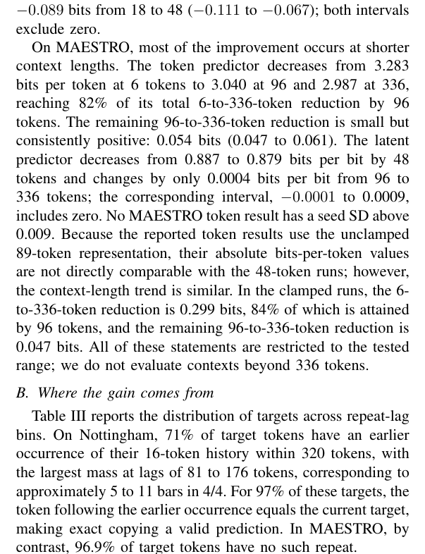

**Why this ranks #10**: Promoted because the negative result is unusually valuable and self-critical: 71% of the long-context gain is exact copying, and the authors post their own split-leakage audit for anyone measuring context length.

---

## Footer

- Total papers scanned across all 7 arXiv categories: **648**
- Papers read in full for this digest: **50**
- aigc_audio track final top-10: **10**
- Wild-cards in this track: **1**
- Figure assets: `2026-10-05/res/` (33 images shared across all 5 tracks)

Generated by the `mine-arxiv-daily-digest` skill. Sister file: `2026-10-05_aigc_audio_entry.md`.
