# ArXiv Daily Digest - 2026-10-05 (AIGC - Image / Video / 3D Generation & Editing, 10 papers)

**Generated**: 2026-10-05 17:30 CST
**Source**: arXiv cs.CV, cs.SD submissions, window 2026-10-01/02 UTC (the latest announced batch as of 2026-10-05)
**Track**: aigc_visual (top 10 of 648 papers scanned)
**Scope**: image/video/3D generation and editing; long-horizon AR video memory; few-step distillation and sampling; generative post-training; generative evaluation

---

This batch is dominated by autoregressive (AR) video generation and its long-horizon memory problem. Four independent papers attack the same underlying failure from different angles: KV entries cached during rollout drift out of distribution (ID-Forcing), detail is lost when objects leave the context window (MosaiChunk), approximation error compounds across coupled denoising trajectories (TRAC), and interactive generation needs *composite* rather than whole-prompt memory (Weave Forcing). A second thread is efficiency: VDOT++ reformulates optimal-transport distillation for one-condition-many-output tasks, and AREX derives a matrix-valued affine propagator for few-step flow-matching sampling. Two papers push the physics axis in opposite directions - OuroReward applies RL to text-to-3D, while TerraVis argues the evaluation metrics themselves miss world-consistency failures. The standalone pick is the Arena post-training paper, the only one shipping a frontier T2I recipe with a public reward dataset.

---

## Top 10 - AIGC - Image / Video / 3D Generation & Editing

### 1. Post-Training Frontier Text-to-Image Models by Composing Preference and Rubric Rewards

**arXiv**: [2610.02967](https://arxiv.org/abs/2610.02967) | **Score**: 9.7 (relevance 10 x 0.7 + quality 9 x 0.3) | **Tags**: AIGC-image, rlhf | **Categories**: cs.CV, cs.AI | **Pages**: 19

**Authors**: Yuanhao Ban, I-Hung Hsu, Anastasios Angelopoulos, Wei-Lin Chiang, Ion Stoica, Cho-Jui Hsieh

**Affiliation**: Arena Intelligence Inc

**Abstract**

> Recent text-to-image generation models have achieved remarkable visual quality, but improving them through post-training remains challenging because no single reward signal captures the full range of human preference. In this work, we develop a simple and effective post-training recipe for open-domain text-to-image generation based on the composition of complementary reward signals. Our reward system consists of two main components: a preference reward, trained on large-scale human preference data using a Bradley-Terry objective to capture overall human aesthetic and perceptual preferences, and rubric-based rewards, which explicitly evaluate prompt faithfulness and other desirable properties while providing safeguards against reward hacking. A key challenge is how to combine these heterogeneous reward signals. We show that a naive weighted average leads to suboptimal optimization behavior, and propose a simple reward composition strategy that more effectively balances preference optimization with rubric satisfaction. In the Arena text-to-image leaderboard (https://arena.ai/), our RL-trained Flux2dev achieves an Elo rating 69 points above the base model, and our post-trained Ideogram-4 surpasses every open-source model on the leaderboard, reaching an Elo of 1223.5. (Claims of state-of-the-art performance are based on the Arena leaderboard snapshot as of September 4, 2026.) Our results suggest that effective rewards for frontier generative-model training require broad coverage of user intent and robustness to exploitation under optimization. To support reproducible research, we release Arena-T2I-Training, a 1K subset of training data that recovers some gains of full-scale training, providing a resource that we hope will facilitate future work on post-training for text-to-image models.

**Key findings**

- **Finding**: Composes two heterogeneous reward signals for T2I post-training - a preference reward trained with a Bradley-Terry objective on large-scale human preference data, and rubric-based rewards that score prompt faithfulness and act as a safeguard against reward hacking.

- **Finding**: Shows a naive weighted average of the two reward types yields suboptimal optimization, and proposes an explicit reward *composition* strategy instead of aggregation.

- **Finding**: The RL-trained Flux2dev reaches an Elo rating 69 points above its base model; the post-trained Ideogram-4 reaches Elo 1223.5, surpassing every open-source model on the Arena text-to-image leaderboard (snapshot of 2026-09-04).

- **Recommendation**: Read if you are doing generative-model post-training. Releases the Arena-T2I-Training 1K subset, which partially recovers full-scale training gains and makes the recipe reproducible at small scale.

**Key figures**

*Results / analysis - Figure 1. Visualization. Preference-only training drifts toward generic embellishment and ignores requested content; faithfulness-only training washes out detail and drops requested style and scenery; Arena-T2I-Hard recovers the requested elements but keeps unrequested decoration; the ungated constraint flattens detail even where the prom*

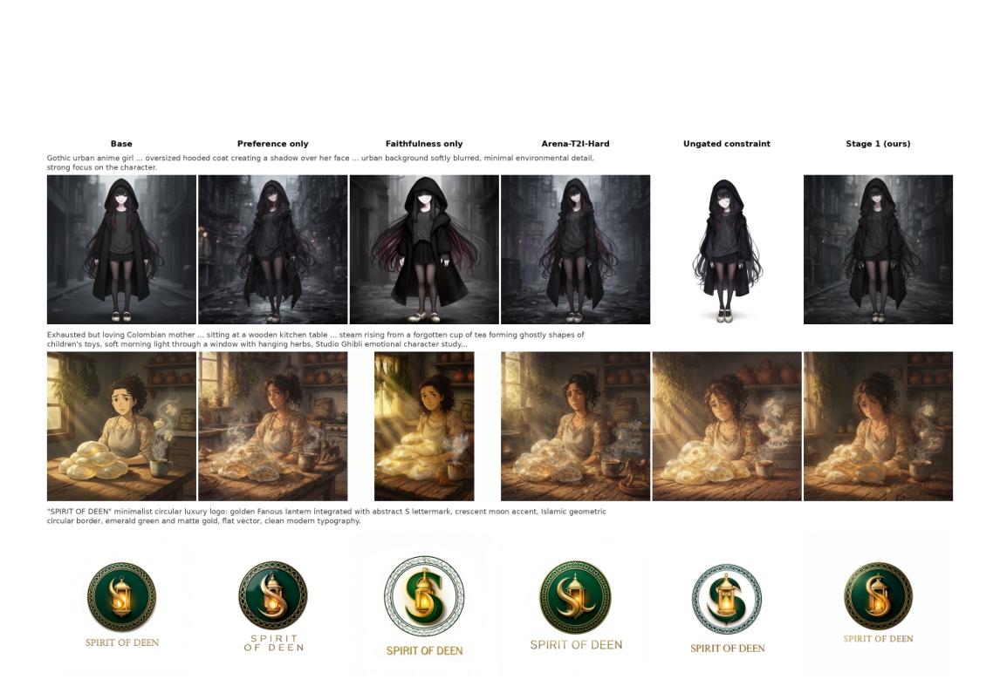

**Why this ranks #1**: Only paper in the batch that ships a frontier T2I post-training recipe with a public reward dataset; Arena Elo 1223.5 beats every open model. The naive-averaging-fails finding is the transferable part.

---

### 2. VDOT++: Unified Few-Step Video Generation via Unbalanced Optimal Transport Distillation

**arXiv**: [2610.03221](https://arxiv.org/abs/2610.03221) | **Score**: 9.4 (relevance 10 x 0.7 + quality 8 x 0.3) | **Tags**: AIGC-video | **Categories**: cs.CV | **Pages**: 18

**Authors**: Yutong Wang, Xingtong Ge, Enhuai Liu, Yunke Wang, Tianfan Xue, Yu Qiao, Yaohui Wang, Xinyuan Chen, Chang Xu

**Affiliation**: University of Sydney. | Shanghai AI Laboratory. | Xingtong Ge is with the Hong Kong University of Science and Technology. | Tianfan Xue is with the Chinese University of Hong Kong.

**Abstract**

> Video creation spans text-to-video (T2V), image-to-video (I2V), and condition-based generation, yet video diffusion models remain costly because they repeatedly evaluate large backbones during sampling. Distribution matching distillation (DMD) reduces this cost, but its reverse Kullback--Leibler (KL) objective can provide unstable or incomplete guidance when the student and teacher distributions have limited overlap. VDOT addressed this issue by adding optimal transport distillation (OTD), whose explicit coupling supplies geometric directions for condition-based generation. Balanced OTD, however, performs full-mass matching between the spatial tokens of each corresponding student--teacher frame pair. This assumption weakens for T2V and I2V, where one condition admits many valid outputs and spatial content need not align across different realizations. We present VDOT++, a unified distillation framework that applies the same training recipe separately to generators for the three task families. It makes OTD robust to output diversity through an asymmetric unbalanced formulation that allows unreliable student tokens to carry less mass while maintaining coverage of the teacher tokens. An $\ell_1$ ground cost further replaces mean-based aggregation with a more mode-preserving weighted median that limits the influence of distant transport targets. The two changes respectively determine whom to match and how the selected targets should be aggregated. We additionally combine distribution matching and adversarial refinement through sequential backward passes, and exploit the decoupled score networks for cross-scale distillation, where larger score networks improve a compact generator. Experiments on UVCBench, VBench, VBench-I2V, and the VACE benchmark show that the resulting four-step generators are competitive with many-step teachers and strong few-step baselines across all three task families.

**Key findings**

- **Finding**: Identifies that balanced optimal-transport distillation fails for T2V and I2V, where one condition admits many valid outputs so spatial tokens need not align across different realizations.

- **Finding**: Proposes an asymmetric *unbalanced* OTD formulation that lets unreliable student tokens carry less mass while still covering the teacher tokens - determining *whom* to match.

- **Finding**: Replaces mean-based cost aggregation with an L1 ground cost and a mode-preserving weighted median - determining *how* selected targets are aggregated.

- **Finding**: Adds cross-scale distillation from larger score networks into a compact generator, and combines distribution matching with adversarial refinement through sequential backward passes. Four-step generators are competitive with many-step teachers on UVCBench, VBench, VBench-I2V and VACE.

**Key figures**

*Results / analysis - Fig. 2: Symmetric versus asymmetric unbalanced OT. Under balanced OT, the hard student marginal gives ri/ui = 1 for every token, producing a uniformly yellow map that cannot distinguish reliable from unreliable student tokens. With the frames, latent features, and ground costs fixed, symmetric UOT relaxes both marginals using (τs, τt) = (*

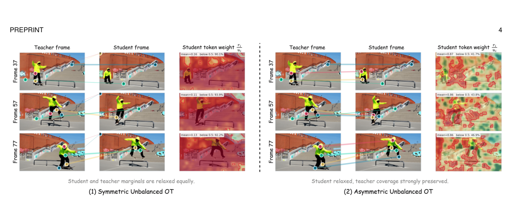

*Framework / architecture - Fig. 3: Overview of VDOT++. Top: Given the conditioning signal, the few-step generator is jointly optimized by the DMD score-difference loss, frame-wise optimal-transport matching, and an adversarial loss through two sequential backward passes followed by one optimizer step. Bottom: The OT diagrams show one paired temporal frame. For clar*

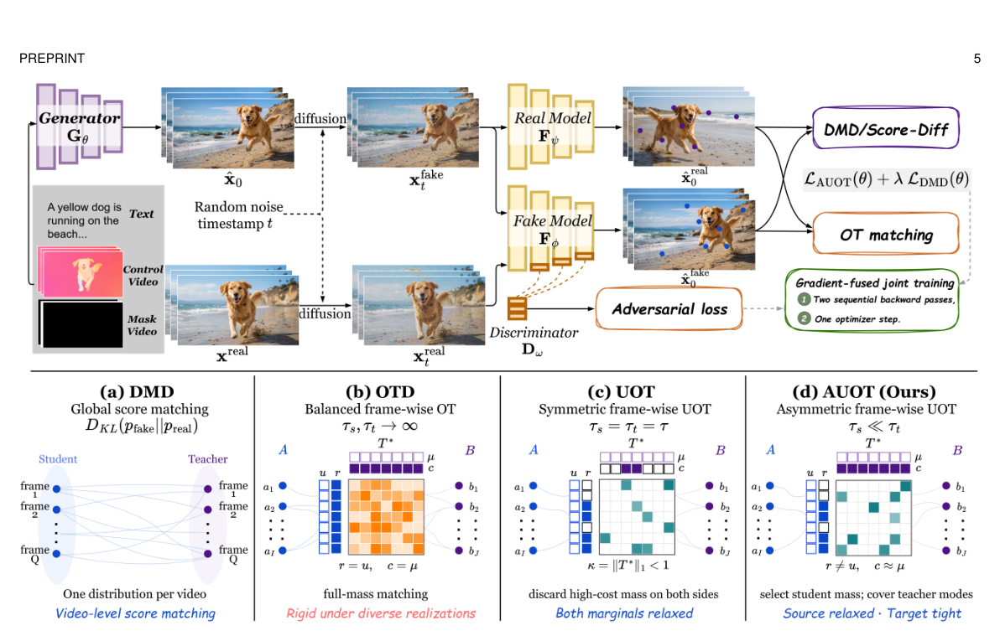

**Why this ranks #2**: Unbalanced OTD + weighted-median aggregation fixes DMD's overlap assumption precisely where it breaks. One training recipe covers three task families.

---

### 3. In-Distribution Forcing for Long Video Generation at Test Time

**arXiv**: [2610.03120](https://arxiv.org/abs/2610.03120) | **Score**: 9.3 (relevance 10 x 0.7 + quality 8 x 0.3) | **Tags**: AIGC-video | **Categories**: cs.CV | **Pages**: 15

**Authors**: Jeongwoo Shin, Youngyoon Choi, Sangwoo Jo, Hyunmog Kim, Sungjoon Choi, Joonseok Lee, Jaewoong Choi, Jaemoo Choi

**Affiliation**: Seoul National University, 2Korea University | Sungkyunkwan University, 4Georgia Institute of Technology | @korea.ac.kr

**Abstract**

> Modern autoregressive (AR) video diffusion models excel at short-horizon video generation, yet generating long videos remains challenging due to drifting, where colors and textures shift, and motion dynamics decay. Existing works primarily rely on KV conditioning, which selects or modifies cached key-value (KV) entries to mitigate drifting. However, we observe that KV conditioning alone is insufficient as it assumes cached KV entries remain in-distribution. This assumption fails beyond the training horizon: nothing constrains the construction of KV entries during rollout, giving rise to the KV-provenance problem where cached entries themselves become out-of-distribution (OOD). To address this, we propose In-Distribution Forcing (ID-Forcing), a test-time framework that aligns both KV caching and KV conditioning with training configurations. Its key mechanism, self-caching, prevents OOD KV entries at their source. Each chunk is cached without attending to prior KV entry, keeping the rolling window exactly in-distribution. Consequently, ID-Forcing seamlessly extends short-horizon models to minute-scale video generation. Extensive evaluations show that our method remains competitive on standard video generation benchmark while substantially outperforming prior work in mitigating drifting, as validated by both our drift metrics and a user study.

**Key findings**

- **Finding**: Names the **KV-provenance problem** - existing KV conditioning assumes cached KV entries stay in-distribution, but beyond the training horizon nothing constrains how rollout KV entries are built, so they themselves become OOD.

- **Finding**: Proposes In-Distribution Forcing, a test-time framework aligning both KV caching and KV conditioning with training configurations. Its mechanism is *self-caching*: each chunk is cached without attending to prior KV entries, keeping the rolling window exactly in-distribution at its source.

- **Finding**: Extends short-horizon autoregressive video models to minute-scale generation, remaining competitive on standard benchmarks while substantially outperforming prior work on drift, validated by drift metrics and a user study.

**Key figures**

*Results / analysis - Figure 1: ID-Forcing extends autoregressive video generation far beyond the training horizon. In- distribution KV operations suppress color and motion drift, enabling stable minute-scale generation.*

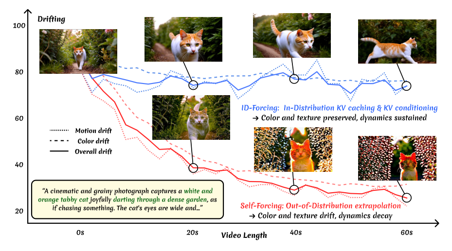

*Results / analysis - Figure 2: Same conditioning, different provenance. We generate the next chunk x7 from the same conditioning window κ1:6, varying only how the last chunk of the horizon, x6, is cached into κ6. Case 1 (self-caching): x6 attends to no prior entry, and x7 shows no drifting. Case 2 (self-forcing caching): x6 attends to a window never seen in t*

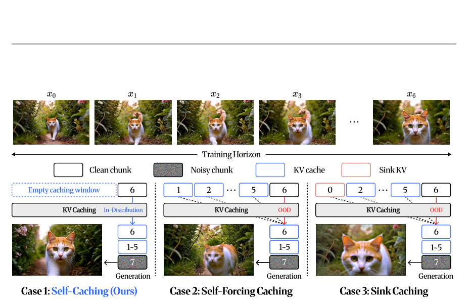

**Why this ranks #3**: Names and fixes the KV-provenance problem - the framing that cached KV go OOD at rollout. Training-free, minute-scale, user-study validated.

---

### 4. Parasitic Co-Denoising: Unlocking 3D Human Motion Generation in a Frozen Video Diffusion Model

**arXiv**: [2610.03047](https://arxiv.org/abs/2610.03047) | **Score**: 9.3 (relevance 10 x 0.7 + quality 8 x 0.3) | **Tags**: AIGC-3D, AIGC-video | **Categories**: cs.CV | **Pages**: 9

**Authors**: Yunjiao Zhou, Junlang Qian, Lihua Xie, Jianfei Yang

**Affiliation**: Nanyang Technological University, Singapore

**Abstract**

> Despite never being supervised on explicit 3D motion, large-scale text-to-video diffusion models synthesize realistic human motion in their generated videos. We ask whether this implicit knowledge can be turned into explicit 3D motion generation, without training a separate motion model. Probing a frozen Wan2.1 reveals that a recoverable motion signal is present in its intermediate states across the entire denoising schedule, not confined to the clean output. Motivated by this, we introduce parasitic co-denoising, a paradigm in which motion is decoded from the host model along its denoising schedule rather than produced by an independent generator. We instantiate it as the Parasitic Motion Decoder (PMD), an efficient flow-matching decoder that shares the host's noise schedule and reads its intermediate features through a $σ$-adaptive multi-layer fusion, leaving the host unmodified. Drawing its coverage from the host rather than from motion data, PMD leads dedicated motion generators on text-motion alignment at a small fraction of their trainable parameters, while producing paired video and motion in a single pass that motion-only baselines cannot match.

**Key findings**

- **Finding**: Probing a frozen Wan2.1 text-to-video model shows a recoverable motion signal is present in its intermediate states across the *entire* denoising schedule, not confined to the clean output - despite the model never being supervised on explicit 3D motion.

- **Finding**: Introduces **parasitic co-denoising**, a paradigm where motion is decoded from a host model along its denoising schedule rather than produced by an independent generator.

- **Finding**: Instantiates it as the Parasitic Motion Decoder (PMD), a flow-matching decoder sharing the host's noise schedule and reading intermediate features through a $\alpha$-adaptive multi-layer fusion, leaving the host unmodified.

- **Finding**: PMD leads dedicated motion generators on text-motion alignment at a small fraction of their trainable parameters, while producing paired video *and* motion in a single pass that motion-only baselines cannot match.

**Key figures**

*Results / analysis - Figure 1: Motion is decodable from a frozen video diffusion model at every step of its denoising trajectory. Cross-modal retrieval top-1 accuracy between the Wan2.1 video velocity and paired 3D motion at each noise level σ, against a held-out pool of 400 candidates (chance = 0.25%), compared with HY-Motion, a large-scale flow-matching mod*

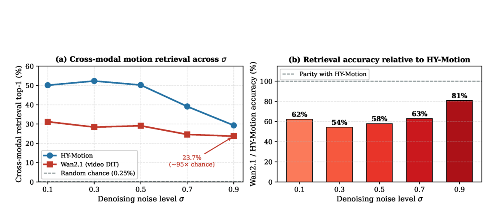

*Framework / architecture - Figure 2: The structure of Parasitic Motion Decoder (PMD).*

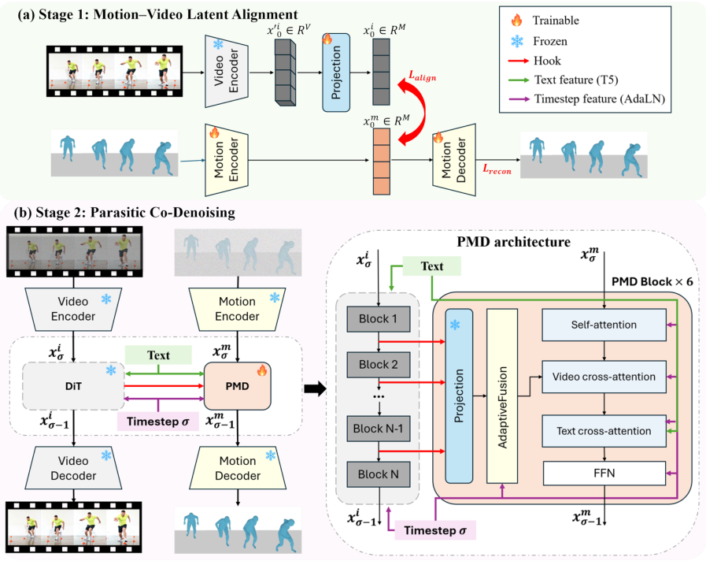

**Why this ranks #4**: Extracts explicit 3D motion from a frozen text-to-video model's intermediate states - a new paradigm rather than a new motion model. Produces paired video and motion in one pass.

---

### 5. MosaiChunk: Compositing Spatio-Temporal Memory for Autoregressive Video Generation

**arXiv**: [2610.02153](https://arxiv.org/abs/2610.02153) | **Score**: 9.0 (relevance 9 x 0.7 + quality 9 x 0.3) | **Tags**: AIGC-video | **Categories**: cs.CV, cs.GR | **Pages**: 27

**Authors**: Yiwen Zhang, Haocheng Xi, Michael Tian-Yue Liu, Alexei A. Efros, Hadar Averbuch-Elor, Qianqian Wang, Haiwen Feng

**Affiliation**: Cornell University | University of California, Berkeley | Harvard University | ∗Part of the work done during an internship at Impossible Inc.

**Abstract**

> Long-horizon autoregressive video generation is limited by a finite context window. When an object or scene falls out of context, its fine-grained visual details may be lost and difficult to recover upon reappearance. To retain access to such visual details, we introduce MosaiChunk, a spatio-temporal memory mechanism that composes a mosaic of selected historical key-value (KV) entries across space and time. Our approach is motivated by the observation that a frozen video generator can directly consume such non-contiguous historical KV and recover the corresponding visual content. We therefore keep the generator fixed and learn only a lightweight router that determines which historical sections to include in the mosaic under a fixed active-memory budget. We further introduce RememBench, a benchmark of long-horizon revisits with prompt-driven text-to-video (T2V) and camera-driven image-to-video (I2V) splits. Our experiments show that MosaiChunk consistently improves revisit consistency over both sliding-window inference and whole-chunk retrieval under matched memory budgets, across both T2V and I2V settings.

**Key findings**

- **Finding**: Long-horizon AR video loses fine visual detail when an object leaves the finite context window. MosaiChunk composes a **mosaic of selected historical KV entries across space and time**.

- **Finding**: Motivated by the observation that a frozen video generator can directly consume non-contiguous historical KV and recover the corresponding visual content - so the generator stays fixed and only a lightweight router is learned, deciding which historical sections enter the mosaic under a fixed active-memory budget.

- **Finding**: Introduces **RememBench**, a benchmark of long-horizon revisits with prompt-driven T2V and camera-driven I2V splits.

- **Finding**: MosaiChunk consistently improves revisit consistency over sliding-window inference and whole-chunk retrieval under matched memory budgets, in both T2V and I2V settings.

**Key figures**

*Results / analysis - Figure 1: In text-to-video generation, prompts like “Close the tin, then reopen it.” illustrate a well- known problem: once a frame (e.g. tin with cookie) is dropped from the context sliding window, its contents are forgotten and must be hallucinated (top). We introduce MosaiChunk (bottom), a spatio- temporal memory mechanism that conditi*

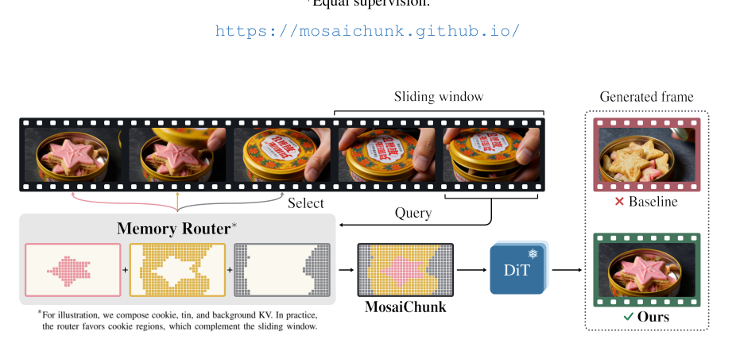

*Results / analysis - Figure 5: T2V revisits at a two-chunk far-memory budget. Rows (Base, MoC, and Ours) share the prompt and noise within each scene. The first and last columns show the departure and revisit frames selected for evaluation. Only MosaiChunk preserves the vegetables and their arrangement (top) and the cupboard’s contents (bottom).*

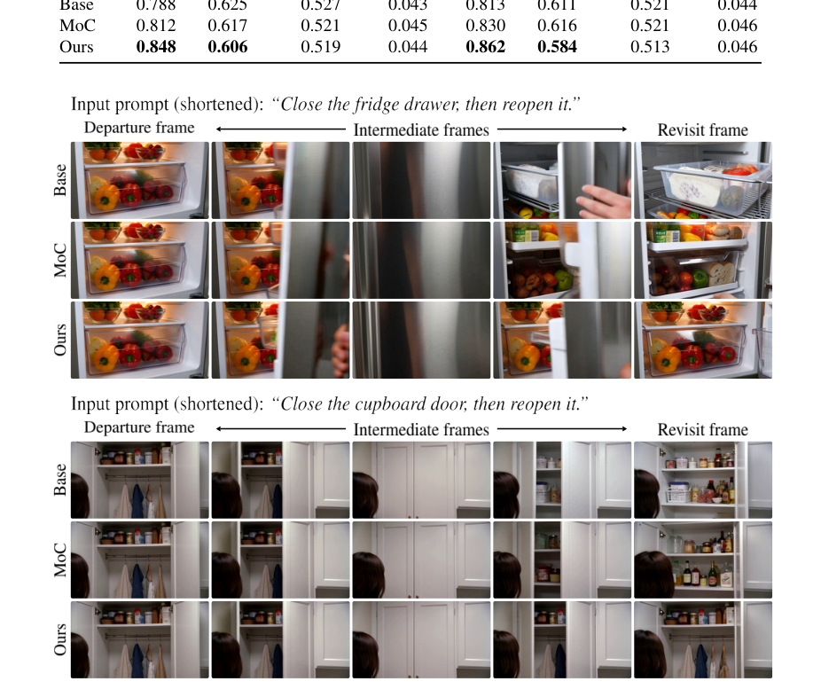

**Why this ranks #5**: Learned lightweight router over a mosaic of non-contiguous historical KV; ships RememBench. Revisit consistency is the right problem for long-horizon AR.

---

### 6. TerraVis: Towards Evaluation of World-Grounded Visual Consistency in Text-to-Image Generation via MLLM Workflows

**arXiv**: [2610.02959](https://arxiv.org/abs/2610.02959) | **Score**: 9.0 (relevance 9 x 0.7 + quality 9 x 0.3) | **Tags**: AIGC-image | **Categories**: cs.CV | **Pages**: 29

**Authors**: Shuai Fu, Jing Gu, Jian Zhou, Zicheng Duan, Gengze Zhou, Qi Wu

**Affiliation**: AIML, Adelaide University | Responsible AI Research Centre

**Abstract**

> Recent text-to-image models have made substantial progress in photorealism, aesthetics, and text-image alignment. Yet visually appealing images can still violate real-world plausibility, exhibiting malformed object structures, impossible anatomy, physically implausible interactions, or inconsistent spatial relationships. Such failures are not well captured by existing fidelity, aesthetics, preference, or alignment metrics. To address this gap, we introduce TerraVis, a framework for evaluating world-grounded visual consistency in generated images. TerraVis defines a structured taxonomy of world-consistency violations spanning object-, interaction-, and scene-level failures, and employs a multi-stage evaluation framework to identify and quantify them. Given an image, TerraVis first uses an MLLM to assess its eligibility for evaluation, then detects violations across 18 taxonomy-defined types and classifies them as minor or major to derive an overall world-consistency score. Across diverse open-source and proprietary text-to-image models on two widely used benchmarks, TerraVis achieves the strongest correlation with human judgments of world consistency among existing metrics. Our benchmark results further show that models that achieve strong performance on conventional metrics can still exhibit substantial world-consistency failures. These findings highlight world consistency as a complementary evaluation dimension and demonstrate that TerraVis enables systematic quantification, diagnosis, and comparison of such failures. Our code is publicly available at https://github.com/ShyFoo/TerraVis.

**Key findings**

- **Finding**: Argues that photorealistic-looking T2I output can still violate real-world plausibility - malformed object structures, impossible anatomy, physically implausible interactions, inconsistent spatial relations - and that fidelity, aesthetics, preference and alignment metrics do not capture this.

- **Finding**: Defines a structured taxonomy of world-consistency violations spanning object-, interaction- and scene-level failures (18 taxonomy-defined types), and a multi-stage MLLM evaluation framework: first assess eligibility, then detect violations, then classify each as minor or major to derive an overall score.

- **Finding**: Across diverse open-source and proprietary T2I models on two widely used benchmarks, TerraVis achieves the strongest correlation with human judgments of world consistency among existing metrics.

- **Recommendation**: Read alongside the physics-diagnosis papers in this batch (PhysicsLENS, 'Does Physics Live in the Activations?') - all three independently report that conventional metrics miss physical failure. Code is public.

**Key figures**

*Framework / architecture - Figure 2: Overview of the TerraVis world-consistency violation taxonomy. TerraVis organizes world- consistency violations into three levels: object-level, interaction-level, and scene-level violations. The example images illustrate representative violation types within each level. Red ellipses indicate the regions where the corresponding*

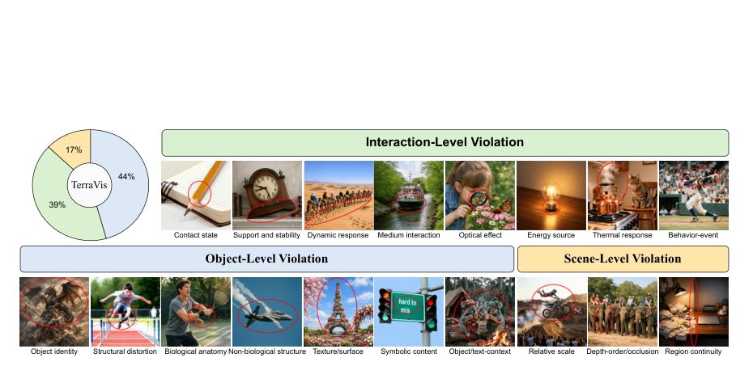

**Why this ranks #6**: 18-type world-consistency taxonomy with the strongest reported human correlation; directly addresses the gap that multiple papers in this batch expose. Code public.

---

### 7. OuroReward: Sequential Reward Scheduling for Reinforcement Learning in Text-to-3D Generation

**arXiv**: [2610.03423](https://arxiv.org/abs/2610.03423) | **Score**: 8.7 (relevance 9 x 0.7 + quality 8 x 0.3) | **Tags**: AIGC-3D, rl-algorithm | **Categories**: cs.CV | **Pages**: 17

**Authors**: Bingyang Cui, Yujie Zhang, Yiling Xu, Yunfeng Guan

**Affiliation**: Shanghai Jiao Tong University

**Abstract**

> Reinforcement learning (RL) for Text-to-3D (T23D) generation requires optimization across multiple quality dimensions such as semantic alignment and texture clarity. Existing methods typically optimize these dimensions simultaneously through multiple reward aggregation, without explicitly modeling inter-dimension dependencies. This can cause imbalanced optimization and persistent interference among conflicting dimensions. To address this limitation, we propose OuroReward, an interference-aware sequential reward scheduling strategy for T23D RL. OuroReward first estimates pairwise dependencies among dimensions and constructs a cyclic optimization path that minimizes cumulative interference. By incorporating the tail-to-head dependency, the cycle captures global compatibility across the entire schedule. Then, OuroReward converts the cycle into a one-pass sequence, and starts optimization from the dimension with the lowest aggregate interference. Rather than assigning a fixed optimization budget to each dimension-wise reward, training adaptively determines when to advance to the next reward according to the remaining optimization headroom of the current one. We further introduce AdaSelect, an adaptive prompt selection strategy that identifies reliable and informative prompts aligned with the model's current capability. By focusing policy updates on these prompts, AdaSelect effectively improves training stability. Extensive experiments across different T23D models and RL algorithms demonstrate that our framework consistently improves generation quality across multiple dimensions.

**Key findings**

- **Finding**: Text-to-3D RL typically optimizes semantic alignment, texture clarity and other dimensions *simultaneously* through reward aggregation, without modelling inter-dimension dependencies - causing imbalanced optimization and persistent interference.

- **Finding**: OuroReward estimates pairwise dependencies among dimensions and constructs a **cyclic optimization path** minimizing cumulative interference; the tail-to-head dependency makes the cycle capture global compatibility across the entire schedule. The cycle is then converted into a one-pass sequence started from the dimension with the lowest aggregate interference.

- **Finding**: Rather than a fixed per-dimension budget, training adaptively decides when to advance to the next reward from the current dimension's remaining optimization headroom.

- **Finding**: Adds AdaSelect, an adaptive prompt selection strategy identifying reliable, informative prompts aligned with current model capability, which improves training stability.

**Key figures**

*Framework / architecture - Fig. 1: (a) Representative failure cases produced by different T23D generation models. (b) Comparison of gradient discrep- ancy and reward-change conflict ratio between a conflicting dimension pair (G↔T) and a compatible dimension pair (A↔O) under the default reward-averaging strategy. A, G, T, and O denote four quality dimensions includi*

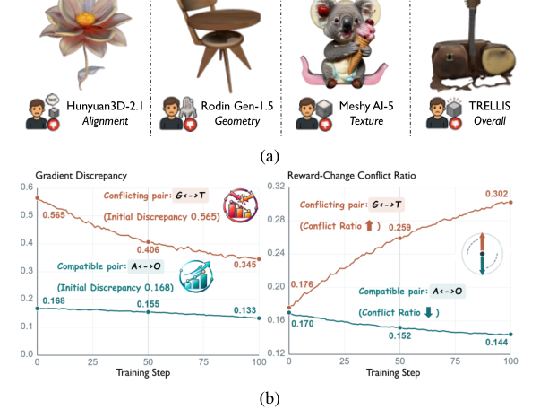

**Why this ranks #7**: Explicitly models inter-dimension interference and schedules rewards cyclically - a real gap in T23D RL where multi-reward aggregation is usually unexamined.

---

### 8. AREX: Affine-Residual Exponential Integrator for Few-Step Sampling in Flow Matching

**arXiv**: [2610.03483](https://arxiv.org/abs/2610.03483) | **Score**: 8.7 (relevance 9 x 0.7 + quality 8 x 0.3) | **Tags**: AIGC-image | **Categories**: stat.ML, cs.AI, cs.LG | **Pages**: 53

**Authors**: Shizheng Lin, Soon Hoe Lim, N. Benjamin Erichson

**Affiliation**: Department of Mathematics, KTH Royal Institute of Technology | Nordita, KTH Royal Institute of Technology and Stockholm University | International Computer Science Institute | Lawrence Berkeley National Laboratory

**Abstract**

> We introduce AREX, a training-free sampler for pretrained flow matching models that uses the target mean and covariance to capture an analytically tractable part of the sampling dynamics. We show that the velocity field of the moment-matched Gaussian target is the $L^2$-optimal affine approximation to the marginal velocity field. This motivates decomposition of the learned dynamics into an affine component over the whole sampling path, determined by the first two target moments, and a neural residual term. AREX keeps the affine component and integrates it using an explicit matrix-valued propagator. In turn, we only require to integrate over the residual term. This differs from scalar exponential integrators, which analytically handle only isotropic linear dynamics. Across image and text-to-image generation tasks, AREX consistently improves sample fidelity in the few-step sampling regime without retraining the underlying model.

**Key findings**

- **Finding**: Shows the velocity field of the moment-matched Gaussian target is the $L^2$-optimal affine approximation to the marginal velocity field, motivating decomposition of learned dynamics into an affine component over the whole sampling path plus a neural residual term.

- **Finding**: AREX keeps the affine component and integrates it with an explicit **matrix-valued propagator**, so only the residual term requires numerical integration.

- **Finding**: This differs from scalar exponential integrators, which can only analytically handle isotropic linear dynamics.

- **Finding**: Training-free; consistently improves sample fidelity in the few-step regime across image and text-to-image generation without retraining the underlying model.

**Key figures**

*Results / analysis - Figure 1 Few-step text-to-image generation with AREX. Qualitative samples from the pretrained FLUX.1-dev model using AREX-C with only 8 network evaluations. AREX analytically propagates the moment-matched affine component of the learned flow and numerically integrates only the residual. All samples are generated without retraining the mod*

*Results / analysis - Algorithm 1 summarizes AREX-ABp; AREX-C extends it to conditional sampling (see App. B).*

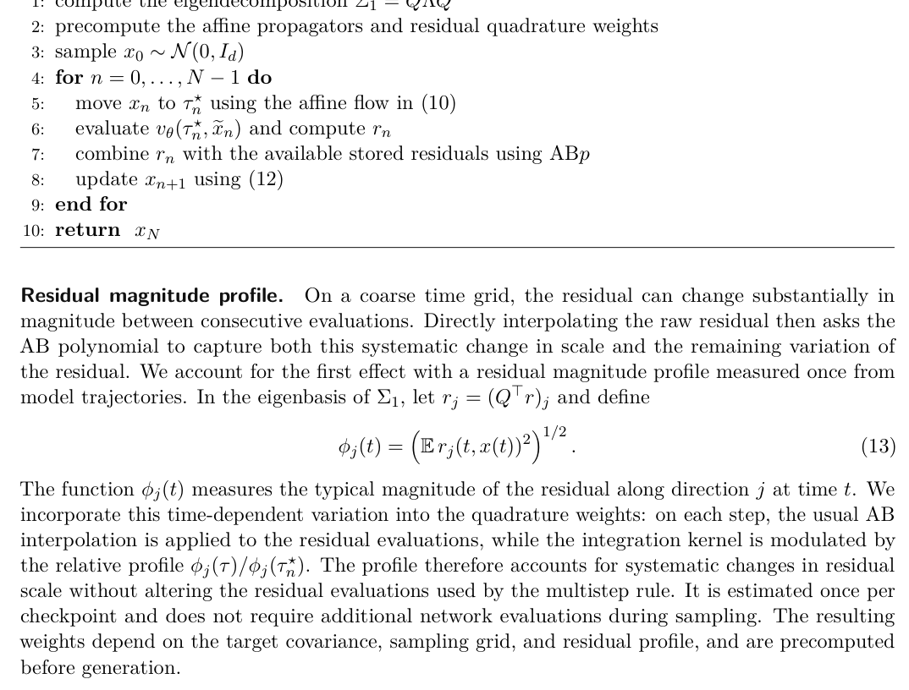

**Why this ranks #8**: Derives the moment-matched Gaussian velocity as the L2-optimal affine approximation and integrates it with a matrix-valued propagator. Training-free, applies to any flow model.

---

### 9. TRAC: Trajectory-aware Reuse and Adaptive Correction for Efficient Autoregressive Video Generation

**arXiv**: [2610.02779](https://arxiv.org/abs/2610.02779) | **Score**: 8.6 (relevance 9 x 0.7 + quality 8 x 0.3) | **Tags**: AIGC-video | **Categories**: cs.CV | **Pages**: 22

**Authors**: Jiaxing Song, Weiqi Yan, You Huang, Mingte Qiu, Huazhong Liu, Xiaofeng Zhu, Yunshan Zhong

**Affiliation**: School of Computer Science and Technology, Hainan University | MAC Lab, Department of Artificial Intelligence, School of Informatics, Xiamen University | Zhejiang Normal University, Jinhua, China

**Abstract**

> In this paper, we present trajectory-aware reuse and adaptive correction (TRAC), a training-free framework for efficient autoregressive (AR) video generation. Existing acceleration methods mainly target single-trajectory generation with bidirectional attention. AR video generation, by contrast, sequentially couples chunk-level denoising trajectories. Consequently, approximation errors accumulate and propagate through the generation process. TRAC addresses this challenge with three components, including robust cumulative scheduling (RCS), autoregressive trajectory-aware guidance scheduling (ATGS), and spectral structure correction (SSC). RCS selects cache reuse schedules by cumulative rollout error and cross-chunk/prompt variation. ATGS coordinates CFG refreshes along the global AR trajectory. SSC restores low-frequency structure of the first chunk to correct long-term structural loss. Experiments on SkyReels-V2 and FramePack-F1 show that, compared with existing methods, TRAC achieves both the highest inference efficiency and the best generation quality for AR video generation.

**Key findings**

- **Finding**: Argues AR video acceleration differs from single-trajectory bidirectional generation: AR sequentially couples chunk-level denoising trajectories, so **approximation errors accumulate and propagate** through the generation process.

- **Finding**: TRAC is training-free, with three components - robust cumulative scheduling (RCS) selecting cache-reuse schedules by cumulative rollout error and cross-chunk/prompt variation; autoregressive trajectory-aware guidance scheduling (ATGS) coordinating CFG refreshes along the global AR trajectory; and spectral structure correction (SSC) restoring low-frequency structure of the first chunk.

- **Finding**: On SkyReels-V2 and FramePack-F1, TRAC achieves both the highest inference efficiency and the best generation quality among compared AR video methods.

**Key figures**

*Results / analysis - Figure shown on p.4 of the paper.*

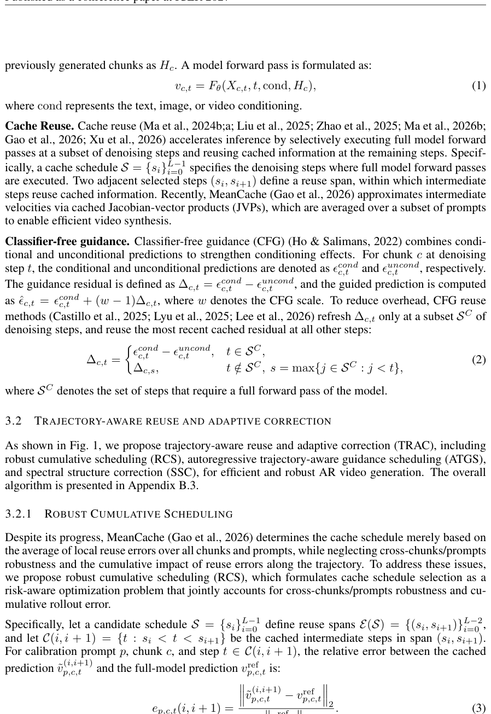

*Results / analysis - Figure 2: Cumulative rollout error (ver- tical) versus frame index (horizontal), with error accumulated from frame-wise out- put RMSE. Curves compare MeanCache and our RCS, averaged over 30 prompts randomly sampled from VBench using SkyReels-V2-1.3B-540P. Shaded regions in- dicate the standard error of the mean, and vanilla outputs serve*

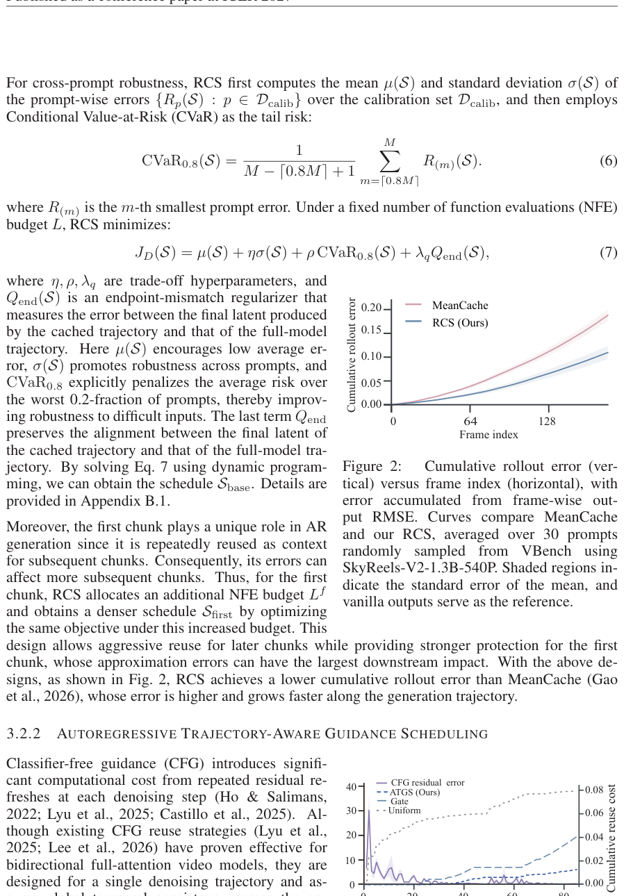

**Why this ranks #9**: Treats AR video acceleration as a coupled trajectory problem (cumulative rollout error, not per-step error). Training-free, measured against two different AR backbones.

---

### 10. Weave Forcing: Compositional Memory Routing for Interactive Long Video Generation `[wild-card]`

**arXiv**: [2610.03510](https://arxiv.org/abs/2610.03510) | **Score**: 8.6 (relevance 9 x 0.7 + quality 8 x 0.3) | **Tags**: AIGC-video | **Categories**: cs.CV, cs.AI | **Pages**: 24

**Authors**: Ziyi Wang, Junchi Yao, Heqian Qiu, Wenbo Shi, Chengjiu Wang, Jinyang He, Binkai Hong, Hongliang Li

**Affiliation**: University of Electronic Science and Technology of China (UESTC) | Mohamed bin Zayed University of Artificial Intelligence (MBZUAI)

**Abstract**

> Recent advances in autoregressive video generation have improved temporal consistency over extended durations, yet interactive storytelling requires more than continuous scene extension: a new shot may combine characters and backgrounds from different historical shots. Whole prompt retrieval can overlook the distinct reference needs of individual components, while directly combining all historical memories may introduce unrelated visual content. To address these problems, we present Weave Forcing, a training-free framework for compositional memory reuse in interactive long video generation. First, we use an LLM for semantic slot routing to decompose user prompts into character and background descriptions and explicitly select suitable historical references for each component. To isolate the required content, masked memory weaving uses contrasting attention maps conditioned on semantic slots to construct refined semantic masks, selectively exposing relevant tokens from compressed historical KV memories to guide the generation of the current shot. We further introduce coverage adaptive RoPE to adjust temporal offsets and memory retention according to no, partial, or full reference coverage, addressing visual artifacts observed when incomplete historical references are positioned close to the current generation. Extensive experiments demonstrate that Weave Forcing improves cross-shot subject and background consistency while maintaining competitive visual quality and text alignment.

**Key findings**

- **Finding**: Interactive storytelling needs more than continuous scene extension - a new shot may combine characters and backgrounds from *different* historical shots. Whole-prompt retrieval overlooks per-component reference needs; combining all historical memory introduces unrelated content.

- **Finding**: Weave Forcing is training-free. An LLM performs **semantic slot routing** to decompose user prompts into character and background descriptions and explicitly select suitable historical references per component.

- **Finding**: Masked memory weaving uses contrasting attention maps conditioned on semantic slots to build refined semantic masks, selectively exposing relevant tokens from compressed historical KV memories.

- **Finding**: Coverage-adaptive RoPE adjusts temporal offsets and memory retention according to no / partial / full reference coverage, fixing artifacts when incomplete historical references sit close to the current generation.

**Key figures**

*Framework / architecture - Figure 2: Overview of Weave Forcing. Left: Semantic Slot Routing uses slot prompt splitting and cross-shot routing to get historical sources. Right: Masked Memory Weaving employs contrastive slot attention (CSA) to selectively retain relevant historical tokens and integrates the masked mem- oriesal tokens and integrates the masked memorie*

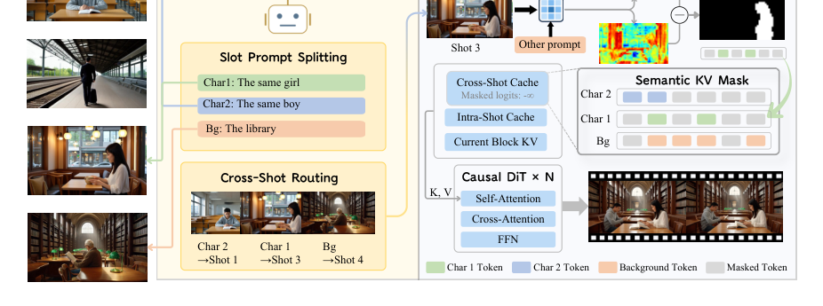

*Results / analysis - Figure 3: Coverage adaptive RoPE and cache evolution. Top: no coverage. Middle: partial coverage. Bottom: full coverage.*

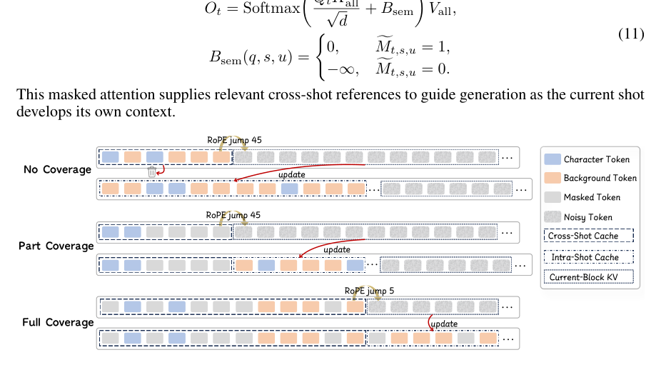

**Why this ranks #10**: Promoted over on-topic single-reference memory papers because it targets *compositional* cross-shot reuse, which is the unsolved part of interactive long video.

---

## Footer

- Total papers scanned across all 7 arXiv categories: **648**
- Papers read in full for this digest: **50**
- aigc_visual track final top-10: **10**
- Wild-cards in this track: **1**
- Figure assets: `2026-10-05/res/` (17 images shared across all 5 tracks)

Generated by the `mine-arxiv-daily-digest` skill. Sister file: `2026-10-05_aigc_visual_entry.md`.
