# ArXiv Daily Digest - 2026-10-05 (Audio & Speech Language Models / Duplex Voice Assistants, 10 papers)

**Generated**: 2026-10-05 17:30 CST
**Source**: arXiv eess.AS, cs.CL, cs.SD submissions, window 2026-10-01/02 UTC (the latest announced batch as of 2026-10-05)
**Track**: audio_lm (top 10 of 648 papers scanned)
**Scope**: speech language models, latency reduction, spatial audio QA, multi-turn audio-visual reasoning, streaming and simultaneous speech, paralinguistic control, spoken dialogue

---

No true full-duplex voice-assistant paper appeared in this batch, so this track is carried by speech-LM architecture, latency and evaluation work. The headline is AURAL: latent chain-of-thought cuts time-to-first-answer-token on Qwen2.5-Omni by 11.8x (1.22 s -> 0.10 s) while matching CoT-RL quality, which is the concrete version of the duplex-assistant latency problem. Metadata-supervised pretraining makes the more provocative claim - an *encoder-free* Speech-LM beats a randomly initialized encoder-based counterpart under matched data, questioning whether the pretrained speech encoder is load-bearing at all. On the systems side, OmniSeek turns an Omni-LLM into an active tool-using agent with an Audio-Visual Necessity objective that penalizes single-modality shortcuts, and the simultaneous-translation paper derives prefix supervision from the model's own outputs for a 63-68% commit-calibration error reduction. Two benchmark papers (spatial audio QA, multi-party backchannel) are unusually honest about where current models fail.

---

## Top 10 - Audio & Speech Language Models / Duplex Voice Assistants

### 1. AURAL: Adaptive Latent Reasoning with Joint Chunk for Speech Language Models

**arXiv**: [2610.01560](https://arxiv.org/abs/2610.01560) | **Score**: 9.7 (relevance 10 x 0.7 + quality 9 x 0.3) | **Tags**: audio-LM | **Categories**: cs.CL, cs.LG, cs.SD | **Pages**: 36

**Authors**: Yuxiang Wang, Kunyu Feng, Yuancheng Wang, Zihang Liu, Shengbo Cai, Qinke Ni, Wan Lin, Tao Feng, Yingda shen, Ming-Hao Hsu, Zhixian Zhao, Liqiang Zhang, Teddy Sun, Steve Yves, Zhizheng Wu

**Affiliation**: The Chinese University of Hong Kong, Shenzhen | Amphion Technology Co., Ltd. | Tsinghua University | The Hong Kong University of Science and Technology

**Abstract**

> Model intelligence and fast response jointly shape the quality of interaction with speech language models, yet remain difficult to achieve together. Explicit chain-of-thought (CoT) improves reasoning and audio understanding, but generating intermediate reasoning tokens delays responses. Describing fine-grained acoustic cues further lengthens CoT and increases latency. Latent reasoning can reduce this overhead, yet existing methods often trail CoT and remain limited by single-path supervision and reasoning budgets that do not adapt to problem difficulty. We introduce AURAL, which models a distribution over multiple plausible reasoning continuations in latent space and jointly predicts chunks of future states to reduce sequential forward passes and reasoning latency. To provide initial supervision for latent reasoning, we construct AuralReason-683K: 683K bilingual speech utterances (about 1,000 hours) with concise CoT for emotion recognition, empathetic dialogue, and general reasoning. AURAL-RL then explores beyond these traces, rewarding concise reasoning that yields high-quality answers and adapting reasoning effort to each problem. Across two backbones, AURAL-RL achieves performance comparable to CoT-RL, with larger gains over the respective supervised checkpoints on most metrics. Analysis further shows that harder questions elicit more latent reasoning steps. On Qwen2.5-Omni, it reduces time to the first answer token by 11.8x, from 1.22 to 0.10 s, versus 0.05 s for direct answering.

**Key findings**

- **Finding**: Explicit CoT improves reasoning but every intermediate reasoning token is paid for in latency; describing fine-grained acoustic cues lengthens CoT further. Latent reasoning can cut this overhead, yet existing methods trail CoT and are limited by single-path supervision and reasoning budgets that do not adapt to problem difficulty.

- **Finding**: AURAL models a **distribution over multiple plausible reasoning continuations in latent space** and jointly predicts chunks of future states, reducing sequential forward passes.

- **Finding**: Builds AuralReason-683K - 683K bilingual speech utterances (~1,000 hours) with concise CoT for emotion recognition, empathetic dialogue and general reasoning. AURAL-RL explores beyond these traces, rewarding concise reasoning that yields high-quality answers and adapting reasoning effort per problem.

- **Finding**: Across two backbones, AURAL-RL matches CoT-RL performance with larger gains over supervised checkpoints on most metrics; harder questions elicit more latent reasoning steps. On Qwen2.5-Omni it reduces time-to-first-answer-token by **11.8x, from 1.22 s to 0.10 s** (direct answering is 0.05 s).

**Key figures**

*Results / analysis - Figure 2: Effects of compression factor c, chunk size m, and RL on EchoMind MCQ and response latency. Panel a reports AURAL-SFT accuracy. Panel b reports the gain from AURAL-RL over the matching SFT checkpoint. Panel c reports measured AURAL-RL speedup in time to first token over CoT-RL, as a ratio of means under the protocol of Appendix*

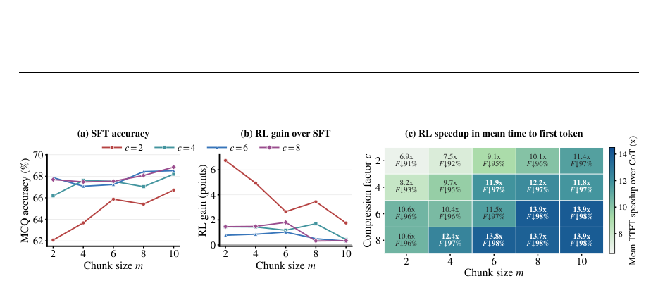

**Why this ranks #1**: Directly targets the latency cost of CoT in speech LMs. 683K reasoning traces plus RL, 11.8x TTFT reduction at CoT-RL-comparable quality. Strongest audio-LM paper in the batch.

---

### 2. Teaching LLMs to Hear Who Spoke What: Metadata-Supervised Pretraining for Encoder-Free Speech-LLMs

**arXiv**: [2610.01695](https://arxiv.org/abs/2610.01695) | **Score**: 9.7 (relevance 10 x 0.7 + quality 9 x 0.3) | **Tags**: audio-LM | **Categories**: eess.AS | **Pages**: 5

**Authors**: Mohan Shi, Ruchao Fan, Sunit Sivasankaran, Keqi Deng, Jinyu Li

**Affiliation**: University of California, Los Angeles, USA

**Abstract**

> Encoder-based speech large language models (Speech-LLMs) commonly employ pretrained speech encoders that prioritize linguistic content but may discard fine-grained acoustic cues essential for speaker discrimination and paralinguistic understanding. Encoder-free Speech-LLMs instead map Mel-spectrogram features directly into the LLM input space through lightweight embedding layers, enabling the LLM to learn from low-level acoustic features. However, systematic pretraining strategies for encoder-free Speech-LLMs remain underexplored, limiting their ability to compensate for the absence of large-scale pretrained speech encoders. We propose metadata-supervised pretraining (MSP), which leverages speech attributes such as speaker identity and emotion to develop speaker-discriminative and paralinguistic capabilities. We further introduce speaker-aware utterance composition (SAUC) to strengthen speaker discrimination and apply random span masking to regularize pretraining. We primarily evaluate our approach on joint ASR and speaker diarization in multi-speaker conversations, complemented by experiments on paralinguistic speech-understanding tasks. Under matched training-data conditions, our encoder-free model outperforms its randomly initialized encoder-based counterpart. With limited metadata-annotated data, it is competitive with models using speech encoders pretrained on substantially larger corpora, outperforming them in several settings. These results demonstrate the potential of encoder-free architectures for building native multimodal LLMs that acquire diverse speech capabilities.

**Key findings**

- **Finding**: Encoder-based Speech-LLMs use pretrained encoders that prioritize linguistic content but may discard fine-grained acoustic cues essential for speaker discrimination and paralinguistic understanding.

- **Finding**: Proposes **metadata-supervised pretraining (MSP)** for *encoder-free* Speech-LLMs, which map Mel-spectrograms directly into the LLM input space via lightweight embedding layers. MSP leverages speech attributes such as speaker identity and emotion; speaker-aware utterance composition (SAUC) strengthens speaker discrimination; random span masking regularizes pretraining.

- **Finding**: Evaluated on joint ASR and speaker diarization in multi-speaker conversations, plus paralinguistic understanding tasks. Under matched training-data conditions the encoder-free model **outperforms its randomly initialized encoder-based counterpart**.

- **Finding**: With limited metadata-annotated data it is competitive with models using speech encoders pretrained on substantially larger corpora, and outperforms them in several settings.

**Key figures**

*Results / analysis - Figure shown on p.3 of the paper.*

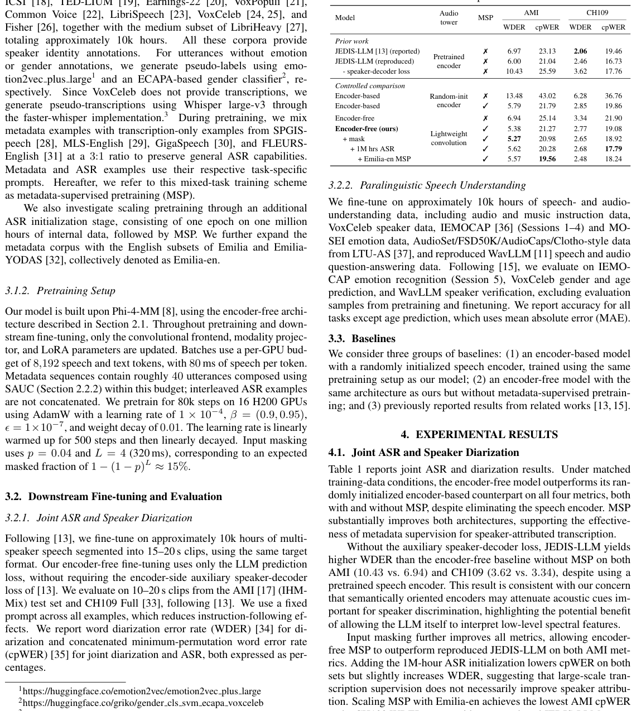

*Results / analysis - Figure shown on p.4 of the paper.*

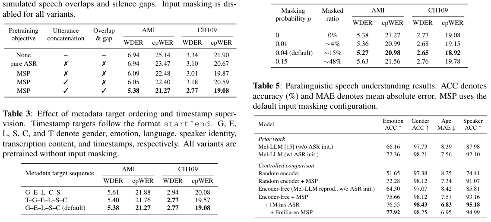

**Why this ranks #2**: Asks whether the pretrained speech encoder is even necessary. Encoder-free + metadata supervision beats a randomly initialized encoder-based counterpart under matched data - a real challenge to the default stack.

---

### 3. OmniSeek: Native Tool Integration for Multi-turn Audio-Visual Reasoning

**arXiv**: [2610.02181](https://arxiv.org/abs/2610.02181) | **Score**: 9.3 (relevance 9 x 0.7 + quality 10 x 0.3) | **Tags**: audio-LM | **Categories**: cs.CV | **Pages**: 18

**Authors**: Haibo Wang, Jiteng Mu, Jialu Li, Jingru Yi, Yuanjun Xiong, Jianming Zhang, Lifu Huang, Mingze Xu

**Affiliation**: University of California, Davis | Adobe Research

**Abstract**

> We present OmniSeek, an agentic framework that transforms an Omni Large Language Model (Omni-LLM) into an active, multi-turn reasoning agent with native tool use. Rather than passively processing an entire audio-visual sequence in a single forward pass, OmniSeek makes evidence acquisition part of the reasoning process: it dynamically decides whether to look or listen, and over which temporal window, to retrieve sparse but critical evidence across different modalities within long contexts. Through an iterative multi-turn protocol, the retrieved raw audio or visual segments are appended back into the context to support subsequent reasoning. To cold-start this capability, we build a data engine that synthesizes OmniTraj-170K, a corpus of multi-hop Chain-of-Thought trajectories with interleaved audio and visual evidence. We first supervise the model on these trajectories to instill multi-turn tool-use behavior, and then further optimize the policy via a two-stage reinforcement learning with verifiable rewards. Moreover, we introduce an Audio-Visual Necessity objective that explicitly rewards successful trajectories whose reasoning depends on both modalities, discouraging single-modality shortcuts. Extensive experiments across a wide range of benchmarks demonstrate that OmniSeek learns adaptive cross-modal evidence seeking and consistently improves audio-visual reasoning performance.

**Key findings**

- **Finding**: Transforms an Omni-LLM into an active multi-turn reasoning agent with native tool use - rather than passively processing an entire audio-visual sequence in one forward pass, evidence acquisition becomes part of reasoning.

- **Finding**: The agent dynamically decides **whether to look or listen, and over which temporal window**, to retrieve sparse but critical cross-modal evidence in long contexts; retrieved raw segments are appended back into the context for subsequent reasoning.

- **Finding**: Builds a data engine synthesizing **OmniTraj-170K**, multi-hop CoT trajectories with interleaved audio and visual evidence; the model is first supervised on these, then optimized by two-stage reinforcement learning with verifiable rewards.

- **Finding**: Adds an **Audio-Visual Necessity** objective explicitly rewarding successful trajectories whose reasoning depends on both modalities, discouraging single-modality shortcuts.

**Key figures**

*Results / analysis - Figure 1. Interleaved Multi-turn Audio-Visual Reasoning. OmniSeek acts as an active agent operating through an iterative <think> → <tool_call> →<observe> loop. The agent dynamically alternates between fetching audio cues and extracting visual evidence from*

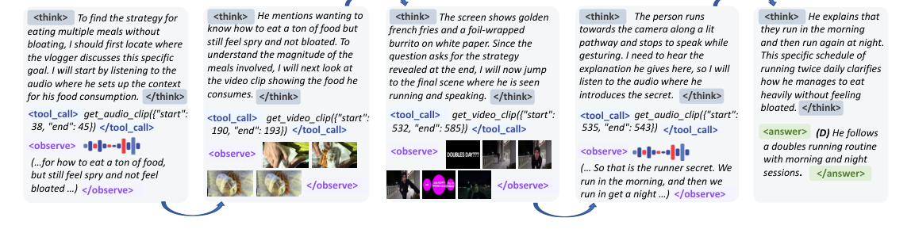

*Framework / architecture - Figure 3. OmniTraj-170K Statistics: The dataset contains 169,725 multi-turn trajectories over 39,797 videos and covers 19 cross-modal question types. We report the distributions of (a) question types, (b) source-video durations, (c) evidence-span durations, (d) tool calls per trajectory, and (e) normalized temporal positions of retrieved*

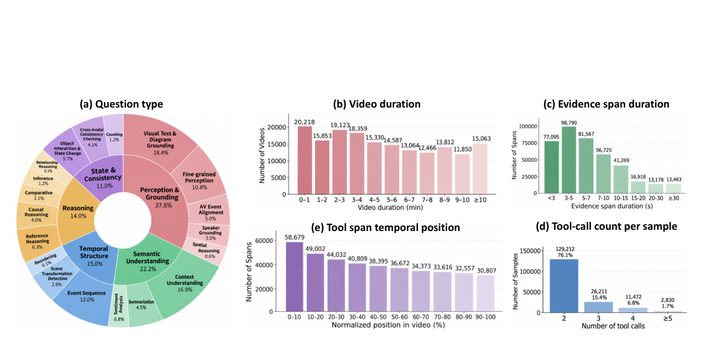

**Why this ranks #3**: Converts an Omni-LLM into an active evidence-seeking agent; OmniTraj-170K plus two-stage RLVR with an objective that explicitly penalizes single-modality shortcuts.

---

### 4. RMS-AQA: A Two-Stage Spatial Audio Question Answering Benchmark for Real-World Domestic Environments

**arXiv**: [2610.00935](https://arxiv.org/abs/2610.00935) | **Score**: 9.0 (relevance 9 x 0.7 + quality 9 x 0.3) | **Tags**: audio-LM | **Categories**: cs.SD, eess.AS | **Pages**: 5

**Authors**: Peihao Chen, Qing Wang, Lichun Fan, Yufeng Hao, Zhifeng Kong, Mengyao Zhu, Hengyi Hong, Hang Chen, Hang Su, Yujie Jian, Chao-Han Huck Yang, Shichao Hu, Jun Du, Jian Luan, Ke Li

**Affiliation**: University of Science and Technology of China, China 2Xiaomi Corporation, China | DataoceanAI, China 4NVIDIA, USA 5Soochow University, China

**Abstract**

> Embodied assistants in domestic environments must infer what happened, where and when it occurred, and how to respond. To address this, we introduce RMS-AQA, a spatial audio question answering (SAQA) benchmark for real-world domestic environments. The benchmark features a two-stage question-answering (QA) format to comprehensively assess the ability of audio-language models (ALMs) to first ground audible sound events and subsequently perform complex spatio-temporal reasoning based on that grounding. To maximize acoustic realism, our dataset combines authentic real-world first-order Ambisonics (FOA) recordings with high-fidelity synthetic data generated using measured room impulse responses (RIRs). Furthermore, we provide a lightweight spatial plug-in that injects FOA-format data into frozen audio-language backbones. Experimental results reveal that the primary challenges stem from concurrent sources, far distance, and sim-to-real domain gap between RIR-synthesized and authentic recordings.

**Key findings**

- **Finding**: Embodied assistants in domestic environments must infer what happened, where and when, and how to respond. RMS-AQA is a spatial audio QA benchmark with a **two-stage format**: ground audible sound events first, then perform spatio-temporal reasoning on that grounding.

- **Finding**: Maximizes acoustic realism by combining authentic real-world **first-order Ambisonics (FOA)** recordings with high-fidelity synthetic data generated using measured room impulse responses (RIRs).

- **Finding**: Provides a lightweight **spatial plug-in** that injects FOA-format data into frozen audio-language backbones.

- **Finding**: Results reveal the primary challenges are concurrent sources, far distance, and the sim-to-real domain gap between RIR-synthesized and authentic recordings.

**Key figures**

*Framework / architecture - Fig. 1. Overview of the RMS-AQA benchmark. (a) The data collec- tion pipeline. (b) The six reasoning dimensions of the benchmark.*

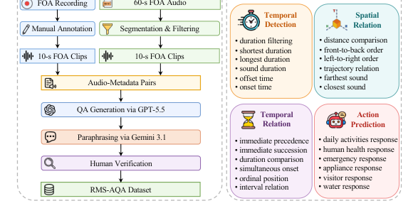

*Results / analysis - Fig. 3 illustrates how scene complexity and the sim-to-real do- main gap jointly affect reasoning performance. Real recordings prove significantly more challenging, evidenced by a 23.67% per- formance drop for the adapted Qwen3-Omni compared to simulated scenes. As concurrent sources increase, accuracy degrades steadily due to severe time*

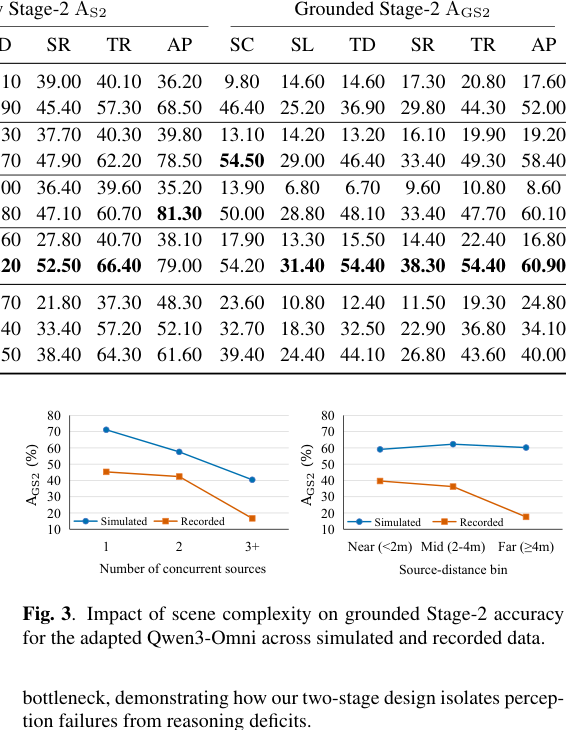

**Why this ranks #4**: Two-stage grounding-then-reasoning spatial audio QA with real Ambisonics plus measured-RIR synthesis, and a drop-in spatial plug-in for frozen ALMs. A benchmark a duplex assistant could be evaluated on.

---

### 5. ParaGeo: Decomposing Paralinguistic Variation into a Shared Latent Geometry

**arXiv**: [2610.03125](https://arxiv.org/abs/2610.03125) | **Score**: 8.7 (relevance 9 x 0.7 + quality 8 x 0.3) | **Tags**: audio-LM | **Categories**: cs.SD, cs.LG | **Pages**: 17

**Authors**: Yuhan Liu, Yuxuan Ou, Ruoxi Su, Mohamed Ahmed Zaki, Yunbo Long

**Affiliation**: Department of Engineering, University of Cambridge | Department of Engineering Science, University of Oxford | Department of Computing & Software Systems, University of Washington Bothell

**Abstract**

> Speech delivery varies with both the requested paralinguistic attribute and the linguistic content. We introduce ParaGeo, a matched-content decomposition of paralinguistic variation in a frozen speech language model. Synthesized audio tokens are replayed with a fixed listening prompt; pooled key/value (K/V) representations are centered and projected into a shared low-dimensional space. Our GLM-4-Voice probe spans 80 requested controls from 12 benchmark families across eight sentences. With a globally fitted calibration basis, content-held-out centroid accuracy using this basis is 9.49% versus a 1.25% permutation baseline; same-label cross-content cosine similarity is 0.285 versus 0.017, and both conditional permutation tests yield p = 0.001. A separate ten-scenario, six-style probe reveals reproducible contrast directions across scenarios. Static, additive, and temporal interventions produce attribute-, layer-, and schedule-dependent response profiles. These results provide a shared coordinate representation for measuring paralinguistic structure and an empirical starting point for latent speech control. Code is available at https://github.com/yuhanlydia/ParaGeo.

**Key findings**

- **Finding**: Speech delivery varies with both the requested paralinguistic attribute and the linguistic content. ParaGeo is a matched-content decomposition of paralinguistic variation in a frozen speech language model: synthesized audio tokens are replayed with a fixed listening prompt, and pooled key/value representations are centered and projected into a shared low-dimensional space.

- **Finding**: The GLM-4-Voice probe spans 80 requested controls from 12 benchmark families across eight sentences. With a globally fitted calibration basis, content-held-out centroid accuracy is **9.49% versus a 1.25% permutation baseline**; same-label cross-content cosine similarity is 0.285 versus 0.017; both conditional permutation tests give p = 0.001.

- **Finding**: A separate ten-scenario, six-style probe reveals reproducible contrast directions across scenarios.

- **Finding**: Static, additive and temporal interventions produce attribute-, layer- and schedule-dependent response profiles - an empirical starting point for latent speech control.

**Key figures**

*Results / analysis - Fig. 1. Vocal-style changes recur across contexts. Each cell measures the cross-scenario consistency of the same style- difference direction, rather than similarity between styles. Re- sults use ten CRAD scenarios and two seeds. All 15 unique contrasts pass Benjamini–Hochberg correction at a false dis- covery rate of 0.05.*

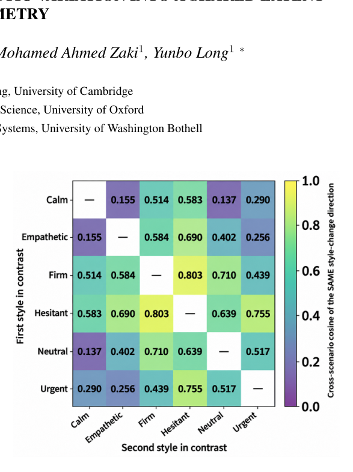

*Framework / architecture - Fig. 2. ParaGeo overview. Matched-content renditions are synthesized and replayed through the frozen speech model. Audio- position K/V pooling, within-content centering, low-rank decomposition, and a content-associated projection yield shared co- ordinates. Static, additive, and temporal updates reuse the same basis. The diagram and wavef*

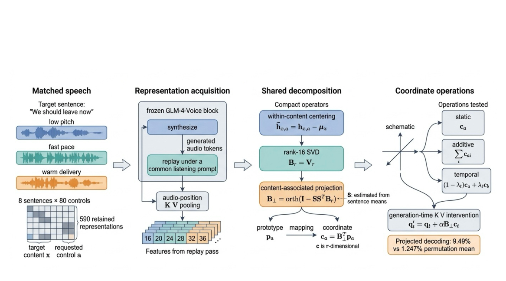

**Why this ranks #5**: Practical route to controllable paralinguistics: probe frozen GLM-4-Voice K/V space, calibrate one basis, then apply attribute/layer/schedule-dependent interventions.

---

### 6. AudioJev: Direct Audio Decisions with Order-Calibrated Probabilities

**arXiv**: [2610.01293](https://arxiv.org/abs/2610.01293) | **Score**: 8.3 (relevance 8 x 0.7 + quality 9 x 0.3) | **Tags**: audio-LM | **Categories**: cs.SD | **Pages**: 15

**Authors**: Sihan Lv, Zhen Li, Zhiqi Cao, Jinshan Zhang, Ying Li, Meng Xi, Jianwei Yin

**Affiliation**: Zhejiang University, Hangzhou, China | Innovation and Management Center of the School of Software (Ningbo), Zhejiang University, Ningbo, China | Binjiang Institute of Zhejiang University, Hangzhou, China | China Academy of Space Technology, Beijing, China | Zhejiang Key Laboratory of Digital-Intelligence Service Technology, Hangzhou, China

**Abstract**

> Audio decisions often depend on evidence that a transcript does not preserve, while their probability estimates can depend on how answer options are ordered. AudioJev maps a waveform, question and supplied alternatives directly to a candidate distribution through one shared full-parameter model. We define order calibration as preserving an answer's probability under meaning-preserving option permutations. Random-derangement SKL training pairs each question with a reordered view in which every alternative changes position, supervises both answers, and aligns the two distributions before applying a symmetric KL penalty. Inference retains a single candidate-scoring forward, with no calibration head or order ensemble. Across three training seeds, AudioJev reaches 68.88%/55.33% mean accuracy on complete MMAU/MMAR and reduces random-order SKL by 43.8%/60.5% relative to the single-view removal ablation. The same model handles intent, environmental sound, note properties, speech activity and conversational transitions. Paired removal ablations and multi-order evaluation measure predictive accuracy and probability stability together, establishing a direct audio interface whose calibration objective acts on candidate meaning rather than presentation position. Inference code and model weights are available at https://github.com/SihanLv/AudioJev-Inference and https://huggingface.co/shlv/AudioJev.

**Key findings**

- **Finding**: Audio decisions often depend on evidence a transcript does not preserve, and their probability estimates can depend on how answer options are ordered. AudioJev maps waveform, question and supplied alternatives directly to a candidate distribution through one shared full-parameter model.

- **Finding**: Defines **order calibration** as preserving an answer's probability under meaning-preserving option permutations. Random-derangement SKL training pairs each question with a reordered view in which every alternative changes position, supervises both answers, aligns the two distributions, then applies a symmetric KL penalty.

- **Finding**: Inference keeps a single candidate-scoring forward - **no calibration head and no order ensemble**. Across three seeds, mean accuracy is 68.88% / 55.33% on complete MMAU / MMAR, and random-order SKL drops 43.8% / 60.5% relative to the single-view removal ablation.

- **Finding**: The same model handles intent, environmental sound, note properties, speech activity and conversational transitions.

**Key figures**

*Results / analysis - Figure 1 introduces AudioJev’s training and infer- ence interface. A shared model maps a waveform, question and supplied answer list to candidate prob- abilities. Paired training teaches those probabilities to follow answer meaning across order changes; inference returns them in the caller’s order with one forward pass.*

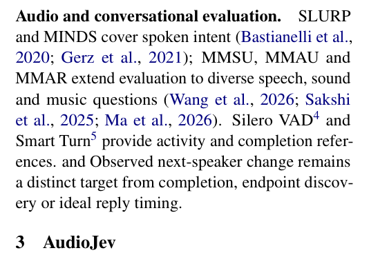

*Framework / architecture - Figure 1: AudioJev overview. A waveform, question and caller-supplied alternatives define a decision for one shared audio classifier. Training (top): the original and randomly deranged answer lists receive candidate-only supervision, with identity-aligned symmetric KL encouraging consistent probabilities across presentations. Inference (b*

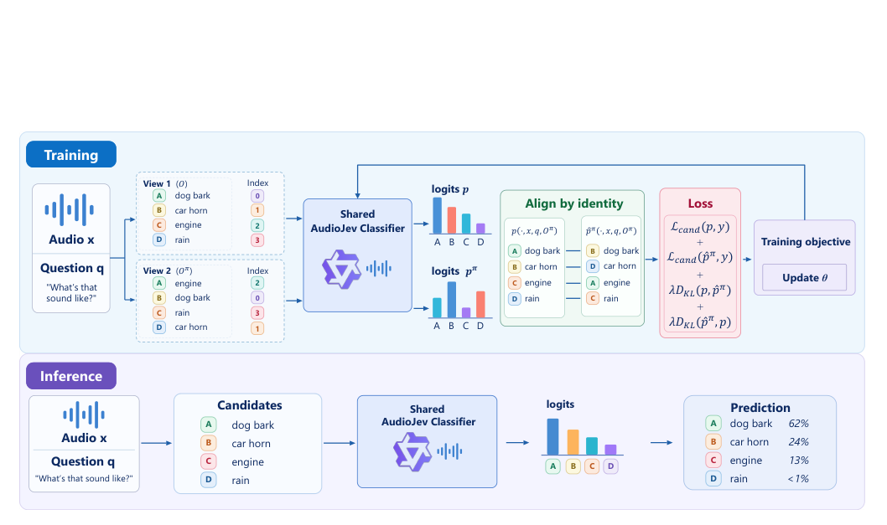

**Why this ranks #6**: Multiple-choice audio QA has a position-bias problem most papers ignore; order calibration via random-derangement SKL with a single scoring forward pass. Weights and inference code released.

---

### 7. Learning When to Commit from Partial Speech for End-to-End Simultaneous Speech Translation

**arXiv**: [2610.02612](https://arxiv.org/abs/2610.02612) | **Score**: 8.3 (relevance 8 x 0.7 + quality 9 x 0.3) | **Tags**: audio-LM | **Categories**: cs.CL | **Pages**: 13

**Authors**: Hieu Hoang, Amittai Axelrod

**Affiliation**: Microsoft

**Abstract**

> Simultaneous speech translation must emit useful target text before the source is complete while preserving every committed token. We adapt a full-utterance speech language model using prefix supervision derived from its own complete- and partial-waveform translations, requiring neither transcripts nor human translations. We compare single-turn forced-prefix and multi-turn append-only decoding, use a confidence threshold to control the inference-time quality--latency trade-off, and vary the density of training prefixes with a separate synthesis margin. On FLEURS and CoVoST2 in three language directions, prefix training improves quality--latency frontiers over the unadapted model, and confidence provides the broadest consistently competitive operating range. Multi-turn decoding is generally stronger at low latency; under multi-turn training, commit-calibration error falls by 63--68% overall and 68--80% at early prefixes, whereas single-turn training provides only modest overall calibration gains and no early-prefix improvement. A small synthesis margin sometimes extends the frontier to lower latency, particularly on shorter utterances, while a larger margin degrades translation quality and calibration. Prefix adaptation therefore improves simultaneous speech translation, especially under multi-turn append-only decoding, while synthesis density introduces a non-monotonic quality--latency trade-off.

**Key findings**

- **Finding**: Simultaneous speech translation must emit useful target text before the source is complete while preserving every committed token. Adapts a full-utterance speech LM using **prefix supervision derived from its own complete- and partial-waveform translations** - requiring neither transcripts nor human translations.

- **Finding**: Compares single-turn forced-prefix vs multi-turn append-only decoding, uses a confidence threshold to control the inference-time quality-latency trade-off, and varies prefix density with a separate synthesis margin.

- **Finding**: On FLEURS and CoVoST2 in three language directions, prefix training improves quality-latency frontiers; confidence provides the broadest consistently competitive operating range; multi-turn decoding is generally stronger at low latency.

- **Finding**: Under multi-turn training, commit-calibration error falls **63-68% overall and 68-80% at early prefixes**, whereas single-turn training gives only modest overall gains and no early-prefix improvement. Synthesis density introduces a non-monotonic quality-latency trade-off.

**Key figures**

*Results / analysis - Figure 3 compares multi-turn models trained with synthesis margins. δ = 0.5 is uncompetitive*

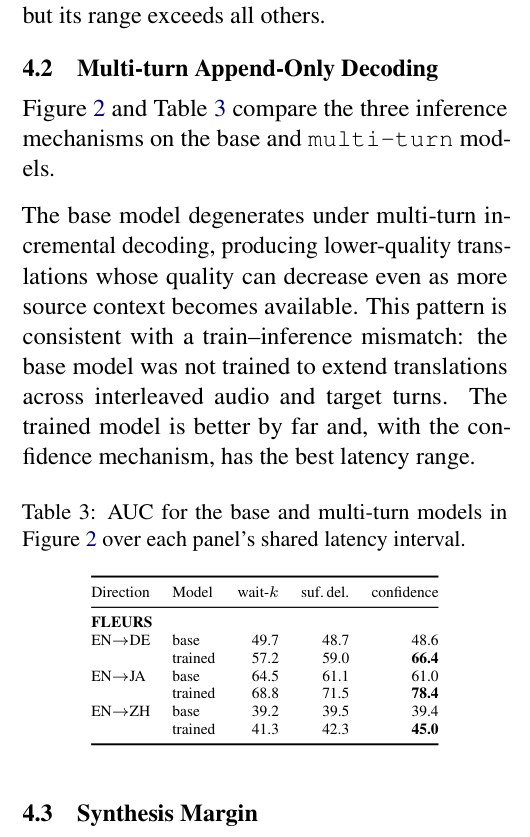

*Results / analysis - Figure 4: Confidence frontiers for the canonical single-turn and multi-turn models and the multi-turn δ = 0.2 synthesis-margin ablation.*

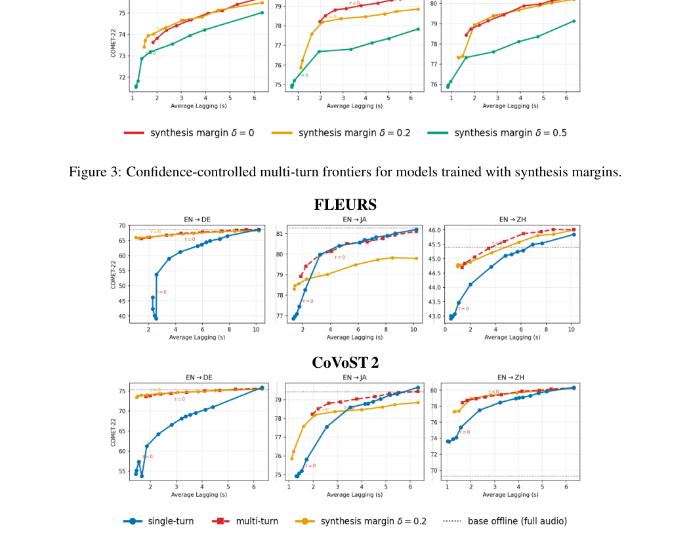

**Why this ranks #7**: Self-supervised prefix supervision (no transcripts, no human translations) with a proper quality-latency frontier analysis; 63-68% commit-calibration error reduction. Core streaming-speech mechanics.

---

### 8. Multi-Party Backchannel Prediction: a Diagnosis, a Benchmark, and a Ceiling

**arXiv**: [2610.01488](https://arxiv.org/abs/2610.01488) | **Score**: 8.0 (relevance 8 x 0.7 + quality 8 x 0.3) | **Tags**: audio-LM | **Categories**: cs.SD, cs.AI | **Pages**: 16

**Authors**: Mohammed Hafsati, Ahmed Loughzali

**Affiliation**: Multi-Party Backchannel Prediction: a Diagnosis, a | Benchmark, and a Ceiling | Mohammed HAFSATI | Enchanted Tools | Ahmed LOUGHZALI | IMT Nord Europe

**Abstract**

> Backchannel prediction has been studied almost entirely in dyadic conversation. We introduce a multi-party benchmark based on the AMI corpus, comprising 682 masked-listener views from 171 meetings, 190 speakers, and 18,697 backchannel events, with a person-disjoint held-out split. A state-of-the-art dyadic model applied zero-shot to meeting audio performs at chance (AUROC 0.499); nevertheless, its frozen acoustic features remain informative: a linear probe reaches 0.704, and retraining the predictor raises performance to 0.751. Retraining reveals a second limitation. Listener conditioning improves prediction for listeners seen during training but not for unseen listeners, and the gap remains under capacity reduction, listener-adversarial training, per-listener adaptation, and oracle lexical conditioning. Adversarial training removes only part of the speaker-identity information, while stronger removal hurts prediction, suggesting that identity is entangled with cues that are useful for backchanneling. A within-model control helps explain this pattern: with the same features and data splits, turn-onset prediction transfers to unseen listeners, while backchannel prediction does not. Backchannel rates also vary about twice as much across individuals as turn-onset rates. Since backchannels occupy only about 1% of frames, frame-level F1 is strongly affected by the base rate. We therefore report AUROC alongside event-F1 on listener-active regions. We release the benchmark and evaluation tools at https://github.com/HafsatiMohammed/bc_multiparty_release.

**Key findings**

- **Finding**: Backchannel prediction has been studied almost entirely in dyadic conversation. Introduces a multi-party benchmark from the AMI corpus: 682 masked-listener views from 171 meetings, 190 speakers, 18,697 backchannel events, with a person-disjoint held-out split.

- **Finding**: A state-of-the-art dyadic model applied zero-shot to meeting audio performs **at chance (AUROC 0.499)**. Its frozen acoustic features remain informative though - a linear probe reaches 0.704 and retraining raises the predictor to 0.751.

- **Finding**: Retraining reveals a second limitation: listener conditioning helps listeners seen during training but not unseen ones, and the gap persists under capacity reduction, listener-adversarial training, per-listener adaptation and oracle lexical conditioning.

- **Finding**: Adversarial training removes only part of speaker-identity information while stronger removal *hurts* prediction, suggesting identity is entangled with cues useful for backchanneling. A within-model control explains the pattern: with the same features and splits, turn-onset prediction transfers to unseen listeners while backchannel prediction does not.

**Key figures**

*Results / analysis - Figure 1: VAP-BC with the optional components evaluated in Section 5.3: listener/floor-holder FiLM conditioning, rank-8 adapters, listener-identity adversary, and lexical stream.*

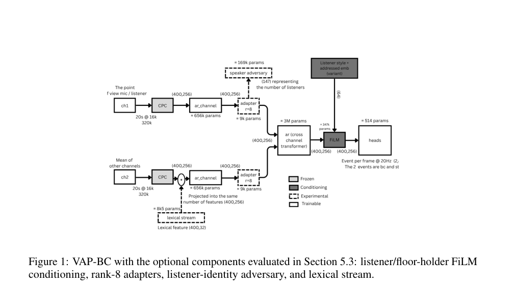

**Why this ranks #8**: Establishes that dyadic backchannel models fail at chance in multi-party meetings, and that the fix is not capacity - identity is entangled with useful cues. A relevant ceiling for dialogue-listener modelling.

---

### 9. Augmenting Large Audio Language Models with Low-Level Acoustic Features for Dysarthric Speech Detection

**arXiv**: [2610.03352](https://arxiv.org/abs/2610.03352) | **Score**: 7.7 (relevance 8 x 0.7 + quality 7 x 0.3) | **Tags**: audio-LM | **Categories**: eess.AS | **Pages**: 5

**Authors**: Mahdi Amiri, Hatef Otroshi Shahreza, Pascal Frossard, Ina Kodrasi

**Affiliation**: Idiap Research Institute, Switzerland | ´Ecole Polytechnique F´ed´erale de Lausanne (EPFL), Switzerland

**Abstract**

> Automatic dysarthric speech detection approaches can support traditional clinical diagnosis, which relies on costly and time-consuming evaluation by a speech and language pathologist. Existing automatic approaches predominantly rely on deep learning (DL). More recently, Large Audio Language Models (LALMs) have emerged as a promising alternative given their strong performance across various tasks, but their application to dysarthric speech detection has not yet been established. We propose a framework that fine-tunes LALMs for dysarthric speech detection on speech recordings combined with textual information comprising low-level acoustic features and speaker demographics. Across two LALMs, our framework outperforms DL-based baselines, with Qwen2-Audio-Instruct achieving state-of-the-art performance. An ablation study shows that incorporating acoustic features and speaker demographics during fine-tuning improves LALM performance, while LALMs alone exhibit only chance-level zero-shot performance. These findings establish an effective approach for adapting LALMs to dysarthric speech detection.

**Key findings**

- **Finding**: Dysarthric speech detection supports clinical diagnosis that relies on costly, time-consuming pathologist evaluation. Large Audio Language Models are a promising alternative, but their application to this task had not been established.

- **Finding**: Proposes a framework that fine-tunes LALMs on speech recordings combined with textual information comprising **low-level acoustic features and speaker demographics**.

- **Finding**: Across two LALMs the framework outperforms DL-based baselines, with Qwen2-Audio-Instruct achieving state-of-the-art performance.

- **Finding**: Ablation shows incorporating acoustic features and demographics during fine-tuning improves LALM performance, while **LALMs alone exhibit only chance-level zero-shot performance**.

**Key figures**

*Framework / architecture - Fig. 1. Schematic illustration of the proposed method: a) Conventional fine-tuning of the LALM using raw audio and textual inputs. b) Fine- tuning with the proposed approach, where besides the raw audio and textual inputs, low-level audio features are extracted and incorporated into the textual input together with the task description and*

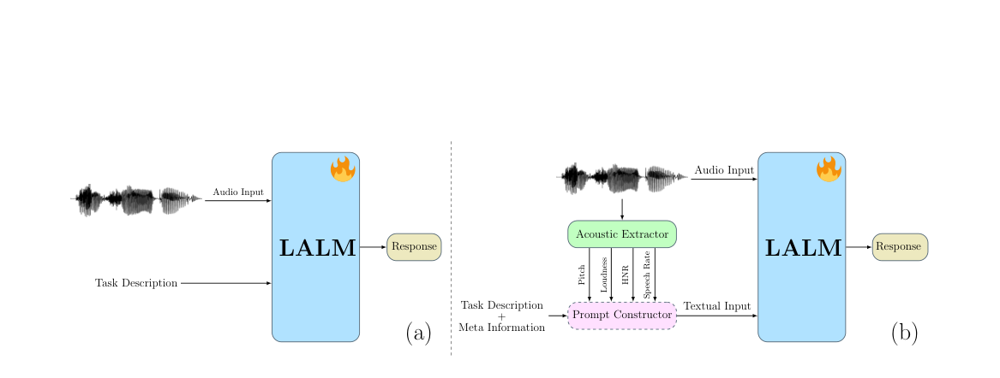

**Why this ranks #9**: Practical recipe - LALMs are chance-level zero-shot but become SOTA when fine-tuned with low-level acoustic features plus demographics. Useful negative result about LALM zero-shot limits.

---

### 10. AVSD-Scenes: A Dataset for Audio-Visual Description of Urban Scenes `[wild-card]`

**arXiv**: [2610.01861](https://arxiv.org/abs/2610.01861) | **Score**: 7.7 (relevance 8 x 0.7 + quality 7 x 0.3) | **Tags**: audio-LM | **Categories**: cs.AI, cs.SD, eess.AS | **Pages**: 5

**Authors**: Dhanunjaya Varma Devalraju, Arshdeep Singh, Mark D. Plumbley

**Affiliation**: IIT Madras, India, 2King’s College London, United Kingdom

**Abstract**

> Natural language descriptions can provide rich semantic representations of audio-visual urban scenes, yet datasets that jointly describe both auditory and visual information remain limited. In this paper, we introduce AVSD-Scenes, a paired audio-visual scene description dataset for urban environments. The dataset contains 12,291 audio-visual scene descriptions generated from the TAU Urban Audio-Visual Scenes dataset. To construct the dataset, we first generate audio- and visual-based descriptions using Qwen2-Audio-7B and Qwen2.5-VL-7B, respectively. These modality-specific descriptions are then combined using large language models, namely Qwen3-14B, Mistral-Small-3.2-24B-Instruct-2506, and Gemma-3-27B-it, to produce multimodal descriptions that capture complementary information from both modalities. We benchmark AVSD-Scenes using semantic alignment, cross-modal retrieval, scene classification, LLM-as-a-judge evaluation, and human subjective assessment. Results show that multimodal descriptions improve semantic alignment and cross-modal retrieval performance compared with modality-specific descriptions while preserving strong scene-discriminative information. The generated descriptions achieve up to 94.5% accuracy in urban scene classification, while combining audio, visual, and description embeddings further improves accuracy to 95.4%. Furthermore, the descriptions remain highly scene-discriminative even when scene labels are removed from the prompting instructions, indicating that they capture semantic information derived from the audio-visual content rather than merely reflecting label information.

**Key findings**

- **Finding**: Datasets that jointly describe auditory and visual information with natural language remain limited. AVSD-Scenes is a paired audio-visual scene description dataset for urban environments containing **12,291 descriptions** generated from the TAU Urban Audio-Visual Scenes dataset.

- **Finding**: Construction first generates audio- and visual-based descriptions with Qwen2-Audio-7B and Qwen2.5-VL-7B, then combines them with Qwen3-14B, Mistral-Small-3.2-24B-Instruct-2506 and Gemma-3-27B-it to produce multimodal descriptions capturing complementary information.

- **Finding**: Benchmarked with semantic alignment, cross-modal retrieval, scene classification, LLM-as-a-judge and human subjective assessment. Multimodal descriptions improve semantic alignment and cross-modal retrieval over modality-specific descriptions while preserving strong scene-discriminative information.

- **Finding**: Descriptions reach up to 94.5% urban scene classification accuracy, rising to 95.4% when audio, visual and description embeddings are combined - and remain scene-discriminative even when scene labels are removed from the prompt, indicating they capture content rather than label information.

**Key figures**

*Results / analysis - Fig. 3. SVM-based urban scene classification accuracy for different combinations of audio (A), visual (V), and multimodal description (D) obtained using Qwen3, Mistral, and Gemma models.*

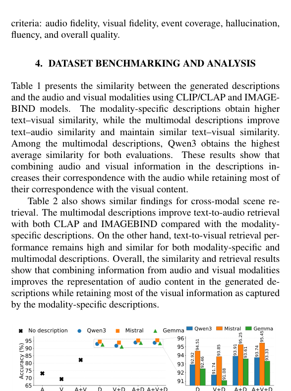

*Results / analysis - Fig. 5. LLM-as-a-Judge evaluation of multimodal descriptions gen- erated by different models. Scores are reported on a five point scale (higher is better). AF: audio fidelity; VF: visual fidelity; EC: event coverage; Halluc.: hallucination; CMC: cross-modal consistency; Gram.: grammar; Flue.: fluency.*

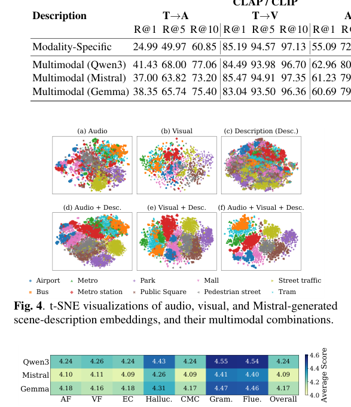

**Why this ranks #10**: Promoted to fill the track: 12,291 paired AV scene descriptions with cross-modal retrieval gains and 95.4% classification accuracy. A data resource directly usable for audio-visual pretraining.

---

## Footer

- Total papers scanned across all 7 arXiv categories: **648**
- Papers read in full for this digest: **50**
- audio_lm track final top-10: **10**
- Wild-cards in this track: **1**
- Figure assets: `2026-10-05/res/` (50 images shared across all 5 tracks)

Generated by the `mine-arxiv-daily-digest` skill. Sister file: `2026-10-05_audio_lm_entry.md`.
