# ArXiv Daily Digest - 2026-10-05 (Embodied AI + World Models, 10 papers)

**Generated**: 2026-10-05 17:30 CST
**Source**: arXiv cs.RO, cs.AI, cs.CV submissions, window 2026-10-01/02 UTC (the latest announced batch as of 2026-10-05)
**Track**: embodied (top 10 of 648 papers scanned)
**Scope**: world-model planning and diagnosis, sim-to-real transfer, VLA efficiency and deployment, tactile and contact-rich manipulation, agentic skill learning, data-efficient robot RL

---

Two world-model papers lead this track and they diagnose *different* silent failures. The JEPA-plannability paper shows a LeWM that solves PushT scores under 1% on a language-goal benchmark because its latent is nearly action-insensitive - rollouts are no better than copying the current latent - and one inverse-dynamics auxiliary loss takes success from 0.003 to 0.35. AVL-JEPA attacks the complementary failure: a JEPA can keep high-dimensional visual information while discarding the *physical consequences of actions*. The sim-to-real cluster (RoboBridge, Skill2Real, MFPG-PPO) shares one idea: keep the policy frozen and transfer procedure or leverage instead of weights. RoboBridge persists skill revisions only after validation; Skill2Real's Proposer-Verifier-Governor loop lifts LIBERO-Pro Long from 2.0% to 56.3% with no training on the target. The VLA deployment cluster is unusually practical - W4A4 quantization that actually restores FP16 accuracy, 2-step on-policy distillation keeping 84% of performance, and internalized imagination cutting latency 6.38x - while ManiPhysicsBench argues the benchmarks measure the wrong thing entirely.

---

## Top 10 - Embodied AI + World Models

### 1. Keeping JEPA World Models Plannable When Little of the Frame Moves

**arXiv**: [2610.03137](https://arxiv.org/abs/2610.03137) | **Score**: 9.7 (relevance 10 x 0.7 + quality 9 x 0.3) | **Tags**: world-model | **Categories**: cs.AI | **Pages**: 23

**Authors**: Florian Strohm, Patrick Wagner, Jannik Schwab, Marco Huber

**Affiliation**: University of Stuttgart, Germany

**Abstract**

> Specifying a goal in language rather than as a goal frame is a natural interface for planning with a latent world model, but testing it needs scenes in which language must discriminate between several objects. We build SLIM, a pushing benchmark with several small objects and paired visual and language goals on identical scenes. On SLIM a LeWM world model that solves PushT succeeds on under 1% of trials, although a scripted controller with simulator state solves every tier. Probes locate the failure in the encoder: its latent is nearly action-insensitive, neither pusher nor object positions can be decoded from it, and rollouts are no better than copying the current latent forward. One inverse-dynamics auxiliary loss, applied to encoder latents and to predicted latents through a shared head discarded at test time, restores every probe and raises success from 0.003 to 0.35 (0.16 on the hard pushing tier, where a goal-agnostic policy scores zero), and improves PushT at twice the trained horizon. Controls attribute the repair to the gradient into the encoder, and a response sweep shows that the vanilla model plans once enough of the frame responds to actions. A cheap action-sensitivity probe, computable without environment access, acts as an empirical necessary condition: all configurations below its threshold failed to plan. On the repaired latent, a small language-goal head plans from sentences without retraining the world model: it reaches 0.84 on navigation (visual-goal oracle 1.00), follows the named zone when it is swapped with a decoy, and degrades gracefully to unseen nouns. A single goal sentence rarely completes a push, but given the push as a sequence of stage sentences the head raises success on the medium and hard pushing tiers from 0.04 to 0.25, on par with the goal-frame oracle, also when the switch between stages is read from the latent alone.

**Key findings**

- **Finding**: Builds SLIM, a pushing benchmark with several small objects and paired visual *and* language goals on identical scenes - so language must discriminate between several objects.

- **Finding**: On SLIM a LeWM world model that solves PushT succeeds on **under 1% of trials**, although a scripted controller with simulator state solves every tier. Probes localize the failure in the encoder: its latent is nearly action-insensitive, neither pusher nor object positions can be decoded, and rollouts are no better than copying the current latent forward.

- **Finding**: One inverse-dynamics auxiliary loss, applied to encoder latents and to predicted latents through a shared head discarded at test time, restores every probe and raises success **from 0.003 to 0.35** (0.16 on the hard pushing tier, where a goal-agnostic policy scores zero), improving PushT at twice the trained horizon.

- **Finding**: Controls attribute the repair to the gradient into the encoder, and a response sweep shows the vanilla model plans once enough of the frame responds to actions. A cheap action-sensitivity probe computable without environment access acts as an empirical necessary condition - all configurations below its threshold failed to plan. On the repaired latent a small language-goal head reaches 0.84 on navigation (visual-goal oracle 1.00), follows the named zone when swapped with a decoy, and degrades gracefully to unseen nouns; given the push as a sequence of stage sentences it raises medium/hard pushing success from 0.04 to 0.25.

**Key figures**

*Results / analysis - Figure 1: Why JEPA world models collapse on SLIM. Under the same random actions, 0.64% of the frame changes per predictor step on PushT (left), where the large T-block moves whenever it is touched, and 0.37% on SLIM (right; the same scene as in Fig. 2), where the pusher rarely hits one of several objects. When so little of the frame respo*

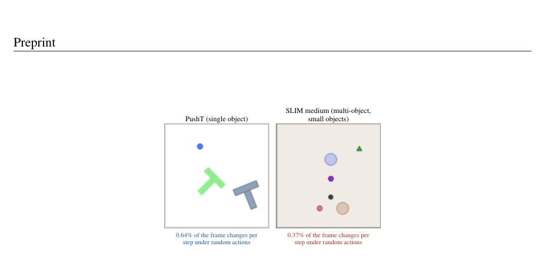

*Results / analysis - Figure 2: SLIM scenes for the four tiers (columns) in the open arena (top) and the identical con- figuration with procedurally generated wall chains added (bottom). The templated language goal of each scene is quoted under the top row; the easy tier asks only to move the pusher. Tiers differ in the geometry of pusher, target object and zo*

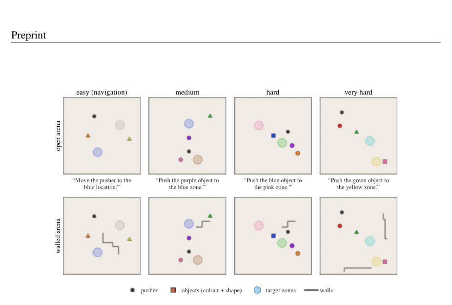

**Why this ranks #1**: Localizes a silent failure - JEPA latents become near action-insensitive so the model stops planning. One inverse-dynamics auxiliary loss takes success 0.003 -> 0.35. Diagnostic quality is exceptional.

---

### 2. RoboBridge: A Self-Evolving Embodied Agent Framework for Sim-to-Real Transfer

**arXiv**: [2610.02717](https://arxiv.org/abs/2610.02717) | **Score**: 9.7 (relevance 10 x 0.7 + quality 9 x 0.3) | **Tags**: embodied-ai, sim-to-real | **Categories**: cs.RO | **Pages**: 21

**Authors**: Chenxi Li, Zhangrui Zhao, Rui Li, Yuan Gao, Kehui Liu, Jiarui Li, Dong Wang, Tong Si, Minting Pan, Wanli Ouyang, Dongzhan Zhou

**Affiliation**: Shanghai Artificial Intelligence Laboratory | Zhejiang University | Beihang University | Harbin Institute of Technology | Shenzhen Institutes of Advanced Technology | Shanghai Jiao Tong University

**Abstract**

> A key challenge in bringing embodied intelligence into the real world is transferring capabilities from simulation to reality and enabling agents to continually adapt after deployment. End-to-end vision-language-action policies provide strong manipulation capabilities, but their transfer to physical environments typically relies on calibrating simulated visual and dynamical conditions, collecting additional target-domain demonstrations, and optimizing the policy through further training. Tool-using embodied agents offer flexible task orchestration, yet existing systems primarily emphasize task execution and experience reuse within a given environment, with limited support for transferring procedural knowledge and continuously adapting it across simulation and reality. We propose RoboBridge, a framework that treats sim-to-real transfer as the continued adaptation of executable task skills. The agent represents task knowledge as procedures connecting task intent, observations, tool operations, and outcome verification. Interaction feedback is used to generate candidate skill revisions, which are evaluated before being persisted or rejected. A pretrained vision-language-action policy is exposed as a reusable action tool and enhanced with inference-time guidance, enabling fine-grained execution without retraining the underlying policy. RoboBridge grounds transferable skills in task semantics and interaction interfaces shared across simulation and reality. This representation preserves reusable task structure while allowing environment-dependent operations to be selectively revised through real-world execution feedback. We evaluate the framework on LIBERO-PRO and corresponding physical tasks, studying both skill evolution and post-transfer adaptation. Our framework provides a route from one-shot policy deployment to continual procedural learning across environments.

**Key findings**

- **Finding**: Existing tool-using embodied agents emphasize task execution and experience reuse within a given environment, with limited support for transferring procedural knowledge and continuously adapting across simulation and reality.

- **Finding**: RoboBridge treats sim-to-real transfer as the continued adaptation of executable task skills. The agent represents task knowledge as **procedures connecting task intent, observations, tool operations and outcome verification**; interaction feedback generates candidate skill revisions which are **evaluated before being persisted or rejected**.

- **Finding**: A pretrained VLA policy is exposed as a reusable action tool and enhanced with inference-time guidance, enabling fine-grained execution **without retraining the underlying policy**.

- **Finding**: Evaluated on LIBERO-PRO and corresponding physical tasks, studying both skill evolution and post-transfer adaptation. The framework provides a route from one-shot policy deployment to continual procedural learning across environments.

**Key figures**

*Results / analysis - Figure 1: Sim-to-real transfer with end-to-end models and RoboBridge. The policy-centered pathway adapts an end-to-end model for real-world execution through physical alignment, additional target-domain data, and retraining. RoboBridge evolves procedural skills through a feedback-driven execution loop in simulation and transfers them thro*

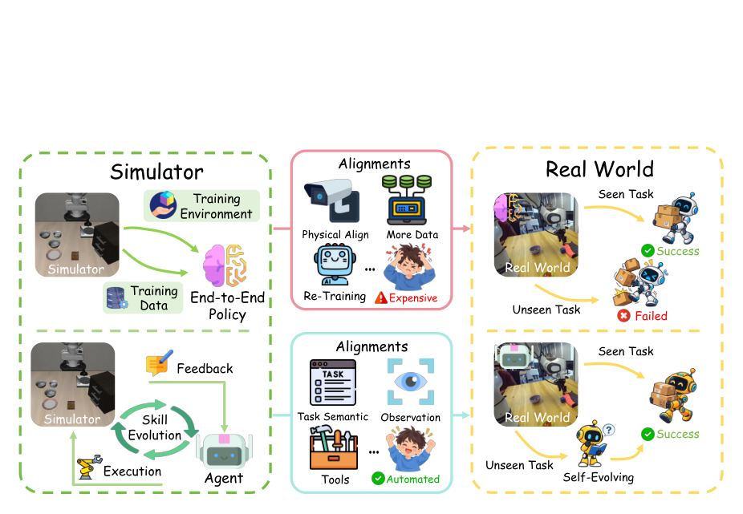

*Framework / architecture - Figure 2: RoboBridge framework. (a) Agent loop: The agent consults the active skill, invokes manipulation tools, and uses observations and execution feedback to guide subsequent actions. (b) Skill evolution: Execution logs inform candidate insertions, deletions, and replacements in the skill. Candidates are evaluated through task executio*

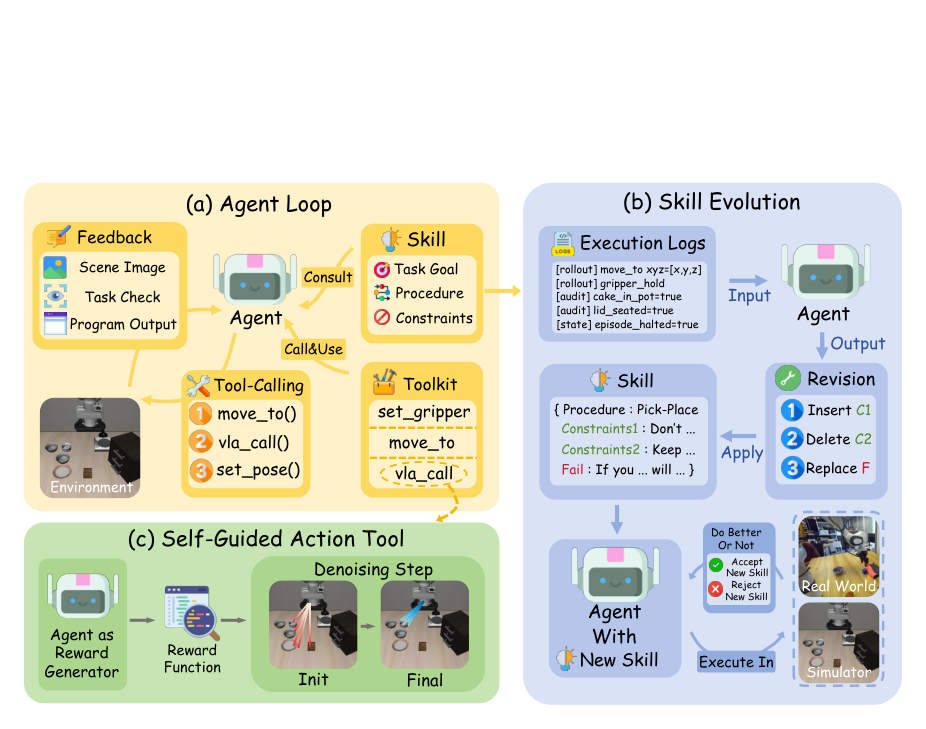

**Why this ranks #2**: Treats sim-to-real as continual procedural skill revision with validate-before-persist, and exposes a pretrained VLA as a tool rather than fine-tuning it. Addresses the full post-deployment loop.

---

### 3. eRLT: Efficient VLA Reinforcement Learning via Action-Relevant Token Routing

**arXiv**: [2610.00913](https://arxiv.org/abs/2610.00913) | **Score**: 8.9 (relevance 9 x 0.7 + quality 9 x 0.3) | **Tags**: embodied-ai, rl-algorithm | **Categories**: cs.RO | **Pages**: 21

**Authors**: Dehao Huang, Jianbang Liu, Jianpan Gao, Chao Tang, Zilang Cen, Zedong Dan, Jiaheng Wang, Tingguang Li, Yue Wang, Hong Zhang

**Affiliation**: Southern University of Science and Technology, Shenzhen, China. | Samsung Robotics eXperience. | Wuhan University, Wuhan, China. | Sun Yat-sen University, Guangzhou, China.

**Abstract**

> Vision-Language-Action (VLA) models provide strong behavioral priors for robotic manipulation, yet efficiently adapting them to downstream tasks remains challenging. Recent work addresses this challenge by adapting frozen VLAs through online reinforcement learning (RL), whose sample efficiency depends on the quality of the state representation used by the actor and critic. Existing methods construct such representations either with VLA-independent visual encoders or through fixed compression of internal VLA representations. Neither design explicitly extracts the task-specific action-relevant VLA features most useful for downstream action refinement and action-value estimation, therefore limiting sample efficiency. To address this limitation, we introduce eRLT, which constructs an effective state representation by routing task-specific action-relevant information across both tokens and layers of the frozen VLA. Specifically, learned routing tokens dynamically aggregate visual-language features at multiple depths, while a lightweight layer router combines these summaries into a fixed-dimensional RL token. The routing module is initialized using expert demonstrations to capture features predictive of expert actions and then refined using critic feedback from online interactions for action-value estimation. Across seven LIBERO and RoboTwin tasks, eRLT improves mean normalized learning-curve AUC by up to 23.7% over representative baselines. Real-robot experiments on USB connector insertion and motherboard ribbon-cable insertion further show AUC improvements of 108.9% and 46.7%, respectively, over the strongest baseline.

**Key findings**

- **Finding**: Adapting frozen VLAs through online RL depends on the quality of the state representation given to the actor and critic. Existing methods build it either with VLA-independent visual encoders or through fixed compression of internal VLA representations - neither extracts the task-specific action-relevant VLA features most useful for downstream action refinement and action-value estimation.

- **Finding**: eRLT routes task-specific action-relevant information across **both tokens and layers** of the frozen VLA. Learned routing tokens dynamically aggregate visual-language features at multiple depths, while a lightweight layer router combines these summaries into a fixed-dimensional RL token.

- **Finding**: The routing module is initialized using expert demonstrations to capture features predictive of expert actions, then refined using **critic feedback** from online interactions for action-value estimation.

- **Finding**: Across seven LIBERO and RoboTwin tasks, eRLT improves mean normalized learning-curve AUC by up to **23.7%** over representative baselines. Real-robot experiments on USB connector insertion and motherboard ribbon-cable insertion show AUC improvements of **108.9% and 46.7%** over the strongest baseline.

**Key figures**

*Results / analysis - Figure 1: Motivation for task-specific action-relevant RL token construction. The task-specific action-relevant information needed for action refinement and action-value estimation, which is rep- resented by yellow highlight, is distributed across the tokens and layers of a frozen VLA. Existing methods that use fixed layers and tokens can*

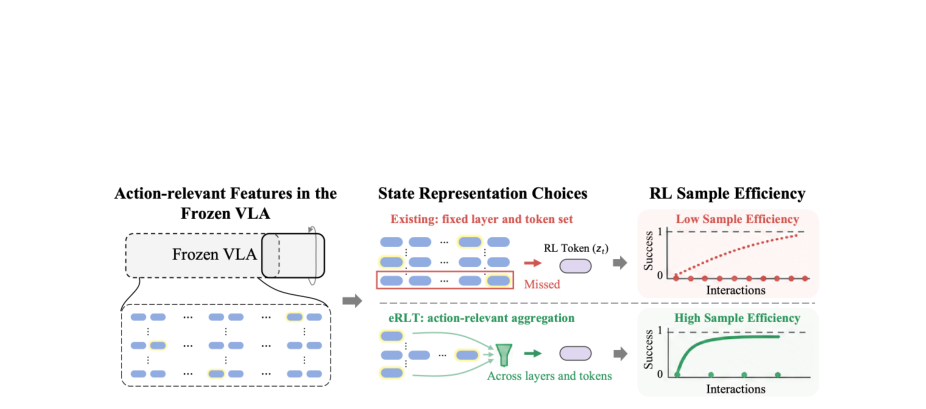

*Results / analysis - Figure 2 shows that online RL is sensitive to both choices. The best source layer differs across tasks, improving over the final layer by 2.8 and 2.5 percentage points on Drawer Opening and Bowl-to- Plate, respectively. Selected token subsets also outperform all tokens by 3.9 and 5.8 points, with a different subset performing best on each*

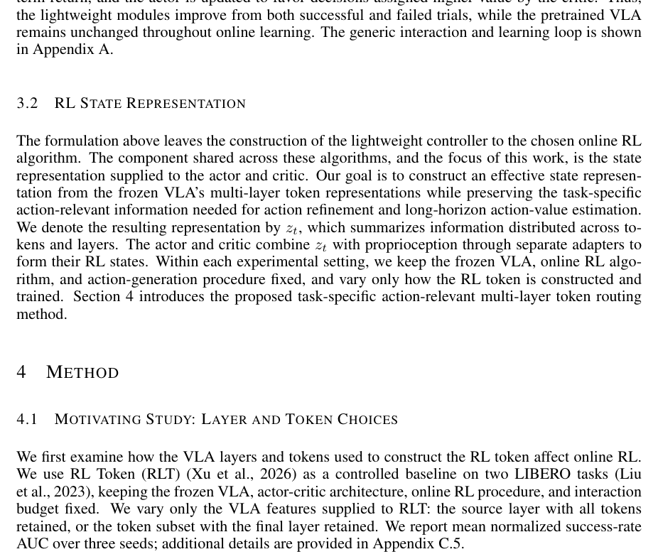

**Why this ranks #3**: Replaces the one-size-fits-all state representation for VLA RL with learned token- and layer-level routing; the +108.9% real-robot AUC gain over the strongest baseline is the largest in this track.

---

### 4. Skill2Real: Agentic Skill Learning for Zero-Shot Sim-to-Real Robot Manipulation

**arXiv**: [2610.02788](https://arxiv.org/abs/2610.02788) | **Score**: 9.3 (relevance 10 x 0.7 + quality 8 x 0.3) | **Tags**: embodied-ai, sim-to-real | **Categories**: cs.RO | **Pages**: 40

**Authors**: Xincheng He, Siyu Ma, Chang Yu, Yunuo Chen, Yanjia Huang, Ying Nian Wu, Yin Yang, Chenfanfu Jiang

**Affiliation**: University of California, Los Angeles 2Shanghai Jiao Tong University 3Envora 4University of Utah

**Abstract**

> Transferring robotic skills from simulation to reality requires task knowledge that remains usable across differences in perception, dynamics, and embodiment. We introduce Skill2Real, an agentic policy framework that learns executable skills through a shared application programming interface (API). A Proposer-Verifier-Governor (PVG) loop uses privileged simulation evidence to diagnose outcomes and validate updates, while keeping learned skills grounded in public observations and API semantics. The Cerebellum first acquires local manipulation skills; the Brain then learns task-level composition with the Cerebellum frozen. Both memories transfer to the real robot without task-policy fine-tuning or skill-memory updates. As GPT-5.6 Sol learns skills on LIBERO-90, evaluating each frozen checkpoint with GPT-6 Astra raises LIBERO-Pro Long success from 2.0% to 56.3%, without training on Pro Long. Independent Robosuite training reaches 85.1% and 89.4% mean success with Sol and Opus 5 across seven tasks, respectively. Frozen Sol-trained LIBERO-90 skills achieve 78.75% mean completion across four real-world manipulation tasks with Astra. Removing the Verifier or Governor during LIBERO-90 training lowers final Pro Long success by 17.3 and 13.3 percentage points, respectively. These results support learning and transferring a hierarchy of executable skills through a common robot interface.

**Key findings**

- **Finding**: Transfers robotic skills from simulation to reality requires task knowledge usable across differences in perception, dynamics and embodiment. Skill2Real learns executable skills through a shared application programming interface (API).

- **Finding**: A **Proposer-Verifier-Governor (PVG)** loop uses privileged simulation evidence to diagnose outcomes and validate updates, while keeping learned skills grounded in public observations and API semantics. The Cerebellum first acquires local manipulation skills; the Brain then learns task-level composition with the Cerebellum frozen.

- **Finding**: Both memories transfer to the real robot **without task-policy fine-tuning or skill-memory updates**. As GPT-5.6 Sol learns skills on LIBERO-90, evaluating each frozen checkpoint with GPT-6 Astra raises LIBERO-Pro Long success from 2.0% to 56.3% without training on Pro Long.

- **Finding**: Independent Robosuite training reaches 85.1% and 89.4% mean success with Sol and Opus 5 across seven tasks. Frozen Sol-trained LIBERO-90 skills achieve 78.75% mean completion across four real-world manipulation tasks. Removing Verifier or Governor during training lowers final Pro Long success by 17.3 and 13.3 points.

**Key figures**

*Results / analysis - Figure 1: Zero-shot real-world transfer of simulation-learned skills. Skill2Real learns transfer- able, skill-based knowledge across diverse simulation environments. The resulting frozen skills are evaluated on real-world tasks without additional learning, demonstrating robustness to variations in lighting, materials, and dynamics.*

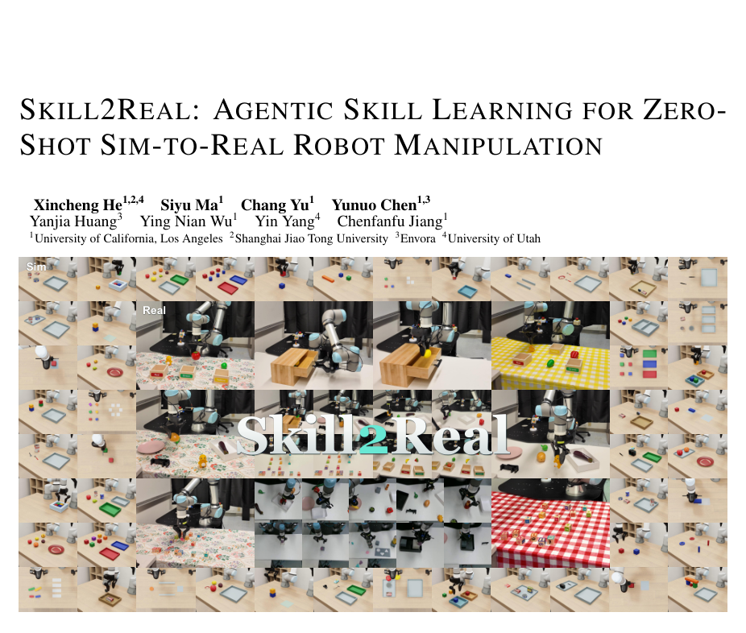

*Framework / architecture - Figure 2: Skill2Real pipeline. All in-context skill learning occurs in simulated scenes. Stage I learns reusable Cerebellum skills for local manipulation; Stage II freezes the Cerebellum and learns Brain skills that compositionally organize the local library into task programs. In both stages, the Proposer generates programs from public o*

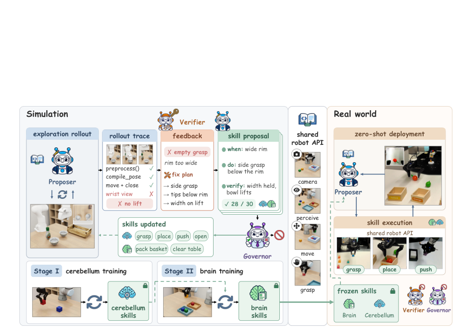

**Why this ranks #4**: PVG loop over a shared robot API; LIBERO-Pro Long 2.0% -> 56.3% with no training on the target. Ablations isolate the Verifier and Governor contributions.

---

### 5. FastOPD: On-Policy Distillation for Lightweight VLA Deployment

**arXiv**: [2610.02832](https://arxiv.org/abs/2610.02832) | **Score**: 9.0 (relevance 9 x 0.7 + quality 9 x 0.3) | **Tags**: embodied-ai | **Categories**: cs.RO, cs.AI, cs.CV, cs.LG | **Pages**: 26

**Authors**: Yoojin Oh, Jeongsol Kim, Yeonwoo Seo, Jangho Park, Seonghyun Jin, Sunwoo Park, Youngmin Kim, Youngjun Jun, Kyumin Choi, Jong Chul Ye

**Affiliation**: KAIST | Sungkyunkwan University

**Abstract**

> Vision-Language-Action (VLA) foundation models have scaled rapidly to enhance manipulation performance and generalizability, but this scaling incurs high computational costs that render real-world deployment increasingly challenging. Existing approaches typically mitigate this issue by designing smaller architectures or reducing the iterative denoising steps in flow-based policies. In this work, we propose FastOPD, a foundation-to-lightweight VLA framework that enables the practical deployment of large-scale VLAs through efficient on-policy distillation. Specifically, FastOPD adapts a flow map for single-state teacher supervision and combines it with a self-consistency objective to construct a compact student that learns the teacher dynamics. Furthermore, we theoretically demonstrate that minimizing this objective allows the distilled student to recover a distribution on par with that induced by an ideal few-step teacher model. We evaluate FastOPD across diverse foundation policies in simulation and real-world experiments. On LIBERO, FastOPD retains 84% of the performance of $π_{0.5}$ with only two inference steps, reducing inference latency by 78.1% while outperforming existing few-step distillation baselines in average success rate. With LingBot-VLA as the teacher, FastOPD improves the single-step success rate over the base student by 15.9 percentage points on RoboTwin 2.0. We further demonstrate its applicability to a World Action Model (WAM) and deploy a compact student distilled from MolmoAct2 on a real robot.

**Key findings**

- **Finding**: Scaling VLA foundation models makes real-world deployment difficult; existing approaches mitigate this with smaller architectures or fewer flow-matching denoising steps.

- **Finding**: FastOPD adapts a **flow map for single-state teacher supervision** and combines it with a self-consistency objective to construct a compact student that learns the teacher dynamics; the paper theoretically shows minimizing this objective lets the student recover a distribution on par with an ideal few-step teacher.

- **Finding**: On LIBERO, FastOPD retains **84% of pi_0.5 performance with only two inference steps, reducing inference latency by 78.1%**, outperforming existing few-step distillation baselines in average success rate.

- **Finding**: With LingBot-VLA as teacher, single-step success on RoboTwin 2.0 improves by 15.9 points over the base student. The approach also applies to a World Action Model, and a compact student distilled from MolmoAct2 is deployed on a real robot.

**Key figures**

*Framework / architecture - Figure 1: Foundation-to-lightweight VLA policy distillation with FastOPD. (Left) Our method enables a small VLA to inherit large-scale VLA knowledge. (Right) FastOPD reaches comparable performance to conventional on-policy distillation (Li et al., 2026a) 5.7× faster.*

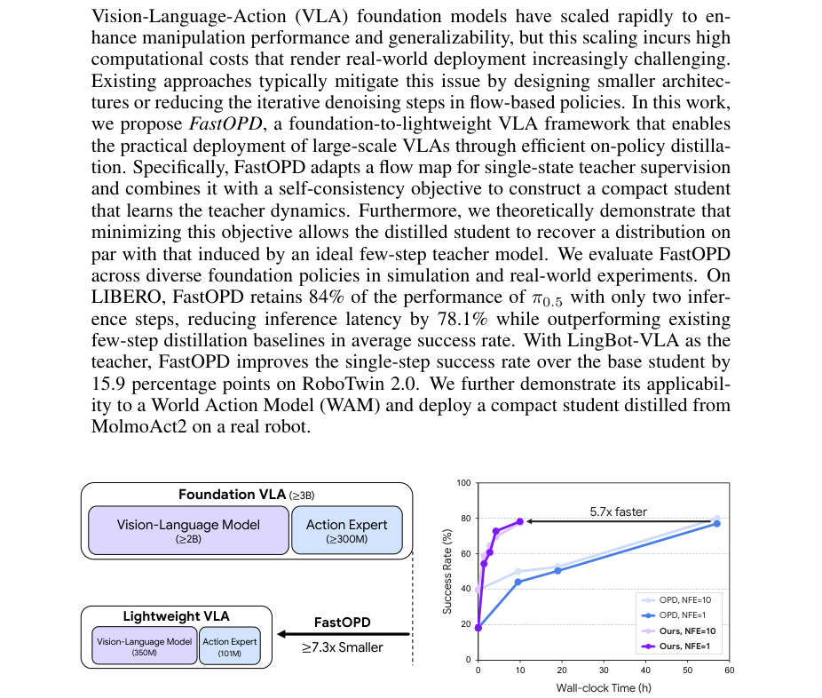

*Framework / architecture - Figure 3: Overview of FastOPD. (a) Flow Map Architecture: a frozen vision-language backbone with a lightweight action expert. A time projection layer ψ(·) fuses (s, t) to condition the action expert on the two-time velocity uθ(xs, s, t). (b) On-Policy Flow Map Distillation Loss: at a single on-policy jump ˜xt = fθ(x1, 1, t), the student’s*

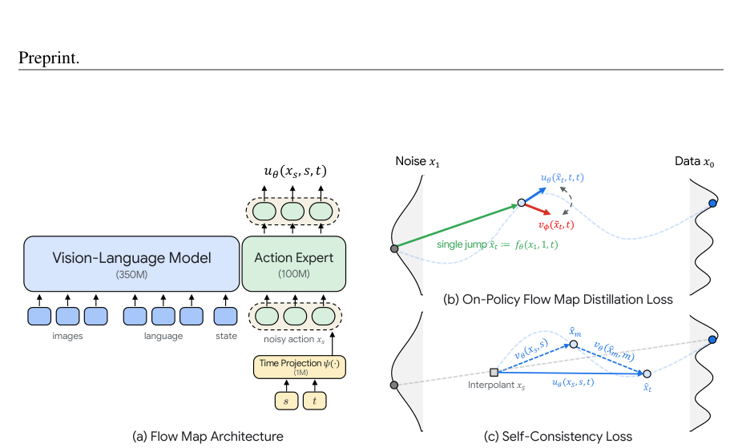

**Why this ranks #5**: Keeps 84% of pi_0.5 performance at two inference steps with a 78.1% latency cut, proves the student recovers the ideal few-step teacher's distribution, and deploys on a real robot.

---

### 6. SimpleTouch: Can Vision-Language-Action Models Master Contact-Rich Manipulation Without Tactile Policy Pretraining?

**arXiv**: [2610.02784](https://arxiv.org/abs/2610.02784) | **Score**: 9.0 (relevance 9 x 0.7 + quality 9 x 0.3) | **Tags**: embodied-ai | **Categories**: cs.RO | **Pages**: 27

**Authors**: Chen Yang, Linzhe Shi, Changjie Wu, Hang Zhang, Ronghan Chen, Lingjun Zhang, Xu Hu, Mu Xu, Jiansheng Fan, Chen Wang

**Affiliation**: Tsinghua University | Amap, Alibaba Group | Hong Kong Polytechnic University

**Abstract**

> Tactile sensing provides essential contact information for robotic manipulation, yet incorporating it into pretrained vision-language-action (VLA) models remains challenging. A common concern is that simply introducing touch during task-specific fine-tuning may fail to bridge the cross-modal gap, yielding limited gains or even reduced success. Consequently, existing methods often rely on large-scale tactile policy pretraining or separate visuotactile alignment, adding data requirements and training stages. We introduce SimpleTouch, a simple VLA extension that augments $π_{0.5}$ with a tactile expert, to test whether these additional stages are necessary. Leveraging all tokens from a frozen pretrained tactile encoder, the expert learns from action supervision and multi-horizon prediction of future tactile latents. This single-stage training uses only task demonstrations, without additional tactile policy pretraining or separate alignment. With 50 demonstrations per task, SimpleTouch achieves the highest success rate among evaluated methods on all six UniVTAC tasks. Its average success rate reaches 77.5%, compared with 45.2% for FTP-$π_{0.5}$ and 66.7% for FTP-1, corresponding to gains of 32.3 and 10.8 percentage points, respectively. Across four real-world tasks, it averages 71.3%, exceeding FTP-1 by 8.8 percentage points. These results demonstrate that, given pretrained VLA and tactile representations, additional tactile policy pretraining is not a prerequisite for strong performance on these tasks, offering a simpler route to contact-rich manipulation. Project page: https://simpletouch-robot.github.io/

**Key findings**

- **Finding**: A common concern is that simply introducing touch during task-specific fine-tuning may fail to bridge the cross-modal gap, yielding limited gains or reduced success - so existing methods rely on large-scale tactile policy pretraining or separate visuotactile alignment.

- **Finding**: SimpleTouch augments pi_0.5 with a tactile expert, using **all tokens from a frozen pretrained tactile encoder**. The expert learns from action supervision and multi-horizon prediction of future tactile latents in a single stage, with only task demonstrations - no tactile policy pretraining, no separate alignment.

- **Finding**: With 50 demonstrations per task, SimpleTouch achieves the highest success rate among evaluated methods on all six UniVTAC tasks: **77.5% average versus 45.2% for FTP-pi_0.5 and 66.7% for FTP-1** (+32.3 and +10.8 points).

- **Finding**: Across four real-world tasks it averages 71.3%, exceeding FTP-1 by 8.8 points.

**Key figures**

*Framework / architecture - Figure 2: SimpleTouch architecture. A tactile expert uses complete current tactile features from a frozen encoder and learns multi-horizon future prediction. In the right-side training and inference masks, rows are queries, columns are keys/values, and colored cells mark permitted attention. The symbols c0, z0, z1:H, and a1:H denote the c*

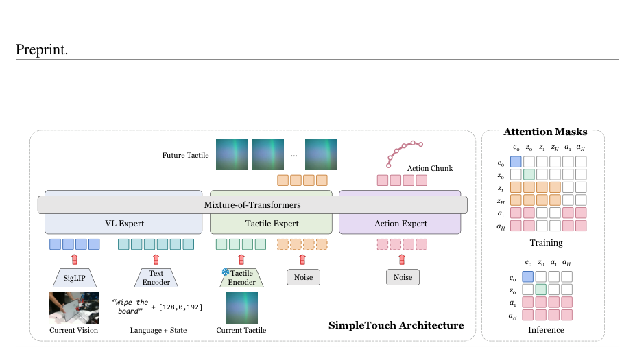

*Results / analysis - Figure 3: Real-world setup and rollouts. The left panel shows the PiPER platform and sensing hardware; the right panel shows all four tasks—Play Mahjong, Wipe Board, Pick Up Chips, and Insert USB—with time progressing from left to right throughout each rollout.*

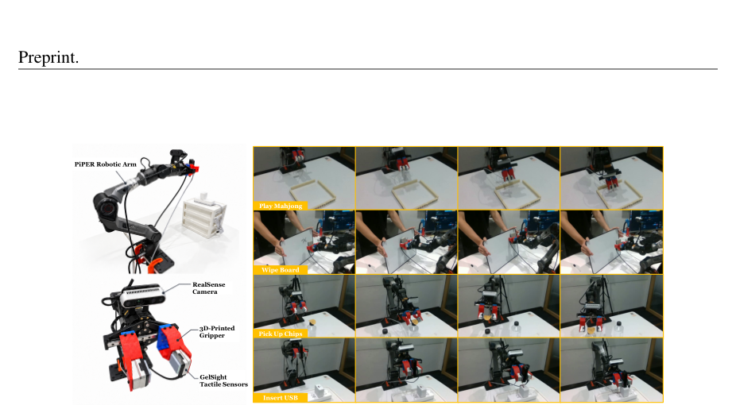

**Why this ranks #6**: Removes a stage the field treats as required: 77.5% vs 45.2% on six UniVTAC tasks with single-stage training. The negative-result framing is as useful as the number.

---

### 7. CHASE-VLA: Post-Training Quantization Framework for Vision-Language-Action Models with Chunk-Aware Scale Estimation

**arXiv**: [2610.02666](https://arxiv.org/abs/2610.02666) | **Score**: 8.7 (relevance 9 x 0.7 + quality 8 x 0.3) | **Tags**: embodied-ai | **Categories**: cs.CV | **Pages**: 22

**Authors**: Jin Hyun, Jung Gyu Min, Gyuhyun Jung, Youngjoo Lee

**Affiliation**: @postech.ac.kr

**Abstract**

> Vision-Language-Action (VLA) models map visual observations and language instructions to continuous robot actions, but a diffusion-based action expert (AE) poses a key challenge for low-bit post-training quantization (PTQ). The AE is repeatedly invoked across denoising steps and policy queries, where fixed calibration scales can be mismatched with activation ranges that vary with denoising progress and intended motion. We propose CHASE-VLA, a chunk-aware PTQ method that exploits a VLA-specific signal readily available from the policy: the generated action chunk, including its unexecuted future suffix. Rather than relying only on static scale matching for AE layers, CHASE-VLA combines the previously generated chunk as causal action context with denoising step group information to adapt AE activation scales. This enables W4A4 quantization of both MLP and attention projections in the repeated AE without modifying the pretrained policy. On LIBERO, CHASE-VLA achieves 97.3% average success rate on $π_{0.5}$ when both MLP and attention projections in the AE are quantized to W4A4, restoring FP16-level performance. CHASE-VLA also reduces the weight storage of the quantized AE linear layers by 73.4% and their single-chunk memory traffic by 70.9% and 71.2% on $π_{0.5}$ and GR00T N1.6, respectively, with a predictor overhead of at most 1.26% of the saved storage.

**Key findings**

- **Finding**: The diffusion-based action expert (AE) in a VLA is invoked repeatedly across denoising steps and policy queries, where fixed calibration scales mismatch activation ranges that vary with denoising progress and intended motion - a key obstacle to low-bit post-training quantization.

- **Finding**: CHASE-VLA exploits a VLA-specific signal already available from the policy: the **generated action chunk, including its unexecuted future suffix**. It combines the previously generated chunk as causal action context with denoising step group information to adapt AE activation scales.

- **Finding**: Enables **W4A4** quantization of both MLP and attention projections in the repeated AE without modifying the pretrained policy. On LIBERO, CHASE-VLA achieves **97.3% average success rate on pi_0.5** with both quantized, restoring FP16-level performance.

- **Finding**: Reduces quantized AE linear-layer weight storage by 73.4% and single-chunk memory traffic by 70.9% and 71.2% on pi_0.5 and GR00T N1.6, with a predictor overhead of at most 1.26% of the saved storage.

**Key figures**

*Framework / architecture - Fig. 1: VLA architecture with a diffusion-based AE for action generation.*

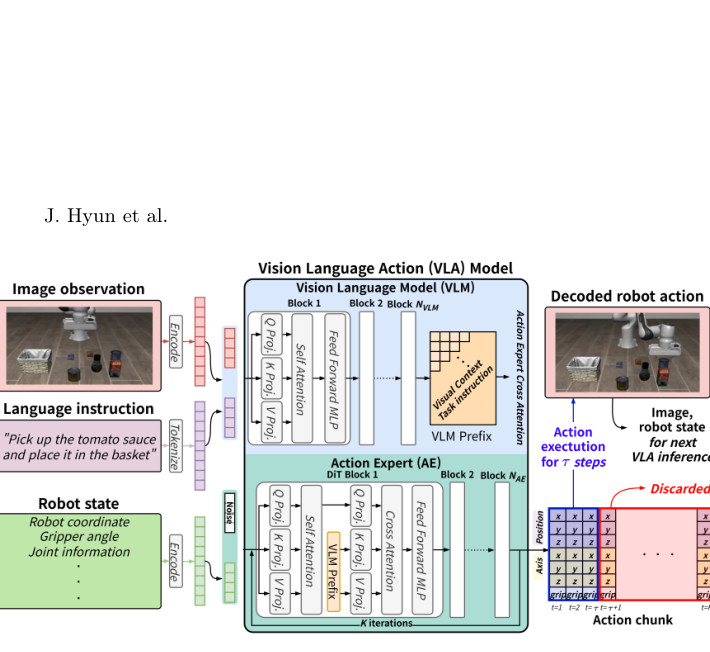

*Framework / architecture - Fig. 3: Overview of CHASE-VLA. After each policy query, the generated action chunk, including its unexecuted future suffix, provides causal action context for precomputing activation scales for denoising step groups in the next query.*

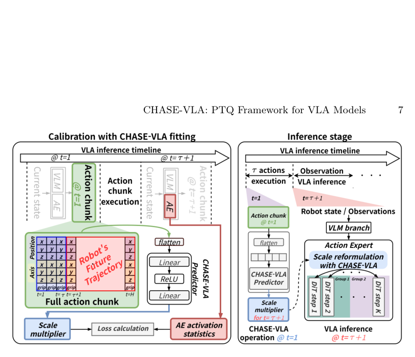

**Why this ranks #7**: Uses the action chunk's unexecuted suffix as a free signal for calibrating the diffusion action expert. W4A4 restores FP16-level 97.3% on pi_0.5 - a deployment paper that actually restores accuracy.

---

### 8. Imagine the Future, Internalize the Gist: Efficient VLA Reasoning via Internalized Spatiotemporal Imagination

**arXiv**: [2610.02626](https://arxiv.org/abs/2610.02626) | **Score**: 8.7 (relevance 9 x 0.7 + quality 8 x 0.3) | **Tags**: embodied-ai | **Categories**: cs.CV | **Pages**: 15

**Authors**: Shenglan Li, Zhendong Mi, Hengyi Zhu, Jingwu Luo, Chun Kit Chan, Geng Yuan, Yanzhi Wang, Pu Zhao, Shaoyi Huang

**Affiliation**: Stevens Institute of Technology | Northeastern University | Arizona State University | University of Georgia

**Abstract**

> Vision-language-action (VLA) models increasingly incorporate intermediate reasoning to improve robotic manipulation, yet existing approaches primarily reason about observed states without explicitly anticipating future scene evolution. Extending such reasoning to explicit future rollouts at every inference step, however, introduces substantial computational overhead. We propose IG-VLA, a VLA reasoning framework that enables models to imagine the future and internalize the gist. Our Latent Spatiotemporal Reasoning learns to imagine task-relevant future scene evolution directly in visual representation space, guiding action prediction without costly pixel-level video generation. To further reduce inference overhead, we introduce Scene Gist Memory, which internalizes reasoning-derived scene-behavior associations into a compact Scene Gist Token, preserving the benefits of future reasoning while bypassing explicit future imagination at inference. Extensive experiments on LIBERO, LIBERO-Plus, and VLABench demonstrate the effectiveness and efficiency of IG-VLA. On the LIBERO-Plus Language suite, both the reasoning and gist policies outperform the strongest baseline by nearly 6% in success rate. The gist policy also achieves up to 6.38x speedup over baselines, reducing inference latency from 1081ms to 169.5ms per action chunk on a single NVIDIA A6000 GPU. These results demonstrate that future spatiotemporal reasoning can be effectively internalized for efficient VLA deployment.

**Key findings**

- **Finding**: VLA models increasingly incorporate intermediate reasoning, yet existing approaches reason about observed states without anticipating future scene evolution. Explicit future rollouts at every inference step introduce substantial computational overhead.

- **Finding**: IG-VLA's **Latent Spatiotemporal Reasoning** learns to imagine task-relevant future scene evolution directly in visual representation space, guiding action prediction without costly pixel-level video generation.

- **Finding**: **Scene Gist Memory** then internalizes reasoning-derived scene-behavior associations into a compact Scene Gist Token, preserving the benefit of future reasoning while bypassing explicit imagination at inference.

- **Finding**: On LIBERO, LIBERO-Plus and VLABench, both the reasoning and gist policies outperform the strongest baseline by nearly 6% success on the LIBERO-Plus Language suite. The gist policy achieves up to **6.38x speedup, cutting per-action-chunk latency from 1081 ms to 169.5 ms** on a single NVIDIA A6000.

**Key figures**

*Results / analysis - Figure 2: Human Automaticity vs. Scene Gist Memory.*

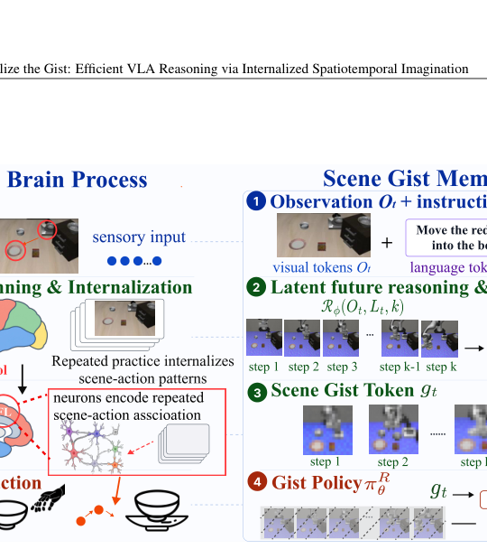

*Framework / architecture - Figure 3: Overview of our framework. (a) the overall architecture; (b) the latent spatiotemporal reasoning module learns to predict future visual keyframes; (c) the gist modules internalize reasoning- derived behavioral information into a compact Scene Gist Token.*

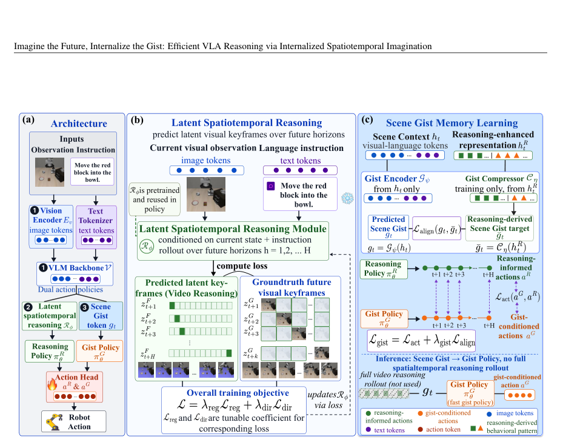

**Why this ranks #8**: Reasons about the future in latent space, then internalizes it into a Scene Gist Token so inference skips imagination entirely - 6.38x speedup with ~6% success gain.

---

### 9. ManiPhysicsBench: Physics-Based Assessment of Object Preservation in VLA Manipulation

**arXiv**: [2610.02802](https://arxiv.org/abs/2610.02802) | **Score**: 8.7 (relevance 9 x 0.7 + quality 8 x 0.3) | **Tags**: embodied-ai, world-model | **Categories**: cs.RO | **Pages**: 44

**Authors**: Sangwu Park, Yeonjun In, Wonjoong Kim, Sungwon Kim, Sein Kim, Chanyoung Park

**Affiliation**: KAIST

**Abstract**

> Vision-language-action (VLA) models aim to perform diverse manipulation tasks, but task success in existing rigid-body benchmarks does not indicate whether they preserve objects. We introduce ManiPhysicsZoo, which consolidates literature-supported material properties, 3D meshes, and supporting references into reusable object assets. Using these assets, a solver-based assessment computes grasp-specific damage thresholds from object geometry, material properties, and recorded grasp conditions and compares them with recorded contact forces to assess potential deformation and fracture. Building on these components, ManiPhysicsBench evaluates object preservation in LIBERO and SimplerEnv across three physics axes and three difficulty levels. Public VLA checkpoints show a substantial gap between task success and safe success, defined as task completion while preserving the object. Their gripper commands concentrate near full opening and closure, with largely similar aggregate distributions across objects, consistent with binary gripper supervision. We examine how object-specific continuous gripper labels change model behavior by retraining a VLA model. The retrained model shows more object-dependent gripping and higher safe success, but lower task success and limited generalization of object-preserving behavior.

**Key findings**

- **Finding**: Task success in existing rigid-body manipulation benchmarks does not indicate whether VLA models **preserve objects**. ManiPhysicsZoo consolidates literature-supported material properties, 3D meshes and references into reusable object assets.

- **Finding**: A solver-based assessment computes grasp-specific damage thresholds from object geometry, material properties and recorded grasp conditions, comparing them with recorded contact forces to assess deformation and fracture.

- **Finding**: ManiPhysicsBench evaluates object preservation in LIBERO and SimplerEnv across three physics axes and three difficulty levels. Public VLA checkpoints show a substantial gap between task success and **safe success** (task completion while preserving the object).

- **Finding**: Gripper commands concentrate near full opening and closure with largely similar aggregate distributions across objects, consistent with binary gripper supervision. Retraining with object-specific continuous gripper labels yields more object-dependent gripping and higher safe success, but lower task success and limited generalization of object-preserving behaviour.

**Key figures**

*Framework / architecture - Figure 1: Overview of the framework. Upper left: MANIPHYSICSZOO turns each object into an asset that carries its geometry, mass, material properties, and the sources of those properties. Upper right: solver- based assessment builds a mechanical model from the asset and the grasp recorded during a rollout, computes a damage threshold at th*

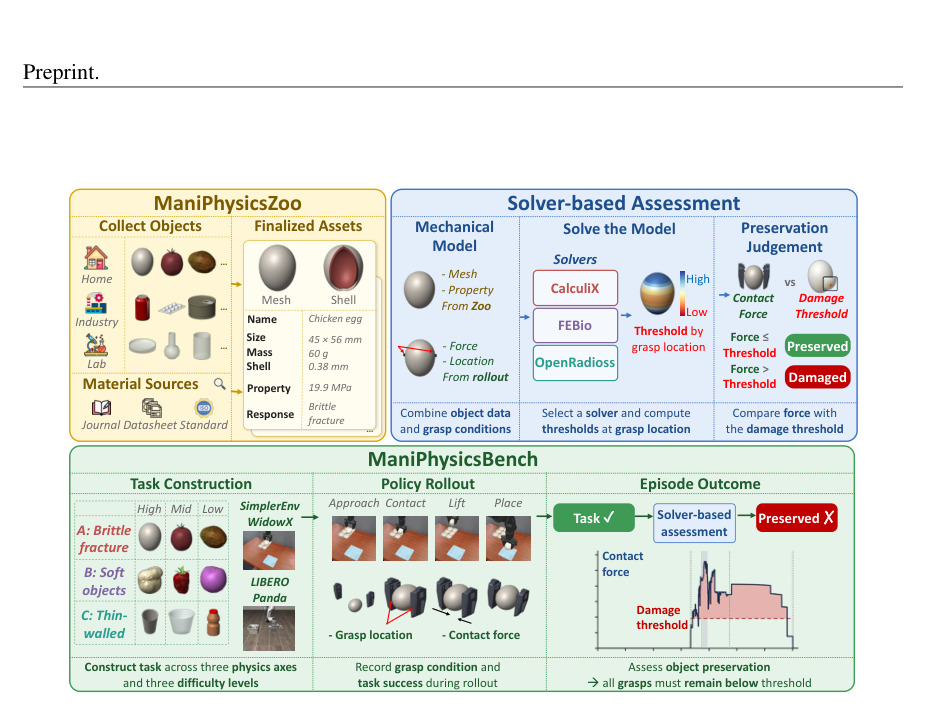

**Why this ranks #9**: Shows task success and safe success diverge sharply, and traces it to binary gripper supervision. A benchmark that changes what 'success' means for manipulation.

---

### 10. AVL-JEPA: Preventing Causal Dynamics Information Collapse In Joint Embedding Predictive Architecture World Models `[wild-card]`

**arXiv**: [2610.03587](https://arxiv.org/abs/2610.03587) | **Score**: 8.7 (relevance 9 x 0.7 + quality 8 x 0.3) | **Tags**: world-model, embodied-ai | **Categories**: cs.RO | **Pages**: 17

**Authors**: Yikang Qiao, Ling Zhang, Ziying Song, Duan Huang

**Affiliation**: Central South University | Yanshan University

**Abstract**

> Joint embedding predictive architectures (JEPAs) predict future latent representations without reconstructing observations, enabling world models to focus on high-level semantic dynamics. However, a JEPA can preserve high dimensional visual information while discarding information about the physical consequences of actions. We call this failure mode causal dynamics information collapse and propose action-grounded vision-invariance latent (AVL) to prevent this collapse. We first use the executed action as an auxiliary dynamics anchor that encourages the model to preserve dynamics information, and then use a vision-invariance pathway which aligns perturbed and clean latent predictions without discarding dynamics information, forcing the model to fully understand and utilize causal dynamics information. We validate AVL on four robotic control tasks (TwoRoom, PushT, OGBench Cube, and Reacher), showing that it substantially improves success rates under visual perturbations while preserving clean-environment performance. We further evaluate physical consequence alignment, clean-noisy dynamics consistency, and the causal effect of targeted transition subspace erasure. Collectively, these results indicate that dynamic information causally relevant to planning is preserved from collapse under AVL.

**Key findings**

- **Finding**: A JEPA can preserve high-dimensional visual information while **discarding information about the physical consequences of actions** - the authors name this causal dynamics information collapse.

- **Finding**: Proposes action-grounded vision-invariance latent (AVL). First the executed action is used as an **auxiliary dynamics anchor** encouraging the model to preserve dynamics information; then a vision-invariance pathway aligns perturbed and clean latent predictions *without* discarding dynamics information, forcing the model to use causal dynamics information.

- **Finding**: Validated on four robotic control tasks (TwoRoom, PushT, OGBench Cube, Reacher), substantially improving success rates under visual perturbations while preserving clean-environment performance.

- **Finding**: Further evaluates physical consequence alignment, clean-noisy dynamics consistency, and the causal effect of targeted transition subspace erasure, indicating that dynamically causal planning information is preserved from collapse under AVL.

**Key figures**

*Results / analysis - Figure 1: Measured PCA projection of predicted ∆z transition responses for LEWM and AVL (ours). Both panels use one shared transform and identical action candidates; different colors denote different candidate action categories.*

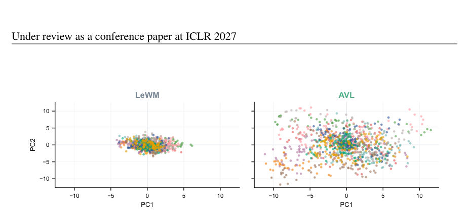

*Results / analysis - Figure 3: Clean–noisy candidate-transition geometry on TwoRoom for LEWM and AVL (ours). Red triangles indicate states satisfying Dnuis/Dact > 0.5 together with a clean–noisy Top-1 candidate flip. The transparent planes show the same ratio threshold in the (Dact, Dnuis) and log10(Dnuis/Dact) views.*

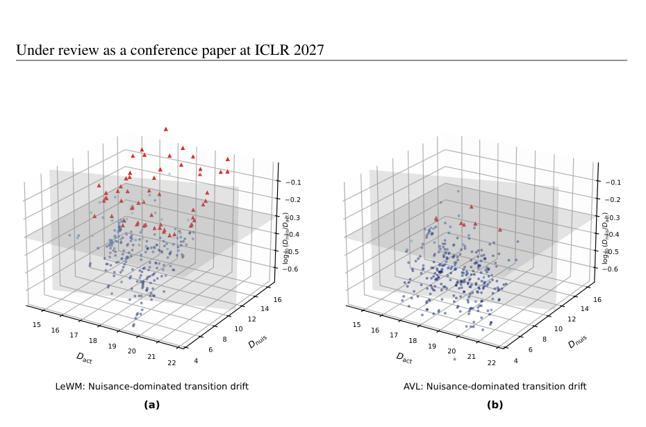

**Why this ranks #10**: Promoted because it names and fixes a distinct failure from the JEPA-plannability paper ranked #1 in this track: a JEPA can preserve visual detail while discarding the physical consequences of actions.

---

## Footer

- Total papers scanned across all 7 arXiv categories: **648**
- Papers read in full for this digest: **50**
- embodied track final top-10: **10**
- Wild-cards in this track: **1**
- Figure assets: `2026-10-05/res/` (69 images shared across all 5 tracks)

Generated by the `mine-arxiv-daily-digest` skill. Sister file: `2026-10-05_embodied_entry.md`.
