# ArXiv Daily Digest - 2026-10-05 (Reinforcement Learning (Algorithms, RLHF, MARL), 10 papers)

**Generated**: 2026-10-05 17:30 CST
**Source**: arXiv cs.LG, cs.AI, cs.RO, cs.CL submissions, window 2026-10-01/02 UTC (the latest announced batch as of 2026-10-05)
**Track**: rl (top 10 of 648 papers scanned)
**Scope**: model-based RL generalization, multi-fidelity and data-efficient RL, critic-free RLHF, rubric reward design, multi-agent credit assignment, exploration curricula, option discovery, real-world robot RL

---

Data efficiency and credit assignment dominate. VIGOR is the cleanest result: model-based RL suffers a two-level vulnerability where encoder OOD compounds through recursive latent rollouts, and enforcing latent-space consistency beats SOTA model-free *and* model-based baselines by 3.4% on DMC and 43.6% on Robosuite - with robustness that is augmentation-agnostic, which is the part that makes it convincing. MFPG-PPO extends multi-fidelity policy gradients to actor-critic, diagnosing exactly why naive PPO extensions lose cross-fidelity correlation. On the LLM side, Follow the Winners replaces GRPO's group rollouts with an ordinal filter, which matters precisely because stateful agent environments make repeated rollouts impractical, and its control-as-inference derivation recovers GRPO and DPO as special cases. MetaRubric names a reward-design bug worth knowing about - *vacuous credit*, where a rubric judge awards points for information absent from the response. BVER and Wayfarer both target the exploration bottleneck from unusual directions: bidirectional start/goal curricula, and Laplacian option discovery.

---

## Top 10 - Reinforcement Learning (Algorithms, RLHF, MARL)

### 1. VIGOR: Zero-Shot Visual Generalization via Latent-Space Consistency in Model-Based Reinforcement Learning

**arXiv**: [2610.02801](https://arxiv.org/abs/2610.02801) | **Score**: 9.7 (relevance 10 x 0.7 + quality 9 x 0.3) | **Tags**: rl-algorithm | **Categories**: cs.AI, cs.LG, cs.RO | **Pages**: 41

**Authors**: Mingyu Park, Samyeul Noh, Hyun Myung, Donghwan Lee

**Affiliation**: KAIST

**Abstract**

> Model-based reinforcement learning (MBRL) achieves strong sample efficiency by planning within learned latent dynamics, yet its performance degrades substantially under unseen visual distractions such as background variations, lighting changes, or camera shifts. Unlike model-free RL, where encoder perturbations affect only single-step predictions, MBRL suffers from a two-level vulnerability: visual distractions first push encoder outputs out of distribution, and these errors then compound through recursive latent rollouts over the planning horizon. We propose visual generalization via latent-space consistency in model-based RL (VIGOR), a framework that enables zero-shot generalization to unseen visual distractions while retaining the sample efficiency of its MBRL backbone. VIGOR integrates three interdependent components: (i) asymmetric weak-to-strong augmentation, which pairs weak-only and weak-to-strong latent views within a single batch; (ii) dynamics-level consistency, which enforces augmentation-invariant transition predictions through direct latent regression; and (iii) encoder-level stabilization, which prevents encoder drift under the cross-augmentation supervision imposed by dynamics-level consistency. Evaluations on the DeepMind Control Suite (DMC) and Robosuite show that VIGOR outperforms state-of-the-art model-free and model-based baselines, surpassing the second-best baseline by 3.4% on DMC and 43.6% on Robosuite. Ablations further show that VIGOR's robustness is augmentation-agnostic: replacing the default augmentation with alternatives from distinct perturbation families preserves strong generalization, confirming that latent-space consistency, not the augmentation choice, drives robustness.

**Key findings**

- **Finding**: Model-based RL degrades substantially under unseen visual distractions (background variation, lighting, camera shift) because of a **two-level vulnerability**: distractions first push encoder outputs out of distribution, and these errors then compound through recursive latent rollouts over the planning horizon.

- **Finding**: Unlike model-free RL where encoder perturbations affect only single-step predictions, that compounding is what breaks MBRL. VIGOR addresses it with three interdependent components: (i) asymmetric weak-to-strong augmentation pairing weak-only and weak-to-strong latent views within a single batch; (ii) dynamics-level consistency enforcing augmentation-invariant transition predictions via direct latent regression; (iii) encoder-level stabilization preventing encoder drift under the cross-augmentation supervision that (ii) imposes.

- **Finding**: On the DeepMind Control Suite and Robosuite, VIGOR outperforms state-of-the-art model-free *and* model-based baselines, surpassing the second-best baseline by **3.4% on DMC and 43.6% on Robosuite**.

- **Finding**: Ablations show robustness is augmentation-agnostic - replacing the default augmentation with alternatives from distinct perturbation families preserves strong generalization, confirming latent-space consistency, not the augmentation choice, drives robustness.

**Key figures**

*Results / analysis - Figure 1: Challenges of unseen visual distractions. Left: During training (top), clean observations strain*

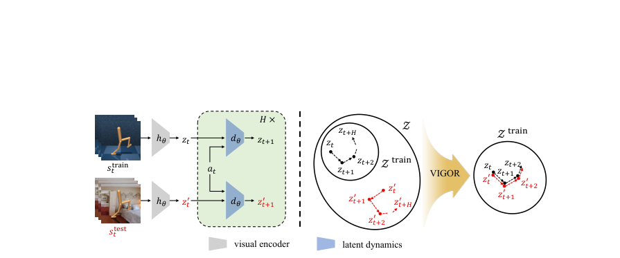

*Framework / architecture - Figure 2: Overview of VIGOR. Left: AW partitions a mini-batch into weak-only (Iw) and weak-to-strong (Iws) subsets, producing paired views sw*

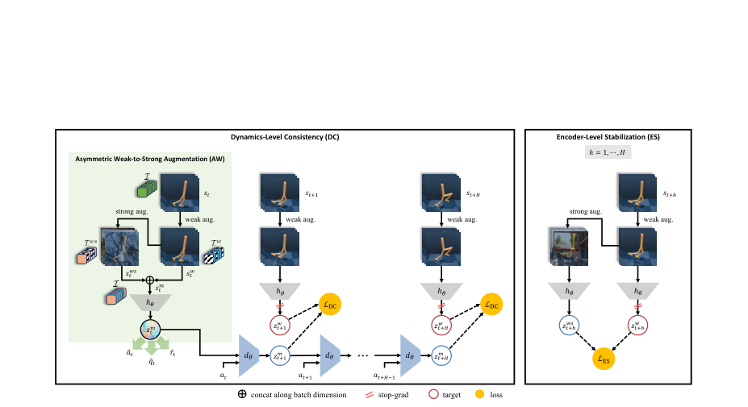

**Why this ranks #1**: Correctly identifies MBRL's two-level vulnerability and fixes it with three components. +3.4% DMC / +43.6% Robosuite over SOTA, and the robustness is augmentation-agnostic.

---

### 2. Multi-Fidelity Policy Gradients Stabilize Data-Scarce Reinforcement Learning

**arXiv**: [2610.02505](https://arxiv.org/abs/2610.02505) | **Score**: 9.4 (relevance 10 x 0.7 + quality 8 x 0.3) | **Tags**: rl-algorithm, sim-to-real | **Categories**: cs.LG, cs.AI, cs.RO | **Pages**: 30

**Authors**: Xinjie Liu, Ruihan Zhao, Anirban Chaudhuri, Cyrus Neary, Ufuk Topcu, David Fridovich-Keil

**Affiliation**: University of Texas at Austin | University of British Columbia

**Abstract**

> Policy gradient methods for on-policy reinforcement learning (RL) can become unstable when expensive, scarce target-domain data yield noisy gradient estimates. We address this challenge by complementing limited high-fidelity (HF) target-domain data with abundant, cheap, but biased low-fidelity (LF) data, e.g., from a simplified simulator. Most existing methods directly optimize biased objectives based on LF data. In contrast, the recently introduced multi-fidelity policy gradient (MFPG) framework uses LF data solely to construct a control variate that reduces variance and improves HF data efficiency without biasing the policy gradient estimator. However, published work on MFPG is limited to REINFORCE on small-scale simulation tasks. We develop MFPG for modern actor-critic learning in GPU-parallel simulation and on a physical robot. Our analysis and experiments show that naive extensions to proximal policy optimization (PPO) can lose cross-fidelity correlation or inflate variance. Our MFPG-PPO addresses these failures by redesigning the sampling, advantage estimation, and control variate construction to preserve cross-fidelity correlation, and by monitoring estimator uncertainty to prevent variance inflation. We also introduce a budget-aware MFPG-PPO to divide a fixed sampling budget among high- and low-fidelity data sources. Across simulated robot locomotion tasks of varying LF-to-HF transfer difficulty and HF data budgets, MFPG-PPO improves upon PPO trained on HF data alone in nearly all settings, and consistently matches the performance of PPO trained with 16x more HF data on the hardest task at the smallest HF budgets. In contrast, most baselines that use LF data perform well only where direct LF-to-HF transfer succeeds. MFPG-PPO enables stable learning on a physical Franka arm using only 4 real-robot episodes per update and no human demonstrations.

**Key findings**

- **Finding**: On-policy policy gradients become unstable when expensive, scarce target-domain data yield noisy gradient estimates; abundant cheap but biased low-fidelity data (e.g. a simplified simulator) can complement them as a control variate that reduces variance *without biasing* the estimator.

- **Finding**: Published MFPG work was limited to REINFORCE on small-scale simulation. Naive extensions to PPO lose cross-fidelity correlation or inflate variance.

- **Finding**: MFPG-PPO redesigns sampling, advantage estimation and control variate construction to preserve cross-fidelity correlation, and monitors estimator uncertainty to prevent variance inflation. A budget-aware variant divides a fixed sampling budget between sources.

- **Finding**: MFPG-PPO improves on PPO trained on HF data alone in nearly all settings and matches PPO with 16x more HF data on the hardest task; it enables stable learning on a physical Franka arm with 4 real episodes per update and no demonstrations.

**Key figures**

*Results / analysis - Figure 1: In a simulated humanoid robot locomotion task on rough terrain, MFPG-PPO (or- ange) scales monotonically with the HF data budget and, where PPO trained on HF data alone (blue) collapses, matches the mean return of PPO trained with 16× more HF data. HF data budgets are set by the number of parallel HF training environments and ex*

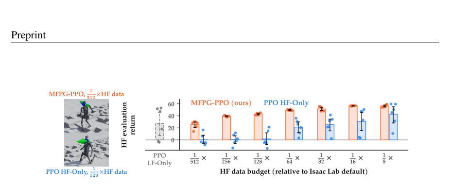

*Framework / architecture - Figure 2: MFPG-PPO collects three batches of transitions. Representative HF, coupled LF, and uncoupled LF rollouts are shown with red circles, filled teal circles, and hollow teal squares. (a) When HF and LF are simulations of different accuracy, each batch contains parallel T-step rollouts per iteration. (b) When the HF environment is a*

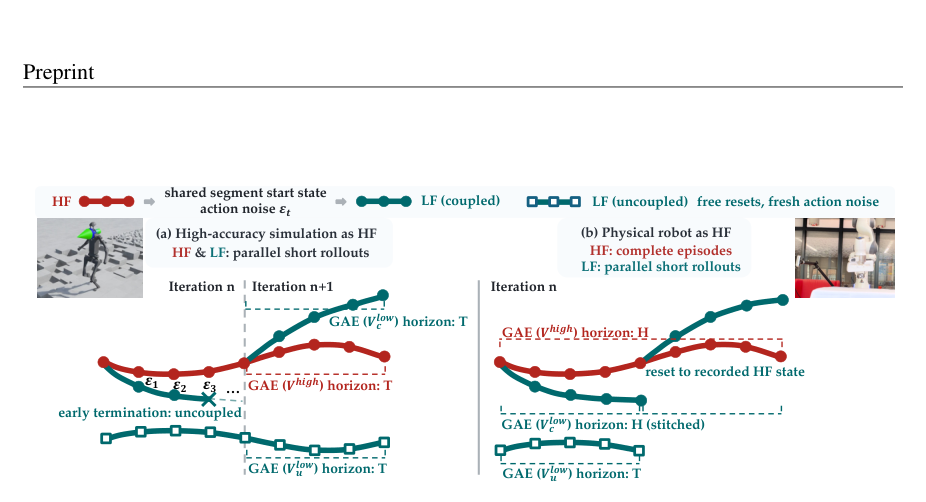

**Why this ranks #2**: Placed in RL per its highest-scoring track. Extends MFPG to PPO with concrete fixes for cross-fidelity correlation loss and variance inflation.

---

### 3. Follow the Winners: Conservative Policy Improvement with the Cross-Entropy Method for Critic-Free RFT

**arXiv**: [2610.03361](https://arxiv.org/abs/2610.03361) | **Score**: 9.0 (relevance 9 x 0.7 + quality 9 x 0.3) | **Tags**: rlhf | **Categories**: cs.LG, cs.AI | **Pages**: 50

**Authors**: Joery Ariën de Vries, Neil David Lawrence, Zhenwen Dai

**Affiliation**: Trent AI Limited, London, United Kingdom | Computer Laboratory, University of Cambridge, Cambridge, United Kingdom

**Abstract**

> Critic-free reinforcement fine-tuning (RFT) for agentic large language models is often done through GRPO-style methods, which compute a group baseline over repeated rollouts to reduce target variance. However, this setup is ill-suited to agents acting in stateful environments such as live services or security sandboxes, where repeated rollouts are impractical to obtain and aggressive updates entrench the noise of long, sparsely verified trajectories. We propose \textit{Follow the Winners} (FTW), a critic-free policy-learning algorithm that adapts the cross-entropy method to RFT, replacing group rollouts with an ordinal filter on replay-buffer samples that yields polynomial concentration in the order statistic of returns. We derive FTW through a control-as-inference lens, which also recovers GRPO and DPO as specific modelling choices, identifying GRPO as risk-neutral while DPO and FTW share a bounded risk-seeking offset that FTW controls. We identify this offset as an inherent trade-off of variance reduction through ordinal filters on samples, whereas a critic model induces a different trade-off between bias and variance. Scaled to agentic LLM post-training, FTW matches GRPO and PPO on Sokoban and Search-R1 baselines, showing a viable trade-off from a value model or group rollouts to CPU memory.

**Key findings**

- **Finding**: Critic-free reinforcement fine-tuning for agentic LLMs is often done with GRPO-style group baselines over repeated rollouts - ill-suited to agents acting in stateful environments such as live services or security sandboxes, where repeated rollouts are impractical and aggressive updates entrench noise from long, sparsely verified trajectories.

- **Finding**: Follow the Winners (FTW) adapts the **cross-entropy method** to RFT, replacing group rollouts with an **ordinal filter on replay-buffer samples**, yielding polynomial concentration in the order statistic of returns.

- **Finding**: FTW is derived through a control-as-inference lens that recovers GRPO and DPO as specific modelling choices - identifying GRPO as risk-neutral while DPO and FTW share a bounded risk-seeking offset that FTW controls.

- **Finding**: That offset is an inherent trade-off of variance reduction through ordinal filters on samples, whereas a critic model induces a different bias-variance trade-off. Scaled to agentic LLM post-training, FTW matches GRPO and PPO on Sokoban and Search-R1, showing a viable trade from a value model or group rollouts to CPU memory.

**Key figures**

*Results / analysis - Algorithm 1: Cross-Entropy Method. Input: Proposal qψ, score S, batch size N,*

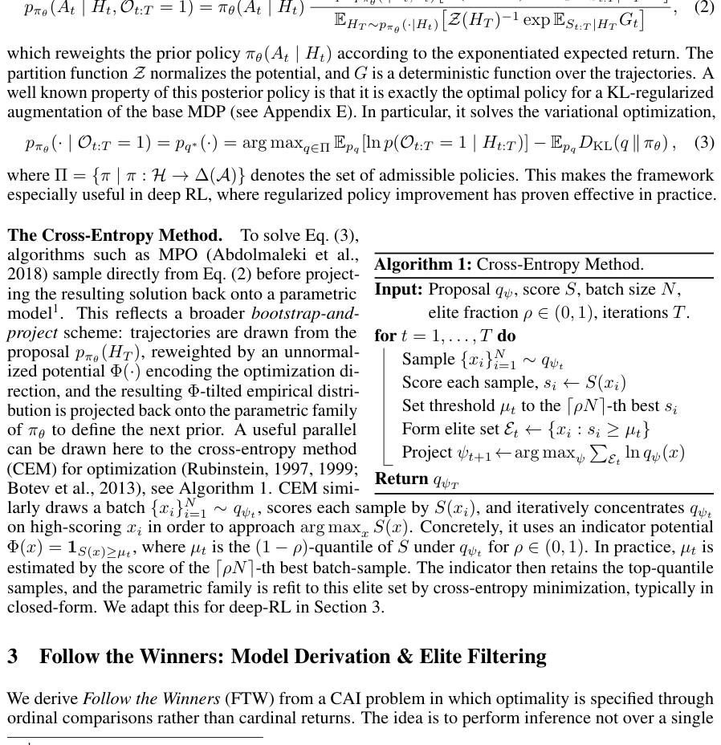

*Results / analysis - Figure shown on p.6 of the paper.*

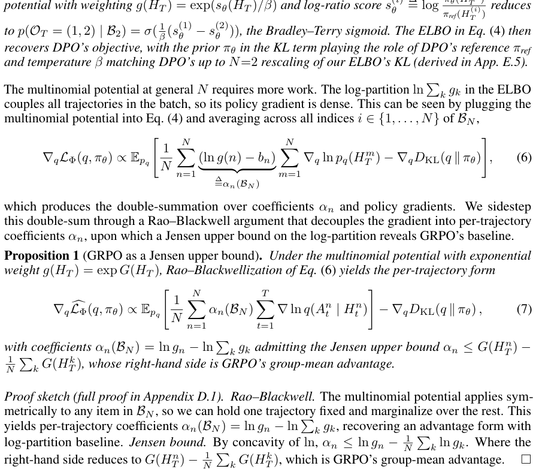

**Why this ranks #3**: Replaces GRPO's group rollouts with an ordinal filter, which matters for stateful agent environments where repeated rollouts are impractical. Derivation recovers GRPO and DPO as special cases.

---

### 4. MetaRubric: Learning to Reward for Rubric-Based Reinforcement Learning

**arXiv**: [2610.02824](https://arxiv.org/abs/2610.02824) | **Score**: 9.0 (relevance 9 x 0.7 + quality 9 x 0.3) | **Tags**: rlhf | **Categories**: cs.AI | **Pages**: 23

**Authors**: Yuxuan Fan, Jaehong Yoon

**Affiliation**: METARUBRIC: LEARNING TO REWARD FOR | RUBRIC-BASED REINFORCEMENT LEARNING | Yuxuan Fan | Jaehong Yoon† | NTU Singapore

**Abstract**

> Rubric-based reinforcement learning extends reward-driven optimization to open-ended tasks by assigning partial credit to individual response requirements. However, rubric judges can assign a high criterion score even when the information or action it requires is absent from the response, a failure mode we term Vacuous Credit. Such awards persist after the required information is removed and can reverse the sign of a response's GRPO advantage. To address this problem, we introduce MetaRubric, which alternates evidence-aware policy optimization with response-guided rubric adaptation. We construct counterfactual counterparts by changing one task-relevant fact in each prompt. During policy optimization, credit is assigned only when the response contains sufficient evidence to satisfy the required rubric criterion. After each policy-optimization stage, current policy responses guide revisions to original and counterfactual criteria while preserving the meaning of the original prompt's initial rubric as interpreted under each prompt's facts. We also adapt criterion weights at stage boundaries to better address observed policy errors. Across multiple backbones, MetaRubric improves PubMedQA accuracy by 6.00--20.40 percentage points over static-judge GRPO, with further gains on HealthBench-Hard and two multimodal medical benchmarks.

**Key findings**

- **Finding**: Rubric judges can assign a high criterion score even when the information or action it requires is **absent from the response** - a failure mode named **vacuous credit**. Such awards persist after the required information is removed and can reverse the sign of a response's GRPO advantage.

- **Finding**: MetaRubric alternates evidence-aware policy optimization with response-guided rubric adaptation. It constructs **counterfactual counterparts** by changing one task-relevant fact in each prompt.

- **Finding**: During policy optimization, credit is assigned only when the response contains sufficient evidence to satisfy the required rubric criterion. After each stage, current policy responses guide revisions to original and counterfactual criteria while preserving the original prompt's rubric meaning as interpreted under each prompt's facts. Criterion weights are adapted at stage boundaries.

- **Finding**: Across multiple backbones, MetaRubric improves PubMedQA accuracy by **6.00-20.40 percentage points over static-judge GRPO**, with further gains on HealthBench-Hard and two multimodal medical benchmarks.

**Key figures**

*Results / analysis - Figure 2: Reward growth and rubric satisfaction. (a,b) Training reward and rubric scores during training; evaluation uses a panel of three stronger judges on a separate test set. Panels (a,c) use GPT- 4o-mini as the training judge; panels (b,d) use GPT-5.4-mini. (c,d) Changes from step 0 in fully satisfied requirement weight and Vacuous C*

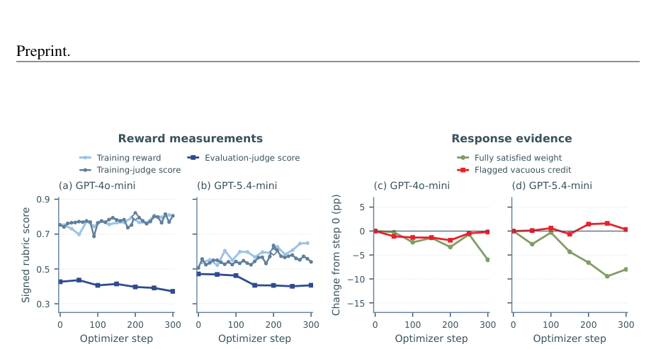

*Framework / architecture - Figure 3: Overview of MetaRubric. Each stage alternates N evidence-aware GRPO updates (Inner) with rubric adaptation (Outer). Accepted rubric updates carry into the next stage.*

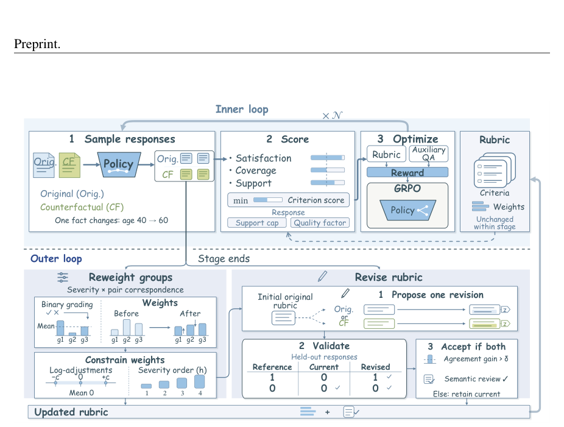

**Why this ranks #4**: Identifies 'vacuous credit' - rubric judges awarding credit for information absent from the response - and gates credit on evidence presence. +6.00-20.40pp over static-judge GRPO.

---

### 5. Bidirectional Voronoi-biased Exploration Curriculum for Reinforcement Learning

**arXiv**: [2610.03395](https://arxiv.org/abs/2610.03395) | **Score**: 9.0 (relevance 9 x 0.7 + quality 9 x 0.3) | **Tags**: rl-algorithm | **Categories**: cs.LG, cs.RO | **Pages**: 17

**Authors**: Juri Pfammatter, Kaixian Qu, Clemens Schwarke, Victor Klemm, Marco Hutter

**Affiliation**: Robotic Systems Lab, ETH Z¨urich, Z¨urich, Switzerland | NVIDIA

**Abstract**

> Long-horizon tasks with sparse rewards pose an exploration bottleneck for goal-conditioned reinforcement learning: a policy started from the initial state rarely reaches the goal and receives no learning signal. Reference motions, hand-designed curricula, and shaped rewards supply this signal but require demonstrations or task-specific engineering; automatic start-state and goal curricula avoid this but typically expand from one side only, so the full distance to the target must be covered from that side. We propose the Bidirectional Voronoi-biased Exploration curriculum for Reinforcement learning (BVER), which expands from both ends at once. Inspired by bidirectional RRT planning, BVER grows start states outward from the goal and goals outward from the initial state distribution, biases both toward unexplored task space, and steers them toward each other, training one goal-conditioned policy on both. On point-mass mazes, quadrupedal box climbing, and robot-arm ring-on-peg transfer, BVER learns faster than all compared reference-free curricula. On box climbing, it reaches 95% success on a 0.4 m box in roughly 65% fewer iterations than the best of them, is the only one of them to learn to climb a 0.7 m box, and yields a policy robust to start, goal, and yaw variation. Without a demonstration, it approaches the sample efficiency of reference-based curricula on the 0.4 m box and on ring-on-peg transfer. Ablations show that expanding from both ends outperforms either direction alone.

**Key findings**

- **Finding**: Long-horizon sparse-reward tasks have an exploration bottleneck: a policy started from the initial state rarely reaches the goal and receives no learning signal. Reference motions, hand-designed curricula and shaped rewards need demonstrations or task-specific engineering; automatic start-state and goal curricula avoid this but expand from one side only.

- **Finding**: BVER is inspired by **bidirectional RRT planning**: it grows start states outward from the goal and goals outward from the initial-state distribution, biases both toward unexplored task space, steers them toward each other, and trains one goal-conditioned policy on both.

- **Finding**: On point-mass mazes, quadrupedal box climbing and robot-arm ring-on-peg transfer, BVER learns faster than all compared reference-free curricula. On box climbing it reaches 95% success on a 0.4 m box in roughly 65% fewer iterations than the best of them and is **the only one to learn to climb a 0.7 m box**, yielding a policy robust to start, goal and yaw variation.

- **Finding**: Without a demonstration it approaches the sample efficiency of reference-based curricula on the 0.4 m box and on ring-on-peg transfer. Ablations show expanding from both ends outperforms either direction alone.

**Key figures**

*Results / analysis - Figure 1: BVER grows the curriculum from both ends of the task. Intermediate starts si (blue) grow from the target goal g⋆and intermediate goals gi (green) from the initial distribution s0 ∼ρ0; one policy trains on both (white arrows) with sparse rewards and no demonstrations. Shown: box climbing (left), ring-on-peg transfer (top right),*

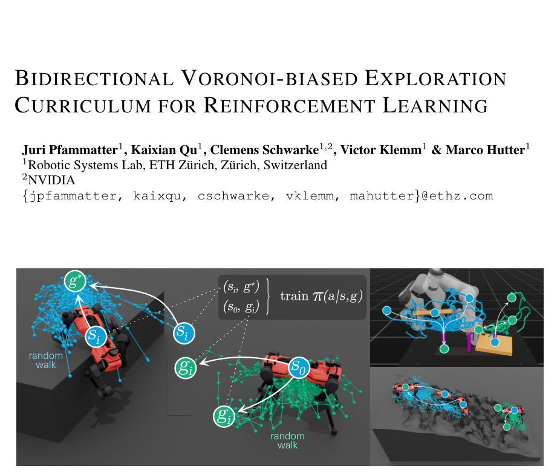

*Results / analysis - Figure 2: BVER’s expansion mechanism. Intermediate starts si (blue) grow from the target goal g⋆and goals gi (green) from the initial distribution ρ0. Random walks start from the states nearest to uniform task-space samples, favoring states whose Voronoi cell (shaded) reaches into unexplored space, or nearest to the other direction’s solv*

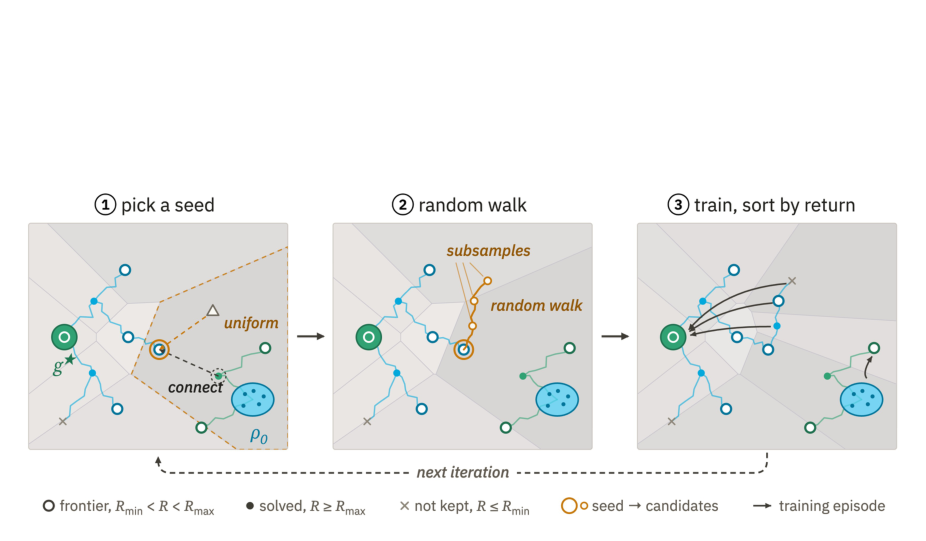

**Why this ranks #5**: A curriculum idea that is genuinely novel rather than a tuning sweep: expand start states and goals from both ends simultaneously, RRT-style. Only method tested to climb a 0.7 m box.

---

### 6. Turnover-Orthogonal Credit Assignment for Open-Team Multi-Agent Reinforcement Learning

**arXiv**: [2610.02847](https://arxiv.org/abs/2610.02847) | **Score**: 8.7 (relevance 9 x 0.7 + quality 8 x 0.3) | **Tags**: multi-agent-rl | **Categories**: cs.MA, cs.LG | **Pages**: 12

**Authors**: Amit Thakur, Mukesh Singhal

**Affiliation**: University of California, Merced

**Abstract**

> Open-team multi-agent reinforcement learning studies cooperative systems in which agents may join, leave, or be replaced during an episode. In such settings, the team return changes both because agents choose useful actions and because the active population itself changes. Standard centralized critics and shared advantages often mix these two effects into one scalar credit signal, allowing surviving agents to be rewarded or penalized for exogenous turnover events outside their control. We introduce turnover-orthogonal credit assignment (TOCA), a value decomposition for open teams that separates action effects, pure turnover effects, and action--turnover interactions. Under exogenous turnover, the event-conditioned value admits a centered decomposition whose event-conditioned baseline removes the pure turnover component while preserving credit for actions that make the team robust to future replacements. We instantiate this idea with a permutation-invariant centralized critic over variable-size agent sets and event tokens, and derive both a counterfactual per-agent credit signal and a softly weighted interaction variant, TOCA-$β$, for high-variance control environments. Controlled diagnostic experiments show that TOCA improves return over event-aware MAPPO-style critics and that removing interaction credit substantially hurts performance. In a replacement-only Dynamic Spread benchmark, TOCA-$β$ achieves the best mean return at high turnover rates and improves over its no-interaction ablation. These results suggest that explicitly separating turnover from action credit is a useful principle for robust learning in dynamic cooperative teams.

**Key findings**

- **Finding**: In open-team MARL, agents may join, leave or be replaced mid-episode, so the team return changes both because agents choose useful actions *and* because the active population itself changes. Standard centralized critics and shared advantages mix these into one scalar credit signal, letting surviving agents be rewarded or penalized for exogenous turnover outside their control.

- **Finding**: Turnover-orthogonal credit assignment (TOCA) is a value decomposition separating **action effects, pure turnover effects, and action-turnover interactions**. Under exogenous turnover, the event-conditioned value admits a centered decomposition whose event-conditioned baseline removes the pure turnover component while preserving credit for actions that make the team robust to future replacements.

- **Finding**: Instantiated with a permutation-invariant centralized critic over variable-size agent sets and event tokens, deriving both a counterfactual per-agent credit signal and a softly weighted interaction variant TOCA-beta for high-variance control environments.

- **Finding**: Controlled diagnostics show TOCA improves return over event-aware MAPPO-style critics, and removing interaction credit substantially hurts performance. In a replacement-only Dynamic Spread benchmark, TOCA-beta achieves the best mean return at high turnover rates.

**Key figures**

*Results / analysis - Figure 1: Dynamic Spread return plots. Left: evaluation return versus replacement event rate, shown with mean lines and shaded standard-error bands for a cleaner comparison. Right: training return versus episode, averaged over five seeds and two training event rates. TOCA-β is most useful at high turnover and learns competitively with the*

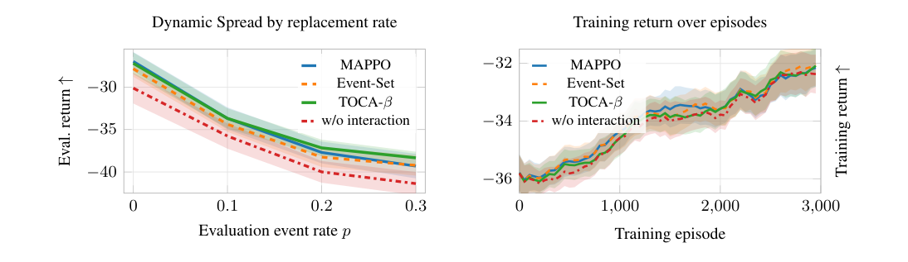

**Why this ranks #6**: Separates action credit from exogenous turnover credit in open teams, so surviving agents stop being penalized for events outside their control.

---

### 7. Test-time Multi-agent Coordination by Decomposed Value Gradient Flow

**arXiv**: [2610.02554](https://arxiv.org/abs/2610.02554) | **Score**: 8.7 (relevance 9 x 0.7 + quality 8 x 0.3) | **Tags**: multi-agent-rl | **Categories**: cs.LG, cs.RO | **Pages**: 24

**Authors**: Dongsu Lee, Haoran Xu, Amy Zhang

**Affiliation**: The University of Texas at Austin

**Abstract**

> Offline multi-agent reinforcement learning (MARL) faces a persistent trade-off. Expressive generative policies can represent multi-modal coordination in the data, but cannot distinguish high-value regions, while value-optimized policies exploit the learned Q-function but collapse the multi-modal into a single dominant mode. A single agent's mode collapse can break joint coordination, and simultaneous drift across agents can push the joint policy into unseen regions of the action space. We propose scalable coordination via optimal unified transport (SCOUT), the first offline MARL framework to combine a generative foundation model with a learned value function through test-time action refinement. SCOUT trains two decoupled components: a flow-matching behavioral prior and a decomposed value function. At test-time, it transports behavioral samples toward high-value regions via Stein variational gradient descent. The number of transport steps controls adaptive test-time scaling, replacing a fixed regularization coefficient. Under the individual-global-max (IGM) principle, we prove a single-term KL bound on the joint soft-value gap that vanishes as transport converges, with an irreducible additive residual proportional to the IGM violation. Empirically, SCOUT achieves the best average performance across discrete and continuous offline MARL benchmarks and yields performance improvements in all offline-to-online configurations.

**Key findings**

- **Finding**: Offline MARL faces a persistent trade-off: expressive generative policies represent multi-modal coordination in data but cannot distinguish high-value regions, while value-optimized policies exploit the learned Q-function but **collapse the multi-modal into a single dominant mode**. One agent's mode collapse can break joint coordination, and simultaneous drift across agents pushes the joint policy into unseen action-space regions.

- **Finding**: SCOUT is the first offline MARL framework to combine a generative foundation model with a learned value function through **test-time action refinement**. It trains a flow-matching behavioral prior and a decomposed value function, then at test time transports behavioral samples toward high-value regions via **Stein variational gradient descent**.

- **Finding**: The number of transport steps controls adaptive test-time scaling, replacing a fixed regularization coefficient.

- **Finding**: Under the individual-global-max (IGM) principle, proves a single-term KL bound on the joint soft-value gap that vanishes as transport converges, with an irreducible additive residual proportional to the IGM violation. Empirically best average performance across discrete and continuous offline MARL benchmarks, with improvements in all offline-to-online configurations.

**Key figures**

*Framework / architecture - Figure 1: Overview of the proposed solution. (a) The prerequisite for SCOUT is to train the reference policy via flow matching and decomposed value via a value decomposition network (VDN). (b) SCOUT transports the behavior distribution at test time via Stein variational gradient descent.*

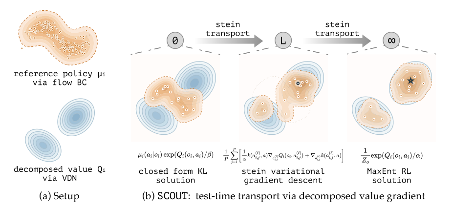

**Why this ranks #7**: First offline MARL framework combining a generative foundation model with a learned value function at test time via SVGD; the IGM-based KL bound with an irreducible residual is a real theoretical contribution.

---

### 8. FERPO: Forward Entropy-Regularized Policy Optimization

**arXiv**: [2610.02198](https://arxiv.org/abs/2610.02198) | **Score**: 8.7 (relevance 9 x 0.7 + quality 8 x 0.3) | **Tags**: rl-algorithm | **Categories**: cs.LG, cs.AI, cs.RO, stat.ML | **Pages**: 47

**Authors**: Sebastian Sanokowski, Alireza Sarmadi, Majid Khadiv

**Affiliation**: Applied and Theoretical Aspects of Robot Intelligence (ATARI) Lab | Munich Institute of Robotics and Machine Intelligence (MIRMI) | Technical University of Munich

**Abstract**

> Several state-of-the-art methods for online reinforcement learning in continuous control improve policies using action gradients of a learned critic. However, critics are typically trained to predict returns, and accurate value predictions do not necessarily yield accurate action derivatives, potentially leading to unreliable policy updates. We propose Forward Entropy-Regularized Policy Optimization (FERPO), an on-policy maximum entropy reinforcement learning algorithm that performs policy improvement using critic values without differentiating the critic with respect to actions. FERPO derives an optimal target action distribution from a policy-improvement objective regularized by entropy and Kullback-Leibler (KL) divergence. We then fit the actor to this target by minimizing a forward-KL objective, estimated using self-normalized importance sampling (SNIS) with actions drawn from the rollout policy. By limiting the target distribution's deviation from the rollout policy, the KL regularization helps keep these importance weights well behaved. In contrast to reverse-KL objectives, which can favor a subset of the target distribution's modes, the forward-KL objective encourages coverage of multiple high-value modes and thereby promotes exploration. Experiments and ablations on MuJoCo Playground and ManiSkill show competitive performance and sample-efficiency gains. Computational benchmarks also demonstrate faster actor updates than Relative Entropy Pathwise Policy Optimization (REPPO).

**Key findings**

- **Finding**: Critics are typically trained to predict returns, and **accurate value predictions do not necessarily yield accurate action derivatives**, potentially leading to unreliable policy updates.

- **Finding**: FERPO is an on-policy maximum-entropy RL algorithm performing policy improvement using critic values **without differentiating the critic with respect to actions**. It derives an optimal target action distribution from a policy-improvement objective regularized by entropy and KL divergence.

- **Finding**: The actor is fit to this target by minimizing a **forward-KL** objective estimated with self-normalized importance sampling (SNIS) using actions drawn from the rollout policy. Limiting the target distribution's deviation from the rollout policy keeps importance weights well behaved.

- **Finding**: In contrast to reverse-KL objectives, which can favour a subset of the target distribution's modes, the forward-KL objective encourages coverage of multiple high-value modes and thereby promotes exploration. Experiments and ablations on MuJoCo Playground and ManiSkill show competitive performance and sample-efficiency gains, with faster actor updates than REPPO.

**Key figures**

*Results / analysis - Figure 1: Actor directions and local losses. Top: green/red arrows point toward/away from the cost minimum (star); lengths are illustrative, not convergence guarantees. Bottom: frozen-reference losses at A–C, zeroed at the reference; KL losses are scaled by T. Details: Appendix A.1.*

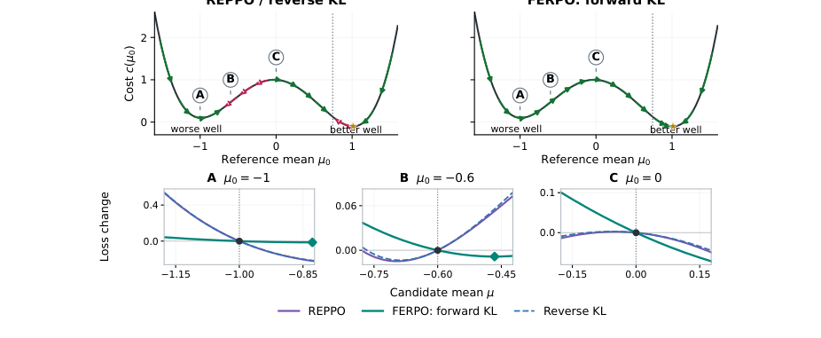

*Results / analysis - Figure 2: Update cost on an A100. Medians and ranges over three repetitions with 131,072 rollout states. Actor time includes cache construction; total updates include critic training. PyTorch alloca- tion excludes simulation and unused reservations.*

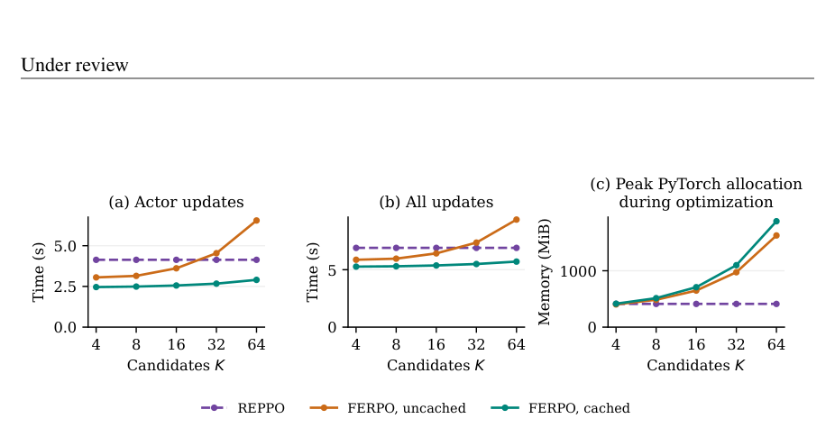

**Why this ranks #8**: Argues accurate value predictions do not imply accurate action derivatives, and builds a policy-improvement step that never differentiates the critic. Forward-KL coverage is the right fix for multi-modal continuous control.

---

### 9. Mastering Atari 2600 Games with Discovered Options

**arXiv**: [2610.03604](https://arxiv.org/abs/2610.03604) | **Score**: 8.7 (relevance 9 x 0.7 + quality 8 x 0.3) | **Tags**: rl-algorithm | **Categories**: cs.LG | **Pages**: 27

**Authors**: Erik M. Lintunen, Marlos C. Machado

**Affiliation**: University of Alberta, 2Alberta Machine Intelligence Institute (Amii), 3Canada CIFAR AI Chair

**Abstract**

> Temporal abstractions, often instantiated as options, have long been regarded as a mechanism for accelerating credit assignment, facilitating exploration, and enabling generalisation in reinforcement learning (RL). However, developing general option discovery methods that are effective in large-scale, high-dimensional domains remains a fundamental challenge. Existing option discovery methods are either confined to relatively simple domains, depend on handcrafted or quasi-symbolic representations, or offer little improvement over learning without options. We present Wayfarer, a general, domain-agnostic, online deep RL agent that discovers options through Laplacian representation learning from high-dimensional observations and leverages them for control. We show that the resulting options simultaneously improve exploration, accelerate credit assignment, and generalise effectively to unseen settings, enabling substantially faster learning of complex policies. Wayfarer achieves state-of-the-art performance among single-stream agents on the most challenging Atari 2600 games, with the largest gains in games that require long-horizon exploration and strategic behaviour, such as Montezuma's Revenge and Private Eye.

**Key findings**

- **Finding**: Temporal abstractions instantiated as options have long been regarded as accelerating credit assignment, facilitating exploration and enabling generalization - but general option discovery methods effective in large-scale high-dimensional domains remain a fundamental challenge. Existing methods are confined to simple domains, depend on handcrafted or quasi-symbolic representations, or offer little improvement over learning without options.

- **Finding**: **Wayfarer** is a general, domain-agnostic, online deep RL agent that discovers options through **Laplacian representation learning** from high-dimensional observations and leverages them for control.

- **Finding**: The resulting options simultaneously improve exploration, accelerate credit assignment and generalize to unseen settings, enabling substantially faster learning of complex policies.

- **Finding**: Achieves state-of-the-art performance among single-stream agents on the most challenging Atari 2600 games, with the largest gains in games requiring long-horizon exploration and strategic behaviour such as Montezuma's Revenge and Private Eye.

**Key figures**

*Results / analysis - Figure 2. The Atari 2600 challenging set. From left to right: Beam Rider, Freeway, Montezuma’s Revenge, Pitfall!, Pong, Private Eye, Skiing, Solaris, Surround, and Venture. The set was assembled by Badia et al. [29] to highlight games where progress has historically been much slower than average due to challenging exploration and credit a*

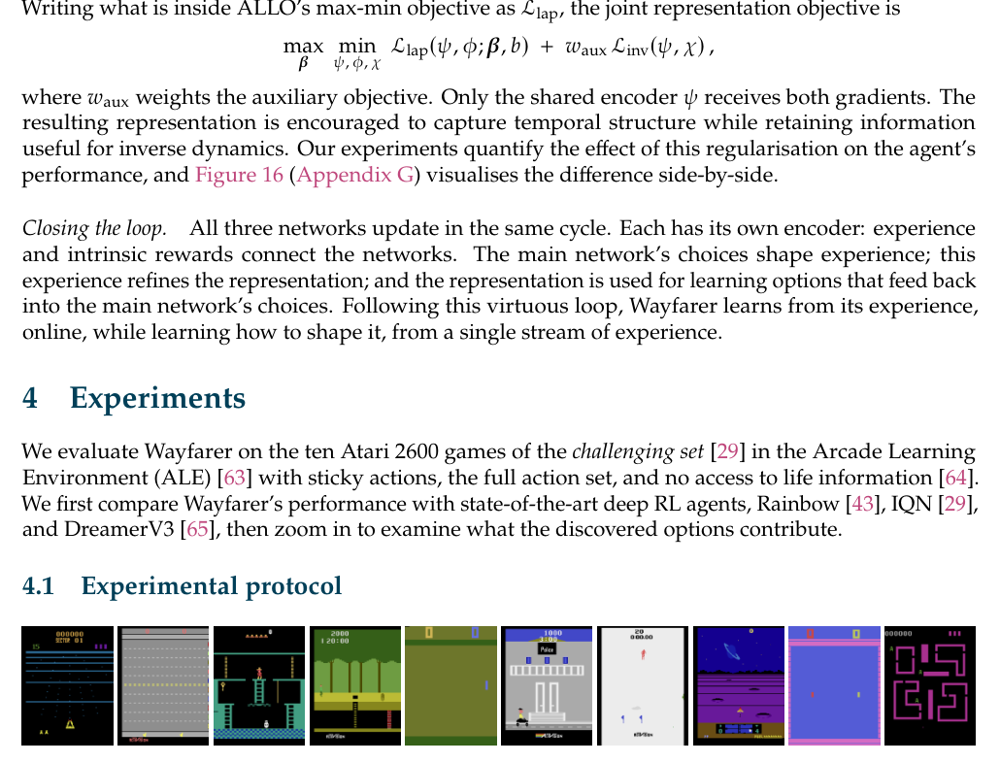

**Why this ranks #9**: Domain-agnostic option discovery from Laplacian representation learning - a problem stuck on simple domains and handcrafted representations for years. SOTA single-stream on the hardest Atari titles.

---

### 10. UniIntervene++: An Adaptive Intervention Agent for Efficient Real-World Reinforcement Learning `[wild-card]`

**arXiv**: [2610.03620](https://arxiv.org/abs/2610.03620) | **Score**: 8.7 (relevance 9 x 0.7 + quality 8 x 0.3) | **Tags**: rl-algorithm, sim-to-real | **Categories**: cs.LG, cs.RO | **Pages**: 8

**Authors**: Yudong Lin, Haoyuan Deng, Zhuoxuan Yuan, Zaijia Yang, Yuanjiang Xue, Ziwei Wang

**Affiliation**: School of Electrical and Electronic Engineering, Nanyang Technolog- | ical University, Singapore

**Abstract**

> Online reinforcement learning (RL) enables robot policies to improve through physical interaction, but the assistance they require changes as their competence evolves. Existing intervention strategies based on offline estimates or fixed decision rules can therefore become mismatched to the current policy. To address this, we propose UniIntervene++, an adaptive intervention agent that learns to allocate control between autonomous execution and heterogeneous assisted behaviors during online RL. Specifically, UniIntervene++ first formulates the evolving RL policy, trajectory correction, and a task-structured CodePolicy as Options in a unified semi-Markov decision process and learns their relative values online. Building on this, competence-adaptive intervention periodically probes the RL policy through unassisted execution, keeping control allocation responsive to its evolving capability. Finally, coupled experience learning allows assisted behaviors to improve the RL policy, whose evolving outcomes in turn reshape future intervention decisions. In this way, UniIntervene++ jointly determines when to intervene, how to intervene, and when to return control as the RL policy improves. Across five real-world manipulation tasks, UniIntervene++ achieves an average success rate of 89.67%, outperforming all baselines by at least 6 percentage points, while reducing human intervention to 0.77%, a relative reduction of at least 94.6% from the best baseline. Code is available in our \href{https://github.com/dannyyudong/An-Adaptive-Intervention-Agent-for-Efficient-Real-World-Reinforcement-Learning}{GitHub repository}.

**Key findings**

- **Finding**: Online RL lets robot policies improve through physical interaction, but the assistance they require changes as competence evolves. Intervention strategies based on offline estimates or fixed rules become mismatched to the current policy.

- **Finding**: UniIntervene++ formulates the evolving RL policy, trajectory correction and a task-structured CodePolicy **as Options in a unified semi-Markov decision process**, learning their relative values online.

- **Finding**: Competence-adaptive intervention periodically probes the RL policy through unassisted execution, keeping control allocation responsive to evolving capability. Coupled experience learning allows assisted behaviours to improve the RL policy, whose evolving outcomes in turn reshape future intervention decisions - jointly determining when to intervene, how, and when to return control.

- **Finding**: Across five real-world manipulation tasks it achieves **89.67% average success, outperforming all baselines by at least 6 points while reducing human intervention to 0.77% - a relative reduction of at least 94.6% from the best baseline**.

**Key figures**

*Results / analysis - Fig. 1. Competence-adaptive control allocation in UniIntervene++. Illustrative Ring Transfer rollouts show a shift from early failures with substantial use of Trajectory Correction and CodePolicy to later autonomous success with predominantly RL policy control. Colored bars indicate Option occupancy within each rollout (teal: RL policy; o*

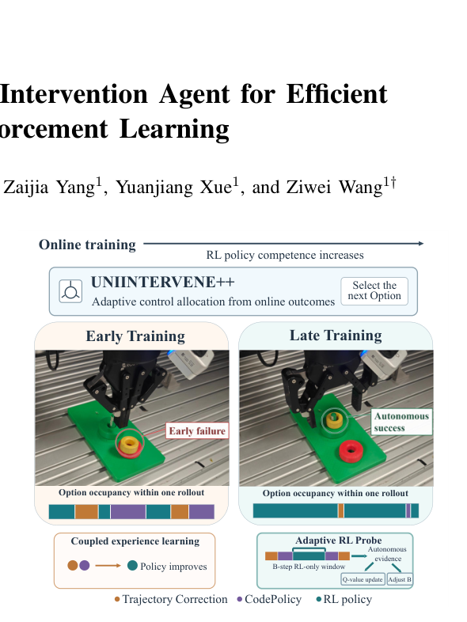

*Framework / architecture - Fig. 2. Overview of UniIntervene++. At each Option boundary, the availability-masked intervention agent selects among the evolving RL policy, trajectory correction, and CodePolicy. Robot-control transitions update the RL policy, while Option-completion transitions update the intervention agent. Adaptive RL Probe preserves direct evidence*

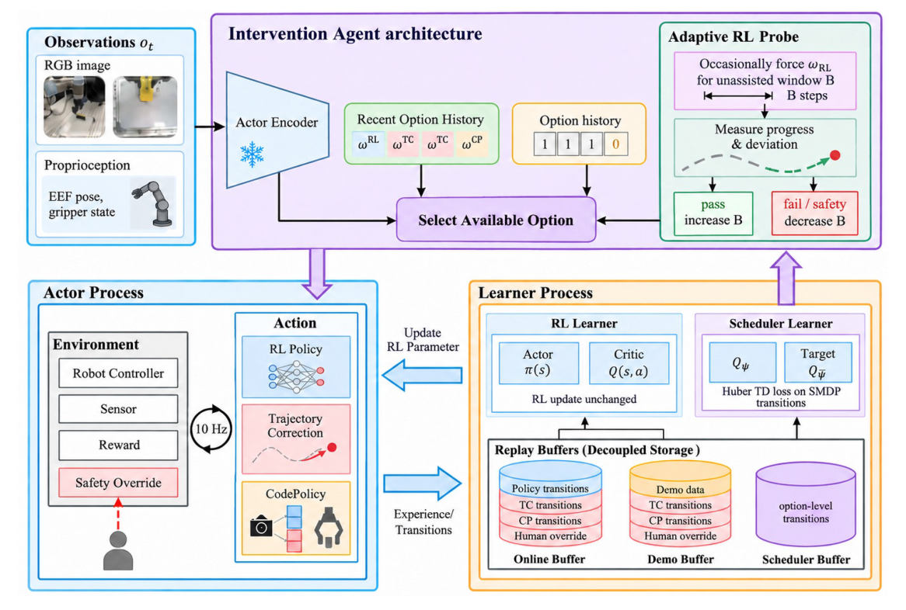

**Why this ranks #10**: Promoted because it attacks the practical bottleneck of real-world robot RL - human intervention cost. 89.67% success with intervention cut to 0.77% across five real tasks.

---

## Footer

- Total papers scanned across all 7 arXiv categories: **648**
- Papers read in full for this digest: **50**
- rl track final top-10: **10**
- Wild-cards in this track: **1**
- Figure assets: `2026-10-05/res/` (86 images shared across all 5 tracks)

Generated by the `mine-arxiv-daily-digest` skill. Sister file: `2026-10-05_rl_entry.md`.
