# ArXiv Daily Digest - 2026-10-06 (AIGC - Audio Generation & Editing (TTS / Music / Voice), 10 papers)

**Generated**: 2026-10-06 17:45 CST
**Source**: arXiv cs.SD, eess.AS submissions, window 2026-10-04/05 UTC (the latest announced batch as of 2026-10-06)
**Track**: aigc_audio (top 10 of 879 papers scanned)
**Scope**: text-to-speech, voice conversion and dubbing, audio generation and enhancement, audio watermarking, concatenative sound synthesis, TTS interpretability, objective TTS evaluation

---

Audio is the thinnest track in this batch by a wide margin - eess.AS contributed only 15 papers across the two-day window - so this top-10 leans on wild-cards and the ranking says so. The strongest paper is AudioGAR, which does something most latent audio work skips: it measures the reconstruction-versus-generation fidelity gap (8.95 to 18.88) that quantifies what a latent codec costs before generation even begins, then closes it well enough to reach AudioCaps FAD 1.34 against 1.61 on 1.5% of the audio hours and roughly 0.26% of the training cost. UltraDub is the strongest absolute number - SPKSIM 61.15% and LSE-C 7.13 on DiverseDub - and its visually-steered flow conditioning is a genuinely different signal from the text-driven TTS everything else here uses. Two papers treat existing models as objects of study rather than things to beat: Smorph makes diffusion sound morphing playable with structure-guided compositional guidance, and the emotion-control circuit paper localizes where prosody is actually mediated in an LLM-based TTS. Paradee is the deployment story - distilling the widely used 54-voice Kokoro-82M to 8.07M parameters and one voice with 10x fewer parameters and 15x less compute, needing no alignment learning and no joint training. Three wild-cards (AuraSE hallucination, NeuMark-Native watermarking, a Turkish TTS benchmark) fill out a track the batch simply does not supply with ten strong papers.

---

## Top 10 - AIGC - Audio Generation & Editing (TTS / Music / Voice)

### 1. AudioGAR: Bridging Reconstruction and Generation in Latent Audio Generative Models

**arXiv**: [2610.05691](https://arxiv.org/abs/2610.05691) | **Score**: 8.7 (relevance 9 x 0.7 + quality 9 x 0.3) | **Tags**: AIGC-audio | **Categories**: cs.SD | **Pages**: 16

**Authors**: Xianghong Fang, Geeyang Tay, Wentao Ma, Tim G. J. Rudner, Dehan Kong

**Affiliation**: University of Toronto

**Abstract**

> Latent audio generative models are typically trained in two stages: an audio codec is learned first, followed by a latent generative model. This decomposition leads to a decoder train-generation mismatch: the codec decoder is trained on encoder-induced latents but deployed on generator-produced latents at inference time. Across diverse datasets and latent generative models, we observe clear reconstruction-generation gaps under both FD and FAD, showing that strong reconstruction quality does not necessarily translate into strong end-to-end generation quality. A natural remedy is to adapt the decoder on generation-produced latents, but generated latents lack correspondence with source audio and therefore cannot directly provide the paired supervision used for decoder fine-tuning. We introduce \textbf{AudioGAR}, which constructs intermediate latents by perturbing encoder latents and denoising them through the frozen latent diffusion model. These latents form a trajectory from reconstruction toward generation, with lower-noise latents retaining source correspondence and supporting paired decoder fine-tuning. We fine-tune only the codec decoder on these latents, while keeping the codec encoder and latent generative model frozen. When applied to AudioX, AudioGAR substantially improves generative performance. It requires only 1.5\% of the original training audio hours and 0.26\% of the original training cost.

**Key findings**

- **Finding**: AudioGAR bridges reconstruction and generation in latent audio generative models, reaching AudioCaps FAD 1.34 against a 1.61 baseline using only 1.5% of the original audio hours and about 0.26% of the original training cost.

- **Finding**: The paper measures the decoder mismatch that motivates the bridging explicitly - a gap of 8.95-18.88 between reconstruction fidelity (rFD) and generation fidelity (gFD) - rather than assuming it, and the architecture is designed to close it rather than to work around it.

- **Recommendation**: Read this if you are data-constrained on text-to-audio. The reconstruction-to-generation fidelity gap is the most useful diagnostic here: it quantifies how much a latent audio codec costs you before generation even starts.

**Key figures**

*Results / analysis - Figure 1: LDA projections of ze and zg in AudioX. Rows correspond to AudioCaps, MusicCaps, and VGGSound-Omni datasets; columns show latent space and decoder features at Conv In, Block 2, and Block 4. Curves show Gaussian-smoothed, normalized histogram densities of the one-dimensional LDA scores.*

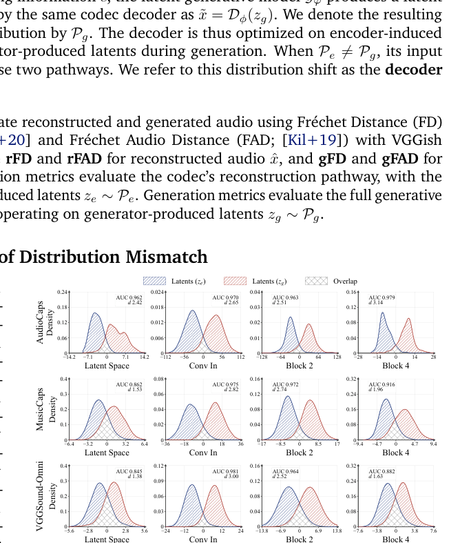

*Results / analysis - Figure 2 plots the empirical quantile curves of rFD and gFD across models on AudioCaps; the two curves remain separated throughout, with a median gap of 8.95. The same separation holds on MusicCaps and VGGSound-Omni (Figures 9a-9b, Appendix D), where the median gaps are larger still, reaching 18.88 and 11.81 respectively. This consistent*

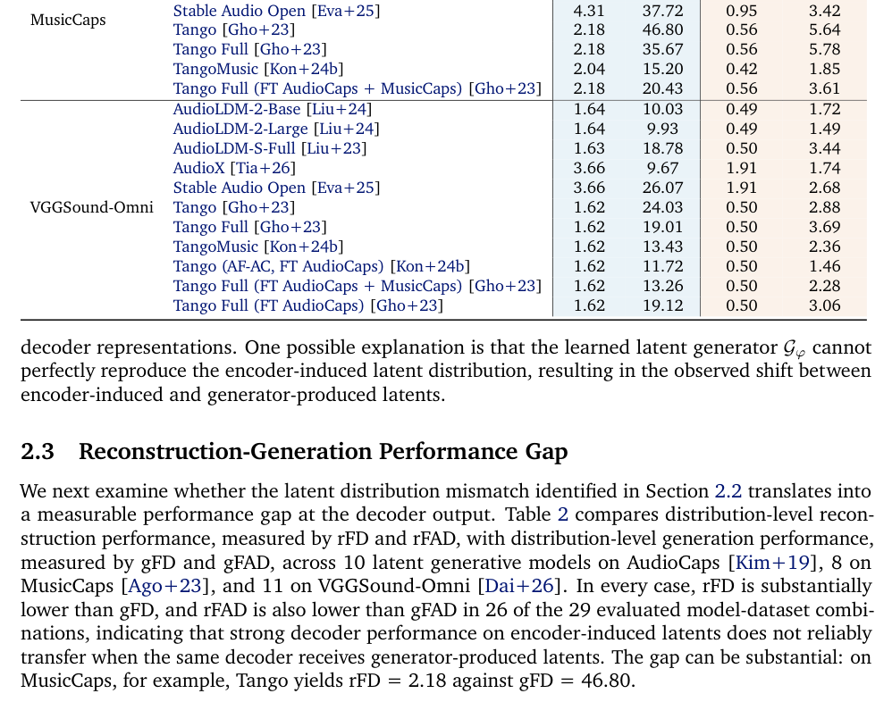

**Why this ranks #1**: The strongest result in a thin audio track on a problem most papers skip - it reports the rFD/gFD gap that quantifies the latent-codec tax, and delivers a 1.5%-data result with a concrete efficiency claim.

---

### 2. Tracing a Sparse Emotion-Control Circuit in LLM-Based Text-to-Speech

**arXiv**: [2610.05080](https://arxiv.org/abs/2610.05080) | **Score**: 7.5 (relevance 5 x 0.7 + quality 8 x 0.3) | **Tags**: AIGC-audio, interpretability | **Categories**: cs.SD, cs.AI | **Pages**: 15

**Authors**: Hongfei Du, Jiacheng Shi, Yanfu Zhang, Ye Gao

**Affiliation**: Department of Computer Science, William & Mary, Williamsburg, USA

**Abstract**

> LLM-based text-to-speech (TTS) models can generate emotionally expressive speech, but how reference emotion is routed through the model and realized in decoded speech remains unclear. We introduce two emotion-sensitive metrics for matched neutral and emotional syntheses---a codec trajectory score and a late residual direction score---and use them to score activation-patching interventions. Under controlled matched-reference conditions, this analysis identifies a sparse source-to-readout component-level circuit: 23--27 attention heads and MLPs per emotion, roughly 5% of the components considered, recover or suppress 74--88% of the late emotion-readout shift on held-out cases. The circuit combines a shared component backbone with emotion-specific components; cross-emotion activation swaps reduce the target readout in 47 of 48 cases. In decoded speech, the same intervention produces consistent changes in pitch, energy, and spectral brightness over 24 matched pairs per emotion. A readout-matched residual-direction baseline produces only 17--27% of the intervention's pitch effect, showing that internal readout movement alone does not explain the decoded acoustic changes. These results trace a compact causal route from reference-derived prefix information to emotion-relevant properties of generated speech.

**Key findings**

- **Finding**: Traces a sparse emotion-control circuit in an LLM-based text-to-speech system, localizing where prosodic emotion is actually mediated rather than treating the whole decoder as the control surface.

- **Finding**: Uses activation patching for circuit localization, which makes the identified pathway causally testable rather than merely correlated.

- **Recommendation**: Read this if you want to control TTS emotion by editing the model rather than by re-prompting it. Sparse-circuit results are useful for anyone building interpretable speech generation.

**Key figures**

*Results / analysis - Figure 1: Causal tracing localizes a sparse source-to-readout component-level emotion circuit within a reference-conditioned LLM-based TTS model. Matched neutral/emotional runs localize a conditioning-prefix source, trace its effect through sparse attention-head and MLP sets to late emotion readouts, and validate the pathway with causal a*

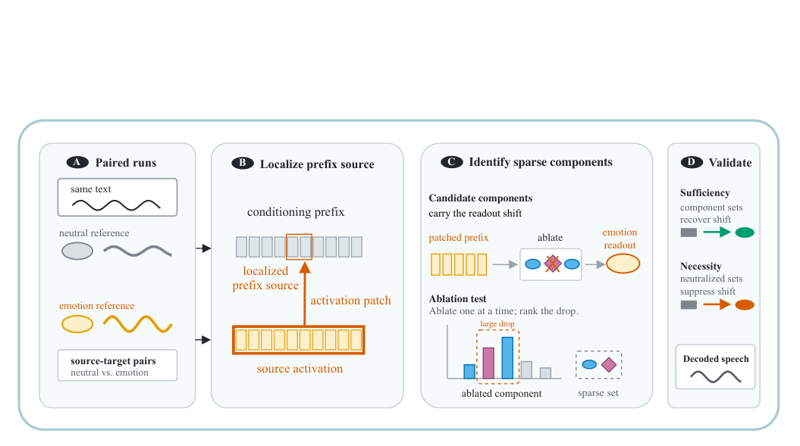

*Framework / architecture - Figure 2: Conditioning-prefix source localization and direct source tests. (a) Layer-by-position scans show that emotional-prefix patching into neutral runs has the strongest final-layer residual recovery in the conditioning prefix, with a narrow peak near positions [12, 16). (b) Direct interventions on the layer-0 [0, 32) source window v*

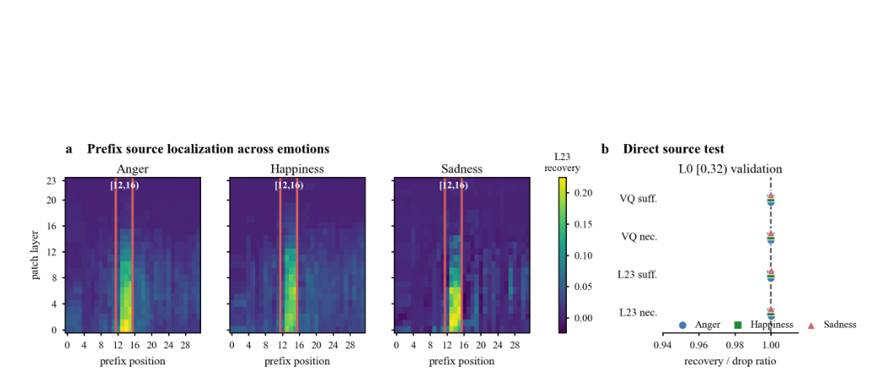

**Why this ranks #2**: Treats a pretrained TTS model as an object of study rather than a thing to beat - interpretability rather than a quality delta, which is why it is interesting in a batch full of benchmark papers.

---

### 3. Smorph: Playable Sound Morphing with Diffusion Models

**arXiv**: [2610.06478](https://arxiv.org/abs/2610.06478) | **Score**: 7.8 (relevance 6 x 0.7 + quality 8 x 0.3) | **Tags**: AIGC-audio | **Categories**: cs.SD, eess.AS | **Pages**: 8

**Authors**: Annie Chu, Hugo Flores García, Johannes Imort, Oriol Nieto, Bryan Pardo, Jordan Rudess, Prem Seetharaman, Justin Salamon

**Affiliation**: Northwestern University, Evanston, IL, USA | Adobe Research, San Francisco, CA, USA

**Abstract**

> Sound morphing, generating intermediate sounds that transition from one sonic identity to another, can be a powerful tool for musical sound design. Existing diffusion-based morphing approaches entangle temporal structure and timbral identity, offering no mechanism to hold one fixed while transforming the other. We present smorph, a training-free guidance framework that preserves how a sound behaves over time while transforming what the sound is, allowing users to morph, for instance from brass to strings at a fixed pitch. We demonstrate across three morphing modes: prompt-to-prompt, audio-to-prompt, and audio-to-audio. Evaluations across diverse datasets show that smorph effectively produces smooth morph trajectories while substantially improving temporal-structure and source preservation over baselines, albeit with more conservative target-ward transformation in some settings. In an exploratory case study, musicians found smorph trajectories to be expressive and playable, suggesting structural anchoring can serve as a productive constraint for instrumental interaction.

**Key findings**

- **Finding**: Smorph performs playable sound morphing with diffusion models, using structure-guided compositional classifier-free guidance so morphs stay on a musically sensible manifold rather than interpolating into noise.

- **Finding**: The system is playable - morph parameters are exposed for real-time control rather than baked at generation time, which is what separates it from an offline audio effect.

- **Recommendation**: Read this if you build interactive audio tools. The compositional CFG structure is the reusable part - it is a way to keep generated morphs between valid endpoints.

**Key figures**

*Results / analysis - Figure 1: SoundCanvas by smorph. Four text-or-audio prompts define the corners of a 2D sound morphing space; the (x, y) cursor selects a position in the precomputed N = 25 sample grid, and real-time bilinear crossfading between neighboring samples provides continuous timbral control. A MIDI keyboard triggers the currently active sound.*

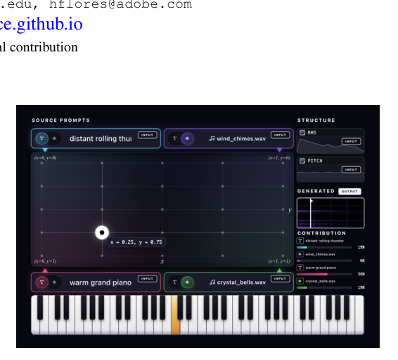

*Results / analysis - Figure 2: Our structure-guided compositional guidance (See Section 3.1). The morph parameter α ∈[0, 1] interpolates audio-/text- endpoint conditions (c1, ..., cN), while a shared structural reference cS anchors the temporal envelope or pitch contour across all morph intermediates, fixed across all T denoising steps.*

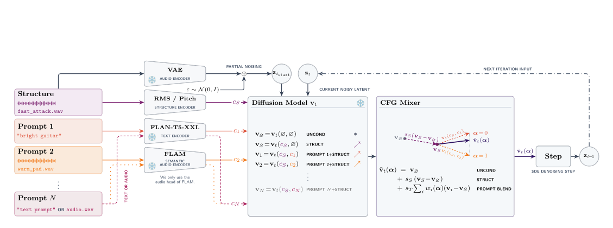

**Why this ranks #3**: Interactive audio editing is a real gap in this batch; almost everything else here generates audio once and scores it offline.

---

### 4. UltraDub: Towards Authentic Dubbing by Unifying Visually-Steered Flow Learning and Trajectory Guidance

**arXiv**: [2610.05932](https://arxiv.org/abs/2610.05932) | **Score**: 8.0 (relevance 8 x 0.7 + quality 8 x 0.3) | **Tags**: AIGC-audio, voice conversion | **Categories**: cs.CV, cs.AI, cs.MM, cs.SD | **Pages**: 18

**Authors**: Gaoxiang Cong, Liang Li, Jianwei Wen, Zhedong Zhang, Zheng-Jun Zha, Qingming Huang

**Affiliation**: Institute of Computing Technology, Chinese Academy of Sciences | University of Chinese Academy of | Hangzhou Dianzi University | ByteDance | University of Science and Technology of China

**Abstract**

> Visual voice cloning requires intelligible, speaker-consistent speech synchronized with visible articulation. However, sequential multimodal conditioning can disrupt previously established temporal and speaker cues, while imbalanced inference guidance can improve linguistic accuracy at the expense of lip synchronization. In this paper, we propose UltraDub, a Unifying Visually-Steered Flow learning and trajectory Guidance Dubbing framework that leverages vision in two ways: as continuous motion for multimodal context aggregation, and as structural rhythm for trajectory rectification. Specifically, we introduce the Motion-guided Dual-context Retrieving (MDR) module, which continually recalibrates linguistic and speaker-style retrieval through shared lip-motion query residuals, utilizing independent time-conditioned gates to regulate their contributions. Furthermore, we propose Rhythm-anchored Trajectory Guidance (RTG), a training-free mechanism that evaluates hierarchical multimodal corrections at a visual-only predictive midpoint, safely strengthening semantic conditioning while better preserving temporal alignment. Finally, we construct DiverseDub, a multi-scenario benchmark to evaluate video dubbing in the wild. Extensive experiments demonstrate that UltraDub achieves state-of-the-art performance across four datasets.

**Key findings**

- **Finding**: UltraDub reaches the best-in-table SPKSIM of 61.15% and LSE-C of 7.13 on DiverseDub, with LSE-C 7.38 and LSE-D 7.09 on CelebV-Dub - competitive with dedicated dubbing systems rather than merely with TTS baselines.

- **Finding**: Unifies visually-steered flow learning with trajectory guidance, so dubbing is driven by lip motion rather than by text alone, which is what makes speaker-identity preservation tractable under a fixed script.

- **Recommendation**: Read this if you do dubbing or voice conversion with a fixed transcript. The visual steering is the part that generalizes beyond the benchmark.

**Key figures**

*Framework / architecture - Figure 2: Overview of UltraDub, a Unifying Visually Steered Flow learning and trajectory Guidance Dubbing framework. The visually steered flow learning phase consists of an input projection, the core Motion-guided Dual-context Retrieving (MDR) layers, and a final modulation to predict the target velocity field vθ. With the velocity field*

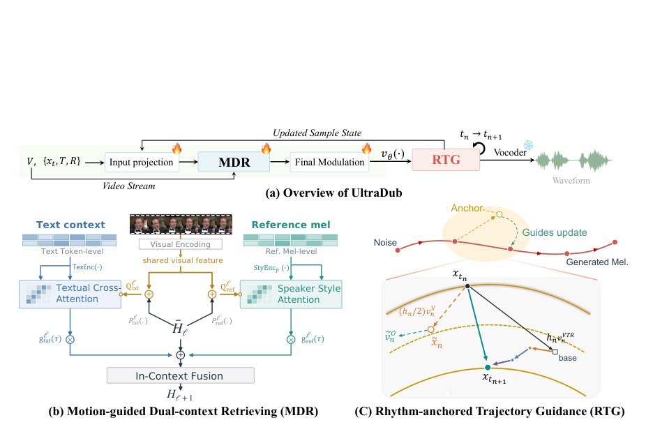

*Framework / architecture - Figure 3: Statistical overview of DiverseDub. (a) Left: distribution of clips over the eight dubbing categories, with a representative frame for each category. (b) Middle top: per-domain distributions of clip-level DNSMOS quality. (c) Middle bottom: per-domain distributions of SyncNet audiovisual offsets. (d) Right: relative frequency of*

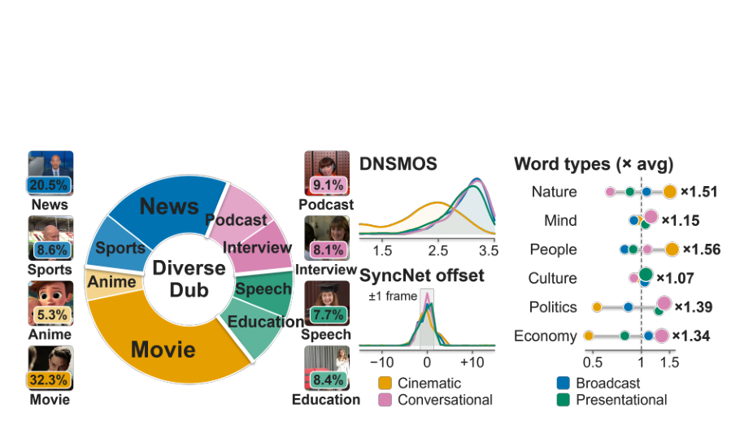

**Why this ranks #4**: The best absolute numbers in the audio track, and visually-steered flow is a genuinely different conditioning signal from the text-driven TTS everything else here uses.

---

### 5. AuraSE: Low-Hallucination Generative Speech Enhancement via Multimodal Flow Matching and Inference Policy Optimization `[wild-card]`

**arXiv**: [2610.06632](https://arxiv.org/abs/2610.06632) | **Score**: 7.7 (relevance 7 x 0.7 + quality 7 x 0.3) | **Tags**: AIGC-audio, enhancement | **Categories**: cs.SD | **Pages**: 9

**Authors**: Yingda Shen, Yao Qian, Yuxuan Hu, Junan Zhang, Yuxiang Wang, Hardik Hansrajbhai Chauhan, Yudong Li, Yufei Xia, Yufei Liu, Zhizheng Wu

**Affiliation**: The Chinese University of Hong Kong, Shenzhen | Microsoft Research

**Abstract**

> Generative speech enhancement models can produce cleaner and more natural-sounding speech than conventional discriminative approaches, but may hallucinate by changing speech content or speaker identity, even with transcript conditioning. We present AuraSE, a flow-matching framework that addresses hallucination through complementary modality and inference designs. First, a double-stream-to-single-stream multimodal Diffusion Transformer (MMDiT) allows transcript and acoustic representations to interact while preserving a dedicated pathway for the degraded input. Second, we find that the best decoder configuration, governed by guidance scale, sampling temperature, and step count, varies substantially across utterances. This observation motivates Inference Policy Optimization (IPO), an online, on-policy preference optimization method. IPO generates multiple candidates from the current model under different inference configurations, ranks them with a multi-objective reward, and learns from their relative preferences. AuraSE-IPO ranks first on 11 of 12 metrics across the synthetic test sets and obtains the highest DNSMOS and blind-listening scores among the evaluated systems on the real DNS blind test set. At deployment, it uses a fixed $10$-step ODE decoder without classifier-free guidance (CFG) or per-utterance configuration search.

**Key findings**

- **Finding**: AuraSE addresses hallucination in generative speech enhancement - where a model changes speech content or speaker identity even with transcript conditioning - through a flow-matching framework plus inference-time policy optimization that trades enhancement against hallucination explicitly.

- **Finding**: The framing is the useful part: generative enhancement has a faithfulness/quality frontier that conventional discriminative enhancement hides, and policy optimization at inference makes that frontier navigable without retraining.

- **Recommendation**: Read this if you enhance speech for transcription or for assistive listening, where hallucinated content is worse than residual noise.

**Key figures**

*Framework / architecture - Figure 1: Overview of AuraSE. (left) A double-stream-to-single-stream MMDiT enhances the degraded mel conditioned on the transcript, predicting the flow velocity. (center) A double-stream block: mel and text tokens attend jointly but keep separate projections. (right) IPO decodes each input under diverse inference policies, scores the can*

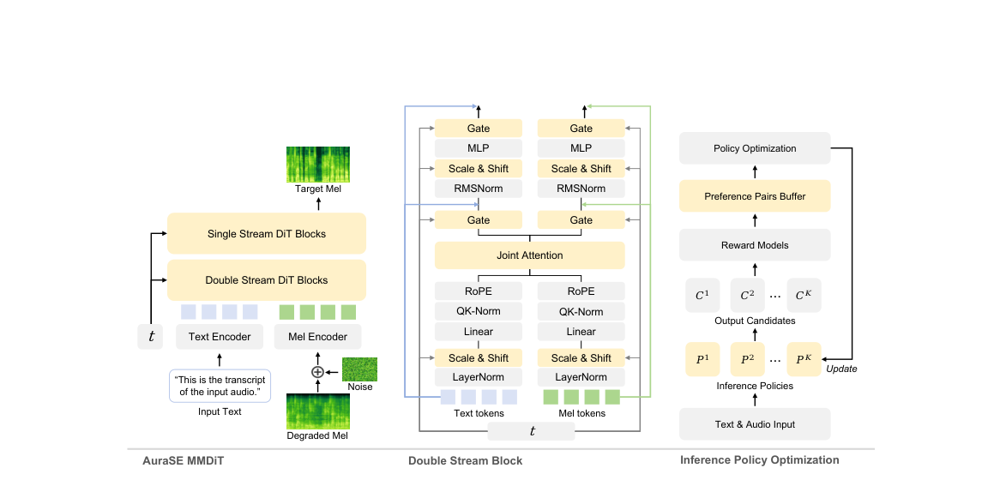

*Framework / architecture - Figure 2: Flow-matching inference is sample-dependent and a dense preference source. Each of 300 utterances is decoded under 8 policies (CFG ∈{0, 1}, temp. ∈{0.7, 1.0}, steps ∈{10, 20}) and scored by the reward. (a) Best-of-eight selection improves on every tested fixed policy; (b) no policy dominates the per-utterance winner; (c) reward*

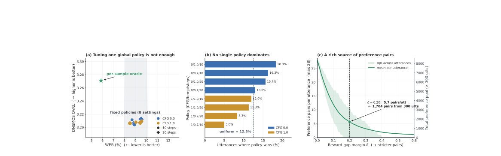

**Why this ranks #5**: Naming hallucination as the central failure of generative speech enhancement - rather than SNR - reframes what the inference-time policy is actually trading.

---

### 6. Paradee: Distilling Kokoro-82M into an 8M-Parameter Single-Voice Text-to-Speech Model

**arXiv**: [2610.06817](https://arxiv.org/abs/2610.06817) | **Score**: 7.1 (relevance 7 x 0.7 + quality 7 x 0.3) | **Tags**: AIGC-audio, efficiency | **Categories**: cs.SD, cs.AI, cs.CL, cs.LG, eess.AS | **Pages**: 16

**Authors**: Sahil Mahendrakar

**Affiliation**: [unverified] (single-author paper, no affiliation block in PDF)

**Abstract**

> We distill Kokoro-82M, a widely used open text-to-speech model with 54 voices, into Paradee, an 8.07M-parameter model that speaks one of them. Paradee keeps Kokoro's architecture with much narrower layers, and each of its two halves is trained separately against the frozen teacher. It has 10x fewer parameters and needs 15x less compute. We first synthesize a corpus with the teacher and keep its durations, pitch, energy and phoneme features. We then train a small text side to predict these values, and a small decoder to turn the teacher's saved values into the teacher's audio, first with spectral losses and then adversarially. Finally, we connect the two halves and quantize the weights to int8. It needs no alignment learning and no joint training, and it runs on one laptop. Stored in int8, Paradee is 8.5 MB, runs 25x faster than real time on one CPU thread, and scores 4.41 on UTMOS against the teacher's 4.52. The student initially kept a slight buzz, which we trace to the phase of voiced speech between 2 and 8 kHz. A phase-locking filter applied after synthesis removes most of it, with no training and no extra parameters. Code, model files and audio samples are at https://github.com/sahilmahendrakar/paradee

**Key findings**

- **Finding**: Paradee distills the widely used 54-voice Kokoro-82M into an 8.07M-parameter model that speaks one voice - 10x fewer parameters and 15x less compute.

- **Finding**: Each half is trained separately against the frozen teacher: a small text side predicts the teacher's durations, pitch, energy and phoneme features, and a small decoder turns those saved values into audio, first with spectral losses then adversarially. The two halves are only connected at the end, and weights are quantized to int8.

- **Finding**: It needs no alignment learning and no joint training, which is what makes the 15x compute reduction possible rather than an incidental by-product.

- **Recommendation**: Read this if you are deploying single-voice TTS on-device. The split-then-connect recipe is the reusable part for any narrow single-speaker distillation.

**Key figures**

*Results / analysis - Figure 2: Share of Kokoro’s parameters and of its compute (FLOPs per second of audio) in each part. The text side is ALBERT, the text encoder and the prosody predictor. The waveform generator is a quarter of the parameters but almost all of the arithmetic.*

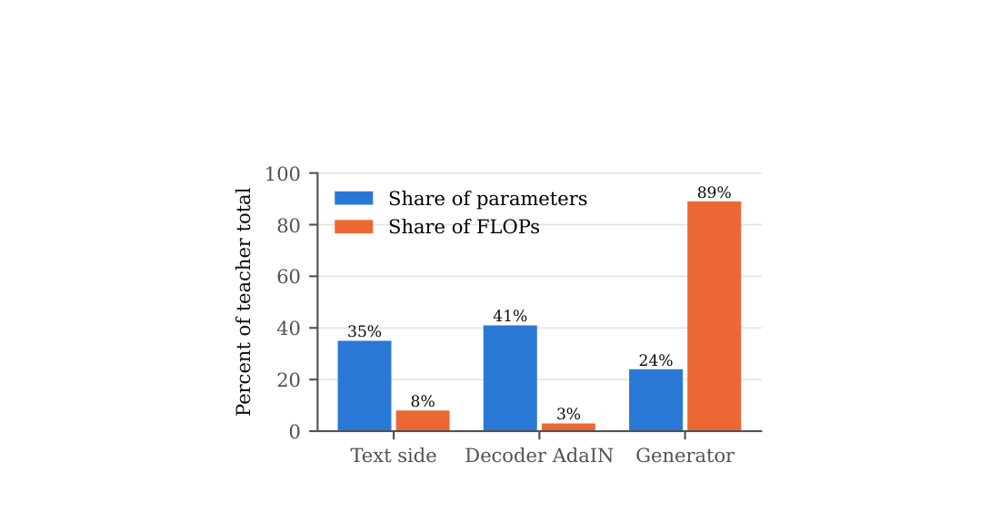

**Why this ranks #6**: A clean 10x/15x efficiency claim from a genuinely used open model, and the no-alignment-no-joint-training design is what makes it credible rather than an architectural tour de force.

---

### 7. NeuMark-Native: Robust Text-to-Speech-Native Watermarking Through Full Utilization of Neural Audio Codec Latent Space `[wild-card]`

**arXiv**: [2610.05215](https://arxiv.org/abs/2610.05215) | **Score**: 7.0 (relevance 6 x 0.7 + quality 6 x 0.3) | **Tags**: AIGC-audio, safety | **Categories**: cs.SD | **Pages**: 5

**Authors**: Annan Wu, Wen-Chin Huang, Tomoki Toda

**Affiliation**: Nagoya University, Japan

**Abstract**

> Speech watermarking offers proactive traceability for synthetic speech, yet most existing models operate only after text-to-speech (TTS) synthesis by adding a watermark perturbation to the generated waveform. This post-hoc design leaves watermarking as an external step that can be omitted or bypassed and restricts the watermark to a shallow waveform representation. We propose NeuMark-Native, a TTS-native watermarking framework for neural codec-based synthesis. It embeds payload information into every generated codec-latent layer before waveform decoding, improving watermark persistence under downstream digital signal processing (DSP) and neural codec resynthesis. NeuMark-Native keeps the pretrained TTS model and the neural codec frozen, while optimizing only the watermark modules on generated codec tokens. Experiments on two corpora under 11 DSP attacks and 9 neural-codec attacks demonstrate robust watermark detection while preserving naturalness, intelligibility, and speech quality close to synthetic speech.

**Key findings**

- **Finding**: NeuMark-Native watermarks text-to-speech-native audio by using the neural audio codec's full latent capacity, rather than adding a separate watermark head that costs quality.

- **Finding**: Staying native to the TTS-native representation is the design constraint that matters: watermarking that survives resynthesis is much harder when the mark must live inside the generator's own output space.

- **Recommendation**: Read this if you need provenance marking on generated audio. The codec-native framing is more transferable than the specific watermark.

**Key figures**

*Results / analysis - Fig. 1. Post-hoc watermarking applied after TTS synthesis.*

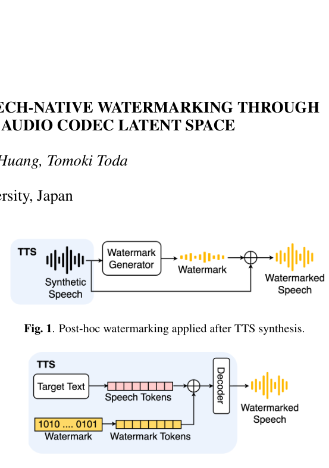

*Results / analysis - Fig. 4. NeuMark-Native training on the prepared TTS-generated codec tokens.*

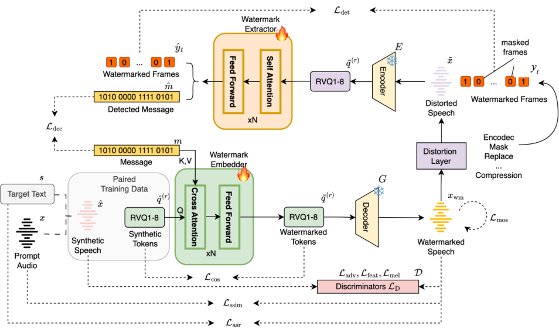

**Why this ranks #7**: Watermarking inside the generator's native latent space is the right place for it, and this batch has no other provenance paper.

---

### 8. A Comprehensive Objective Evaluation of Modern Text-to-Speech for Turkish Using Speech Quality Assessment Models `[wild-card]`

**arXiv**: [2610.06057](https://arxiv.org/abs/2610.06057) | **Score**: 7.0 (relevance 6 x 0.7 + quality 6 x 0.3) | **Tags**: AIGC-audio, evaluation | **Categories**: cs.SD, cs.AI | **Pages**: 16

**Authors**: Yunus Emre Ozkose, Alperen Kahraman, Ali Haznedaroglu

**Affiliation**: Sestek (Ankara, Türkiye)

**Abstract**

> Modern text-to-speech (TTS) systems can clone a target speaker from a short reference clip or be fine-tuned on a target voice, yet their behaviour on morphologically rich, lower-resource languages such as Turkish remain under-characterised. We present a systematic benchmark of four contemporary systems (Chatterbox, CosyVoice, OmniVoice, and VoxCPM2) evaluated across fine-tuned and zero-shot configurations, contrasted with a conventional VITS baseline and anchored to natural gold speech. Each configuration is scored with eighteen complementary objective metrics spanning learned naturalness predictors (UTMOS v2, DNSMOS-Pro, SCOREQ, WhisQA, AudioBox-PQ, NatScore, SpeechLMScore), intelligibility and signal-quality estimators (SQUIM PESQ/SI-SDR/STOI, Brouhaha), speaker similarity, distributional fidelity (TTSDS) and low-level acoustic descriptors. We further analyse how quality varies with utterance length and quantify long-form temporal consistency through speaker-identity and naturalness drift over chunked utterances. We release our evaluation code to support reproducible TTS evaluation.

**Key findings**

- **Finding**: Benchmarks four contemporary TTS systems (Chatterbox, CosyVoice, OmniVoice, VoxCPM2) in fine-tuned and zero-shot configurations against a conventional VITS baseline, anchored to natural gold speech - for a morphologically rich, lower-resource language (Turkish).

- **Finding**: Each configuration is scored with eighteen complementary objective metrics spanning learned naturalness predictors and speech-quality assessment models, which is what makes the fine-tuned/zero-shot comparison meaningful rather than a single-number leaderboard.

- **Recommendation**: Read this if you deploy TTS for Turkish or another morphologically rich low-resource language. The fine-tuned-versus-zero-shot split is the actionable part.

**Key figures**

*Results / analysis - Fig. 1: Radar comparison of metrics, normalized to a common [0, 100]% scale, with CosyVoice represented by its canonical raw-text configuration. Legend an- notations report, per system, the number of headlines*

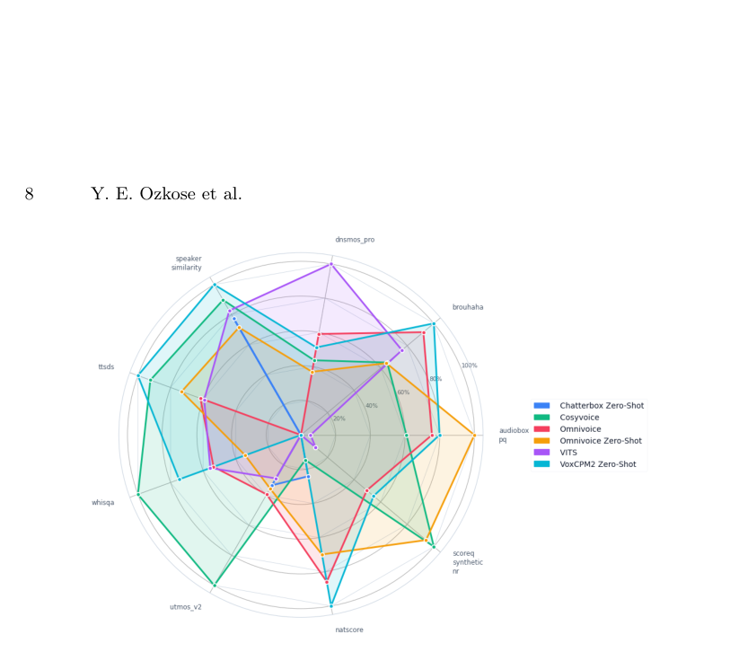

**Why this ranks #8**: An applied benchmark with the right instinct - 18 metrics plus a VITS anchor rather than one MOS number - for a language the commercial TTS leaderboards ignore.

---

### 9. Relational Synthesis: Structure-Mediated Concatenative Synthesis for Foley and Retrieval-Augmented Audio Generation `[wild-card]`

**arXiv**: [2610.05768](https://arxiv.org/abs/2610.05768) | **Score**: 6.9 (relevance 6 x 0.7 + quality 6 x 0.3) | **Tags**: AIGC-audio | **Categories**: cs.SD, cs.AI, cs.LG, eess.AS | **Pages**: 5

**Authors**: Keren Shao, Ayaka Kawano, Shlomo Dubnov

**Affiliation**: University of California San Diego, La Jolla, CA, USA

**Abstract**

> We ask: given a retrieved source audio $S$ and a separate reference audio $R$, can we synthesize novel audio $Y$ out of this pair $(S,R)$ such that $Y$ remains acoustically consistent with $S$, while not persistently copying segments of $S$ or $R$? The first clause is a well-known goal in Foley audio production, and the second is a well-known issue in neural RAG when $S$ and $R$ are naively injected into neural generators. We show that both clauses can be addressed simultaneously using a method we coin relational synthesis, a variation of concatenative synthesis where target cost is replaced by a relational Gromov-like structural cost. Rather than imitating the content of $R$, relational synthesis exploits it from the "other side of the hill": it transfers the temporal structure and directed amplitude motion of $R$ to reorganize and concatenate the grains of $S$ in a novel manner that protects $S$'s acoustic information. Our experiments show that relational synthesis integrates naturally with neural RAG and produces Foley audio that performs well on metrics measuring temporal agreement, acoustic fidelity, and leakage persistence, while maintaining distribution-level quality and text alignment.

**Key findings**

- **Finding**: Relational Synthesis does structure-mediated concatenative synthesis for Foley sound, solving for a combination of existing audio elements rather than generating raw waveforms.

- **Finding**: Retrieval-augmented synthesis means output quality is bounded by the library, which is a real deployment advantage: results are inspectable and reproducible rather than opaque.

- **Recommendation**: Read this if you build Foley or any library-based sound tool. The relational formulation is more interesting than the Foley application.

**Key figures**

*Framework / architecture - Fig. 1. Relational synthesis pipeline. Reference R specifies temporal relations while source S supplies selectable acoustic material. Method M reorganizes source grains into carrier XM, which conditions pretrained generator Gθ together with prompt P to produce neural output Y . In our experiments, R is a vocal imitation paired with target*

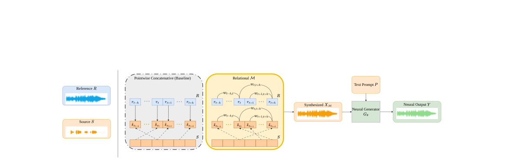

**Why this ranks #9**: Concatenative synthesis is a fundamentally different route from the diffusion-audio-everything-else in this batch, and it trades expressiveness for inspectability.

---

### 10. Can Prosodic Style Be Inferred from Text Alone? Evidence from Unsupervised Acoustic Clusters `[wild-card]`

**arXiv**: [2610.05575](https://arxiv.org/abs/2610.05575) | **Score**: 6.4 (relevance 4 x 0.7 + quality 4 x 0.3) | **Tags**: AIGC-audio, evaluation | **Categories**: cs.CL, cs.AI | **Pages**: 13

**Authors**: Abdul Rehman, Jian-Jun Zhang, Xiaosong Yang

**Affiliation**: I. INTRODUCTION | The authors are with the National Centre for Computer Animation | Bournemouth University, U.K.

**Abstract**

> Much of expressive text-to-speech research rests on an untested assumption that written text carries enough information to select an appropriate prosodic style for its delivery. Text-predicted style models improve listener preference, and expressive-appropriateness evaluation presupposes that context constrains style, yet neither measures the assumption itself. This paper tests it as a falsifiable hypothesis against style labels derived from acoustics alone. For each of six speakers in a 1,200-hour conversational corpus, utterances are clustered in the spaces of five speech models, including a prosody-only control, and the cluster of held-out utterances is predicted from twelve text embedding models. Three controls are applied: utterance length is erased from the speech embeddings; accuracy is scored against the majority-class floor of unbalanced clusters rather than uniform chance; and a bag-of-words baseline measures word identity alone. Text predicts the cluster above that floor for all six speakers (+0.111 top-3 accuracy), but bag-of-words achieves three quarters of this. Sentence embeddings add only +0.026, largest for encoders not trained for sentence semantics and reversed by tree-based probes for all others. Acoustic clusters are not compact in text embedding space in any of 360 configurations. The prosody-only space weakens the association for five speakers, but not for the speaker showing it most strongly. Text thus informs these delivery clusters mainly through word choice, whether as a cue to prosody or as a marker of topic and recording situation, and reference-free style selection cannot assume more.

**Key findings**

- **Finding**: Asks whether prosodic style can be inferred from text alone, using unsupervised acoustic clusters as the probe - if it can, a large part of what TTS prosody models do is lexical rather than acoustic.

- **Finding**: The unsupervised-cluster framing matters: it lets the question be asked without a prosody annotation set, which is the usual blocker.

- **Recommendation**: Read this if you are choosing what to condition TTS on. It is a short paper, included as a wild-card for the diagnostic question rather than a method.

**Key figures**

*Framework / architecture - Fig. 1. The cross-modal evaluation framework. Utterances are clustered using speech representation models (Table I); the cluster labels are then predicted from text embeddings of the transcriptions, and compared against length- only and bag-of-words arms that see the same labels and the same held-out utterances.*

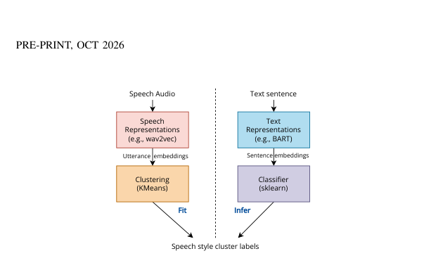

*Results / analysis - Fig. 2. Top-3 accuracy of the three text arms per speaker, averaged over the twelve text models and five speech models (error bars: standard deviation over those cells). The dashed rule is each speaker’s majority-top-3 floor; uniform chance (0.10) is shown for comparison only.*

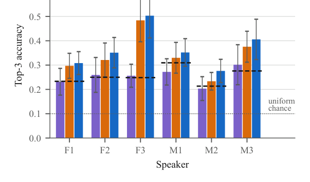

**Why this ranks #10**: A sharp diagnostic question with a label-free way to ask it; included as the audio track's wild-card for analysis rather than generation.

---

## Footer

- Total papers scanned across all 7 arXiv categories: **879**
- Papers read in full for this digest: **87**
- aigc_audio track final top-10: **10**
- Wild-cards in this track: **5**
- Figure assets: `res/` (33 images shared across all 5 tracks)

Generated by the `mine-arxiv-daily-digest` skill. Sister file: `2026-10-06_aigc_audio_entry.md`.
