# ArXiv Daily Digest - 2026-10-06 (AIGC - Image / Video / 3D Generation & Editing, 10 papers)

**Generated**: 2026-10-06 17:45 CST
**Source**: arXiv cs.CV, cs.SD submissions, window 2026-10-04/05 UTC (the latest announced batch as of 2026-10-06)
**Track**: aigc_visual (top 10 of 879 papers scanned)
**Scope**: image/video/3D/4D generation and editing, inference efficiency, long-horizon video memory, concept erasure and image immunization, camera control, continuous editing interfaces, generative evaluation of physical consistency

---

This batch splits into three clear clusters. First, a *physics-of-computation* argument about what video models can represent: S2PD shows bidirectional diffusion transformers violate physical laws and simple symbolic rules even when trained on effectively unlimited procedurally generated data, and that the binding constraint is sequential depth rather than data - its single transition-noise knob tau spans fully parallel to fully serial and reveals a genuine speed/quality optimum at 6.8 s against 13.8 s. The companion diagnostic paper asks how geometry enters generated motion at all and finds that geometry shapes motion but the *state* never evolves by the physical law: balls rise above their release height in 63 of 72 videos and cross 43 of 49 impassable barriers. Second, an *efficiency* cluster where inference cost is attacked without touching the generative prior - Level-of-Token keeps full-resolution output through a reduced token sequence for up to 3.53x video speedup, PixReenact runs a 4-NFE rolling student at 16.74 FPS with identity stable across 28 five-minute clips, and Keepsake beats full memory retention by 35.1% FVD using 32 of 5,397 frames. Third, a large *concept-erasure and safety* group - five papers attacking erasure, immunization and moderation - whose shared message is that attack success rate is not proof of erasure: AVCE measures concept recovery from internal representations (CRS 0.82 vs 0.14-0.26 for every baseline), and Tracer recovers erased concept sets exactly, 100% at every set size, from weight fingerprints alone with no knowledge of the targets. Kandinsky 6.0 Video is the batch's only full-scale open foundation-model release, leading LTX 2.5 on 10 of 13 VABench sub-metrics.

---

## Top 10 - AIGC - Image / Video / 3D Generation & Editing

### 1. S2PD: Serial-to-Parallel Diffusion for Physically and Logically Consistent Video Generation

**arXiv**: [2610.06847](https://arxiv.org/abs/2610.06847) | **Score**: 8.6 (relevance 7 x 0.7 + quality 9 x 0.3) | **Tags**: AIGC-video, efficiency | **Categories**: cs.CV | **Pages**: 19

**Authors**: Jeffrey Hu, Daniel Olmeda Reino, Ayush Tewari

**Affiliation**: University of Cambridge

**Abstract**

> Bidirectional video diffusion models denoise entire videos in parallel, yet when trained on effectively unlimited in-distribution data from procedural generators, continue to violate physical laws and simple symbolic rules. We introduce Serial-to-Parallel Diffusion (S2PD), which performs autoregressive diffusion at high noise before switching to parallel diffusion at low noise. The autoregressive phase provides the serial computation needed to coordinate interdependent events and produce valid state transitions while the parallel phase jointly refines the entire video and reduces sampling time relative to fully serial generation. We implement S2PD with two architectures: a pixel-space diffusion transformer trained from scratch and a pretrained video model adapted through LoRA fine-tuning with causal attention. Across games, physical simulations, and real video, S2PD follows rules more reliably than matched bidirectional baselines and generates videos with greater temporal stability and sampling efficiency than other serial methods.

**Key findings**

- **Finding**: Names the failure precisely - bidirectional video diffusion transformers violate physical laws and simple symbolic rules even when trained on effectively unlimited procedurally generated data, so physical accuracy does not emerge from data scaling alone. The proposed cause is sequential depth: diffusion models stay in TC0, so structure that needs serial computation is never supplied.

- **Finding**: S2PD performs autoregressive diffusion at high noise, then switches to parallel diffusion at low noise. The single transition-noise knob tau spans fully parallel (tau=1.0) to fully serial (tau=0.0): on Chess at block size 8 it gives 52.1 invalid transitions in 0.1 s at tau=1.0, 13.3 in 10.4 s at tau=0.6, and 26.3 in 21.0 s at tau=0.0 - so tau=0.6 is roughly 2x faster than tau=0.2 at equal quality.

- **Finding**: As a half-fine-tune of Wan-5B at block size 64, S2PD gets the best CD-FVD on all four video datasets - 137.0 vs 141.2 (causal-Diffusion) and 168.5 (bidirectional) on Kubric MOVi-A, 231.7 vs 240.3 and 376.5 on MOVi-C, 42.5 vs 43.9 and 43.2 on MPMWorlds, 64.4 vs 70.9 and 70.8 on Rubik's Cube Real - while sampling in 6.8-7.0 s against 13.6-13.8 s for both baselines.

- **Recommendation**: Read this if you generate long, stateful or rule-governed video and see morphing and object drift. The datasets, automated rule-violation metrics and model weights are all released.

**Key figures**

*Framework / architecture - Figure 1: Serial outperforms parallel generation. Our method better preserves game rules, phys- ical dynamics, and object consistency across all datasets. Red overlays localize errors in the gener- ated samples.*

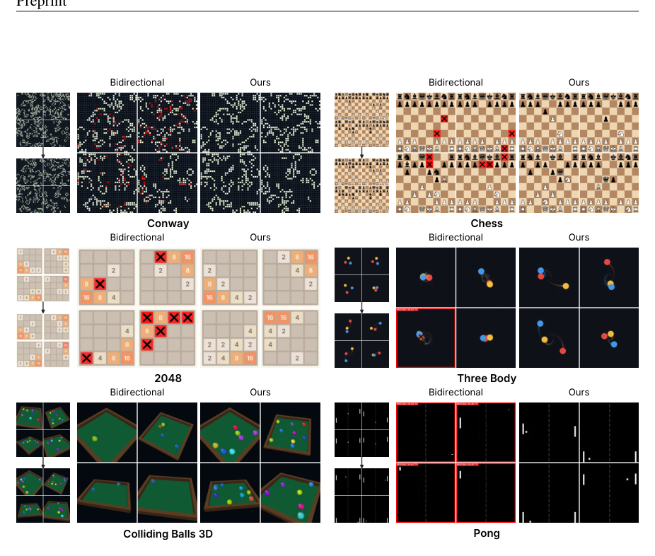

*Framework / architecture - Figure 6: Qualitative comparisons with the Wan-5B-LoRA architecture. Serial methods per- form similarly and produce more coherent video than the bidirectional baseline on MPMWorlds and Rubik’s Cube Real datasets.*

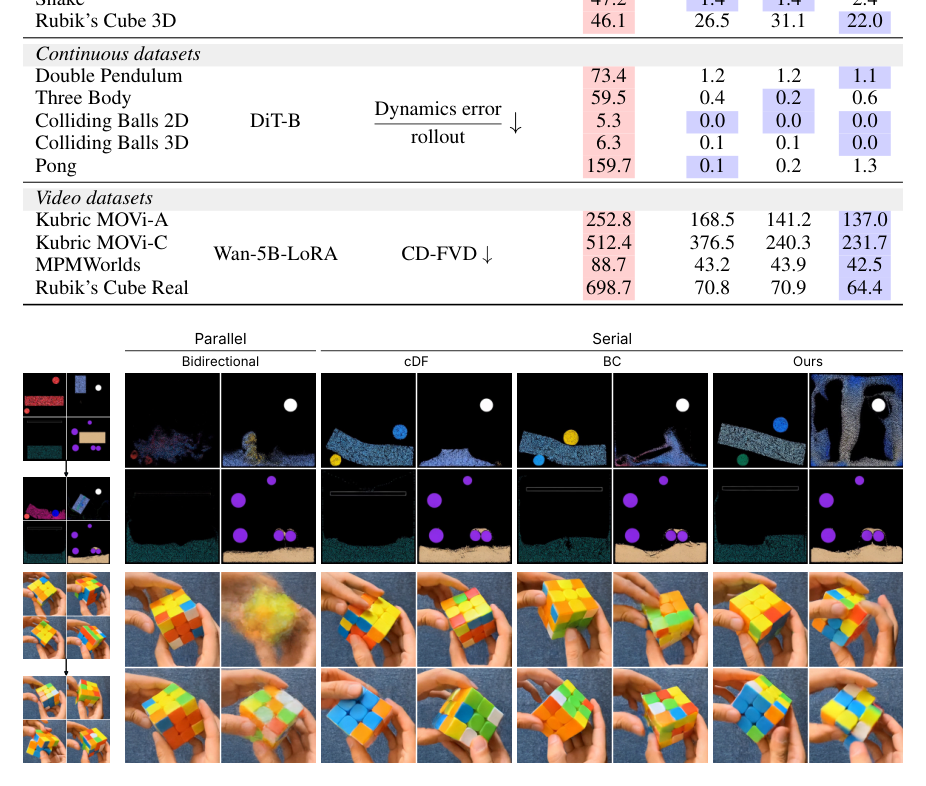

**Why this ranks #1**: The tau ablation isolates one continuous knob spanning fully parallel to fully serial and shows a genuine speed/quality optimum, and the negative result - that unlimited in-distribution data does not buy rule-following - reframes what serial depth is worth.

---

### 2. Kandinsky 6.0 Video: Foundation Models for Synchronized Video and Audio Generation

**arXiv**: [2610.05608](https://arxiv.org/abs/2610.05608) | **Score**: 8.7 (relevance 9 x 0.7 + quality 9 x 0.3) | **Tags**: AIGC-video, AIGC-audio | **Categories**: cs.CV, cs.AI, cs.LG, cs.MM | **Pages**: 72

**Authors**: Team Kandinsky, Julia Agafonova, Bulat Akhmatov, Mikhail Aksyutin, Grigorii Alekseenko, Anastasia Aliaskina, Olga Androsova, Vladimir Arkhipkin, Anna Averchenkova, Alexander Belykh, Serafima Bocharova, Sofiya Bogakovskaya, Anton Bukashkin, Mark Bulygin, Kirill Buzygin, Irina Cheremnykh, Kirill Chernyshev, Mikhail Chernyshov, Vladimir Chernyy, David Chikovani, Georgy Daniltsev, Denis Dimitrov, Anna Dmitrienko, Vladimir Dokholyan, Sergey Emelyanov, Dmitry Ermilov, Georgii Fedorov, Polina Gavrilova, Nikolai Gerasimenko, Aleksandr Gordeev, Andrey Inozemtsev, Andrei Ivaniuta, Alexander Ivanov, Mikhail Karaev, Anastasiia Kargapoltseva, Ivan Kirillov, Nikita Kiselev, Valeria Kobenko, Yury Kolabushin, Denis Koposov, Anatoly Korobov, Vladimir Korviakov, Kirill Kozlov, Denis Krzhivokolskiy, Konstantin Kuklev, Alexander Kunitsyn, Sergey Kuzin, Vladislav Lakhtionov, Alexey Letunovskiy, Maxim Litvinov, Alexander Lyulkov, Georgy Makarov, Kirill Malakhov, Egor Malykh, Mikhail Mamaev, Dmitrii Mikhailov, Polina Mikhailova, Ivan Mikheev, Elizaveta Muromtseva, Nikolai Nazarkin, Tatiana Nikulina, Lev Novitskiy, Stanislav Onuchin, Nikita Osterov, Denis Parkhomenko, Anatoliy Parpara, Vladimir Polovnikov, Konstantin Reznikov, Azat Saginbaev, Nikita Samsonov, Alexander Sentsov, Nikita Shaimov, Artem Sherstyuk, Andrey Shutkin, Egor Silvestrov, Bulat Suleimanov, Matvey Suprunov, Sergey Taranov, Irina Tolstykh, Tatiana Trofimuk, Ilya Trushkin, Aleksandra Tsybina, Olga Varlashina, Viacheslav Vasilev, Ilya Vasiliev, Eugeny Vilisov, Sergey Yakubson, Konstantin Zakharov

**Affiliation**: Kandinsky Lab∗

**Abstract**

> We present Kandinsky 6.0 Video, a family of foundation diffusion models for synchronized text-to-audio-video generation, comprising Kandinsky 6.0 Video Lite (3B parameters) and Kandinsky 6.0 Video Pro (29B parameters). Both models generate 5-second video clips with synchronized 44 kHz audio, including lip-sync, in text-to-audio-video (T2AV) and image-to-audio-video (I2AV) modes; a built-in super-resolution model raises the output resolution to Full-HD (1920$\times$1080). Building on the video generation capabilities of Kandinsky 5.0, Kandinsky 6.0 Video employs a dual-stream CrossDiT architecture that connects a pretrained video stream and a newly trained audio stream through bidirectional cross-attention for temporal and semantic alignment. Our continuous pretraining strategy first trains the audio stream from scratch on large-scale audio corpora and then trains both streams jointly on paired audio-video data while preserving unimodal fidelity; pretraining is followed by supervised fine-tuning, reinforcement-learning-based post-training, and distillation. In side-by-side human evaluation, Kandinsky 6.0 Video Pro clearly outperforms its predecessor, Kandinsky 5.0 Video Pro, and remains competitive with leading audio-video generation models, particularly in speech quality. To accelerate open research and deployment in multimedia generation, we release the code, model checkpoints, and diffusers integration under the MIT license.

**Key findings**

- **Finding**: A family of two fully open foundation models - Kandinsky 6.0 Video Lite (3B) and Pro (29B) - each generating 5-second clips with synchronized 44 kHz audio including lip-sync, in both text-to-audio-video and image-to-audio-video modes, with a built-in super-resolution model lifting output to Full-HD (1920x1080).

- **Finding**: The architecture connects a pretrained video stream to a newly trained audio stream through bidirectional cross-attention (dual-stream CrossDiT). The audio stream is trained from scratch on large-scale audio corpora, joined via newly initialized cross-attention, and both streams are then trained jointly on paired audio-video data to preserve unimodal fidelity.

- **Finding**: On VABench after RL post-training, Pro leads LTX 2.5 on 10 of 13 sub-metrics - lipsync 2.072 vs 1.567, desync 0.396 vs 0.521 (lower is better), audio_aes 3.345 vs 3.307, audio_realism 3.893 vs 3.663 - and wins most alignment metrics, while Lite already beats LTX 2.5 on several.

- **Recommendation**: Read this if you need an MIT-licensed, fully released audio-video foundation model with diffusers integration rather than a closed API. Code and checkpoints are released.

**Key figures**

*Results / analysis - Teaser montage of text-to-audio-video samples: a grid of generated clips spanning stylised animation, live-action cinematics, macro photography and surreal imagery, generated jointly with synchronized audio (speaker icon marks an audible example). No text caption is present in the source PDF.*

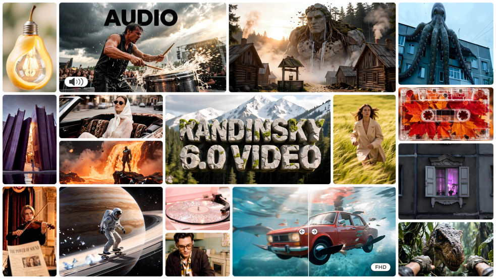

**Why this ranks #2**: The only full-scale released foundation model in this batch, and the VABench table is a genuine head-to-head against the leading open system rather than a self-reported score.

---

### 3. Level-of-Token Diffusion

**arXiv**: [2610.05816](https://arxiv.org/abs/2610.05816) | **Score**: 8.5 (relevance 8 x 0.7 + quality 9 x 0.3) | **Tags**: AIGC-image, AIGC-video, efficiency | **Categories**: cs.CV, cs.AI | **Pages**: 39

**Authors**: Kiyohiro Nakayama, Brian Chao, Jan Ackermann, Hansheng Chen, Federico Tombari, Leonidas Guibas, Lior Yariv, Gordon Wetzstein

**Affiliation**: Stanford University | Google

**Abstract**

> Image and video diffusion models allocate equal computation to every region, even when the intended scene calls for varying levels of detail. The spatial distribution of detail can often be anticipated before generation, indicating where computation can be reduced. We introduce Level-of-Token (LoT) Diffusion, a framework that turns this knowledge into an explicit multiresolution token layout (Level-of-Token layout) for adaptive and efficient generation. Tokens represent rectangular patches of varying sizes and shapes, allocating finer tokens where detail is needed and coarser tokens elsewhere. We adapt pretrained diffusion transformers to LoT layouts through a patch-wise asymmetric flow parametrization and embeddings for multiresolution tokens, preserving full-resolution flow prediction at every denoising step while processing only a reduced token sequence. LoT Diffusion enables layout-adaptive generation while preserving pretrained generative priors. We demonstrate LoT with layouts derived from semantic masks, bounding boxes, texture variance, and depth-of-field cues, as well as agentic plans. Across image and video generation, LoT offers favorable quality-efficiency tradeoffs, with significant speedups determined by the layout's token budget. Our project website is at https://georgenakayama.github.io/lotdiffusion/.

**Key findings**

- **Finding**: Up to 2.04x speedup for images and 3.53x for videos on average versus full-resolution pretrained models, with the speedup set by the layout's token budget. On FLUX.2-klein-base-4B at 2.040x compression it reaches 1.32-2.04x and beats ToMe-SD, DDiT and Foveated Diffusion on most metrics at every token budget.

- **Finding**: The mechanism is patch-wise asymmetric flow matching with a semi-orthonormal basis per token extent fitted by orthogonal Procrustes, plus one linear output head per extent initialized as W_e = A_e W_out. The DiT sees a reduced sequence of L tokens but still predicts a full-resolution velocity field at every denoising step, so the pretrained VAE decoder and generative prior are preserved.

- **Finding**: Layouts come from semantic masks, bounding boxes, texture variance, depth-of-field cues and agentic plans. Per-layout image speedups are 1.73x (bounding box, 1.62x compression), 1.81x (semantic mask, 2.18x), 1.28x (texture variance, 1.36x) and 2.29x (depth, 3.11x), and it also reports 3D-asset generation at 1.49x fewer tokens and 1.75x speedup.

- **Recommendation**: Read this if you are paying for uniform-token DiT inference and already know - or can estimate - where detail matters in the scene.

**Key figures**

*Framework / architecture - Level-of-token layout applied to image, video and 3D-asset generation. Top: a 2.16x token reduction on a lettered test layout alongside 2.5x faster image generation. Applications below report token savings and speedups - image generation 2.00x/1.58x, depth-map to cat image 2.10x/1.58x, bounding boxes to room image 2.39x/1.78x, video generation 1.79x/2.21x, 3D assets 1.49x/1.75x, and 3D bounding boxes 1.50x/1.76x.*

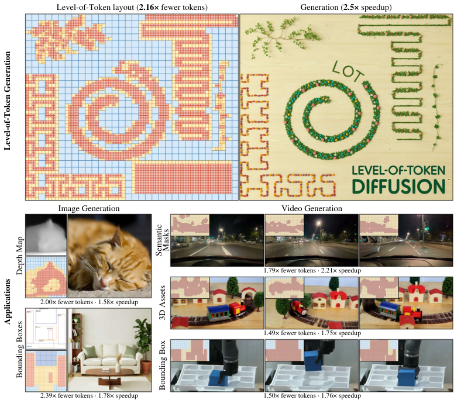

*Results / analysis - Figure 4: Image generation with different layouts. We generate images using arbitrary LoT layouts derived from signals that indicate spatial importance, including bounding boxes, seman- tic masks, texture variance, or depth maps, allocating finer tokens to regions that require detail.*

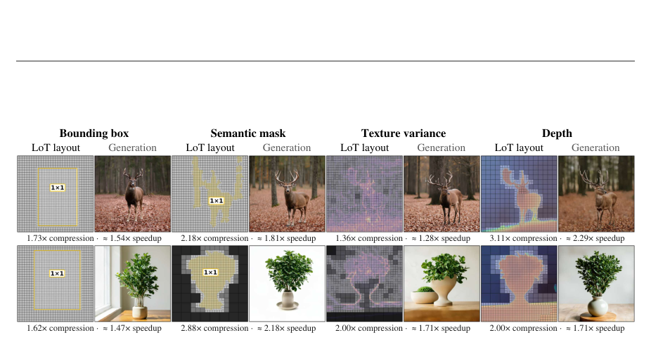

**Why this ranks #3**: Attacks inference cost for both image and video DiTs while keeping full-resolution output rather than cropping or masking, with a full baseline table across compression rates.

---

### 4. PixReenact: Pixel-Conditioned Causal Video Diffusion for Streaming Head-Avatar Reenactment

**arXiv**: [2610.05233](https://arxiv.org/abs/2610.05233) | **Score**: 8.5 (relevance 8 x 0.7 + quality 9 x 0.3) | **Tags**: AIGC-video | **Categories**: cs.CV | **Pages**: 23

**Authors**: Gavriel Habib, Dvir Samuel, Or Shimshi, Rami Ben-Ari

**Affiliation**: NVIDIA

**Abstract**

> Streaming head-avatar reenactment aims to animate a reference image according to a live driving video, requiring robust motion transfer, long-term identity stability, and low latency. Existing methods often rely on specialized identity or motion representations, which can discard useful visual information and inherit failure modes from external extractors. In addition, many recent diffusion-based reenactment methods use offline, clip-based generation, jointly processing and denoising an entire video clip before producing its output, making continuous low-latency streaming difficult. We introduce PixReenact, a pixel-conditioned streaming reenactment framework built on causal video diffusion. PixReenact conditions directly on VAE-encoded reference and driving frames, without specialized identity or motion representations. To separate reference identity from driver motion, we train with cross-identity pseudo supervision together with corrective objectives anchored to the original reference and driving inputs. Long self-rollouts reduce autoregressive drift, while state-aware dual-teacher distillation separately addresses cold-start and steady-state generation. Across three cross-identity benchmarks and a long-horizon streaming benchmark, PixReenact demonstrates robust cross-identity reenactment, particularly under challenging conditions such as extreme viewpoints, occlusions, and pronounced facial expressions, while maintaining the reference identity over long streams. A 4-NFE rolling student continuously emits four frames per update with a mean emission latency of 239 ms.

**Key findings**

- **Finding**: On a purpose-built 68-pair extreme-condition benchmark (CelebV-HQ drivers with extreme poses and occlusions, FFHQ references) PixReenact lifts AdaFace identity similarity from PersonaLive's 0.472 to 0.727 and lowers expression deviation from 1.295 to 1.135, at equal temporal LPIPS (1.853 vs 1.866).

- **Finding**: The 4-NFE rolling student emits four frames every 238.9 ms (16.74 FPS) on a single H200, and identity stays stable across 28 five-minute streaming clips where PersonaLive declines. On the public cross-identity benchmark it gets the best FVD (377.1), and on NeRSemble it improves ID 0.753 vs 0.734, tLP 0.803 vs 0.890 and FVD 264.8 vs 310.0 over PersonaLive.

- **Finding**: Conditioning is on VAE-encoded reference and driving pixels only - no keypoints or learned motion codes - which removes the external-extractor failure mode. Ablations quantify what that costs: dropping the +/-1 latent window cuts ID from 0.707 to 0.585 and raises driver-identity leakage from 0.023 to 0.210, while removing cross-identity supervision worsens FVD 389 -> 458.

- **Recommendation**: Read this if you build real-time avatars and currently pay latency for external motion extractors or offline clip-based diffusion.

**Key figures**

*Framework / architecture - Figure 1: PixReenact Overview. Top-left: offline cross-identity pseudo targets from real reference- driver pairs, plus real self-driving data. Top-right: cold-start and steady-state teachers are distilled into a 4-NFE student with DMD and corrective objectives. Bottom: reference, driving, and context latents condition a causal video DiT w*

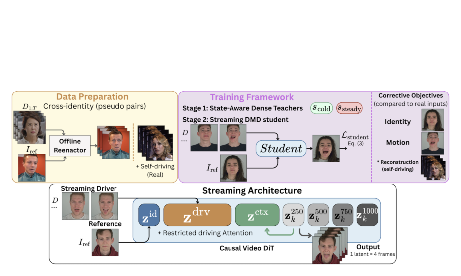

*Results / analysis - Figure 2: Qualitative comparison under challenging viewpoints and occlusions. Compared with PersonaLive, PixReenact better preserves the reference identity while following the driver’s motion.*

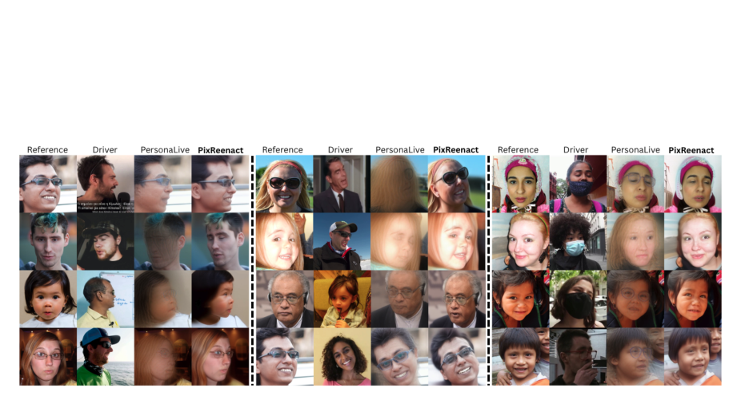

**Why this ranks #4**: A full industrial-strength system where the identity/leakage trade-off is measured rather than asserted, and latency is reported alongside quality across four benchmarks.

---

### 5. SPIN: Image Immunization Against Diffusion Editing via Single-Step Projection in Stochastic Neighborhoods

**arXiv**: [2610.06334](https://arxiv.org/abs/2610.06334) | **Score**: 7.5 (relevance 6 x 0.7 + quality 9 x 0.3) | **Tags**: AIGC-edit, safety | **Categories**: cs.CV | **Pages**: 21

**Authors**: Fengming Gu, Jie Zhang, Zhongqi Wang, Qiankun Li, Shiguang Shan, Xilin Chen

**Affiliation**: School of Advanced Interdisciplinary Sciences, University of Chinese Academy of Sciences | State Key Laboratory of AI Safety, Institute of Computing Technology, Chinese Academy of Sciences | University of Chinese Academy of Sciences, 4Imperial College London

**Abstract**

> Diffusion models have greatly advanced instruction-guided image editing, while also raising concerns about unauthorized image manipulation. Image immunization addresses this risk by adding imperceptible perturbations to an input image to disrupt subsequent edits. Since editing requests are unknown at image release, protection should remain effective beyond the instruction used to construct the perturbation. Existing immunization methods either require costly full-trajectory backpropagation or use intermediate objectives whose effects may be weakened by subsequent denoising. Meanwhile, a single inference path provides limited feedback about alternative denoising continuations. To address these challenges, we propose \textsc{SPIN}, a framework for image immunization via one-step projection over local stochastic trajectory neighborhoods. Starting from an early denoising state, \textsc{SPIN} generates stochastic neighboring states under the same instruction and predicts their clean latents through one-step projection without full unrolling. We then optimize a bounded input perturbation to maximize the average deviation of these predictions from a clean-edit reference, encouraging the perturbation to disrupt multiple possible editing outcomes. Experiments on two image editors demonstrate substantial gains in protection performance, with \textsc{SPIN} outperforming compared methods across all six metrics under seen instructions and in the more challenging unseen instruction setting.

**Key findings**

- **Finding**: Immunization success reaches 90% on SD3 and 94% on InstructPix2Pix under the instructions used to build the perturbation, against 84-85% for the best baseline (AdvDM / MIST), with the largest margin on SD3 where protected-image PSNR drops to 11.20 versus AdvDM's 13.54 and LPIPS rises to 0.6730 versus 0.5391.

- **Finding**: Generalization to five semantically disjoint unseen instructions is the harder and more decisive result - 85% ISR on SD3 and 91% on InstructPix2Pix, where competing methods fall to 50-69% and 79-86%. The gap widens because the objective is optimized over multiple stochastic trajectories rather than a single one.

- **Finding**: Efficiency and generality come from never unrolling the trajectory: from a shared early denoising state, SPIN samples local stochastic neighbours under the same instruction and predicts each one's clean latent by one-step projection, then maximizes the average deviation from a fixed clean-edit reference. The ablation shows the stochastic neighbourhood adds on top of single-candidate projection.

- **Recommendation**: Read this if you publish images that must resist later editing by a model you do not control.

**Key figures**

*Framework / architecture - Figure 1: Overview of SPIN. From a shared native prefix, local trajectory sampling generates neigh- boring candidates and one-step projection estimates their clean endpoints. These estimates guide perturbation optimization to drive editing outputs away from the fixed clean-edit reference.*

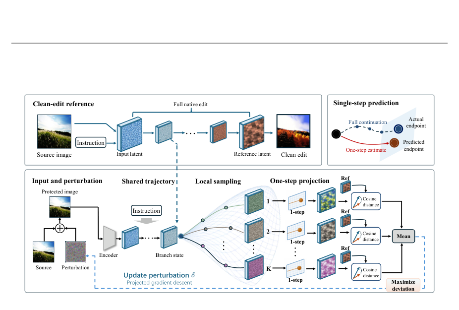

**Why this ranks #5**: Unseen-instruction protection is the metric that matters in practice, and SPIN's 85%/91% there is well clear of a dense baseline field (PhotoGuard-E/D, SDS, ED, AdvDM, MIST, SA, DCT, SIFM).

---

### 6. How Does Geometry Enter Generated Motion?

**arXiv**: [2610.05135](https://arxiv.org/abs/2610.05135) | **Score**: 8.0 (relevance 7 x 0.7 + quality 9 x 0.3) | **Tags**: AIGC-video, evaluation | **Categories**: cs.CV, cs.AI | **Pages**: 43

**Authors**: Weihan Li, Junhao Wu, Yuhan Song, Xiaofeng Lin, Xinlei Chen

**Affiliation**: The University of Tokyo | RWTH Aachen University | Harbin Institute of Technology, Shenzhen

**Abstract**

> Under a fixed physical law, the visible geometry of a scene determines how motion must change. We ask how video generators realize this relationship. We fix the law and the initial state and change only the geometry drawn in the first frame, within matched families of tracks and deflectors, and compare each generated trajectory with the simulator prediction for that geometry. Paired interventions change one thing at a time: a local bump, the height of a barrier, the words of the prompt, the length of the clip. Across nine image-to-video models, geometry is preserved and shapes the motion: the speed of the ball follows the drawn undulation of a track. A physical state would carry this response forward, and here the generated motion parts from the law. The mean slope barely accelerates the ball, successive contacts fail to compose through a consistent state, an edit ahead of the ball alters its motion before it arrives, and the ball climbs over barriers higher than its release point. Two global conditions organize the global trajectory: text strongly controls the destination, while clip length strongly controls timing in the open-weight models tested. The pattern persists with photographed first frames. Current video generation thus behaves as geometry-conditioned motion synthesis whose evolution of state differs systematically from that of a fixed physical law.

**Key findings**

- **Finding**: Across nine image-to-video models (six open-weight, three closed) and more than 5,000 generated videos, geometry genuinely shapes motion but the *state* does not evolve by the physical law: the ball rises above its release height in 63 of 72 videos and crosses 43 of 49 physically impassable barriers, and with three deflectors the correct physical contact order appears in at most a quarter of a model's videos.

- **Finding**: The response is not local either - a local bump changes speed in only one model and at one fifth of the physical size, while in three models an edit placed ahead of the ball alters its motion before the ball arrives. The mean slope, which supplies most of the speed physically, contributes almost nothing: gain is 0.54-1.24 of physical at 3 cycles/metre, with 8 models leading the physical phase by 15-41 degrees.

- **Finding**: Two global factors do the organizing instead - the outcome named in the prompt controls the destination (removing "comes to rest in the tray" drops arrival by 33-96 percentage points in all eight models tested), and clip length controls timing in the open-weight models. The pattern persists when rendered first frames are replaced by photographs of the built scenes.

- **Recommendation**: Read this if you build physics-grounded or simulation-to-video systems, or if you are choosing a benchmark for world-model evaluation. It proposes no generation method.

**Key figures**

*Results / analysis - Figure 1. Same law, different geometry. One ball, one law, one starting point; only the height of a barrier changes. In the simu- lated motion (top) the ball crosses the lower barrier and turns back at the one that rises above its release height (dashed line). In the generated motion (bottom; MiniMax-H3, one seed) it crosses both, as it d*

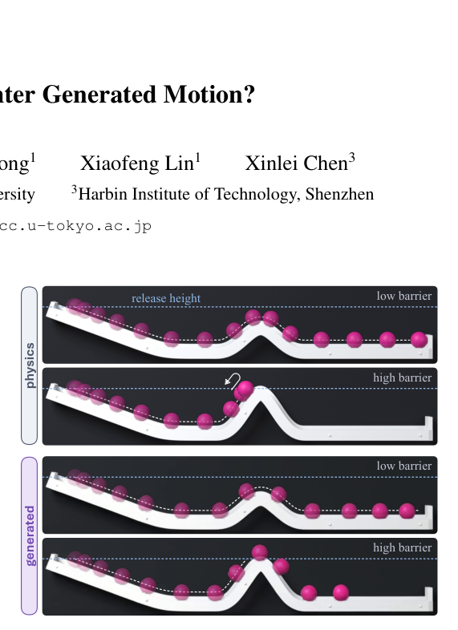

*Results / analysis - Figure 4. Cases. Five scenes (rows) in the simulated motion and in four models (columns). The ball is drawn at equal time steps, from light to full, so that its spacing shows the speed; the white dashed curve is the physical path and the blue dashed line the release height. The third row repeats the scene of the second with a prompt that*

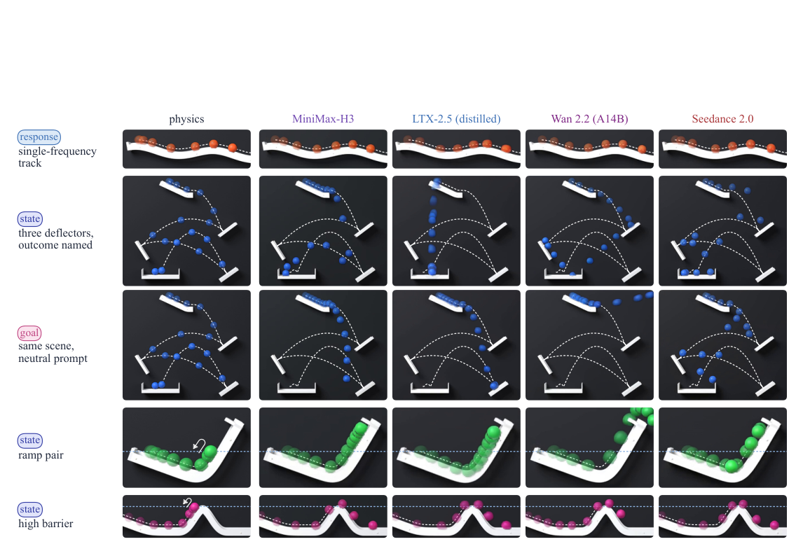

**Why this ranks #6**: The most rigorous evaluation design in the batch (held-law, varied-geometry, paired interventions across 9 models), producing a crisp mechanistic conclusion that constrains what video generators can be claimed to model.

---

### 7. UniSlider: Perceptually Uniform Sliders for Continuous Image Editing

**arXiv**: [2610.06831](https://arxiv.org/abs/2610.06831) | **Score**: 8.0 (relevance 8 x 0.7 + quality 8 x 0.3) | **Tags**: AIGC-edit, AIGC-image | **Categories**: cs.CV, cs.AI, cs.GR | **Pages**: 31

**Authors**: David Serrano-Lozano, Duygu Ceylan, Yannick Hold-Geoffroy, Iliyan Georgiev, Javier Vazquez-Corral, Anna Frühstück

**Affiliation**: Computer Vision Center | Universitat Autònoma de Barcelona | Adobe Research

**Abstract**

> Sliders provide an intuitive interface for continuous image editing. In current generative approaches, however, the slider is simply a rescaling of the method's strength parameter, such as an adapter coefficient, a prompt weight, or an interpolation factor. This strength relates poorly to perceptual change. The image can partially revert as the slider moves, long stretches of the range produce no visible difference, and short intervals transform the image abruptly. Remapping the strength could fix this uneven pace, but only if the trajectory is monotone, which current methods do not enforce. We therefore distinguish the slider from the strength, and require perceptual distance from the input to grow linearly with the slider value. We introduce UniSlider, a lightweight LoRA trained on a few-step editing backbone so that its strength approximates this ideal slider. Few-step sampling lets us impose this objective in pixel space without intermediate ground truth, and the backbone's output is preserved at full strength. However, a low-rank adapter cannot make the strength fully uniform. Our slider is thus an inference-time remapping of the strength, obtained by adaptive sampling. Since training optmizes to make the trajectory monotone, this remapping closes the remaining gap without extra training or parameters. On a new benchmark of 300 continuous edits evaluating uniformity, monotonicity, edit fidelity, and identity preservation, UniSlider outperforms all prior methods and is preferred in a user study.

**Key findings**

- **Finding**: The core objective is stated as a constraint rather than a heuristic - perceptual distance from the input must grow linearly with the slider, D(x_src, x_s) = s*D(x_src, x_edit), while the trajectory stays on the perceptual path, D(x_src,x_s) + D(x_s,x_edit) = D(x_src,x_edit). Current sliders (adapter coefficient, prompt weight, interpolation factor) fail this, producing dead zones, jumps and reversals.

- **Finding**: On a new 300-case continuous-editing benchmark UniSlider is best on most axes: CLIP-dir 0.112 and VQA-edit 0.799, VQA-identity 0.125, endpoint RMSE 0.018 (vs 0.021 for K. Kontext), MUSIQ 67.09, and perceptual uniformity CV-DreamSim 0.652 (vs 0.675 for FlowSlider and 1.153 for K. Kontext).

- **Finding**: Implementation is minimal and endpoint-preserving - a lightweight LoRA over all DiT projection layers scaled as W(s) = W0 + (1-s)*dW, so the adapter vanishes at s = 1 and the model reduces exactly to the frozen backbone. A few-step backbone is chosen specifically so the objective can be imposed in pixel space with no intermediate ground truth.

- **Recommendation**: Read this if you ship a continuous-strength editing control and users complain some slider ranges do nothing. The user study is decisive: 82.7% / 82.6% preference against 61.7% for the next-best method.

**Key figures**

*Results / analysis - Figure 1: UniSlider produces perceptually uniform edit strengths. Each row shows one image edited at increasing strength under the instruction above it. Equidistant steps along the slider produce equal amounts of perceptual change; the full interval is thus utilized smoothly and predictably.*

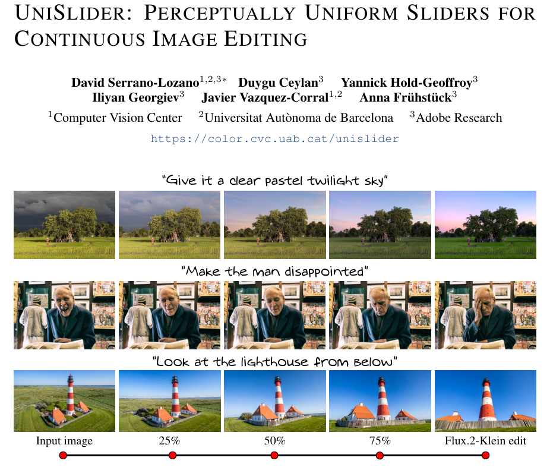

*Results / analysis - Figure 4 reveals a consistent trend. For small N, the adapter achieves near-perfect uniformity, but increasing the number of examples eventually leads to less uniform trajectories. This transition occurs at larger N when the adapter rank is higher, indicating that the adapter capacity determines how many image–instruction pairs can be rep*

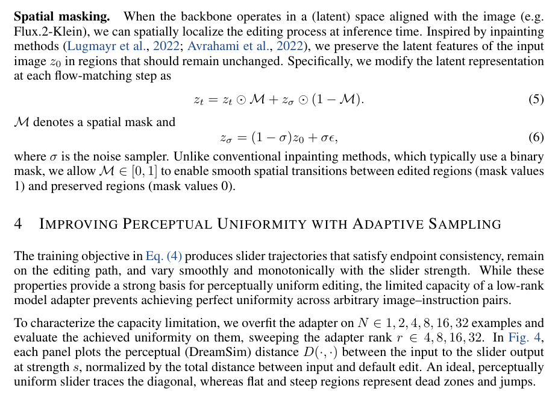

**Why this ranks #7**: It names a real interface defect (strength does not equal perceptual change), fixes it with a new benchmark, and validates it with a user study rather than only automatic metrics.

---

### 8. Geometry-Aware Preference Optimization for Text-to-Image Diffusion Models

**arXiv**: [2610.04980](https://arxiv.org/abs/2610.04980) | **Score**: 8.0 (relevance 8 x 0.7 + quality 8 x 0.3) | **Tags**: AIGC-image, rlhf | **Categories**: cs.CV | **Pages**: 35

**Authors**: Lei Wang, Zhen Wang, Yuexiang Xie, Yaliang Li

**Affiliation**: aSun Yat-Sen University, Guangzhou, China | bAlibaba Group, Hangzhou, China

**Abstract**

> Preference alignment has become a standard practice for text-to-image diffusion models. Direct Preference Optimization (DPO) simplifies this process by eliminating explicit reward modeling. Its diffusion variant, Diffusion-DPO, has become a widely adopted baseline. Diffusion-DPO essentially encourages the likelihood of preferred samples while suppressing dispreferred ones. In this paper, we revisit DPO-style alignment methods for diffusion models from the perspective of the manifold hypothesis. Under this view, natural images concentrate near a low-dimensional manifold embedded in the high-dimensional ambient space, whereas DPO directly optimizes preference distributions in the full space without accounting for this geometric structure. This creates a mismatch in the optimization dynamics: it suppresses geometry-preserving tangential updates, while insufficiently restricting hazardous normal-direction updates. This mismatch gradually degrades image quality and diversity. To address this issue, we propose Anisotropic Geometry-Aware Preference Optimization (APO), which replaces the uniform Euclidean treatment of prediction errors with a geometry-aware anisotropic metric derived from the reference model. Concretely, APO adaptively strengthens regularization in directions where the reference denoising function is highly sensitive, while relaxing constraints in directions that permit safe semantic adjustment. This recalibrates preference optimization according to the local manifold geometry, and maintains the original manifold structure. Experiments show that APO achieves strong performance and an average win rate exceeding 60\% against various existing alignment methods across diverse benchmarks. It requires significantly fewer training steps than prior methods, and preserves generation diversity throughout training.

**Key findings**

- **Finding**: Identifies a named geometric failure mode of DPO-style diffusion alignment - off-manifold drift. Standard Diffusion-DPO measures the noise-prediction residual under an isotropic Euclidean metric, which over-regularizes manifold-tangent directions and under-constrains geometry-sensitive normal directions, degrading image quality and diversity as training proceeds.

- **Finding**: APO replaces that uniform treatment with an anisotropic metric induced by the Jacobian of the frozen reference score field, computed with a forward-only Hutchinson + finite-difference approximation. The same perturbed forward passes serve both the policy and reference terms, which eliminates the reference-model backward pass and cuts activation memory from O(|theta_ref|) to negligible.

- **Finding**: On SD1.5 and SDXL, APO reaches FID of approximately 16.65 and 16.23 respectively and consistently maintains lower FID as alignment progresses, where standard methods' FID rises. A time-threshold ablation shows the benefit concentrates in the intermediate noise range of roughly 400-600 steps, with the sharpest drop between t_tau = 400 and 600.

- **Recommendation**: Read this if you run Diffusion-DPO-style alignment and see quality or diversity decay with longer training.

**Key figures**

*Results / analysis - Figure 1: Toy preference optimization on a manifold under different methods. A DDPM with a 4-layer*

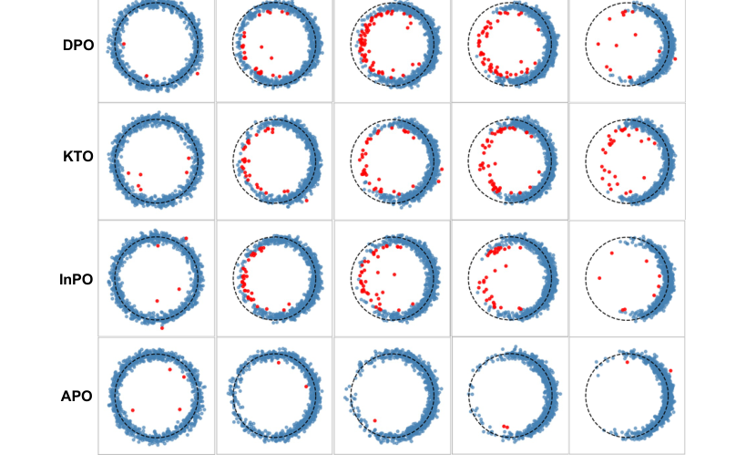

**Why this ranks #8**: It re-derives DPO's failure from manifold geometry rather than reward or objective design, which makes it applicable to every diffusion-DPO variant rather than one reward setup.

---

### 9. Keepsake: Selective Spatial Memory for Long-Horizon Video Generation

**arXiv**: [2610.06588](https://arxiv.org/abs/2610.06588) | **Score**: 7.3 (relevance 7 x 0.7 + quality 7 x 0.3) | **Tags**: AIGC-video, efficiency | **Categories**: cs.CV | **Pages**: 19

**Authors**: Abdul Mohaimen Al Radi, Kunyang Li, Yuzhang Shang, Mubarak Shah, Yu Tian

**Affiliation**: Institute of Artificial Intelligence, University of Central Florida

**Abstract**

> Long-horizon camera-controlled video generation relies on persistent memory to maintain scene consistency. Existing systems follow two strategies to achieve this consistency. Full-history approaches retain all generated observations, causing unbounded storage and retrieval costs. Selective-construction approaches reduce redundancy, but make one-time retention decisions that are never revisited, even as an observation's value changes with the evolving memory bank. Both strategies leave a shared question unresolved: as the generated history evolves, which stored observations should still remain in memory? Our key insight is that the value of a stored observation is not fixed, but relational: it depends on the alternatives currently available in the memory bank. A view supported by many geometrically and visually similar substitutes can be relinquished with little loss of coverage, whereas an observation with few viable alternatives should remain regardless of age. We introduce Keepsake, an online, training-free controller for fixed-capacity spatial memory. At each update, Keepsake constructs a pose-appearance graph over retained and newly generated observations, combining camera-pose proximity with visual similarity. A retention priority jointly captures the number of strong substitutes and the similarity of the closest alternative, allowing Keepsake to continually reassess memory value, preserve observations with little alternative support, and evict highly replaceable ones under a fixed budget. The controller modifies only the persistent-memory update; the host generator, denoising schedule, and retrieval rule remain unchanged. Across MemCam and WorldMem, Keepsake improves FVD and LPIPS under a fixed memory budget. On 180-second MemCam trajectories, it retains only 32 of 5,397 frames while reducing FVD by 35.1%.

**Key findings**

- **Finding**: On 180-second MemCam trajectories Keepsake retains only 32 of 5,397 frames and reduces FVD from 734.2 to 476.6 (-35.1%), while cutting CPU lookup time per query from 3,077.6 ms to 43.8 ms. On 60-second WorldMem it improves both FVD (1,116.9) and LPIPS (0.534) over full retention.

- **Finding**: Retention value is defined relationally rather than intrinsically: a pose-appearance graph over retained plus new observations scores each observation by its number of strong substitutes and by its closest alternative's similarity, so an old view with few substitutes survives while a redundant new one can be evicted. The controller changes only the memory update, leaving generator, denoising schedule and retrieval rule untouched.

- **Finding**: Bounded baselines are not equivalent to each other or to full retention - at matched budget B = 32 on MemCam-180s, query time rises 24.80 ms (B=16), 43.77 ms (B=32), 105.15 ms (B=64), 209.78 ms (B=128) while FVD degrades 446.1 -> 515.5, and FIFO retention is reported to be *worse* than full retention, showing a memory cap alone is not the mechanism.

- **Recommendation**: Read this if you run camera-controlled long-horizon generation and are bottlenecked on memory growth and retrieval latency.

**Key figures**

*Framework / architecture - Figure 1: What should remain in memory? Unbounded memory versus our budgeted memory in MemCam. (a) Retained-frame count and CPU lookup latency per query. (b) DINO feature cosine distance from selected historical frames to reference frames over generation time; lower is better. (c) A camera-revisit example, with boxes highlighting correspo*

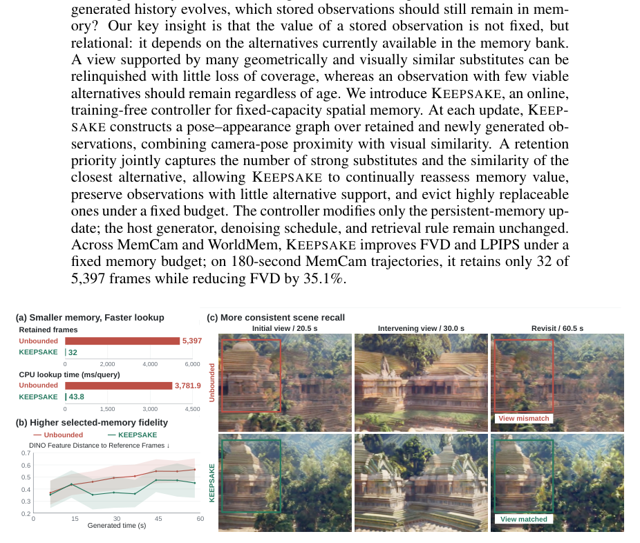

**Why this ranks #9**: A rare outcome - better FVD *and* 70x less memory and 70x faster lookup - that also separates retention loss from selection gap, a reusable diagnostic for memory-augmented generators.

---

### 10. DynaMesh: Dynamic 3D Texture Generation `[wild-card]`

**arXiv**: [2610.05529](https://arxiv.org/abs/2610.05529) | **Score**: 8.0 (relevance 8 x 0.7 + quality 8 x 0.3) | **Tags**: AIGC-3D, AIGC-video | **Categories**: cs.CV | **Pages**: 18

**Authors**: Raj Hansini, Guan Chen, Rana Hanocka, Itai Lang

**Affiliation**: University of Chicago

**Abstract**

> We present DynaMesh, a dynamic texture generation method for 3D meshes. Given a textureless shape and a text prompt describing an effect, our method produces an appearance that evolves while the object's geometry remains unchanged. Previous works on dynamic 3D content generation have focused on motion, where an object's geometry and position change while keeping its appearance the same. Methods on texture generation sit on the other side of the problem, painting appearance onto a shape as a fixed surface property and not as an evolving process. Neither addresses a visual effect that propagates on a 3D object. A natural route consists of two generators: a video model that shows the effect from a single view, and an image-to-3D generator that lifts each frame to 3D. However, the latter has no notion of time, so running it per video frame produces a sequence that flickers, loses effect details, and yields a different mesh at every video frame. Our method addresses these failures by conditioning a video model on a render of the mesh and the prompt to obtain a reference video, then running a frozen image-to-3D generator on the video with two changes. The conditioning of each frame is blended over a temporal window, and low-rank adapters are fit per shape to restore the lost details. The mesh is encoded once for the whole sequence, so geometry is constant by construction, and the output is a single mesh with a texture per frame. Applied to various objects and effects, DynaMesh substantially improves over recent video-to-4D and texturing methods, and can generalize its temporal effect to different shapes never seen during training. Our project page is at https://threedle.github.io/dynamesh/.

**Key findings**

- **Finding**: Over 42 objects and effects and all 150 frames, DynaMesh reaches flicker 0.005 and acceleration 0.005 (per-step temporal errors), beating the frozen per-frame image-to-3D generator (0.023 / 0.035) and video-to-4D baselines (SV4D 2.0 at 0.074 / 0.142, MeshNCA 0.007 / 0.011), at PSNR 24.9 / SSIM 0.798 fidelity to the reference video.

- **Finding**: Flicker is removed by a parameter-free operation - each frame's frozen DINOv3 conditioning tokens are blended with the same token position in neighbouring frames over an 11-frame window [t-5, ..., t+5] with softmax-normalized similarity weights - while per-shape LoRA adapters (rank 4 on spatial cross-attention and 3D self-attention, fit for 30 epochs) restore the effect detail the generator's prior washes out.

- **Finding**: Geometry is fixed by construction: the input mesh is encoded once and shared across all frames along with the sampling noise, so the output is a single mesh with one texture per frame. An adapter fit on one shape transfers to unseen shapes without retraining, and the whole sequence runs at 512-squared generation / 960-squared rendering on a single A40.

- **Recommendation**: Read this if you want a time-varying surface effect (rust, moss, cracks, paint peeling) on an existing mesh rather than a moving 4D object.

**Key figures**

*Results / analysis - Figure 1. DynaMesh carries a video’s evolving effect onto a 3D object as a texture that changes over time. Given a reference video of the prompted effect unfolding on a render of the object (top), we produce a single mesh whose texture follows the video frame by frame (bottom, shown from a rotating viewpoint as time advances). The geometr*

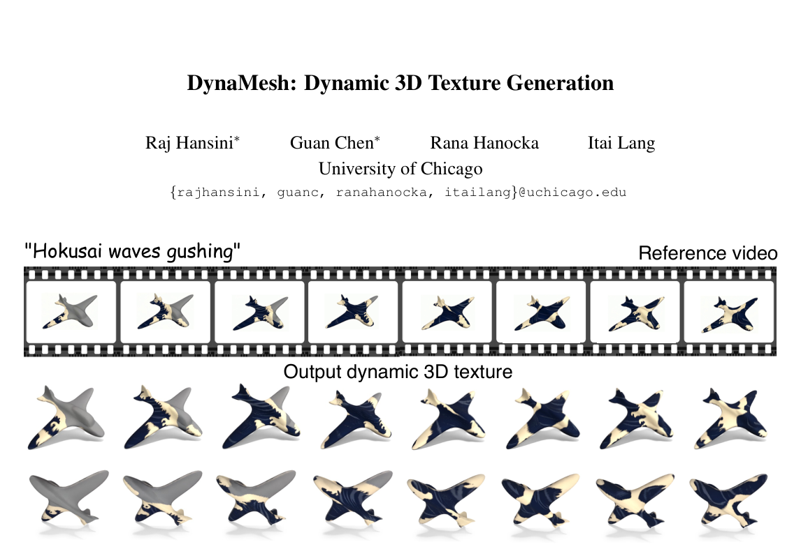

*Results / analysis - Figure 2. Gallery of results. Four objects driven by four different effects. Each panel shows the driving video as a film strip and, below it, our output rendered from two novel viewpoints. The texture remains coherent even at viewpoints unseen in training.*

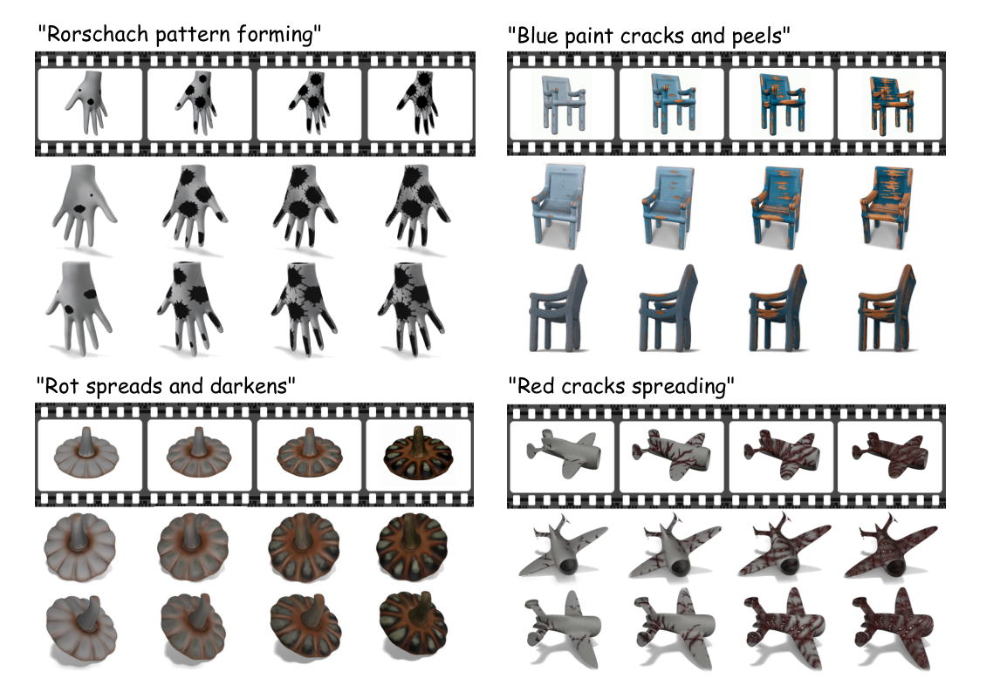

**Why this ranks #10**: It fills a gap neither video-to-4D (motion) nor texturing (static) covers, holding geometry constant by design while the effect propagates, with per-component temporal metrics that expose the flicker its competitors have.

---

## Footer

- Total papers scanned across all 7 arXiv categories: **879**
- Papers read in full for this digest: **87**
- aigc_visual track final top-10: **10**
- Wild-cards in this track: **1**
- Figure assets: `res/` (16 images shared across all 5 tracks)

Generated by the `mine-arxiv-daily-digest` skill. Sister file: `2026-10-06_aigc_visual_entry.md`.
