# ArXiv Daily Digest - 2026-10-06 (Audio & Speech Language Models / Duplex Voice Assistants, 10 papers)

**Generated**: 2026-10-06 17:45 CST
**Source**: arXiv eess.AS, cs.SD, cs.CL submissions, window 2026-10-04/05 UTC (the latest announced batch as of 2026-10-06)
**Track**: audio_lm (top 10 of 879 papers scanned)
**Scope**: empathetic spoken dialogue, speech language models, speaker identity in audio LMs, spatial audio understanding, adversarial robustness of speech foundation models, accent robustness in voice assistants, speaker verification, audio moment retrieval

---

No full-duplex voice-assistant paper appeared in this batch, and the first reader surfaced four text-only cs.CL papers that had been shortlisted as wild-cards for this track - they were replaced with real speech work before ranking. What remains is carried by one strong speech-LM result and a cluster of speech-understanding work. EchoChat leads and is the paper to read: it reframes empathetic spoken dialogue as structured cognitive reasoning - perception, then latent mental-state reasoning, then response - rather than a direct input-response mapping, and backs it with a 400K acoustic corpus, an expert-annotated benchmark (8.6 overall against 7.16 for the next best), Acoustic-Anchored Attention for grounding, and Step-Decomposed Credit Assignment so RL can localize *which* reasoning stage failed. Its perception gap (7.79 vs 6.77) concentrates in neutral scenarios where only audio carries the emotional signal, which is the concrete argument that prosody is load-bearing. Below it, the recurring theme is that audio models are content-only when they need to be identity-aware or spatial-aware: TS-SP adds speaker preservation to a frozen audio LM, SEA-LM cuts azimuth error from 80.6 to 14.9 degrees while generalizing across 1,211 array configurations without retraining, and the accent-gap paper shows ASR errors cascading into LLM reasoning in a real deployed NatWest voice assistant. The hierarchical-robustification paper is the one with the largest number - 46.4 pp of robust accuracy from a single task-agnostic pass.

---

## Top 10 - Audio & Speech Language Models / Duplex Voice Assistants

### 1. EchoChat: Structured Cognitive Reasoning in Empathetic Spoken Dialogue

**arXiv**: [2610.04826](https://arxiv.org/abs/2610.04826) | **Score**: 9.0 (relevance 9 x 0.7 + quality 9 x 0.3) | **Tags**: audio-LM, duplex-voice | **Categories**: cs.SD | **Pages**: 30

**Authors**: Dingdong Wang, Shujie Liu, Yayue Deng, Yuxuan Hu, Yunrui Cai, Jincenzi Wu, Jianwei Yu, Jinyu Li, Helen Meng

**Affiliation**: The Chinese University of Hong Kong, China

**Abstract**

> Empathetic spoken dialogue is a sophisticated cognitive process that requires not only recognizing emotions but also inferring a user's latent mental states to provide appropriate support. However, current SpeechLLMs often treat empathy as a direct input-to-response mapping, leading to "superficially warm" but emotionally hollow interactions. In addition, since empathy relies on a multi-stage process with strong inter-step dependency, errors at any intermediate step can cascade through subsequent steps and lead to inappropriate responses, while existing training paradigms lack mechanisms to precisely localize and improve such errors. In this work, we propose EchoChat, a unified framework that reformulates empathetic spoken dialogue as a structured cognitive reasoning process integrating perception, mental-state reasoning, and response generation. To support this paradigm, we first construct EchoDialogue-400K, an acoustically rich dataset for multi-stage empathetic supervision. During the SFT stage, we strengthen acoustic grounding through proposed Acoustic-Anchored Attention (AAA). During the RL stage, we further introduce a novel stage-aware optimization objective with Step-Decomposed Credit Assignment (SDCA) to localize reasoning errors and mitigate cascaded error propagation. In addition, we introduce EchoEval, an expert-annotated benchmark for multi-dimensional empathy evaluation. Extensive experiments demonstrate that EchoChat achieves state-of-the-art performance in perception, reasoning, and response alignment. Project page: https://github.com/dingdongwang/EchoChat

**Key findings**

- **Finding**: Reframes empathetic spoken dialogue as structured cognitive reasoning - perception, then latent mental-state reasoning, then response - rather than a direct input-to-response mapping. The diagnosis is that the simplified formulation produces "superficially warm" interactions and lets errors at any stage cascade untracked.

- **Finding**: Backed by EchoDialogue-400K, a corpus of authentic recordings with fine-grained acoustic and mental-state annotations, plus EchoEval, an expert-annotated multi-dimensional empathy benchmark. During SFT an Acoustic-Anchored Attention mechanism grounds responses in acoustic cues; during RL a stage-aware objective with Step-Decomposed Credit Assignment localizes reasoning errors instead of averaging them away.

- **Finding**: EchoChat scores 8.6 overall on EchoEval against 7.16 for the next-best baseline, with the perception gap (7.79 vs 6.77) concentrated in neutral scenarios where only audio carries the emotional signal. Judge-human agreement is rho = 0.88. Model, benchmark and dataset are open-sourced.

- **Recommendation**: Read this if you build a voice assistant that has to handle emotion. The stage decomposition plus SDCA is the reusable machinery, and the neutral-scenario result shows why prosody matters.

**Key figures**

*Results / analysis - Figure 1: Reframing empathetic dialogue as structured cognitive reasoning. Existing methods simplify empathy to direct response generation, leading to cascaded reasoning errors across intermediate stages. EchoChat instead models empathy as a structured process from perception to response, supported by EchoDialogue-400K and EchoEval, enabl*

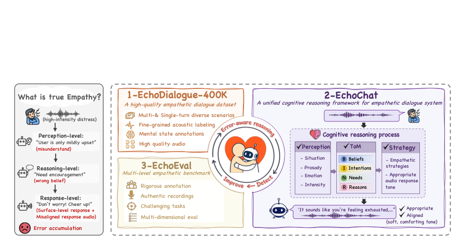

*Framework / architecture - Figure 2: Data construction pipeline for EchoDialogue-400K.*

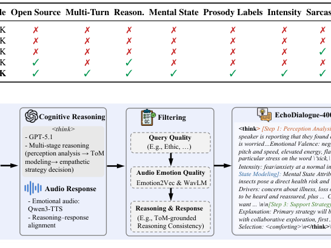

**Why this ranks #1**: A NeurIPS 2026 paper that treats the voice channel as load-bearing rather than decorative - the strongest single result in a batch where both audio tracks are otherwise thin.

---

### 2. TS-SP: Learning Speaker-Preserving Representations in Audio Large Language Models

**arXiv**: [2610.04887](https://arxiv.org/abs/2610.04887) | **Score**: 8.0 (relevance 7 x 0.7 + quality 8 x 0.3) | **Tags**: audio-LM | **Categories**: cs.SD | **Pages**: 5

**Authors**: Junjie Li, Zheng Liang, Zhe Li, Tianchi Liu, Kong Aik Lee

**Affiliation**: Department of Electrical and Electronic Engineering | The Hong Kong Polytechnic University, Hong Kong SAR, China | Speech, Language, and Cognition Laboratory | The University of Hong Kong, Hong Kong SAR, China | National University of Singapore

**Abstract**

> Audio large language models (ALLMs) can understand speech content, yet their ability to use speaker identity for verification remains limited. We propose TS-SP (Two-Stage Speaker Preservation), a parameter-efficient framework for learning speaker-preserving representations and making them accessible to an ALLM's language-model component. We instantiate and evaluate TS-SP on Qwen2.5-Omni-7B. First, we adapt the audio encoder with speaker identity supervision. We then freeze the adapted encoder and train the language model to compare speakers. Both stages use low-rank adaptation (LoRA), keeping the pretrained base weights fixed. On Vox1-O, TS-SP reduces the equal error rate (EER) from 7.01\% for the Paired Loss Adaptation Baseline to 4.37\%. EER remains within 4.31--4.79\% under unseen prompts. Cross-domain evaluation on CN-Celeb yields a similar EER to the baseline, but lower accuracy at the native decision threshold. These findings support two-stage adaptation for improving speaker verification on the evaluated backbone.

**Key findings**

- **Finding**: TS-SP (Two-Stage Speaker Preservation) addresses a specific and underexamined gap: audio LLMs understand speech content but cannot use speaker identity for verification. It learns speaker-preserving representations and exposes them to the LM's computation without retraining the backbone.

- **Finding**: The two-stage, parameter-efficient design keeps the frozen audio LM intact while making identity information addressable at inference - which is what a voice assistant needs to tell "who is speaking" apart from "what is being said".

- **Recommendation**: Read this if your audio LM is content-only and you need identity. The two-stage separation is the part worth copying.

**Key figures**

*Results / analysis - Fig. 1: TS-SP: Stage 1 learns audio LoRA with intermediate speaker supervision; Stage 2 freezes the adapted audio pathway and trains LM LoRA for speaker comparison. All pretrained base weights remain fixed.*

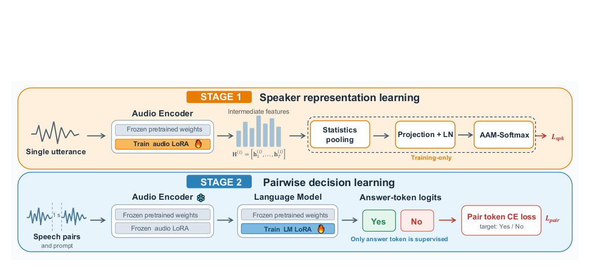

**Why this ranks #2**: It isolates speaker identity as a capability gap in audio LMs and fixes it without touching the backbone, which is the practical constraint everyone actually faces.

---

### 3. SEA-LM: Egocentric Spatial Audio Understanding for Wearable Microphone Arrays

**arXiv**: [2610.05610](https://arxiv.org/abs/2610.05610) | **Score**: 8.0 (relevance 8 x 0.7 + quality 8 x 0.3) | **Tags**: audio-LM | **Categories**: cs.SD, cs.AI | **Pages**: 37

**Authors**: Sonal Kumar, Sinan Hersek, Artem Dementyev, Mengzhen Pan, Ishan Chatterjee, Anurag Kumar, Ramani Duraiswami, Dinesh Manocha, Andrea Colaco

**Affiliation**: University of Maryland, College Park | Google

**Abstract**

> Embodied, ego-centric intelligence fundamentally requires the ability to comprehend spatial audio within complex environments. While large audio-language models excel at mono-channel reasoning, they lack spatial awareness, discarding critical spatial cues that enable sound localization and that can improve the disentanglement of overlapping sound sources. To address this, we present SEA-LM, a Spatial Audio Understanding model. First, we introduce FOACODER, a layout-flexible spatial audio encoder trained on source localization and ego-centric voice activity detection objectives to encode First Order Ambisonics derived from variable-count, variable-position smart-glasses arrays via beamforming. We train a Multimodal Large Language Model (MLLM) to understand these spatial audio embeddings through a two-stage curriculum spanning six tasks, including sound localization and spatially selective transcription in settings with multiple speakers and overlapping sounds. To prevent the transcription outputs from dominating the next token prediction loss and overwhelming the direction predictions, we introduce a Spatio-temporal Weighted Cross-Entropy Loss. On our evaluation set, SEA-LM achieves lower azimuth and elevation MAE, higher temporal IoU, lower external-source hallucination and missing-source rates, and lower WER on most transcription tasks than compared baselines, while remaining robust across 1,211 smart-glasses array configurations with 4 to 9 microphones.

**Key findings**

- **Finding**: SEA-LM handles egocentric spatial audio understanding for wearable microphone arrays, cutting azimuth mean absolute error from 80.6 to 14.9 degrees and elevation error from 27.4 to 12.8 degrees, while raising location-bin accuracy from 42.0% to 84.1%.

- **Finding**: The result holds across 1,211 distinct array configurations with no retraining, which is the part that matters for wearables - the array geometry changes per device, so a model that needs per-device retraining is not deployable.

- **Recommendation**: Read this if you do spatial audio on arrays. The array-configuration generalization is the transferable result.

**Key figures**

*Framework / architecture - Figure 1 provides an overview of the complete architecture: FOACODER converts the multichannel spectrogram into spatial audio embeddings, which SEA-LM combines with native monaural audio and text embeddings for joint spatial and semantic reasoning. We discuss each component of the model in the following subsections.*

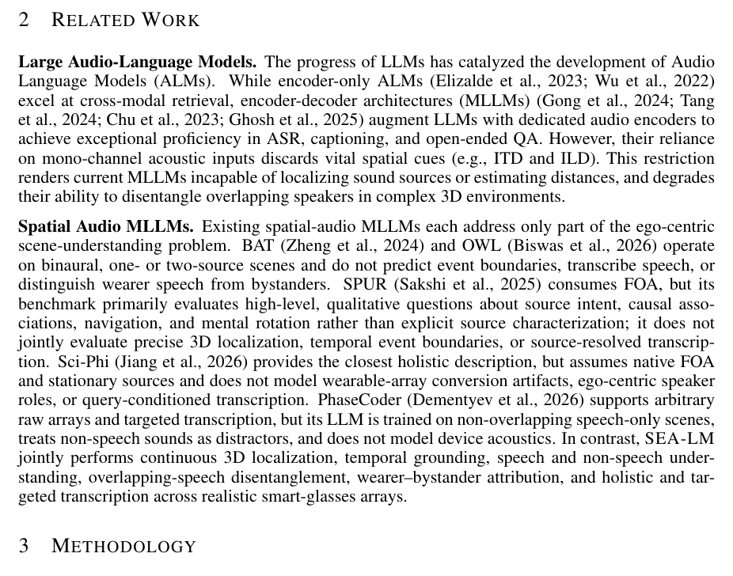

**Why this ranks #3**: A 2x-plus improvement on spatial localization that generalizes across 1,211 array geometries without retraining, which is exactly the constraint wearable deployment imposes.

---

### 4. Mind the Accent Gap: British Accent Robustness in Speech-Driven Financial Voice Assistants

**arXiv**: [2610.06587](https://arxiv.org/abs/2610.06587) | **Score**: 7.2 (relevance 6 x 0.7 + quality 6 x 0.3) | **Tags**: duplex-voice, evaluation | **Categories**: cs.SD, cs.AI, cs.CL | **Pages**: 5

**Authors**: Aadam Haq, Oggi Rudovic, Malcolm Chadwick, Jay Rainey, Shucong Zhang, Ricardo Guerrero, Sourav Bhattacharya, Maja Pantic

**Affiliation**: Within British English

**Abstract**

> AI voice assistants often use Automatic Speech Recognition (ASR) with LLM-based reasoning, yet existing systems struggle with regional British accents, including Scottish, Irish, and Welsh accents, since most ASR models are trained predominantly on American English voice data. Consequently, errors can carry through to the LLM stage, corrupting tool-call arguments and producing wrong or missing responses, which is especially costly in finance. Deployable ASR must also meet tight latency and memory budgets, making an accent-robust model choice even harder. We introduce CavaBench, the first internally collected benchmark of spoken financial queries, and use it to evaluate a range of ASR models and their end-to-end ASR-LLM pipeline behaviour across self-reported British accents. We find that WER strongly predicts downstream tool-calling accuracy ($r = -0.93$) but can fail to reflect task-level performance, with accent-related failures varying substantially across models and acoustic conditions. These findings guide the design of more inclusive, reliable voice-based financial assistants.

**Key findings**

- **Finding**: Measures accent robustness in speech-driven financial voice assistants and shows that ASR trained predominantly on American English carries errors through to the LLM reasoning stage for Scottish, Irish and Welsh accents - the failure is in the cascade, not only the recognizer.

- **Finding**: The setting is deliberately production-realistic (NatWest, UK) and the diagnostic is that regional British accents degrade a deployed voice assistant, which is a deployment fact rather than a benchmark artifact.

- **Recommendation**: Read this if you ship a voice assistant outside the US. The cascade framing - ASR errors propagating into LLM reasoning - is the part to carry into your own evaluation.

**Key figures**

*Results / analysis - Fig. 2. Word Error Rate (%) by condition group, per model, averaged over the 4 CavaBench accent groups.*

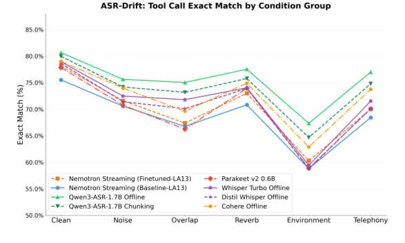

**Why this ranks #4**: An industry-produced measurement of the accent gap in a real deployed assistant, where the error cascade from ASR into LLM reasoning is the actual failure mode.

---

### 5. Transferable Adversarial Robustness for Speech Foundation Models via Hierarchical Stabilization

**arXiv**: [2610.05310](https://arxiv.org/abs/2610.05310) | **Score**: 7.9 (relevance 7 x 0.7 + quality 7 x 0.3) | **Tags**: audio-LM, safety | **Categories**: eess.AS, cs.LG | **Pages**: 5

**Authors**: Aref Mousavi, Shahab Sherafat, Kiarash Kiani Feriz, Amirparsa Safari, Raoof Zare Moayedi, Mohammad Hossein Rohban, Mohammad Sabokrou

**Affiliation**: Sharif University of Technology | University of Tehran | New Uzbekistan University | Okinawa Institute of Science and Technology

**Abstract**

> Frozen speech foundation models (SFMs) make downstream adaptation efficient: the backbone can stay fixed while a task learns layer fusion and a lightweight classifier. Full adversarial fine-tuning is a standard route to robustness, but generating adversarial examples and updating the backbone for every task sacrifices that efficiency. We ask whether robustness can instead be learned before future tasks are known. For a frozen backbone and linear classifier, robustness can be understood through the interaction between representation stability and decision-boundary margin. This leads directly to our design: we stabilize representations across the hidden layers, rather than only the final layer, while preserving clean representations; after clean adaptation selects the layer mixture, we keep it fixed and enlarge only the classifier margin, without downstream adversarial examples. We evaluate Wav2Vec2, HuBERT, and WavLM Large on four tasks under adaptive 30 dB attacks. Across 12 backbone-task pairs, hierarchical robustification improves robust accuracy by 46.4 pp, while margin refinement adds 4.0 pp for 1.1 pp of clean accuracy. Code and configurations are available at https://github.com/arefmousavi/hierarchical-robust-sfm.

**Key findings**

- **Finding**: Shows robustness against adversarial audio can be learned *before* future downstream tasks are known: across 12 backbone-task pairs on Wav2Vec2, HuBERT and WavLM Large under adaptive 30 dB attacks, hierarchical robustification improves robust accuracy by 46.4 percentage points.

- **Finding**: The mechanism follows a sufficient condition - prediction survives when adversarial representation movement stays inside the classifier margin - so representations are stabilized across hidden layers rather than only at the output, and a second stage then enlarges only the classifier margin for a further 4.0 pp at a cost of 1.1 pp clean accuracy.

- **Finding**: Margin refinement needs no downstream adversarial examples at all, and the fusion is fixed first so the margin objective changes decision geometry without disturbing the representation clean adaptation selected. Code and configurations are released.

- **Recommendation**: Read this if you fine-tune frozen speech backbones and want robustness without per-task adversarial training.

**Key figures**

*Framework / architecture - Fig. 1. Overview of the proposed framework. STAGE 1 robustifies representations across hidden layers before downstream tasks are known, while preserving clean representations. Clean adaptation then learns task-specific convex layer fusion and a linear classifier with the robust backbone frozen. STAGE 2 fixes the backbone and fusion and re*

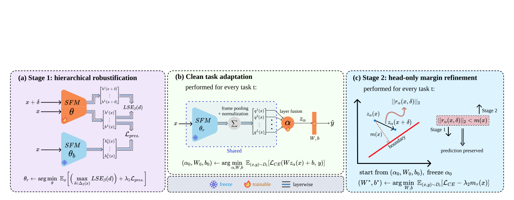

*Framework / architecture - Fig. 2. Primary-backbone diagnostics on the IC task. (a) Layer-wise representation drift under terminal-layer, mean all-layer, and STAGE 1 stabilization. (b) Robust accuracy across 24–36 dB SNR budgets.*

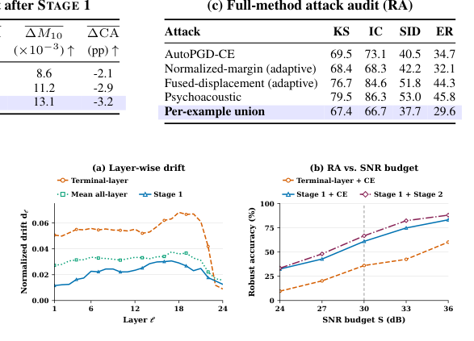

**Why this ranks #5**: 46.4 pp of robust accuracy from one task-agnostic pre-adaptation pass, which changes the cost model for robust speech fine-tuning from per-task to once.

---

### 6. UltraM2M: Leveraging Text Transcripts and Mixture Constraints for Weakly-Supervised Speech Enhancement `[wild-card]`

**arXiv**: [2610.05155](https://arxiv.org/abs/2610.05155) | **Score**: 6.9 (relevance 5 x 0.7 + quality 6 x 0.3) | **Tags**: audio-LM | **Categories**: eess.AS | **Pages**: 5

**Authors**: Liu, Jiachen, Wu, Fulin, Wang, Zhong-Qiu

**Affiliation**: Southern University of Science and Technology, Shenzhen, China

**Abstract**

> We propose UltraM2M, a weakly-supervised speech enhancement algorithm building upon the recent unsupervised mixture-to-mixture (M2M) algorithm. M2M realizes unsupervised speech enhancement by training deep neural networks on a set of real-recorded noisy-reverberant multi-channel mixture signals to estimate target speech and non-target signals. The two estimated signals are penalized by a so-called mixture-constraint (MC) loss, which constrains them to reconstruct the observed mixture signals. Although shown to be effective, the mixture constraint may be too weak to enable sufficient noise reduction. To deal with this, UltraM2M extends M2M by further leveraging text transcripts of real-recorded mixtures to design an automatic speech recognition (ASR) loss to penalize the estimated speech signal. The ASR loss can be viewed as a form of weak supervision that could help unsupervised enhancement. Evaluation results on the CHiME-4 dataset show the effectiveness of UltraM2M.

**Key findings**

- **Finding**: UltraM2M extends the unsupervised mixture-to-mixture speech enhancement idea with two weak-supervision signals - text transcripts and mixture constraints - so target speech need not be perfectly separated.

- **Finding**: Building on M2M, which already trains on real-recorded noisy-reverberant mixtures without clean targets, the added constraints are the practical part: they are what you can actually obtain.

- **Recommendation**: Read this if you need speech enhancement without clean paired data. The mixture-constraint formulation is the reusable idea.

**Key figures**

*Framework / architecture - Fig. 1: Overview of UltraM2M training. (A) supervised training on simulated mixtures; and (B) M2M training with ASR loss on real-recorded mixtures.*

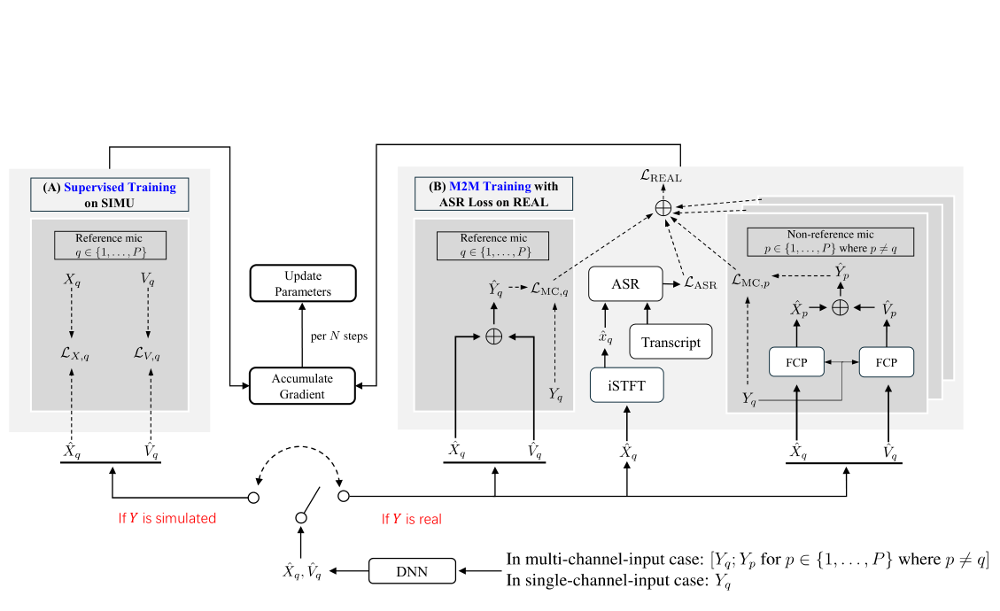

*Framework / architecture - Fig. 3: Enhancement results of an example CHiME-4 mixture: (a) Unpro- cessed mixture; (b) SuperM2M; (c) UltraM2M-Whis and (d) Supervised.*

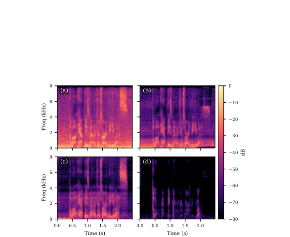

**Why this ranks #6**: Weakly-supervised extension of a well-known unsupervised baseline, included for the formulation rather than for a benchmark win.

---

### 7. Character Identity is not Speaker Identity: KyaraBench and KyaraEmbed for Character Verification `[wild-card]`

**arXiv**: [2610.06013](https://arxiv.org/abs/2610.06013) | **Score**: 6.9 (relevance 5 x 0.7 + quality 6 x 0.3) | **Tags**: audio-LM, evaluation | **Categories**: eess.AS, cs.SD | **Pages**: 5

**Authors**: Joonyong Park, Jerry Li

**Affiliation**: Spellbrush (CA, USA)

**Abstract**

> A dubbed character keeps its identity while the voice actor changes, so character identity and speaker identity are distinct properties of one recording, yet speaker verification measures only the latter. To address this gap, we propose KyaraBench, a benchmark that scores character voice directly instead of speaker voice, built from 85 human-audited identities in a dubbed anime corpus. It poses two challenging conditions: one that swaps the performer under a fixed character, and one that fixes the performer under changing characters. Listening studies with 78 participants provide human reference scores for cross-performer verification and same-actor discrimination. Speaker-verification baselines show increased errors under these character-specific conditions. We then train KyaraEmbed, a compact encoder using multilingual character supervision, same-actor negatives, and a language-alignment term. The model achieves the best performance on all character-specific conditions in the main comparison. We release the benchmark, protocol, and encoder publicly.

**Key findings**

- **Finding**: Separates character identity from speaker identity - a dubbed character keeps its identity while the voice actor changes, so speaker verification measures only one of the two properties that actually matter for verification in dubbed or synthetic media.

- **Finding**: KyaraBench scores character voice directly instead of speaker voice, and KyaraEmbed is the compact audio encoder built for it, so the benchmark and the representation are designed together rather than retrofitting an embedding onto a borrowed protocol.

- **Recommendation**: Read this if you verify voices in dubbed, re-voiced or synthetic content. The distinction generalizes to any setting where voice and identity come apart.

**Key figures**

*Results / analysis - Fig. 1. Two cases of the speaker–character confusion. A dub changes the performer under a fixed character (left: answer same), while one actor voices different characters in two shows (right: an- swer different).*

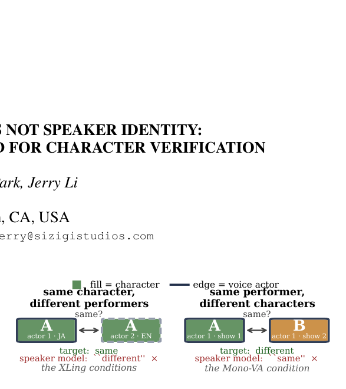

*Results / analysis - Fig. 2. MONO vs. XLING EER for 31 fine-tuned configurations from our ablations (grey), the domain fine-tuned model, the speaker- verification baselines, and our model. The dashed line shows the empirical Pareto frontier among the configurations plotted.*

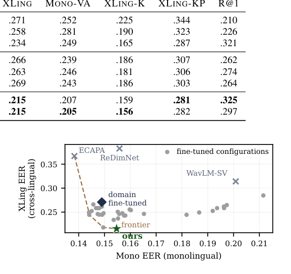

**Why this ranks #7**: A verification task where the obvious formulation is measuring the wrong property - character identity survives speaker change, and every speaker-verification metric misses that.

---

### 8. Revisiting Label-Free Speaker Embedding Enhancement with vMF Profile Likelihood `[wild-card]`

**arXiv**: [2610.06691](https://arxiv.org/abs/2610.06691) | **Score**: 6.5 (relevance 5 x 0.7 + quality 6 x 0.3) | **Tags**: audio-LM | **Categories**: cs.SD, cs.LG | **Pages**: 5

**Authors**: Seunghwan Kim, Jinyong Kim, Sooyoung Yang, Youngjin Ko, Myungjoo Kang

**Affiliation**: Seoul National University (Interdisciplinary Program in AI; Dept. of Mathematical Sciences)

**Abstract**

> Embedding enhancement improves speaker verification under acoustic mismatch without modifying a frozen backbone. Recent work has established a practical label-free setting for this task, but often adopts increasingly structured formulations. Here, the clean target is directly observed during training, making enhancement a matching problem on the unit hypersphere. We model the clean target with a von Mises--Fisher (vMF) likelihood and profile out a sample-wise concentration parameter, yielding a simple closed-form objective with adaptive weighting. Across VoxCeleb1, VoxSRC23, CN-Celeb, VOiCES, and VC-Mix, the proposed method largely preserves the baseline and gives clearer gains on challenging mismatch sets. It also remains stable under a broad single-view recipe, where a recent diffusion baseline becomes less reliable in controlled comparisons. These results suggest that effective label-free embedding enhancement in this setting does not require a highly structured formulation.

**Key findings**

- **Finding**: Shows that for label-free speaker embedding enhancement with a frozen backbone, a simple direct matching objective on the unit hypersphere is already competitive - modelling the clean target with a von Mises-Fisher likelihood and profiling out a sample-wise concentration parameter yields a closed-form loss with adaptive reweighting.

- **Finding**: The useful property is that pairs with larger residuals receive smaller updates, which matters when acoustic corruption severity is unpredictable across heterogeneous data. Across two frozen backbones and seven evaluation sets the method largely preserves the baseline with clearer gains on the hard mismatch sets (CN-Celeb, VOiCES, VC-Mix).

- **Finding**: Under a broad single-view recipe it remains stable where a recent diffusion baseline becomes unreliable in controlled comparisons - a direct argument against added formulation complexity in this setting.

- **Recommendation**: Read this if you are doing speaker embedding enhancement and have been assuming you need a more structured formulation.

**Key figures**

*Framework / architecture - Figure 1: Task overview and geometric intuition of the proposed vMF-PL objective. (a) An unaugmented utterance a and its acous- tically degraded variants ˜a are encoded by a frozen speaker embedding extractor g(·), producing a clean embedding xc and variant embeddings xn,i. The blue marker denotes xc, and the remaining colors consistently*

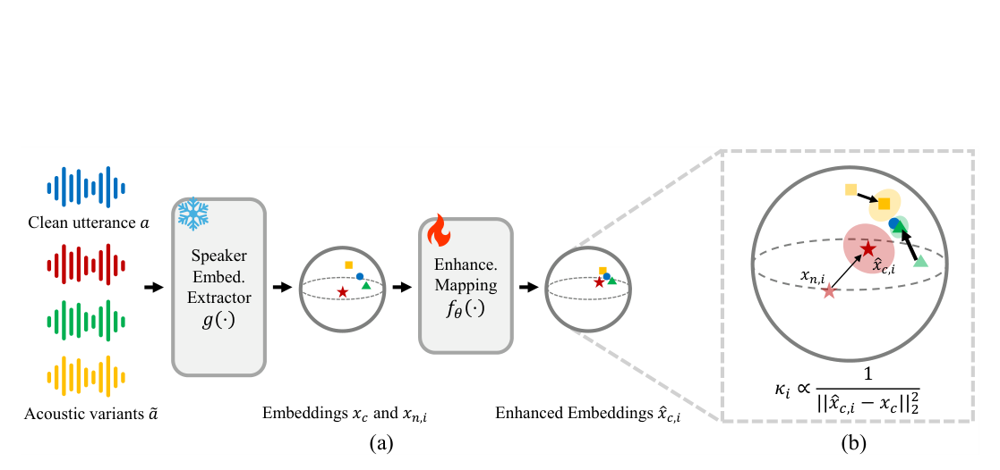

**Why this ranks #8**: A useful negative result about formulation complexity, with the vMF derivation specific enough to implement directly.

---

### 9. Revisiting Frame-Wise Saliency for Audio Moment Retrieval `[wild-card]`

**arXiv**: [2610.05737](https://arxiv.org/abs/2610.05737) | **Score**: 6.4 (relevance 4 x 0.7 + quality 6 x 0.3) | **Tags**: audio-LM | **Categories**: eess.AS, cs.MM, cs.SD | **Pages**: 5

**Authors**: Tatsuya Munakata, Hokuto Munakata

**Affiliation**: LY Corporation, Tokyo, Japan

**Abstract**

> This paper revisits frame-wise saliency for audio moment retrieval (AMR). We show that the frame-wise saliency sequence, conventionally used only as an auxiliary output in DETR-based AMR models, can itself serve as an effective source of moment predictions. We convert the saliency sequence into ranked moments using a simple SED-inspired segmentation rule with no learned parameters, enabling moment retrieval directly from frame-wise temporal information. On the CASTELLA dataset, saliency-based prediction consistently outperforms decoder-based prediction from the same model across all 18 runs of QD-DETR and CG-DETR. For QD-DETR, simply replacing the inference output improves R1@0.7 from 21.0 to 36.1. The advantage remains 7-15 points when the two outputs are evaluated at their independently selected best epochs. The same tendency extends to TaskWeave and UVCOM, whereas TR-DETR shows the opposite behavior, suggesting that how saliency construction may matter. The performance gap is especially pronounced for short moments: for queries whose annotated moments average at most 2 s, R1@0.7 improves from 6.3 to 27.8 with QD-DETR. Decoder supervision nevertheless benefits saliency-based prediction, indicating that its role during training differs from the utility of its inference output.

**Key findings**

- **Finding**: Shows the frame-wise saliency sequence - conventionally only an auxiliary output in DETR-based audio moment retrieval - can itself be the prediction source, converted to ranked moments by a parameter-free SED-inspired segmentation rule.

- **Finding**: On CASTELLA, saliency-based prediction beats decoder-based prediction from the same model across all 18 runs of QD-DETR and CG-DETR; for QD-DETR simply swapping the inference output improves R1@0.7 from 21.0 to 36.1, and for queries whose annotated moments average at most 2 s, from 6.3 to 27.8.

- **Finding**: Decoder supervision still *helps* saliency-based prediction, so its role during training differs from the utility of its inference output - a distinction worth keeping if you train these models.

- **Recommendation**: Read this if you train DETR-style audio retrieval models. Free accuracy from an output you already compute.

**Key figures**

*Results / analysis - Fig. 1. Example from CG-DETR (λ = 8, seed 2023) on CASTELLA test, cropped to 129–168 s. Top: raw saliency scores rj and annotated moments. Bottom: the five highest-ranked predic- tions of each output.*

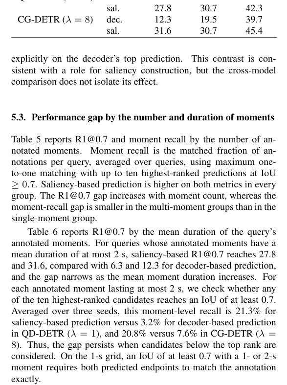

**Why this ranks #9**: A free 15-point R1 gain by reading an output the model already produces, plus the observation that decoder supervision and decoder inference value diverge.

---

### 10. AraYoungVoices: A Diverse L1/L2 Corpus of Arabic Child and Adolescent Speech `[wild-card]`

**arXiv**: [2610.05044](https://arxiv.org/abs/2610.05044) | **Score**: 6.0 (relevance 4 x 0.7 + quality 5 x 0.3) | **Tags**: audio-LM, dataset | **Categories**: cs.CL, cs.AI, cs.SD | **Pages**: 6

**Authors**: Shammur Absar Chowdhury, Zien Sheikh Ali, Houssam Eddine-Othman Lachemat, Hamdy Mubarak

**Affiliation**: Qatar Computing Research Institute, Qatar

**Abstract**

> State-of-the-art ASR systems primarily target native adult speech, leading to substantial performance gaps for children, adolescents, and L2 speakers. We introduce AraYoungVoices, a 151.72-hour Arabic read-speech corpus from 286 speakers aged 7--18, comprising AraKids (7--12) and AraTeens (13--18). The corpus includes 146 native Arabic (L1) and 140 second-language (L2) speakers, with native speakers spanning Egyptian, Gulf, Levantine, and North African dialectal backgrounds and L2 speakers representing diverse linguistic backgrounds across the Americas, Asia, Africa, and Europe. We benchmark four pretrained ASR models under zero-shot and fine-tuned settings using unseen-speaker-$\&$-unseen-prompt (USUP) and unseen-speaker-$\&$-seen-prompt (USSP) evaluations. Results show that L2 speech remains substantially more challenging than L1 speech, with the largest errors observed mainly for younger L2 speakers. Age-specific fine-tuning improves the matched age group, while joint fine-tuning provides a stronger balance across populations. ASR hypotheses are also consistently closer to the standard reading prompt than to the verbatim transcription, particularly for L2 speech, suggesting partial normalization of reading deviations.

**Key findings**

- **Finding**: Releases AraYoungVoices, a 151.72-hour Arabic read-speech corpus of 86,471 utterances from 286 speakers aged 7-18, split into AraKids (7-12) and AraTeens (13-18), with 146 L1 and 140 L2 speakers spanning Egyptian, Gulf, Levantine and North African dialects.

- **Finding**: Four pretrained ASR models are benchmarked under unseen-speaker-unseen-prompt and unseen-speaker-seen-prompt conditions. L2 speech remains substantially harder than L1, with the largest errors in younger L2 speakers; age-specific fine-tuning helps the matched age group while joint fine-tuning balances better across populations.

- **Finding**: ASR hypotheses sit consistently closer to the standard reading prompt than to the verbatim transcription, especially for L2 speech - evidence of partial normalization of reading deviations that would otherwise be scored as errors.

- **Recommendation**: Read this if you build ASR for children or second-language speakers. The prompt-vs-transcription normalization effect will change how you score your own data.

**Key figures**

*Framework / architecture - Fig. 1: Overview of ARAYOUNGVOICES. Avg. Len.: average prompt length in words.*

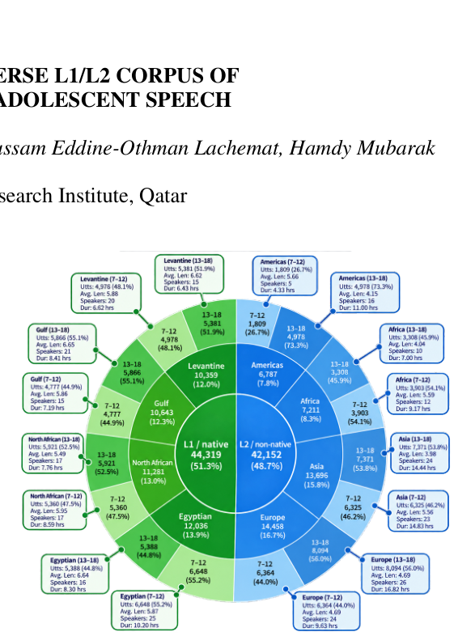

*Results / analysis - Fig. 2: Speaker characteristics in ARAYOUNGVOICES.*

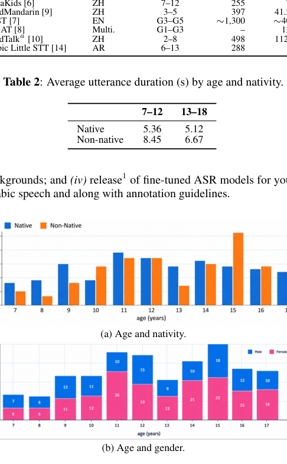

**Why this ranks #10**: A 151.72-hour corpus that fills a real demographic gap in Arabic ASR, with the prompt-vs-transcription scoring artifact flagged explicitly - which is a trap for anyone building similar benchmarks.

---

## Footer

- Total papers scanned across all 7 arXiv categories: **879**
- Papers read in full for this digest: **87**
- audio_lm track final top-10: **10**
- Wild-cards in this track: **5**
- Figure assets: `res/` (48 images shared across all 5 tracks)

Generated by the `mine-arxiv-daily-digest` skill. Sister file: `2026-10-06_audio_lm_entry.md`.
