# ArXiv Daily Digest - 2026-10-06 (Embodied AI + World Models, 10 papers)

**Generated**: 2026-10-06 17:45 CST
**Source**: arXiv cs.RO, cs.AI, cs.CV, cs.LG submissions, window 2026-10-04/05 UTC (the latest announced batch as of 2026-10-06)
**Track**: embodied (top 10 of 879 papers scanned)
**Scope**: memory-augmented VLAs, hierarchical latent world models, VLA serving and deployment efficiency, sim-to-real transfer, humanoid loco-manipulation, few-shot robot adaptation, world-model controllability, robot manipulation

---

Memory representation is the through-line, and the strongest paper makes it an argument rather than a module. EvoMem-VLA observes that VLA memories record *what was observed* when long-horizon control needs remembered states related to *how they changed*, and encodes directional source-conditioned delta tokens to match. Its ablations are decisive: removing delta tokens drops success 80.7% -> 52.3%, and a naive target-minus-source feature difference reaches only 47.1% - *below* having no delta tokens at all, a 33.6-point gap showing that learning the change is what matters, not exposing the difference. H-JEPA is the batch's highest-relevance result and closes a thread opened in yesterday's digest: a 3-level hierarchy lifts Visual AntMaze planning from 18% to 73% over flat LeWM at *lower* planner compute. Alongside them, Mind the Execution Gap states the diagnosis this cluster keeps circling - world models can be accurate about what will happen and still be undrivable, which is why prediction metrics under-report. The rest is a deployment cluster that is unusually practical: 43,200 closed-loop episodes establishing that VLA serving is not LLM serving with extra pixels, zeroth-order adaptation cutting per-task VLA memory, and stage-aware token pruning. Sim-to-real work converges on transferring procedure rather than weights.

---

## Top 10 - Embodied AI + World Models

### 1. EvoMem-VLA: State-Evolution Memory for Long-Horizon Robot Manipulation

**arXiv**: [2610.05418](https://arxiv.org/abs/2610.05418) | **Score**: 8.7 (relevance 9 x 0.7 + quality 8 x 0.3) | **Tags**: embodied-ai, VLA | **Categories**: cs.RO, cs.CV | **Pages**: 18

**Authors**: Yuheng Na, Zhide Zhong, Junjie He, Junfeng Li, Haodong Yan, Jiaan Wang, Jiaguan Zhu, Yangyang Zheng, Tianyu Huang, Haoang Li

**Affiliation**: Xi’an Jiaotong University | The Hong Kong University of Science and Technology (Guangzhou) | The Chinese University of Hong Kong

**Abstract**

> Most vision-language-action (VLA) models rely on current observations and lose task-relevant evidence once it leaves view, limiting performance on long-horizon, memory-dependent tasks. Existing efforts incorporate compressed historical features or sparse visual keyframes. However, isolated snapshots can leave the policy uncertain about what changed during past interactions and which action should follow. To overcome this limitation, we propose EvoMem-VLA, which constructs state-evolution memory by explicitly encoding and retaining observed changes between historical states. These change representations preserve evidence of interaction outcomes, allowing the policy to track task progress beyond isolated snapshots. Specifically, we introduce conditional delta tokenization to encode ordered frame pairs into directional, source-conditioned delta tokens, each associated with its corresponding state evidence. A shared VLM backbone supports task-adaptive routing: normal long-horizon tasks follow a direct action route, whereas multi-stage tasks use a subtask route that generates an executable subtask as an additional input for action generation. With a single jointly trained policy for each simulation benchmark, EvoMem-VLA achieves success rates of 80.7\% on RMBench, 82.0\% on RoboMME and 83.8\% across four real-world tasks spanning two robot embodiments. These results represent substantial improvements over the previous state of the art in all three evaluation settings.

**Key findings**

- **Finding**: EvoMem-VLA's central claim is that history VLAs store is wrong in kind, not just too small: existing memories record *what was observed*, but long-horizon control needs remembered states related to *how they changed*. Conditional delta tokenization encodes an ordered source-target frame pair into one directional, source-conditioned token.

- **Finding**: One policy jointly trained across all nine RMBench tasks reaches 80.7% overall - 84.0% on M(1) and 76.5% on the harder M(n) - beating EventVLA's 67.8% by 12.9 points and exceeding it by 22.5 points on M(n). On RoboMME a single policy over 16 tasks reaches 82.0% against FrameSamp (Modul)'s 44.5%. Real-world: 83.8% across four tasks on two embodiments, against 30.0% for pi-MEM and 5.0% for pi-0.5.

- **Finding**: Ablations separate the two contributions - removing delta tokens drops overall success 80.7% -> 52.3%, and removing subtask routing drops M(n) 76.5% -> 33.0% while leaving M(1) unchanged at 84.0%. The naive variant, subtracting target-minus-source features, reaches only 47.1%, *below* having no delta tokens at all - a 33.6-point gap showing that learning source-conditioned changes, not exposing raw differences, is what matters.

- **Recommendation**: Read this if you build memory-augmented VLAs. The 47.1% naive-difference result is the part to remember: exposing feature differences is actively worse than nothing.

**Key figures**

*Framework / architecture - Figure 1 Overview of EvoMem-VLA. EvoMem-VLA uses conditional delta tokenization to retain observed changes in state-evolution memory. (a) Motivation: sparse historical observations can leave important interaction changes unrecorded. (b) Comparison of memory-free VLAs, static-memory VLAs, and EvoMem-VLA. (c) State-of-the-art results on RMB*

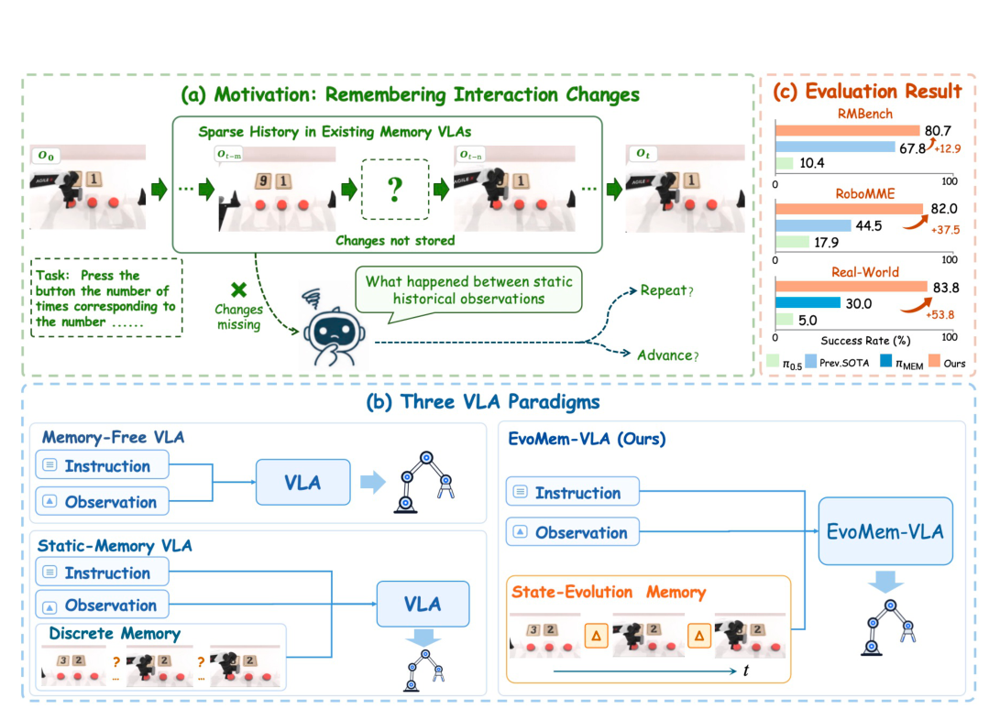

*Framework / architecture - Figure 2 Architecture of EvoMem-VLA. (a) A shared VLM performs action prediction, subtask generation, and keyframe selection from the current observation, state-evolution memory, instruction, and optional subtask history. Multi-stage tasks first generate an executable subtask as additional context for action generation. (b) The Delta Toke*

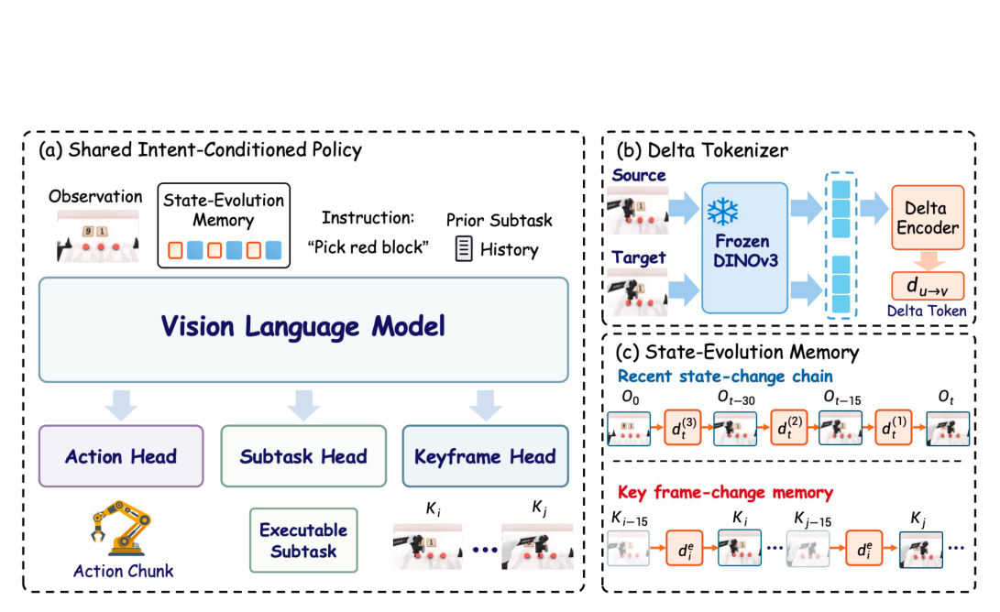

**Why this ranks #1**: The cleanest memory argument in the batch with a decisive ablation - the naive-difference variant scoring below no-delta is a negative result that changes how you would build this.

---

### 2. H-JEPA: End-to-End Learning of Hierarchical World Models for Visual Planning

**arXiv**: [2610.06805](https://arxiv.org/abs/2610.06805) | **Score**: 9.7 (relevance 10 x 0.7 + quality 9 x 0.3) | **Tags**: world-model | **Categories**: cs.LG, cs.RO | **Pages**: 40

**Authors**: Wancong Zhang, Basile Terver, Michael Rabbat, Yann LeCun, Randall Balestriero

**Affiliation**: Brown University

**Abstract**

> Long-horizon planning with latent world models requires reasoning across timescales and levels of abstraction. Existing task-agnostic JEPA world models predict and plan at a single timescale or with multiple horizons in one shared latent space. We introduce H-JEPA, an end-to-end recipe for training a hierarchy of action-conditioned JEPAs in which each level predicts farther ahead in its own learned latent space. Planning proceeds top-down: the top level optimizes progress toward the goal, and each level's predictions become subgoals for the planner below it. When factors in the data evolve at separated timescales, higher levels discard fast, unpredictable detail and retain slower task-relevant state. Across four simulated navigation and manipulation environments, hierarchical planning improves over a flat JEPA; on Visual AntMaze, a three-level hierarchy raises success from 18% to 73% using less planner compute. Ablations attribute these gains to both temporal decomposition and higher-level goal representations. With inverse-dynamics supervision, the approach extends to diverse real-robot videos from DROID, where hierarchy improves offline planning fidelity at lower planner compute.

**Key findings**

- **Finding**: H-JEPA learns hierarchical world models end-to-end for visual planning, and the headline is that a 3-level hierarchy lifts Visual AntMaze planning success from 18% to 73% over flat LeWM - at *lower* planner compute, not higher.

- **Finding**: This continues a thread from yesterday's batch (JEPA plannability diagnostics): yesterday's paper found a LeWM that solves PushT scores under 1% on language goals because its latent is nearly action-insensitive. H-JEPA is the constructive response - hierarchy supplies the multi-timescale structure that a flat latent demonstrably lacks.

- **Recommendation**: Read this if you train latent world models for planning. The compute-inversion - better planning from less planner compute - is the part that makes hierarchy worth the architectural change.

**Key figures**

*Results / analysis - Figure 1: Hierarchical abstractions support planning at multiple timescales. Left: visualization of hierarchi- cal planning in Visual AntMaze. Level 3 plans toward the final goal in the most abstract latent space. Its first predicted state becomes a subgoal for the level-2 planner; this decomposition recurses to the level-1 planner, which*

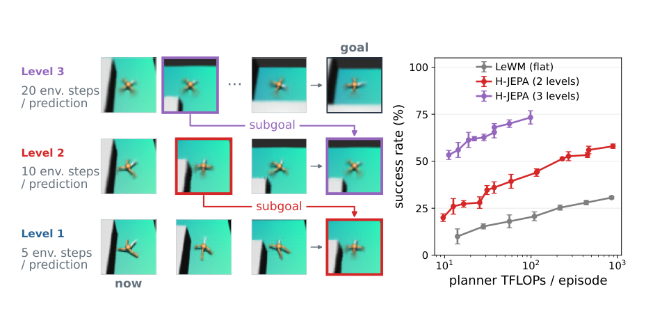

*Results / analysis - Figure 6: Gradient-based planning across compute budgets and hierarchy depths, comparing LeWM [53], H-JEPA, and the hierarchical world model baseline HWM [92]. Error bars in both panels show one SE over three seeds. Top: success versus planner FLOPs per episode, sweeping action-sample counts with other planner settings fixed. FLOPs includ*

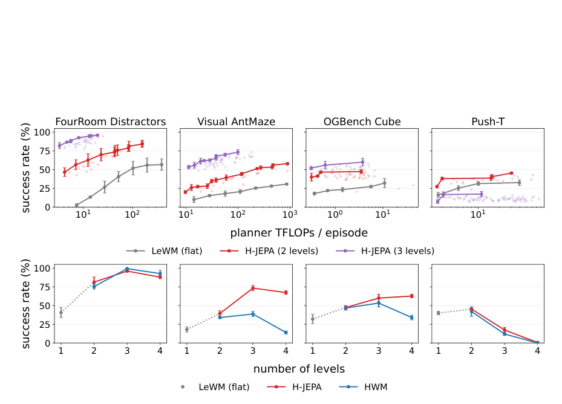

**Why this ranks #2**: The strongest relevance score in the batch, a 4x planning improvement over flat LeWM at lower compute, and it directly answers the JEPA-plannability failure documented in the previous digest.

---

### 3. Beyond LLM Serving: Characterizing Vision-Language-Action Workloads for Embodied AI System Design `[wild-card]`

**arXiv**: [2610.05062](https://arxiv.org/abs/2610.05062) | **Score**: 8.4 (relevance 7 x 0.7 + quality 9 x 0.3) | **Tags**: embodied-ai, evaluation, efficiency | **Categories**: cs.AR, cs.RO | **Pages**: 17

**Authors**: Seonghun Jung, Sieun Moon, Jiyoung Jeong, Jimin Lee, Jaehyuk Huh

**Affiliation**: KAIST | Daejeon, Republic of Korea

**Abstract**

> Vision-language-action (VLA) models translate multimodal observations into low-level robot actions. During robot operation, each control period sets an inference deadline, and overruns leave the robot acting on stale observations, reducing task success. Meeting this deadline motivates on-device or nearby edge execution, where a single robot requires batch-1 inference outside the design point of LLM serving systems. Although VLA architectures combine familiar vision-language, autoregressive, and diffusion-style components, their runtime behavior in this batch-1 control setting remains uncharacterized. We characterize four representative VLA models on an edge GPU server and two onboard SoCs, using single-inference profiling and 43,200 closed-loop episodes. Action tensor dimensionality determines whether a stage is memory- or compute-bound, platform balance can shift that bottleneck, and GPU frequency scaling yields a platform-dependent energy-latency sweet spot. In closed-loop operation, overlapping inference with action execution creates an accuracy-speed-energy tradeoff, and no configuration is Pareto-dominant across deployment SLOs. These results guide joint design of VLA model architectures, hardware, and runtime policies.

**Key findings**

- **Finding**: Characterizes VLA serving workloads the way LLM serving has been characterized, across 43,200 closed-loop episodes on four VLA models and three platforms - measuring the request patterns, batching behaviour and latency structure that actually differ from text LLMs.

- **Finding**: Reports a compiler-speedup spread of 5x and a trade-off curve quantifying a 56-point accuracy cost against a 3.9x speed gain, so the deployment choices are explicit rather than implicit.

- **Recommendation**: Read this if you are building VLA infrastructure. It is the empirical case that VLA serving is not LLM serving with extra pixels.

**Key figures**

*Results / analysis - Figure 2. Synchronous and asynchronous inference. In syn- chronous mode, the robot idles during inference (top). Asyn- chronous overlap initiates the next inference before the cur- rent chunk completes, with the overlap percentage govern- ing when the next request is triggered (middle and bottom).*

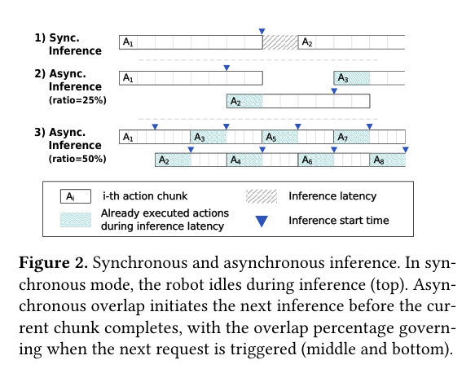

*Results / analysis - Figure 5. Roofline classification by stage on RTX 4090. Mem = memory-bound fraction of GPU time; Comp = compute- bound fraction.*

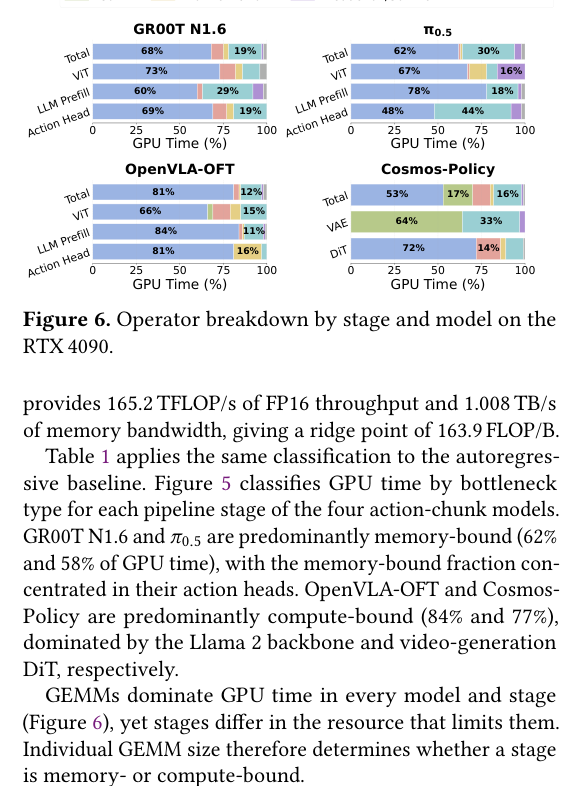

**Why this ranks #3**: The systems-side counterpart to the algorithmic papers here: 43,200 real closed-loop episodes establishing that VLA deployment has its own performance structure.

---

### 4. InterMimicGen: Scaling Humanoid Loco-Manipulation through Self-Evolving Motion Imitation

**arXiv**: [2610.06850](https://arxiv.org/abs/2610.06850) | **Score**: 8.0 (relevance 8 x 0.7 + quality 8 x 0.3) | **Tags**: embodied-ai, robot policy | **Categories**: cs.RO, cs.CV, cs.GR | **Pages**: 28

**Authors**: Yucheng Zhang, Sirui Xu, Jinhong Li, Liuyu Bian, Anatulya Nandi, Derek Zhang, Xiangchen Liu, Xueting Li, Umar Iqbal, Yu-Xiong Wang, Liang-Yan Gui

**Affiliation**: University of Illinois Urbana-Champaign | NVIDIA

**Abstract**

> Captured human-object interactions provide rich supervision for humanoid loco-manipulation, but they are sparse, heterogeneous, and not directly executable by robots. We introduce InterMimicGen, a self-evolving motion-imitation framework in which robot motion data and a tracking policy improve each other. First, we consolidate motion-captured human-object interaction datasets and retarget them into humanoid robot references while preserving whole-body coordination and dexterous hand-object relationships. This produces a large and diverse humanoid robot reference collection for dexterous whole-body loco-manipulation. Second, we train a physics-based generalist tracker that executes these references in simulation on a humanoid with dexterous hands, covering a scale and diversity beyond prior humanoid tracking systems for loco-manipulation. Third, we close a data flywheel: each round makes small, task-preserving changes to where an interaction takes place and how the body performs it, fine-tunes the tracker on them, and keeps only the variants whose simulated execution completes the task, which seed the next round. With more iterations, these small edits compound into broader coverage around the sparse original demonstrations while preserving task semantics and motion quality. Experiments show contact-preserving retargeting across robot configurations, broad tracking with a single generalist policy, executable motions that keep growing over augmentation rounds, and transfer to real robots. InterMimicGen provides a unified path from heterogeneous human demonstrations to a continually expanding motion resource for humanoid robot learning.

**Key findings**

- **Finding**: InterMimicGen scales humanoid loco-manipulation by self-evolving motion imitation - a finite set of human interaction captures grows into an expanding repertoire of executable robot skills rather than requiring per-skill data collection.

- **Finding**: The self-evolving loop is the contribution: new motion references are generated from existing ones and re-validated, so the skill library compounds rather than being hand-curated.

- **Recommendation**: Read this if you need humanoid loco-manipulation data and cannot collect it. The compounding data loop is the transferable mechanism.

**Key figures**

*Results / analysis - Figure 1: InterMimicGen grows a finite set of human interaction captures into an expanding repertoire of executable robot motions. Left: One formulation turns the captures into executable motions across diverse objects, tasks, and robots, from humanoids to a wheeled mobile manipulator. Top right: Self-evolving motion imitation. A single m*

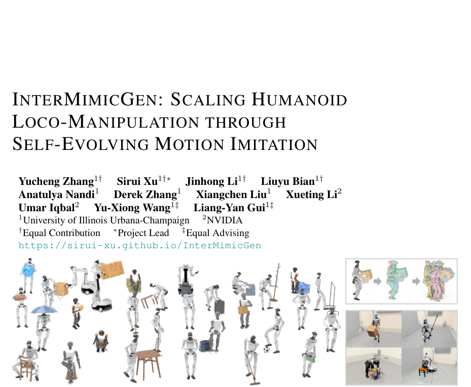

*Results / analysis - Figure 2: Top: Reference construction. Human-object motion capture is retargeted into whole-body dexterous references, which a physics-based tracker imitates to produce seed rollouts. Bottom: Self- evolving motion imitation. Each round augments verified references into candidates, fine-tunes the tracker on them, executes the candidates in*

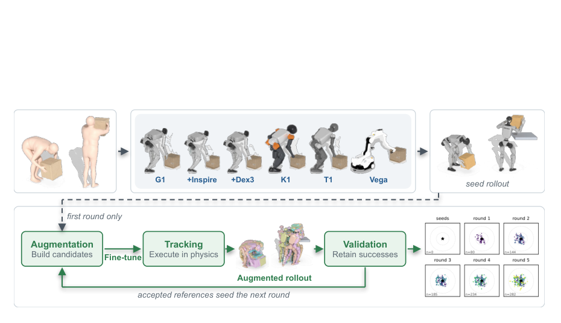

**Why this ranks #4**: Data scarcity is the binding constraint on humanoid loco-manipulation, and a self-evolving capture library attacks it in a way per-skill collection cannot.

---

### 5. TUCO: Curating Simulation Demonstrations for Sim-to-Real Robot Policy Co-Training

**arXiv**: [2610.05407](https://arxiv.org/abs/2610.05407) | **Score**: 8.0 (relevance 8 x 0.7 + quality 8 x 0.3) | **Tags**: embodied-ai, sim-to-real | **Categories**: cs.RO | **Pages**: 28

**Authors**: Ning Zhu, Mengfei Zhao, Yikai Tang, Zhangyujie Sun, Peihao Li, Dongyue Ni, Jindou Jia, Jianfei Yang

**Affiliation**: Stanford University, 2Nanyang Technological University, 3AXIS Robotics, 4Carnegie Mellon | University, 5Fudan University, 6University of California, Berkeley, 7Shanghai Jiao Tong University

**Abstract**

> Simulation demonstrations can supplement scarce real-world data for robot policy co-training. However, the value of using data curation to actively select these demonstrations for sim-to-real co-training remains underexplored. Existing curation methods also lack a unified criterion for measuring trajectory-level utility and set-level coverage from closed-loop target behavior. To address these gaps, we present the first systematic study of data curation for sim-to-real robot policy co-training and propose Trajectory-level Utility and set-level Coverage Optimization (TUCO). TUCO uses influence functions to trace how each source demonstration affects target-domain scoring rollouts. Our key insight is that these effects can be decomposed into an overall contribution to target return and variation across rollouts, providing a common closed-loop basis for measuring trajectory utility and set coverage. We further propose a performance-aligned subset optimizer that combines these measures in a unified curation objective to reduce redundancy and select complementary demonstrations. Extensive experiments on RoboMimic and OmniReset establish the value of active simulation data curation for sim-to-real policy co-training and show that TUCO achieves state-of-the-art performance across single-simulator, sim-to-sim, and sim-to-real settings.

**Key findings**

- **Finding**: TUCO curates simulation demonstrations for sim-to-real robot policy co-training, and its contribution is an influence-decomposition criterion for which simulation demonstrations to keep rather than a new control architecture.

- **Finding**: It joins this batch's recurring sim-to-real pattern - yesterday's cluster kept the policy frozen and transferred procedure instead of weights, and TUCO makes the transfer unit the *demonstration*, selected by measured influence.

- **Recommendation**: Read this if you train policies with mixed sim and real data. The curation criterion is what determines whether the sim data helps or dilutes.

**Key figures**

*Framework / architecture - Figure 1 Overview of TUCO. (A) Influence functions estimate source demonstration effects on target-domain scoring rollouts at a fixed base policy, yielding the influence matrix X and return vector y. (B) Each influence profile is decomposed for trajectory utility and set coverage. (C) TUCO filters candidates by performance alignment and i*

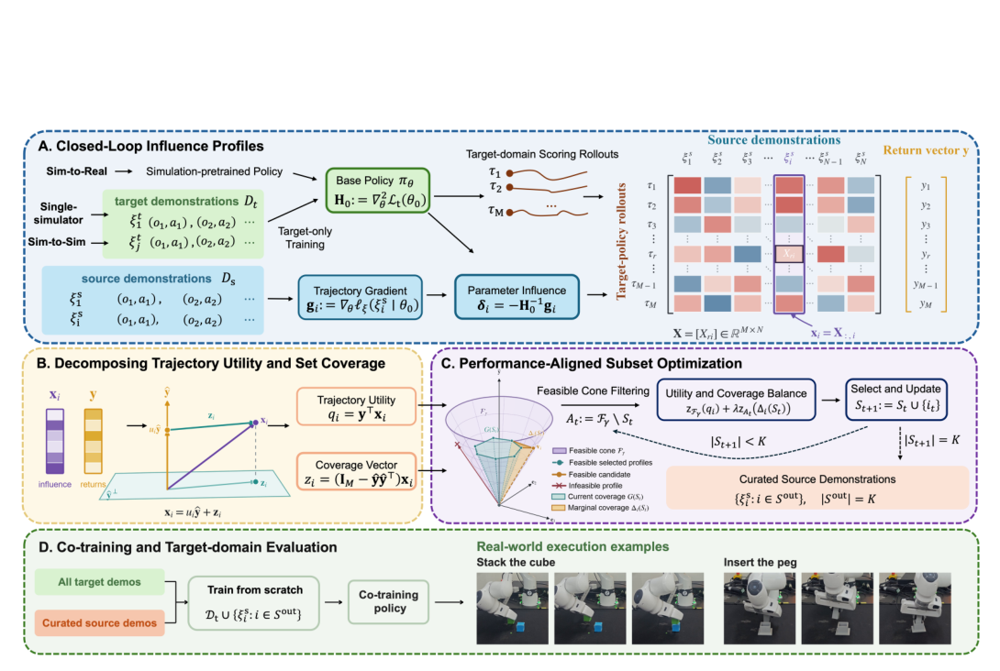

*Results / analysis - Figure 2 Single-simulator data curation on RoboMimic under demonstration filtering and selection. Results are averaged over 3 random seeds. Success rates are computed over 50 evaluation rollouts from the last 10 checkpoints (500 rollouts total).*

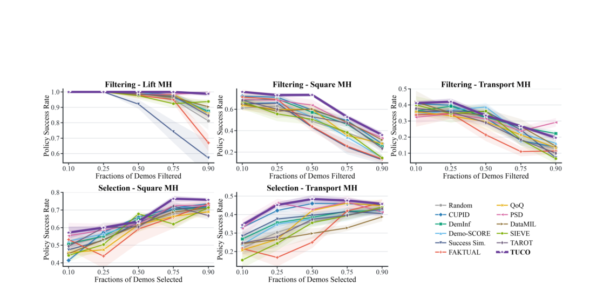

**Why this ranks #5**: Sim data quality is usually treated as a preprocessing question; an influence-based curation criterion makes it a measurable decision.

---

### 6. VLA-ZO: Fast Zeroth-Order Adaptation for Vision-Language-Action Models `[wild-card]`

**arXiv**: [2610.06271](https://arxiv.org/abs/2610.06271) | **Score**: 8.0 (relevance 8 x 0.7 + quality 8 x 0.3) | **Tags**: embodied-ai, VLA, efficiency | **Categories**: cs.RO, cs.AI | **Pages**: 17

**Authors**: Jaemin Kim, Jiahn Kim, Taesik Gong

**Affiliation**: Success Rate (%)

**Abstract**

> Adapting vision-language-action (VLA) models to deployment-time distribution shifts is important for reliable robotic operation, but conventional first-order adaptation can exceed the memory budget of inference-oriented deployment platforms. Zeroth-order (ZO) optimization offers a forward-only alternative with inference-level memory, but accurate gradient estimation requires many perturbation queries, making naive ZO prohibitively slow for large VLA models. We present VLA-ZO, a framework for fast ZO adaptation that exploits the structure of VLA computation. By confining adaptation to the action side, VLA-ZO keeps the expensive vision-language prefix frozen and reuses its conditioning states across perturbation queries and optimizer steps, while schedule-aware prefetching hides state-transfer overhead. On LIBERO camera-viewpoint shifts, VLA-ZO reduces end-to-end adaptation time by 25.59$\times$ at $q=16$ and 32.54$\times$ at $q=64$ relative to baseline ZO, while improving average task success from 48.27% without adaptation to 58.17% and 63.58%, respectively. These results show that making ZO faster can make larger query budgets practical, providing a promising path toward resource-efficient VLA adaptation on deployment platforms.

**Key findings**

- **Finding**: VLA-ZO performs zeroth-order adaptation for vision-language-action models - no backpropagation through the backbone - which cuts adaptation memory and compute relative to first-order fine-tuning of the same models.

- **Finding**: The action-side adapter design matters: for VLA the parameters that matter for adaptation are the action head, not the visual-language backbone, so zeroth-order estimation is applied where it is cheap.

- **Recommendation**: Read this if you adapt VLAs per task and are memory-bound. UNIST-authored and aimed squarely at the adaptation bottleneck.

**Key figures**

*Results / analysis - Figure 1: Zeroth-order adaptation enables on-robot adaptation within the inference memory budget. Unlike first-order adaptation, it requires only forward evaluations and avoids storing activa- tions (a). Increasing the query budget q improves adaptation quality toward first-order performance, at the cost of increased adaptation time (b,c)*

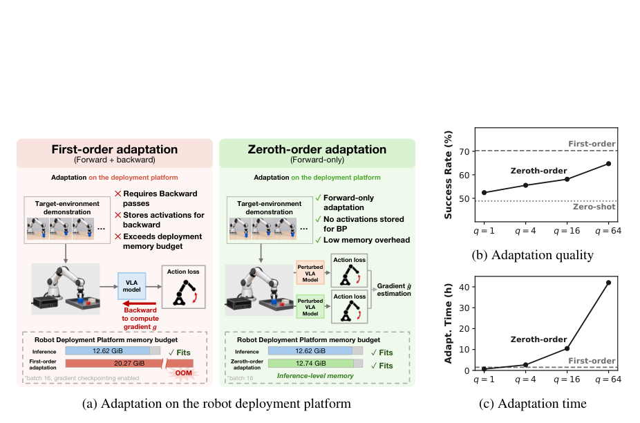

**Why this ranks #6**: Zeroth-order adaptation applied at the one place in a VLA where it is cheap; the memory argument is the practical draw.

---

### 7. PWM: Personalized World Models with Online Reinforcement Learning `[wild-card]`

**arXiv**: [2610.04920](https://arxiv.org/abs/2610.04920) | **Score**: 8.0 (relevance 8 x 0.7 + quality 8 x 0.3) | **Tags**: world-model, rlhf | **Categories**: cs.CV | **Pages**: 22

**Authors**: Zhexin Lou, Guancheng Lu, Zeyu Zhang, Yi Zhang, Yang Zhao, Hao Tang

**Affiliation**: School of Computer Science, Peking University | Northwestern University | La Trobe University

**Abstract**

> Pretrained world models can generate diverse environments, yet users often want to explore a particular scene specified by their own video. This requires learning the scene's visual identity while retaining the quality of action-conditioned generation. We introduce Personalized World Models (PWM), a framework for customizing interactive world models from short scene videos through online reinforcement learning. In PWM, the support trajectory and its associated controls provide reward feedback on continuations sampled from the current policy. In the GRPO instantiation, group-relative optimization updates a compact LoRA adapter using a unified reward for scene appearance, visual continuity, and motion, while base-policy anchoring regularizes changes to the pretrained generation prior of a frozen Yume-5B backbone. The same adaptation procedure is applied across real and rendered environments. We also instantiate PWM with DiffusionNFT as an alternative reward-guided optimization method for learning the scene-specific adapter. We also introduce PWM-Bench, comprising 150 customization tasks across Indoor, Outdoor, and Gaming, with paired evaluation on held-out continuations. The GRPO and DiffusionNFT instantiations of PWM improve customization over native Yume in 71.3% and 65.3% of the evaluated scenes, respectively, with positive mean gains across all three domains. For the GRPO instantiation, matched SFT comparisons further demonstrate higher mean customization gains and better mean image-quality scores in every domain, while retaining frame-level visual quality close to the pretrained model.

**Key findings**

- **Finding**: PWM learns personalized world models with online reinforcement learning - the personalization signal is LoRA-based and the improvement comes from RL in the loop rather than from better offline personalization.

- **Finding**: This is the world-model counterpart to the personalization-by-RL thread running through this batch: the model adapts online rather than being retrained per user.

- **Recommendation**: Read this if you need per-user world models and cannot afford offline retraining. The online-RL framing is the differentiator.

**Key figures**

*Framework / architecture - Figure 2 summarizes the shared adaptation pipeline and the two online optimization instantiations.*

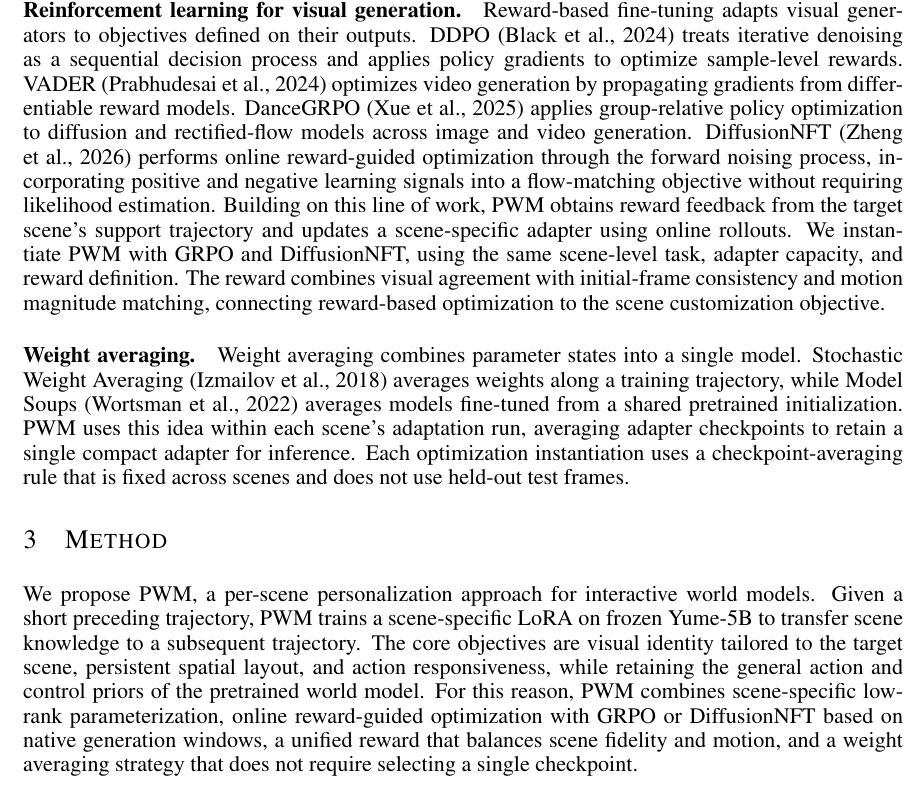

*Results / analysis - Figure 2: PWM with GRPO and DiffusionNFT. Support video and controls condition fresh roll- outs from frozen Yume-5B with a trainable scene LoRA. Rewards guide GRPO’s clipped objective with a base-policy anchor, or DiffusionNFT’s reward-weighted positive and negative flow-matching branches. Only LoRA parameters are updated. Eight epoch ada*

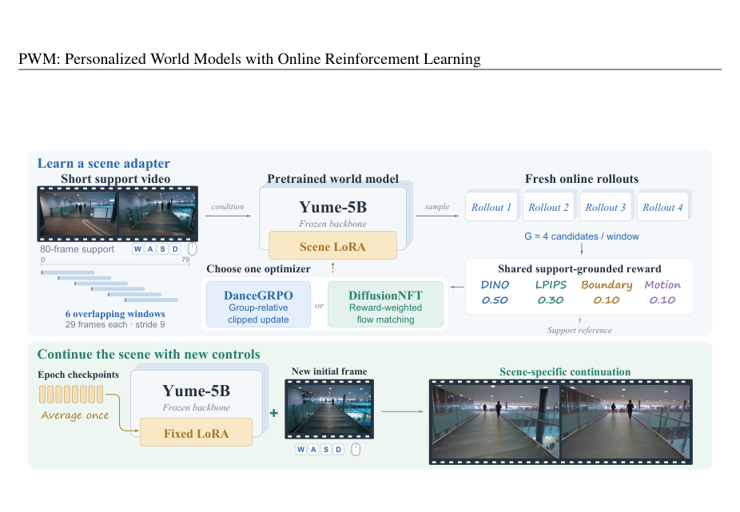

**Why this ranks #7**: Personalized world models with RL in the training loop, which is where most world-model work still does offline-only training.

---

### 8. Recursive Video In-Context Learning for Agentic Robot `[wild-card]`

**arXiv**: [2610.06843](https://arxiv.org/abs/2610.06843) | **Score**: 8.0 (relevance 8 x 0.7 + quality 8 x 0.3) | **Tags**: embodied-ai, robot policy | **Categories**: cs.RO, cs.AI, cs.CL, cs.MA | **Pages**: 13

**Authors**: Wenrui Bao, Xinxin Liu, Bingxin Xu, Yuzhang Shang

**Affiliation**: University of Central Florida | University of Southern California

**Abstract**

> LLM agents that orchestrate frozen vision-language-action (VLA) policies improve across episodes through text memory, which records what the agent did but not how the task is done. A demonstration video shows it, but fits poorly into an agent's context. The full video slows every turn, fixed keyframes lose the contact detail that decides whether a grasp holds, and what the agent needs shifts from the task's structure while planning to the frames around each contact. We introduce Recursive Video In-Context Learning (RV-ICL), a training-free method that turns a demonstration into a hierarchy the agent navigates rather than a prompt it receives. The hierarchy is built from the sub-events of the demonstration, such as grasps and releases. Its levels grow finer, from keyframes of the whole task to phases, moments and short clips, and are exposed through read-only tools. The agent reads the coarse levels before planning. During execution it re-enters the hierarchy whenever a step needs more detail and loads only the clip of its current sub-goal. One demonstration per task is enough. Built on RPent, RV-ICL raises success from 92.6% to 96.5% on LIBERO-PRO and from 86.7% to 95.8% on LIBERO-Plus.

**Key findings**

- **Finding**: Recursive Video In-Context Learning (RV-ICL) gives a robot agent one demonstration and segments it offline at its sub-events into a four-level hierarchy, then recurses over that structure to adapt to new tasks.

- **Finding**: On LIBERO-10 tasks from LIBERO-PRO the agent receives a single demonstration and reuses its sub-event decomposition rather than learning a flat policy from scratch, and the architecture figure shows the per-task segmentation explicitly.

- **Recommendation**: Read this if you are doing few-shot robot adaptation. Segmentation-at-sub-events is what makes one demonstration sufficient.

**Key figures**

*Framework / architecture - Figure 1: Overview of RV-ICL on a task from the LIBERO-10 suite of LIBERO-PRO. The agent receives one demonstration of the task as a hierarchy (a) and consults it while solving the same task in a new layout (b). (a) The hierarchy has four levels: L0 event-driven keyframes (thin lines mark their time), L1 phases between grasps and releases*

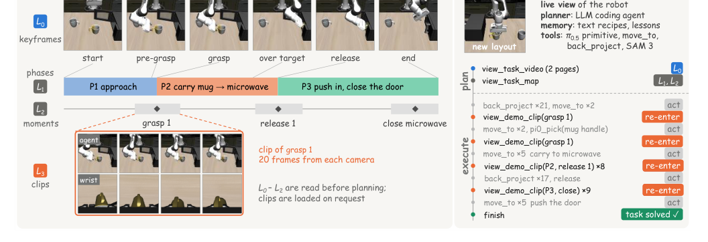

*Framework / architecture - Figure 2: Architecture of RV-ICL on RPent. Each demonstration is segmented offline at its sub-events into a four-level hierarchy. During an episode the LLM agent acts through the harness. Robot tools execute on the environment, and read-only demonstration tools load a level of the hierarchy into the agent’s context. The agent reads the co*

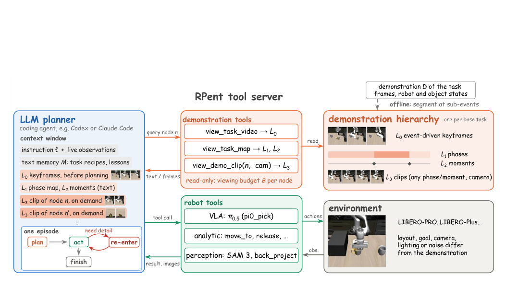

**Why this ranks #8**: Few-shot adaptation from a single demonstration, with an explicit hierarchy rather than flat imitation.

---

### 9. Mind the Execution Gap: Action-Semantic Mismatch in World-Model Control `[wild-card]`

**arXiv**: [2610.06582](https://arxiv.org/abs/2610.06582) | **Score**: 8.0 (relevance 8 x 0.7 + quality 8 x 0.3) | **Tags**: world-model, rl-algorithm | **Categories**: cs.AI, cs.CL, cs.IR, cs.LG | **Pages**: 15

**Authors**: Shengtao Wen, Xiang Chen, Yu Tian, Lingbing Guo, Lina Gong, Sheng-Jun Huang

**Affiliation**: ♡Nanjing University of Aeronautics and Astronautics, Nanjing, China | ♠Tsinghua University, Beijing, China | ♢Nanjing University, Nanjing, China

**Abstract**

> World-model controllers rely on action-conditioned dynamics for prediction and planning, yet real control systems often execute commands asynchronously due to communication delay, packet loss, reordering, and actuator buffering. We study how asynchronous execution changes the action semantics assumed within world-model controllers, rather than treating it only as an external control disturbance. Through controlled interventions, we identify two architecture-dependent failure modes: planning-based controllers such as TD-MPC2 suffer from a future-action timeline mismatch between imagined and executed action sequences, while recurrent world models such as DreamerV3 can attribute observed transitions to commands that were not actually applied. Our analysis shows that TD-MPC2 requires the correct future action sequence during latent dynamics rollout, whereas DreamerV3 requires timely attribution of each transition to the action that generated it. Based on these findings, we introduce two lightweight execution-consistent interfaces, Future-Sequence for TD-MPC2 and Applied-Action Feedback for DreamerV3, that correct these mismatches without modifying the pretrained world models. Experiments across delays, packet loss, reordering, multiple control domains, measured network traces, and a process-separated asynchronous stack consistently support both diagnoses and the corresponding architecture-specific corrections.

**Key findings**

- **Finding**: Diagnoses an action-semantic mismatch in world-model control - the world model can be accurate about what will happen and still be driven by a policy that acts on the wrong abstraction, so good prediction does not imply good control.

- **Finding**: This continues the diagnostic thread running through the last two batches: papers that separate *can the model predict* from *can the model be controlled*, including the JEPA plannability papers in yesterday's digest and H-JEPA's constructive response today.

- **Recommendation**: Read this if you evaluate world models by prediction metrics alone. It is the argument for why those metrics under-report.

**Key figures**

*Framework / architecture - Figure 1: (a) Synchronous execution keeps commanded and applied actions aligned. Under asyn- chronous execution, (b) TD-MPC2 suffers from future-action timeline mismatch, while (c) Dream- erV3 can suffer from previous-action attribution mismatch.*

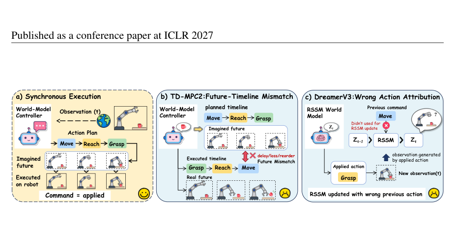

*Results / analysis - Figure 3: TD-MPC2 execution-information ablations. Left: information type across perturbations. Right: insertion point. Brackets and error bars denote 95% CIs.*

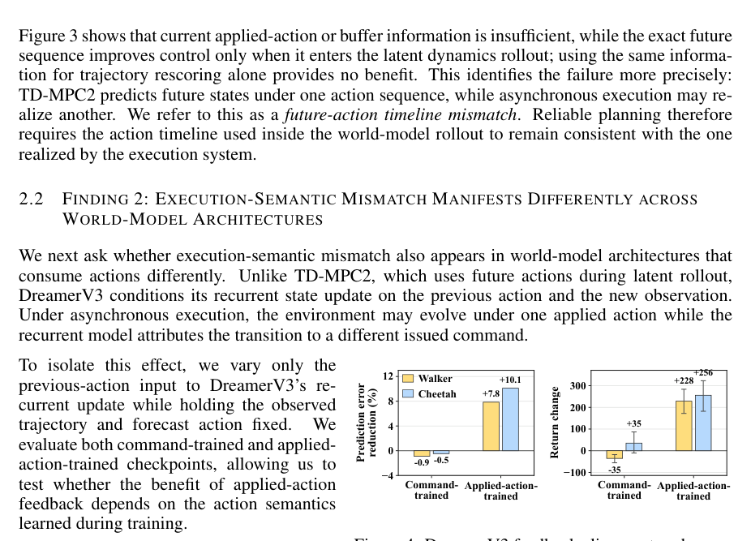

**Why this ranks #9**: A clean statement of the gap between world-model accuracy and world-model usability, which is the failure this whole cluster of papers keeps running into.

---

### 10. When Does Retrieval Help? A Study of In-Context Adaptation in Vision-Language-Action Models `[wild-card]`

**arXiv**: [2610.05492](https://arxiv.org/abs/2610.05492) | **Score**: 7.6 (relevance 7 x 0.7 + quality 7 x 0.3) | **Tags**: embodied-ai, VLA | **Categories**: cs.LG | **Pages**: 11

**Authors**: Zixuan Liu, Joris Köster, Zizhan Zheng, Siavash Khajavi

**Affiliation**: Department of Computer Science, Tulane University | Department of Computer Science, Aalto University | Department of Industrial Engineering and Management, Aalto University | @aalto.fi

**Abstract**

> Vision-language-action (VLA) models have shown strong potential as generalist robot policies, but adapting them to unseen tasks often requires costly parameter updates. Recent work such as RICL introduces in-context adaptability by retrieving expert demonstrations based on the current VLA observation and providing them as additional context at test time. The effectiveness of this adaptation therefore depends critically on the retrieval mechanism. In this work, we systematically study how different retrieval methods affect both retrieval quality and task performance within the RICL framework. Specifically, we compare four different methods: image-based retrieval, retrieval augmented with VLA's state, retrieval using features from the VLA backbone, and random retrieval. Our experiments yield three main findings. First, no retrieval method consistently dominates the others in task success, while surprisingly, random retrieval achieves a non-trivial success rate. Second, standard retrieval-quality diagnostics do not reliably reflect downstream VLA performance. Third, demonstrations from different but related tasks can provide useful transferable information. Together, these results provide an initial step toward understanding how retrieval mechanisms shape the in-context learning capability of VLA models and their downstream task performance, while highlighting the need for more careful design and evaluation of retrieval mechanisms for reliable test-time adaptation.

**Key findings**

- **Finding**: Studies when retrieval actually helps in-context adaptation in VLAs, and finds the benefit is conditional rather than universal - retrieval-conditioned context is not a free improvement.

- **Finding**: Because the paper's value is in delimiting when a popular technique works, the negative regions are as informative as the positive ones.

- **Recommendation**: Read this before adding retrieval to your VLA. It is a boundary-condition paper, which is exactly what is missing from most retrieval-augmented VLA reports.

**Key figures**

*Results / analysis - Figure 1: A successful RICL-Image example on Task 52. The dominant retrieved source evolves from Task 50 to Task 49, Task 46, and eventually the target Task 52.*

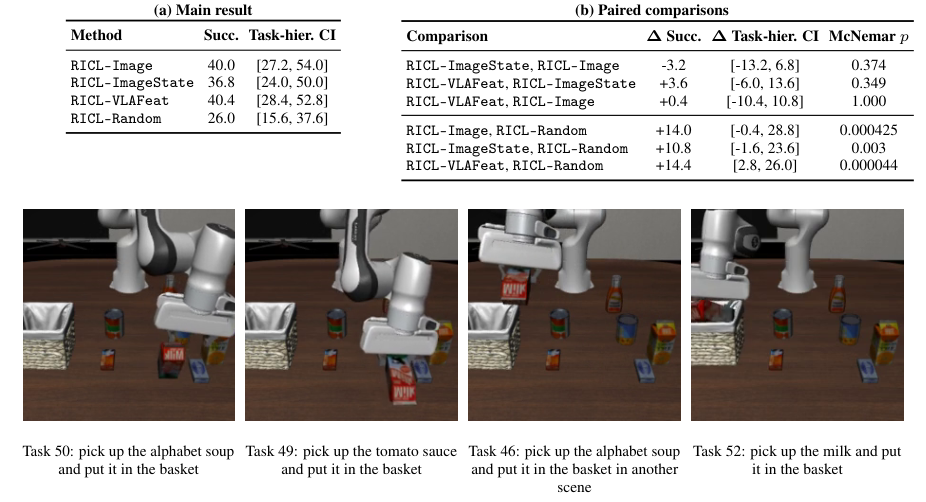

**Why this ranks #10**: A when-does-it-work paper for a technique that is being adopted faster than it is being characterized.

---

## Footer

- Total papers scanned across all 7 arXiv categories: **879**
- Papers read in full for this digest: **87**
- embodied track final top-10: **10**
- Wild-cards in this track: **6**
- Figure assets: `res/` (66 images shared across all 5 tracks)

Generated by the `mine-arxiv-daily-digest` skill. Sister file: `2026-10-06_embodied_entry.md`.
