# ArXiv Daily Digest - 2026-10-06 (Reinforcement Learning (Algorithms, RLHF, MARL), 10 papers)

**Generated**: 2026-10-06 17:45 CST
**Source**: arXiv cs.LG, cs.AI, cs.RO, cs.CL submissions, window 2026-10-04/05 UTC (the latest announced batch as of 2026-10-06)
**Track**: rl (top 10 of 879 papers scanned)
**Scope**: RL systems efficiency and memory, hierarchical RL and subgoal value learning, preference-alignment theory and group fairness, GRPO ablations and verifier quality, expert-guided on-policy RL, transfer-stratified distillation

---

Systems efficiency and hierarchical-RL correctness dominate, and both come with matched-hardware or paired-seed evidence rather than average-return curves. ThunderSyncRL measures 49.5% learner-GPU idle time in synchronous GRPO with rollout accounting for 70-90%+ of step time, then reaches 1.91x/1.94x speedup at policy lag 0 by *proving* gradient streaming produces updates identical to batch-synchronous training - so it claims both zero staleness and overlap, and buys up to +2.47 pass@3 on SWE-bench Verified at fixed budget for 5.8 GB more trainer memory. LoGRA attacks the memory side: a low-rank gradient sketch cuts fp32 storage 64 MiB -> 1 MiB, reduces training memory up to 45.7%, and trains a 27B model for 1,100+ steps on one eight-GPU node where dense Adam OOMs. The hierarchical cluster is unusually rigorous - GLHF extends NLHF's welfare guarantee to match the optimal distortion bound simultaneously on every user group, and the semi-Markov paper separates two losses HRL usually conflates with an exact GridWorld witness (J_A=-8, J_B=-11, J_C=-12, J_D=-14). The methodologically sharpest result is the GRPO replication: the *prompt* is first-order (0.08% zero-shot vs 18.3% three-shot), all four estimator variants sit inside seed noise, and clipping alone accounts for the entire off-policy result.

---

## Top 10 - Reinforcement Learning (Algorithms, RLHF, MARL)

### 1. ThunderSyncRL: Lossless Acceleration of Agentic Reinforcement Learning

**arXiv**: [2610.05935](https://arxiv.org/abs/2610.05935) | **Score**: 8.7 (relevance 8 x 0.7 + quality 9 x 0.3) | **Tags**: rl-algorithm, efficiency | **Categories**: cs.LG, cs.AI | **Pages**: 39

**Authors**: Seil Kang, Hangoo Kang, Tarun Suresh, Youngeun Kim, Shreyas Pimpalgaonkar, Seong Jae Hwang, Azalia Mirhoseini

**Affiliation**: Stanford University | Yonsei University | Korea University

**Abstract**

> Language models are moving beyond generating answers to pursuing long-horizon goals in interactive environments. Post-training these agents requires long, heterogeneous trajectories, and synchronous systems leave learner engines idle until rollout and verification finish. To squeeze out these pipeline bubbles, asynchronous training overlaps rollout and learning across updates, but comes at the cost of policy staleness. We introduce ThunderSyncRL, which starts gradient computation as soon as all required inputs are fixed, without policy staleness. For group relative policy optimization (GRPO), ThunderSyncRL computes each trajectory's score gradient as soon as the reward for that trajectory arrives, without waiting for the group. For on-policy distillation (OPD), it computes gradients for each completed agentic turn's teacher-scored actions while tool calls run in the sandbox. We prove that gradient streaming produces the same GRPO and OPD updates as batch-synchronous training, without changing either objective. On SWE-bench Verified and Terminal Bench 4.0, we train models to the same performance up to $1.9 \times$ faster than synchronous training. With zero policy staleness, ThunderSyncRL also outperforms asynchronous training at a fixed budget by up to $2.47$ percentage points.

**Key findings**

- **Finding**: Measures learner-GPU idle time at 49.5% of step time in synchronous GRPO and OPD training while waiting for rollout and verification, with rollout itself accounting for 70% to over 90% of training time.

- **Finding**: On Qwen-3.8-27B with 8xH100 80GB it reaches 1.91x (GRPO) and 1.94x (OPD) speedup over Sync at policy lag 0, versus 1.89x/1.92x for 1-step-stale Async and 1.90x/1.93x for variable-staleness Fully Async. On the rollout-bound GLM-4.7-Flash-31B the speedups drop to 1.64x/1.63x.

- **Finding**: The schedule is lossless - gradient streaming is proved to produce updates identical to batch-synchronous training - so at fixed budget it gains up to +2.47 pass@3 points on SWE-bench Verified over Async and Fully Async at 128 GPU-hours. The cost is peak trainer memory rising from 117.0 to 122.8 GB per learner GPU. Active MFU reaches 51.0% for Qwen-3.8-27B on H200.

- **Recommendation**: Read this if you run agentic RL with long-tailed trajectories and are choosing between synchronous correctness and asynchronous staleness.

**Key figures**

*Results / analysis - Figure 1: ThunderSyncRL matches Sync’s SWE-bench Verified pass@3 at up to 1.9× lower training cost under GRPO (left pair) and OPD (right pair). At a 128-GPU-hour budget, its zero-staleness schedule improves pass@3 by up to 2.47 percentage points over Async and Fully Async, both of which admit stale rollouts.*

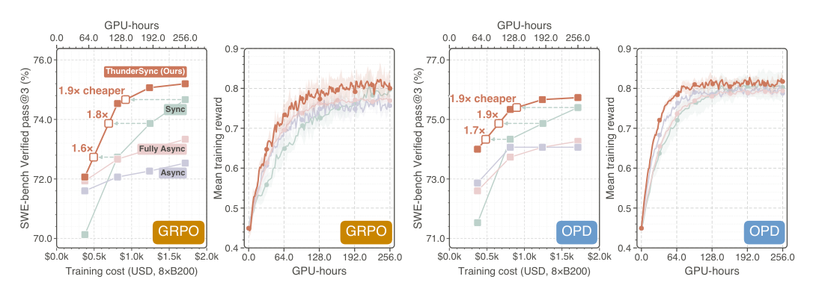

*Framework / architecture - Figure 2: Schematic schedules for GRPO (a) and OPD (b). • Sync waits for full batches; • Async overlaps adjacent batches with one-step staleness; • Fully Async updates rollout weights while trajectories remain in flight. • ThunderSyncRL streams ready gradients with one batch-synchronous optimizer step and zero staleness.*

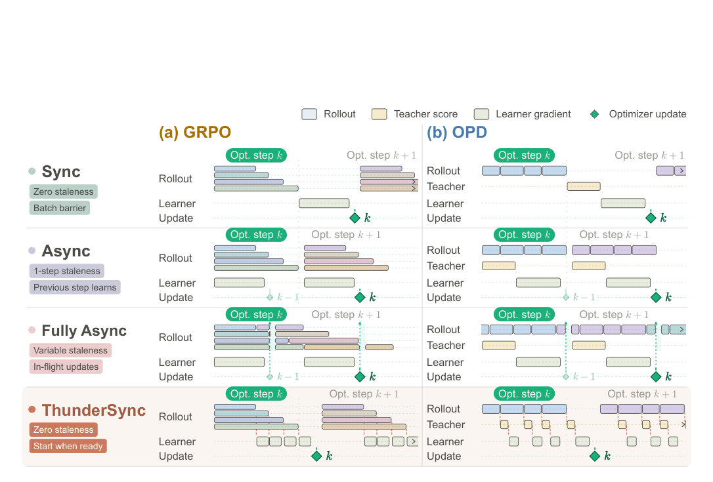

**Why this ranks #1**: It claims both zero staleness *and* overlap with exactness proofs and matched-hardware measurements across two model families and two GPU types - that combination is what separates it from prior async systems work.

---

### 2. LoGRA: Scaling LLM Reinforcement Learning with Low-Rank Gradient Sketches

**arXiv**: [2610.06647](https://arxiv.org/abs/2610.06647) | **Score**: 8.7 (relevance 8 x 0.7 + quality 9 x 0.3) | **Tags**: rl-algorithm, efficiency | **Categories**: cs.CL | **Pages**: 17

**Authors**: Shaokun Zhang, Yifan Zhang, Jian Hu, Yueying Li, Hao Zhang, Binfeng Xu, Jan Kautz, Yi Dong

**Affiliation**: © 2026 NVIDIA. All rights reserved.

**Abstract**

> Reinforcement learning (RL) has greatly advanced the capabilities of large language models (LLMs), but its memory demands remain a barrier to broader adoption. We introduce LoGRA, an approach to RL post-training that reduces memory by retaining useful learning signals in low-rank gradient sketches. These compact representations support both model updates and efficient policy synchronization. To prevent overly large updates from disrupting learning, we complement gradient compression with predicted-KL step control, which estimates policy changes before applying each update and adjusts its magnitude accordingly. Across reasoning tasks, LoGRA reduces average training memory by up to 45.7\% without sacrificing performance. It also enables stable training of a 27B-parameter model for over 1,100 steps on a single eight-GPU node, where dense Adam runs out of memory, making previously memory-infeasible RL training practical. Code is available in the \href{https://github.com/skzhang1/labs-molt/tree/logra/examples/scripts/logra}{Molt library}.

**Key findings**

- **Finding**: LoGRA replaces the full d x k gradient buffer with a low-rank sketch S = G_A^T in R^(d x r), cutting fp32 storage from 64 MiB to 1 MiB for d = k = 4096 and r = 64, and reducing average training memory by up to 45.7% across reasoning tasks without sacrificing performance.

- **Finding**: This enables stable training of a 27B-parameter model (Qwen3.8-27B) for over 1,100 steps on a single eight-GPU node, where dense Adam runs out of memory. The setup is deliberately plain PPO with verifiable rewards, one response per prompt and a global running reward baseline, to isolate the method from algorithmic gains.

- **Finding**: Policy synchronization exploits the sketch structure - the rollout engine regenerates A from a seed and applies the received alpha*eta*U, so the payload is O(dr) values plus a seed rather than a full d x k update. Refreshing A each step lets the sum of successive updates exceed rank r, and predicted-KL step control anneals a budget from 2e-4 to 2e-5.

- **Recommendation**: Read this if you are memory-bound on large-scale RL post-training and want a drop-in optimizer change rather than a new algorithm. Released in the Molt library.

**Key figures**

*Results / analysis - Figure 1: Lower training memory across model scales. Colors denote model sizes; hatching distinguishes Dense Adam from LoGRA. Dark bars show average memory and pale extensions reach peak memory (Table 1); labels report average / peak in GiB per training GPU. Arrows show average-memory savings over Dense Adam. The broken axis omits 34–48 G*

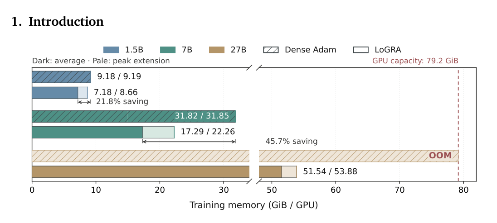

*Framework / architecture - Figure 4: Sustained 27B training on a single eight-GPU node. Qwen3.8-27B trained with LoGRA on the Reasoning-Gym Hard mixture. (a) Macro-averaged verifier score across held-out tasks. (b) Mean evaluation response length. (c) Fraction of evaluation responses truncated at the 16,384-token context limit. All panels describe one training traj*

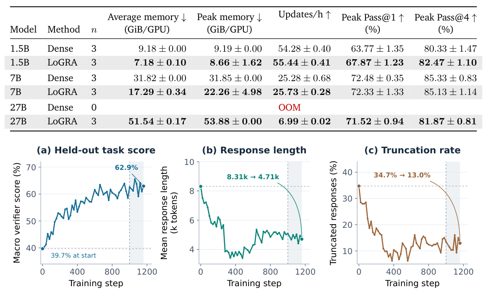

**Why this ranks #2**: NVIDIA-authored, code released, and the strongest systems result in the batch - 45.7% memory reduction plus training a 27B model where dense Adam OOMs.

---

### 3. Groupwise Distortion Guarantees for Preference-Based Alignment

**arXiv**: [2610.05450](https://arxiv.org/abs/2610.05450) | **Score**: 9.0 (relevance 9 x 0.7 + quality 9 x 0.3) | **Tags**: rlhf, theory | **Categories**: cs.LG | **Pages**: 42

**Authors**: Jacob Brodkey, Roberto Tamez, Aaron Roth

**Affiliation**: University of Pennsylvania

**Abstract**

> Preference-based alignment methods such as reinforcement learning from human feedback (RLHF) and Nash learning from human feedback (NLHF) aggregate pairwise preferences to learn an LLM policy, but a natural goal is maximizing social welfare (average cardinal utility), which comparisons alone need not identify. Gölz, Haghtalab, and Yang (GHY) measure the gap by distortion: the worst-case ratio between the welfare of the best fixed lottery (distribution over responses) and of the learned lottery. They show NLHF is optimal when every user receives the same lottery. Account-based LLMs, however, have information about their users and can serve different lotteries to different people. We give an efficient algorithm, GLHF, that learns a single group-conditioned policy from one comparison per user. Under individual Bradley--Terry comparisons, GLHF asymptotically matches GHY's optimal population distortion bound simultaneously on every group in a prespecified, possibly overlapping collection, with sample complexity growing logarithmically in the number of groups and inversely with the smallest group mass. A sharper guarantee for groups with similar preferences approaches distortion of one when members share a feasible favorite response. In experiments using human coffee ratings and synthetic LLM-generated ratings, GLHF lowers distortion in every evaluated group and substantially reduces worst-group distortion relative to NLHF and other group-agnostic baselines.

**Key findings**

- **Finding**: GLHF learns one group-conditioned policy from a single comparison per user and asymptotically matches the GHY optimal population distortion bound *simultaneously on every group*, with exploitability eps_{T,k} = O(sqrt(((m-1)(1+tau)+log(K/delta)+log log(eT)) / (T p_k))) growing only logarithmically in the number of groups K and inversely with the smallest group mass p_k.

- **Finding**: The per-group asymptotic distortion factor approaches beta^2(e^beta+1)/(e^beta-1) - approaching 1 as beta -> 0 and growing like beta/2 as beta -> infinity - and Theorem 6 shows this is worst-case optimal for contextual policies when the observable context is uninformative.

- **Finding**: On human coffee ratings with one simulated comparison per respondent, multigroup GLHF achieves mean worst-group distortion of 1.08 versus 1.28 for NLHF, with distortion lowered in every evaluated group. The paper is 42 pages and legitimately contains no figures.

- **Recommendation**: Read this if you work on personalized or group-fair alignment and want a distortion guarantee for overlapping user groups rather than a minimax one.

**Why this ranks #3**: A 42-page theory paper extending NLHF's single-lottery welfare guarantee to simultaneously-many overlapping groups, with matching lower bounds - the most rigorous result in the RL track.

---

### 4. Hierarchical Time-aware Bootstrapping for Off-Policy Subgoal Value Learning

**arXiv**: [2610.05446](https://arxiv.org/abs/2610.05446) | **Score**: 8.0 (relevance 8 x 0.7 + quality 8 x 0.3) | **Tags**: rl-algorithm, HRL | **Categories**: cs.LG, cs.AI | **Pages**: 37

**Authors**: Bingyun Liu, Yuheng Jing

**Affiliation**: Institute of Automation | Chinese Academy of Sciences

**Abstract**

> Off-policy hierarchical reinforcement learning must estimate the values of high-level decisions while the low-level policy changes. HIRO adapts replay data through subgoal relabeling, but after a label change, the value update targets the relabeled subgoal instead of the subgoal the high-level policy originally needed to update. We propose Hierarchical Time-aware Bootstrapping (HTB), which evaluates specified subgoals under the current low-level policy while retaining accumulated task rewards. Remaining execution time distinguishes subgoal continuation from a new high-level decision. Together with primitive-action conditioning, it enables off-policy Bellman updates based on the stationary environment transition law. HTB combines these one-step updates with multi-step suffix returns and truncated relabeling, reducing dependence on intermediate value estimates. A shared value component supports learning across actions, while nonnegative residuals constrain upward corrections relative to that component. At a fixed mixture weight of 0.95, HTB achieves 32.8% AntFall success versus 9.6% for matched local HIRO over five paired seeds at 10M environment steps. Ablations identify contributions from recursive continuation and mixed supervision; fixed-policy tests show more accurate predictions for actions whose returns were excluded from fitting.

**Key findings**

- **Finding**: At a fixed multi-step mixture weight and 10M environment steps over five paired seeds, HTB reaches 32.8% AntFall success versus 9.6% for a matched local HIRO implementation - a paired improvement of 23.2 percentage points with a 95% interval of [8.8, 39.2]. On AntPush the means are 14.0% versus 0.0%, with an interval [0.0, 32.4] that includes zero.

- **Finding**: The mechanism targets a specific HIRO defect: after likelihood-based subgoal relabeling, the regression supervises the relabeled subgoal rather than the original high-level decision, so the high-level critic never receives a direct target. HTB instead learns the value at every primitive step within a segment, using remaining execution time to distinguish subgoal continuation from a new high-level decision.

- **Finding**: HTB mixes one-step Bellman backups with multi-step suffix returns and truncated relabeling, using a shared subgoal value plus action-value residuals whose nonnegativity constrains upward amplification. Ablations isolate recursive continuation and mixed supervision, and fixed-policy tests show more accurate predictions for actions whose returns were excluded from fitting.

- **Recommendation**: Read this if you use HIRO or HAC on long-horizon manipulation and need to understand why relabeled replay gives your high-level critic no direct target.

**Key figures**

*Framework / architecture - Figure 1: Subgoal values can be learned at every primitive step. The high-level policy acts every H steps. HTB learns VH−i(si, G, gi) throughout each segment using a mixture of its remaining return (blue) and a one-step backup (orange). The current subgoal continues until the next high-level decision. Arrows run from target dependencies t*

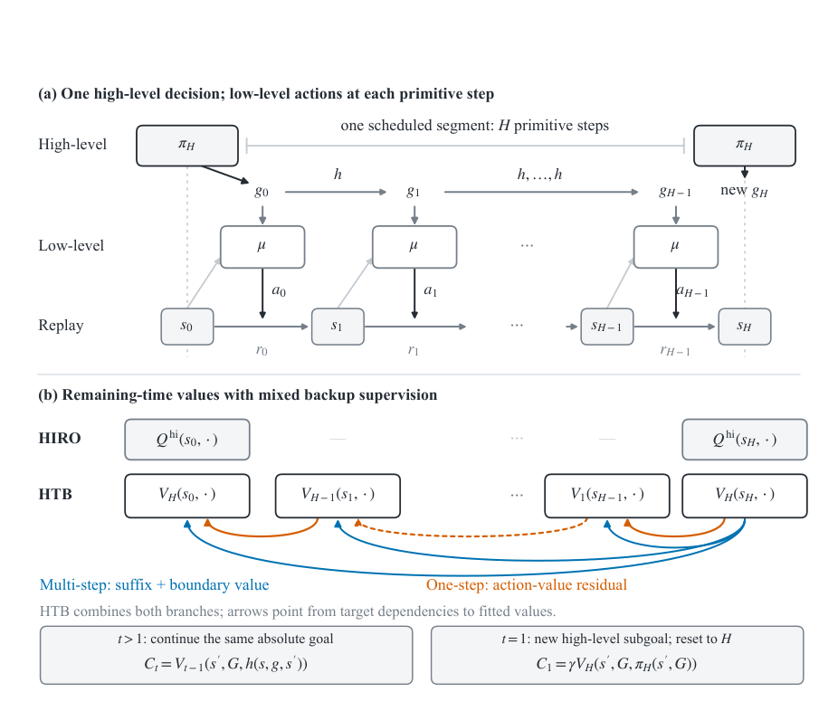

*Results / analysis - Figure 3: HTB improves success on Fall at a fixed configuration. Success over training, averaged across five paired seeds. Both HTB conditions use λ = .95; HIRO uses its original off-policy correction. Shading denotes pointwise 95% empirical bootstrap intervals. No temporal smoothing is applied.*

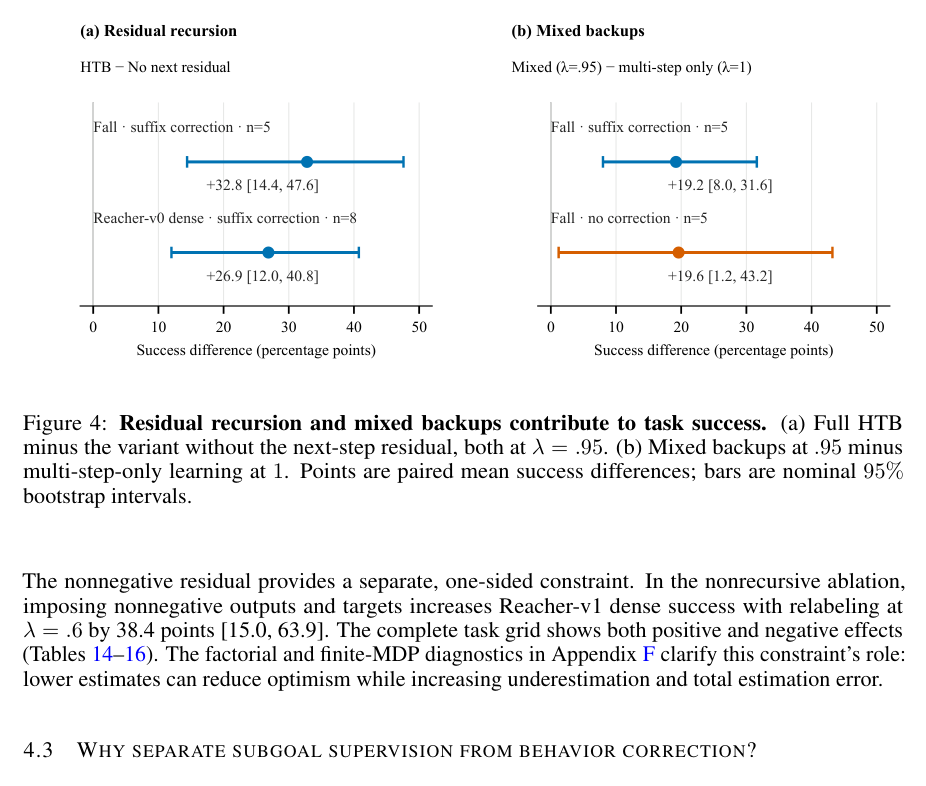

**Why this ranks #4**: Paired-seed statistics with confidence intervals and a precisely diagnosed defect in the predecessor, from the same group as today's semi-Markov theory paper.

---

### 5. On Semi-Markov Suboptimality in Hierarchical Reinforcement Learning

**arXiv**: [2610.05338](https://arxiv.org/abs/2610.05338) | **Score**: 8.0 (relevance 8 x 0.7 + quality 8 x 0.3) | **Tags**: rl-algorithm, HRL, theory | **Categories**: cs.LG, cs.AI | **Pages**: 55

**Authors**: Bingyun Liu, Yuheng Jing

**Affiliation**: Institute of Automation | Chinese Academy of Sciences

**Abstract**

> Hierarchical reinforcement learning uses temporally extended subtasks for exploration, yet committing to their execution can restrict both deployment and policy learning. We identify and separate the resulting execution and policy suboptimality. Task and execution trees distinguish reward objectives from policy choices and decision interruption. A Unified Value Function for HRL and a four-stage Generalized Hierarchical Bellman Equation then support a common analysis of both losses. Under bounded rewards and uniform termination, we establish hierarchical policy and execution improvement results. With the remaining node policies fixed, task-subtree compatibility and node-policy optimality under the original execution mode establish when Markov execution is optimal. The resulting decomposition leads to independent execution choices for behavior, targets, and deployment. We instantiate this principle through execution improvement and one-stage or two-stage policy improvement at arbitrary hierarchy depth. Option-based and goal-conditioned experiments demonstrate complementary gains from changing execution and changing the learning target. Controlled stochastic environments show how these gains depend on stochastic transition strength and spatial structure. This framework makes execution design an explicit component of hierarchical policy optimization.

**Key findings**

- **Finding**: Separates two losses that HRL papers usually conflate - policy suboptimality (optimizing for semi-Markov execution then deploying with Markov execution) and execution suboptimality (retaining semi-Markov execution at deployment) - yielding the decomposition Delta J_SMDP = Delta J_E + Delta J_P under task-subtree compatibility.

- **Finding**: An exact GridWorld construction makes both losses numerically visible with undiscounted returns J_A = -8, J_B = -11, J_C = -12, J_D = -14: reselecting subtasks with the semi-Markov-trained node policy saves one frame in expectation, optimizing the node policy for Markov execution saves three more, and running the Markov-optimal policy *under* semi-Markov execution is worse than the original semi-Markov solution.

- **Finding**: Under uniform termination and bounded rewards the four-stage Generalized Hierarchical Bellman Equation is a contraction with factor 1 - eps and a unique fixed point bounded by 2M/eps; Theorem 2.4 establishes Markov execution as optimal under Assumption 2.3, and a multilevel counterexample shows compatibility failure breaks the ordering. The paper is 55 pages.

- **Recommendation**: Read this if you do HRL and have ever conflated task termination with decision interruption - the beta vs beta-hat distinction drives the whole framework.

**Key figures**

*Results / analysis - Figure 1: Decision state is not the task whose return is evaluated. The extended-state coordinate records the current decision position; the condition specifies the reward objective and exit boundary. Decision authority moves down the tree within a frame while the environment state and conditioning task stay fixed. The two node labels can*

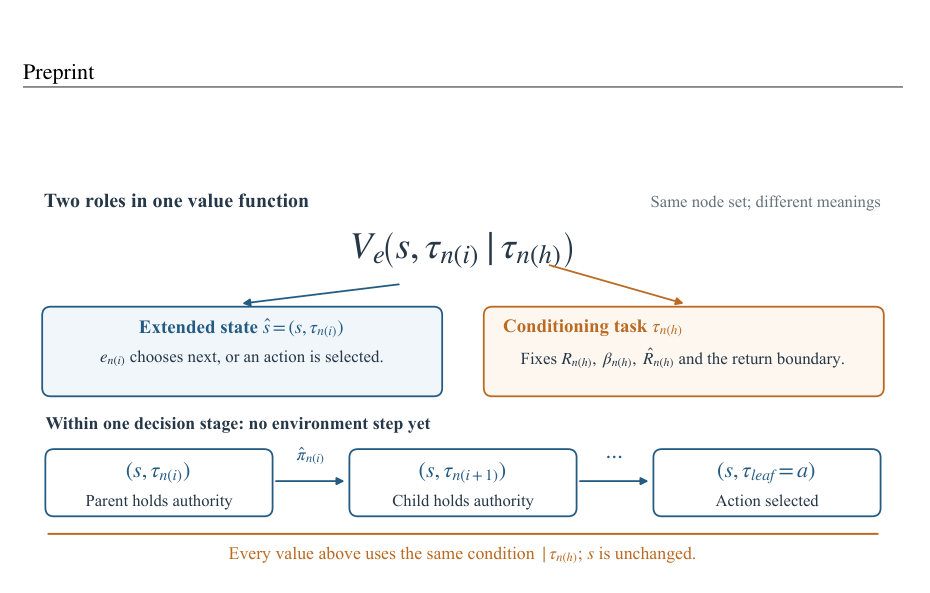

*Results / analysis - Figure 5 shows how decoupling shapes learning. 1Stage(PSIF) improves before the episode-500 switch while retaining SME behavior; 2Stage(PSIF) reduces the recorded training-step count after this scheduled switch and finishes below Baseline(ESIF). Direct ME behavior from initialization (NaiveME) remains less effective in both displayed sett*

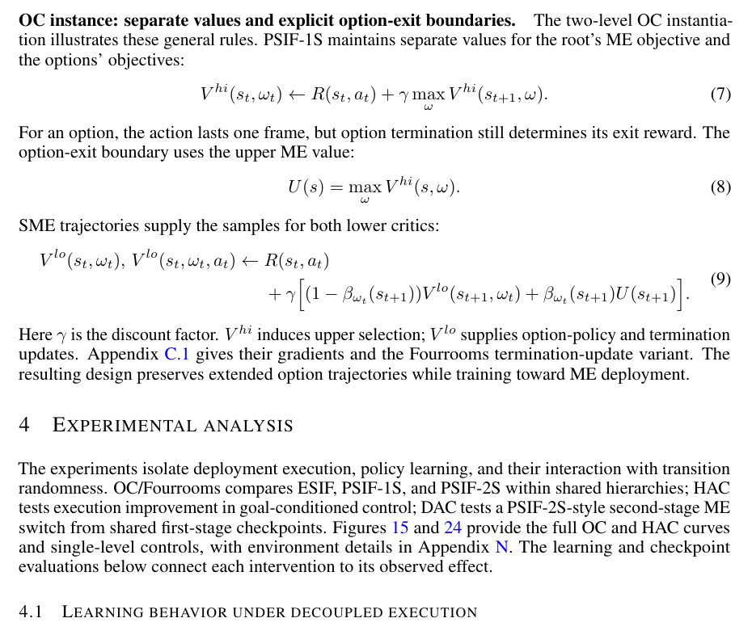

**Why this ranks #5**: A 55-page theory paper whose contribution is a clean formal separation of two conflated losses, backed by an exact worked counterexample rather than only asymptotic claims.

---

### 6. Adaptive Expert Guidance for Efficient On-Policy Reinforcement Learning

**arXiv**: [2610.06019](https://arxiv.org/abs/2610.06019) | **Score**: 8.0 (relevance 7 x 0.7 + quality 8 x 0.3) | **Tags**: rl-algorithm, PPO, efficiency | **Categories**: cs.LG, cs.AI | **Pages**: 21

**Authors**: Daniele Affinita, Ming Xu, Rudolf Reiter, Davide Scaramuzza, Pascal Fua

**Affiliation**: University of Zurich, Switzerland

**Abstract**

> With massively parallel simulation, on-policy Reinforcement Learning methods such as PPO have become standard in many domains. However, learning from scratch is sample-inefficient and fails to exploit the potential existence of a suboptimal expert, such as a heuristic, a model-based controller, or a policy trained on a related task. Such an expert is often available and can guide early training, but its sub-optimality limits final performance. The challenge then becomes balancing expert guidance against learning from rewards. Existing methods set the expert's influence through a blending weight, a schedule, or an evaluation-driven curriculum. Alternatively, they adapt it with additional learned components such as critics over expert actions or auxiliary agents. However, none optimizes it using the same on-policy objective as the policy itself. We propose a method in which the learner and the expert alternate control within each training episode, and the expert's share of control is a single learnable parameter optimized jointly with the policy. The learner benefits from the expert early in training, but its share of control declines as the learner becomes more competent, until eventually vanishing completely. This leaves the learner acting alone and better than the suboptimal expert. We evaluate our method on 34 tasks across two benchmarks, spanning discrete and continuous action spaces, using both learned and model-based experts. Our method improves sample efficiency over guided and unguided baselines while requiring minimal hyperparameter variation. The expert's share decays to zero as the learner improves, vanishing when the expert is no longer useful.

**Key findings**

- **Finding**: Across 34 tasks on DMControl (25) and MiniGrid (9), 20M environment steps and 5 seeds per task, the method reaches a given return in fewer environment steps than guided and unguided baselines, with a median per-task speedup of 2.55x over PPO on DMControl and the largest margins under sparse rewards - including tasks with an expert that never succeeds.

- **Finding**: The expert share lambda is a single learnable parameter optimized by the same policy-gradient rule as the policy, but committed to in blocks of k steps rather than switched every step, because at k = 1 the per-block signal-to-noise ratio is near zero or negative while d(k)/sqrt(k) peaks at k ~ 75-300, with k = 100 used throughout.

- **Finding**: A price on expert use is what makes withdrawal happen - without it (c_E = 0) lambda stays above 0 on 13 of 25 DMC tasks even after the learner matches the expert, capping performance at the expert's level. Raising c_E to 3 cuts mean withdrawal from 17.4M to 0.6M steps, but relative return peaks at the default c_E = 0.3, applied to every task without per-task tuning.

- **Recommendation**: Read this if you have a suboptimal expert available at training and want its influence to vanish automatically rather than on a hand-tuned schedule.

**Key figures**

*Results / analysis - Figure 1: The expert share is learned from block-level performance. The expert (orange) and learner (blue) alternate control in temporally committed blocks, with λ determining the expert’s share. The difference between expert- and learner-block advantages drives the update of λ: as the learner improves, the expert is progressively withdra*

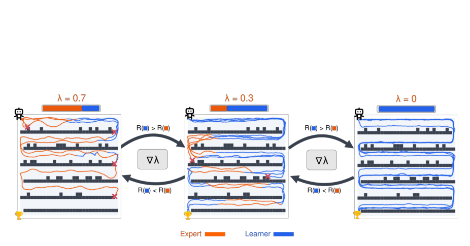

*Results / analysis - Figure 3: Aggregate results on both benchmarks. Normalized return (min-max per task, averaged over tasks and seeds) and the expert share λ per task.*

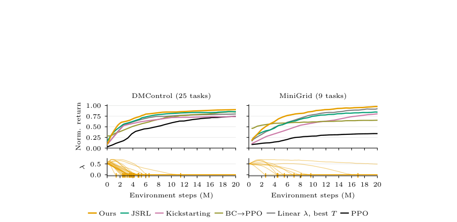

**Why this ranks #6**: Broadest benchmark coverage in the track with ablations that expose the exact failure mode - expert capture - that occurs when the obvious design choice is omitted.

---

### 7. Transfer-Stratified On-Policy Distillation for RL-Improved Reasoning Teachers `[wild-card]`

**arXiv**: [2610.05974](https://arxiv.org/abs/2610.05974) | **Score**: 7.8 (relevance 7 x 0.7 + quality 8 x 0.3) | **Tags**: rlhf, rl-algorithm | **Categories**: cs.LG, cs.AI | **Pages**: 20

**Authors**: Xiaoyu Chen, Bo Shao, Tiangang Zhu, Bintao Wu, Linjun Shou, Fengge Wu, Feng Sun, Wenbiao Ding

**Affiliation**: Institute of Software, Chinese Academy of Sciences, 2Microsoft, 3Northwestern Polytechnical University | ∗Work done during an internship at Microsoft

**Abstract**

> Reinforcement learning can substantially improve a reasoning teacher, but it is unclear which of those improvements survive when the teacher supervises a smaller on-policy student. We study this question in mathematical reasoning by comparing teacher lineages before and after GRPO, multiple student scales, direct GRPO, and several on-policy distillation objectives. The central finding is that transfer is structured rather than scalar: teacher strength alone does not make dense distillation competitive, while an RL-improved teacher creates useful but metric-dependent student gains. This motivates Transfer-Stratified On-Policy Distillation (TS-OPD), which screens training problems by the joint sampled success of the student and teacher, routes acquisition problems to gated forward KL, routes consolidation problems to gated reverse KL, and adds an entropy brake to protect sampled coverage. Across the main comparison, TS-OPD is the strongest student objective for macro average correctness with the GRPO-improved teacher, while pass@K remains more mixed. Ablations show that the gains come from routing and token gating rather than skipping problems. These results support a transfer-aware view of OPD: stronger teachers help when the supervision direction and token budget match the student's observed ability, not merely because the teacher endpoint is stronger.

**Key findings**

- **Finding**: The transfer gap is 13 to 20 points when distilling from a base (non-GRPO) 8B teacher, and with that base teacher every on-policy distillation objective trails direct GRPO at every student scale - direct GRPO at 1.7B and 4B (39.53 and 51.57) already beats the base-8B teacher itself (38.03).

- **Finding**: TS-OPD stratifies problems by joint sampled pass rate with K_cal = 8 responses, routing knowledge gaps (student = 0, teacher > 0) to gated forward KL, precision gaps (0 < student < teacher) to gated reverse KL, and skipping problems with no teacher advantage. It trains on only the selected subset, taking about 91, 51 and 27 OPD steps out of 118 for the three student scales.

- **Finding**: Ablations show the gains come from routing and token gating rather than from simply skipping problems - three controls (Direct GRPO, OPD-r, OPD-f) use the same problems and step count, so only the loss differs.

- **Recommendation**: Read this if you distill from RL-improved reasoning teachers and want to know why a stronger teacher does not automatically produce a stronger student.

**Key figures**

*Framework / architecture - Figure 1: Overview of the transfer gap and its problem-level decomposition. Left: GRPO yields a teacher improvement Δ𝑇, but standard OPD transfers only part of it into a student gain Δ𝑆, leaving a transfer gap of Δ𝑇−Δ𝑆. Middle: Joint teacher–student pass rates identify knowledge gaps (teacher > 0, student = 0), precision gaps (teacher > s*

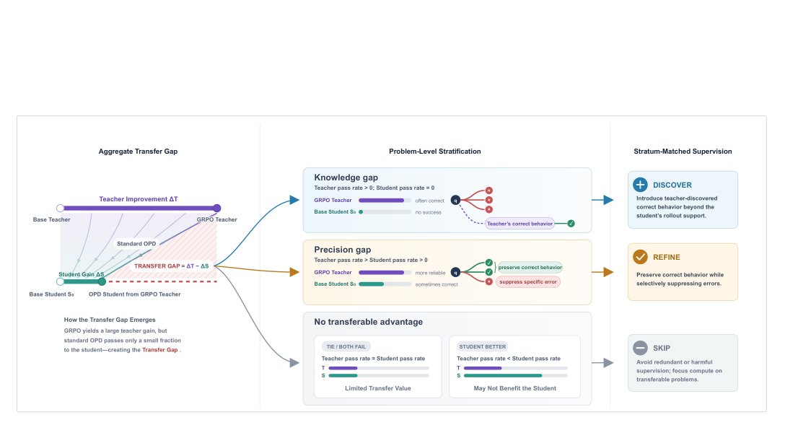

*Framework / architecture - Figure 2: Overview of TS-OPD. Before training, each problem is labeled by the sampled success of the teacher and the student. Problem level: P and N problems are skipped, A problems use forward KL, and C problems use reverse KL. Token level: gates select positions within a response, and C adds an entropy brake.*

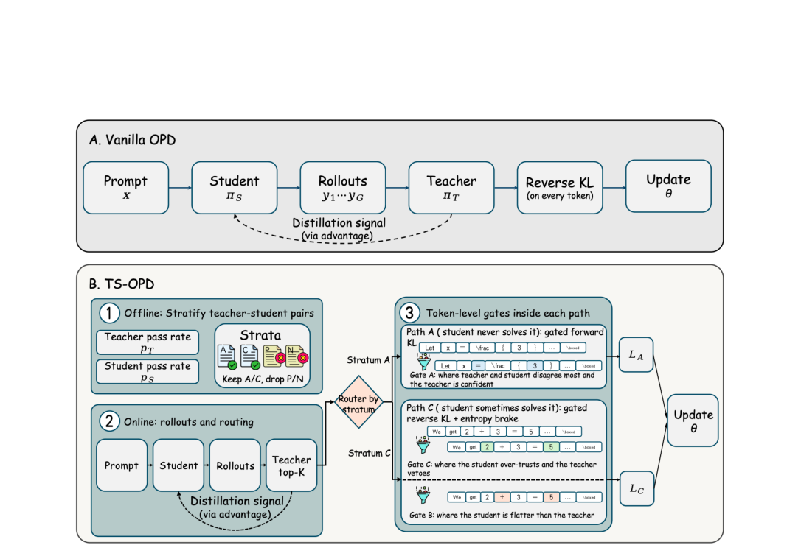

**Why this ranks #7**: Two teacher lineages, three student scales, four objectives and eight benchmarks, with matched-problem and matched-step controls that rule out the obvious alternative explanation.

---

### 8. Prompt Dominance and Asymmetric Verifier Costs: Empirical Ablations of GRPO at 1B Scale on GSM8K `[wild-card]`

**arXiv**: [2610.04928](https://arxiv.org/abs/2610.04928) | **Score**: 7.4 (relevance 8 x 0.7 + quality 6 x 0.3) | **Tags**: rlhf, GRPO, evaluation | **Categories**: cs.LG | **Pages**: 12

**Authors**: Yi Hou

**Affiliation**: University of Chinese Academy of Sciences

**Abstract**

> This paper studies GRPO at 1B scale from both directions: what estimator choices do to the learning signal, and what a degraded reward signal does to what is learned. We train OLMo-2-0425-1B on GSM8K with a from-scratch implementation and measure both sides in controlled sweeps, including a verifier-quality experiment that degrades the training reward and the test-time selector identically. Four results stand out. The prompt is the first-order decision: the zero-shot prompt leaves the base model at 0.08% (its outputs are degenerate continuations, not wrong answers), so almost no group carries a gradient, and training succeeds because the 3-shot prompt reaches 18.3%. At this scale the estimator variants sit within seed noise, with Dr. GRPO ahead on both seeds. In the off-policy regime, clipping is the whole story: training on data without a clipped ratio loses 4-6 points relative to the on-policy reference, while GRPO-style clipping and GSPO recover the loss entirely. Finally, the same weak verifier is far cheaper in RL than in test-time selection: a 10%-flip verifier leaves RL's attainable gain intact (91% and 106% retained across two seeds) where selection retains 57%, and a format-only verifier leaves RL with 16-30% of its gain and selection with essentially nothing. Flip noise acts as an affine transform on the expected reward, and the group-normalized advantage with Adam's rescaling removes it exactly; the residual is a second-order variance effect that the matched-step comparison at a 30% flip rate tests.

**Key findings**

- **Finding**: Prompt choice is first-order, not estimator choice - the bare-question prompt leaves OLMo-2-0425-1B at 0.08% on GSM8K because its outputs are degenerate continuations rather than wrong answers, so almost no group carries a gradient, while the 3-shot prompt reaches 18.3%. Under the bare prompt the two seeds land at 0.089 versus 0.013, a 7x spread.

- **Finding**: At 1B scale all four one-change estimator variants span only 0.040 in two-seed means (0.497-0.537) while within-variant seed spread is 0.002-0.018 - the variants sit inside seed noise, with Dr. GRPO ahead on both seeds (0.529/0.544 versus 0.526).

- **Finding**: Clipping is the load-bearing component in the off-policy regime: at 32x staleness the clipped runs (0.538/0.521, 0.523/0.531) match the on-policy reference (0.526) while NOCLIP and NAIVE lose 3.5-6.3 points. A 10%-flip verifier leaves RL with 91% and 106% of its gain retained across two seeds where test-time selection retains only 57%; flip noise acts as an affine transform on expected reward that group-normalized advantage plus Adam's rescaling removes exactly.

- **Recommendation**: Read if you are tuning GRPO for a small model and want to know which knobs are noise - the authors state the isolation limits themselves (1B, 80-200 steps).

**Key figures**

*Results / analysis - Figure 1: The standard run (200 steps, 3-shot prompt). Solid lines: greedy decoding; dashed: sampling at temperature 1.0. Both seeds are shown. The dotted line is the 3-shot prompting baseline from Table 1.*

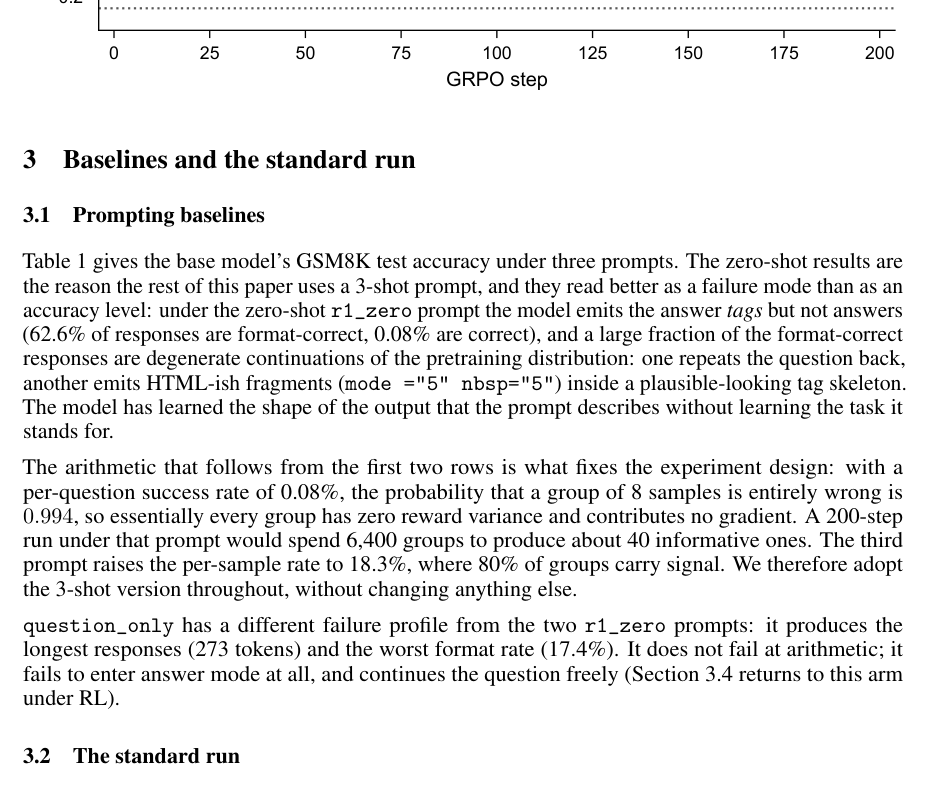

*Results / analysis - Figure 2: Learning-rate sweep (80 steps, seed 0, greedy decoding). 3 × 10−5 peaks at step 30 and then falls by 10 points: divergence, not slow convergence; 3 × 10−6 has not converged by step 80.*

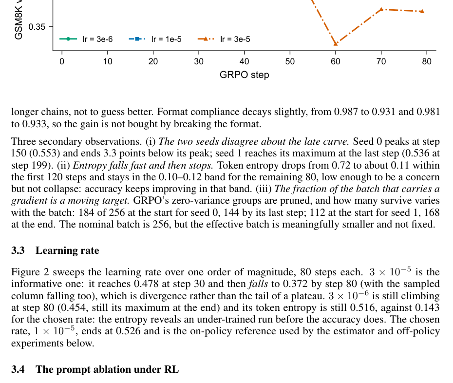

**Why this ranks #8**: A rare controlled replication that reports seed spread alongside every effect, which is what makes its 'these variants are noise' conclusion usable.

---

### 9. Ontology Concept Overlap as a Training Signal: Knowledge-Grounded Reinforcement Learning for Clinical Question Answering `[wild-card]`

**arXiv**: [2610.06360](https://arxiv.org/abs/2610.06360) | **Score**: 7.4 (relevance 7 x 0.7 + quality 6 x 0.3) | **Tags**: rlhf, GRPO | **Categories**: cs.CL, cs.LG | **Pages**: 5

**Authors**: Aditya Tanna, Abhishek Jindal

**Affiliation**: Dhirubhai Ambani University

**Abstract**

> Reinforcement learning post-training for language models relies on two reward designs: human preferences (RLHF, DPO) and binary verifiers (RLVR). Clinical question answering fits neither. Near-correct answers differ by a single substituted entity, and no executable check decides clinical correctness. We instantiate a soft verifier from a maintained controlled vocabulary: UMLS Concept Unique Identifier overlap (via scispaCy, set-level F1) gives a graded, externally specified reward computed without a model in the loop. We combine it inside GRPO with an entropy-normalised LLM judge, which covers the safety and evidence axes overlap cannot see, and a small consistency penalty on padding and repetition that keeps early-training samples scorable. This three-term composite improves over SFT on Phi-3-mini (3.8B) over MedQA by 2.9% on EM (0.700 vs 0.680) and 39% on Token-F1 (0.202 vs 0.145); on Llama-3.2-3B the corresponding gains are 14% on EM and 35% on Token-F1. We report Token-F1 as the primary metric because it credits partially-correct clinical content that EM discards at this open-generation scale. Main-table results are means over 3 seeds with standard deviations below 0.005. The method transfers to PubMedQA, where training on the PubMedQA train set with the same composite reward improves Token-F1 over SFT by 22% on Phi-3-mini and 17% on Llama-3.2-3B without retuning. A reward ablation on Phi-3, varying the judge-ontology split at a fixed consistency weight, attributes 3 EM points to the ontology term, the contribution that catches entity substitutions the judge cannot. Three negative findings constrain the design: DPO under random negatives underperforms SFT for strong-prior models but helps the weakest-prior one; PPO under a sparse neural reward diverges; GRPO with KL-in-loss collapses at 7B.

**Key findings**

- **Finding**: A three-term composite reward (LLM judge alpha=0.6, UMLS CUI set-level F1 beta=0.3, consistency penalty gamma=0.1) inside GRPO improves over SFT on MedQA by 2.9% EM (0.700 versus 0.680) and 39% Token-F1 (0.202 versus 0.145) for Phi-3-mini, and by 14% EM / 35% Token-F1 for Llama-3.2-3B; main-table numbers are 3-seed means with std below 0.005.

- **Finding**: The reward ablation attributes 3 EM points specifically to the ontology term, which catches entity substitutions ("penicillin G" for "ceftriaxone") that the judge scores identically on fluency and evidence.

- **Finding**: It transfers to PubMedQA without retuning the reward mixture, improving Token-F1 over SFT by 22% on Phi-3-mini and 17% on Llama-3.2-3B. Three negative results bound the design space - DPO under random negatives underperforms SFT for strong-prior models, PPO under a sparse neural reward diverges, and GRPO with KL-in-loss collapses at 7B.

- **Recommendation**: Read if you need a soft verifier for a domain with a maintained controlled vocabulary and no executable checker. The paper names legal QA and scientific writing as untested targets.

**Key figures**

*Results / analysis - Figure 1: Composite-reward GRPO. The policy samples 𝐺=4 responses per question; each is scored by the frozen LLM judge, by UMLS CUI overlap against the reference, and by a consistency penalty on padding and repetition. The three terms are combined as in Eq. 1 (𝛼=0.6, 𝛽=0.3, 𝛾=0.1). Group-normalised advantages update the LoRA adapter. Refe*

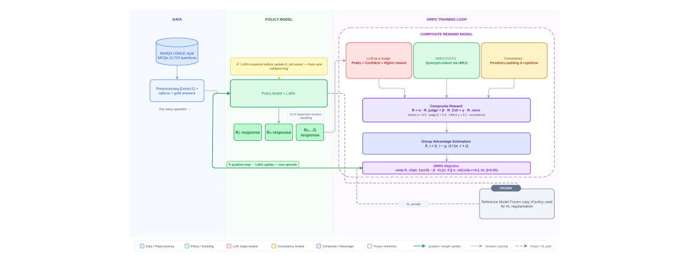

**Why this ranks #9**: A genuinely new soft-verifier formulation - graded UMLS concept overlap instead of binary RLVR - with clean multi-seed numbers and an honest set of negative results.

---

### 10. Arithmetic Actor Heads and Training Stabilization for Out-of-Distribution Reinforcement Learning `[wild-card]`

**arXiv**: [2610.05143](https://arxiv.org/abs/2610.05143) | **Score**: 6.8 (relevance 6 x 0.7 + quality 5 x 0.3) | **Tags**: rl-algorithm, theory | **Categories**: cs.LG | **Pages**: 23

**Authors**: Yifan Zhang, Liang Zheng

**Affiliation**: ∗Central South University

**Abstract**

> Reinforcement learning (RL) policies can deteriorate under out-of-distribution (OOD) magnitude shifts. Starting from soft actor-critic (SAC) and its Bayesian Amnesic Piecewise-Robust (BAPR) predecessor, we study the causal-symbolic BAPR (CS-BAPR) family. The practical method combines six training-stabilization settings with alternative actor heads: a Neural Addition Unit (NAU) with a Neural Multiplication Unit (NMU)-inspired quadratic correction, a Kolmogorov-Arnold Network (KAN), or a multilayer perceptron (MLP) with rectified linear unit (ReLU) or hyperbolic-tangent activations.

**Key findings**

- **Finding**: Proves a conditional extrapolation bound for any differentiable deterministic policy: ||pi(x_ood) - pi_ref(x_ood)|| <= delta + eps*||d|| + (L_err/2)*||d||^2, with delta, eps bounding value and derivative error at the training reference state and L_err bounding derivative-error growth along the connecting segment.

- **Finding**: The layer-level results are sharp - an isolated Neural Addition Unit has constant derivative D_H_NAU(z) = W_NAU for all z, so Lipschitz constant 0, while scalar ReLU admits no finite Lipschitz derivative on any interval crossing zero. The authors explicitly note these layer facts do not certify the historical actor, which adds nonlinear features, a quadratic branch and tanh action squashing.

- **Finding**: On a 12-line SUMO-calibrated bus-holding benchmark, all four stabilized actor-head variants (NAU+quadratic, KAN, ReLU MLP, tanh MLP) improve median returns over unstabilized BAPR under static, abrupt and oscillating demand shifts up to 50x nominal flow, with stabilization credited for most of the gain. The paper reports these as relative improvements without absolute return tables in the extracted text.

- **Recommendation**: Read if you build arithmetic-layer actors for out-of-distribution magnitude extrapolation and want to know exactly which assumptions the guarantee needs.

**Key figures**

*Framework / architecture - Algorithm 1 summarizes the primary pipeline. The replay buffer B supplies sampling distribution D; Nupd is the number of gradient updates per collection step. The optional symbolic loss coefficients are λsym for the critic target and λJC for the actor. The primary transit configuration sets both to zero.*

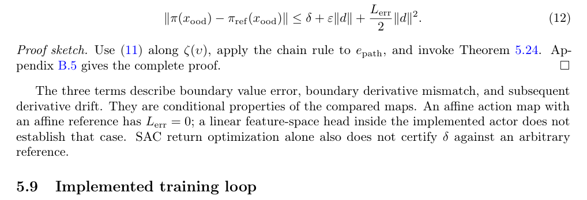

**Why this ranks #10**: Careful, self-limiting theory about out-of-distribution extrapolation, with the empirical side confined to one transit benchmark reported qualitatively.

---

## Footer

- Total papers scanned across all 7 arXiv categories: **879**
- Papers read in full for this digest: **87**
- rl track final top-10: **10**
- Wild-cards in this track: **4**
- Figure assets: `res/` (82 images shared across all 5 tracks)

Generated by the `mine-arxiv-daily-digest` skill. Sister file: `2026-10-06_rl_entry.md`.
