# ArXiv Daily Digest - 2026-10-07 (AIGC 音频生成与编辑, 10 papers)

**Generated**: 2026-10-07 17:00 CST

**Source**: arXiv cs.CV, cs.SD, eess.AS, cs.CL, cs.AI, cs.RO, cs.LG submissions, window 2026-10-06 UTC (the latest announced batch as of 2026-10-07 17:00 CST)

**Track**: aigc_audio (top 10 of 531 papers scanned, 50 full reads)

**Scope**: world-model audio, training-free voice conversion and anonymization, text-guided audio FX, audio-driven lyric generation, morphing evaluation, neural audio decoder analysis, music source restoration, TTS activation steering and RL, multilingual anonymization security

---

本批音频生成线明显偏薄（cs.SD 仅 15 篇、eess.AS 仅 8 篇），用 4 个 wild-card 补足，但前两篇仍撑得住。**WorldSonus** 把声音带进视频世界模型，同时要满足实时生成、流中指令交互控制、与场景几何和相机运动对齐的空间立体声三个约束；其单张 H100 上每 100ms 音频块 1.2ms（RTF = 0.41）是全文最有门槛意义的数字——它让「给世界模型加声音」从事后离线生成变成可交互的闭环组件。**Voice Anonymization** 把无分类器引导复用为免训练匿名化的连续旋钮，直接作用于已有的流匹配语音转换系统。语音保护与攻击构成一组应当配对的阅读：**多语攻击者评测**说明单语攻击下的高成功率不等于稳健性，而前者正是后者的实际风险。其余集中在工具层与评测层——合成器参数空间重解释为音色塑形控制、真实演唱音频驱动的粤语歌词生成（旋律以录音或哼唱形式存在时的隐式音高）、morphing 的 Sobolev 目标度量、RAVE 解码器激活的逐层与跨层分析、音乐源恢复的三阶段排序，以及 TTS 的提示相对激活引导与假名域 ASR 奖励。

---

## Top 10 — AIGC 音频生成与编辑

### 1. WorldSonus: Bringing Sound to Worlds

**arXiv**: [2610.08760](https://arxiv.org/abs/2610.08760) | **Score**: 9.0 (relevance 9 x 0.7 + quality 9 x 0.3) | **Tags**: AIGC-audio | **Categories**: cs.AI, cs.CV, cs.SD, eess.AS | **Pages**: 25

**Authors**: Pengjun Fang, Jingyi Fa, Kam Man Wu, Jiaming Wang, Haoyuan Huang, Yaguang Wu, Xiangjun Huang, Ziyang Ma, Weijia Chen, Hongyu Liu, Zeyue Tian, Qifeng Chen

**Affiliation**: 1The Hong Kong University of Science and Technology | 4Shanghai Jiao Tong University | 41.2 ms per 100 ms audio chunk (real-time factor, RTF = 0.41) on a single NVIDIA H100 GPU.

**Abstract**

> Recent advances in world models have enabled increasingly realistic visual synthesis. However, these generated environments remain largely silent. Bringing sound to world models poses three core challenges: real-time generation to keep pace with interactive video streams, interactive control to respond to mid-stream sound instructions, and spatially aligned stereo to reflect scene geometry and camera motion. To address these demands, we introduce WorldSonus, an interactive video-to-audio framework designed for real-time spatial sound synthesis in world models. For real-time generation, WorldSonus employs a streaming causal autoregressive diffusion architecture that synthesizes audio chunks at a low real-time factor (RTF) of 0.41. For interactive control, we incorporate an audio-centric captioning pipeline with chunk-indexed prompt scheduling, enabling dynamic manipulation of sound events during generation. For spatial alignment, we leverage high-quality stereo supervision curated from diverse stereo and ambisonic data. Extensive experiments demonstrate that while tailored for world models, WorldSonus generalizes effectively to open-domain video-to-audio benchmarks, matching or outperforming state-of-the-art bidirectional models in both acoustic quality and spatial alignment. Project page: https://noizai.github.io/WorldSonus/

**Key findings**

- **Finding**: 把声音引入视频世界模型需要同时满足三件事：跟上交互式视频流的实时生成、能响应流中途的音频指令、输出与场景几何和相机运动对齐的立体声。

- **Finding**: 框架为交互式 video-to-audio；报告的实时性指标为单张 NVIDIA H100 上每 100ms 音频块 1.2ms，即 RTF = 0.41。

- **Inference**: RTF 0.41 是这篇真正的门槛——它把'给世界模型加声音'从事后离线生成变成可交互的组件，这个量级差异决定了方法能否进入闭环。

- **Recommendation**: 想给世界模型加声音的首选参考；三个约束里空间立体声对齐与本批 embodied 线的 3D 一致性是同一个问题。

**Key figures**

*Framework / architecture - Figure 1 Overview of WorldSonus. (a) Causal streaming pipeline: Video frames map to two- timescale visual tokens conditioning an AR transformer and a rectified-flow head. (b) Training-only ShiftNCE:*

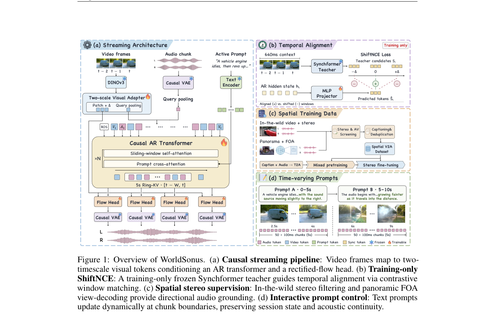

*Main result - Figure 1 Qualitative stereo layout versus bidirectional baselines on two interactive clips. Red boxes mark sources. Energy-balance curves show left (negative) versus right (positive) channel dominanc*

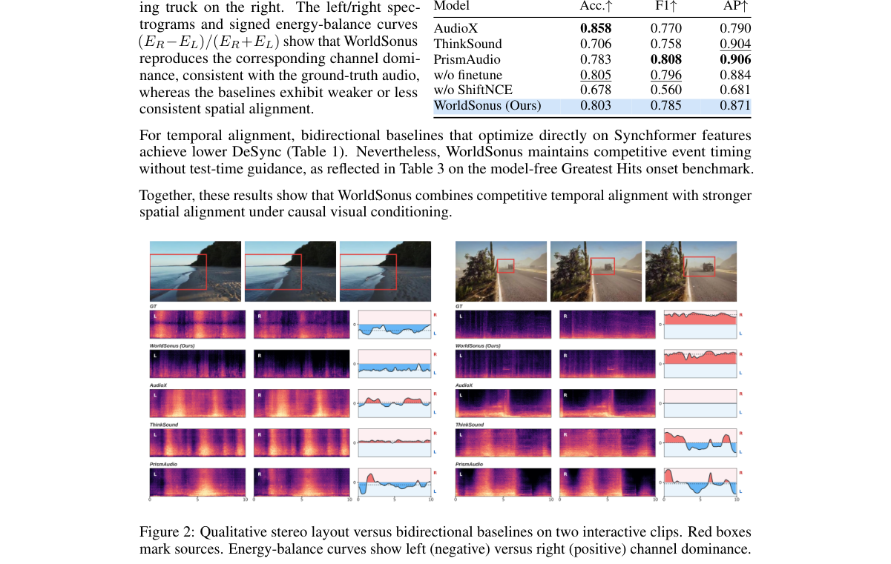

**Why this ranks #1**: 把音频接进世界模型且做到单卡实时，是本批音频生成线最有想象力的一篇。

---

### 2. Voice Anonymization Made Simple: Training-Free Anonymization with Projected Classifier-Free Guidance

**arXiv**: [2610.08276](https://arxiv.org/abs/2610.08276) | **Score**: 8.0 (relevance 8 x 0.7 + quality 8 x 0.3) | **Tags**: AIGC-audio | **Categories**: eess.AS | **Pages**: 7

**Authors**: Xiang Shi, Han Zhu, Ming Li, Xiaoxiao Miao

**Affiliation**: ∗Duke Kunshan University | †Xiaomi Corporation | ‡School of Artificial Intelligence, The Chinese University of Hong Kong, Shenzhen

**Abstract**

> Voice anonymization aims to conceal speaker identity while preserving linguistic and paralinguistic information, yet many existing methods require dedicated training. We propose a training-free, two-stage anonymization method for pretrained flow-matching voice conversion systems. In the condition-construction stage, the source content representation is regenerated under a randomly selected speaker context to reduce residual source-speaker information while preserving linguistic content. In the speech-generation stage, the source speech is used to identify the generation direction associated with the original speaker, and the source-aligned component is suppressed while useful content guidance is retained. The proposed method modifies only inference-time conditioning and guidance, without updating any pretrained parameters. Experiments on VoicePrivacy 2026 Track 1 show that the two-stage method improves speaker privacy while maintaining competitive word error rate and emotion recognition performance.

**Key findings**

- **Finding**: 既有匿名化方法都需要专门训练；本文目标是免训练地作用于已有的流匹配语音转换模型。

- **Finding**: 两阶段设计：条件构造阶段在随机选取的说话人上下文下重新生成源内容表示，以削减残余源说话人信息同时保留语言内容；语音生成阶段使用投影后的无分类器引导。

- **Inference**: 复用 CFG 作为身份-保真度的连续旋钮，比训练专用匿名模型更容易进入现有链路——代价是控制精度受预训练模型能力上限约束。

- **Recommendation**: 与 #10 一对读：#10 说明多语场景下攻击者会打穿这类匿名化，单独看 #2 的成功率容易高估效果。

**Key figures**

*Framework / architecture - Figure 1 Overview of standard voice conversion, built-in anonymization, and the proposed training-free method within the shared Seed-VC v2 backbone. The proposed method modifies condition construction*

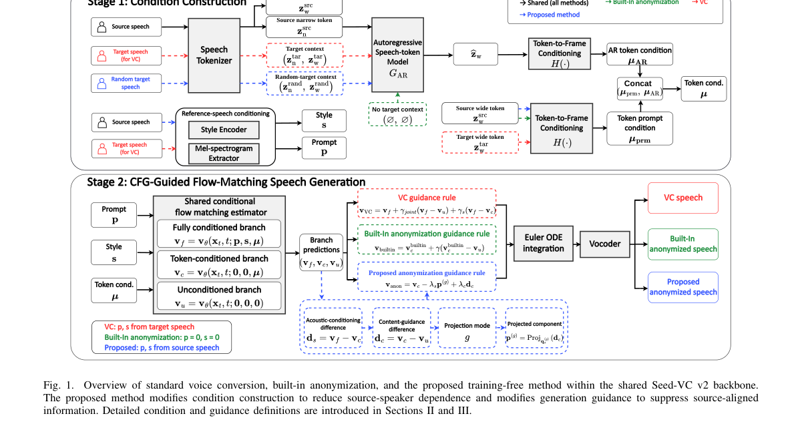

*Main result - Figure 1 Effects of λs and λc on the 30-utterance screening subset. A higher dissimilarity score indicates lower source-speaker similarity, and WER is computed at the corpus level.*

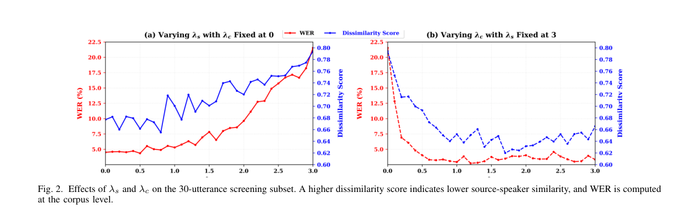

**Why this ranks #2**: 把 CFG 复用为匿名化旋钮，无需重训即可部署。

---

### 3. CTAG-FX: Reinterpreting Synthesizer Parameter Spaces for Expressive Tone-Shaping Audio FX Design

**arXiv**: [2610.08182](https://arxiv.org/abs/2610.08182) | **Score**: 7.7 (relevance 8 x 0.7 + quality 7 x 0.3) | **Tags**: AIGC-audio | **Categories**: cs.SD, eess.AS | **Pages**: 8

**Authors**: Geonung Jo, Jongeun Choi

**Affiliation**: Yonsei University, Seoul 03722, Republic of Korea

**Abstract**

> Recent text-guided audio FX research has focused on translating natural-language descriptions into parameters or chain configurations within existing FX systems. However, comparatively little attention has been paid to how the internal control space of an individual FX processor can itself be constructed. To address this gap, we propose CTAG-FX, which functionally reinterprets the roles of 78 parameters in a text-conditioned synthesizer configuration as controls of a tone-shaping FX processor. Each synthesizer configuration defines a fixed tone-shaping processor that can be repeatedly applied to new audio inputs rather than producing only a one-off rendered output. The text-conditioned synthesizer configurations are generated using A&R-CTAG, a retrieval-enhanced extension of CTAG. We evaluate CTAG-FX through signal-level analysis, together with a scrambled-mapping ablation in which parameter-to-control assignments are randomly permuted to assess the contribution of the proposed role assignment. Role-based mapping produces prompt-distinct spectral and nonlinear behavior, whereas scrambling reduces this prompt-specific differentiation and yields a more prompt-insensitive nonlinear profile. Overall, these results suggest that synthesizer parameter spaces can serve not only as sound-generation spaces but also as design resources for constructing new audio-FX control spaces. Audio samples are available at https://taylor3527eg-hub.github.io/ctag-fx-platform-demo/.

**Key findings**

- **Finding**: 既有文本引导音频效果工作把自然语言映射到参数或效果链配置，但对单个效果处理器内部控制空间的构造关注很少。

- **Finding**: CTAG-FX 把合成器配置中 78 个参数的角色功能性地重新解释为音色塑形效果处理器的控制量，每个合成器配置作为单位处理。

- **Inference**: 这条路的价值在于不需要训练新模型——重解释现有参数空间的角色，文本控制就成了配置层的问题。

- **Recommendation**: 做音乐生成或音频编辑工具链的值得看；78 个参数这个具体设定决定了迁移成本。

**Key figures**

*Framework / architecture - Figure 1 Representative prior text-guided FX workflow.*

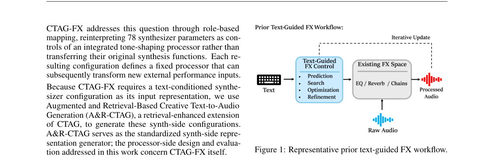

*Main result - Figure 1 Overall CTAG-FX workflow. A&R-CTAG generates a text-conditioned synthesizer configuration, and CTAG-FX maps the functional roles of its parameter groups to controls in a tone-shaping process*

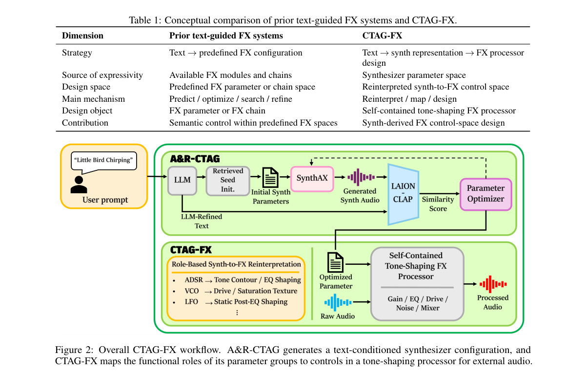

**Why this ranks #3**: 参数空间重解释是给现有合成器加文本控制的一条便宜且可复现的路。

---

### 4. ARIA: Audio-Driven Melody-Tone Relation Modeling for Cantonese Lyric Authoring

**arXiv**: [2610.07902](https://arxiv.org/abs/2610.07902) | **Score**: 8.0 (relevance 8 x 0.7 + quality 8 x 0.3) | **Tags**: AIGC-audio | **Categories**: cs.CL, cs.SD | **Pages**: 24

**Authors**: Shengyu Li, Jinting Wang, Li Liu

**Affiliation**: The Hong Kong University of Science and Technology (Guangzhou)

**Abstract**

> Cantonese lyric writing requires close alignment between lexical tones and melodic pitch. Existing melody-guided lyric generation methods typically rely on symbolic melody to generate lyrics. However, in real songwriting scenarios, melodies are often expressed as raw singing audio or hummed recordings, where pitch is implicit, noisy, and unstructured, making these methods difficult to apply directly. To address this limitation, we propose ARIA, a two-stage audio-driven melody-tone relation modeling framework for Cantonese lyric authoring that generates Cantonese lyrics from singing recordings with provided character-level timestamps. Specifically, we first design a Tri-Stream Relation-Aware Tone Estimator (TRATE) to predict 0243 sequences from timestamped singing audio by modeling multi-stream acoustic cues and relational tonal structure. We then propose a Decoupled Retrieval-Augmented Tone-Conditioned Lyric Generator (DRA-TCLG) to generate fluent lyrics conditioned on predicted tonal plans with retrieval-enhanced lexical guidance. Moreover, we construct a large-scale aligned audio-Jyutping-0243 dataset from real Cantonese singing recordings to support this new task. Experimental results demonstrate that ARIA achieves strong performance in both 0243 prediction and tone-consistent lyric generation, validating the effectiveness of the proposed framework.

**Key findings**

- **Finding**: 粤语歌词生成需要词调与旋律音高精确对齐，而符号旋律驱动的现有方法无法直接用于真实录音或哼唱这类含噪输入。

- **Finding**: ARIA 提出两阶段的音频驱动旋律-声调关系建模框架，直接从演唱音频建模音高。

- **Inference**: 音高从隐式音频里提取后再做词调对齐，等于承认'符号化中间表示'是现有方法的便利假设而非真实条件——这个转换未必限于粤语。

- **Recommendation**: 若你做歌声相关生成，这篇的输入端改造比模型端改动更值得借鉴。

**Key figures**

*Framework / architecture - Figure 1 Motivation of ARIA. Existing melody-aware lyric systems typically rely on symbolic melody or man- ually specified tone constraints. In contrast, ARIA re- ceives singing audio together with c*

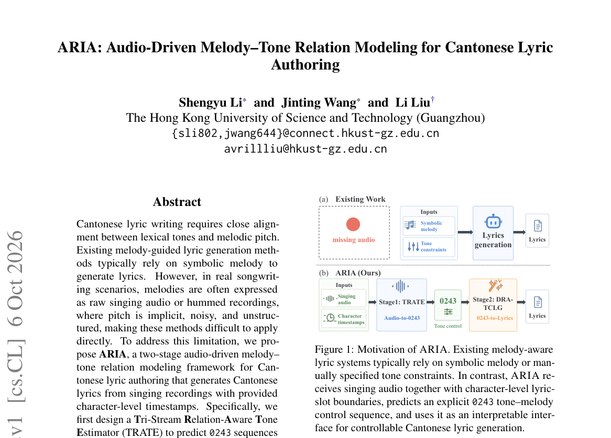

*Main result - Figure 1 Overall architecture of ARIA. The framework decouples audio-side tone-plan estimation and text-side lyric generation through a unified 0243 intermediate representation. In Stage 1, TRATE pre*

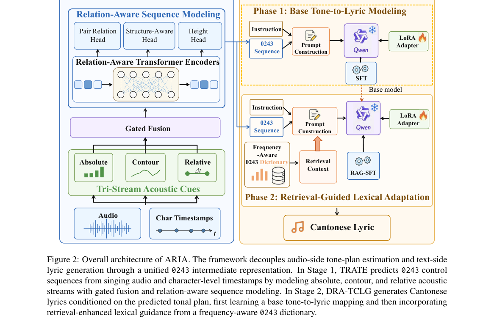

**Why this ranks #4**: 把歌词生成的输入从符号旋律换成真实音频，切中实际创作流程。

---

### 5. Sobolev Norms in Neural Embeddings Measure Audio Morphing Regularity

**arXiv**: [2610.08295](https://arxiv.org/abs/2610.08295) | **Score**: 7.0 (relevance 7 x 0.7 + quality 7 x 0.3) | **Tags**: AIGC-audio `[wild-card]` | **Categories**: cs.SD | **Pages**: 5

**Authors**: Théo Chasle Cauchy, Modan Tailleur, Barbara Pascal, Fanny Roche, Mathieu Lagrange

**Affiliation**: 1Nantes Universit´e, ´Ecole Centrale Nantes, CNRS, LS2N, UMR6004, F-44000 Nantes, France.

**Abstract**

> Morphing has recently gained renewed interest with the emergence of generative models, particularly in audio and image generation. In musical sound synthesis, morphing can generate intermediate sounds between two targets, helping musicians and sound engineers explore new sounds with interesting perceptual properties. As morphing is inherently defined in perceptual terms, evaluating this task is challenging. In this work, we introduce Sobolev Distances to Ideal Morphing (SDIM), a novel objective metric to quantify the regularity of audio morphing trajectories in perceptually relevant audio embedding spaces. Leveraging a physics-based sound synthesizer, we evaluate the discriminative power of SDIM on controlled morphing trajectories with varying degrees of regularity and compare it with that of existing audio morphing metrics. Results show that, contrary to state-of-the-art metrics, the proposed metric reliably discriminates desirable trajectories from adversarial ones.

**Key findings**

- **Finding**: 在音乐声音合成中，morphing 能在两个目标音之间生成中间音，产生有感知价值的新声音。

- **Finding**: 由于 morphing 在感知意义上定义，评估该任务很困难；作者提出 Sobolev Distances to Ideal Morphing (SDIM) 目标度量来量化规律性。

- **Inference**: 一篇纯评测论文出现在音频生成批次里，说明该方向的瓶颈已经不在生成能力而在度量——没有 SDIM 这类指标，改进无法被度量。

- **Recommendation**: 做生成音频评测的必读；Sobolev 距离的选择理由是全文的关键，取决于你关心的 regularity 是哪种。

**Key figures**

*Framework / architecture - Figure 1 Morphing trajectories from two sounds s and t in a per- ceptually correlated embedding space. Ideal linear regular trajec- tory (solid green), good quality morphing trajectory (solid blue), an*

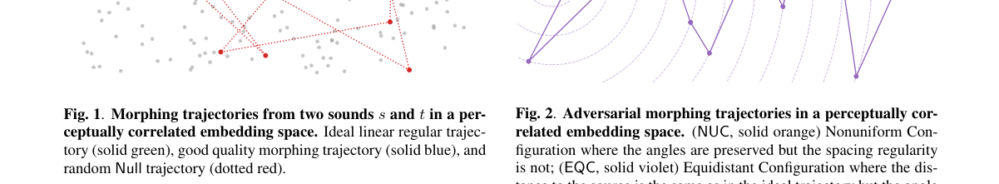

*Main result - Figure 1 Adversarial morphing trajectories in a perceptually cor- related embedding space. (NUC, solid orange) Nonuniform Con- figuration where the angles are preserved but the spacing regularity is no*

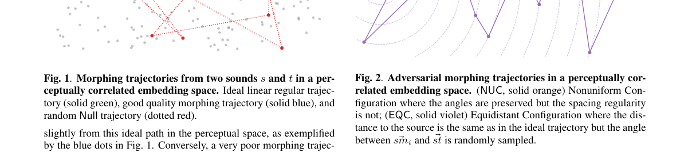

**Why this ranks #5**: wild-card：评测而非生成，但 morphing 的评估缺口是该方向真正的瓶颈。

---

### 6. Feature Encoding in VAE-based Audio Decoders: Effects of Input, Depth and Distribution

**arXiv**: [2610.07966](https://arxiv.org/abs/2610.07966) | **Score**: 7.0 (relevance 7 x 0.7 + quality 7 x 0.3) | **Tags**: AIGC-audio `[wild-card]` | **Categories**: cs.LG, cs.SD | **Pages**: 18

**Authors**: Louis McCallum, Mick Grierson

**Affiliation**: [not-found in PDF]

**Abstract**

> Neural audio synthesis models like the Realtime Audio Variational autoEncoder (RAVE) achieve impressive genera tion quality, yet how their internal representations encode musical features remains poorly understood. We present a systematic layer-wise and cross-layer cluster analysis of RAVE decoder activations across three models trained on different musical domains, tested with four stimulus types. We then evaluate architectural generalization with a general purpose EnCodec model. For RAVE, we find that synthetic stimuli are encoded well across models and audio features (pitch |\r{ho}|=0.45, 5.1x the null, BPM |\r{ho}| = 0.76, 8.6x the null). These results are reduced but still substantively apparent when using natural audio (mean across features |\r{ho}|=0.25, 2.8x the null). Natural audio sees a stronger encoding when nonlinear probes are used (mean across features R2=0.56, 18x the null, +0.152 nonlinear gain over the linear probe R2). Encoding strength varies throughout the layers of the decoder and an increased ability to joint-encode in the middle layers is seen across all audio features (\b{eta}2 all negative, p < 0.05). The general purpose EnCodec decoder also sees similar strong synthetic responses across audio features, similar nonlinear gains for natural audio joint encoding and similar depth profiles. We find the best cross-layer cluster improves the strength (r = 0.65, p = 0.006) and prevalence (r = 0.75, p = 0.001) of BPM encoding when compared against the best whole layers within the same section, with no effect for joint encoding. These findings advance the interpretability of neural audio models and inform targeted control strategies for neural synthesis.

**Key findings**

- **Finding**: 作者对三个在不同音乐域上训练的 RAVE 解码器激活做逐层与跨层聚类分析，用四类刺激测试。

- **Finding**: 随后用通用 EnCodec 模型检验架构泛化性。

- **Inference**: 逐层分析解码器激活，本质是在回答'神经音频解码器的 latent 里到底编码了什么'——这是所有 latent 音频编辑工作的隐含前提。

- **Recommendation**: 本文为 IEEE TASLP 录用稿，作者 Louis McCallum 与 Mick Grierson；正文机构信息在 PDF 首页未以可提取形式出现，故标 [unverified]。

**Key figures**

*Framework / architecture - Figure 1 Diagram of RAVE Decoder architecture*

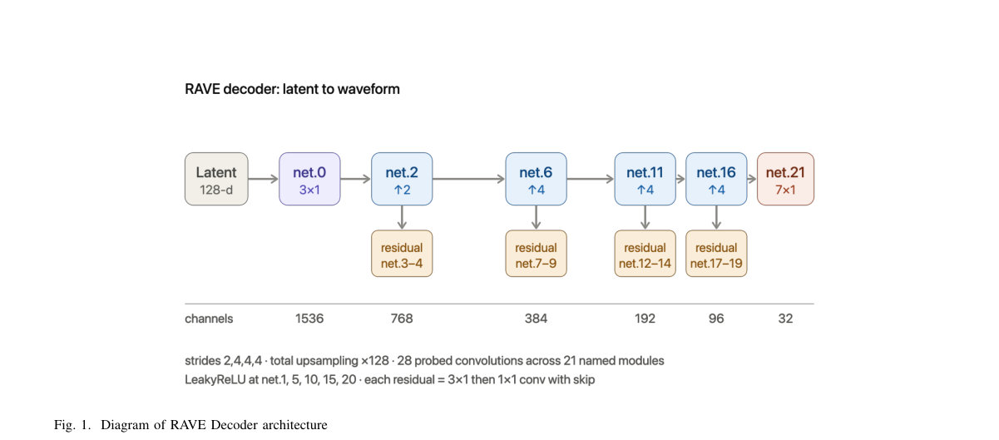

*Main result - Figure 1 Diagram representing the three metrics used for comparing the relationship of acoustic feature values and neuron activations. |ρ| can be further averaged across layers or models. Null p95 deri*

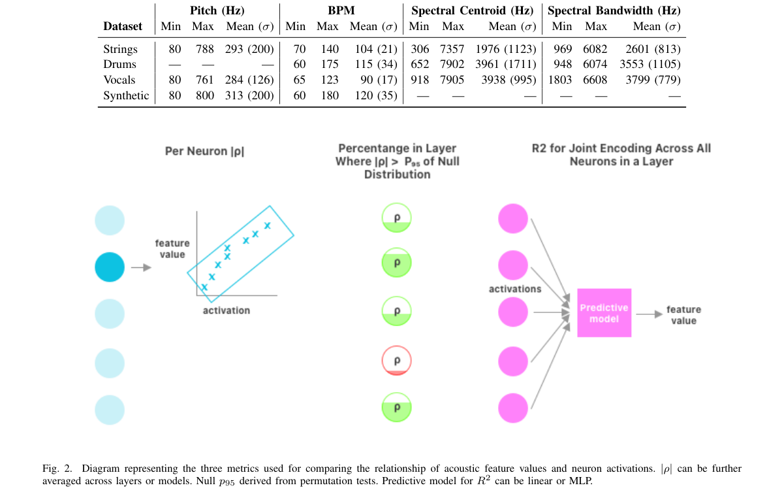

**Why this ranks #6**: wild-card：解读性工作，为'往神经音频 latent 里塞什么'提供经验依据。

---

### 7. Restore, Separate, Restore: A Modular Framework for Music Source Restoration

**arXiv**: [2610.08284](https://arxiv.org/abs/2610.08284) | **Score**: 7.0 (relevance 7 x 0.7 + quality 7 x 0.3) | **Tags**: AIGC-audio | **Categories**: cs.SD | **Pages**: 5

**Authors**: Tobias Morocutti, Emmanouil Karystinaios, Gerhard Widmer

**Affiliation**: ⋆Institute of Computational Perception, Johannes Kepler University Linz, Austria

**Abstract**

> Music Source Restoration (MSR) seeks to recover original, unprocessed instrument stems from mixed, mastered, and possibly degraded recordings. Unlike conventional source separation, which treats the mixture as a linear sum of clean sources, MSR must additionally invert nonlinear production effects, such as equalization and compression, and transmission-related degradations, such as codec artifacts. We propose a three-stage framework built around this distinction: (1) a mixture restoration model that addresses degradation before separation, (2) a single model that separates the restored mixture into eight target stems (vocals, guitars, keyboards, synthesizers, bass, drums, percussion, and orchestra), and (3) stem-specific restoration experts fine-tuned on the separator's own residual artifacts. Each stage improves restoration quality over the previous one on the MSR Challenge test set. We release code and models to support future research in MSR at https://github.com/theMoro/music_source_restoration.

**Key findings**

- **Finding**: 常规源分离把混合视为干净源的线性叠加，但音乐源恢复还须反演非线性制作效果（均衡、压缩）与传输退化（编解码伪影）。

- **Finding**: 作者提出三阶段框架：先做混合信号恢复处理退化，再做分离，最后再恢复。

- **Inference**: 三阶段的顺序不是工程流水线的偶然，而是对'在退化混合上分离会把编码伪影一并分离出来'这一问题的直接应对。

- **Recommendation**: 音乐分离方向的读者注意：若你的输入来自流媒体，先测量退化程度再决定是分离还是恢复。

**Key figures**

*Framework / architecture - Figure 1 Proposed 3-stage Music Source Restoration pipeline.*

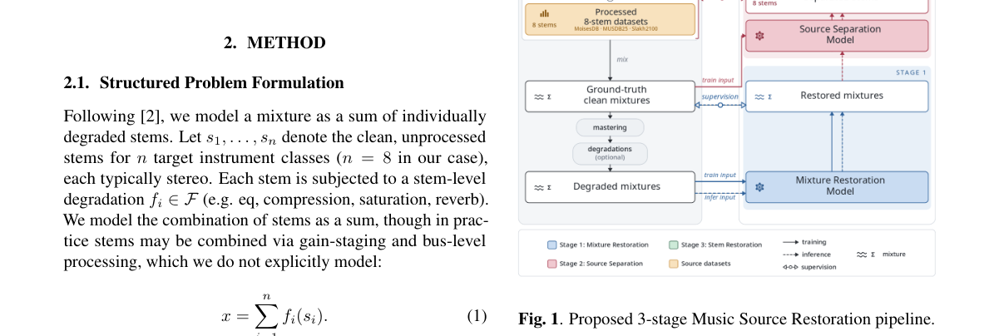

**Why this ranks #7**: '先恢复后分离再恢复'的排序是全文论点，退化信号上的分离错误会传播。

---

### 8. Loud and Clear: Dynamic Activation Steering for Improving Speech Intelligibility in Noisy Environments

**arXiv**: [2610.07647](https://arxiv.org/abs/2610.07647) | **Score**: 7.0 (relevance 7 x 0.7 + quality 7 x 0.3) | **Tags**: AIGC-audio | **Categories**: cs.CL, cs.SD | **Pages**: 5

**Authors**: Seymanur Akti, Alexander Waibel

**Affiliation**: 1Karlsruhe Institute of Technology (KIT), Karlsruhe, Germany | 2KIT Campus Transfer (KCT), Karlsruhe, Germany | 3Carnegie Mellon University (CMU), Pittsburgh, USA

**Abstract**

> Speech becomes less intelligible in noisy environments, and humans naturally adapt their voice to compensate. Inspired by this behavior, we investigate whether a text-to-speech (TTS) model can be guided to produce more intelligible speech using activation steering, without retraining. We focus on two characteristics of the Lombard effect: increased vocal effort and hyper-articulation. We introduce a prompt-relative steering mechanism that prevents steering effects from accumulating during generation while allowing their strength to be adjusted dynamically. Across seen and unseen speakers and multiple languages, our method produces systematic changes in Lombard-related acoustic features, preserves speaker similarity (89-95%), and reduces WER under background noise by 7-22% at 1 dB SNR. These results show that pretrained TTS models can be dynamically controlled to generate more intelligible speech without retraining.

**Key findings**

- **Finding**: 作者从 Lombard 效应的两个特征——发声用力增加与过度发音——出发，研究能否不重训地用激活引导让 TTS 更可懂。

- **Finding**: 提出提示相对（prompt-relative）的引导机制，防止引导效果在生成过程中累积，同时允许所需的引导强度。

- **Inference**: 激活引导在自回归生成中的典型失效是效果随 token 累积直至过冲；用相对提示而非绝对向量做锚定，是对该失效的直接修补。

- **Recommendation**: KIT + CMU 的组合少见；引导强度的扫描曲线是判断该机制是否只是软化版 CFG 的关键。

**Key figures**

*Framework / architecture - Figure 1 WER results in background noise with different SNR levels.*

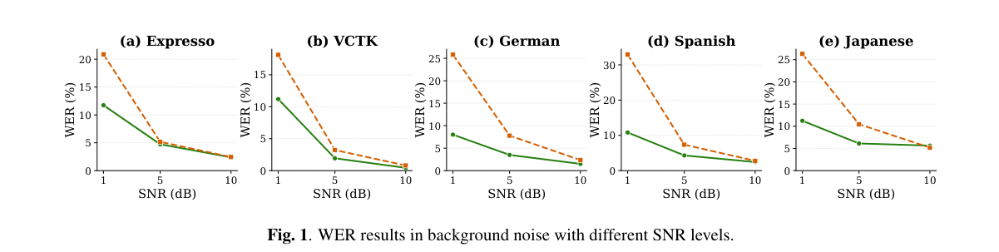

*Main result - Figure 1 Features of the dynamically steered speech. High- lighted part corresponds to active steering window.*

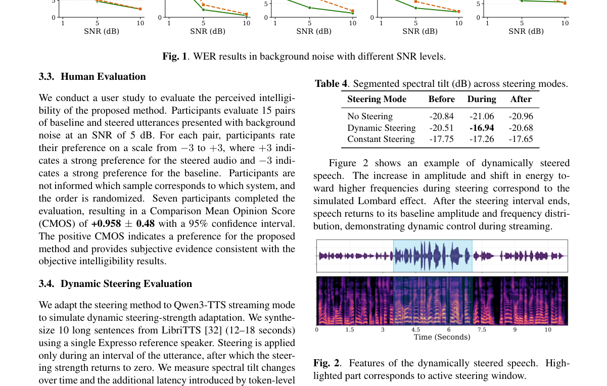

**Why this ranks #8**: '提示相对'解决了自回归生成中激活引导会累积漂移的老问题。

---

### 9. Pronunciation-Oriented Reinforcement Learning for Japanese Text-to-Speech with Kana-Domain ASR Rewards

**arXiv**: [2610.07575](https://arxiv.org/abs/2610.07575) | **Score**: 7.0 (relevance 7 x 0.7 + quality 7 x 0.3) | **Tags**: AIGC-audio, rl-algorithm | **Categories**: cs.SD, eess.AS | **Pages**: 5

**Authors**: Shiao Zhu, Lianbo Liu, Kai Washizaki, Koki Nikaido, Yui Sudo

**Affiliation**: SB Intuitions Corp., Tokyo, Japan

**Abstract**

> Character error rate (CER) computed by automatic speech recognition (ASR) is widely used as an intelligibility reward for reinforcement learning (RL) post-training of text-to-speech (TTS) systems. For Japanese, however, orthographic CER introduces a representation mismatch for pronunciation-oriented optimization: distinct kanji readings may collapse to the same orthographic representation, while equivalent pronunciations may admit different orthographic forms. We instead compute CER in the kana domain using a kana-transcribing ASR model and reference readings (Kana-CER). Under matched group relative policy optimization (GRPO) conditions, Kana-CER reduces target-kanji reading error by approximately 26% relative to the orthographic CER reward, while maintaining comparable orthographic CER and similar speaker similarity and objective speech quality. It also reaches its best validation performance in substantially fewer optimization steps (4k vs. 18k). We further observe severe output elongation under unregularized Kana-CER optimization, which is substantially suppressed by KL regularization.

**Key findings**

- **Finding**: 正字形 CER 对日语发音导向的优化存在表示错配：不同汉字读音可能塌缩为同一正字形序列，而相同发音又允许不同正字形形式。

- **Finding**: 作者改用假名域 ASR 计算 CER 作为 TTS 强化学习后训练的奖励。

- **Inference**: 这是一个容易被忽略但代价很大的错误：奖励在错误的标签空间上度量可懂度，优化会朝错方向走，而指标看起来仍然在下降。

- **Recommendation**: 做非英语 TTS 强化学习的读者注意——同一问题在中文、泰文等音节-文字分离的语言上都存在。

**Key figures**

*Framework / architecture - Figure 1 Evaluation metrics during RL on the validation split with β = 0.04. Curves show the mean across five generation seeds with ±1σ shading. Rings indicate the checkpoints se- lected by the common*

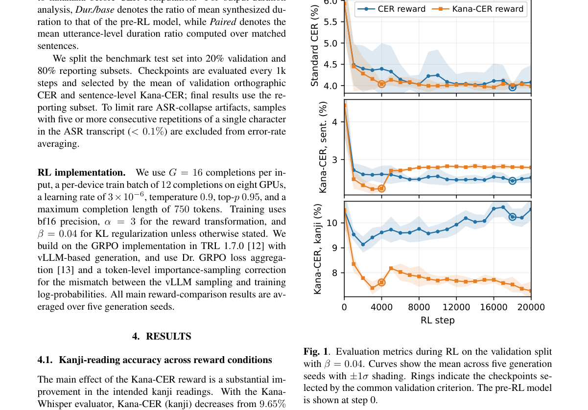

*Main result - Figure 1 Mean completion length during RL under the CER and Kana-CER rewards with and without KL regularization. Dashed: β = 0; solid: β = 0.04. The pale band shows the raw fluctuation across training*

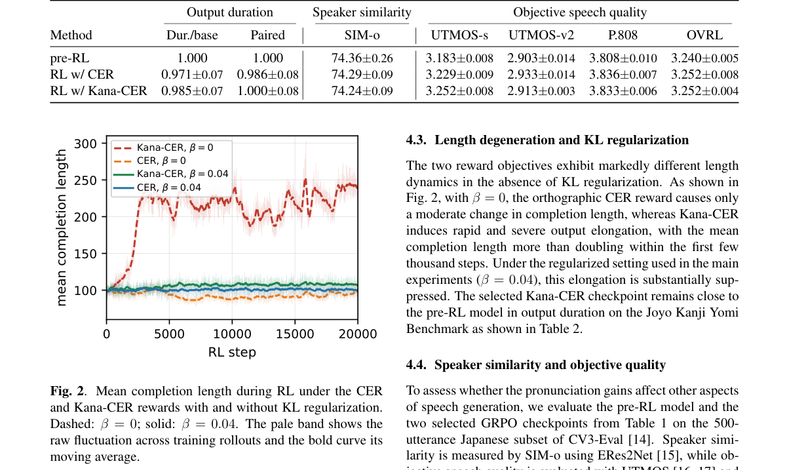

**Why this ranks #9**: 奖励函数的标签空间必须匹配音系空间而非正字空间——一个具体且可迁移的教训。

---

### 10. Exploiting Acoustic and Content-Oriented Speaker Verification Attacks Against Multilingual Voice Anonymization

**arXiv**: [2610.08107](https://arxiv.org/abs/2610.08107) | **Score**: 6.3 (relevance 6 x 0.7 + quality 7 x 0.3) | **Tags**: AIGC-audio `[wild-card]` | **Categories**: cs.AI, cs.SD | **Pages**: 7

**Authors**: Ridwan Arefeen, Ze Li, Rong Tong, Ming Li, Xiaoxiao Miao

**Affiliation**: ∗Singapore Institute of Technology, Singapore | †Wuhan University, China | ‡The Chinese University of Hong Kong, China | §Duke Kunshan University, China

**Abstract**

> Attacker ASV systems for voice anonymization have been studied primarily in English, leaving their behavior in multilingual settings largely unexplored. Conventional ASV has shown that both acoustic and contextual information are important for multilingual speaker verification. Inspired by this, we investigate whether the same holds for attacker ASV on anonymized speech. We evaluate both acoustic- and content-oriented attackers on multilingual anonymized speech and construct a multilingual voice-converted dataset to improve cross-lingual generalization. Our results show that attacker effectiveness depends on the linguistic utility of the anonymized speech. Overall, acoustic-oriented attackers achieve better performance. However, when linguistic information is well preserved, the performance gap between content- and acoustic-oriented attackers narrows compared with conditions involving stronger speech distortion. The multilingual voice-converted dataset further improves performance and partially reduces the cross-lingual gap. These findings highlight the need for more comprehensive attacker modeling and evaluation protocols that consider both privacy and utility, rather than relying on a attacker strategy\footnote{Full code and pretrained models and MultiVC Dataset link are available at: https://github.com/monkeyDarefeen/DAST

**Key findings**

- **Finding**: 既有匿名化攻击研究主要限于英语；作者在多语匿名化语音上同时评估声学型与内容型攻击者 ASV。

- **Finding**: 作者构建了多语语音转换数据集以支持该评测。

- **Inference**: 匿名化方法论文若只在英语、单攻击者设置下报告成功率，则其安全保证的下界未知——这正是 #2 面临的实际风险。

- **Recommendation**: 读 #2 之前先读这篇，可以避免把单语攻击下的高成功率误读为稳健性。

**Key figures**

*Main result - Figure 1 Average lazy-informed EER of the content-oriented (w2v-BERT-MFA) and acoustic-oriented (WavLM-ECAPA) attackers across six languages, under the lazy-informed threat model on the BM1 and BM2 bas*

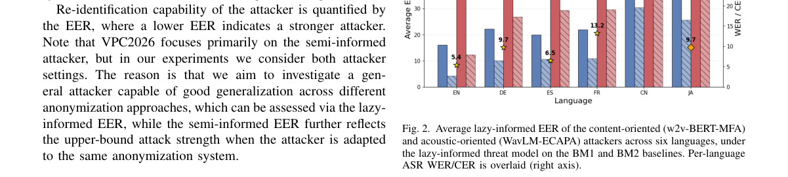

**Why this ranks #10**: wild-card：给 #2 的匿名化方法提供必要的对抗视角，两者应配对阅读。

---

## Footer

- Total papers reviewed across all 5 tracks: 50 (from 531 scanned)
- aigc_audio track final top-10: 10
- Wild-cards in this track: 4
- Figure assets: `res/` (shared across tracks)

Generated by `mine-arxiv-daily-digest` skill. Sister file: `2026-10-07_aigc_audio_entry.md`.
