# ArXiv Daily Digest - 2026-10-07 (AIGC 图像 / 视频 / 3D 生成与编辑, 10 papers)

**Generated**: 2026-10-07 17:00 CST

**Source**: arXiv cs.CV, cs.SD, eess.AS, cs.CL, cs.AI, cs.RO, cs.LG submissions, window 2026-10-06 UTC (the latest announced batch as of 2026-10-07 17:00 CST)

**Track**: aigc_visual (top 10 of 531 papers scanned, 50 full reads)

**Scope**: multi-reference conditioning, one/few-step image distillation, feed-forward 3DGS, video editing with object interaction, sparse attention for high-res DiT, motion customization, 4D reconstruction, 3DGS semantics, visual provenance

---

注意力预算是本批 AIGC 视觉线的主线，两篇从不同方向压缩同一笔开销：**RefRoute** 从参考侧出发，用紧凑残差条件加空间路由同时处理多参考图生成的表示成本与注意力成本；**Backend-Agnostic Sparse Attention** 从空间侧出发，明确把网格伪影归因于窗口间信息阻断而非窗口太小——这个归因决定了修复方向应是引入跨窗口通路，而不是缩小窗口。另有两篇把问题的定义重新改了：**Phase-wise Velocity Distillation** 主张有限预算应按相位分配而非全部花在单体学生的单次评估上；**Diverse Motion Customization** 则把内容泄漏归因于目标写成对参考的直接回归导致生成过程向参考坍缩。三维侧两条：**DensiTok** 论证少视图前馈 3DGS 的瓶颈在重建头之前的内部表示本身（未观测区域根本没有证据），**4D-HOF** 把视觉基础模型的粗糙状态估计当作流匹配的源分布，绕开从随机噪声生成交互的不稳定性。**ALIVE** 是本批视频编辑最强的一篇，它整理的 35,800 条编辑对本身就说明：物体参与交互是数据属性，不是建模属性。

---

## Top 10 — AIGC 图像 / 视频 / 3D 生成与编辑

### 1. RefRoute: Decoupling Conditioning Cost from References via Compact Residual Conditioning and Spatial Routing

**arXiv**: [2610.07720](https://arxiv.org/abs/2610.07720) | **Score**: 8.7 (relevance 9 x 0.7 + quality 8 x 0.3) | **Tags**: AIGC-image, AIGC-edit | **Categories**: cs.CV, cs.LG | **Pages**: 19

**Authors**: Wanning He, Yuyao Zhang, Yu-Wing Tai

**Affiliation**: Dartmouth College

**Abstract**

> Multi-reference image generation requires preserving the appearance of multiple subjects while composing them into a coherent scene. However, existing diffusion transformers commonly encode references as dense visual token grids and jointly process them with global attention, making conditioning increasingly expensive as the number and resolution of references grow. We present RefRoute, a framework that addresses both reference representation cost and attention overhead through two complementary mechanisms. Compact residual conditioning combines low-resolution latent tokens with lightweight residual features extracted from full-resolution pixels, reducing reference token counts while retaining fine-grained appearance cues. Condition routing and attention routing align reference tokens with their assigned target regions and restrict cross-reference interactions, while allowing selective reference access beyond region boundaries for scene integration. We further introduce RefRoute-Data for training many-reference generation models and ManyRef100, a benchmark spanning human, object, and mixed compositions with 10-17 references. After many-reference fine-tuning, RefRoute achieves an overall Weighted-Ref-VIEScore of 36.06 on ManyRef100, compared with 8.88 for FLUX.2-Klein-9B. Separate inference-cost evaluations show substantially slower latency growth as the reference count increases: at 16 references, our 50-step and 4-step configurations achieve $18.3\times$ and $14.2\times$ speedups over their corresponding FLUX baselines, respectively. These results establish compact reference representations and spatially routed attention as an effective approach to scalable many-reference image generation.

**Key findings**

- **Finding**: 多参考图生成的瓶颈被定位在两处：参考图的稠密 token 表示本身，以及让所有参考 token 参与全局注意力的计算方式；二者都随参考数量与分辨率增长。

- **Finding**: RefRoute 提出两个互补机制——紧凑残差条件（compact residual conditioning）与空间路由（spatial routing），分别对应上述两处。

- **Inference**: 参考条件化正在从'语义对齐'问题变成'注意力预算'问题，这与本批 2610.08772 对高分辨率 DiT 的稀疏化改造是同一条脉络。

- **Recommendation**: 与 #5 一起读：一个从参考侧裁剪注意力，一个从空间侧裁剪注意力，两者叠加的收益是否可加值得验证。

**Key figures**

*Framework / architecture - Figure 1 Demo of RefRoute. Our method enables efficient many-reference generation while pre- serving fine appearance details and spatial correspondence. With 16 references, we achieve an 18.3× speedu*

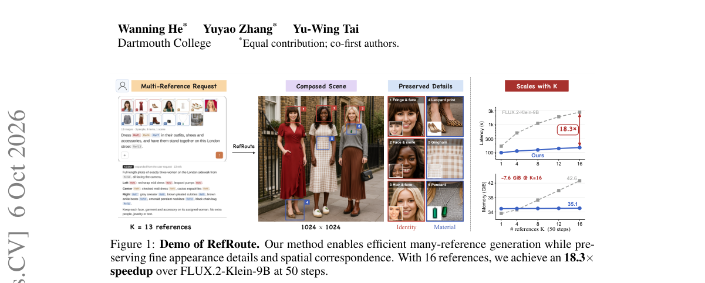

*Main result - Figure 1 Overview of RefRoute. Each reference is downsampled and VAE-encoded into compact tokens, while a residual encoder extracts complementary features from the full-resolution image. These featur*

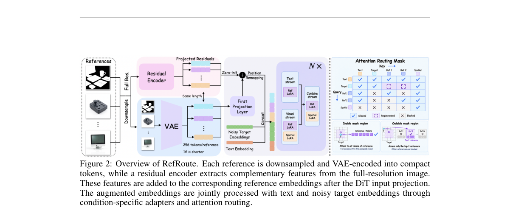

**Why this ranks #1**: 本批唯一同时攻击参考表示成本与注意力开销的工作，与 #5 的稀疏注意力形成同一问题的两种解法。

---

### 2. DensiTok: Making Feed-Forward 3D Gaussian Splatting See More Views Than It Is Given

**arXiv**: [2610.07958](https://arxiv.org/abs/2610.07958) | **Score**: 8.7 (relevance 9 x 0.7 + quality 8 x 0.3) | **Tags**: AIGC-3D | **Categories**: cs.CV | **Pages**: 28

**Authors**: Minhyeok Lee, Jungho Lee, Minseok Kang, Heeseung Choi, Ig-Jae Kim, Sangyoun Lee

**Affiliation**: 1Yonsei University | 2NAVER AI Lab | 3Korea Institute of Science and Technology (KIST)

**Abstract**

> Feed-forward 3D Gaussian Splatting (3DGS) reconstructs a scene in a single forward pass, replacing per-scene optimization with a network trained across many scenes. Its quality, however, degrades sharply as the number of input images drops. The bottleneck is upstream of the reconstruction heads: from a few unposed views, the internal representation they read carries no evidence for unobserved regions, leaving holes, floaters, and blur. The common remedy supplies that evidence as pixels, synthesizing extra views with an image or video generator and re-encoding them, which is costly and not 3D-consistent by construction. We instead densify the evidence itself. We present DensiTok, a plug-in module for pretrained feed-forward 3DGS models that densifies their internal geometry tokens directly, making a frozen backbone behave as though it had observed many more views than it was given. DensiTok compresses those tokens into a compact latent space, completes the latents of the unobserved viewpoints in a single flow-matching step conditioned on camera geometry, and decodes them back into tokens that the original reconstruction heads. The same module design can be integrated into different pretrained predictors while keeping each backbone and its reconstruction heads frozen. Completion in a low-dimensional latent space requires no image synthesis or additional encoder passes. Across three pretrained backbones and two benchmarks, DensiTok consistently improves sparse-view reconstruction and recovers much of the gap to dense-view reconstruction.

**Key findings**

- **Finding**: 前馈 3DGS 的质量随输入图像数下降而急剧退化，作者指出瓶颈不在重建头：从少数无位姿视图出发，内部表示中根本不携带未观测区域的证据，因此留下空洞、漂浮点和模糊。

- **Finding**: 常见补救是用像素合成额外视图来制造证据，DensiTok 改为在表示层面解决。

- **Inference**: 把少视图 3D 重建当作表示学习而非重建头容量问题，是一个会改变建模顺序的判断——若成立，先加大重建头无助于少视图。

- **Recommendation**: 做前馈 3D 重建的必读；消融里若去掉表示侧补救而只加大头部的对照，是全文最该核对的实验。

**Key figures**

*Framework / architecture - Figure 1 DensiTok augments geometry tokens for unobserved views while keeping the pretrained encoder and reconstruction heads frozen. With only three input views, it enables AnySplat to exceed its 16*

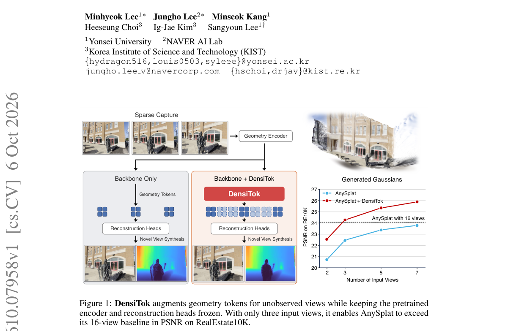

*Main result - Figure 1 Geometry token compression and completion. Stage 1 trains a VAE with Level- Adaptive Modulation (LAM-VAE) to compress and reconstruct geometry tokens. level-adaptive fusion and the VAE encod*

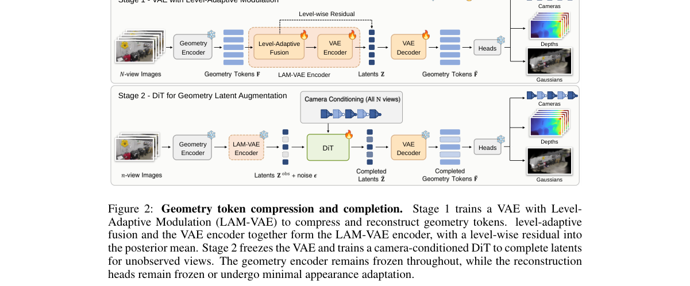

**Why this ranks #2**: 把少视图 3DGS 从重建头问题重新定义为表示问题，是本批 3D 线里诊断价值最高的一篇。

---

### 3. Two Halves are More than One: Phase-wise Velocity Distillation for Fast and High-Quality Image Generation

**arXiv**: [2610.08070](https://arxiv.org/abs/2610.08070) | **Score**: 8.7 (relevance 9 x 0.7 + quality 8 x 0.3) | **Tags**: AIGC-image | **Categories**: cs.CV | **Pages**: 33

**Authors**: Zhen Guo, Rongyuan Wu, Qiaosi Yi, Chenxi Xie, Xinyu Wei, Lei Zhang

**Affiliation**: 1Department of Computing, The Hong Kong Polytechnic University | 2OPPO Research Institute

**Abstract**

> Recent diffusion-based image generation backbones have grown substantially in scale, making the network inference cost increase rapidly. While diffusion distillation techniques can reduce the number of inference steps, high-quality image generation within a single full-backbone-forward compute budget remains challenging. Existing one-step methods typically allocate this budget to a single evaluation of a monolithic student. However, approximating the heterogeneous coarse-to-fine transport with a single monolithic mapping is difficult and often leads to over-smoothed outputs. To address this issue, we propose Phase-wise Velocity Distillation (PVD), which partitions the generation timeline into a coarse and a fine phase, and models the transition within each phase via the average velocity. A dedicated half-sized expert is assigned to each phase, decoupling structural composition from detail refinement while keeping the cumulative computation equivalent to one full-backbone forward pass. We show that the use of two half-sized phase-specific experts outperforms a single full-size monolithic student. On class-conditional image generation, PVD achieves an FID of 1.48 on ImageNet 256 x 256. On more complex text-to-image (T2I) tasks, PVD-distilled models (Stable Diffusion 3.5-Medium, FLUX.1-dev, Qwen-Image) produce results competitive with their multi-step teachers, significantly outperforming prior distillation methods. Moreover, across the evaluated T2I backbones, PVD reduces active parameters by 49.10-50.89% and peak VRAM by 45.76-48.36% compared to the corresponding teachers. Source code and distilled models are available at https://github.com/PolyU-VCLab/PVD.

**Key findings**

- **Finding**: 现有单步方法把有限计算预算全部分配给一次单体学生模型的前向评估，作者认为这无法逼近粗到细的非齐次传输。

- **Finding**: 方法端改为按相位（phase-wise）分解速度场并分阶段蒸馏，把粗到细的异质性显式写进预算分配。

- **Inference**: 这是在'步数'之外引入了第二个正交旋钮（相位结构），若两者可组合，则单步生成的质量上限比当前报告的更高。

- **Recommendation**: 关注它与两阶段/级联蒸馏工作的关系：这批预算分配问题在视频生成里尚未有对应处理。

**Key figures**

*Framework / architecture - Figure 1 Text-to-image results. Top: Teacher model (Stable Diffusion3.5-Medium, FLUX.1 dev and Qwen-Image under 50 × 2, 50, and 50 × 2 steps, respectively). Bottom: With two half-sized phase- wise ex*

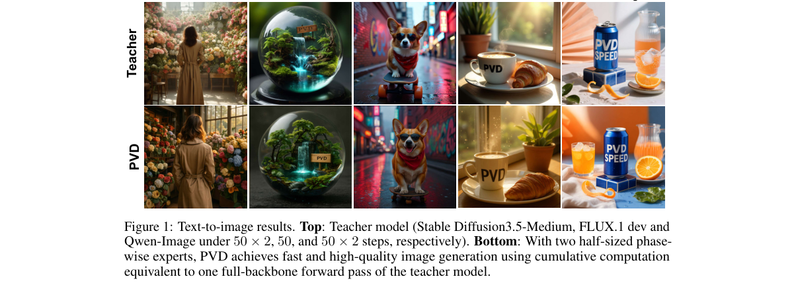

*Main result - Figure 1 Trajectory-based distillation (left) and distribution-based distillation (middle) employ a uniform student model to approximate the full coarse-to-fine mapping, while our proposed phase-wise*

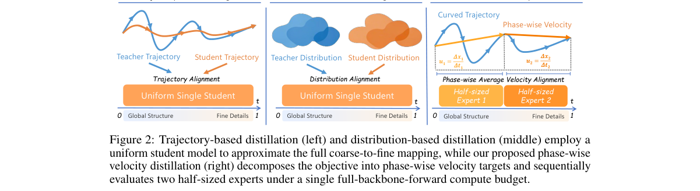

**Why this ranks #3**: 把'步数'换成'相位结构'来分配蒸馏预算，是对单步生成路线的一个结构性改进。

---

### 4. ALIVE: Interaction-Aligned Object Insertion for First-Frame-Guided Video Editing

**arXiv**: [2610.08779](https://arxiv.org/abs/2610.08779) | **Score**: 9.0 (relevance 9 x 0.7 + quality 9 x 0.3) | **Tags**: AIGC-video, AIGC-edit | **Categories**: cs.CV | **Pages**: 17

**Authors**: Zhenghong Zhou, Zhe Lin, Jiebo Luo, Yuqian Zhou

**Affiliation**: 2Adobe Research | University of Rochester.

**Abstract**

> Current video editors can insert objects but often struggle to make them participate in interactions such as being picked up or manipulated. We introduce ALIVE, a framework that makes inserted objects "alive" through coherent interactions with the source video's contents, using an edited first frame and an instruction naming only the added object. We curate 35,800 editing pairs combining 3D-rendered, model-generated, and real-world videos with general editing pairs from ROSE. Each pair differs in the target object's presence while preserving the surrounding action, teaching editors coordinated object behavior and source preservation. We further train a vision-language model (VLM) to predict interaction guidance from the same inputs. We introduce the ALIVE-interaction benchmark to assess interaction fidelity, source preservation, and visual coherence using a unified VLM-based protocol, and evaluate on the general video object insertion benchmark. Without VLM guidance, ALIVE improves Overall over the strongest evaluated baseline by 43.9% and 4.4% on the two benchmarks, respectively. VLM-predicted guidance further improves the ALIVE-interaction score by 0.95 points without additional user inputs.

**Key findings**

- **Finding**: 视频编辑器的失败模式很具体：插入的物体在后续帧里不参与交互（拿不起、推不动），即使插入本身看起来成功。

- **Finding**: ALIVE 用编辑后的首帧 + 只提及新增物体的指令驱动交互对齐，并构建了 35,800 条编辑对，数据来源包含 3D 渲染、模型生成与真实视频，并混入 ROSE 的通用编辑对。

- **Inference**: 交互性本质上是数据属性而不是建模属性——作者愿意为此构建三万五千对，说明问题出在训练分布里没有'物体参与交互'这件事。

- **Recommendation**: 若你的视频编辑模型插入物体后物体'躺平不动'，这篇的失败模式描述值得逐条对照。

**Key figures**

*Framework / architecture - Figure 1 Bringing inserted objects to life. Each panel shows the source video, edited first frame and object-only instruction, followed by corresponding results from Señorita and ALIVE. ALIVE enables*

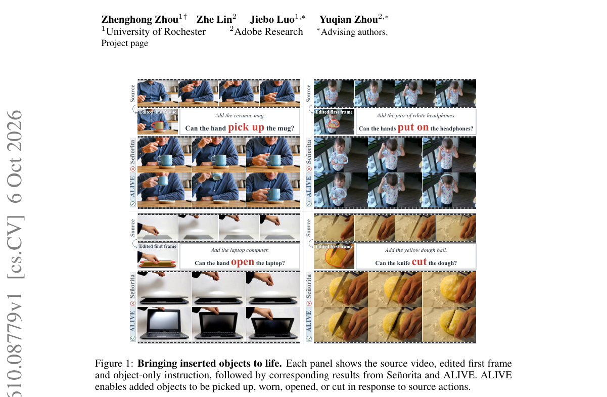

*Main result - Figure 1 ALIVE data construction and prompt annotation. Top: construction and quality filter- ing. Bottom: editing pairs from four sources (left) and multi-level prompts (right). P0 (no text) and P1*

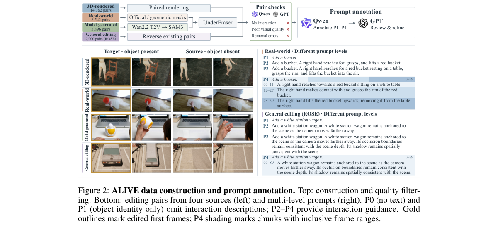

**Why this ranks #4**: 本批视频编辑线最强的一篇，且数据集规模与方法本身同等重要。

---

### 5. Backend-Agnostic Sparse Attention for Fast High-Resolution Visual Generation

**arXiv**: [2610.08772](https://arxiv.org/abs/2610.08772) | **Score**: 8.0 (relevance 8 x 0.7 + quality 8 x 0.3) | **Tags**: AIGC-image, AIGC-video | **Categories**: cs.CV | **Pages**: 21

**Authors**: Liao Ma, Jiayi Song, Yunfeng Wu, Songhua Liu, Peilin Zhao

**Affiliation**: 1School of Artificial Intelligence, Shanghai Jiao Tong University | 2School of Data Science, Fudan University | 3School of Computing and Data Science, The University of Hong Kong

**Abstract**

> Diffusion Transformers (DiTs) have achieved strong performance in image and video generation, but the quadratic complexity of full attention makes high-resolution generation computationally expensive. Window attention offers an efficient alternative, yet existing methods face a practical trade-off: partitioned window attention typically achieves computational efficiency consistent with its theoretical complexity. However, isolated windows block cross-window interaction, often introducing visible grid-like artifacts in the generated results. Fine-grained sliding-window attention effectively restores interactions across neighboring windows and improves visual quality. However, its irregular computation patterns create a substantial gap between theoretical and practical speedups and require specialized kernels tailored to each hardware backend. To tackle these challenges, we propose BASA, a backend-agnostic sparse attention, which brings the best of both worlds: visual quality and practical acceleration. Specifically, BASA replaces visual self-attention with shifted local-window attention. By introducing a structured window-shifting scheme across DiT blocks, we allow tokens divided by window boundaries in one layer to communicate in the following layers, thereby achieving global information exchange and eliminating window-induced visual artifacts. Notably, our design introduces no additional irregular operators or customized kernels, making it readily deployable on existing attention backends and closing the gap between theoretical sparsity and practical acceleration. Experiments demonstrate that BASA achieves measured speedups exceeding 90\% of the theoretical estimates on FLUX and delivers a 4.52$\times$ attention speedup on Wan while maintaining competitive generation quality.

**Key findings**

- **Finding**: 分区窗口注意力虽然计算量与理论复杂度一致，但孤立窗口阻断跨窗口交互，导致可见的网格状伪影。

- **Finding**: 作者给出后端无关（backend-agnostic）的稀疏注意力方案，可挂在不同生成骨干上。

- **Inference**: 把伪影归因于'信息阻断'而非'窗口太小'，决定了修复方向应是引入跨窗口通路而非缩小窗口——这是两者在设计上分岔的地方。

- **Recommendation**: 若你在部署高分辨率 DiT，网格伪影是能否上线的主要障碍，这篇的后端无关实现值得直接评估。

**Key figures**

*Framework / architecture - Figure 1 Ultra-resolution results generated by FLUX.1-dev and Wan2.1-1.3B with our approach. Resolution is marked on the bottom-right corner of each result in the format of width×height. Cor- respond*

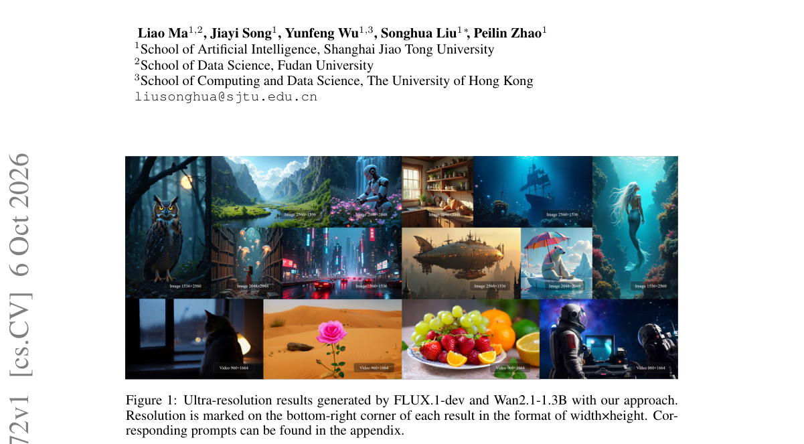

*Main result - Figure 1 Motivation for BASA. Swin-style window attention (Liu et al., 2021) provides fast in- ference but introduces severe window boundary artifacts. CLEAR (Liu et al., 2025) preserves high visual*

**Why this ranks #5**: 把网格伪影明确归因于窗口间信息阻断，并给出后端无关实现，工程可用性高。

---

### 6. Diverse Motion Customization via Control-based Dynamic Optimization

**arXiv**: [2610.07911](https://arxiv.org/abs/2610.07911) | **Score**: 8.0 (relevance 8 x 0.7 + quality 8 x 0.3) | **Tags**: AIGC-video | **Categories**: cs.AI, cs.CV | **Pages**: 23

**Authors**: Youngyoon Choi, Kihyun Kim, Jeongwoo Shin, Joonseok Lee

**Affiliation**: 1Seoul National University, 2AIM Intelligence

**Abstract**

> Despite recent advances in video generation, motion customization remains challenging due to content leakage, where appearance attributes from the reference video unintentionally propagate into the generated output. We identify this issue as a consequence of the generative process collapsing toward the reference video, which arises from formulating the learning objective as a direct regression on the reference. To address this, we propose Control-based Motion Customization (CMC), a principled training framework that is structurally robust to content leakage. Our key idea is to steer generative dynamics toward desired motion while avoiding collapse toward the reference video, which we formalize using Stochastic Optimal Control (SOC). Under this formulation, customized videos acquire the target motion yet remain within the pre-trained model's prompt-conditional distribution, where appearance is determined by the text prompt rather than the reference video. Furthermore, to improve efficiency, we tailor the SOC formulation to motion customization by eliminating the need for an explicit reward and introducing a timestep-adaptive motion cost that focuses only on early generative stages, accelerating training by 2.5 times. Extensive experiments demonstrate that CMC effectively mitigates content leakage and achieves competitive motion fidelity while preserving the diversity of the base model across diverse scenarios.

**Key findings**

- **Finding**: 运动定制的核心故障是内容泄漏——参考视频的外观属性（而非其运动）泄漏到输出中。

- **Finding**: 作者的归因链条是：把目标写成对参考的直接回归 → 生成过程向参考坍缩 → 外观随之泄漏。这指向目标函数而非注意力或条件注入方式。

- **Inference**: 若该诊断成立，现有很多运动定制工作的损失设计本身就编码了这个泄漏，重新调条件权重不会有帮助。

- **Recommendation**: 读的时候重点看它如何定义'坍缩'——如果坍缩可被直接测量，这个诊断就能被别人复用。

**Key figures**

*Framework / architecture - Figure 1 Overview of the proposed method. Our CMC mitigates content leakage, enabling diverse generation across varying prompts and samples.*

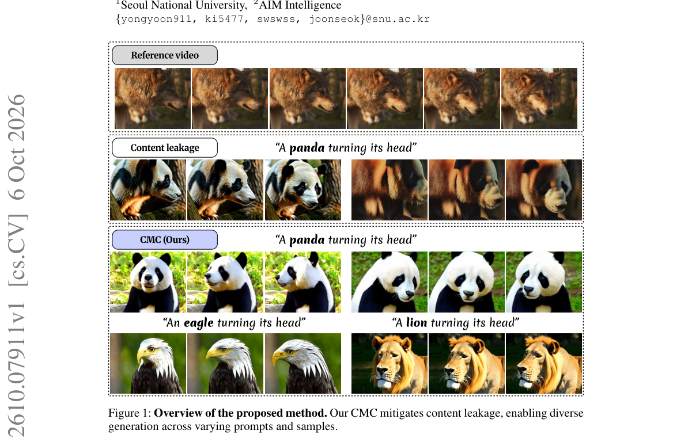

*Main result - Figure 1 Method Comparison. Existing methods vs. our control-based approach.*

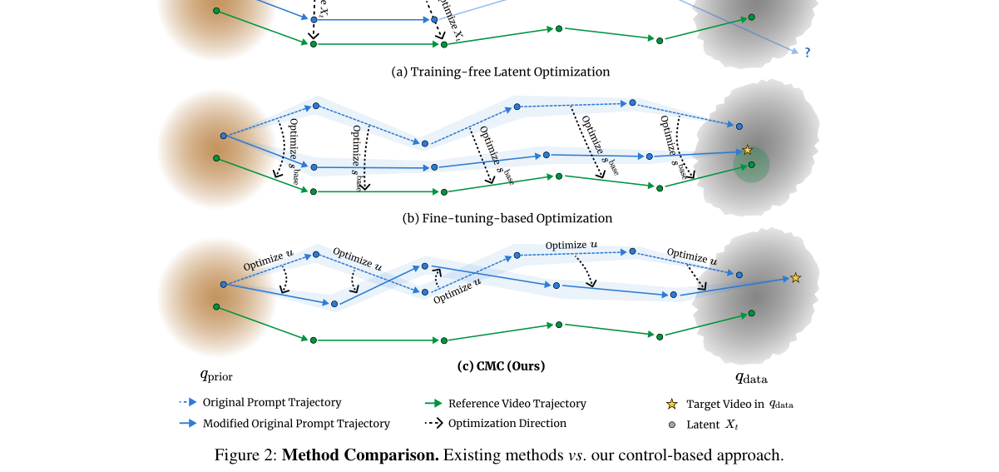

**Why this ranks #6**: 把内容泄漏诊断为目标设计失败而非条件化 bug，结论可直接指导重训。

---

### 7. Disentangling Dual Image References in Frequency Aware Diffusion Models for Personalized Generation

**arXiv**: [2610.07684](https://arxiv.org/abs/2610.07684) | **Score**: 7.7 (relevance 8 x 0.7 + quality 7 x 0.3) | **Tags**: AIGC-image, AIGC-edit | **Categories**: cs.AI, cs.CV | **Pages**: 28

**Authors**: Haipeng Liu, Yang Wang, Meng Wang

**Affiliation**: School of Computer Science and Information Engineering | Hefei University of Technology, China

**Abstract**

> Personalized image generation aims to synthesize text-driven images conditioned on reference images, while mainly casting the generation as image customization for foreground and style transfer for background. Previous arts of diffusion models suffers from the text misalignment with background for image customization and foreground for style transfer during the denoising process. Such facts, as we observed, rooted from the entanglement among hybrid frequency bands during the denoising process. To address such salient limitation, in this paper, we study personalized generation based on dual references - customization and color and style reference - and propose a paradigm to disentangle these Dual image references within Frequency-aware Diffusion Models, dubbed Dual-FDM, to simultaneously tackle two crucial personalized image generation tasks: customization style transfer and color style transfer, by disentangling different frequency bands via mask strategy within frequency domain. For customization style transfer, we replace the mid-frequency band of the background in the style reference with that from the foreground of the customized reference. For color style transfer, we substitute the low-frequency band of the background in the style reference with that from both the foreground and background of the color reference. Both the substituted frequency bands are used as the key and value to reconstruct the query foreground and background of the denoised personalized image.Extensive experiments validate the superiority of Dual-FDM over the state-of-the-art diffusion models for personalized image generation. Our code can be accessed from https://github.com/htyjers/Dual-FDM.

**Key findings**

- **Finding**: 现有做法把个性化生成拆成前景定制 + 背景风格迁移，但两者共享同一次去噪，导致定制时背景文本错位、风格迁移时前景文本错位。

- **Finding**: 作者把这一现象归因于去噪过程中混合频带之间的纠缠，并在频域层面解耦。

- **Inference**: 频域解耦与主流的语义路由/注意力分区是两条正交路线，若后者在你现有模型上收益有限，这篇是另一个值得试的轴。

- **Recommendation**: 关注频带划分的粒度是否可迁移——这决定了它是通用原则还是针对特定数据集的选择。

**Key figures**

*Framework / architecture - Figure 1 Personalized images generated by our Dual-FDM. (a) The generated examples of Dual- FDMcust for customized references (left) and style references (above); (b) The generated examples of Dual-F*

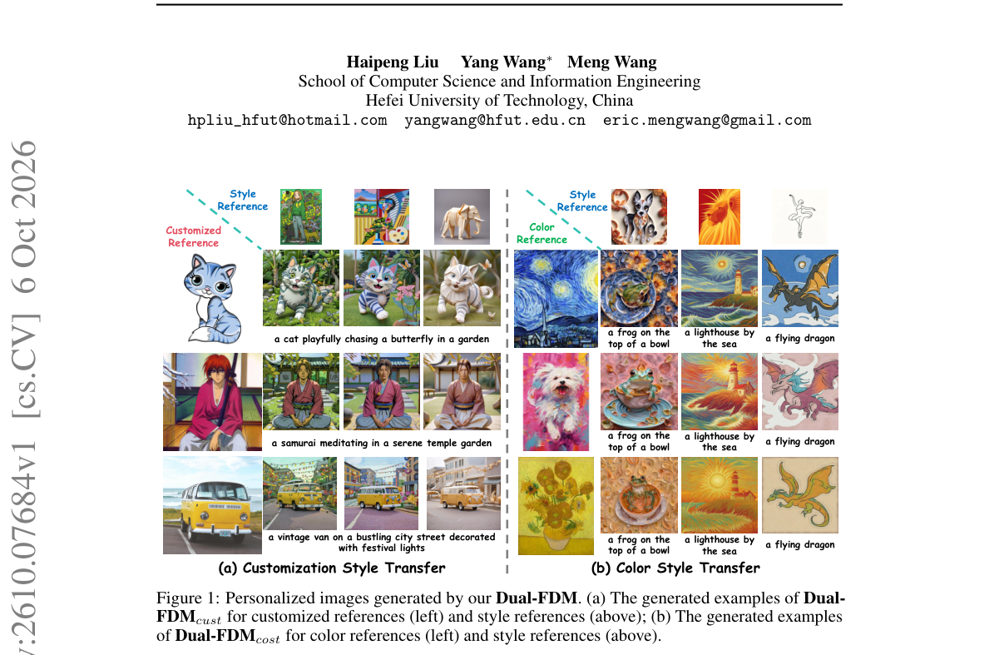

**Why this ranks #7**: 用频带纠缠解释个性化生成中的文本错位，给出了一个正交于语义路由的组织原则。

---

### 8. 4D-HOF: Hand-Object Flow Matching for Feed-Forward 4D Interaction Reconstruction

**arXiv**: [2610.08782](https://arxiv.org/abs/2610.08782) | **Score**: 8.0 (relevance 8 x 0.7 + quality 8 x 0.3) | **Tags**: AIGC-3D | **Categories**: cs.AI, cs.CV, cs.GR | **Pages**: 23

**Authors**: Shiqi Li, Sean Cho, Yijie Li, Fengzhi Guo, Bowen Wen, Cheng Zhang

**Affiliation**: 1Texas A&M University

**Abstract**

> Existing methods for 4D hand-object reconstruction often rely on costly per-sequence optimization, while generative approaches typically synthesize interactions from random noise, which can lead to unstable interaction prediction. We introduce 4D-HOF, a feed-forward framework that reconstructs 4D hand-object interactions from coarse but informative estimates produced by vision foundation models. Concretely, we learn a conditional flow matching model that transports foundation-model-derived hand-object states toward an interaction manifold, allowing the model to correct errors in translation, rotation, and alignment in a feed-forward manner. A key advantage of our generative formulation is that it naturally enables test-time guidance within the transport process. Rather than applying a separate post-hoc optimization after reconstruction, we directly steer the evolving generative states using physical interaction constraints and observed 2D evidence, allowing the reconstruction to be refined as part of the generative process itself. By training the generative model on diverse datasets, 4D-HOF generalizes robustly to challenging in-the-wild scenarios. Experiments on out-of-domain benchmarks show that 4D-HOF achieves state-of-the-art performance, producing more stable and accurate 4D hand-object reconstructions.

**Key findings**

- **Finding**: 两条既有路线各有硬伤：逐序列优化昂贵，从随机噪声出发的生成式交互预测不稳定。

- **Finding**: 4D-HOF 改为前馈框架，学习条件流匹配模型，把视觉基础模型导出的手-物状态输运到目标分布。

- **Inference**: 把基础模型的粗糙输出当作流匹配的源分布而非最终答案，是一个可复用的模式——它避免了纯噪声生成的稳定性问题，又避开了逐序列优化。

- **Recommendation**: NVIDIA 参与，值得注意是否开源；基础模型状态作为流匹配源分布这个做法可以迁移到其他前馈重建任务。

**Key figures**

*Framework / architecture - Figure 1 4D Hand-Object Flow Matching (4D-HOF). Given a monocular video of a hand interacting with an unseen object, we learn a flow matching model for accurate and efficient 4D hand-object interacti*

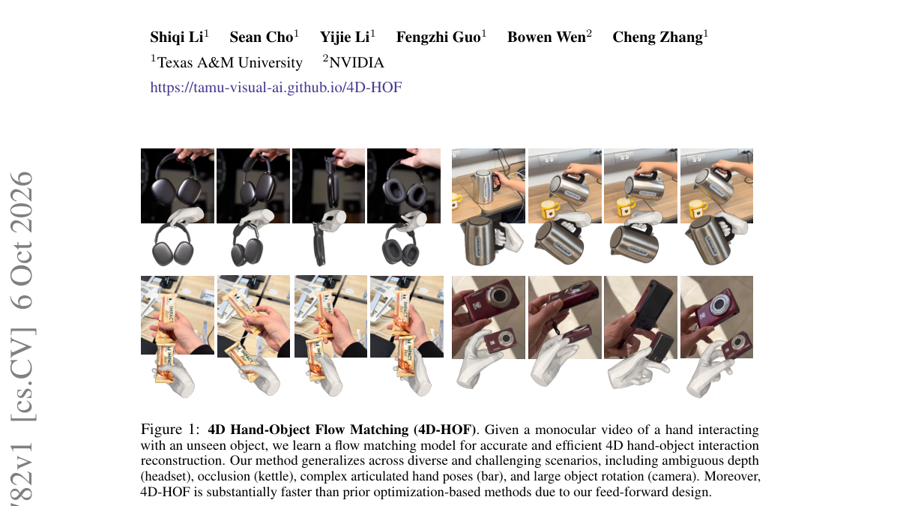

*Main result - Figure 1 4D-HOF overview. Given a monocular video, we construct initial hand-object states by leveraging foundation models, including (a) contextual scene parsing, (b) object reconstruction, (d) hand*

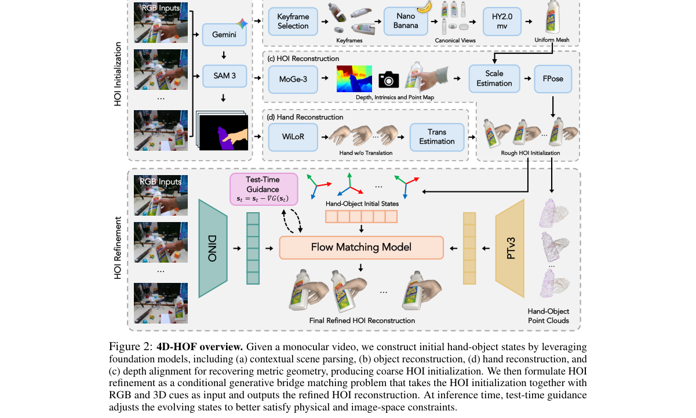

**Why this ranks #8**: 把基础模型的粗糙估计当作流匹配的源分布，是前馈重建与生成先验之间一个干净的接缝。

---

### 9. Post-Training Semantic Lifting for 3D Gaussian Splatting: Separating Detector, Lifting and Representation Error

**arXiv**: [2610.08756](https://arxiv.org/abs/2610.08756) | **Score**: 7.0 (relevance 7 x 0.7 + quality 7 x 0.3) | **Tags**: AIGC-3D | **Categories**: cs.CV | **Pages**: 18

**Authors**: Iván Verdugo Guerra, Ezequiel López Rubio, Jorge García González

**Affiliation**: University of Málaga

**Abstract**

> The same Gaussian of a 3D Gaussian Splatting model is seen from many views, and these views do not always agree on the class it belongs to. The Gaussian may be occluded in some of them, and the confidence of the detector is not the same from one view to another. The ground truth, on the other hand, is given as an annotated mesh, because two training runs do not produce the same Gaussians. In this work, we propose a post-training lifting method that works with one target class at a time and combines the information coming from all the views. Target and non-target evidence are accumulated simultaneously, weighted by the visibility of each Gaussian in each view. After that, the Gaussians are filtered with two thresholds: a main threshold $β$ selects the high-confidence seeds, and a lower one $γβ$ adds the connected components around them. For the evaluation, the labels are transferred from the Gaussians to the mesh vertices that are both visible and annotated. With this design, we can separate three sources of error: the 2D detector, the lifting and the transfer between representations. The thresholds and the transfer operator are chosen on seven Replica validation scenes, and the method is evaluated on ten held-out ScanNet++ scenes with the same values for every scene and class. The mean mIoU on the validation scenes was 0.93 with masks from the dataset annotations and 0.65 with YOLO masks, and on the ScanNet++ test scenes it was 0.80 and 0.54. Compared with thresholding the evidence per view, as a previous version of the method did, the fraction improves the test mIoU by 0.24 and makes it possible to use a single threshold for all the classes and scenes of both datasets. Finally, the error analysis shows that most of the remaining error comes from the detector.

**Key findings**

- **Finding**: 同一 Gaussian 在不同视角下被判为不同类别：视角可能被遮挡，且检测器置信度视角间不一致，而标注真值却只以 mesh 形式给出（两次训练的 Gaussian 本身也不同）。

- **Finding**: 方法为后训练式的语义提升，一次只处理一个目标类别，并组合多视角信息。

- **Inference**: 这是典型的可插拔层——它不改变 3DGS 本身，因此对已有重建结果也能后加，工程价值高于方法新颖度。

- **Recommendation**: 如果你手上已有训练好的 3DGS 又缺语义标签，这比重新训练语义分支便宜得多。

**Key figures**

*Framework / architecture - Figure 1 One view of the ScanNet++ test scene 21d970d8de. Even though YOLO does not detect the tables in this view, they are still labelled, since it detects them in other views.*

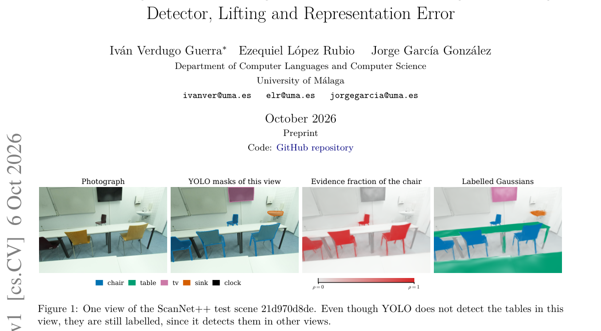

*Main result - Figure 1 The six stages of the method. Stages 2 and 3 do not depend on the class, and a change of β or γ only runs the pipeline again from stage 5.*

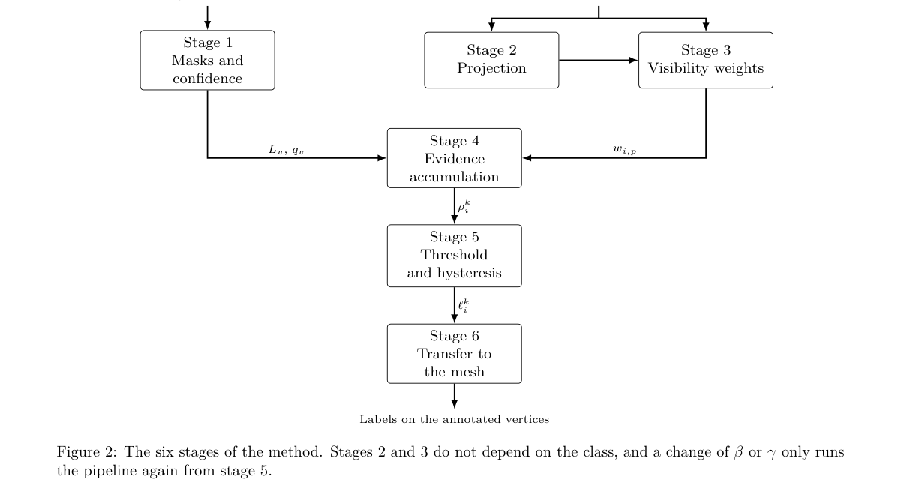

**Why this ranks #9**: 多视角证据聚合的可插拔后处理层，能加在任何 3DGS 上。

---

### 10. Rethinking Visual Provenance: Detection and Watermarking Across Direct Visual Generation and LLM-Driven Code Rendering

**arXiv**: [2610.08137](https://arxiv.org/abs/2610.08137) | **Score**: 7.3 (relevance 7 x 0.7 + quality 8 x 0.3) | **Tags**: AIGC-image, AIGC-video | **Categories**: cs.CR, cs.CV | **Pages**: 46

**Authors**: Zheng Gao, Xiaoyu Li, Zhicheng Bao, Yang Song, Jiaojiao Jiang

**Affiliation**: [not-found in PDF]

**Abstract**

> AI systems create images and videos with image/video generation models or by writing code and graphics descriptions that are then rendered. These routes can produce similar visible artifacts but expose different representations, intervention points, and provenance evidence. We develop a production-centered framework that compares detection and watermarking across both routes. An explicit verification specification distinguishes passive inference, message recovery, and authenticated provenance. We organize image, video, source-code, and rendering-aware watermarks by production stage. We examine the different requirements of generated images and video, plots and SVG, programmable video, and agent-composed workflows. Documented Claude, OpenAI, and rendering-tool interfaces connect the framework to concrete systems. We pose ten scoped research questions on identifiability, observability, fair comparison across stages, recoverable payload, reconstruction, synchronization, composition, hybrid local contribution, and private production-event authentication. The result is a conceptual research agenda grounded in published methods, inspected interfaces, and elementary boundary examples. It reports no experiments and claims no new theorems; its appendix results are elementary calculations, and documentation and source inspection establish interfaces, not empirical robustness.

**Key findings**

- **Finding**: 两条生成路径（模型直接生成 vs. LLM 写代码再渲染）产生相似可见伪影，但表示形式、可干预位置与可用溯源证据不同。

- **Finding**: 作者提出以生产为中心的框架，并用显式验证规格区分被动推断、消息恢复与认证溯源三种强度。

- **Inference**: 多数检测工作默认'生成模型'是唯一路径，因此把代码渲染归入检测器的盲区——这个分类缺口是这篇的真正贡献。

- **Recommendation**: 如果你关心 AI 内容溯源，这篇的验证规格分级值得直接借用；46 页可当参考手册读。

**Key figures**

*Framework / architecture - Figure 1 TL;DR Image/video generation and code-based rendering can each produce AI visual media; an agent can orchestrate either, and hybrid outputs combine generated assets, programs, and human edit*

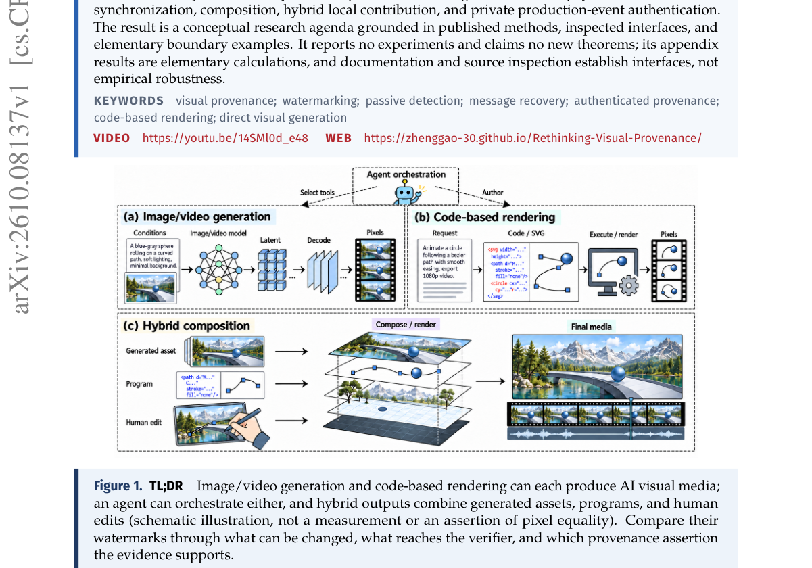

*Main result - Figure 1 What reaches the verifier depends on the production map. Different descriptions can coincide under a fixed renderer, while an intervention that changes the output can transmit a mark. In the*

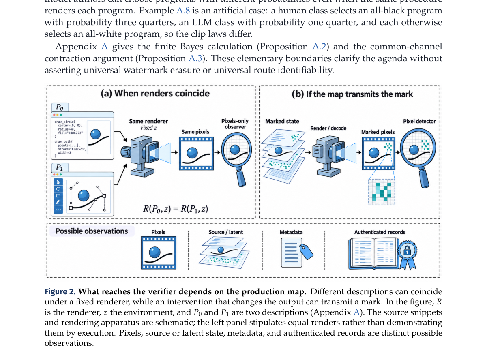

**Why this ranks #10**: 少数把'代码渲染'当作一等生成路径来做溯源设计的工作。

---

## Footer

- Total papers reviewed across all 5 tracks: 50 (from 531 scanned)
- aigc_visual track final top-10: 10
- Wild-cards in this track: 1
- Figure assets: `res/` (shared across tracks)

Generated by `mine-arxiv-daily-digest` skill. Sister file: `2026-10-07_aigc_visual_entry.md`.
