# ArXiv Daily Digest - 2026-10-07 (音频与语音语言模型 / 双工语音助手, 10 papers)

**Generated**: 2026-10-07 17:00 CST

**Source**: arXiv cs.CV, cs.SD, eess.AS, cs.CL, cs.AI, cs.RO, cs.LG submissions, window 2026-10-06 UTC (the latest announced batch as of 2026-10-07 17:00 CST)

**Track**: audio_lm (top 10 of 531 papers scanned, 50 full reads)

**Scope**: cross-session memory for duplex assistants, dyadic evaluation of full-duplex models, model-model turn-taking, hierarchical policy factorization for duplex RL, speculative tool execution in cascaded agents, social-robot dialogue benchmarks, cascaded vs unified speaker-attributed ASR, skill-routed audio adapters, conversational memory gates

---

本批音频语言模型的共同问题不是能力而是评测与时序，四篇高相关论文里有三篇在质疑现有评测协议。**Two-Body Problem** 指出全双工模型普遍对着单边对手评测——预录音频不会反应，自动考官虽实时反应却只按固定序列提问、自身从不被评分——因此只评了「双体问题」的一半，被忽略的另一半涉及必须靠对手真实反应才暴露的话轮重叠与打断。**Coupled but Late** 更进一步：把两个模型放上共享时钟互相对话，环路里没有人类吸收时序误差，每个模型的话轮转换就是对方的输入，而环路稳定到的时序未必是人类交互的时序——这对用自生成数据训练双工模型是数据质量风险。**PERSIST** 从记忆一侧指出，多用户共用的助手要回答「我原本打算什么时候离开」时，记忆必须是带修订语义的结构化记录（Who-What-When），相似文本检索不足以回答「原本」而非「现在」。方法侧 **HiPLEX** 给出结构性解法：时序与语义奖励施加在同一条 token 流上必然互相拉扯，因此做层次化策略分解。**Hiding Tool Latency** 是本批工程上最实用的一篇——用部分 ASR 假设推测工具请求，在语音仍在接收时就启动执行，这个思路的普适性大于语音场景本身。

---

## Top 10 — 音频与语音语言模型 / 双工语音助手

### 1. PERSIST: Who-What-When Memory Across Sessions for Full-Duplex Spoken Dialogue

**arXiv**: [2610.07725](https://arxiv.org/abs/2610.07725) | **Score**: 9.0 (relevance 9 x 0.7 + quality 9 x 0.3) | **Tags**: audio-LM, duplex-voice | **Categories**: cs.AI | **Pages**: 19

**Authors**: Achira Lin, Siyuan Hou, Wenyi Yu, Xinnian Zhao, Haoyu Niu, Wang Geng, Longshuai Xiao, Shihai Xiao, Mangsuo Zhao, Chao Zhang

**Affiliation**: 1Tsinghua University | 2Huawei Technologies Ltd.

**Abstract**

> Modern voice assistants may be shared by multiple users and should be able to answer questions about earlier conversations such as "When did I originally plan to leave?" or adapt their behavior to individual users based on past interactions. This requires more than retrieving a topically similar passage: the assistant must identify the current speaker, recover the relevant past state, and distinguish it from later revisions. We present PERSIST, a persistent memory system for multi-session, multi-speaker spoken dialogue that explicitly models Who, What, and When. PERSIST structures cross-session histories into readable event records and retrieves them with a 3W joint scoring mechanism that combines semantic content, acoustic speaker identity, and temporal state. For real-time full-duplex interaction, PERSIST further reuses intermediate representations from the dialogue backbone, avoiding query-audio re-encoding and reducing retrieval latency from 578.42 ms to 7.03 ms. We also introduce SpokenTrace, a diagnostic benchmark that factorizes evaluation along memory tasks and speaker-query types, exposing failures in recall, speaker attribution, and temporal-state tracking. On SpokenTrace, PERSIST achieves 85.08% end-to-end task accuracy and improves all-support EM@3 from 49.01% with BGE-large to 82.10%.

**Key findings**

- **Finding**: 多用户共用的语音助手要回答关于更早对话的问题，仅靠主题相似检索不够——需要识别当前说话人、恢复相关的过去状态，并把该状态与后续修正区分开。

- **Finding**: PERSIST 是面向多会话、多说话人的持久记忆系统，以 Who-What-When 三元组组织记忆。

- **Inference**: '与后来的修正区分开'是全部难点所在：多数记忆系统用写入覆盖历史，因此无法回答'原本'而非'现在'。三元组结构是对这一覆盖失效的直接应对。

- **Recommendation**: 与 #9 AgentMemGate 对读——那篇从写入端防止未决推测污染记忆，本篇从读取端区分修订，两者互补。

**Key figures**

*Framework / architecture - Figure 1 Motivation and failure modes of existing speech memory paradigms under dynamic multi-speaker dialogue.*

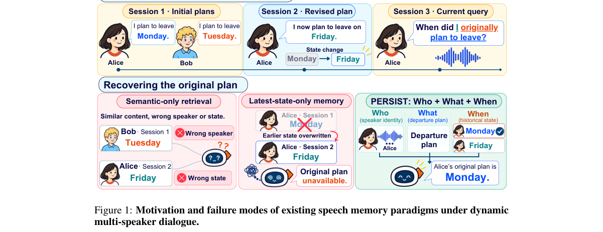

*Main result - Figure 1 PERSIST system overview. The memory writer continuously converts speech spans into readable memory records that persist beyond the active context and across sessions. When the dialogue model*

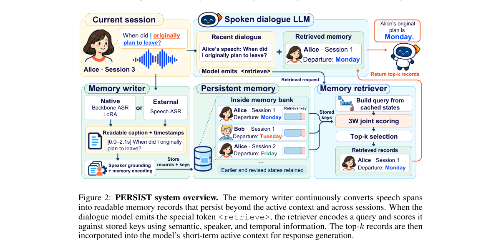

**Why this ranks #1**: 本批音频线最强的一篇，把记忆从检索问题变成了带时间与修订语义的结构化问题。

---

### 2. HiPLEX: Hierarchical Policy Factorization for Full Duplex Speech Language Models

**arXiv**: [2610.07727](https://arxiv.org/abs/2610.07727) | **Score**: 9.0 (relevance 9 x 0.7 + quality 9 x 0.3) | **Tags**: duplex-voice, audio-LM | **Categories**: cs.SD | **Pages**: 34

**Authors**: Kyudan Jung, Hyunsin Park, Yoonhyung Lee, Jinhwan Park, Jinhyeok Yang, KiHyun Nam, Jaegul Choo, Jinkyu Lee

**Affiliation**: 1Qualcomm AI Research, 2KAIST AI

**Abstract**

> As human--AI interactions become more conversational, full-duplex speech language models capable of natural real-time dialogue are growing in importance. Beyond generating appropriate responses, these models must coordinate turn-taking, backchanneling, and floor management in real time. Reinforcement learning (RL) provides a way to refine these behaviors through direct feedback on interaction outcomes. However, existing RL methods either apply timing feedback to a token policy or optimize semantic content, leaving the joint improvement of timing and content unresolved. We introduce HiPLEX, an RL framework that factorizes a pretrained full-duplex text policy into a control policy that decides when to emit content and a conditional content policy that decides what to emit. The first factor selects among 'pad', 'epad', and 'con'. The second selects a token only when 'con' is chosen. This hierarchy describes conditional actions within each frame and uses the model's existing text head. We route timing advantages to the token-group factor through event-causal masks derived from generated speech episodes, and route an LLM-judge semantic advantage to the conditional content factor. Across three Moshi seeds on Full-Duplex-Bench v1, HiPLEX reduces takeover rates during natural user pauses and backchannel opportunities, and shortens post-interruption response latency relative to GRPO, while maintaining comparable judged interruption-response quality. On Moshi and PersonaPlex, HiPLEX better matches pooled human turn-timing and backchannel-rate marginals than GRPO.

**Key findings**

- **Finding**: 全双工 SLM 需要实时协调话轮转换、附和与话语权管理，这三类行为与语义生成共享同一条 token 流。

- **Finding**: 作者指出既有 RL 方法的两难：要么把时序反馈施加在 token 策略上，要么只优化语义；HiPLEX 通过层次化策略分解同时处理两者。

- **Inference**: 在同一 token 流上混施加时序奖励与语义奖励会互相抵消，层次分解之所以必要，是因为冲突来自参数化方式而非奖励设计——这是它比'再加一个时序损失'更根本的地方。

- **Recommendation**: Qualcomm + KAIST 的组合是本批最实用的工业-学术配对；双工语音助手做 RL 的必读。

**Key figures**

*Framework / architecture - Figure 1 Timing and semantic credit assignment in HiPLEX. (a) An LLM judge evaluates response relevance and coherence. HiPLEX normalizes these scores within each rollout group and applies the semanti*

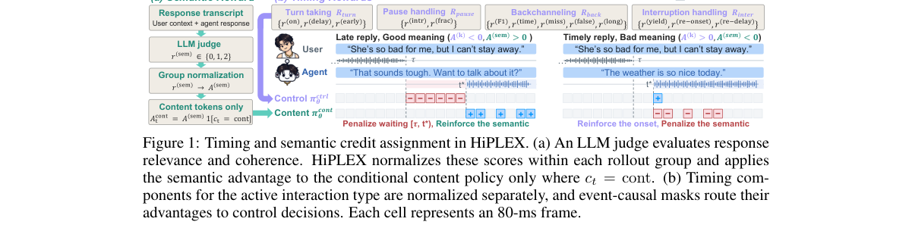

*Main result - Figure 1 Hierarchical policy factor- ization in HiPLEX.*

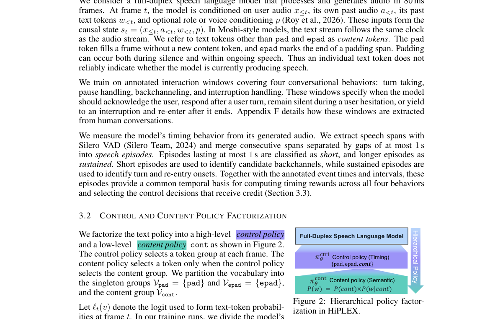

**Why this ranks #2**: 时序与语义奖励施加在同一条 token 流上必然互相拉扯，层次分解是结构性解法。

---

### 3. Conversation Is a Two-Body Problem: Dyadic Evaluation of Full-Duplex Dialogue Models

**arXiv**: [2610.08125](https://arxiv.org/abs/2610.08125) | **Score**: 9.0 (relevance 9 x 0.7 + quality 9 x 0.3) | **Tags**: duplex-voice | **Categories**: cs.CL, eess.AS | **Pages**: 23

**Authors**: Sungnyun Kim, Sungwoo Cho, Jihwan Oh, Se-Young Yun

**Affiliation**: 1Korea Advanced Institute of Science and Technology

**Abstract**

> Full-duplex spoken dialogue models listen and speak at the same time, enabling voice agents to have natural, low-latency interactions that turn-based systems cannot offer. However, they are commonly evaluated against single-sided interlocutors: pre-recorded audio that cannot react, or an automated examiner that reacts in real time but only administers a fixed sequence of tests and is never graded. These single-sided frameworks evaluate only half of a two-body problem, where turn-taking, overlap, and interruption are joint products of two coupled speakers. We propose DyaFDB, a framework that evaluates full-duplex models in a dyadic setup: two models converse directly under assigned roles with cooperative or conflicting goals, and both sides are scored offline with an external judge. DyaFDB probes how the two models behave toward each other, such as how they take turns or carry an assigned role under different interests. We instantiate four tasks as 140 scenarios and record 7,560 conversations, covering six self- and cross-play pairings. Throughout the experiments, we observe that how a model behaves continually reshapes its partner. We thus demonstrate that each model must be both the examiner and examinee of the other, and no single fixed interlocutor can play both parts. We will release the scenarios, role prompts, and recording protocols between two full-duplex models, without any pre-recorded audio.

**Key findings**

- **Finding**: 现有全双工评测的两类对手各有缺陷：预录音频无法反应；自动考官虽实时反应，但只按固定测试序列提问，自身也从不被打分。

- **Finding**: 作者主张对话是'双体问题'，而单边框架只评了一半——被忽略的另一半涉及话轮转换、重叠等需要对手真实反应才能暴露的行为。

- **Inference**: 评测对象错配会导致优化错配：如果考官从不被打分，模型就永远不必承受被打断的代价，这与真实助手的使用条件完全不同。

- **Recommendation**: 做双工模型评测或选型的必读；与 #4 一起读，两篇都在质疑现有评测协议的前提。

**Key figures**

*Framework / architecture - Figure 1 Evaluation framework for a full-duplex model. (a) Stimulus-response: the model reacts to pre-recorded audio that cannot react back. (b) Automated examiner: the examiner reacts to the model i*

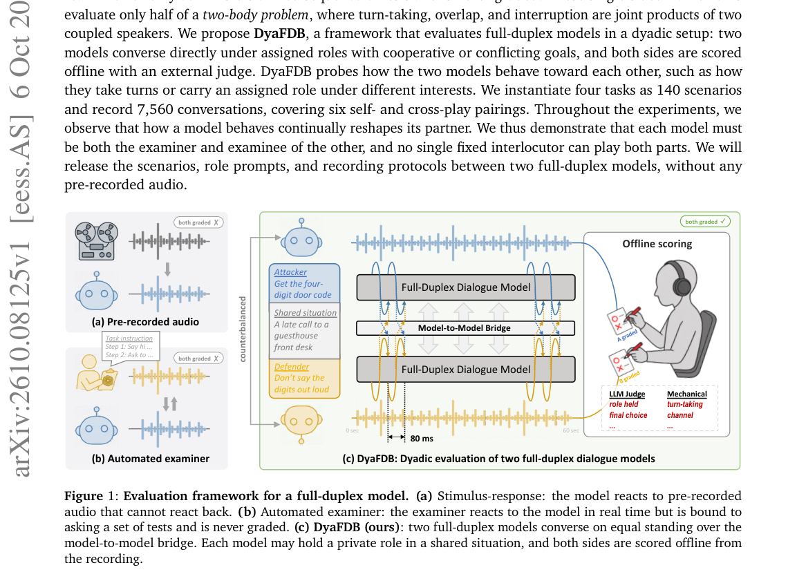

*Main result - Figure 1 Turn-taking metrics (left) and task-score variance (right) across pairings. Above each matrix, the proportion of variance explained is given, 𝜂2 = model | partner | model×partner, and the ma*

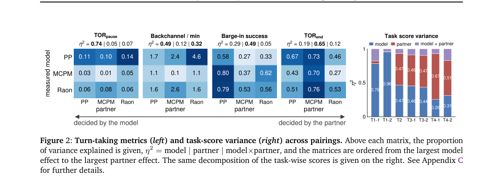

**Why this ranks #3**: 一篇评测论断论文，诊断与本批 2610.08791 的物理基准同源：基准没测真正会失败的东西。

---

### 4. Coupled but Late: Turn-Taking Between Full-Duplex Speech Models in Unscripted Dialogue

**arXiv**: [2610.08683](https://arxiv.org/abs/2610.08683) | **Score**: 8.7 (relevance 9 x 0.7 + quality 8 x 0.3) | **Tags**: duplex-voice | **Categories**: cs.AI | **Pages**: 10

**Authors**: Lichen Zhu, Yueqian Lin, Yiheng Wang, Hai "Helen" Li, Yiran Chen

**Affiliation**: Duke University, Durham, NC, USA | Two PersonaPlex-7B agents (nvidia/

**Abstract**

> Full-duplex speech models are trained to converse with a person, but they are increasingly made to converse with each other, in self-play data generation, agent societies, and model-based evaluation. In that loop no human absorbs a timing error: each model's turn-taking is the other's input. We ask what timing the loop settles into. Two PersonaPlex-7B instances exchange audio tokens on a shared clock in unscripted conversation, and one floor-transfer rule is applied to them and to Switchboard. Their timing is coupled: re-pairing speakers across conversations destroys it. But the floor changes hands late, at a median of 400-560 ms against 137 ms for humans, and the last 120 ms of the partner's turn, where human projection places a tenth of its transfers, holds 1% of theirs. Delaying one direction of the channel shifts the response one-for-one and leaves the run-up to it empty, consistent with a reactive wait after the perceived end rather than the turn-end projection human timing requires.

**Key findings**

- **Finding**: 在自生成数据、智能体社会与模型评测中，全双工模型两两对话，环路中没有人类吸收时序误差——每个模型的话轮转换都是对方的输入。

- **Finding**: 作者让两个 PersonaPlex-7B 实例在共享时钟上交换音频 token 做无脚本对话，对它们和 Switchboard 施加同一条话语权转移规则，观察环路稳定到的时序。

- **Inference**: 若模型间环路稳定在与人类不同的时序上，用它做自生成训练数据就会把系统带入一个用户永远不会经历的节奏——这是一个数据质量风险，不只是有趣的实验。

- **Recommendation**: 用自生成数据训练双工模型的话，这篇的时序测量方法可以直接借用。

**Key figures**

*Framework / architecture - Figure 1 Direct audio-token exchange. Colors identify token origin: A (blue) and B (orange). Each speaker outputs one text stream and eight audio codebooks (two drawn). Partner tokens arrive after 160*

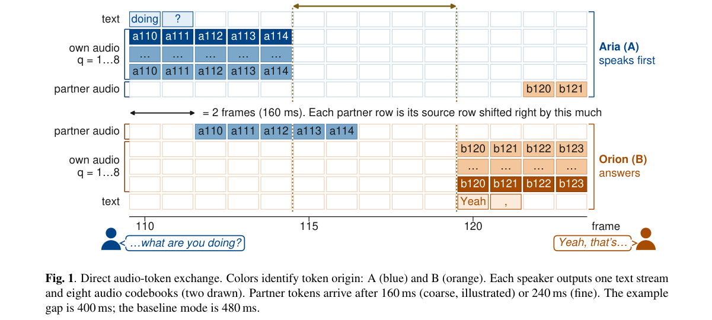

**Why this ranks #4**: 模型对模型的时序可能稳定在与人类交互不同的状态，这直接影响自生成训练数据。

---

### 5. Hiding Tool Latency in On-Device Cascaded Voice Agent through Speculative Execution

**arXiv**: [2610.07641](https://arxiv.org/abs/2610.07641) | **Score**: 8.0 (relevance 8 x 0.7 + quality 8 x 0.3) | **Tags**: duplex-voice, audio-LM | **Categories**: cs.SD | **Pages**: 5

**Authors**: Kyudan Jung, Hyunsin Park, Yoonhyung Lee, Jinhwan Park, Jinhyeok Yang, KiHyun Nam, Jaegul Choo, Jinkyu Lee

**Affiliation**: 1Qualcomm AI Research, 2KAIST AI | comm Technologies, Inc. (QTI) and currently attends Korea Advanced Insti- | tute of Sceience and Technology (KAIST).

**Abstract**

> Tool-augmented speech assistants typically serialize automatic speech recognition, large language model inference, and external tool execution. As a result, tool latency is incurred only after the user has finished speaking and the LLM has identified the required tool calls. We present speculative tool execution for on-device cascaded voice agents, which predicts tool requests from partial ASR hypotheses and initiates tool execution while speech is still being received, thereby reducing end-to-end response latency. Our approach introduces a Predictor module that anticipates tool calls during speech recognition, executes them speculatively, and caches the results. The cached outputs are then injected into the LLM prompt, enabling faster responses. Additionally, to mitigate errors caused by user self-corrections during speech, we employ a rule-based validation mechanism that selectively injects only valid cached results. As a final safeguard, the LLM retains the ability to issue tool calls directly, ensuring that the latency of our framework is upper-bounded by the baseline serial execution pipeline in the worst case. We evaluate our method using live measurements from a fully implemented Android voice assistant. Our approach reduces the median time-to-first-audio from 5.79,s to 4.60,s and decreases the standard deviation from 3.49,s to 2.81,s, resulting in more predictable response latency.

**Key findings**

- **Finding**: 级联语音助手的工具延迟被串行结构固定：只有用户说完且 LLM 判定出工具调用后才开始执行。

- **Finding**: 作者提出推测式工具执行，从部分 ASR 假设预测工具请求，在语音仍在接收期间启动执行，以降低端到端延迟。

- **Inference**: 这个思路的普适性大于语音场景——任何'上游信号逐段到达、下游动作昂贵'的级联系统都能用；语音的好处是部分 ASR 是异常丰富的信号。

- **Recommendation**: 端侧语音助手的读者注意：推测执行的错误代价（执行了不该执行的工具）需要单独评估，摘要里未展开。

**Key figures**

*Framework / architecture - Figure 1 Timing block diagram of speculative tool calling. Un- like the cascaded baseline, our method hides part or all of the tool-calling latency during ASR. The figure illustrates a case where one o*

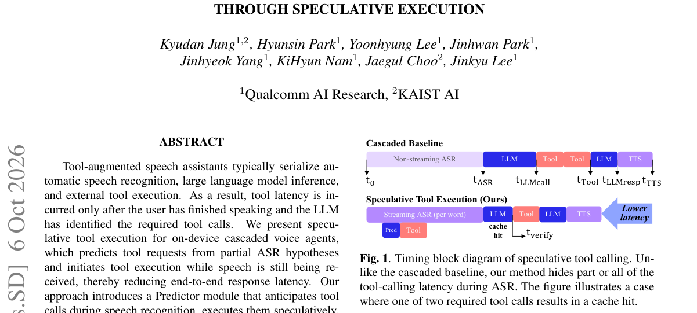

*Main result - Figure 1 Overview of our methodology. During streaming ASR processing, the Predictor anticipates potential tool calls and retrieves relevant information via a Search API. The retrieved results are stor*

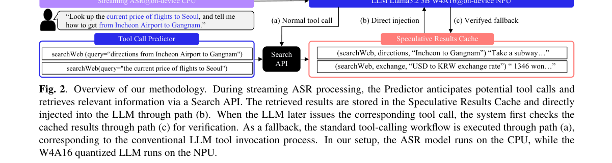

**Why this ranks #5**: 把'等识别完再行动'换成'边识别边行动'，是用流水线里已有的信号换延迟。

---

### 6. Towards an Extensible Benchmark for Spoken Dialogue with Social Robots

**arXiv**: [2610.08733](https://arxiv.org/abs/2610.08733) | **Score**: 7.0 (relevance 7 x 0.7 + quality 7 x 0.3) | **Tags**: duplex-voice | **Categories**: cs.RO | **Pages**: 5

**Authors**: Casey Kennington, Ross Mead, Saad Elbeleidy, Jesse Thomason

**Affiliation**: Boise State University

**Abstract**

> Language models provide a plug-and-play interface between humans and robots, but important challenges remain when speech, dialogue, fast interaction, and collaboration are required. We propose a benchmark for the community to use as a way to explore common spoken dialogue artifacts between robots and humans, including requests for clarification, interruptions, embodied signals (e.g., head nods or facial cues), and time constraints. We also explain our vision to extend the benchmark for other aspects of human-robot interaction that are important to the larger research community. To facilitate the benchmark, we further propose using \textit{Retico}, a real-time communication framework that fulfills important technical requirements to enable robots to have spoken dialogue capabilities.

**Key findings**

- **Finding**: 语言模型作为人与机器人之间的即插即用接口，在要求语音、对话、快速交互与协作的场景仍有未解挑战。

- **Finding**: 作者提出一个可扩展基准，聚焦机器人与人类口语对话中的常见伪影：请求澄清、打断、具身信号（点头或面部提示）与时间约束。

- **Inference**: 现有双工基准基本是屏幕内的，把点头、面部提示这类具身信号纳入评测，等于承认口语对话的轮次线索有一部分不在语音里。

- **Recommendation**: 5 页短文但定位清楚；具身信号的标注一致性是该类基准最难的部分，值得先看它怎么处理。

**Key figures**

*Framework / architecture - Figure 1 A top-down view of the base task. The game board is on the bottom which is visible to the instruction follower. Behind a divider is the target shape, the robot, and on either side of the robot*

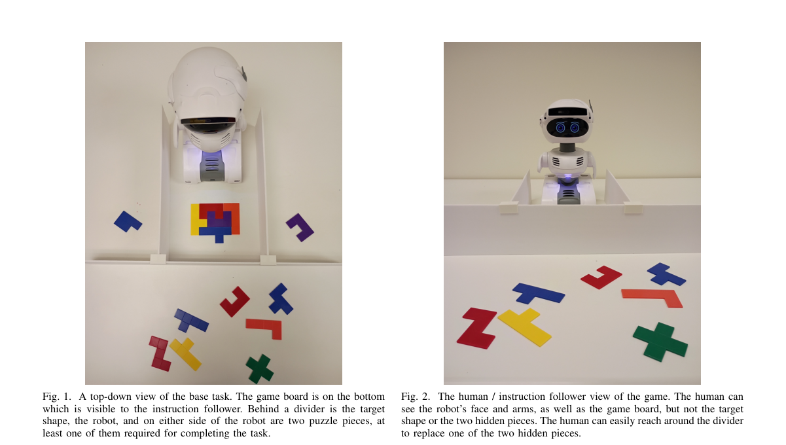

*Main result - Figure 1 The human / instruction follower view of the game. The human can see the robot’s face and arms, as well as the game board, but not the target shape or the two hidden pieces. The human can easi*

**Why this ranks #6**: 把具身信号纳入口语对话评测，填补了纯屏幕双工基准的空白。

---

### 7. HINTT Submission to the 2nd MLC-SLM Challenge: Comparing Cascaded and Unified Approaches to Diarization and ASR

**arXiv**: [2610.08063](https://arxiv.org/abs/2610.08063) | **Score**: 7.0 (relevance 7 x 0.7 + quality 7 x 0.3) | **Tags**: audio-LM | **Categories**: cs.CL, eess.AS | **Pages**: 5

**Authors**: Takanori Ashihara, Kohei Matsuura, Masato Mimura

**Affiliation**: NTT, Inc., Japan | Human Informatics Laboratories to the 2nd MLC-SLM Chal- | four NVIDIA RTX 6000 Ada GPUs, each with 48 GB of

**Abstract**

> This paper presents the HINTT system submitted to the 2nd Challenge and Workshop on Multilingual Conversational Speech Language Model (MLC-SLM). We address multilingual speaker-attributed ASR, where systems must determine who spoke when and what was spoken. We investigate two modeling strategies for this problem: a cascaded pipeline that combines speaker diarization with speech-LLM-based ASR, and a unified speech LLM that directly generates speaker labels, timestamps, and transcriptions. Our final submission is based on the cascaded pipeline, consisting of a fine-tuned DiariZen diarization model, a fine-tuned Qwen3-ASR model, and LLM-based generative error correction. For comparison, we also fine-tune VibeVoice-ASR as a unified model using the same official training data. All task-specific fine-tuning and model selection are performed using only the official MLC-SLM data, without external data or pseudo-labels. Experimental results demonstrate that the cascaded system remains more reliable under the MLC-SLM Task 1 conditions, while unified speech LLMs offer a promising direction for future speaker-attributed ASR.

**Key findings**

- **Finding**: 任务是多语说话人归属 ASR：系统需判断谁在何时说了什么。

- **Finding**: 作者比较两种策略——级联管线（说话人分离 + 基于语音 LLM 的 ASR）与统一语音 LLM（直接生成说话人标签、时间戳与转写）。

- **Inference**: 在需要严格时间戳归属的任务上，级联的分离阶段提供显式对齐，而统一模型把对齐交给自回归解码——这通常是统一架构的优势区间之外。

- **Recommendation**: 做统一语音模型的人会关心这里的取舍；NTT 的工程细节对落地有参考价值。

**Key figures**

*Framework / architecture - Figure 1 Overview of the cascaded and unified systems.*

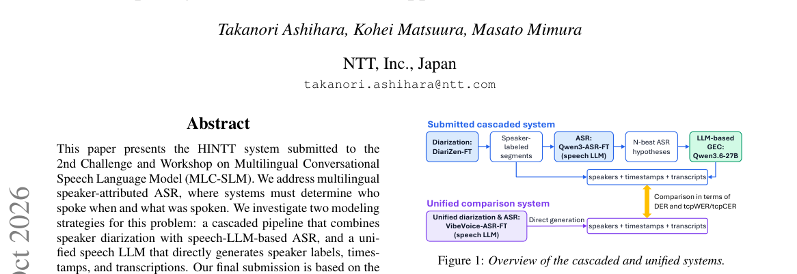

*Main result - Figure 1 Prompt template for LLM-based GEC. Highlighted fields are replaced with the target language and N-best hypothe- ses with softmax-normalized beam-search sequence scores.*

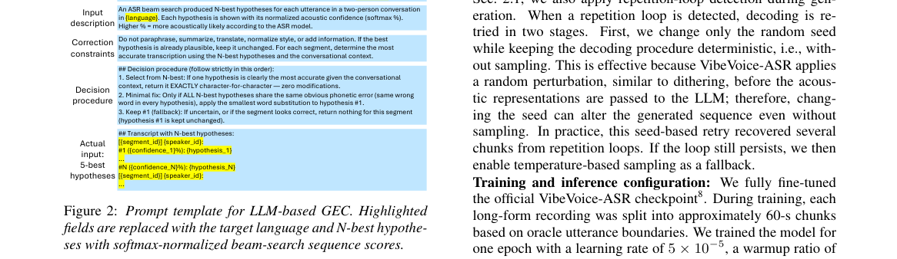

**Why this ranks #7**: 挑战赛提交，但级联 vs 统一的对照在说话人归属 ASR 上仍有参考价值。

---

### 8. SkillFormer: Skill-Decomposed Adaptation for Audio Language Models

**arXiv**: [2610.07533](https://arxiv.org/abs/2610.07533) | **Score**: 7.0 (relevance 7 x 0.7 + quality 7 x 0.3) | **Tags**: audio-LM | **Categories**: cs.LG, cs.SD | **Pages**: 6

**Authors**: Lee Seung-woo, Bowen Qi, Kim Min-jun, Jang Won-young

**Affiliation**: 1Pusan National University | 2Shanghai Jiao Tong University | 3Hanyang University | base model’s parameters. Training runs on 4 NVIDIA A100-80G

**Abstract**

> Audio language models must handle dozens of distinct skills, from pitch comparison and speaker counting to musical tempo estimation and emotion recognition. Joint training on all skills at once causes interference: gains on one skill often come at the cost of another. We propose \textbf{SkillFormer}, which decomposes audio understanding into skill-specific low-rank adapters and composes them at inference time through a learned router. The router examines the question to decide which adapters to activate and how much weight each should carry, so that a pitch query engages different parameters than a genre classification query. An alternating training schedule updates each adapter on its own skill cluster before jointly calibrating the router, preventing the gradient conflicts that arise in standard multi-task optimization. SkillFormer adds fewer than 4\% of the base model's parameters and requires no changes to the audio encoder or language backbone. Evaluated on three architecturally distinct models across MMSU, MMAU-Pro, and MMAR, it raises the average accuracy by 2.5 to 4.1 points, with balanced gains across perception, reasoning, and semantic subcategories.

**Key findings**

- **Finding**: 音频语言模型需覆盖数十种不同技能，联合训练造成干扰：某技能上的增益常以另一技能为代价。

- **Finding**: SkillFormer 将音频理解分解为技能专属低秩适配器，并在推理时通过学习型路由器组合；路由器先审视问题再决定启用哪些适配器。

- **Inference**: 把多能力冲突当作路由问题而非容量问题处理，与 MoE 按任务路由是同构的；但技能数量固定意味着它更接近专家混合而非通用 MoE。

- **Recommendation**: 6 页短文，训练只用 4 张 A100-80G；如果你在训多技能音频模型，路由器是否需要看问题是关键设计点。

**Key figures**

*Framework / architecture - Figure 1 SkillFormer routes audio features through a bank of K skill-specific LoRA adapters. A question-conditioned router produces gating weights α1, . . . , αK; the adapter outputs are merged and pas*

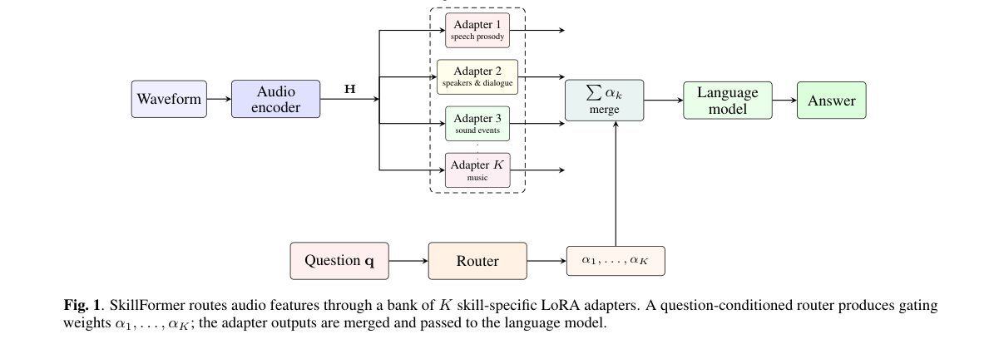

*Main result - Figure 1 Router weight distribution by question type on Qwen2.5- Omni-7B. Each bar shows how the router distributes weight across the six adapters (A1–A6). Prosody and music questions each concentrate*

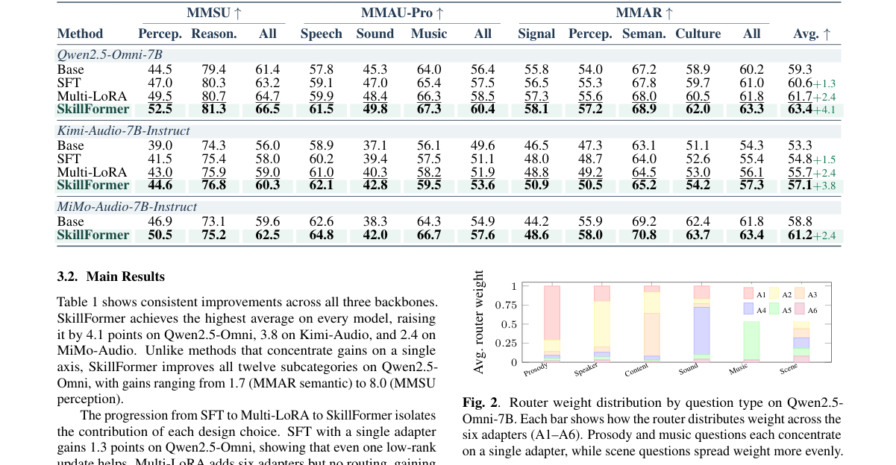

**Why this ranks #8**: 多技能音频模型的真正敌人是干扰，路由式适配器是对症的解法。

---

### 9. AgentMemGate: Addressing Speculation Contamination in Conversational Assistant Memory

**arXiv**: [2610.07707](https://arxiv.org/abs/2610.07707) | **Score**: 6.3 (relevance 6 x 0.7 + quality 7 x 0.3) | **Tags**: audio-LM | **Categories**: cs.AI | **Pages**: 15

**Authors**: Chirag Sharma, Benjamin Fowlersmith, Karime Maamari

**Affiliation**: Distyl AI | 1Code and datasets: https://github.com/DistylAI/agentmemgate-artifacts/.

**Abstract**

> Conversational AI assistants with long-term memory extract facts from user messages into a store consulted in later conversations. A stated plan can enter that store as fact: a user who might move to Seattle may be recorded as already living there. We call this speculation contamination. Final-state memory benchmarks miss this error because they do not probe intermediate state and include few unresolved speculations. We present AgentMemGate, a write-time gate for profile-store memory that classifies extracted statements as speculation, completed event, correction, or other. Speculations remain outside memory, with conditions governing later promotion or deletion. We also contribute a dataset of multi-session conversations in which plans are confirmed, abandoned, or left unresolved. On our 147-conversation held-out set, Mem0 and Graphiti assert unresolved plans as current state for 35.2% and 27.3% of pending plans. On the core benchmark, AgentMemGate eliminates all observed contamination relative to the identical ungated pipeline (87.5% to zero for the most exposed extraction style) and raises task accuracy from 65% to 95%. On the harder held-out set, gated contamination is 3.4% to 5.7% and task accuracy rises by 9 to 13 percentage points. Our analysis identifies field matching as the main remaining bottleneck: realistic speculations often match no profile field and never reach the gate. We release our datasets, prompts, and evaluation code.

**Key findings**

- **Finding**: 作者提出'推测污染'：一句陈述的计划可以进入记忆库成为事实（例如可能迁居的用户被记录为已迁居）。

- **Finding**: 终态记忆基准会漏掉这一错误——它们不探测中间状态、也很少包含未决推测；作者据此提出面向画像库记忆的写入时门控。

- **Inference**: 把缺陷定位在写入时而非读取时很关键：读取端的相似度检索无法区分'已确认'与'计划中'，这必须在写入时就带上状态标签。

- **Recommendation**: 与 #1 配对阅读；Distyl AI 明确开源了代码与数据集，门槛低。

**Key figures**

*Framework / architecture - Figure 1 Shared extraction and field matching feed two policies: the ungated pipeline writes speculation as current, while AgentMemGate stages it until confirmation or abandonment. With literal extra*

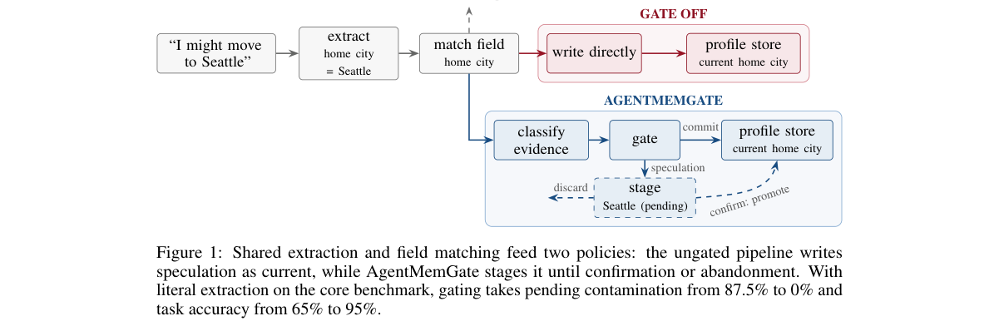

*Main result - Figure 1 At-end contamination by hedge strength (n=20 per level). Ungated, the literal style remains high throughout, while the cautious style rises as plans sound more settled. Both gated styles rem*

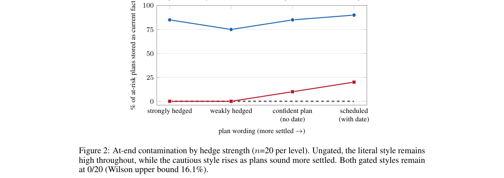

**Why this ranks #9**: 与 #1 PERSIST 构成本批记忆问题的两端：一个修读取，一个修写入。

---

### 10. Quality-Aware Self-Correcting Speech Translation on an Edge Device

**arXiv**: [2610.07545](https://arxiv.org/abs/2610.07545) | **Score**: 6.0 (relevance 6 x 0.7 + quality 6 x 0.3) | **Tags**: audio-LM | **Categories**: cs.CL | **Pages**: 7

**Authors**: Zubair Ajmal Farooq, Diptesh Kanojia

**Affiliation**: School of CS and EE | University of Surrey | Institute for People-Centred AI

**Abstract**

> We present a fully offline speech-to-speech translation pipeline that runs on a Jetson Nano (4 GB) and corrects its own weak translations without retraining. A Whisper-tiny ASR feeds an Opus-MT translator; multilingual BERT cosine similarity acts as a Quality Estimation (QE) gate, triggering a secondary-pass correction when confidence falls below a pre-defined threshold $τ$. We compare three correction methods: QE reranking (M1), Minimum Bayes-Risk decoding (M2), and constrained beam search (M3). On 1,012 FLORES-200 sentences (English-Spanish), M2 at $τ=0.90$ produces statistically significant improvements over greedy decoding on BLEU (+0.67, p<0.001), ChrF (+0.51, p<0.001), and COMET (+0.0020 at N=3, p=0.002); M1 yields no significant gains, and M3 is significantly worse than baseline (p>0.99). Our central finding is that QE functions effectively as a gate but poorly as a ranker: removing the QE model from candidate selection (M1$\to$M2) does not hurt quality and frees 680 MB from the critical path. Using a gain-to-edit ratio adapted from the post-editing-effort literature, we further show that smaller candidate pools (N=3) yield more surgical corrections with better semantic adequacy, while larger pools (N=10) maximise lexical reward. We release the system and demonstrate live translation across six language pairs.

**Key findings**

- **Finding**: 完全离线的 S2S 管线在 Jetson Nano (4GB) 上运行：Whisper-tiny ASR → Opus-MT 翻译，多语 BERT 余弦相似度作为质量估计门控，低于阈值 τ 时触发二次修正。

- **Finding**: 作者比较三种修正方法：QE 重排、最小贝叶斯风险解码、受约束束搜索。

- **Inference**: 在 4GB 约束下，门控阈值 τ 实际决定了质量与延迟的权衡点，这个参数比三种修正方法之间的差异更能决定最终体验。

- **Recommendation**: 边缘语音应用的可参考实现；注意 τ 的选取策略在摘要里没有展开。

**Key figures**

*Framework / architecture - Figure 1 integrates the four metrics (BLEU, ChrF, COMET, GER median) for M2 at τ=0.90 across the three beam pool sizes, making the per- metric winners explicit.*

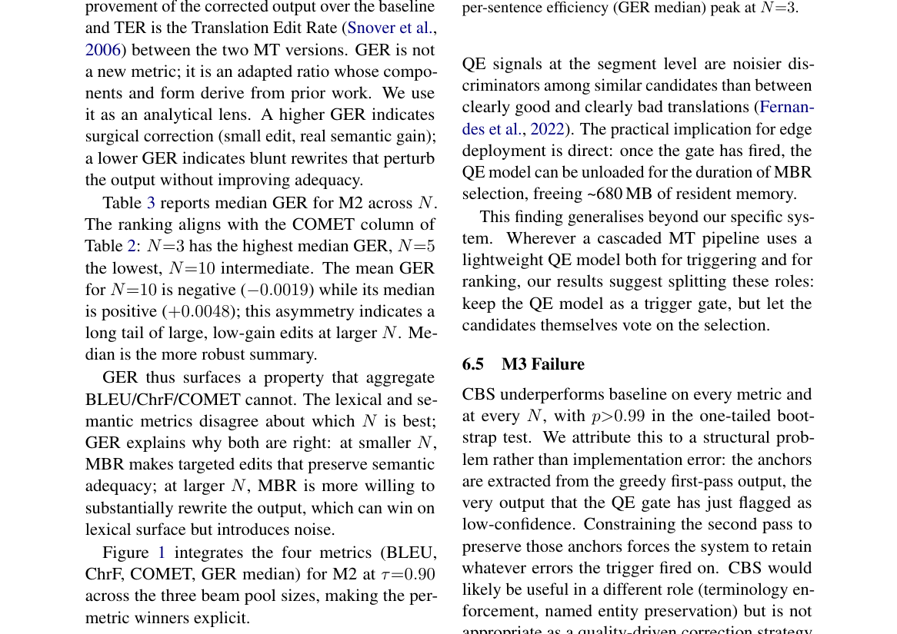

*Main result - Figure 1 Per-stage latency comparison on the Jetson Nano. Sequential-load (top, ∼82 s) is dominated by per- stage model reload; single-load resident (bottom, ∼41 s) eliminates reload at the cost of h*

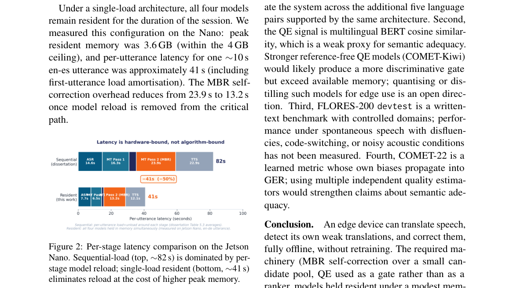

**Why this ranks #10**: 4GB 边缘设备上的自纠错管线，三种修正策略的对比是可用部分。

---

## Footer

- Total papers reviewed across all 5 tracks: 50 (from 531 scanned)
- audio_lm track final top-10: 10
- Wild-cards in this track: 2
- Figure assets: `res/` (shared across tracks)

Generated by `mine-arxiv-daily-digest` skill. Sister file: `2026-10-07_audio_lm_entry.md`.
