# ArXiv Daily Digest - 2026-10-07 (具身智能与世界模型, 10 papers)

**Generated**: 2026-10-07 17:00 CST

**Source**: arXiv cs.CV, cs.SD, eess.AS, cs.CL, cs.AI, cs.RO, cs.LG submissions, window 2026-10-06 UTC (the latest announced batch as of 2026-10-07 17:00 CST)

**Track**: embodied (top 10 of 531 papers scanned, 50 full reads)

**Scope**: physics benchmarks for video world models, 3D-grounded world models for manipulation, JEPA representations for unstable control modes, parallel predictive planning, robot-free demonstration collection, consequence-aware action chunking, visual-dynamics action latents, articulated sim-to-real, tactile adaptation, VLA token pruning

---

三维一致性是本批贯穿全线的线索，而且诊断与修复同时出现。**World Models' Last Exam in Physics** 把「看起来对不对」换成实测：40 个受控任务直接测物理一致性，替代了此前依赖模型判断或参考视频的评测；**DepthWorld** 给出方法侧的对应答案——现有视频世界模型只在 RGB 上训练，rollout 逐帧正确却组合不成一致的三维世界。同一条线上，**Preserving Unstable Modes** 把 JEPA 的表征塌缩连到一个具体的控制后果（不稳定模态沿其方向无界增长），**Parallel Predictive World Models** 则用「并行预测 + 未来表示之间保留因果交互」替代自回归 rollout，攻击与时程长度成正比的串行路径与递归解码状态反馈。其余七篇是 VLA 工程化的实用集合：不用机器人的移动操作演示采集、把动作相似性换成后果一致性作为动作块提交判据、把连续动作 latent 锚定到动作诱发的未来视觉动力学、铰接物体合成数据缺失的部件级语义原语、用物理先验压低触觉操作后训练的交互成本，以及按动作一致性剪枝的 VLA token 削减。贯穿全线的判断是：VLA 的问题已经从「能不能做」转移到「提交多少、何时重规划、表示是否保住了物理模态」。

---

## Top 10 — 具身智能与世界模型

### 1. World Models' Last Exam in Physics

**arXiv**: [2610.08791](https://arxiv.org/abs/2610.08791) | **Score**: 9.7 (relevance 10 x 0.7 + quality 9 x 0.3) | **Tags**: world-model | **Categories**: cs.CV | **Pages**: 29

**Authors**: Mingju Gao, Qingle Liu, Yuzhao Peng, Xinjie Lin, Ziming Qin, Zheng Jiang, Wenyi Li, Calvin Xiao, Youjie Zheng, Kaisen Yang, Qinhuai Na

**Affiliation**: Navers Lab, Einsia.AI | Peking University | Tsinghua University

**Abstract**

> Video world models can produce visually convincing yet physically inconsistent sequences, raising concerns about their reliability for prediction and planning in embodied AI systems. Existing evaluations often rely on model-based judgments or reference videos, while direct physical tests largely focus on mechanics. We introduce World Models' Last Exam in Physics, a measurement-based benchmark for evaluating physical consistency in video world models. The benchmark comprises 40 controlled tasks spanning mechanics, optics, fluids, thermal and phase-change phenomena, electromagnetism, and surface tension. Each task pairs an initial image and a generation prompt with predefined physical criteria, enabling interpretable tests of observable physical relationships without requiring reference videos. Its evaluator combines task-observability screening with task-specific quantitative physical measurements. Experiments on eight video generation models across 1,280 videos reveal persistent physical inconsistencies and substantial variation across tasks, with the best model achieving an overall score of 57.76 out of 100. Evaluation on synthetic videos with known physical relationships provides evidence for the validity of the measurement module under controlled conditions. The evaluator also achieves higher agreement with human judgments than a direct vision-language model baseline in both within-task rankings and pairwise comparisons. By combining coverage across physical domains with scores grounded in measurable evidence and explicit measurement limitations, the benchmark provides an interpretable basis for diagnosing physical inconsistencies and tracking progress toward physically consistent video world models.

**Key findings**

- **Finding**: 视频世界模型会生成视觉上令人信服却物理上不自洽的序列，作者认为这动摇了它们在具身 AI 中用于预测与规划的可靠性。

- **Finding**: 现有评测的两个缺口被明确指出：依赖模型判断或参考视频的评测不可靠；直接物理测试又主要局限于力学。

- **Finding**: 作者提出以实测为基础的基准，包含 40 个受控任务来评估物理一致性。

- **Inference**: 这是本项目日报连续追踪的'指标系统性漏掉真实失效'线索的第三个实例——前两天是概念擦除后 ASR 归零但表示仍可恢复、世界模型可预测但不可控，今天这条是换成实测基准；区别在于这次连评判方式都换掉了。

- **Recommendation**: 北京大學 + 清华 + 混元视频；40 个受控任务的构造方式决定了该基准能否被复用，是最该细读的部分。

**Key figures**

*Framework / architecture - Figure 1 Overview of our benchmark. (1) Benchmark scope: 40 controlled tasks span nine physical categories, supported by perception tools for extracting observable quantities. (2) Generation protocol:*

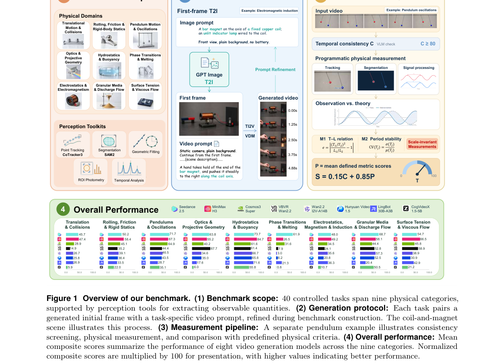

**Why this ranks #1**: 本批相关性最高的一篇：把'看起来对不对'换成'物理量测得准不准'。

---

### 2. DepthWorld: 3D World Model for Robot Manipulation

**arXiv**: [2610.08780](https://arxiv.org/abs/2610.08780) | **Score**: 9.0 (relevance 9 x 0.7 + quality 9 x 0.3) | **Tags**: world-model, embodied-ai | **Categories**: cs.AI, cs.CV, cs.RO | **Pages**: 32

**Authors**: Jai Bardhan, Josef Sivic, Vladimir Petrik

**Affiliation**: Czech Institute of Informatics, Robotics and Cybernetics

**Abstract**

> World models offer a data-driven alternative to traditional simulators for robotics, with applications spanning policy evaluation, improvement, and planning. All of these uses depend on faithful 3D geometry, yet current video-based world models are trained on RGB alone and produce rollouts that look correct frame-by-frame but do not compose into a consistent 3D world. Closing this gap requires progress on two fronts: large-scale 3D supervision for manipulation, and an architecture that can absorb it without disturbing strong pretrained video priors. We introduce a calibration pipeline that combines learned stereo depth with a joint factor graph, pooling all episodes collected from the same physical robot to recover its shared kinematic parameters alongside per-scene extrinsics. Applied to the DROID dataset, this yields DROID-3D, a calibrated 3D dataset providing dense metric depth and recalibrated multi-view extrinsics (achieving <0.7 px reprojection error on 90% of episodes for external cameras). We then train DepthWorld, a Stable Video Diffusion-based world model that jointly predicts multi-view RGB and depth via spatial latent tiling, leaving the pretrained Variational Autoencoder (VAE) unchanged. Depth supervision improves RGB prediction itself by +1.48 dB PSNR over an identical RGB-only baseline at equal training budget, while simultaneously yielding accurate metric depth for downstream geometric reasoning.

**Key findings**

- **Finding**: 世界模型在机器人中的三类用途（策略评估、改进、规划）都依赖忠实三维几何。

- **Finding**: 现有视频世界模型仅在 RGB 上训练，其 rollout 逐帧正确但组合不成一致的三维世界。

- **Finding**: 作者指出弥合这一差距需要两方面进展：面向操作任务的大规模三维监督，以及能吸收该监督的架构。

- **Inference**: 把 #1 的评测与本篇的方法接在一起就是完整的诊断—修复链条：一个测出三维不一致，一个补上三维监督。

- **Recommendation**: 32 页，信息量足；三维监督的来源与规模决定方法可迁移性，优先看这一节。

**Key figures**

*Framework / architecture - Figure 1 DepthWorld: The RGB-only baseline fails to maintain the shape of the cutlery, and the object disappears. DepthWorld capitalizes on the depth inputs to accurately maintain the cutlery’s shape*

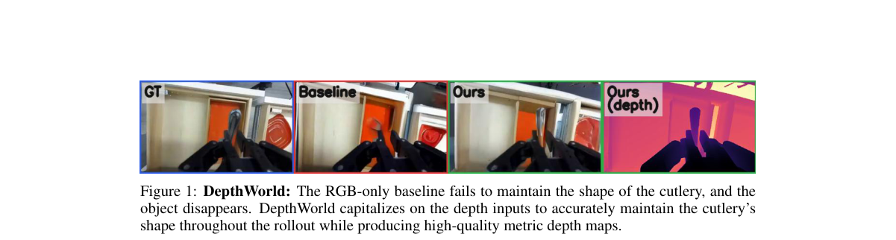

*Main result - Figure 1 DROID-3D calibration pipeline. Given raw stereo from two external cameras and a wrist-mounted camera together with the robot’s URDF and joint encoder readings, Stage 1 recovers per-view metr*

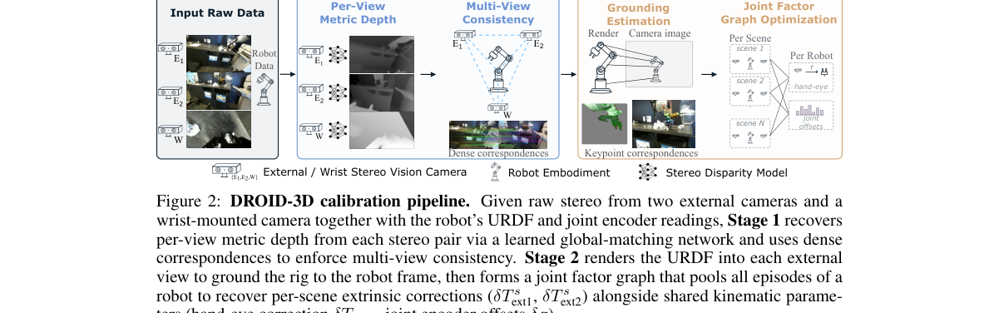

**Why this ranks #2**: 直接回应 #1 度量的那个失效：逐帧对但三维不一致。

---

### 3. Preserving Unstable Modes Through Inverse Dynamics in JEPA World Models

**arXiv**: [2610.07540](https://arxiv.org/abs/2610.07540) | **Score**: 8.7 (relevance 9 x 0.7 + quality 8 x 0.3) | **Tags**: world-model | **Categories**: cs.LG, cs.RO, eess.SY, math.OC | **Pages**: 40

**Authors**: Leonardo F. Toso, Yann LeCun, James Anderson, Oumayma Bounou

**Affiliation**: 1Columbia University | 2New York University | 3New York University, AMI Labs

**Abstract**

> Robotic systems often exhibit unstable modes, along which small perturbations and disturbances can cause unbounded growth unless corrected through feedback. Controlling such systems from high-dimensional visual observations requires representations that preserve these modes. Joint-embedding predictive architectures (JEPAs) provide a natural framework for learning such representations and their dynamics from visual data. However, we demonstrate that next step prediction combined with anti-collapse regularization does not guarantee that controllable unstable modes are preserved: the training loss can be minimized while these modes are collapsed, making stabilization from the learned representation impossible. To address this, we augment world-model training with an action reconstruction objective (i.e., an inverse dynamics loss) that encourages control-aware representations, namely, visual representations that preserve crucial features for control. We prove that exact action reconstruction makes the encoder injective on the finite-horizon reachable subspace. Thus, the encoder cannot discard any state direction reachable by an action sequence within $H$ steps. Moreover, we show that, as $H$ grows, the dominant eigenspace of the finite-horizon controllability Gramian converges to the controllable unstable subspace. We establish our theoretical results for linear systems and demonstrate empirically that our findings extend to nonlinear visual control tasks (CartPole, Walker2D, and PointMaze), highlighting the benefits of control-aware representation learning.

**Key findings**

- **Finding**: 机器人系统存在不稳定模态：小扰动会沿其无界增长，除非反馈及时修正；因此从高维视觉观测出发的控制要求表征保留这些模态。

- **Finding**: 作者论证下一步预测结合防塌缩机制并不足以保证这一点，并以逆动力学恢复不稳定模态。

- **Inference**: 这接上了 10-05 日报中'能解 PushT 的 LeWM 在语言基准上成功率 <1%'那条诊断：那里的故障是 latent 对动作不敏感，这里给出的是同一类问题在控制稳定性上的具体后果。

- **Recommendation**: Columbia + NYU + AMI Labs；40 页含理论部分，实证部分是该看的地方。

**Key figures**

*Framework / architecture - Figure 1 Architecture of our proposed world model. At each step, an encoder (E) maps observation yt to a latent state zt, and a predictor (P) rolls out latent predictions ˆzt+1, . . . , ˆzt+H conditi*

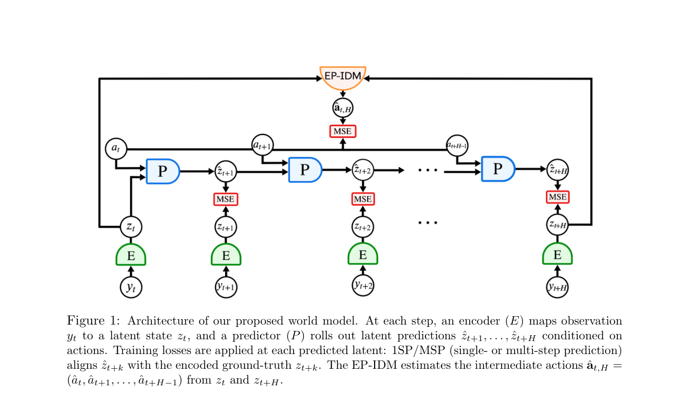

**Why this ranks #3**: 把 JEPA 表征塌缩与一个具体的控制失效（不稳定模态）连起来，是 10-05 日报 JEPA 诊断线的建设性回应。

---

### 4. Parallel Predictive World Models for Accurate and Efficient Long-Horizon Planning

**arXiv**: [2610.08627](https://arxiv.org/abs/2610.08627) | **Score**: 8.7 (relevance 9 x 0.7 + quality 8 x 0.3) | **Tags**: world-model | **Categories**: cs.AI | **Pages**: 17

**Authors**: Wanjin Feng, Baobin Zhang, Ao Yu, Shibo Feng, Xi Wang, Xingyu Gao

**Affiliation**: 1Tsinghua University | 2Institute of Microelectronics, Chinese Academy of Sciences | 3The Hong Kong University of Science and Technology (Guangzhou) | 4Nanyang Technological University, Singapore

**Abstract**

> Long-horizon world-model planning typically relies on autoregressive rollouts, where predicted states are repeatedly fed back into the model. This preserves temporal structure but creates a horizon-length sequential path and exposes later predictions to recursive decoded-state feedback. We introduce Parallel Predictive World Models (PPWM), which predict a finite-horizon trajectory in parallel while retaining causal interaction among future representations. Each horizon is conditioned on its causal action prefix, and future representations interact before decoding, separating temporal causality from state-by-state output recursion. We formalize this distinction by viewing autoregressive rollout as a causal trajectory map and identifying the decoded-state feedback pathway removed by PPWM. Across four visual-control tasks, PPWM achieves the lowest long-horizon prediction error and the highest Cross-Entropy Method (CEM) simulator success among the evaluated predictive interfaces. Meanwhile, PPWM achieves more than a 3$\times$ average CEM planning speedup over the autoregressive LeWM baseline. These results suggest that accurate and efficient long-horizon world-model planning does not require state-by-state autoregression, but can instead be achieved through parallel causal trajectory prediction.

**Key findings**

- **Finding**: 自回归 rollout 的代价被拆解为两项：与时程长度成正比的串行路径，以及后期预测受递归解码状态反馈影响。

- **Finding**: PPWM 并行预测一段有限时程轨迹，同时在未来的表示之间保留因果交互，每个时程以其因果前驱为条件。

- **Inference**: 关键在于'并行'不等于'独立'——保留表示间因果交互，才使并行化不以牺牲多步条件为代价，这是它比朴素多步预测更可信的原因。

- **Recommendation**: 清华 + 中科院微电子 + 港科广；17 页篇幅紧凑，可与 #2 同批对照阅读。

**Key figures**

*Framework / architecture - Figure 1 Comparison of temporal interfaces for world models. (a) Autoregressive (AR) world models predict one step at a time and feed the predicted state back as input, forming a long temporal chain.*

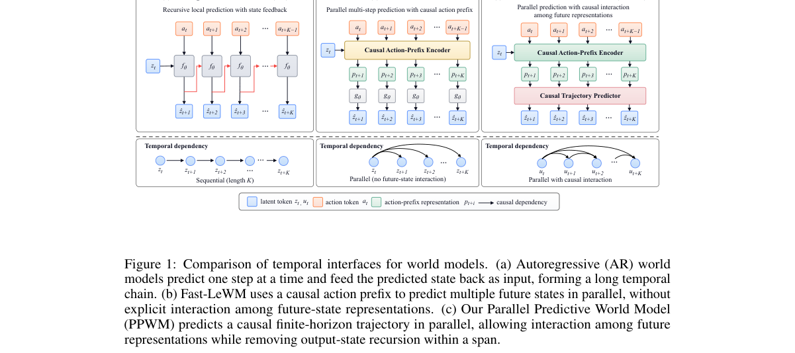

*Main result - Figure 1 Cumulative latent prediction MSE as the open-loop prediction horizon increases. All methods use the same frozen LeWM representation (lower is better).*

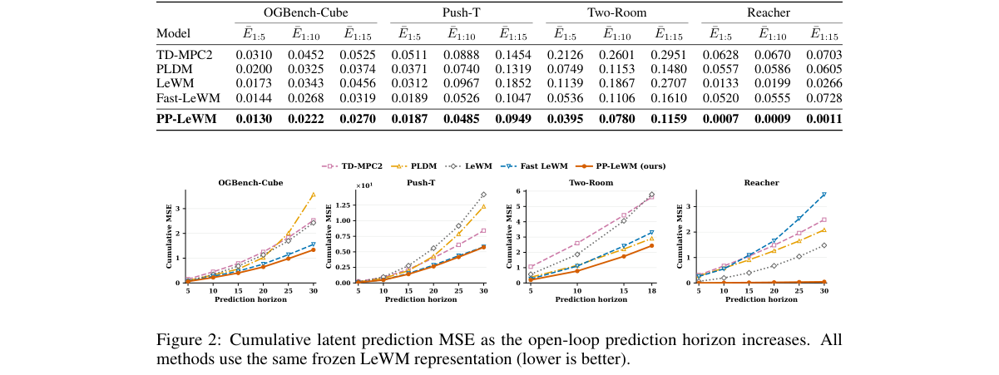

**Why this ranks #4**: 并行预测 + 表示间因果交互，是在不放弃多步条件的前提下 attacking 误差累积。

---

### 5. VOMMI: Collecting and Leveraging Portable Demonstrations for Mobile Manipulation

**arXiv**: [2610.08220](https://arxiv.org/abs/2610.08220) | **Score**: 8.0 (relevance 8 x 0.7 + quality 8 x 0.3) | **Tags**: embodied-ai | **Categories**: cs.AI, cs.RO | **Pages**: 9

**Authors**: Yutian Zhang, Xingrui Xiong, Siyuan Ma, Yang Li, Jiawen Wen, Jiaqi Zhai, Liwen Yang, Ce Hao, Haozhen Chi, Yangkun Zhu, Yifan Zhu, Xiaowen Chu

**Affiliation**: [not-found in PDF]

**Abstract**

> Portable mobile-manipulation demonstrations can help alleviate data scarcity for embodied intelligence, but obtaining reliable, low-cost, and robot-free motion supervision from RGB observations remains challenging. Existing approaches often rely on teleoperation or specialized devices equipped with additional sensing hardware, while directly using estimated visual odometry (VO) trajectories can introduce inconsistencies due to accumulated drift and imperfect motion supervision. We present the Visual-Odometry-Conditioned Mobile Manipulation Interface (VOMMI), a portable demonstration collection and learning framework that connects portable RGB demonstrations to vision-language-action (VLA) post-training through offline trajectory reconstruction and online visual-motion conditioning. VOMMI synchronizes body and hand views to capture navigation context and local object interactions without requiring human-robot kinematic correspondence calibration. R2-VO refines offline demonstration trajectories using sparse geometric anchors and produces causal local-motion tokens over multiple prediction horizons for online policy conditioning. An action-group residual adapter incorporates these tokens only into the base branch. Experiments use a 500-trajectory portable for each task, with 75 trajectories held out for RGB-VO evaluation, and 200 robot demonstrations as references. Our policy, post-trained only on portable demonstrations, achieves 18.2% lower base-velocity error than a policy trained with robot-collected demonstrations, while maintaining comparable end-effector translation accuracy. Offline reconstruction reduces absolute trajectory errors for the body and hand streams by 24.6% on average relative to the best evaluated baseline for each stream. The complete system improves the mean success rate by 8.3 percentage points over OpenPI 0.5 across three real-robot tasks.

**Key findings**

- **Finding**: 获取可靠、低成本、机器人无关的运动监督是移动操作的核心瓶颈：遥操作昂贵，专用传感硬件不便携带。

- **Finding**: 直接使用估计的视觉里程计轨迹会因累积漂移与运动监督不完美引入不一致。

- **Inference**: 用 VO 轨迹但显式建模其不一致性（而非当作真值），是把廉价信号与可靠性矛盾转成建模问题的可行路径。

- **Recommendation**: 9 页，浙大 + 耶鲁 + 上海 AI Lab + 深度机器人；真机验证设置比方法本身更值得看。

**Key figures**

*Framework / architecture - Figure 1 VOMMI. We build upon portable manipulation interfaces with a low-cost RGB-based perception system to enable accessible mobile demonstration collection and integration with VLA frameworks.*

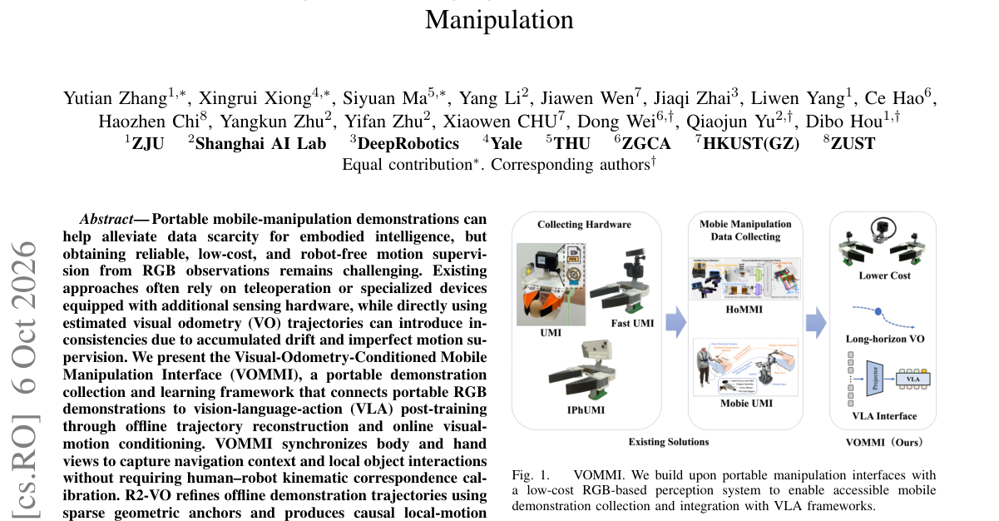

*Main result - Figure 1 Portable data collection interface. Independent Body and Hand RGB views are timestamped into a robot-compatible episode.*

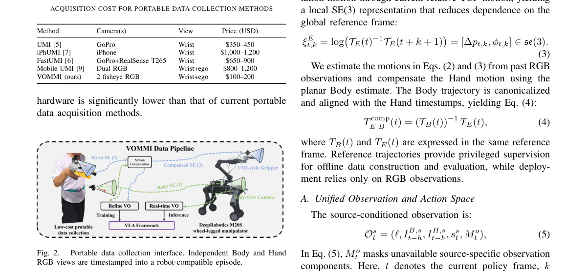

**Why this ranks #5**: 数据采集立场的论文，姿态务实：如何在没有机器人的情况下取得运动监督。

---

### 6. Commit While Futures Agree: Consequence-Aware Adaptive Action Chunking for Robot Manipulation

**arXiv**: [2610.07949](https://arxiv.org/abs/2610.07949) | **Score**: 8.0 (relevance 8 x 0.7 + quality 8 x 0.3) | **Tags**: embodied-ai | **Categories**: cs.RO | **Pages**: 18

**Authors**: Yuyan Li, Yujia Wang, Yusong Huang, Junjie Yang, Yanggang Sheng, Ziyi Shi, Wenpeng Xu, Xiaoyang Zhou, Haoang Li, Hongliang Lu, Xinhu Zheng

**Affiliation**: 1The Hong Kong University of Science and Technology (Guangzhou) | 3Victoria University of Wellington | 4The Hong Kong University of Science and Technology | 5Southern University of Science and Technology

**Abstract**

> Action-chunking policies predict multi-step control sequences, but a fundamental question remains: how much of a predicted action chunk should be committed before replanning? Existing systems typically execute a fixed-length prefix, implicitly assuming that the same execution horizon remains trustworthy across states. Some adaptive methods estimate this horizon from the similarity or stability of predicted actions. However, different actions may lead to the same successful outcome, whereas similar actions can produce different futures, suggesting that commitment should be determined by agreement among imagined futures rather than by similarity in action space. To this end, we propose Consequence-Aware Adaptive Action Chunking (CA$^3$C), an inference-time framework built on a simple principle: commit while imagined futures agree, and replan when they diverge. Without modifying or retraining the base policy, CA$^3$C uses an action-conditioned world model to imagine the future consequences of multiple candidate action chunks under the same sampling noise. Using these imagined consequences, we formulate execution-horizon estimation as a Bayesian change-point inference problem and select the execution candidate through future consensus. Across multiple simulation benchmarks and real-world robot manipulation tasks, CA$^3$C consistently improves diverse action-chunking policies, achieving up to a 71.8% relative reduction in failure rate over the corresponding base policies.

**Key findings**

- **Finding**: 动作分块策略的关键未决问题是：在重新规划前应提交多长前缀。现有系统多用固定长度前缀，隐含假设执行时程在不同状态下同样可信。

- **Finding**: 既有自适应方法从预测动作的相似性或稳定性估计时程；作者指出不同动作可能导向同一成功结果，而相似动作未必导向同一结果。

- **Inference**: 相似性作为提交判据在多解任务上系统性失准——后果一致性才是与下游成功真正相关的量，这是该文改判据的理由。

- **Recommendation**: 港科广 + 惠灵顿等；「后果一致」如何被廉价估计，是全文最关键的实现细节。

**Key figures**

*Framework / architecture - Figure 1 Fixed action chunking executes a preset prefix at every decision step. In contrast, CA3C compares the imagined consequences of multiple candidates, commits longer while their futures agree,*

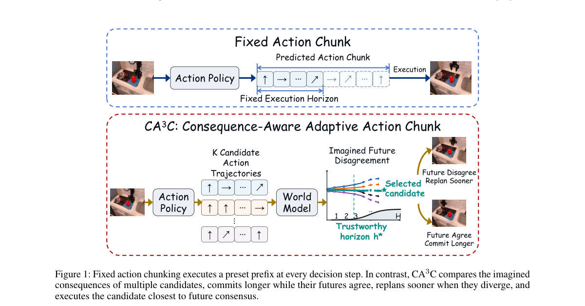

*Main result - Figure 1 Overview of Consequence-Aware Adaptive Action Chunking. (a) The diffusion policy samples K candidate action chunks. (b) The action-conditioned world model imagines their visual future states*

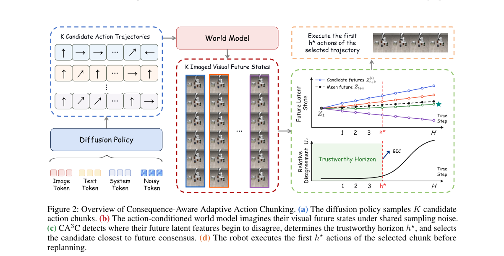

**Why this ranks #6**: 论证动作相似性是错误的提交信号，真正需要的是后果一致——这会改变自适应执行的判据。

---

### 7. ViDAL: A Visual Dynamics-Grounded Action Latent Space for Vision-Language-Action Models

**arXiv**: [2610.08150](https://arxiv.org/abs/2610.08150) | **Score**: 8.0 (relevance 8 x 0.7 + quality 8 x 0.3) | **Tags**: embodied-ai | **Categories**: cs.RO | **Pages**: 17

**Authors**: Yuan Xu, Yixiang Chen, Qisen Ma, Jiabing Yang, Peiyan Li, Kai Wang, Jianhua Yang, Jianlou Si, Jun Huang, Jing Liu, Nianfeng Liu, Yan Huang

**Affiliation**: 3Alibaba Group

**Abstract**

> Vision-Language-Action (VLA) models have become a central paradigm for robot policy learning, which predict actions in three forms: raw action chunks, discrete action tokens, or continuous action latents. However, existing action representations primarily model action trajectories, with limited consideration of the visual dynamics induced by these actions. We introduce ViDAL, a Visual Dynamics-grounded Action Latent Space that anchors continuous action latents in the future visual dynamics of the scene. Specifically, ViDAL learns action latent space by training an Action Variational Autoencoder (Action VAE) to reconstruct action chunks while aligning its latent with future scene dynamics. When integrated into downstream robot policies, the proposed Action VAE serves as a plug-in action interface compatible with multiple VLA architectures and enables optional future-video prediction as an additional capability. Empirically, ViDAL outperforms competitive baselines on LIBERO with 98.1% average success, improves a multi-task $π_{0.5}$ policy on RoboTwin 2.0 from 54.3% to 65.5% (Clean) and from 33.2% to 43.1% (Random) success rates over 50 dual-arm tasks, and yields 20.0% and 23.4% absolute success-rate gains on real-world single-arm Franka and dual-arm ARX robot platforms.

**Key findings**

- **Finding**: VLA 的动作有三种表示形式（原始动作块、离散动作 token、连续动作 latent），但现有表示主要建模轨迹本身。

- **Finding**: 作者指出现有动作表示对动作诱发的视觉动力学考虑有限；ViDAL 将连续动作 latent 锚定到动作的未来视觉动力学上。

- **Inference**: 锚定到未来视觉动力学，等于用世界模型给动作空间定几何——这解释了为何连续 latent 可能比离散 token 更适合需要物理后果的操纵任务。

- **Recommendation**: 阿里巴巴 + 中科院自动化所；与 #4 PPWM 同读，两者都在处理动作与未来视觉/状态的对应关系。

**Key figures**

*Framework / architecture - Figure 1 Overview of ViDAL. (a) Action VAE supervised only by reconstruction. (b) VLAs supervised with visual prediction signals. (c) ViDAL (ours) grounds the action latent space in future visual dyn*

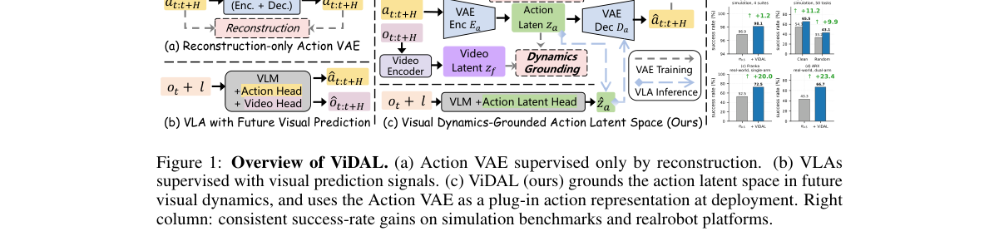

*Main result - Figure 1 Framework of ViDAL. Top: the Action VAE is trained with visual-dynamics supervision from a frozen video encoder. Bottom: the frozen Action VAE then plugs into VLA training (left) and inferen*

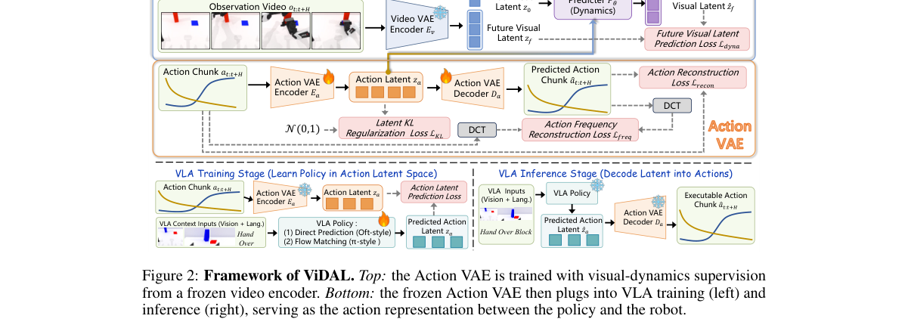

**Why this ranks #7**: 把动作空间锚进世界模型的动作表示，是 VLA 与世界模型合并的一条具体路径。

---

### 8. SMART: Zero-Shot Sim-to-Real Articulated Object Manipulation via Large-Scale Synthetic Pretraining

**arXiv**: [2610.07652](https://arxiv.org/abs/2610.07652) | **Score**: 7.7 (relevance 8 x 0.7 + quality 7 x 0.3) | **Tags**: embodied-ai, sim-to-real | **Categories**: cs.AI, cs.RO | **Pages**: 31

**Authors**: Jicong Ao, Shuhan Jiang, Yuling Zhong, Yanwen Liu, Yuhan Gao, Jiangyuan Zhao, Yang Zhang, Shiqiang Zhu, Chenjia Bai, Xuelong Li

**Affiliation**: 1Institute of Artificial Intelligence, China Telecom, 2Zhejiang University, 3Technical University of | Munich, 4Harbin Institute of Technology, 5Shanghai Jiao Tong University, 6Tsinghua University,

**Abstract**

> The ability to interact with articulated objects is essential for embodied intelligent systems, but collecting large-scale real-world demonstrations for these interactions remains challenging due to the precise contact and constraint-following motions involved. Although simulation provides a promising alternative, existing synthetic data efforts cover limited articulated-object categories, while general-purpose synthesis pipelines lack explicit designs for part-level semantics and articulation constraints, hindering agentic task generation and scalable synthesis of high-quality articulated-manipulation demonstrations. To bridge this gap, we introduce SMART, a scalable system leveraging large-scale Synthesized Manipulation demonstrations for ARTiculated-object manipulation. At its core, we develop SMART-Sim, a simulation platform with articulation-aware design that enables effective task generation and efficient demonstration collection. Building on SMART-Sim, we apply agentic task generation and design a scalable distributed synthesis system, using them to synthesize SMART-Data, comprising over 1M demonstrations across 44 atomic task types, 5 robot setups, and 2,507 articulated objects. The vision-language-action (VLA) model pretrained on SMART-Data shows competitive performance on simulation benchmarks and achieves zero-shot sim-to-real transfer and scalable performance in real-world articulated-object manipulation tasks. This highlights the potential of synthetic demonstrations in providing effective and scalable supervision for improving VLA model performance in contact-rich articulated-object manipulation.

**Key findings**

- **Finding**: 铰接物体交互要求精确接触与约束跟随运动，这使大规模真机演示采集变得困难。

- **Finding**: 既有合成数据努力只覆盖有限的铰接物体类别，而通用合成管线缺少对部件级语义与铰接约束的显式设计。

- **Inference**: 把瓶颈归因于'语义与约束没有显式表示'，比'仿真不够真实'是一个更可操作的诊断——它指向数据生成器的设计而非保真度。

- **Recommendation**: 中国电信人工智能研究院牵头、多校合作；零样本 sim-to-real 的基线选择决定了结论强度。

**Key figures**

*Framework / architecture - Figure 1 SMART synthesizes large-scale simulation data for articulated-object manipulation by combining diverse embodiments and articulated objects, rich manipulation skills, and comprehensive domain*

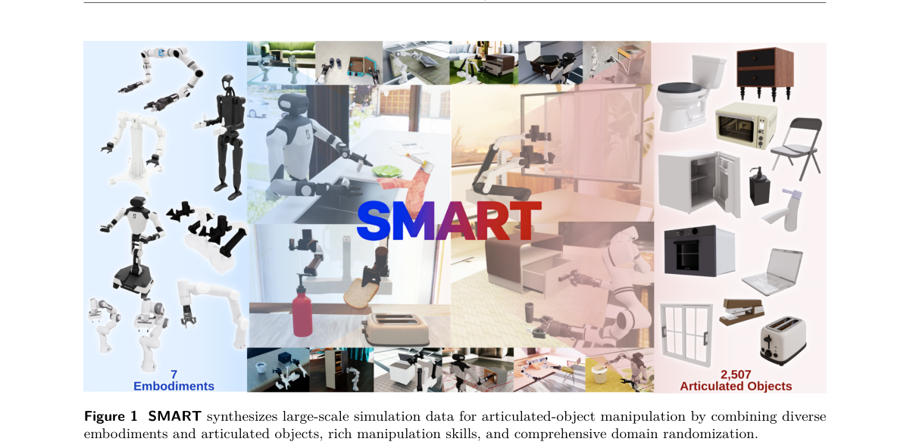

*Main result - Figure 1 Overview of SMART-Sim. SMART-Sim provides versatile robot embodiment and asset support, flexible annotation and skills for motion generation, efficient demonstration collection, and comprehen*

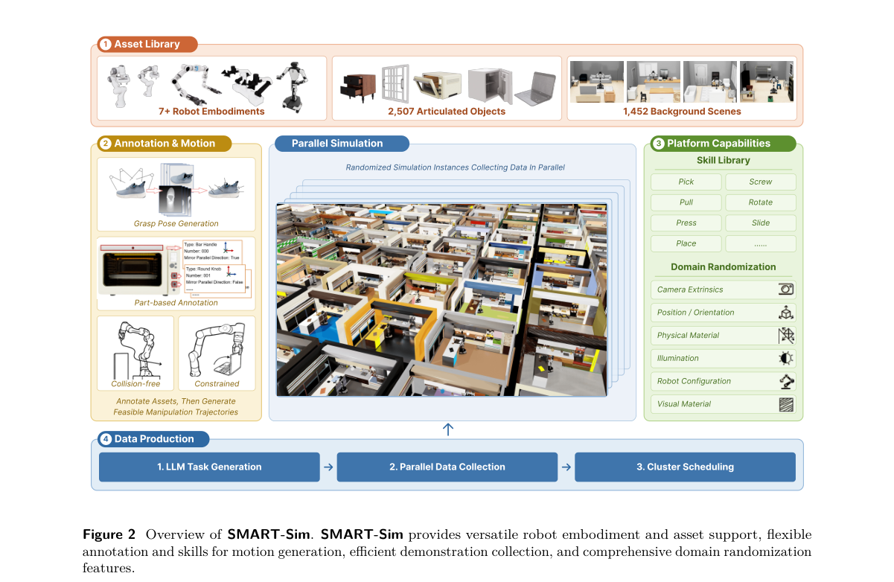

**Why this ranks #8**: 把'部件级语义'指认为铰接操作合成数据缺失的原语，是这篇的核心判断。

---

### 9. PEARS: Physical-Prior-Guided Efficient Adaptation via Failure Reasoning and Diffusion Steering for Tactile Manipulation

**arXiv**: [2610.08784](https://arxiv.org/abs/2610.08784) | **Score**: 7.7 (relevance 8 x 0.7 + quality 7 x 0.3) | **Tags**: embodied-ai, sim-to-real | **Categories**: cs.RO | **Pages**: 9

**Authors**: Kun Song, Yiming Wang, Yilin Chen, Tianyi Ding, Jiaxin Tian, Tianqi Gong, Daolin Ma, Jia Pan

**Affiliation**: 1The University of Hong Kong; 2Shanghai Jiao Tong University; 3Xense

**Abstract**

> Pretrained robotic policies can suffer substantial performance degradation under out-of-distribution (OOD) conditions encountered during deployment, motivating post-training through real-world interaction. However, reinforcement-learning (RL)-based post-training typically requires substantial environment interactions, a burden that is especially significant in manipulation, where each trial can be slow, costly, or destructive. Therefore, we present PEARS, a physics-prior-guided hybrid RL framework for sample-efficient online adaptation of pretrained policies with tactile feedback. After each episode, its physics-guided force reasoning (PFR) module uses physical priors encoded in a vision-language model (VLM) to diagnose failures from the visual outcome and tactile interaction history and update task-appropriate contact-force bounds. A high-frequency hybrid force-position controller then enforces these bounds during contact. Complementarily, tactile-conditioned diffusion steering reinforcement learning adjusts the latent noise of the frozen flow-matching policy to correct errors in free-space motion and contact timing without updating the base model. In simulation, PEARS improves success rates by 12.4-37.4 percentage points over the strongest per-task baselines. PEARS also reduces the number of interaction episodes required for a certain success threshold by up to 53.2% relative to the fastest baseline. In real-world experiments, PEARS achieves success rates of 95% on Whiteboard Erasing and 90% on Pipette Liquid Aspiration. These results show that combining the PFR module with policy steering can accelerate adaptation while reducing costly interactions. The project website is available at https://song-kun.github.io/pears.

**Key findings**

- **Finding**: RL 后训练在操作任务中的障碍是交互成本——每次试验可能缓慢、昂贵或具破坏性。

- **Finding**: PEARS 提出物理先验引导的混合 RL 框架，结合失败推理（PFR）与扩散引导（diffusion steering）。

- **Inference**: 物理先验的作用是把昂贵的真实交互换成便宜的先验引导修正；失败推理则把每次失败的信息利用起来——两者都在削减而非改善奖励信号。

- **Recommendation**: 港大 + 上交 + Xense；触觉感知的引入让它与纯视觉 VLA 工作区分开来，9 页适合快速评估。

**Key figures**

*Framework / architecture - Figure 1 Overview of PEARS. Tactile-aware DSRL and the physics-guided force reasoning (PFR) module jointly accelerate online adaptation.*

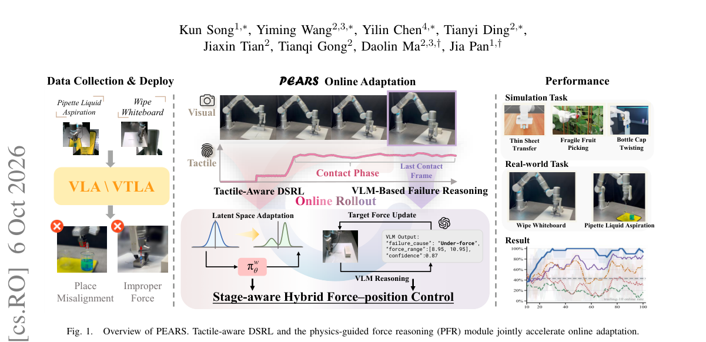

*Main result - Figure 1 Stage-aware force control during whiteboard wiping.*

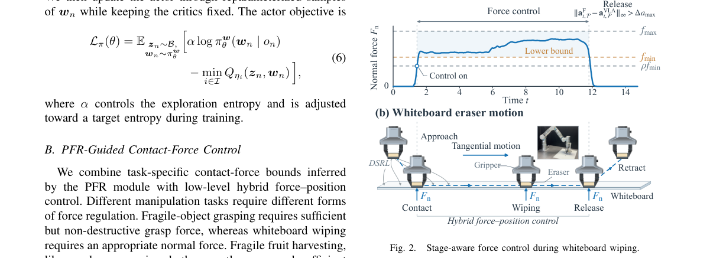

**Why this ranks #9**: 用物理先验压低交互成本，是对'操作类 RL 后训练太贵'这一实际约束的直接回应。

---

### 10. VLA-ACL: Action-Consistent Visual Token Pruning for Efficient Vision-Language-Action Models

**arXiv**: [2610.08133](https://arxiv.org/abs/2610.08133) | **Score**: 7.3 (relevance 7 x 0.7 + quality 8 x 0.3) | **Tags**: embodied-ai | **Categories**: cs.CV, cs.RO | **Pages**: 10

**Authors**: Owen Du, Yang Yue, Jie Zhang, Jiaqi Pi, Chi Bene Chen, Gao Huang

**Affiliation**: 2Tsinghua University

**Abstract**

> Vision-Language-Action (VLA) models achieve strong robotic manipulation performance but incur high computational costs from processing long token sequences at every control step, limiting real-time deployment. Visual token pruning offers a direct solution, as visual patches dominate the input sequence and contain considerable redundancy. Existing approaches, however, either rely on indirect training-free heuristics, such as attention scores and motion thresholds, or require costly fine-tuning of the base VLA model. We introduce VLA-ACL (Action Consistency Learning), which learns a lightweight visual token pruning policy through action-level supervision while keeping the base VLA model entirely frozen. The training objective encourages actions produced from pruned visual contexts to remain consistent with the full-context teacher, with ground-truth actions as auxiliary supervision. This directly ties token selection to its effect on the downstream control output. Experiments on LIBERO and real-world manipulation tasks show that VLA-ACL prunes up to 87.5% of visual tokens while retaining competitive performance, reduces computation by up to 75%, and achieves a 1.5x inference speedup. These results establish a stronger performance-efficiency trade-off than existing frozen-VLA pruning methods and demonstrate the value of action-level supervision for visual token selection. Code is available at https://github.com/du-owen/VLA-ACL.

**Key findings**

- **Finding**: VLA 每个控制步处理长 token 序列带来高计算开销，视觉 patch 占输入序列主体且冗余明显。

- **Finding**: 既有视觉 token 剪枝要么用注意力分数、运动阈值等间接的训练无关启发式，要么需要昂贵微调；VLA-ACL 用动作一致性作为判据。

- **Inference**: 注意力高不等于动作需要——按动作一致性剪枝在概念上更对，因为它直接问'保留哪些 token 不改变动作'。

- **Recommendation**: 清华出品，10 页；VLA 部署侧的读者可直接评估其 token 保留率与延迟曲线。

**Key figures**

*Framework / architecture - Figure 1 LIBERO-Long success rates vs. computational budget. VLA-ACL achieves a better performance-efficiency trade-off than existing frozen-VLA pruning and caching methods.*

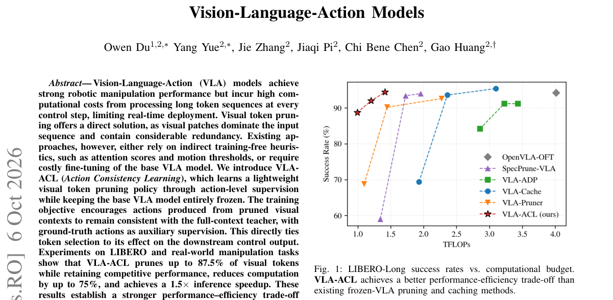

*Main result - Figure 1 Overview of VLA-ACL. Modules with a snowflake symbol are kept frozen, modules with a flame symbol receive gradient updates. a) During training, two forward passes of the frozen LLM are perform*

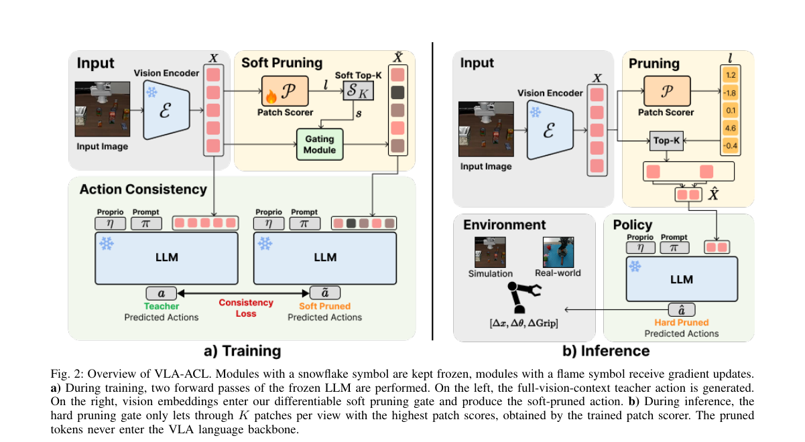

**Why this ranks #10**: 用动作一致性而非注意力启发式作为剪枝判据，剪掉的是动作不需要的信息。

---

## Footer

- Total papers reviewed across all 5 tracks: 50 (from 531 scanned)
- embodied track final top-10: 10
- Wild-cards in this track: 1
- Figure assets: `res/` (shared across tracks)

Generated by `mine-arxiv-daily-digest` skill. Sister file: `2026-10-07_embodied_entry.md`.
