# ArXiv Daily Digest - 2026-10-07 (强化学习, 10 papers)

**Generated**: 2026-10-07 17:00 CST

**Source**: arXiv cs.CV, cs.SD, eess.AS, cs.CL, cs.AI, cs.RO, cs.LG submissions, window 2026-10-06 UTC (the latest announced batch as of 2026-10-07 17:00 CST)

**Track**: rl (top 10 of 531 papers scanned, 50 full reads)

**Scope**: off-policy flow policy RL, reward-hierarchy theory for LLM post-training, variance in generative offline actors, segment-level reward feedback theory, staggered-participation MARL, counterfactual world models under independent learning, DPO saturation analysis, turn/token credit assignment, failure-conditioned RL for SWE agents, temporal regularization for control

---

流策略的训练效率是本批 RL 线最实的贡献。**QF3** 用流匹配加评论家动作梯度训练流策略，梯度经由流输出的一步预测反传，从而让离策略 critic 在流策略上可用而不发散；实验侧用 Unitree G1 零样本跟踪约 3 分钟的舞蹈动作，训练墙钟时间比近期在策略流基线快一个数量级——这个量级差异才是真正的门槛，因为流策略 RL 此前慢到难以实用。理论侧两篇互补：**Hierarchical Reasoning Rewards** 把奖励建模为响应空间上的层次函数，解释了为什么在策略探索结合学习到的奖励会有效（对应实际偏好标注的粗—细结构）；**Segment Reward Feedback** 在线性函数逼近下补上稠密奖励与轨迹级奖励之间缺失的中间档，其现实动机是自动驾驶。多智能体线关注训练—部署分布错配：**错位参与**指出并发训练从未让智能体面对「队友已离线并留下信息」的状态，而那是部署常态；**反事实语义-社会世界模型**则为独立学习的奖励歧义提供世界模型式分解。偏好优化侧 **LSC-DPO** 是诊断先行的例子：偏好幅度缩放使 logistic DPO 损失对进一步变化逐渐不敏感，作者把这一饱和归因到损失函数的局部几何而非数据或优化器，意味着简单的幅度调度无法根治。

---

## Top 10 — 强化学习

### 1. QF3: Fast Flow RL with Filtered Q-Gradients

**arXiv**: [2610.08789](https://arxiv.org/abs/2610.08789) | **Score**: 9.0 (relevance 9 x 0.7 + quality 9 x 0.3) | **Tags**: rl-algorithm, sim-to-real | **Categories**: cs.LG, cs.RO | **Pages**: 27

**Authors**: Chung Min Kim, Brent Yi, David McAllister, Hongsuk Choi, Himanshu Gaurav Singh, Jinkun Cao, Ken Goldberg, Pieter Abbeel, Carmelo Sferrazza, Angjoo Kanazawa

**Affiliation**: 1UC Berkeley | 2Amazon FAR

**Abstract**

> Flow policies have become a standard policy class for learning robot behaviors from demonstrations, but reinforcement learning is still critical for improving pre-trained flow policies or learning them from scratch through interaction. We introduce QF3 (Fast Flow RL with Filtered Q-Gradients), an online off-policy RL algorithm that trains a flow policy with flow matching plus the critic's action gradient, backpropagated through a one-step prediction of the flow's output. To keep updates where the critic and this prediction are reliable, QF3 applies the critic gradient only to action dimensions that stay near the replay action. To our knowledge, QF3 is the first off-policy flow RL method to train humanoid locomotion policies from scratch and transfer them zero-shot to hardware. Paired with a high-throughput off-policy training recipe, it trains humanoid locomotion and motion-tracking policies with a 10x wall-clock speedup over FPO++, a recent on-policy flow RL method. We further apply QF3 to fine-tune pretrained flow-based manipulation policies on both ABC-Sim and Robomimic tasks. These results suggest that QF3 can both learn robot policies from scratch and refine those acquired from demonstrations. Website: https://qf3-rl.github.io/

**Key findings**

- **Finding**: QF3 是在线离策略 RL 算法，以流匹配加评论家动作梯度训练流策略，并将梯度反传经过流输出的一步预测。

- **Finding**: 「过滤」的具体做法是把评论家梯度只施加在那些保持在 replay 动作附近的动作维度上——即只在评论家与该一步预测都可靠的区域更新。

- **Finding**: 作者称这是首个能从零训练人形运动策略并零样本迁移到真机的离策略流 RL 方法；配合高吞吐离策略训练配方，训练墙钟时间相对近期在策略流 RL 方法 FPO++ 提速 10 倍；另有项目页 https://qf3-rl.github.io/

- **Finding**: 实验侧：Unitree G1 人形机器人跟踪约 3 分钟的动态舞蹈动作，用全身动作跟踪策略从零开始在仿真中训练并零样本部署到真机，训练墙钟时间比近期在策略流基线快一个数量级；另在 Robomimic 的工具悬挂与搬运、ABC-sim 的收瓶与装洗碗机任务上通过在线微调提升操作性能。

- **Inference**: 经由一步预测反传是让离策略 critic 在流策略上可用而不发散的关键；而墙钟加速一个数量级才是真正的贡献——流策略 RL 此前慢到难以实用。

- **Recommendation**: UC Berkeley + Amazon FAR；被精读的三篇之一。G1 真机零样本跳舞的细节值得对照其训练配方。

**Key figures**

*Framework / architecture - Figure 1 QF3 is an off-policy RL algorithm for training flow policies online, either from scratch or starting from pretrained policies. Left: A Unitree G1 humanoid tracking a ∼3 minute dynamic dance*

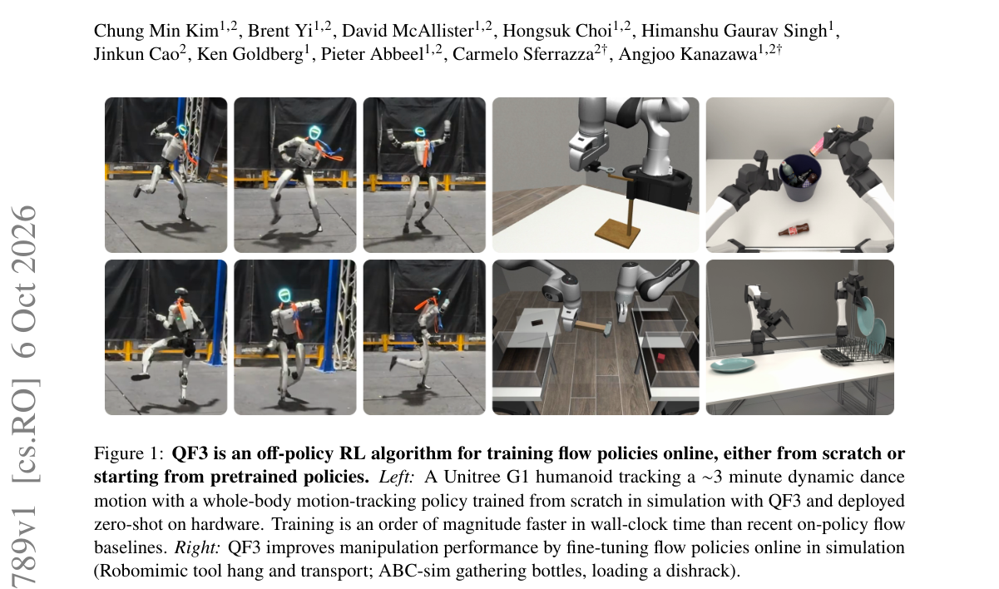

*Main result - Figure 1 The QF3 actor update in 1D. A one-step prediction from a noised replay action can land far from the replay action, where the critic’s estimates are unreliable (a). Clipping the velocity keep*

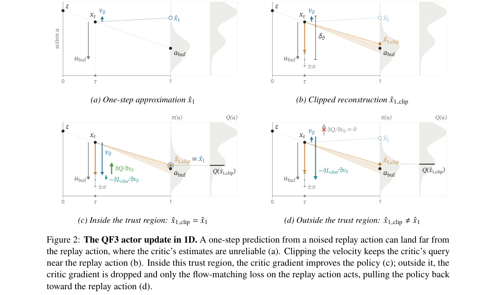

**Why this ranks #1**: 本批 RL 线最强：真正解决流策略 RL 慢的问题，且有真机零样本部署。

---

### 2. Reinforcement Learning for Hierarchical Reasoning Rewards: Minimax-Optimal Rates with Transformers

**arXiv**: [2610.08561](https://arxiv.org/abs/2610.08561) | **Score**: 8.7 (relevance 9 x 0.7 + quality 8 x 0.3) | **Tags**: rlhf, rl-algorithm | **Categories**: cs.LG, stat.ML | **Pages**: 50

**Authors**: Naoki Nishikawa, Taiji Suzuki

**Affiliation**: The University of Tokyo, RIKEN AIP

**Abstract**

> Reinforcement learning (RL) has become a standard tool for post-training language models on reasoning tasks, where the policy is updated by reward feedback while exploring the space of responses. Despite its empirical success, theoretical understanding of RL post-training remains limited, in particular of why on-policy exploration combined with a neural reward model is effective. In this paper, we address this question by modeling the reward as a hierarchical function on the response space: the reward consists of infinitely many local components, each of which becomes relevant only after the preceding ones have been resolved. We show that a natural Transformer-based actor--critic algorithm, which alternates between sampling from the current KL-regularized policy, fitting a Transformer critic to the observed rewards, and updating the policy, achieves the minimax optimal rates in the query budget and in the regularization strength up to logarithmic factors, and is minimax optimal for a fixed number of prompts. In contrast, we prove that sampling from the fixed reference distribution, as in offline reward modeling, can limit regret decay to a logarithmic rate. These results show that on-policy exploration progressively zooms in on the region where the reward is concentrated, and quantify its benefit for RL post-training.

**Key findings**

- **Finding**: 尽管 RL 后训练在经验上成功，理论侧对'为什么在策略探索结合神经奖励模型是有效的'理解仍然有限。

- **Finding**: 作者把奖励建模为响应空间上的层次函数，给出 minimax 最优速率。

- **Inference**: 层次化的奖励建模对应'粗略偏好 + 精细偏好'的实际标注结构——若该建模合理，它就解释了为什么从粗粒度偏好出发的 RL 仍能收敛到可用策略。

- **Recommendation**: 东大 + RIKEN AIP，50 页含完整理论；做 RLHF 理论或需要为奖励模型选结构的人应读。

**Key figures**

*Framework / architecture - Figure 1 A hierarchically nested reward (Definition 1), for d = 1 and zoom depths ℓi = 2. (Top) A response is a path in a tree with 2d children per node, and a prefix of depth h is a dyadic cube of t*

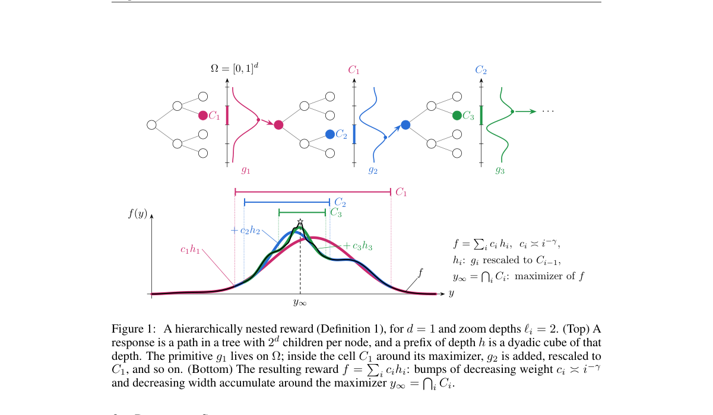

**Why this ranks #2**: 解释'在策略 + 学习到的奖励'为何有效，而不是再提出一个算法。

---

### 3. Variance-Averse $n$-Step Offline Reinforcement Learning for Sparse Long-Horizon Environments

**arXiv**: [2610.07899](https://arxiv.org/abs/2610.07899) | **Score**: 8.7 (relevance 9 x 0.7 + quality 8 x 0.3) | **Tags**: rl-algorithm | **Categories**: cs.AI, cs.LG | **Pages**: 34

**Authors**: Guhyeon Kang, Minhae Kwon

**Affiliation**: Sungkyunkwan University, Republic of Korea

**Abstract**

> Generative actors are transforming offline reinforcement learning (RL) by enabling expressive policy classes that model complex action distributions. However, this expressiveness also exposes a key challenge in heterogeneous datasets: generative policies can reproduce unreliable action modes whose return distributions exhibit high variance, occasionally yielding high returns by chance but lacking consistency. Consequently, maximizing the expected $Q$-value alone is insufficient for identifying reliable actions. We propose VAN-Flow (Variance-Averse $n$-step Flow), a framework that promotes reliable actions in generative offline RL. VAN-Flow combines (i) a categorical distributional critic, (ii) a variance-averse expectation operator that smoothly reweights atom probabilities to favor actions with both high returns and low dispersion, and (iii) a flow-matching generative actor guided via rejection sampling. Unlike CVaR or mean-variance objectives, the operator redistributes probability mass over the categorical return distribution without hard truncation or auxiliary penalty terms. Across more than 40 tasks from D4RL and OGBench, VAN-Flow consistently outperforms strong baselines, with the largest gains in long-horizon and high-variance regimes where reliable action selection becomes critical.

**Key findings**

- **Finding**: 生成式策略能表达复杂动作分布，但会复现回报分布方差高、偶然高回报却无一致性的动作模式。

- **Finding**: 作者论证仅最大化期望 Q 值不足以识别可靠模式，并提出方差规避的 n 步离线 RL 目标。

- **Inference**: 把问题定位为方差而非分布偏移，意味着解法是改变目标函数的形状（惩罚高方差）而不是改进数据或正则化——这与主流离线 RL 的处理方式不同。

- **Recommendation**: 34 页；n 步结构与方差惩罚的相互作用是消融里最该看的部分。

**Key figures**

*Framework / architecture - Figure 1 Success rate on antmaze-large under two dataset variance regimes: (a) navigate (low- variance) and (b) explore (high-variance). In (b), the shaded bar denotes the low-variance reference, and*

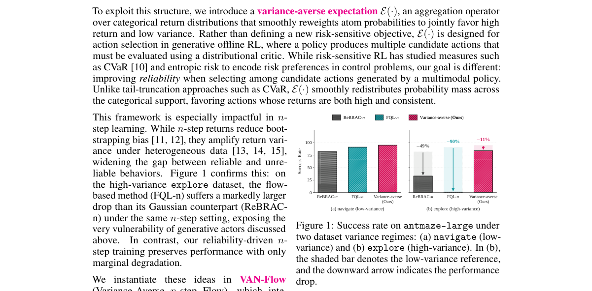

*Main result - Figure 1 Example of variance-averse return with vary- ing δ and return variance.*

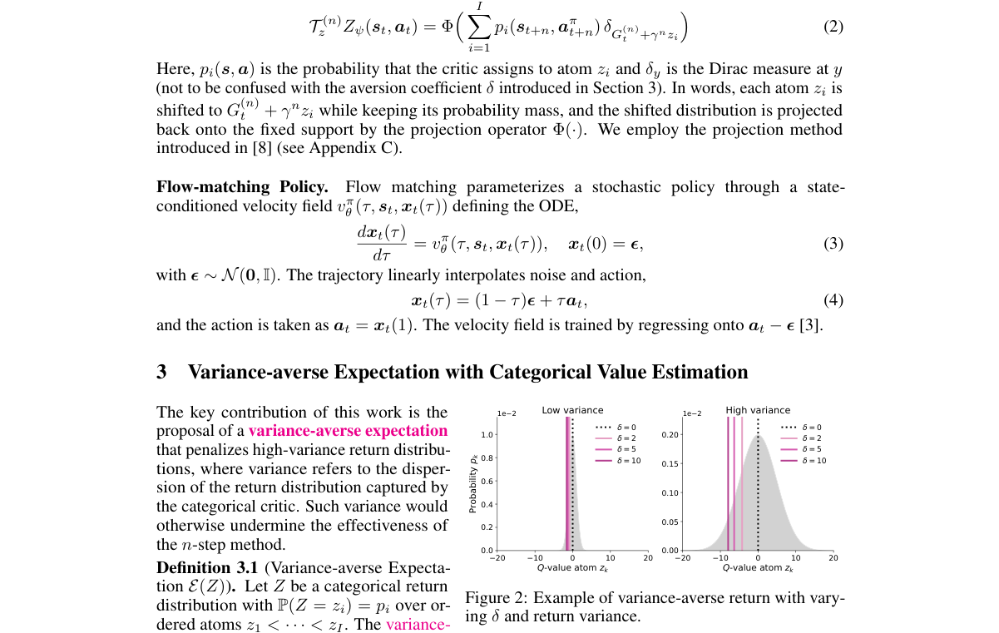

**Why this ranks #3**: 把生成式离线 actor 的问题重述为方差问题而非分布偏移问题，这是一个会改变目标函数的选择。

---

### 4. Reinforcement Learning with Segment Reward Feedback under Linear Function Approximation

**arXiv**: [2610.08271](https://arxiv.org/abs/2610.08271) | **Score**: 8.0 (relevance 8 x 0.7 + quality 8 x 0.3) | **Tags**: rl-algorithm | **Categories**: cs.LG | **Pages**: 102

**Authors**: Fengxu Liu, Siwei Wang, Gal Dalal, Shie Mannor, Yihan Du

**Affiliation**: 1National University of Singapore. | 2Microsoft Research Asia. | 3NVIDIA Research. | 5ESD, Singapore University of Technology and Design.

**Abstract**

> Classical reinforcement learning (RL) assumes that a reward is observed for every visited state-action pair. However, in real-world applications such as autonomous driving, such fine-grained feedback can be costly or difficult to collect, whereas trajectory-level feedback may be too sparse for efficient learning. To provide a general feedback model bridging these two extremes and handle large state spaces, we study RL with segment reward feedback under linear function approximation. Our work answers how the granularity of segment feedback and the choice of segmentation influence learning. For equal-length segments with known transitions, we design algorithms $\bitssegd$ and $\edlinucbsegd$ for binary and sum feedback types, respectively. They adopt posterior sampling with planning to achieve computational efficiency and the E-optimal experimental design to attain near-optimality. Nearly matching lower bounds are established. For equal-length segments with unknown transitions, we develop a unified $\seglsvits$ framework with two instantiations for binary and sum feedback, which carefully integrates the posterior estimated reward parameters into least-squares value iteration. These results reveal a fundamental insight: under binary feedback, increasing the number of segments significantly reduces the regret through an exponential factor, while surprisingly, under sum feedback, the granularity of segments does not affect learning much. Finally, to investigate whether segmenting according to state-action features can further expedite learning, we design an algorithm $\uneqsegbitsd$ that allows arbitrary segmentations. The resulting regret bound shows that under the usual elliptical potential analysis, the influence of state-action features on the regret appears only through logarithmic factors, and equal segmentation achieves the best performance.

**Key findings**

- **Finding**: 真实应用（作者举例自动驾驶）中，逐状态-动作的奖励反馈代价高，轨迹级奖励又太稀疏，两者之间缺少一般性模型。

- **Finding**: 作者在线性函数逼近设定下研究带片段奖励反馈的 RL，给出该反馈模型下的结果。

- **Inference**: 片段奖励把稀疏性问题从'整条轨迹'下放到'子轨迹'，代价是需要知道片段边界——自动驾驶里这通常可得（按路段切分），这是该设定有实际生命力的原因。

- **Recommendation**: NUS + MSRA + NVIDIA Research + SUTD；102 页纯理论，本批唯一无可用图示的论文。

**Key figures**: 无可用图示（本文为纯理论论文，正文以表格与证明为主）。

**Why this ranks #4**: 补上稠密奖励与轨迹级奖励之间缺失的中间档，102 页理论。

---

### 5. Cooperating with Future Collaborators: Multi-Agent RL under Staggered Participation

**arXiv**: [2610.07578](https://arxiv.org/abs/2610.07578) | **Score**: 8.0 (relevance 8 x 0.7 + quality 8 x 0.3) | **Tags**: multi-agent-rl | **Categories**: cs.AI | **Pages**: 43

**Authors**: Jianglin Qiao, Siyi Hu, Thien Hoang Nguyen, Zehong Cao, Salah Sukkarieh

**Affiliation**: 1ACFR, The University of Sydney, Sydney, Australia | 2School of EECMS, Curtin University, Bentley, Australia | 3School of CSIT, Adelaide University, Adelaide, Australia

**Abstract**

> In cooperative Multi-Agent Reinforcement Learning (MARL), agents are often trained under concurrent participation, while in many tasks some agents act earlier and leave task-relevant information that becomes useful to agents participating later. We study this setting as staggered participation (SP), which introduces a cross-time, cross-agent learning dependency because an early action may affect the return through the information it provides and the later policy that uses it. Learning under SP therefore requires both identifying what information is useful for future decisions and learning how later agents should use it. We propose Staggered Participation Learning (SPL), a training-time augmentation that addresses these two parts with prospective acquisition supervision for earlier agents and outcome-supervised receiver learning for later agents. We evaluate SPL across multiple policy-based MARL backbones, environments, and staggered-participation patterns. Across 60 MPE/RWARE backbone setting comparisons, SPL achieves higher observed mean task completion in every case, with an average difference of 14.1%. The gains also extend to eight-agent teams and a physics-based UAV-UGV environment in Isaac Lab, providing evidence across algorithmic, temporal, and embodied settings.

**Key findings**

- **Finding**: 合作式 MARL 通常在并发参与下训练，但许多任务中部分智能体先行动，其留下的信息对后参与的智能体有用。

- **Finding**: 作者称之为错位参与（staggered participation, SP），它引入跨时间、跨智能体的学习依赖：早期动作会通过它提供的信息与后续使用它的策略两条路径影响回报。

- **Inference**: 这本质是训练分布与部署分布不一致：并发训练的智能体从未面对'队友已经离线并留下信息'的状态，而这是部署时的常态。

- **Recommendation**: 悉尼 + Curtin + 阿德莱德，43 页理论为主；多智能体系统若存在分阶段上线场景，这篇的设定直接可用。

**Key figures**

*Framework / architecture - Figure 1 Simultaneous and staggered participation. In simultaneous participation, agents contribute within the same participation period. Under staggered participation, earlier participants acquire o*

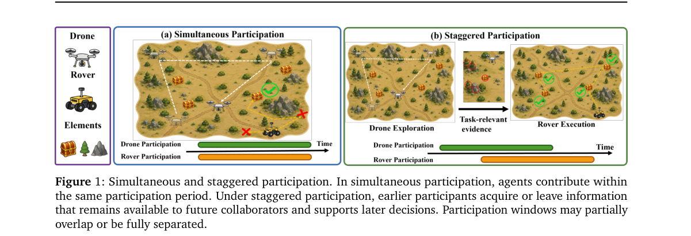

*Main result - Figure 1 Overview of SP and SPL. Earlier participants receive prospective acquisition supervision, while future collaborators learn evidence-conditioned preferences from downstream outcomes. SPL is u*

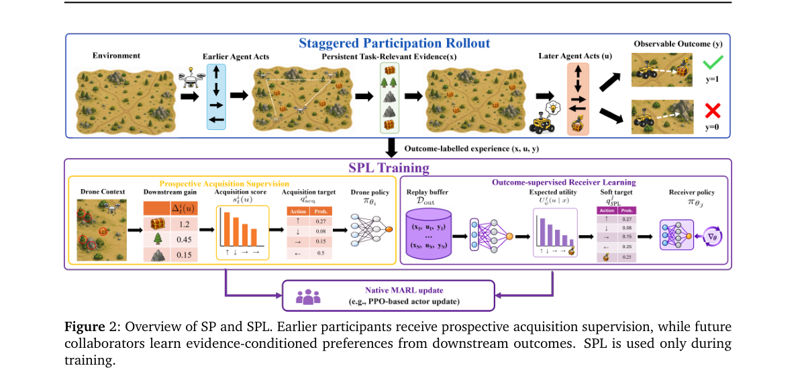

**Why this ranks #5**: 训练时并发、部署时错位，是一个真实的训练-部署分布错配。

---

### 6. Independent Multi-Agent Reinforcement Learning with Counterfactual Semantic-Social World Models

**arXiv**: [2610.07704](https://arxiv.org/abs/2610.07704) | **Score**: 7.7 (relevance 8 x 0.7 + quality 7 x 0.3) | **Tags**: multi-agent-rl, world-model | **Categories**: cs.LG, cs.MA | **Pages**: 11

**Authors**: Fernando Martinez, Tao Li, Yingdong Lu, Juntao Chen

**Affiliation**: Information Sciences, Fordham University, New York, NY, 10023, USA (e-

**Abstract**

> Fully decentralized multi-agent reinforcement learning (MARL), also referred to as independent learning, requires each agent to learn and act using only its local information and experience, without a centralized critic or inter-agent communication. Such a stringent information structure renders the conventional reward signal ambiguous. A poor return may result from an ineffective ego action, an incompatible teammate response, or an effective opponent response, yet scalar rewards alone do not reveal which explanation is responsible. We argue that agents can learn more effectively by prospectively comparing the consequences of candidate actions rather than diagnosing failures only from realized returns. We introduce CASTLE (Counterfactual Action-conditioned Semantic Tokens for Local Execution in Decentralized MARL), an offline-training, online-in-context guidance framework with two complementary world models. A Local Dynamics World Model, offline pre-trained over agents' local trajectories, summarizes the agent's local trajectory dynamics and partial observability, while a Semantic-Social World Model predicts compact short-horizon task and social consequences for each candidate ego action. The latter is trained from counterfactual simulator rollouts that expose plausible teammate and opponent responses to alternative actions taken from the same logged rollout state. During online learning and execution, both world models remain frozen and are queried by agents using only locally available information. Their prediction logits provide in-context guidance to an independent PPO policy. Across 30 matched seeds on Tag, Spread, and Adversary in the benchmark multi-particle environments, our proposed CASTLE achieves the highest mean final score among the evaluated methods, exceeding the strongest baseline on each task by 10.67, 6.46, and 0.33 normalized points, respectively.

**Key findings**

- **Finding**: 独立学习下每个智能体只能用本地信息，标量回报因而歧义：低回报可能来自自身动作、队友不兼容或对手有效，三者在观测上无法区分。

- **Finding**: 作者以反事实语义-社会世界模型为该歧义提供分解。

- **Inference**: 若世界模型能在本地信息下估计各分支的贡献，它就等价于一个不需要中心评论家的反事实基线——这是 CTDE 之外的 credit assignment 路径。

- **Recommendation**: Fordham，11 页短文；反事实分解的可辨识性假设是全文最需要核查的地方。

**Key figures**

*Framework / architecture - Figure 1 Architecture of CASTLE. Offline pretraining produces frozen LDWM checkpoints and an SSWM that emits one consequence token zi*

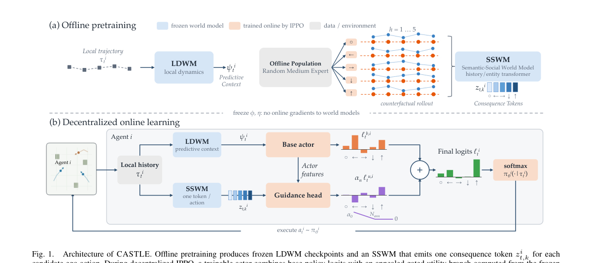

*Main result - Figure 1 Target-task predictive accuracy over the SSWM rollout horizon. Solid lines indicate target-included pretraining and dashed lines held-out pretraining, evaluated on identical target-task histor*

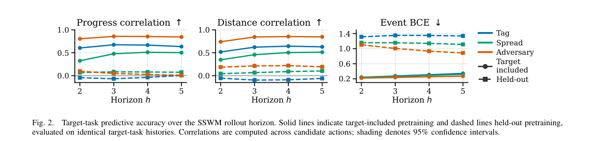

**Why this ranks #6**: 用世界模型来解决独立学习固有的奖励歧义，是 credit assignment 的一个非常规解法。

---

### 7. LSC-DPO: Learning-Signal-Controlled Direct Preference Optimization

**arXiv**: [2610.07592](https://arxiv.org/abs/2610.07592) | **Score**: 8.0 (relevance 8 x 0.7 + quality 8 x 0.3) | **Tags**: rlhf | **Categories**: cs.AI | **Pages**: 27

**Authors**: Yang Qu, Yusheng Han, Chengjia Feng, Handan Liu

**Affiliation**: 1Northeastern University

**Abstract**

> Direct Preference Optimization (DPO) has become a standard reward-model-free approach for aligning language models with preference data. However, as the scaled preference margin grows during training, the logistic DPO loss becomes progressively less sensitive to further changes. We study DPO from a loss-level geometric perspective and identify the sigmoid factor as a learning signal that characterizes the local sensitivity of the objective. Based on this view, we propose Learning-Signal-Controlled Direct Preference Optimization (LSC-DPO), which dynamically regulates the learning signal near a target regime. A log-space analysis establishes conditions for stable tracking of the target learning-signal regime. Experiments on AlpacaEval 2, MT-Bench, and Anthropic-HH show that LSC-DPO consistently improves over DPO and strong preference-optimization baselines. We further find that different coefficient initializations induce distinct transient learning-signal trajectories even when their later signal levels become similar. Based on this observation, we derive a signal-budget compensation rule that adjusts the target learning signal to compensate for these transient differences. The resulting compensation substantially reduces performance variation across coefficient initializations.

**Key findings**

- **Finding**: 随着训练中偏好幅度缩放增大，logistic DPO 损失对进一步变化逐渐不敏感——即优化信号在衰减。

- **Finding**: 作者从损失层面的几何视角分析 DPO，识别 sigmoid 因子为刻画目标局部敏感度的学习信号，并提出对该信号加以控制的 LSC-DPO。

- **Inference**: 把饱和归因到损失函数的局部几何而非数据或优化器，意味着简单的幅度调度无法根治——必须改变目标函数的敏感度结构。

- **Recommendation**: 东北大学，27 页；推荐幅度调度与 LSC-DPO 的直接对照实验，这是最该自行验证的一条。

**Key figures**

*Framework / architecture - Figure 1 Illustration of the DPO loss geome- try as a function of the scaled margin z = βm. The learning signal σ(−z) and curvature factor c(z) = σ(z)σ(−z) decrease as z grows.*

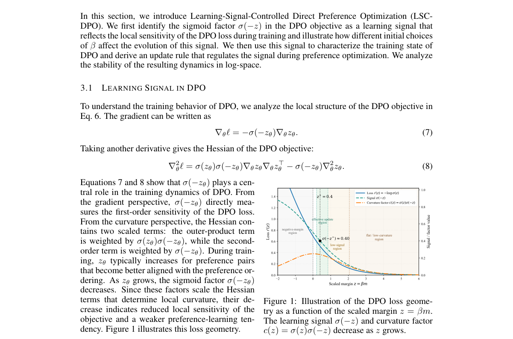

**Why this ranks #7**: 先诊断饱和机制再控制它，比启发式补丁更值得注意。

---

### 8. VETTA: Coordinating Turn- and Token-Level Credit Assignment for Multi-Turn LLM Agents

**arXiv**: [2610.08402](https://arxiv.org/abs/2610.08402) | **Score**: 7.0 (relevance 7 x 0.7 + quality 7 x 0.3) | **Tags**: rlhf | **Categories**: cs.LG | **Pages**: 16

**Authors**: Jiaju Chen, Min Yang, Jinghua Piao, Xiaochong Lan, Xu Xia, Xiangnan He, Yong Li

**Affiliation**: 3Shandong University | 4Tsinghua University | 5Southeast University

**Abstract**

> Multi-turn LLM agents often receive sparse task feedback across several interactions, while generating each response token by token. This creates two related credit-assignment questions: which responses helped achieve the outcome, and which generation decisions mattered within each response? Existing methods typically focus on only one level: turn-level methods evaluate complete responses but do not distinguish the decisions within them; token-level methods can propagate feedback across turns but do not explicitly model credit for each response. These complementary limitations motivate learning credit at both levels and coordinating it in a single policy update. We introduce VETTA, a credit assignment method that jointly learns turn- and token-level values through separate heads on a shared lightweight critic. VETTA computes advantages along both temporal sequences and combines each turn advantage with a within-response-centered token residual for PPO updates. Furthermore, to reduce value-learning cost, the critic retains only early Transformer blocks from the pretrained checkpoint used to initialize the actor. On two challenging agent benchmarks, ALFWorld and WebShop, VETTA improves success rates over PPO by 37.5% and 22.3%, respectively, with Qwen2.5-1.5B-Instruct and achieves success rates of 95.5% and 76.0%, respectively, with Qwen2.5-7B-Instruct. Critic-depth comparisons further show strong task performance with substantially lower critic-side computation. These results suggest that a compact shared critic can coordinate turn- and token-level credit to improve agent performance while keeping value estimation efficient. Code is available at https://github.com/Jiaju-Chen/VETTA-official.

**Key findings**

- **Finding**: 多轮 LLM 智能体的稀疏反馈与逐 token 生成产生两层 credit assignment 问题：响应层面的贡献与响应内部的生成决策贡献。

- **Finding**: 既有方法或只做响应级（评估完整响应但不区分内部决策），或只做 token 级（可跨轮传播反馈但不处理响应层选择）。

- **Inference**: 两层协调的直觉是合理的，但实际增益取决于两层信号是否真的独立——若响应级选择已主导结果，token 级传播的边际贡献可能很小。

- **Recommendation**: 中科大 + 山大 + 清华 + 东南；读时重点看双层协调相对各自单层的增量消融。

**Key figures**

*Framework / architecture - Figure 1 Success rates on ALFWorld and WebShop: (a) full-depth PPO\*, Turn-PPO, and mixed configurations; (b) the mixed configuration with 2, 8, or 28 critic blocks. Bars show means and error bars sho*

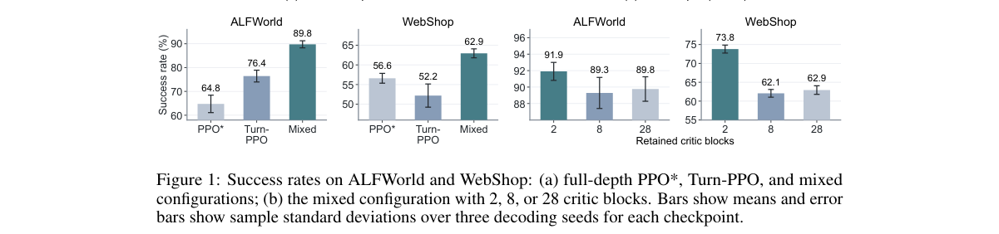

*Main result - Figure 1 Overview of VETTA. (a) A shared critic retains early pretrained Transformer blocks and uses separate heads for turn- and token-level value estimation. (b) The actor interacts with the enviro*

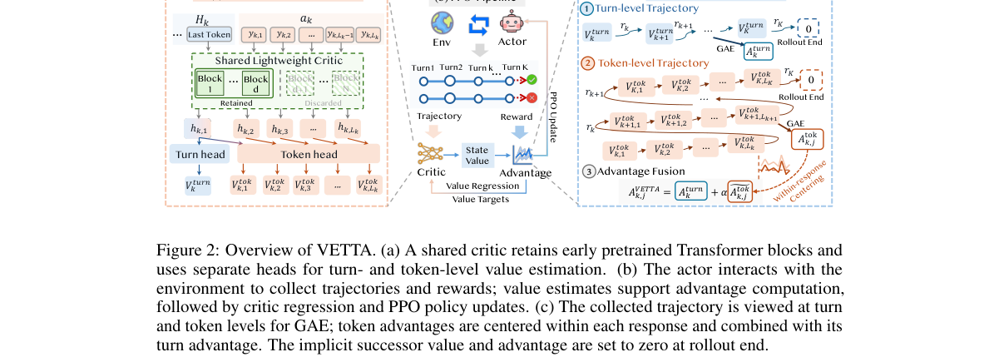

**Why this ranks #8**: 把两个已有的 credit assignment 层级协调起来，价值取决于组合是否超过简单叠加。

---

### 9. FC-SWE: Failure-Conditioned RL for Long-Horizon Software Engineering Agents

**arXiv**: [2610.07898](https://arxiv.org/abs/2610.07898) | **Score**: 7.0 (relevance 7 x 0.7 + quality 7 x 0.3) | **Tags**: rlhf, rl-algorithm | **Categories**: cs.LG, cs.SE | **Pages**: 23

**Authors**: Jia Liufu, Bin Hu, Linglin Jing, Terry Kong, Yuki Huang, Ashwath Aithal, Wenming Yang, Jun Yang

**Affiliation**: 1NVIDIA, 2Tsinghua University

**Abstract**

> Repository-level software engineering (SWE) is a challenging long-horizon setting: agents must reason over extended interactions, use tools, and adapt to stateful environments. Recent work trains SWE agents with reinforcement learning methods such as Group Relative Policy Optimization (GRPO), which independently sample multiple trajectories per issue, test the resulting patches, and compare terminal rewards within a fixed group. However, this training setup does not reuse verifier feedback from failed patches as context for subsequent attempts, even though this feedback contains valuable diagnostic information about what went wrong. Training on recovery trajectories is challenging because the preceding outcome determines whether the next trajectory is generated, while the failed execution determines its conditioning context. We introduce FC-SWE, a failure-conditioned RL framework that incorporates recovery attempts into policy training. After a patch fails verification, FC-SWE restores the repository to its original task state and uses the failed patch and verifier feedback as context for a recovery trajectory. FC-SWE adapts GRPO to these chains of complete, multi-turn tool-use trajectories through two mechanisms. Trajectory-local rewards preserve each attempt's verifier outcome, preventing recovery success from rewarding an earlier failed patch. Active-set advantage estimation forms a comparison group from all initial and recovery trajectories actually executed for the same issue, so failed attempts remain in the group while unexecuted attempts are excluded. On all 500 SWE-bench Verified tasks under a verifier-assisted protocol, FC-SWE with Qwen3.5-4B and SWE-agent achieves 41.7% Resolved@1 and 52.8% Resolved@2, compared with 38.9% and 48.5% for GRPO. Although trained with at most two attempts per chain, FC-SWE reaches 70.7% Resolved@11 under an eleven-attempt test-time budget.

**Key findings**

- **Finding**: GRPO 式 SWE 训练为每个 issue 独立采样多条轨迹、测试补丁并在固定组内比较终端奖励。

- **Finding**: 作者指出该设置没有复用验证器反馈，并提出失败条件化的 RL（FC-SWE）以在尝试之间传递反馈。

- **Inference**: 失败条件化的价值在于把 N 次独立尝试变成 N 次信息累积——对验证器昂贵（要跑测试）的任务，这是样本效率的直接倍增。

- **Recommendation**: NVIDIA + 清华；与 GRPO 的对照设置应固定验证器预算，否则比较不公平。

**Key figures**

*Framework / architecture - Figure 1 Comparison of trajectory execution in GRPO and FC-SWE. During training, our GRPO baseline samples independent attempts, whereas FC-SWE launches a recovery trajectory after failure, conditio*

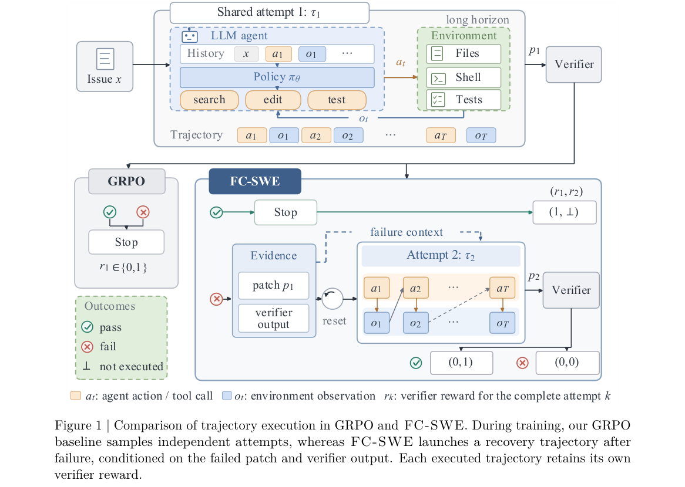

*Main result - Figure 1 End-to-end FC-SWE training system. Rollout workers execute verifier-delimited attempts; failed chains are reset and resumed with bounded failure evidence. Executed trajectories are packed w*

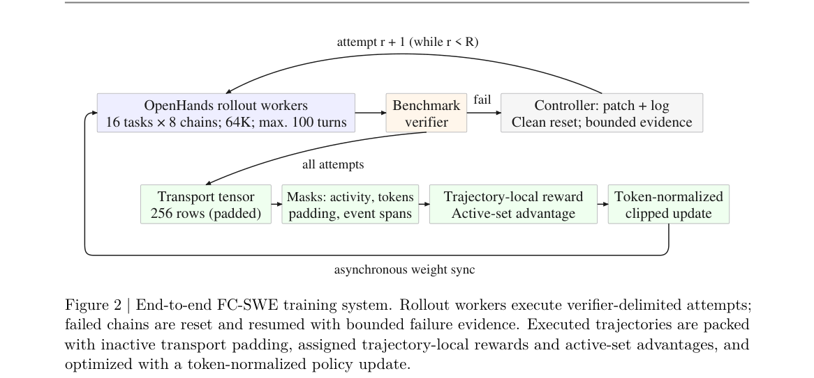

**Why this ranks #9**: 失败条件化让每次尝试的验证器反馈跨尝试复用，是长时程智能体训练的数据效率杠杆。

---

### 10. Revisiting Temporal Regularization for Smooth Control in Deep Reinforcement Learning

**arXiv**: [2610.07910](https://arxiv.org/abs/2610.07910) | **Score**: 6.7 (relevance 7 x 0.7 + quality 6 x 0.3) | **Tags**: rl-algorithm, sim-to-real | **Categories**: cs.LG, cs.RO | **Pages**: 8

**Authors**: SungJae Ahn, Jeong Woon Lee, Kyoleen Kwak, Hyoseok Hwang

**Affiliation**: 1College of Software, Kyung Hee University.

**Abstract**

> Deep Reinforcement Learning policies can produce nonsmooth action oscillations that hinder deployment on physical robots. Existing architectural and penalty-based approaches seek spatial smoothness by directly reducing sensitivity to changes in state inputs, but their broad constraints can degrade task performance as stronger smoothing is pursued. Temporal regularization instead constrains action differences along observed transitions, but has been considered unable to provide the spatial smoothness needed under observation noise. We revisit this assumption by proving that the temporal penalty bounds the expected action differences between current states sharing a next state, revealing a spatial effect that empirically extends to spatial smoothness. Building on this finding, we propose Conditioning for Action using only Temporal Smoothness (CATS), which combines a temporal penalty with linear ramp-up. We highlight temporal regularization's ability to provide spatial smoothness while better preserving task performance than explicit spatial regularization. Through linear ramp-up, CATS allows the policy to learn rewarding behavior before progressively smoothing its actions, improving return preservation and both temporal and spatial smoothness. Experiments in both simulation and the real world show that CATS substantially reduces action oscillation without degrading task performance, with little computational overhead.

**Key findings**

- **Finding**: 既有方法通过降低对状态输入变化的敏感度求空间平滑，这种宽约束会随平滑强度上升而损害任务性能。

- **Finding**: 时间正则化沿观测转移约束动作差异，但此前被普遍认为无法提供空间平滑性；本文重审这一判断。

- **Inference**: 若时间正则化确实能提供空间平滑，它在部署上的优势是平滑强度与任务性能解耦——这正是宽泛空间约束做不到的。

- **Recommendation**: 8 页短文；结论若成立会改变许多控制类 RL 工作的正则化选择，值得独立复核。

**Key figures**

*Framework / architecture - Figure 1 From temporal regularization to spatial smoothness. Black arrows denote actions; colored arrows indicate alignment. The temporal penalty aligns actions along transitions (left). When nearby st*

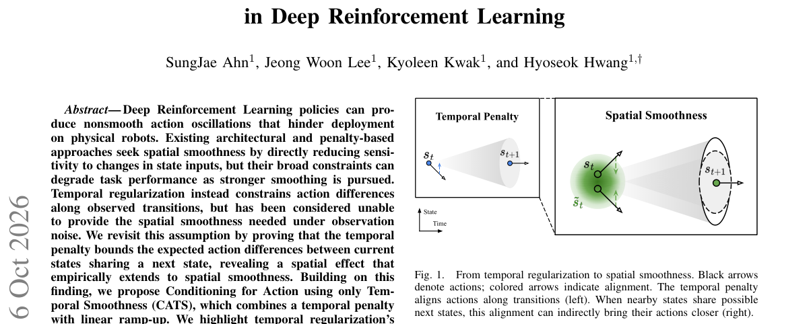

*Main result - Figure 1 Return at matched smoothness levels on Hopper and Walker. For each target score in {0.2, 0.4, 0.6, 0.8}, we compared configurations whose smoothness scores (lower is better) are within 10% of*

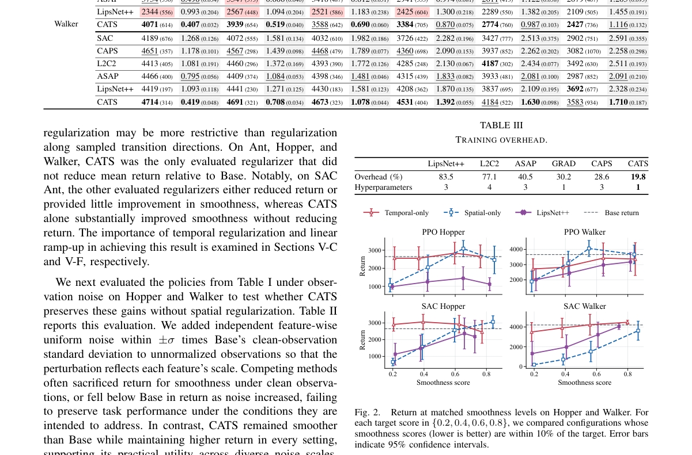

**Why this ranks #10**: 一篇重新检视领域既有假设的短文：时间正则化到底能不能给出空间平滑。

---

## Footer

- Total papers reviewed across all 5 tracks: 50 (from 531 scanned)
- rl track final top-10: 10
- Wild-cards in this track: 2
- Figure assets: `res/` (shared across tracks)

Generated by `mine-arxiv-daily-digest` skill. Sister file: `2026-10-07_rl_entry.md`.
