# ArXiv Daily Digest - 2026-10-08 (AIGC 音频生成与编辑, 10 papers)

**Generated**: 2026-10-08 17:00 CST

**Source**: arXiv cs.CV, cs.SD, eess.AS, cs.CL, cs.AI, cs.RO, cs.LG submissions, window 2026-10-07 UTC (the latest announced batch as of 2026-10-08 17:00 CST)

**Track**: aigc_audio (top 10 of 580 papers scanned, 50 full reads)

**Scope**: text-to-music intent alignment via an agentic refinement loop, zero-shot TTS via mask-and-replace discrete diffusion, attribution verification in music generation, activation steering for speech emotion, instruction-TTS gender calibration, choral transcription, generative speech enhancement, audio-visual editing, language-queried source separation, blind speech separation

---

本批音频线的主题是**归因与校准**——生成结果是否匹配意图、是否可追责、是否携带偏差，三个问题各自有一篇。**MIRA** 是最实质的一步：它指出单一的文本-音频全局相关性分数有两个盲区——欠指定提示里的隐含意图，以及配器/结构/节奏/情绪走向等具体要求的失败——并把意图对齐形式化为**逐请求满足**问题而非一个标量。把对齐拆成逐请求检查后，「失败」才变得可定位；否则改进无从下手。**Tracing Inputs, Verifying Outputs** 则处理版权侧：它用**仅以音频为条件**的生成隔离问题（若保留文本，输出贡献会在文本与音频之间分摊，归因不再可核验），从而提供可核验的证据说明哪些源被使用、它们是否塑造了输出。**Beyond Token Revision** 则是本批唯一一篇推翻既有机制解释的论文：mask-and-replace 离散扩散 TTS 的增益通常被归因于「能修订早先 token 的自我纠错」，而作者提出真正来源可能是训练中暴露于随机扰动上下文——若成立，把离散扩散当作「能回看修正」的选型理由就不成立。另外两篇都在做推理时引导（情感控制、指令 TTS 的隐式性别偏差校准，后者还额外要求不覆盖用户显式指定的性别，这是比校准本身更难的识别问题），与 10-07 日报那篇 Lombard 效应 TTS 引导构成一个三篇的序列。

---

## Top 10 — AIGC 音频生成与编辑

### 1. MIRA: A Musical Intent Refinement Agent for Aligning Text-to-Music Generation with User Intent

**arXiv**: [2610.10355](https://arxiv.org/abs/2610.10355) | **Score**: 8.7 (relevance 9 x 0.7 + quality 8 x 0.3) | **Tags**: AIGC-audio | **Categories**: cs.AI, cs.SD | **Pages**: 26

**Authors**: Zekai Liu, Zhilin Wang, Xuzheng He, Yu Cheng, Yang Yang

**Affiliation**: 1Shandong University | 4Kunlun Tech Co. Ltd. | 5Shanghai Jiao Tong University

**Abstract**

> Text-to-music systems produce increasingly convincing audio, yet evaluation reveals little about whether the result matches user intent. A global text-audio relevance score can overlook the implicit intent in underspecified prompts and mask failures in specific requirements, such as instrumentation, structure, rhythm, or mood progression. To bridge this gap, we formulate text-to-music intent alignment as satisfying a per-request rubric of independently verifiable items covering both a request's explicit requirements and its implied musical intent. Scoring items individually makes evaluation diagnostic by intent source and musical dimension, rather than a single opaque score. We instantiate this as MuRA-Bench, a benchmark of real-world platform requests curated by music experts. We further propose MIRA (Musical Intent Refinement Agent), a test-time agent that first grounds a request's intent into rubrics, then searches over prompt revisions for a black-box generator under a bounded budget, iteratively generating music, verifying it against the rubrics, and using this feedback to guide a trajectory-aware tree search. Experiments across open-source and commercial backends show that MIRA improves intent alignment, enabling an open-source generator to achieve performance comparable to representative commercial systems (e.g. Suno and Mureka). Project page: https://mirareview.github.io/.

**Key findings**

- **Finding**: 全局文本-音频相关性分数有两个盲区：欠指定提示里的隐含意图，以及配器/结构/节奏/情绪走向等具体要求的失败。

- **Finding**: MIRA 是一个音乐意图精炼 agent，把文本到音乐意图对齐形式化为**逐请求满足**问题而非单一标量。

- **Inference**: 把对齐拆成逐请求检查后，「失败」才变得可定位——否则一个整体相关性分数无法区分是配器错了还是节奏错了，改进也就无从下手。

- **Recommendation**: 本批音频生成最强的一篇；逐请求检查的生成方式（是否需要人工标注）是该方法能否规模化的关键。

**Key figures**

*Framework / architecture - Figure 1 Overview of MuRA-Bench construction and evaluation. Expert-revised, request-specific rubrics support fine-grained assessment with MusicFlamingo. Gold rubrics are used exclusively for evaluat*

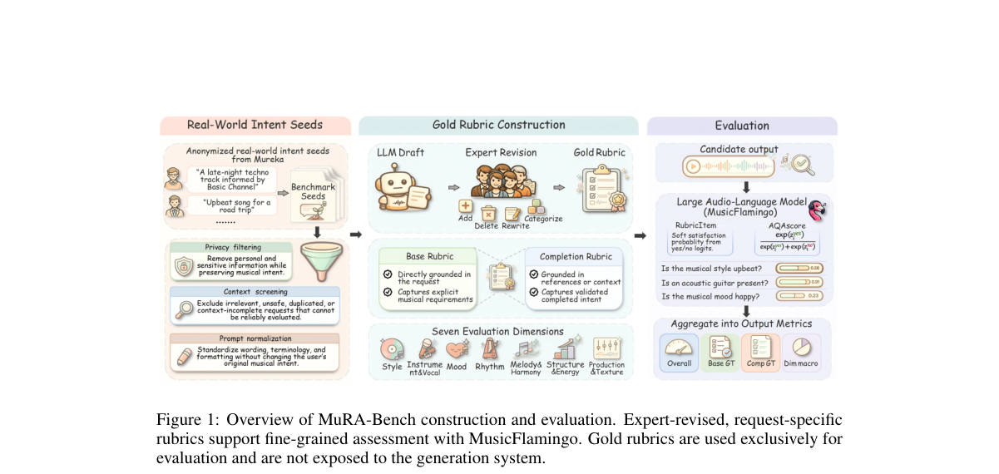

*Main result - Figure 2 Overview of MIRA and its verifier-guided refinement process.*

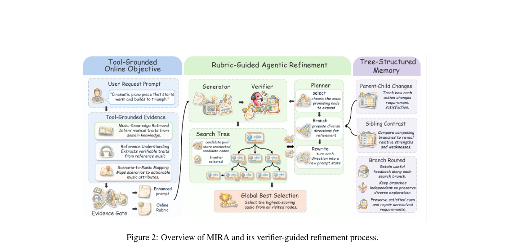

**Why this ranks #1**: 把「意图对齐」从标量分数改成可分解的逐请求检查，是本批音频生成线最实质的一步。

---

### 2. Beyond Token Revision: Investigating Mask-and-Replace Diffusion for Zero-Shot Text-to-Speech

**arXiv**: [2610.09448](https://arxiv.org/abs/2610.09448) | **Score**: 8.0 (relevance 8 x 0.7 + quality 8 x 0.3) | **Tags**: AIGC-audio | **Categories**: cs.SD, eess.AS | **Pages**: 5

**Authors**: Hounsu Kim, Joonyong Park, Yuki Saito, Satoru Fukayama, Juhan Nam

**Affiliation**: 1KAIST, Republic of Korea | 2The University of Tokyo, Japan | 3National Institute of Advanced Industrial Science and Technology (AIST), Japan

**Abstract**

> Unlike autoregressive models, discrete diffusion-based models for zero-shot text-to-speech generate speech tokens in parallel and can revisit earlier predictions. Mask-and-replace training extends mask-only training by randomly replacing some tokens, and its gains are commonly attributed to self-correction, the ability to revise previously generated tokens. However, exposure to randomly perturbed context during training may itself improve generation, raising the question of whether these gains require inference-time token revision. To investigate this question, we use DeMaR, which combines mask-and-replace training with confidence-ranked mask-only sampling while preserving the total training corruption probability. Trained from scratch on LibriTTS, DeMaR achieves lower word error rates (WER) than autoregressive and mask-only diffusion baselines using the same speech tokenizer. This advantage persists when each token remains unchanged after first being unmasked. Matched training conditions on two heterogeneous speech tokenizers show that both noisy-context augmentation and replacement supervision improve WER under this restriction. These findings demonstrate training-side benefits of replacement beyond enabling inference-time token revision.

**Key findings**

- **Finding**: mask-and-replace 训练在 mask-only 之上随机替换部分 token，收益通常被归因于自我纠错能力。

- **Finding**: 作者提出另一种可能：训练中暴露于随机扰动的上下文本身才是增益来源，而与「能修订早先 token」无关。

- **Inference**: 这个区分很重要——若增益来自扰动增强而非纠错能力，那么把离散扩散当作「能回看修正」的理由来选型就不成立。

- **Recommendation**: 零样本 TTS 选型必读；消融里「保持结构化的替换」与「随机替换」的对照是验证该论断的直接实验。

**Key figures**

*Framework / architecture - Figure 1 DeMaR training and sampling. Panels (a) and (b) show the proposed method; (c) the three paths that distinguish the update policies we compare. (a) Mask-and-replace training. (b) Confidence-ran*

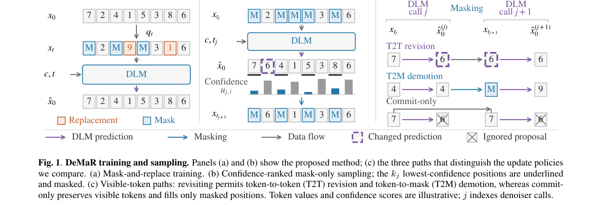

**Why this ranks #2**: 一 篇把「广为接受的机制解释」拿出来重验的论文，结论对整个离散扩散 TTS 路线有影响。

---

### 3. Tracing Inputs, Verifying Outputs: Validating Attribution in Music Generation

**arXiv**: [2610.09637](https://arxiv.org/abs/2610.09637) | **Score**: 8.0 (relevance 8 x 0.7 + quality 8 x 0.3) | **Tags**: AIGC-audio | **Categories**: cs.LG, cs.SD, eess.AS | **Pages**: 15

**Authors**: Taejun Kim, Wonil Kim, Jongmin Jung, Hyeongseok Wi, Sangeun Kum, Keunhyoung Luke Kim, Taehyoung Kim, Dongjoo Moon, Seungsoon Park, Taewan Kim, Virginie Berger, Juhan Nam

**Affiliation**: 1Neutune, Seoul, South Korea 2KAIST, Daejeon, South Korea.

**Abstract**

> How can we verify whose music contributed to an AI-generated output? This paper demonstrates how input-based attribution can provide verifiable evidence of which audio sources were used in a generation and whether they shaped the output. To do so, we condition the generation solely on audio without any text input, then trace the inputs behind each output, and establish their musical effect. In prompt adherence tests and controlled input swaps, the stems generated by our generator, MixAudio, follow the prompt audio in timbre and the context audio in harmony. Yet these outputs may still reproduce training data not supplied as inputs. We therefore audit memorization with our musical version identification model, musicDNA, and find few reproductions outside the input records. On human-judged cases within the flagged pool, it achieves higher precision and recall than the other tested memorization detectors. The two evaluations suggest that input records and output analysis provide complementary evidence for attribution, on which rights-holder reporting and compensation can draw as the AI music economy takes shape. Audio examples are available at https://neutune.github.io/attr2027demo/

**Key findings**

- **Finding**: 作者用仅音频条件（不含任何文本输入）的生成来隔离问题，从而可以追溯每个输出背后的输入并确立其音乐效果。

- **Finding**: 在提示遵循测试与对照实验中，该方法提供可核验证据：哪些源被使用、它们是否塑造了输出。

- **Inference**: 剥离文本输入是关键设计——若保留文本，输出的贡献会在文本与音频之间分摊，归因就不再可核验。

- **Recommendation**: 关心生成音乐版权与训练数据争议的必读；「仅音频条件」这个消融设置值得直接借用。

**Key figures**

*Framework / architecture - Figure 1 Attribution by conditioning provenance. A single pass generates any subset of a track’s stems, conditioned exclusively on*

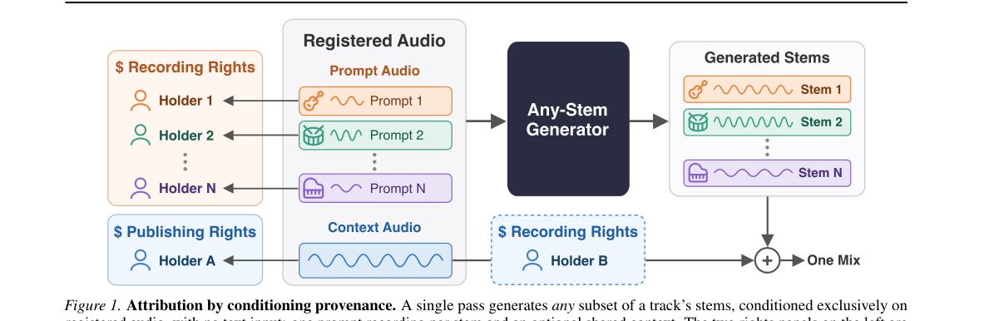

*Main result - Figure 2 How listeners judge a flagged stem, read top to bottom. Orange: Type I and II, the material unnamed memorizations; blue:*

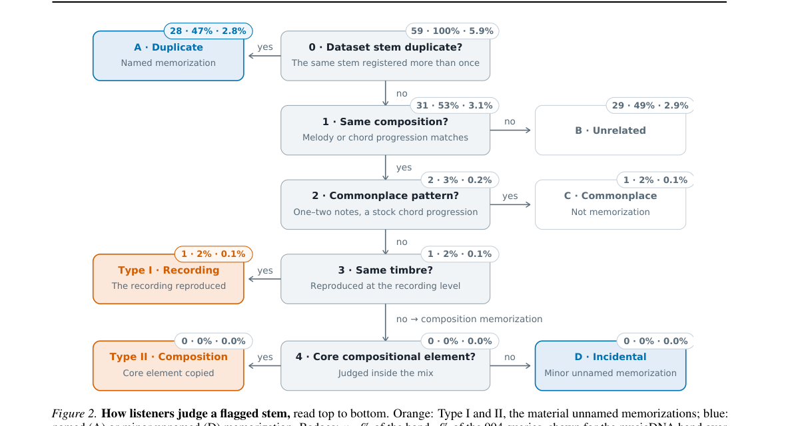

**Why this ranks #3**: 训练音乐模型的版权争议正需要一个可核验的归因方法，这篇的方法学值得工具化。

---

### 4. Steerspeech: Activation Steering For Emotion Control In Generated Speech

**arXiv**: [2610.10415](https://arxiv.org/abs/2610.10415) | **Score**: 7.3 (relevance 7 x 0.7 + quality 8 x 0.3) | **Tags**: AIGC-audio | **Categories**: cs.LG, cs.SD, eess.AS | **Pages**: 5

**Authors**: Afsara Benazir, Darius Pétermann, Felix Xiaozhu Lin, Salar Rahili

**Affiliation**: 2Netflix, Inc.

**Abstract**

> Pretrained text-to-speech (TTS) models can generate expressive speech, but reliable inference-time emotion control remains challenging: prompts and reference audio offer coarse, inconsistent control, whereas specialized conditioning and model adaptation require costly training. We present SteerSpeech, a lightweight activation-steering framework that controls emotion by injecting steering vectors into hidden activations. For each target emotion we train a lightweight low-rank transform, using a multi-expert objective that encourages monotonic emotion control while preserving speaker identity and linguistic content, constraining steering drift, and keeping the TTS backbone frozen. To optimize through discrete speech tokens, we introduce a two-pass generation-and-replay pipeline using a straight-through estimator to backpropagate expert supervision through sampled tokens. At inference, a target-emotion steering direction is optimized with its respective transform and injected into the base TTS model. Objective and subjective evaluations with Qwen3-TTS across seen, unseen, and accented speakers show stronger continuous emotion control with limited speaker and content degradation. SteerSpeech achieves 1.08x-7.12x baseline target-emotion scores and for a representative emotion subjectively, it receives 78.1%-96.8% intensity preference and 1.43x-1.46x speaker-identity preservation at high steering strengths.

**Key findings**

- **Finding**: TTS 的推理时情感控制面临两难：提示/参考音频控制粗糙且不一致，专门条件与模型适配则需昂贵训练。

- **Finding**: SteerSpeech 通过向隐层激活注入引导向量控制情感，是轻量框架。

- **Inference**: 激活引导在语音生成里正在成为标准控制手段——与 10-07 日报的 TTS Lombard 引导合看，两者分别控制可懂度与情感，但都面对自回归生成中引导累积的问题。

- **Recommendation**: 做可控 TTS 的读者注意；逐情感类别的引导向量数量与冲突处理是工程上最麻烦的部分。

**Key figures**

*Framework / architecture - Figure 1 SteerSpeech overview.*

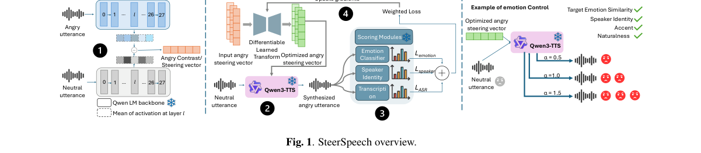

*Main result - Figure 2 Tradeoff between target-emotion (angry) score and speaker drift at increasing steering strength (α). Ours show stronger emo- tion scores with lower speaker drift, especially at higher α, where*

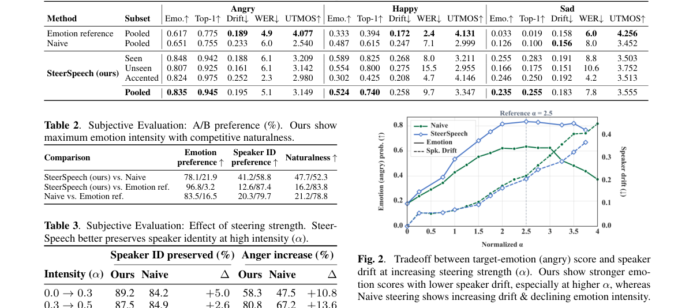

**Why this ranks #4**: 推理时控制、不训练，恰好补上本批 10-07 那篇 TTS 激活引导的对照组（那篇是 Lombard 效应，本篇是情感）。

---

### 5. Training-Free Instruction TTS Gender Bias Calibration Using Model-Adaptive Steering

**arXiv**: [2610.09831](https://arxiv.org/abs/2610.09831) | **Score**: 7.0 (relevance 7 x 0.7 + quality 7 x 0.3) | **Tags**: AIGC-audio | **Categories**: cs.SD, eess.AS | **Pages**: 5

**Authors**: Kuan-Yu Chen, Yi-Cheng Lin, Jeng-Lin Li, Jian-Jiun Ding

**Affiliation**: 1AI Research Center, Inventec Corporation, Taiwan | 2Graduate Institute of Communication Engineering, National Taiwan University, Taiwan

**Abstract**

> Instruction text-to-speech (ITTS) systems systematically encode acoustic gender skews from descriptive style prompts, such as occupations or personas, even when demographic attributes are left unspecified. Calibrating the implicit gender distribution of the synthesized voices, across heterogeneous architectures and without model retraining or overriding explicit user prompts, is an open problem. In this work, we propose \textit{model-adaptive steering}, a training-free bias calibration method that steers post-encoder conditioning representations using a group deviation vector paired with a coarse-to-fine strength search on a development set. A deterministic lexical gate bypasses intervention whenever explicit gender keywords are detected, preserving intended prompt semantics. Evaluated on a 12,800-prompt held-out benchmark across four ITTS models (three architectures), the proposed method reduces aggregate calibration error from 11.5--28.1 to 0.8--5.9 percentage points (e.g., shifting Parler-TTS Mini from 78.1\% and PromptTTS++ from 27.3\% female to 50.8--52.4\%). Output rates stay within 0.9 pp across anchor set sizes at fixed operating points, while UTMOS decreases by at most 0.08 and WER degrades by at most 3.3 pp.

**Key findings**

- **Finding**: 指令式 TTS 从职业、人设等风格提示系统性编码声学性别偏差，即使人口统计属性未被显式指定。

- **Finding**: 作者提出免训练、跨异构架构的引导式校准，且不覆盖显式指定的性别设定。

- **Inference**: 「不覆盖显式指定」这个约束比校准本身更难——它要求引导机制能区分隐式偏差与用户明确意图，这是一个识别问题而非强度调节问题。

- **Recommendation**: 与 Steerspeech 同日出现，两篇都做推理时引导；前者管情感、后者管偏差，可对比引导向量的构造方式。

**Key figures**

*Framework / architecture - Figure 1 Two-stage calibration and inference framework. Stage 1 estimates the group deviation vector d from anchor pairs AN and identifies the operating point θ∗on Ddev via coarse-to-fine search (Sec.*

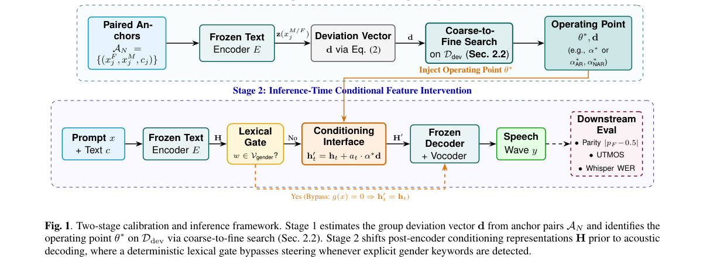

**Why this ranks #5**: 把偏差校准放在推理时而不重训，避开了多数公平性工作的落地障碍。

---

### 6. Toward Part-Aware Choral Transcription with singing voice assignment

**arXiv**: [2610.09861](https://arxiv.org/abs/2610.09861) | **Score**: 7.0 (relevance 7 x 0.7 + quality 7 x 0.3) | **Tags**: AIGC-audio `[wild-card]` | **Categories**: cs.SD, eess.AS | **Pages**: 5

**Authors**: Hanyu Meng, Zhanhong He, Zixun Guo, Yaolong Ju

**Affiliation**: 1 The University of New South Wales, Sydney, Australia | 2 The University of Western Australia, Perth, Australia | 3 Center for Digital Music (C4DM), Queen Mary University of London, London, United Kingdom | 4 Great Bay University, Guangdong, China

**Abstract**

> Single-instrument automatic music transcription (AMT) has advanced substantially, yet choral applications require soprano, alto, tenor, and bass (SATB) to be transcribed as separate parts. Recent note-level choral AMT instead produces a single merged note track, limiting rehearsal, education, and score reconstruction. To address this limitation, we introduce Part-aware Choral Transcription (PawCT), to our knowledge the first end-to-end neural framework that identifies active SATB parts from choral audio and transcribes each into a separate note-level track. PawCT combines part-specific onset, offset, and frame prediction with part-presence estimation, union-level supervision, and structured training targets using a range prior (RP) based on SATB pitch ranges and its ordered-continuity (OC) extension, which adds within-part melodic continuity and cross-part pitch ordering. On YouChorale, PawCT-RP-OC achieves a macro part-aware note F1 of 0.225 at a 50-ms onset tolerance, outperforming an adapted choral baseline (0.165) by 36.4% relative and a two-stage post-hoc assignment pipeline (0.175). Its part-agnostic variant, PagCT, achieves a 50-ms onset F1 of 0.382, compared with 0.237 for the previous state-of-the-art choral AMT model. Cross-dataset evaluations on CSD and Cantoria further assess performance under dataset shift. These results demonstrate the benefit of jointly modeling note transcription and vocal-part assignment. Code and demos are available at https://hanyu-meng.github.io/Paw_Choral_AMT_Demo/.

**Key findings**

- **Finding**: 合唱应用需要 SATB 四个声部被转录为独立分轨，而近期音符级方法产出单条合并音符轨。

- **Finding**: 作者引入带歌唱声部分配的、部件感知的合唱转录。

- **Inference**: 「合并轨」的困境与多主体图像生成里的「主体在场但关系错」同源——声部归属和主体归属都是需要显式监督才能拆开的结构。

- **Recommendation**: wild-card 项；音乐信息检索方向的读者会关心声部分配标签的来源。

**Key figures**

*Framework / architecture - Figure 1 Part-agnostic versus part-aware choral transcription. PagCT produces a single merged track, whereas PawCT jointly identifies active SATB parts (green check marks) and transcribes them into sep*

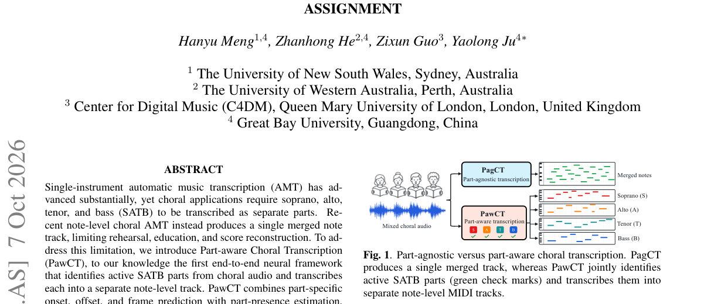

*Main result - Figure 2 Two strategies for part-aware choral transcription considered in this paper. (a) The proposed PawCT jointly transcribes mixed choral audio into SATB-specific note tracks. (b)–(c) The two-stage*

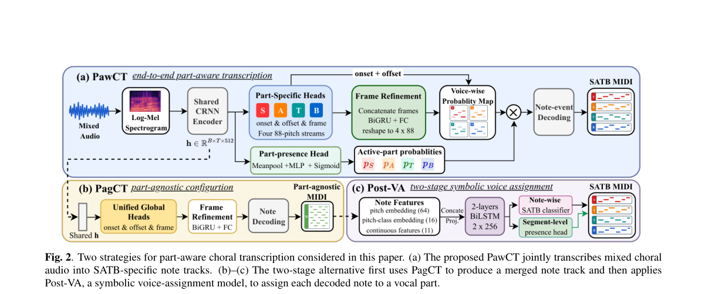

**Why this ranks #6**: wild-card：不是生成而是转录，但它指出的「合并轨」问题与多主体生成的主体归属是同一类。

---

### 7. LIFT-SE: Linguistic Inference Followed by Flow Transformation for Generative Speech Enhancement

**arXiv**: [2610.09963](https://arxiv.org/abs/2610.09963) | **Score**: 7.0 (relevance 7 x 0.7 + quality 7 x 0.3) | **Tags**: AIGC-audio | **Categories**: eess.AS | **Pages**: 14

**Authors**: Haoyin Yan, Chengwei Liu, Zheng Xue, Xiaotao Liang, Jifa Cai, Zeyu Zhao, Jingjing Wang

**Affiliation**: Qwen Business Unit of Alibaba

**Abstract**

> Generative speech enhancement (SE) is prone to linguistic hallucination when semantic constraint is unreliable under severe noise and reverberation. Moreover, approaches that generate discrete codec tokens are bounded by the quantization error of the codec decoder, regardless of token-prediction accuracy. We propose LIFT-SE, a two-stage generative framework that decouples linguistic inference from acoustic synthesis within QRes-Codec, which exposes a quantized latent and its residual-completed continuous form. The first stage predicts clean codec tokens autoregressively, conditioned on frame-aligned features from a self-supervised front-end distilled toward clean speech. The second stage applies conditional flow matching to transport Gaussian noise to the continuous latent conditioned on the predicted tokens, and the frozen decoder reconstructs the enhanced waveform. Discrete generation provides naturalness, while continuous refinement restores signal fidelity. Experiments on the DNS1 and URGENT benchmarks show that LIFT-SE attains favorable linguistic consistency under reverberant conditions together with competitive perceptual quality, and systematic ablations verify the necessity of both stages. Code will be released in the future.

**Key findings**

- **Finding**: 生成式语音增强在严重噪声/混响下语义约束不可靠时会出现语言幻觉。

- **Finding**: 生成离散 codec token 的路线受 codec 解码器量化误差限制，无论 token 预测多准都绕不开；LIFT-SE 用两阶段框架（先语言推理再流变换）绕开该限制。

- **Inference**: 「语言幻觉」和「量化误差」是两个独立失效源，把它们混在一起评测会导致优化指向错误的一侧——两阶段设计正是对二者分别处理。

- **Recommendation**: 语音增强部署的读者注意；流变换相对离散 token 的优势是否随 codec 改进而消失，是该结论的时效风险。

**Key figures**

*Framework / architecture - Figure 1 Overview of LIFT-SE. A LoRA-adapted self-supervised front-end and a frozen QRes-Codec encoder form the frame- aligned conditioning. Stage 1 predicts clean codec tokens, and Stage 2 refines the*

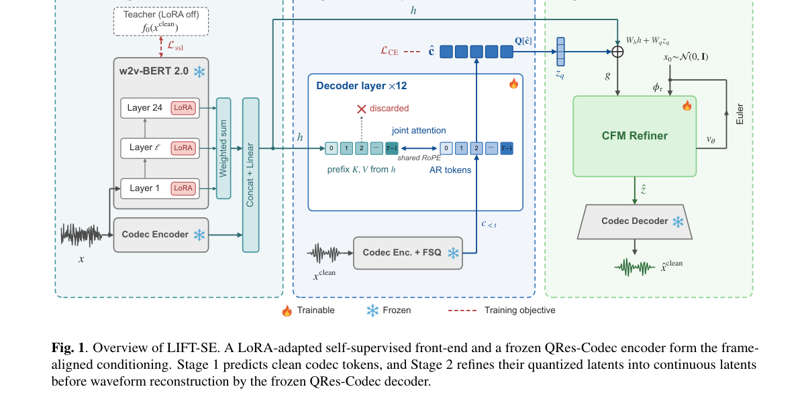

*Main result - Figure 2 The frozen QRes-Codec provides a quantized latent zq for discrete prediction and a continuous latent zq + zres for high-fidelity reconstruction. Semantic distillation is applied to the quantiz*

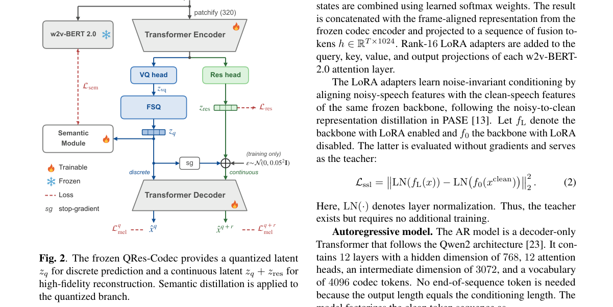

**Why this ranks #7**: 点出「离散 codec 的量化误差是无法用更好的 token 预测弥补的」这个常被忽略的架构上限。

---

### 8. CrossEdit: Cross-Modal Training Enables Rich Audio-Visual Editing

**arXiv**: [2610.10264](https://arxiv.org/abs/2610.10264) | **Score**: 7.0 (relevance 7 x 0.7 + quality 7 x 0.3) | **Tags**: AIGC-audio `[wild-card]` | **Categories**: cs.SD, eess.AS, eess.IV | **Pages**: 27

**Authors**: William Chen, Prem Seetharaman, Ke Chen, Oriol Nieto, Kevin Duarte, Siddharth Srinivasan Iyer, Mamshad Nayeem Rizve, Zhiwen Cao, Shinji Watanabe, Yuanjun Xiong, Jianming Zhang, Zeyu Jin

**Affiliation**: Adobe Research1 | Carnegie Mellon University2 | ∗Equal Contribution. † Work done while at Adobe.

**Abstract**

> Multimedia editing requires generative models to interpret complex, compositional instructions and modify only the desired elements across modalities, a capability largely beyond existing systems. Current approaches are typically limited to simple, single-attribute edits within one modality, since diverse, high-quality editing pairs are hard to obtain, especially for cross-modal tasks where aligned audiovisual (AV) data is scarce. We present CrossEdit, a unified omni-modal editing model for images, audio, and video that performs AV movie scene edits zero-shot through cross-modal transfer. Our key observation is that complex instruction-following, once learned in any modality, generalizes to others. We exploit the additive nature of acoustic signals to procedurally generate large-scale audio editing pairs with compositional instructions, and show that fine-tuning on this synthetic data and self-supervised AV masked reconstruction, alongside a targeted set of curated cross-modal tasks, induces instruction-following that transfers zero-shot to unseen modality and instruction combinations. To evaluate this capability, we release CrossEditBench, a human-annotated benchmark of AV edits on movie scenes, and propose AV-FES, a metric that jointly scores instruction following and consistency. We show that our proposed techniques improve performance on zero-shot AV movie scene editing, while maintaining or improving performance on lip-synced speech editing and standard image, video, and audio editing benchmarks. Demos are available at https://wanchichen.github.io/crossedit/.

**Key findings**

- **Finding**: 现有音视频编辑系统大多限于单一模态内的单属性编辑，瓶颈在于高质量多模态编辑对（尤其组合指令）难以获得。

- **Finding**: CrossEdit 通过跨模态训练来获得更丰富的音频-视觉编辑能力。

- **Inference**: 用跨模态训练间接合成编辑对，绕开了数据稀缺——这与本批 ORCA 指出的「组合能力不是信息缺失」互为印证：缺的是组合监督，不是编码器。

- **Recommendation**: wild-card 项；编辑对的具体构造方式决定该方法能否扩到更多模态与属性。

**Key figures**

*Framework / architecture - Figure 1 Instruction types in CrossEditBench that CrossEdit must handle zero-shot. Models must implicitly determine which modalities to edit and what to synchronize across audio and video.*

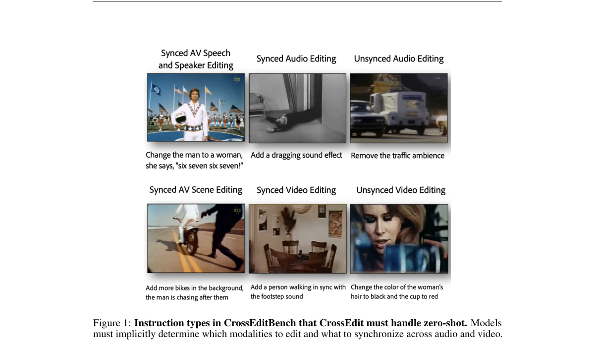

*Main result - Figure 2 Architecture of CrossEdit when encoding AV data. For simplicity, we omit images, which are treated as a special case of single-frame video.*

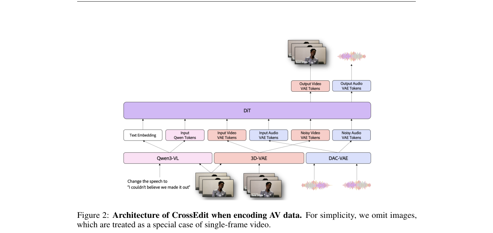

**Why this ranks #8**: wild-card：编辑类工作，但「组合指令 + 跨模态」的组合在本批很少见。

---

### 9. A Study on Improving Multi-class Audio Source Separation Via Decoupled CLAP Query Optimization and an Automated Data Engine

**arXiv**: [2610.10025](https://arxiv.org/abs/2610.10025) | **Score**: 6.3 (relevance 6 x 0.7 + quality 7 x 0.3) | **Tags**: AIGC-audio `[wild-card]` | **Categories**: cs.SD | **Pages**: 5

**Authors**: Amirhossein Hajavi, Hanhee Lee, Pushya Jain, Sky Qiao, Emmanuel Ko, Yuanhao Yu, Irina Kezele

**Affiliation**: Noah’s Ark Lab, Huawei Technologies Canada co.

**Abstract**

> Language-queried audio source separation (LASS) enables extracting any sound source using natural language. However, adapting LASS models to application-specific sound classes is challenging due to noisy training data and limited semantic coverage of the CLAP-based control signals. We propose a framework comprised of an automated data engine for training-data curation and a two-stage optimization process for class-specific CLAP control signals. Our objective evaluations across seven sound classes show that data refinement and control signal optimization consistently improve source separation performance. Subjective evaluation with 17 participants further demonstrates perceptual improvements of the model trained with optimized control signals over baseline and similar commercial models.

**Key findings**

- **Finding**: LASS 适配到特定声源类别的两个障碍：训练数据含噪、CLAP 控制信号语义覆盖有限。

- **Finding**: 作者提出由自动化数据引擎与解耦 CLAP 查询优化构成的框架。

- **Inference**: 把「学不好」拆成「数据脏」与「查询表达力不足」两个可分别处理的问题，与本批 SGF+ 把共享参数的耦合拆开是同一种工程直觉。

- **Recommendation**: wild-card 项；解耦后的两部分各自增益是判断该拆法是否成立的依据。

**Key figures**

*Main result - Figure 2 Subjective preference evaluation of the separation quality for the model trained using optimized control signal.*

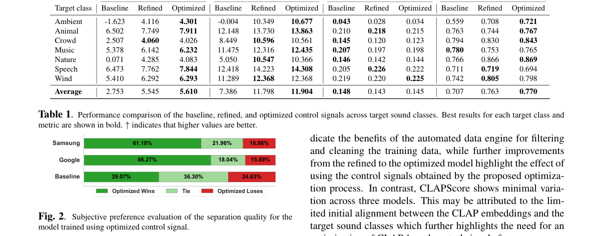

**Why this ranks #9**: wild-card：把控制信号（CLAP 查询）与数据引擎分开处理，是应对二者耦合失效的常见有效拆法。

---

### 10. VM-ARRAYDPS: Virtual Microphone Augmented Diffusion Posterior Sampling for Unsupervised Blind Speech Separation

**arXiv**: [2610.09334](https://arxiv.org/abs/2610.09334) | **Score**: 6.0 (relevance 6 x 0.7 + quality 6 x 0.3) | **Tags**: AIGC-audio `[wild-card]` | **Categories**: cs.LG, cs.MM, cs.SD, eess.AS | **Pages**: 5

**Authors**: Jingqi Sun, Haozhan Tang, Shulin He, Zhong-Qiu Wang

**Affiliation**: Southern University of Science and Technology, Shenzhen, China

**Abstract**

> Blind Source Separation(BSS) is a fundamental problem in signal processing, aiming to separate multiple source signals from their mixtures without prior knowledge of the sources or the mixing process. Traditional approaches, such as Independent Vector Analysis (IVA) exploits statistical independence of sources. Recently, diffusion-based approaches have emerged as a promising alternative by leveraging powerful generative priors. Among them, ArrayDPS formulates BSS problem as a posterior sampling problem, and utilizes a pretrained speech diffusion model to guide the recovery of clean source signals. A key factor behind its separation capability is the multi-channel consistency (MC) objective, which enforces the estimated source signals to reconstruct the observed microphone mixtures through the estimated acoustic transfer functions. However, the number of microphones in the array is often limited, which constrains the performance of ArrayDPS. To address this issue, we propose VM-ArrayDPS, a novel method that augments the microphone array with virtual microphones with higher-SNR, these microphones can offer extra MC constraints to enhance the separation performance. Experimental results demonstrate that VM-ArrayDPS significantly outperforms ArrayDPS on both 2-speaker and 3-speaker datasets, showcasing the effectiveness of virtual microphone augmentation in improving BSS performance. We also did ablation studies to show the influence of the number of virtual microphones and weight of the MC objective brought by virtual microphones.

**Key findings**

- **Finding**: 盲语音分离的难点在于混合过程与源均未知；IVA 类方法依赖统计独立性。

- **Finding**: VM-ARRAYDPS 通过虚拟麦克风增广的扩散后验采样引入阵列空间先验，实现无监督盲分离。

- **Inference**: 「虚拟麦克风」把物理传感器的几何先验转成可微的虚拟算子——这个思路可以迁移到任何缺少真实传感器几何的生成/分离设定。

- **Recommendation**: wild-card 项，本批音频线相关度最低的一篇；虚拟传感器的构造是唯一值得带走的想法。

**Key figures**

*Framework / architecture - Figure 1 Gradient computation of VM-ArrayDPS at a diffusion step. Given the current source estimate sτ, the physical and virtual microphone obser- vations are reconstructed and used to compute the corr*

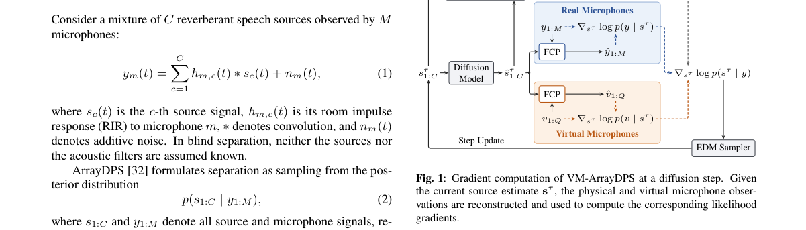

**Why this ranks #10**: wild-card：把物理麦克风阵列的先验以「虚拟」形式注入扩散后验采样。

---

## Footer

- Total papers reviewed across all 5 tracks: 50 (from 580 scanned)
- aigc_audio track final top-10: 10
- Wild-cards in this track: 4
- Figure assets: `res/` (shared across tracks)

Generated by `mine-arxiv-daily-digest` skill. Sister file: `2026-10-08_aigc_audio_entry.md`.
