# ArXiv Daily Digest - 2026-10-08 (AIGC 图像 / 视频 / 3D 生成与编辑, 10 papers)

**Generated**: 2026-10-08 17:00 CST

**Source**: arXiv cs.CV, cs.SD, eess.AS, cs.CL, cs.AI, cs.RO, cs.LG submissions, window 2026-10-07 UTC (the latest announced batch as of 2026-10-08 17:00 CST)

**Track**: aigc_visual (top 10 of 580 papers scanned, 50 full reads)

**Scope**: autoregressive video generation with gradient decoupling, real-time joint audio-video generation, quadtree visual tokenization, latent compression for video DiT, reference-bound reward verification for multi-subject generation, compositional failure analysis in T2I, self-conditioning for single-stage 3D, cache reuse via offline-to-online RL, pose-free 3DGS

---

本批最强的诊断来自自回归视频生成：**SGF+** 发现去噪角色与 KV 写入角色共用参数时，两者的梯度呈现不同模式并存在**系统性负对齐**，直接妨碍视觉质量与时序一致性的联合优化。这解释了为什么时序不一致很难靠更大模型解决——不是学不会长程依赖，而是去噪梯度在直接损害 KV 写入目标。**Real-Time Joint Audio-Video Generation** 在部署侧给出同一病因的同一解法：链式流水线靠顺序获得「块自回归」与「少步采样」两项能力，但每一步都在微调上一步的权重，所以**后一个目标可以撤销前一个能力**；作者改为让两项能力并行获得——因果适配器针对冻结骨干训练、现成少步适配器提供少步能力，二者更新方向近似正交（训练中未施加任何正交约束），推理时直接相加。实时性数字是本批唯一完整的：**480×832、未量化、约 26 fps、支持 30 秒连续生成**。**ORCA** 在文本到图像侧给出结构相同的论断：现有架构已用 T5 补强 CLIP，但组合失败持续存在，因此绑定问题不是信息缺失而是对齐错位——**补更强的文本编码器这条主流解法被判为无效**，这个结论比方法本身更重要。三条线合起来给出今天 AIGC 视觉线的统一病因：默认路径上的「加信息」或「共享权重」在两个目标之间不构成帮助。配套的修复也成对出现：Visual Jev Rewards 指出「主体在场」不足以确立「正确主体参与了所请求的交互」，与 ORCA 构成因果—修复链条；QuadTok 与 SGF+ 则分别从表示结构与梯度结构给出独立改进轴。其余是效率与几何：GRACE 把压缩比与下游 DiT 可用性当联合优化问题，MORCA 用离线到在线 RL 做缓存复用决策（把加速交给 RL 而非手工阈值），Position Forcing 利用「VecSet token 仍保留可恢复位置信息」这一观察做自条件生成，DeltaSplat 与 TileSkipper 则分别在前向之后补误差、在渲染层重新分配预算。

---

## Top 10 — AIGC 图像 / 视频 / 3D 生成与编辑

### 1. SGF+: Decoupling Gradient Flows for Autoregressive Video Generation

**arXiv**: [2610.10429](https://arxiv.org/abs/2610.10429) | **Score**: 9.0 (relevance 9 x 0.7 + quality 9 x 0.3) | **Tags**: AIGC-video | **Categories**: cs.CV | **Pages**: 25

**Authors**: Zihan Su, Junhao Zhuang, Yaowei Li, Siwen Lu, Haoran Li, Lingen Li, Haoyu Wu, Weiyang Jin, Songchun Zhang, Haoyang Huang, Chun Yuan, Zeyue Xue

**Affiliation**: 1Tsinghua University | 3The Chinese University of Hong Kong

**Abstract**

> Autoregressive video generation requires denoising the current frames while writing their key-value representations as context for future predictions. However, these two roles typically share parameters, and we find that their gradients exhibit distinct patterns and systematic negative alignment, hindering the joint optimization of visual quality and temporal consistency. We introduce Self Gradient Forcing Plus (SGF+), which assigns separate parameters to context writing and denoising while preserving their interaction through causal attention. Both roles are jointly optimized using the original generation objective without auxiliary losses, with context writing supervised through its contribution to future predictions. This simple change improves visual quality and long-horizon consistency over the evaluated baselines in both framewise and chunkwise generation, without additional video training data or a longer training horizon. Trained on only 5s rollouts, SGF+ supports continuous generation for up to 24 hours without long-video fine-tuning. These results highlight role-specific parameterization as an effective design principle for high-quality autoregressive video generation and native long-horizon extrapolation.

**Key findings**

- **Finding**: 自回归视频生成的两个角色——对当前帧去噪、把当前帧的 KV 写成未来预测的上下文——通常共享参数。

- **Finding**: 作者观察到这两者的梯度呈现不同模式且存在**系统性负对齐**，从而妨碍视觉质量与时序一致性的联合优化；SGF+ 即将这一梯度流解耦。

- **Inference**: 这是「时序不一致」的一个非表层解释：不是模型学不会长程依赖，而是去噪梯度在直接损害 KV 写入目标——共享参数让两个目标变成零和。

- **Recommendation**: 做 AR 视频生成的必读；负对齐的度量方式和幅度是全文最关键的数字。

**Key figures**

*Framework / architecture - Figure 1 Qualitative comparison of autoregressive video generation methods. Self Forcing (SF) blocks context gradients, preventing future predictions from supervising context writing and causing pron*

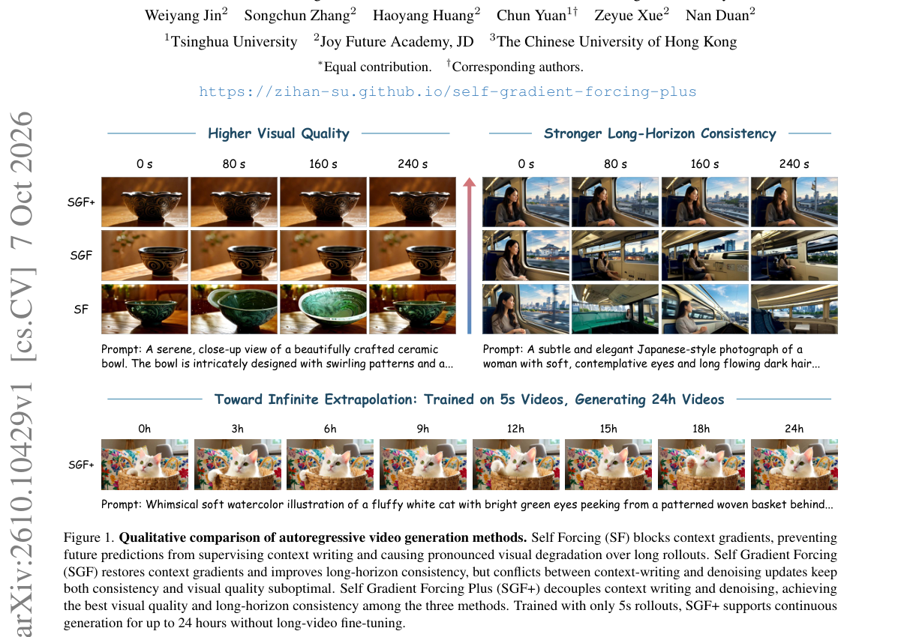

*Main result - Figure 2 Method lineage for autoregressive video generation. SF addresses train–test history mismatch via self-generated rollouts. SGF restores context-writing gradients, while SGF+ decouples context*

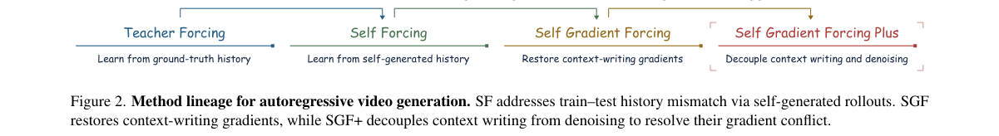

**Why this ranks #1**: 本批最强的一篇：把自回归视频生成的双重角色冲突定位到梯度层面，并给出可操作的解耦。

---

### 2. Real-Time Joint Audio-Video Generation by Parallel Adapter Composition

**arXiv**: [2610.10343](https://arxiv.org/abs/2610.10343) | **Score**: 9.0 (relevance 9 x 0.7 + quality 9 x 0.3) | **Tags**: AIGC-video, AIGC-audio | **Categories**: cs.CV | **Pages**: 15

**Authors**: Jingyu Li, Xiaoxiao Xiang, Yiwen Guo

**Affiliation**: [not-found in PDF]

**Abstract**

> Deploying a joint audio-video diffusion transformer for real-time, interactive generation normally requires two essential modifications: block-autoregressive attention, so frames can be emitted before the whole clip is finished, and few-step sampling, so each block is cheap. Conventionally, the streaming video literature obtains both capabilities from a chained pipeline. It first distills a bidirectional teacher into a causal student, then into a few-step one, or proceeds in reverse order. Each stage of such a chain fine-tunes the weights the previous one produced, so a later objective can undo an earlier capability. Following the idea of model merging, we show that on a packed audio-video backbone the two capabilities can be acquired in parallel. A causal adapter is trained against the frozen backbone, and an off-the-shelf few-step adapter provides the few-step capability. As the two edit different functional axes, we predict, and then verify, that their weight-update directions are near-orthogonal, without any explicit orthogonality constraint during training. Orthogonal updates should combine without interfering, so parallel composition is a direct sum. The two adapters are simply added at inference, with no joint training, yielding few-step, streaming audio-video whose image quality tracks the bidirectional teacher. Compared to the chained baselines, the composed model matches or beats them on most metrics, making parallel composition a practical approach. The resulting streaming system generates joint audio-video in real time, $\approx$26 fps at $480\times832$ without quantization, and sustains 30 s of continuous generation with stable image quality.

**Key findings**

- **Finding**: 两项必要改造是块自回归注意力（让帧在片段完成前即可输出）与少步采样（让每块足够廉价）。

- **Finding**: 流式视频文献通常用**链式**流水线获得这两项能力（先把双向教师蒸馏成因果学生，再蒸馏成少步模型，或反序）；作者指出每一步都在微调上一步产出的权重，因此**后一个目标可以撤销前一个能力**。

- **Finding**: 作者沿模型合并的思路让两项能力**并行**获得：因果适配器针对冻结骨干训练，现成的少步适配器提供少步能力；两项编辑不同的功能轴，作者预测并随后验证二者的权重更新方向近似正交——训练中没有施加任何显式正交约束。两个适配器在推理时直接相加，无联合训练。

- **Finding**: 合并模型在多数指标上匹配或超过链式基线；实时系统在 480×832、未量化条件下约 26 fps，可维持 30 秒连续生成且图像质量稳定。

- **Inference**: 「后一个目标撤销前一个能力」与本批 SGF+ 的梯度负对齐是同一失效：两个目标共享参数时，联合优化在数学上就是零和。既然更新方向近似正交，正交更新应当可加而互不干扰——这是解耦思路成立的理论依据。

- **Recommendation**: 被精读的三篇之一；26 fps / 480×832 / 30 秒连续生成是本批唯一给出完整实时性数字的生成工作。

**Key figures**

*Framework / architecture - Figure 1 Three routes to a few-step streaming model, and what the order costs. Distilling last keeps the chain viable, at two extra stages; the reverse order, trained with a plain regression loss, un*

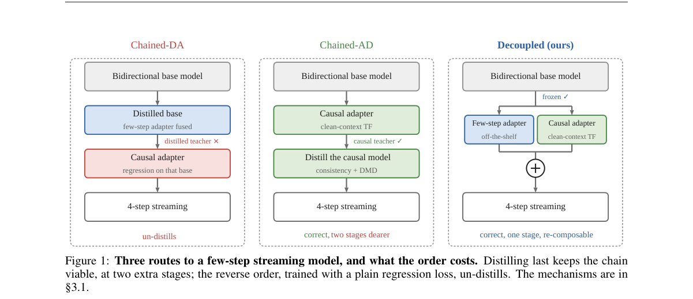

*Main result - Figure 2 One clip streamed to 30 s. Rows are systems and columns are wall-clock seconds; below them the four generated soundtracks share one time axis. CHAINED-DA stops articulating well before the e*

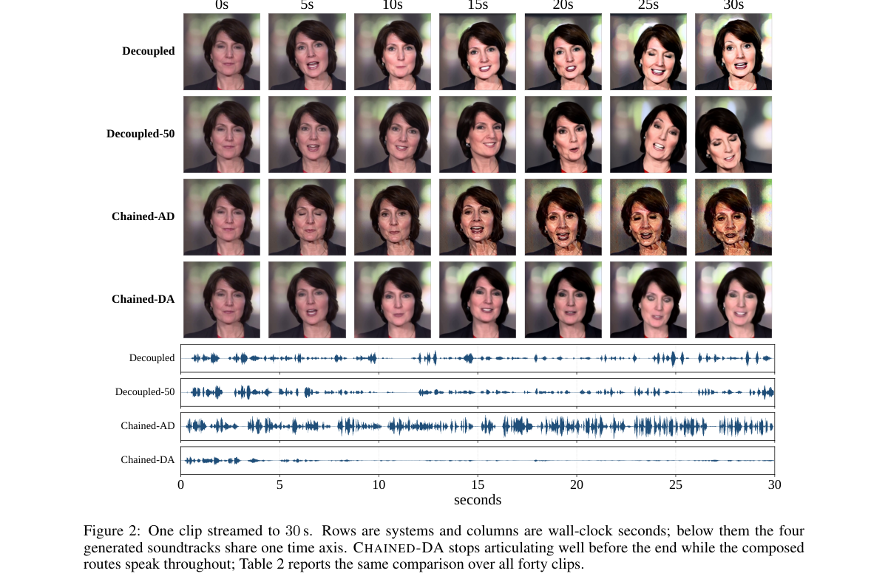

**Why this ranks #2**: 与本批 SGF+ 同一病因、同一解法：把会互相撤销的目标从共享权重上拆开。

---

### 3. QuadTok: Quadtree Visual Tokenizer for Autoregressive Image Generation

**arXiv**: [2610.10497](https://arxiv.org/abs/2610.10497) | **Score**: 8.7 (relevance 9 x 0.7 + quality 8 x 0.3) | **Tags**: AIGC-image | **Categories**: cs.CV | **Pages**: 19

**Authors**: Yucheng Mao, Zeyuan Chen, Xiaojun Shan, Xiang Zhang, Divyansh Srivastava, Bingnan Li, Zhuowen Tu

**Affiliation**: University of California, San Diego

**Abstract**

> We introduce QuadTok, a novel framework for visual tokenization and autoregressive image generation. Compared to traditional approaches using 2D grids or 1D token sequences, we propose a hierarchical quadtree structure, bridging the gap between 2D spatial binding and 1D sequence-level flexibility. The QuadTok tokenizer dynamically allocates representational capacity to visually intricate areas while leaving homogeneous regions at a coarse resolution. Compared with a fixed 256-token grid, our ImageNet-trained tokenizer saves approximately 10% of tokens on ImageNet and 9% when transferred zero-shot to the COCO dataset, while maintaining comparable reconstruction fidelity. Furthermore, the natural causality introduced by the tree structure seamlessly enables autoregressive image generation. Conditioned on a quadtree topology supplied before generation, our 947M GPT-style generative model achieves a 2.08 gFID on the ImageNet $256 \times 256$ benchmark. Additionally, leveraging the strong spatial correlation preserved by the quadtree structure, the QuadTok generator enables zero-shot spatially controlled image generation capabilities. Code: https://github.com/myc634/QuadTok.

**Key findings**

- **Finding**: 传统做法用 2D 网格或 1D token 序列，QuadTok 提出层次化四叉树结构，目标是同时拿到 2D 空间绑定与 1D 序列灵活性。

- **Finding**: tokenizer 动态把表示容量分配给视觉上复杂的区域，同质区域只消耗少量预算。

- **Inference**: 四叉树的隐含主张是图像的信息密度是空间非均匀的——若成立，它比均匀网格更接近自然图像的冗余结构，也解释了为何容量分配能自适应。

- **Recommendation**: 做 AR 图像生成的必读；与本批 SGF+ 对照——一个改生成目标，一个改表示结构，是两条独立的改进轴。

**Key figures**

*Framework / architecture - Figure 1 Adaptive token allocation with QuadTok: (a) Progressive reconstruction using the QuadTok tokenizer: starting from a coarse reconstruction with 64 tokens, additional tokens pro- gressively im*

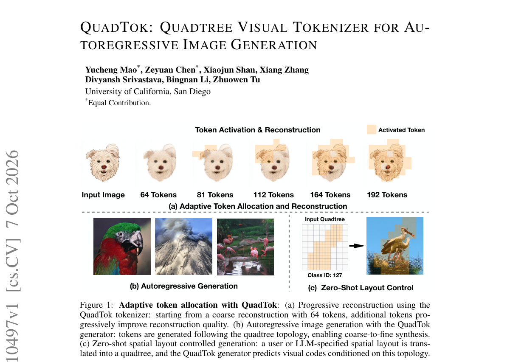

**Why this ranks #3**: tokenizer 是自回归生成里最被低估的一环，四叉树是介于网格与序列之间一个未尝试过的结构。

---

### 4. ORCA: Hunting Compositional Failures in Text-to-Image Diffusion

**arXiv**: [2610.09841](https://arxiv.org/abs/2610.09841) | **Score**: 8.3 (relevance 8 x 0.7 + quality 9 x 0.3) | **Tags**: AIGC-image | **Categories**: cs.CV, cs.LG | **Pages**: 26

**Authors**: Arshia Hemmat, Amirhossein Vahidi, Amitis Shidani, Mohammad Vali Sanian, Hesam Asadollahzadeh, Aryan Yazdan Parast, Mohammad Lotfollahi

**Affiliation**: 1Wellcome Sanger Institute | 2Cambridge Stem Cell Institute, University of Cambridge | 3Cambridge Centre for AI in Medicine, University of Cambridge | 4Department of Medicine, University of Cambridge

**Abstract**

> Text-to-image diffusion models fail predictably on compositional prompts: attributes bind to the wrong objects, spatial relations invert, and multi-object scenes lose count. Recent architectures already augment CLIP with a T5 encoder precisely because CLIP's contrastive embedding loses compositional structure, yet these failures persist. We argue the binding problem is therefore not one of missing information but of misaligned information: a text encoder preserves compositional structure, but in a representation space shaped by language modelling rather than vision, and the denoising objective does not directly reward aligning the two. We show this correspondence can be supplied as an explicit training signal, that the relevant cross-modal information is concentrated in a low-rank subspace of self-supervised visual features, and that supplying it can be folded into diffusion training as a single auxiliary loss. Our method, ORCA (Orthogonal Residual Compositional Alignment), aligns the latent of a diffusion transformer with a low-rank target derived from a frozen visual encoder, through a predictor whose orthogonal basis is parameterised by a learned residual between T5 and CLIP embeddings, which provides a prompt-dependent signal for selecting the visual readout subspace. We prove that the cross-modal information recoverable at a given rank is bounded by the spectral mass of the visual encoder's covariance in the top components. Across three diffusion-transformer backbones (DiT-B/2, DiT-L/2, U-ViT-L), ORCA improves FID and GenEval over both vanilla and REPA baselines at zero inference-time cost; on DiT-L/2 it reaches FID 16.65 and GenEval 0.291 at 200K steps, exceeding the strongest 400K baseline at half the training cost, with the largest gains concentrated on attribute binding, spatial relations, and multi-object prompts.

**Key findings**

- **Finding**: 组合失败的四种具体形态：属性绑错物体、空间关系反转、多物体场景丢计数。

- **Finding**: 现有架构已用 T5 补强 CLIP（因 CLIP 对比嵌入丢失组合结构），但失败持续存在；作者因此论证绑定问题不是信息缺失，而是**对齐错位**。

- **Inference**: 这个论断与本批 SGF+ 的梯度负对齐指向同一类病因：默认的「加信息」或「共享参数」路径在两个目标之间不构成帮助。

- **Recommendation**: 与本批 Visual Jev Rewards 配对——一篇诊断奖励错配，一篇给出奖励设计，两篇构成因果—修复。

**Key figures**

*Framework / architecture - Figure 1 ORCA aligns the diffusion latent with a low-rank visual target via a text-conditioned projector K(∆y) built from the T5−CLIP residual. On DiT-L/2, ORCA reaches the vanilla 400K FID and GenEv*

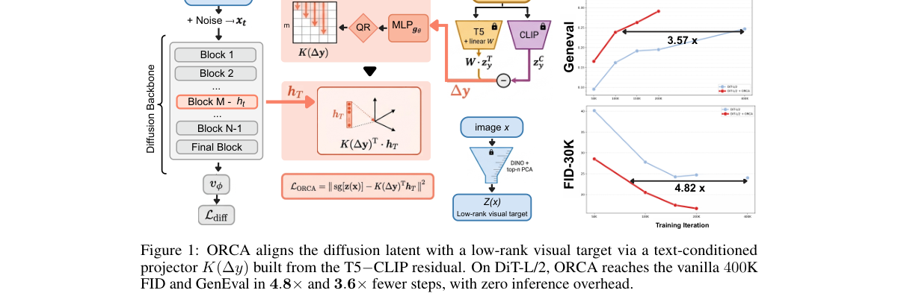

**Why this ranks #4**: 一篇诊断质量很高的论文：把「补更强的文本编码器」这条主流解法判为无效。

---

### 5. GRACE: Generation-aware latent compression for efficient video generation

**arXiv**: [2610.10524](https://arxiv.org/abs/2610.10524) | **Score**: 8.0 (relevance 8 x 0.7 + quality 8 x 0.3) | **Tags**: AIGC-video | **Categories**: cs.CV | **Pages**: 43

**Authors**: Jiyoung Kim, Paul Hyunbin Cho, Jisu Nam, Donghoon Lee, Hyunsung Go, Yeonkyeong Lee, Hansaem Kim, Seungryong Kim

**Affiliation**: 1KAIST AI | 2Kakao Corp. | Project page: https://cvlab-kaist.github.io/GRACE/

**Abstract**

> Highly compressed video autoencoders offer an effective way to accelerate video diffusion models, as the Diffusion Transformer (DiT) operates on far fewer tokens. However, such autoencoders are challenging to train, since a higher compression ratio degrades reconstruction quality and recovering it requires more channels, which is known to slow the convergence of the DiT. The compressed latent also differs from the one the DiT was trained on, so the pretrained DiT must be either retrained from scratch or adapted at considerable cost. Compressing the autoencoder the DiT was trained with appears to preserve compatibility, yet optimizing it for reconstruction alone still shifts the latent away from the distribution the DiT has learned. To address this, we propose Generation-Aware Latent Compression for Efficient Video Generation (GRACE), a two-stage framework that compresses a pretrained video autoencoder while keeping it compatible with the pretrained DiT. Specifically, we keep a frozen base latent from the pretrained encoder and learn a residual latent for the information lost under stronger compression, while aligning the compressed latent with the pretrained latent in the feature space of the frozen DiT so that the autoencoder is optimized for generation. We then adapt the DiT with lightweight fine-tuning and asymmetric denoising, where the base is denoised ahead of the residual. GRACE reduces the token count of Wan2.1-I2V-14B by 8x and its latency by 11.1x at 480x832x81, while matching the generation quality of the pretrained pipeline before compression on VBench.

**Key findings**

- **Finding**: 高压缩自编码器难训练：压缩比升高同时恶化重建质量并需要更多通道，后者已知会拖慢 DiT 收敛。

- **Finding**: 压缩后的 latent 也与 DiT 所熟悉的分布存在差异；GRACE 提出生成感知的压缩以同时处理这两个问题。

- **Inference**: 这实际上是一个循环依赖——latent 的好坏要用下游 DiT 的表现衡量，而 DiT 训练又依赖 latent。作者的框架化处理比单纯提高压缩比更值得看。

- **Recommendation**: 视频生成加速的读者注意；压缩率的收益上限由 DiT 的可学习性决定，这一点常被压缩率指标掩盖。

**Key figures**

*Framework / architecture - Figure 1 Teaser. We present GRACE, a novel latent compression technique that fine-tunes pre- trained video generation models, such as Wan2.1-14B (Wan et al., 2025), to generate from substan- tially f*

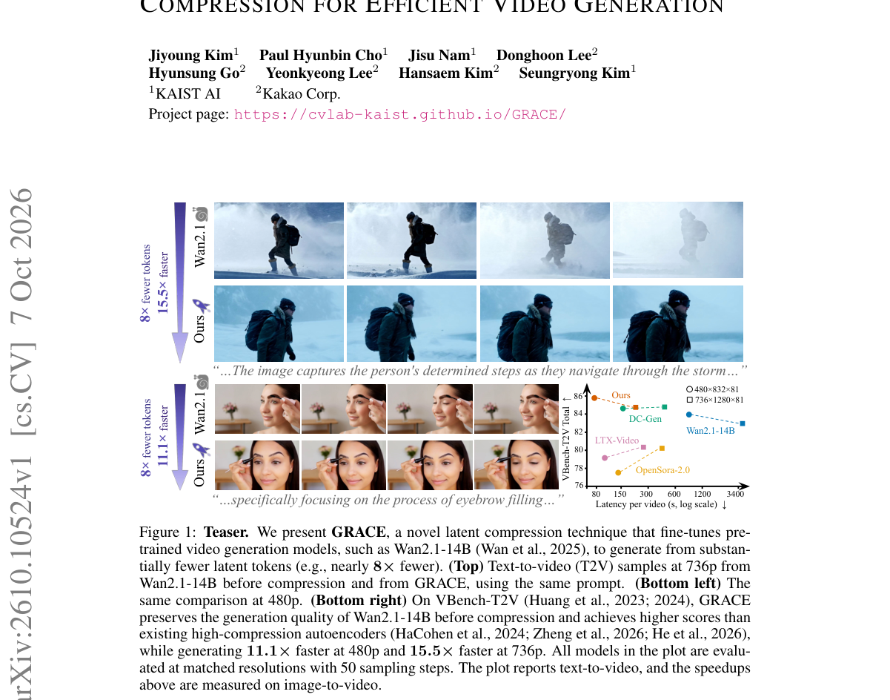

*Main result - Figure 2 Overall architecture. Stage 1 trains the autoencoder. The frozen encoder E maps the downsampled input to zbase, the residual encoder Eres maps the full-resolution input to zres, and ˆD decod*

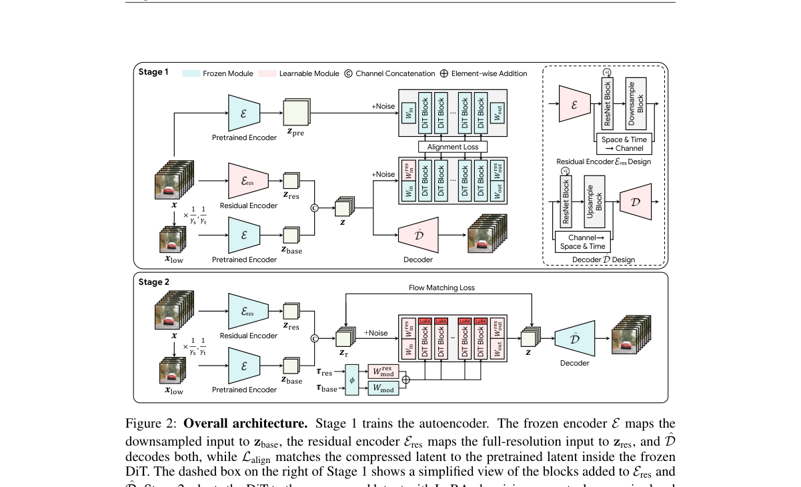

**Why this ranks #5**: 把「压缩比」与「下游 DiT 可用性」视为一个联合优化问题，而非两个独立旋钮。

---

### 6. Visual Jev Rewards: Reference-Bound Verification for Multi-Subject Image Generation

**arXiv**: [2610.09328](https://arxiv.org/abs/2610.09328) | **Score**: 8.0 (relevance 8 x 0.7 + quality 8 x 0.3) | **Tags**: AIGC-image | **Categories**: cs.AI, cs.CV, cs.LG | **Pages**: 9

**Authors**: Baoteng Li, Wenzhuo Wu, Kongming Liang, Zhanyu Ma

**Affiliation**: School of Artificial Intelligence, Beijing University of Posts and Telecommunications1 | Beijing Key Laboratory of Multimodal Data Intelligent Perception and Governance2

**Abstract**

> Multi-subject image generation requires rewards that verify whether requested attributes, actions, and relations hold for the specified reference subjects. Subject presence alone does not establish that the correct subjects participate in a requested interaction. We present reference-bound Visual Jev rewards that turn these visual decisions into generator training signals. Each subject-related question receives a positive label only when the requested condition and the relevant reference identities hold jointly. We construct fixed questions offline, train a Qwen3.5-4B verifier with binary supervision, and directly read Yes probabilities from its language-model head. Their mean supplies a GRPO reward while retaining individual judgments for inspection. Using 200 MICo-150K training tasks and 30 updates, the framework raises a GPT-5.4 composite score from 41.78 to 52.50 on a manually selected 897-task MICo-Bench subset; direct 27B rewards yield 51.84. Each reward is tested in one GRPO run, and offline human evaluation does not establish a statistically significant advantage over direct scoring. The study provides an initial implementation and evaluation of Visual Jev as a reference-bound reward for multi-subject image generation.

**Key findings**

- **Finding**: 「主体在场」不足以确立「正确的主体参与了所请求的交互」——这是多主体生成奖励设计的核心漏洞。

- **Finding**: 参考绑定的 Visual Jev 奖励把这类视觉判断转为训练信号；每个主体相关问题获得正标签的条件被显式定义。

- **Inference**: 与 ORCA 合读得到一条完整链条：奖励只验证主体存在 → 模型学会让主体在场但不参与交互 → 表现为「看起来对但关系错」，这正是 ORCA 观测到的失败形态。

- **Recommendation**: 多主体/角色生成方向的必读；奖励的判定标准（什么算「参与了交互」）是该方法能否迁移的关键。

**Key figures**

*Framework / architecture - Figure 1 From Visual Jev decisions to generation rewards. GPT-5.4 constructs fixed questions offline from the prompt and ordered references. A frozen, task-trained Visual Jev verifier reads Yes proba*

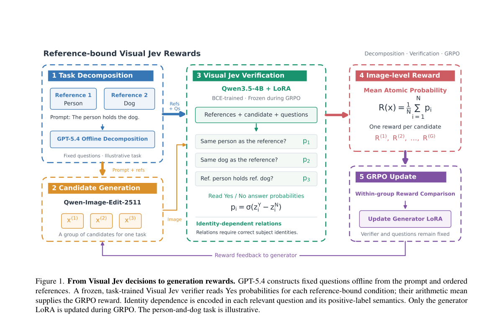

*Main result - Figure 2 Overall and category-level GRPO results. On the screened 897-task MICo-Bench subset, Visual Jev rewards improve our GPT-5.4 composite score by 10.72 points over the official Qwen-Image-Edit-*

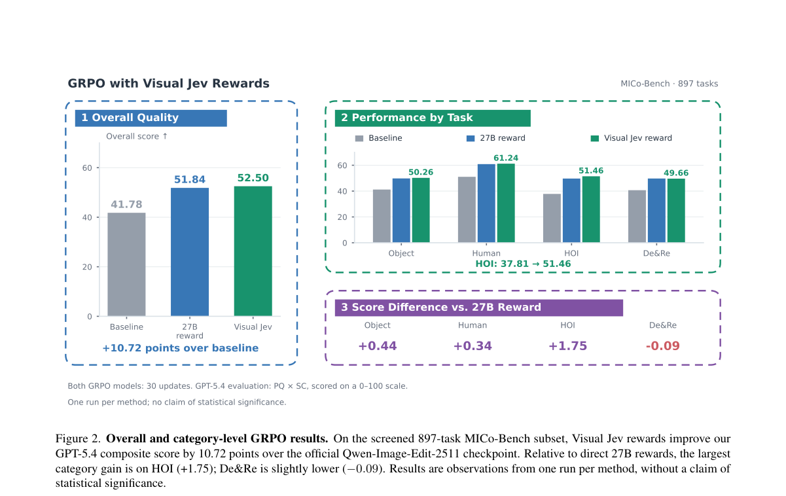

**Why this ranks #6**: 与 ORCA 同日出现且互补：一篇诊断奖励错配，一篇给出奖励构造方案。

---

### 7. Position Forcing: Self-Conditioning 3D Generation

**arXiv**: [2610.10342](https://arxiv.org/abs/2610.10342) | **Score**: 7.7 (relevance 8 x 0.7 + quality 7 x 0.3) | **Tags**: AIGC-3D | **Categories**: cs.CV | **Pages**: 18

**Authors**: Ziheng Ouyang, Zeqiang Lai, Jiarui Chen, Jiangshan Wang, Yuhao Wan, Jingbo Gong, Xiangyu Yue, Hengshuang Zhao, Qibin Hou, Chunchao Guo

**Affiliation**: 1VCIP, Nankai University | 2Tencent Hunyuan | 3MMLab, CUHK | 4Fudan University

**Abstract**

> Recent single-stage 3D generative models commonly adopt VecSet representations, encoding 3D shapes as unordered sets of latent tokens. However, compared with two-stage methods that provide explicit positional guidance, these models must implicitly infer token positions throughout denoising, limiting their generation quality. We observe that, despite the absence of explicit positional conditioning, VecSet tokens retain recoverable spatial correspondences. Building on this observation, we propose Position Forcing, a position-based self-conditioning framework. During denoising, Position Forcing recovers token positions from the current clean latent estimate, quantizes them at progressively finer resolutions according to the denoising stage, and feeds the resulting positional encodings back into the diffusion Transformer. This progressively refined positional feedback provides spatial guidance at a granularity appropriate to each denoising stage, guiding shape generation along a coarse-to-fine trajectory and substantially improving generation quality without a separate position generation stage. Experiments demonstrate that Position Forcing achieves strong performance among single-stage 3D generative methods and outperforms several competitive multi-stage approaches.

**Key findings**

- **Finding**: 单阶段 VecSet 表示把形状编码为无序潜 token 集合，位置必须在去噪中隐式推断；两阶段方法有显式位置引导因而质量更高。

- **Finding**: 作者观察到尽管缺少显式位置条件，VecSet token 仍保留**可恢复**的位置信息；Position Forcing 即以此做自条件生成。

- **Inference**: 「信息已在表示里，只是没被读出来」是一个比「表示能力不足」更便宜的下一步——自条件化不需要换表示，只需要换读法。

- **Recommendation**: 3D 生成方向的读者注意；与本批 DeltaSplat、Position Forcing 同属「后训练/轻量修正现有表示」这一低成本路线。

**Key figures**

*Framework / architecture - Figure 1 Our observation and positional conditioning designs. (I) Latents can be decoded into shape geometry and token positions. (II) (a) VecSet uses no explicit positional conditioning; (b) VoxSet a*

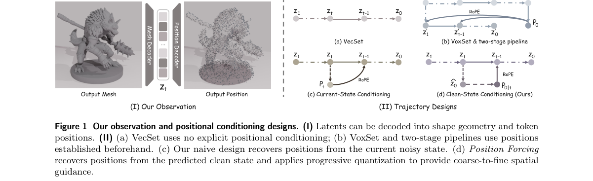

*Main result - Figure 2 Method overview. (a) Position VAE learns latent tokens that preserve geometry–position correspondences, enabling both shape geometry and token-associated spatial positions to be decoded. (b)*

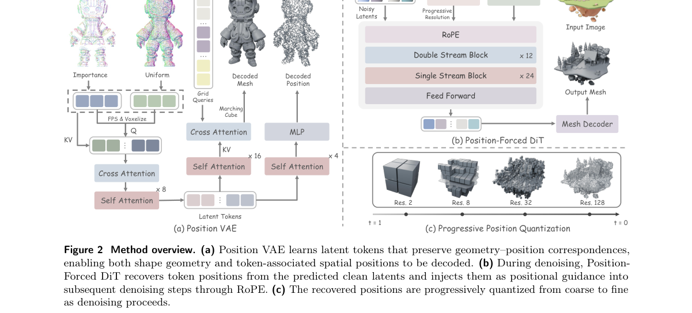

**Why this ranks #7**: 「位置信息可恢复但未被利用」是一个可直接行动的观察，改造成本低。

---

### 8. MORCA: Offline-to-Online Reinforcement Learning for Adaptive Cache Reuse in Video Diffusion Acceleration

**arXiv**: [2610.10457](https://arxiv.org/abs/2610.10457) | **Score**: 7.3 (relevance 7 x 0.7 + quality 8 x 0.3) | **Tags**: AIGC-video, rl-algorithm | **Categories**: cs.CV | **Pages**: 22

**Authors**: Yuxiang Xiong, Ruiyan Wang, Wenqiang Wang, Teng Hu, Songhang Shen, Bohao Feng, Hongqian Deng, Ran Yi

**Affiliation**: 1Shanghai Jiao Tong University | 2Alibaba Cloud Computing | 3Alibaba Token Hub, Alibaba Group

**Abstract**

> Diffusion Transformers (DiTs) achieve remarkable performance in video synthesis, but their iterative denoising process suffers from high inference latency. To address this, caching has emerged as an effective acceleration strategy by capitalizing on inter-step redundancy during denoising. Existing dynamic caching methods typically estimate the error that cache reuse would introduce at each denoising step (step error) to guide cache decisions, whereas our concern is how much quality loss cache reuse would cause in the final generated video (terminal error). We show that step error does not directly correspond to terminal error and that latent information helps capture their relationship, thereby informing cache decisions. Moreover, existing threshold-based methods cannot provide precise speedup control, making it difficult to meet practical requirements for user-specified acceleration targets. To address these limitations, we introduce MORCA, a cache scheduling framework trained through offline-to-online reinforcement learning to make latent-aware reuse/recompute decisions under user-specified acceleration targets. Extensive experiments on different video generation models across multiple target acceleration ratios demonstrate that MORCA achieves better generation fidelity than state-of-the-art caching methods under comparable computational budgets. Code is available at https://github.com/x10ngyx/MORCA.

**Key findings**

- **Finding**: 现有动态缓存方法在每个去噪步估计缓存复用引入的误差（step error）以指导缓存决策。

- **Finding**: MORCA 用离线到在线强化学习做自适应缓存复用。

- **Inference**: 把加速决策交给 RL 而非手工阈值，等于让缓存策略适应具体硬件与内容分布——手工阈值在分布外容易失效。

- **Recommendation**: 视频生成部署的读者注意；离线路线如何生成、在线阶段探索什么预算，是该方法可信度的关键。

**Key figures**

*Framework / architecture - Figure 1 Step error and terminal error. (a) Following SeaCache, we cache and reuse the residuals of the DiT blocks. For each step, we evaluate two cases: (i) reusing the residual cached at the previ-*

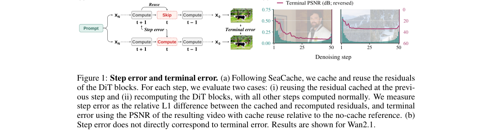

*Main result - Figure 2 Overview of MORCA. Bottom: A learned scheduler makes reuse/recompute decisions at each denoising step. Top left: The scheduler is budget-constrained and latent-aware. The target speedup is m*

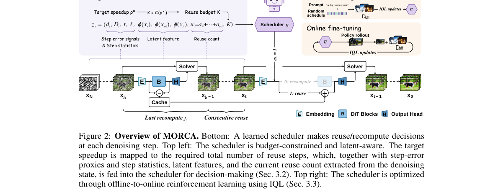

**Why this ranks #8**: 把推理加速策略本身变成 RL 问题，是本批 RL 流入 AIGC 基础设施的一条清晰路径。

---

### 9. DeltaSplat: Iterative Gaussian Refinement for Pose-Free Feed-Forward 3D Gaussian Splatting

**arXiv**: [2610.09853](https://arxiv.org/abs/2610.09853) | **Score**: 7.0 (relevance 7 x 0.7 + quality 7 x 0.3) | **Tags**: AIGC-3D | **Categories**: cs.CV | **Pages**: 11

**Authors**: Chanung Park, Seunghyeon Song, Joo Chan Lee, Eunbyung Park, Jong Hwan Ko

**Affiliation**: 1Department of Electrical and Computer Engineering, Sungkyunkwan University | 2Department of Artificial Intelligence, Sungkyunkwan University | 3Department of Artificial Intelligence, Yonsei University

**Abstract**

> Pose-free feed-forward 3D Gaussian Splatting (3DGS) reconstructs a scene from sparse, unposed images in a single network pass, removing the need for camera calibration and per-scene optimization. However, camera estimation errors propagate into the predicted Gaussians and compound the geometric and photometric inaccuracies of single-pass prediction. To correct these errors, we introduce DeltaSplat, a lightweight Gaussian refinement module for pose-free feed-forward 3DGS. It iteratively renders the current Gaussians at the input context views and predicts per-Gaussian updates from the resulting residuals. A 2D residual alone, however, underdetermines the 3D correction. DeltaSplat therefore conditions each update on per-pixel Plücker rays and rendered depth as a soft geometric prior. A dual-branch convolutional mixer efficiently encodes these inputs, and per-attribute heads decode the fused features into position, opacity, and color updates. The module adds only ~2.2% parameters to the backbone and remains fully feed-forward at inference. On DL3DV, DeltaSplat reaches 26.64 dB PSNR in the pose-free setting, improving its state-of-the-art backbone by 1.75 dB and surpassing even baselines supplied with ground-truth cameras; consistent gains hold across 6-24 views and all camera regimes.

**Key findings**

- **Finding**: 无位姿前馈 3DGS 单次前向重建的代价是：相机估计误差传播进 Gaussian，并与几何/光度误差复合。

- **Finding**: DeltaSplat 引入轻量的迭代 Gaussian 精化来纠正这些误差。

- **Inference**: 这与本批 DensiTok（昨天）、Position Forcing（今天）构成同一趋势：前馈重建的瓶颈已从「能否前馈」转为「前向之后如何低成本修正」。

- **Recommendation**: 与昨天日报的 DensiTok 对读——一个补表示里的证据，一个补单次前向的误差，路径互补。

**Key figures**

*Framework / architecture - Figure 1 Iterative Gaussian refinement on a DL3DV scene in the pose-free setting. K denotes the number of refinement iterations applied. Starting from the feed-forward output of the YoNoSplat backbon*

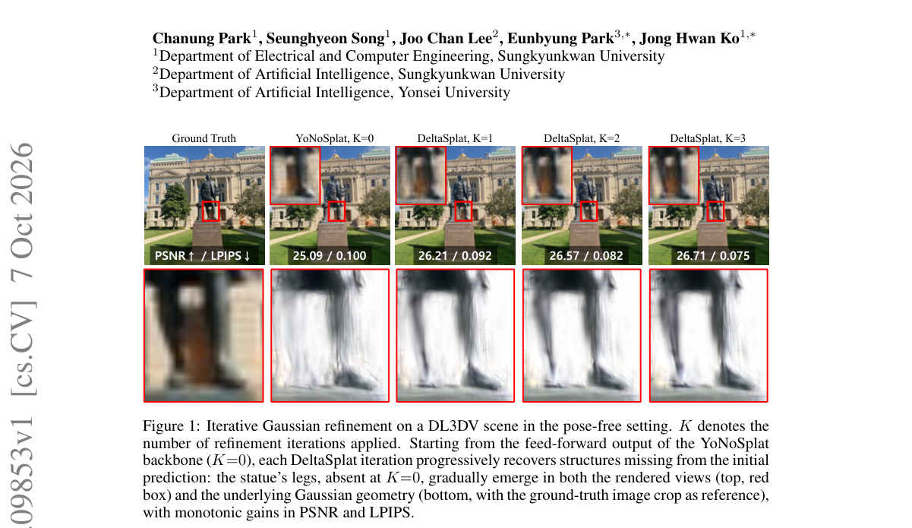

*Main result - Figure 2 Method overview. The backbone predicts cameras and initial Gaussians; at each iteration, the refinement module encodes the render residual with the Pl¨ucker rays and the rendered depth, and*

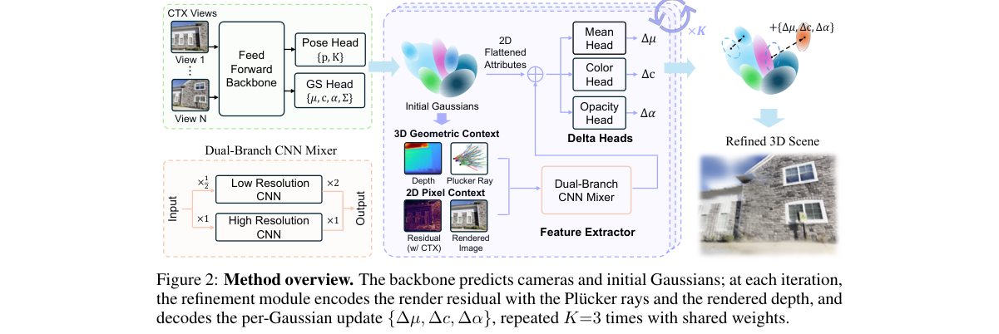

**Why this ranks #9**: 把「单次前向」的固有误差拆成可迭代修正的残差，是前馈重建的第三条路。

---

### 10. TileSkipper: Region-Adaptive Tile Pruning for 3D Gaussian Splatting

**arXiv**: [2610.09343](https://arxiv.org/abs/2610.09343) | **Score**: 7.0 (relevance 7 x 0.7 + quality 7 x 0.3) | **Tags**: AIGC-3D | **Categories**: cs.CV | **Pages**: 26

**Authors**: Jingxing Li, Yongjae Lee, Deliang Fan, Abhay Kumar Yadav, Cheng Peng, Rama Chellappa

**Affiliation**: School of Electrical, Computer and Energy Engineering | Arizona State University | Johns Hopkins University

**Abstract**

> Tiled 3D Gaussian Splatting rasterizers often use one scene-wide contribution cutoff for tile enumeration, although content differs in its sensitivity to support truncation. TileSkipper selects a static per-Gaussian cutoff policy for a frozen checkpoint. Calibration renders measure candidate pair savings and an isolated-removal distortion proxy that accounts for front transmittance and background color. The method allocates cutoffs across 64 Gaussian groups and accepts policies only after complete renders on disjoint selection views. The exported policy uses one byte per Gaussian, with no parameter updates, additional kernel, or per-frame policy inference. Across 13 scenes from Mip-NeRF 360, Tanks & Temples, and Deep Blending, a fixed-policy AccuTile sweep gives dataset-macro speedups of $1.088\times$ at standard resolution and $1.238\times$ at 3840 pixels wide, with $-0.007/-0.023$ dB mean PSNR change. Six integrations with existing opacity-aware bounds yield $1.009\times$--$1.121\times$ compiler-only speedups. For four ports from $3σ$ rasterizers, we separately attribute the prior exact-bound transition and our incremental gain. Matched-quality ablations show modest gains over scene-global calibration and parity with per-Gaussian control; the standalone comparison with AdaGScale is regime-dependent.

**Key findings**

- **Finding**: 分块 3DGS 光栅化器对 tile 枚举用全场景统一的贡献截断，但内容对截断的敏感度并不一致。

- **Finding**: 校准渲染测量候选对的节省量与一个隔离移除失真代理（考虑前方透射率与背景色），据此把计算预算分配到不同区域。

- **Inference**: 这是渲染层的剪枝而非表示层的压缩，部署风险低但上限也受限——它不改变重建质量，只改变渲染成本分配。

- **Recommendation**: 已有 3DGS 模型要提速的直接可用项；与 GRACE 的 latent 压缩是不同层级的优化，可叠加。

**Key figures**

*Framework / architecture - Figure 1 motivates heterogeneous allocation. Calibration renders measure pair savings and a compositing-aware isolated-removal residual for each cutoff. OURS-GLOBAL selects one scene- wide value; OURS*

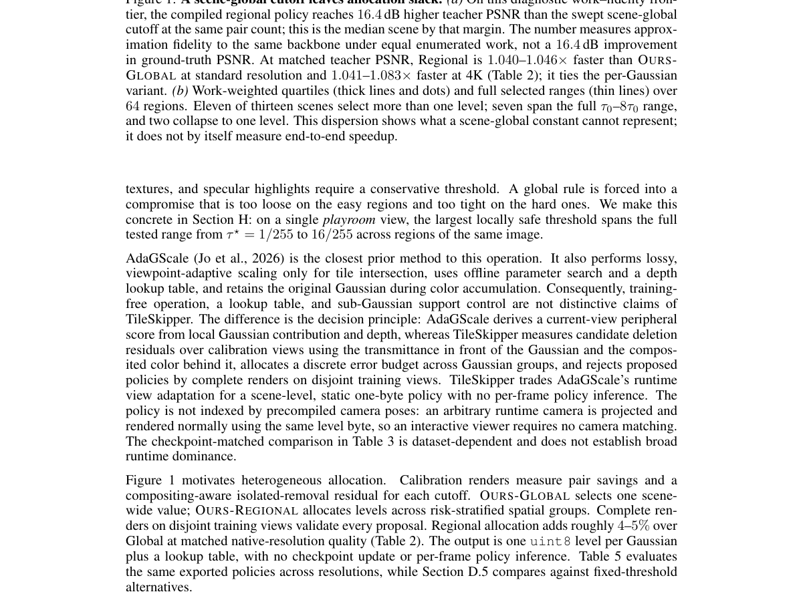

*Main result - Figure 2 TileSkipper changes pair enumeration at stage 2. The blue and orange outlines denote support under the baseline and compiled cutoffs. Tiles excluded by the compiled support generate no Gauss*

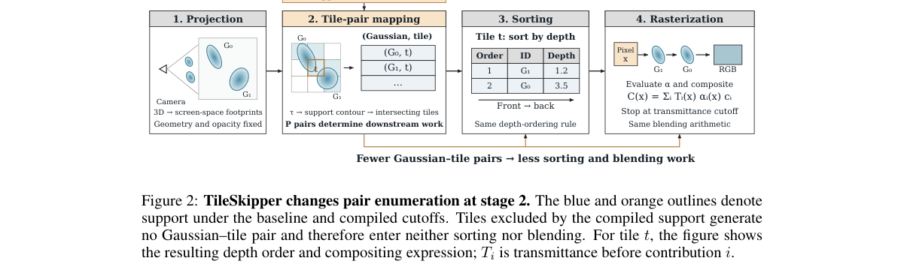

**Why this ranks #10**: 工程取向明确：不动训练，只为冻结模型选一套更好的渲染剪枝策略。

---

## Footer

- Total papers reviewed across all 5 tracks: 50 (from 580 scanned)
- aigc_visual track final top-10: 10
- Wild-cards in this track: 1
- Figure assets: `res/` (shared across tracks)

Generated by `mine-arxiv-daily-digest` skill. Sister file: `2026-10-08_aigc_visual_entry.md`.
