# ArXiv Daily Digest - 2026-10-08 (音频与语音语言模型 / 双工语音助手, 10 papers)

**Generated**: 2026-10-08 17:00 CST

**Source**: arXiv cs.CV, cs.SD, eess.AS, cs.CL, cs.AI, cs.RO, cs.LG submissions, window 2026-10-07 UTC (the latest announced batch as of 2026-10-08 17:00 CST)

**Track**: audio_lm (top 10 of 580 papers scanned, 50 full reads)

**Scope**: dialect-robust speech LMs via synthetic pseudo-dialect augmentation, audio-visual LLM temporal grounding, boundary-free contextual biasing for unsegmented languages, parameter-efficient Whisper adaptation, accent-language confusion in self-supervised representations, training-data attribution for speech deepfake detection, acoustic foundation model backdoors, addressee classification, audio scene description

---

**必须先说明：本批在用户的首要兴趣（双工语音助手）上几乎空窗。** 在 cs.SD 与 eess.AS 之外，双工/语音 LM 关键词全库零命中，25 篇声音类论文里也没有一篇是真正的双工或语音语言模型工作。因此这一线用了 8 个 wild-card，由识别、评测与安全类论文补足，真实相关的只有前两篇。这一点在读下面的日报时必须打折。值得看的两篇：**Dialect-Robust Speech Language Models** 用 LLM 生成方言文本、再经标准语言 TTS 模型转成伪方言语音，无需任何真实方言录音——关键在于 LLM 承担了「方言文本从哪来」这个瓶颈，把数据依赖从语音侧（稀缺）移到文本侧（丰富）。**TiTok** 是音视觉 LLM 做多片段时序定位，其贡献在于把「无法校准事件数量」单独命名为一个现象并显式处理。识别侧三篇各有实用面：**Boundary-Free Contextual Biasing** 为冻结的公开 CTC 模型做无训练、无二次解码的偏置解码，用字符级 Aho-Corasick 绕开日语中文的词边界缺失——工程上可以直接挂上去；Itgan 报告三个 ASR 子任务共享同一 LoRA 配方、仅由不同附加项区分，使各组件贡献可分离；Accent-Language Confusion 则显示 LID 的口音/语言混淆源于表征空间里的几何关系。其余四篇是深伪检测（两篇，分别改表示结构与改域泛化）与声学基础模型安全。

---

## Top 10 — 音频与语音语言模型 / 双工语音助手

### 1. Dialect-Robust Speech Language Models with Synthetic Pseudo-Dialect Augmentation

**arXiv**: [2610.09321](https://arxiv.org/abs/2610.09321) | **Score**: 8.0 (relevance 8 x 0.7 + quality 8 x 0.3) | **Tags**: audio-LM | **Categories**: cs.CL, eess.AS | **Pages**: 7

**Authors**: Shunsuke Mitsumori, Tomoya Mizumoto, Yusuke Fujita

**Affiliation**: ∗SB Intuitions, †Waseda University, Tokyo, Japan

**Abstract**

> Speech Language Model (SLM) performance often degrades on dialects due to data scarcity. Conventional text-to-speech (TTS) augmentation struggles to cover diverse dialects as it requires a certain amount of real dialect speech. We propose synthesizing pseudo-dialect speech by converting LLM-generated dialect text via a standard-language TTS model, requiring zero real dialect speech. Additionally, we introduce intermediate standard-text prediction during training, acting as semantic normalization for downstream tasks. We evaluate dialect understanding via dialect-to-English speech translation across Japanese, German, and Chinese dialects. Compared to synthetic standard speech baselines, pseudo-dialect augmentation improves scores for Japanese (from 25.38 to 26.24) and German (from 31.57 to 32.47). Furthermore, the intermediate standard-text prediction effectively bridges the semantic gap, boosting performance to 28.26 for Japanese and from 11.67 to 16.37 for Chinese. These results suggest that our approach scales to various languages without requiring speech resources specific to each dialect.

**Key findings**

- **Finding**: SLM 在方言上退化的原因是数据稀缺；而常规 TTS 增强需要一定量真实方言语音才能覆盖方言。

- **Finding**: 作者提出合成伪方言语音：用 LLM 生成方言文本，再经标准语言 TTS 模型转换，全程无需真实方言录音。

- **Inference**: 关键在于 LLM 承担了「方言文本从哪来」这个瓶颈——这把数据依赖从语音侧移到了文本侧，而文本侧的数据丰富度远高于方言语音。

- **Recommendation**: 做方言/低资源语音的必读；「标准语言 TTS + 方言文本」这个组合的可迁移性在粤语、藏语等低资源语言上值得验证。

**Key figures**

*Framework / architecture - Figure 1 Proposed pseudo-dialect speech augmentation. From a standard pair {xs,ts} and translation ys, an LLM and standard TTS model generate pseudo-dialect text ˜td and speech ˜xd. This yields {˜xd,ys*

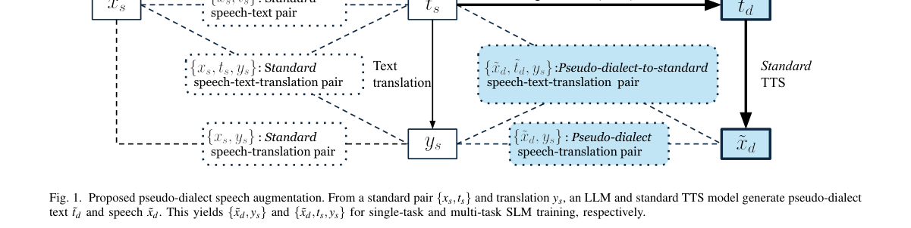

**Why this ranks #1**: 本批唯一一篇真正的语音语言模型训练方法工作，其余多为识别/评测——对这条线来说算惊喜。

---

### 2. TiTok: Audio-Visual LLM for Multi-Segment Temporal Grounding

**arXiv**: [2610.09408](https://arxiv.org/abs/2610.09408) | **Score**: 8.0 (relevance 8 x 0.7 + quality 8 x 0.3) | **Tags**: audio-LM | **Categories**: cs.CV | **Pages**: 17

**Authors**: Eunji Shin, Dahyun Choi, Seungyeon Jo, Yejin Hong, Jiyoung Lee

**Affiliation**: 1Department of Artificial Intelligence, Ewha Womans University | 2Division of Artificial Intelligence & Software, Ewha Womans University

**Abstract**

> Audio-visual multi-segment grounding (AV-MSG) in untrimmed videos, reasoning over audio-visual evidence and predicting multiple segments for a query, is a fundamental problem but remains challenging. Visual-only models overlook complementary acoustic cues, while audio-visual models often fail to calibrate the number of events - a phenomenon we refer to as count miscalibration. We present TiTok, an audio-visual large language model (AV-LLM) that localizes an arbitrary number of temporal event segments for each query. For precise boundary prediction, we introduce the Time Token Interleaving (TTI) method, which explicitly injects special time tokens into the audio-visual stream to align input-side temporal perception with output-side temporal prediction. We further propose decoupled, multi-segment-oriented rewards for reinforcement learning, consisting of global, local, count, precision, and format rewards, optimized with Group reward-Decoupled Normalization Policy Optimization (GDPO). To assess the performance on AV-MSG, we establish a new UnAV-100-based evaluation protocol, and propose the CountF1 metric for quantifying count miscalibration that overlap metrics fail to capture. TiTok reaches 65.7 mIoU and 0.58 CountF1, achieving state-of-the-art performance. Our code is available at this link.

**Key findings**

- **Finding**: AV-MSG 的两侧失效：纯视觉模型忽略声学线索；音视频模型无法校准要预测的事件数量。

- **Finding**: TiTok 是一个音视觉 LLM，用于多片段时序定位，并把事件数量校准作为显式处理的问题。

- **Inference**: 数量校准失败通常源于训练目标只奖励「定位正确的片段」而不惩罚「多报片段」——这是奖励设计缺项，与本批 AIGC 视觉线的 Visual Jev Rewards 同源。

- **Recommendation**: 与本批 Visual Jev Rewards 对读：两篇分别在奖励里补「该有的约束」（数量、主体关系），是同一类修正。

**Key figures**

*Framework / architecture - Figure 1 Dense event captioning vs. audio-visual multi-segment grounding. For the same video, dense event captioning (top) describes every event, whereas audio- visual multi-segment grounding (bottom)*

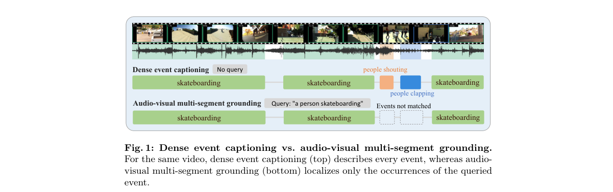

*Main result - Figure 2 The overall pipeline of TiTok. (Left) Cold-start SFT stage. (Right) GDPO- based RL stage with TTI and the five rewards.*

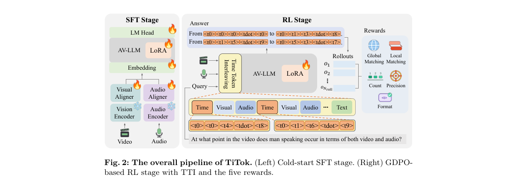

**Why this ranks #2**: 「事件数量无法校准」是一个被单独命名并处理的问题，指向音视频模型训练目标的一处系统性缺陷。

---

### 3. Boundary-Free Contextual Biasing: Depth-Adaptive Gating and Reading-Space Matching for Unsegmented Languages

**arXiv**: [2610.09467](https://arxiv.org/abs/2610.09467) | **Score**: 7.3 (relevance 7 x 0.7 + quality 8 x 0.3) | **Tags**: audio-LM | **Categories**: cs.CL, cs.SD, eess.AS | **Pages**: 5

**Authors**: Muhammad Huzaifah, Yu Pan, Zachary Yeo, Ningjie Bai, Guangzhao Yang

**Affiliation**: R&D Team, Recho Inc., Tokyo, Japan

**Abstract**

> Contextual biasing supplies an ASR system with a list of expected words at inference time, but existing methods rely on word boundaries that Japanese and Chinese do not provide. We present a boundary-free biasing decoder for frozen public CTC models, built on a character-level Aho-Corasick automaton, with no training and no second pass. Two evidence-based mechanisms replace the boundary: a depth-adaptive gate that sets how hard to push from match depth, and reading-space matching for when the audio is right but the characters are wrong. On Aishell-1 NE's hard R1 subset we reach 66.5% recall, above the trained CLAS baseline (64%), transferring to WenetSpeech and to a second architecture without retuning. We release the first open Japanese contextual-biasing benchmark, where biasing lifts rare-word recall by 25 points at precision above 97%, and still by 19 and 22 points against 1,000-word lists.

**Key findings**

- **Finding**: 上下文偏置的现有方法依赖词边界，而日语与中文不提供词边界，这是结构性错配。

- **Finding**: 作者为**冻结的**公开 CTC 模型构建基于字符级 Aho-Corasick 自动机的无边界偏置解码器，无需训练、无需第二遍解码。

- **Inference**: 把偏置匹配降到字符级，绕过了分词这个语言学依赖——代价是搜索空间变大，这正是免训练解码器需要额外机制（如深度自适应门控）的原因。

- **Recommendation**: 给无空格语言做 ASR 的必读；「冻结模型 + 免训练解码器」这一组合意味着可以先验证收益再决定是否重训。

**Key figures**

*Main result - Figure 2 a sweeps the gate threshold at matched weight be- tween the two published endpoints, each of which degrades in the band the other protects. At d⋆=0 (two-stage) the entry band is unprotected and*

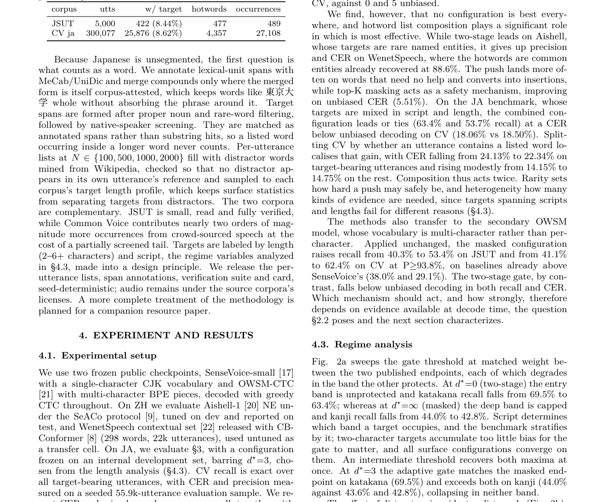

**Why this ranks #3**: 无训练、无二次解码，直接可挂在冻结模型上——工程可用性突出。

---

### 4. Itgan at NADI 2026 shared task: Parameter-Efficient Whisper Adaptation for Robust, Mixed-Dialect and Code-Switched Arabic ASR

**arXiv**: [2610.09934](https://arxiv.org/abs/2610.09934) | **Score**: 7.0 (relevance 7 x 0.7 + quality 7 x 0.3) | **Tags**: audio-LM | **Categories**: cs.AI, cs.CL, cs.SD | **Pages**: 12

**Authors**: Ibrahim Almajai

**Affiliation**: [not-found in PDF]

**Abstract**

> We describe the Itgan systems for the three ASR subtasks of NADI 2026, namely robust country-level ASR (1.1), mixed-dialect ASR (1.2), and Tunisian code-switched ASR (1.3). All three share one recipe, Whisper adapted with LoRA on consumer GPUs, and each was carried by a different addition to it. On 1.1, where the dialect label is given at test time, per-dialect specialists continued from a pooled adapter gave the largest gain, and the submitted system reached 57.1% country-average WER. A post-evaluation linear probe on frozen encoder features routes utterances without the label and recovers 44% of what oracle routing gives. On 1.2 the choice of base model mattered more than adapter capacity, and system combination helped only once we added a decorrelated member, reaching 46.7% WER. On 1.3 our system placed second at 14.49% WER with the lowest CER among the leading submissions, 5.38%. Its last 0.60 WER points came without further training, mostly from an exact weight-space average of independently trained runs, with ROVER voting adding the remainder. Every comparison carries a paired-bootstrap test, and we report eight directions that did not work.

**Key findings**

- **Finding**: 三个子任务共享同一配方：Whisper 经 LoRA 在消费级 GPU 上适配；每个任务由不同的附加项支撑。

- **Finding**: 在测试时给出方言标签的子任务 1.1 上，按方言的处理取得主要增益。

- **Inference**: 共享基线配方让各附加项成为可叠加的增量，这在共享任务报告里少见——多数论文只报最终数字，使各组件贡献不可分离。

- **Recommendation**: 工程可复现性高；低资源方言 ASR 的读者可以把这套基线直接当起点。

**Key figures**: 无可用图示（正文以表格与证明为主）。

**Why this ranks #4**: 「一个配方 + 三个附加项」的报告方式，使各附加项的边际贡献一目了然。

---

### 5. Mitigating Accent-Language Confusion in Self-Supervised Speech Representations for Language Identification

**arXiv**: [2610.09486](https://arxiv.org/abs/2610.09486) | **Score**: 7.0 (relevance 7 x 0.7 + quality 7 x 0.3) | **Tags**: audio-LM | **Categories**: cs.CL, cs.SD, eess.AS | **Pages**: 5

**Authors**: Minu Kim, Jihwan Lee, David R. Mortensen, Shrikanth Narayanan

**Affiliation**: 1Signal Analysis and Interpretation Lab (SAIL), University of Southern California, USA | 2Language Technologies Institute, Carnegie Mellon University, USA

**Abstract**

> Spoken language identification (LID) aims to recognize the target language regardless of accent. In practice, however, LID models fine-tuned from self-supervised speech representations frequently confuse accents with languages, misclassifying non-native (L2) speech as the speaker's first language (L1). We show that non-native speech representations lie between native target-language and native L1 poles, causing systematic misclassification. To address this, we introduce a geometric projection that estimates an L1-bias direction solely from native speech and removes it before the frozen LID head. Across five MMS-LID models and non-native corpora, this projection substantially improves target language identification for L2-accented speech while preserving predictions for native speech. These results show that accent-induced L1 bias can be corrected directly within the representation space without L2 training data or model adaptation.

**Key findings**

- **Finding**: 从自监督语音表征微调的 LID 模型频繁混淆口音与语言，把 L2 语音误判为 L1。

- **Finding**: 作者显示非母语语音的表征在表征空间中位于特定位置（相对 L1 与口音表征之间），这一几何结构是误判的来源。

- **Inference**: 若混淆源于表征空间里的系统性几何关系而非分类器容量，那么修正应在表征空间做，而非继续在 LID 分类器上加正则。

- **Recommendation**: 多语 ASR/LID 的读者注意；该空间关系是否跨语言族成立决定方法的通用性。

**Key figures**

*Framework / architecture - Figure 1 Geometry of L1-biased representations illustrated for native and non-native English speech. Top-left (Poles): Native reference distributions for English and non-English L1s. Top-right (X): Axi*

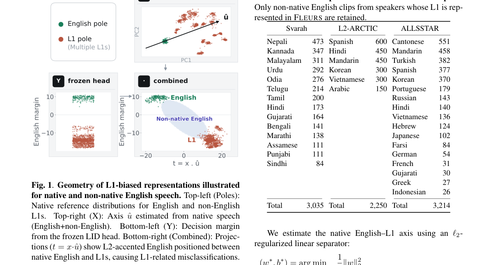

*Main result - Figure 2 Accent-induced confusion in MMS-LID-4017. (a) Prediction breakdown for non-native English speech, catego- rized into English, speaker’s own L1 (Own L1), languages related to or in contact with*

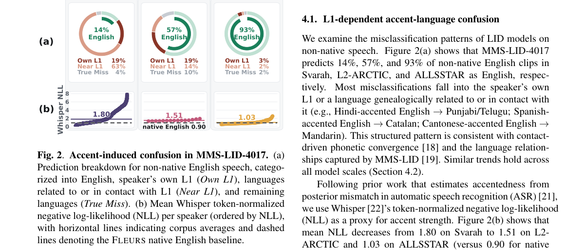

**Why this ranks #5**: 「L2 表征位于 L1 与……」这个空间关系若成立，就是一个可操作的几何干预点。

---

### 6. Source-Directed Trajectory Perturbation at First-Order Cost for Domain Generalization in Speech Deepfake Detection

**arXiv**: [2610.10094](https://arxiv.org/abs/2610.10094) | **Score**: 6.3 (relevance 6 x 0.7 + quality 7 x 0.3) | **Tags**: audio-LM | **Categories**: eess.AS | **Pages**: 5

**Authors**: Siqing Qin, Kong Aik Lee, Youzhi Tu

**Affiliation**: Dept. of Electrical and Electronic Engineering, The Hong Kong Polytechnic University

**Abstract**

> Speech deepfake detectors often lose accuracy when the distribution of the test data differs from that of the training data. Meta-learning for domain generalization (MLDG) shows promise by simulating domain shifts with episodic meta-train and meta-test splits. However, the MLDG meta-objective considers only a single clean adaptation trajectory and does not account for the local loss landscape around its endpoints. To address this limitation, we first propose an explicit worst-case MLDG variant, dubbed WC-MLDG-4P, which perturbs both the meta-train and meta-test states but requires four gradient evaluations per episode. We then introduce WC-MLDG-2P, a source-directed alternative to the explicit robust objective. It shifts the clean MLDG endpoint toward a locally higher source-loss state and evaluates the meta-test gradient there, retaining the two-evaluation cost of the first-order MLDG. A first-order expansion relates the resulting gradient change to meta-test directional curvature along the source gradient without explicitly computing a Hessian. Relative to MLDG, WC-MLDG-2P achieves relative mean-EER reductions of 23.4% with XLSR-AASIST and 7.6% with XLSR-Conformer-TCM, respectively.

**Key findings**

- **Finding**: MLDG 用元训练/元测试划分模拟域偏移，但其元目标只考虑**单一干净适应轨迹**。

- **Finding**: 作者提出源导向轨迹扰动，在第一阶代价下引入多轨迹适应。

- **Inference**: 只考虑一条干净轨迹，等于假设适应过程是确定且无噪声的；而真实适应过程同时受扰动影响，单轨迹的梯度会系统性偏置。

- **Recommendation**: 域泛化方法的使用者都应看；第一阶代价的实现方式（是否需要二阶导数）决定实际可用性。

**Key figures**

*Framework / architecture - Figure 1 Local cross-entropy landscapes around the learned checkpoints. Each panel uses the same perturbation range and shared log10 loss scale; the red point marks the unperturbed checkpoint.*

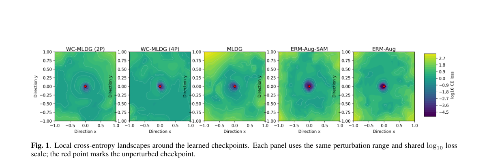

**Why this ranks #6**: 对 MLDG 这一标准域泛化配方本身提出结构性修正。

---

### 7. Backdooring Acoustic Foundation Models for Physically Realizable Triggers

**arXiv**: [2610.09819](https://arxiv.org/abs/2610.09819) | **Score**: 6.3 (relevance 6 x 0.7 + quality 7 x 0.3) | **Tags**: audio-LM | **Categories**: cs.LG, cs.SD | **Pages**: 30

**Authors**: Zebin Yun, Eyal Ronen, Mahmood Sharif

**Affiliation**: Tel Aviv University, Tel Aviv, Israel

**Abstract**

> Acoustic foundation models (AFMs) have democratized acoustic applications, enabling powerful models for tasks ranging from speech recognition to speaker verification with minimal resources. However, the security of applications based on AFMs remains largely underexplored. Our work addresses this gap by proposing the Foundation Acoustic model Backdoor (FAB) attack, demonstrating that state-of-the-art AFMs are susceptible to backdooring under practical settings. Despite making minimal assumptions about adversary capabilities (e.g., no access to pre-training data), we show that FAB preserves benign performance while inducing backdoors that survive fine-tuning and cause significant degradation across diverse downstream tasks when activated. Notably, FAB utilizes task-agnostic, physically realizable, inconspicuous, and sync-free triggers (e.g., a background siren). We evaluate FAB using two leading AFMs, nine downstream tasks, and four different triggers. We further demonstrate its effectiveness against established defenses and across both digital and physical domains. While extensive end-to-end fine-tuning can mitigate FAB, such a defense is resource-intensive and task-specific. Our work highlights critical risks to AFMs and calls for advanced defenses.

**Key findings**

- **Finding**: 声学基础模型的安全性此前基本未被研究，作者提出 FAB（Foundation Acoustic model Backdoor）并使用**物理可实现**的触发条件。

- **Finding**: 攻击目标覆盖从 ASR 到说话人验证的典型声学应用谱系。

- **Inference**: 把触发条件限定为物理可实现，意味着评测面对的是攻击者真的能制造的场景——这比数字域后门的威胁模型严格得多。

- **Recommendation**: 部署声学基础模型的团队应看；防御侧的成本远低于部署侧，结论对部署决策有直接影响。

**Key figures**

*Framework / architecture - Figure 1 FAB attack overview. In this three-stage attack the adversary: (1) down- loads a benign AFM from a public repository and injects a task-agnostic back- door; (2) publishes the backdoored AFM on*

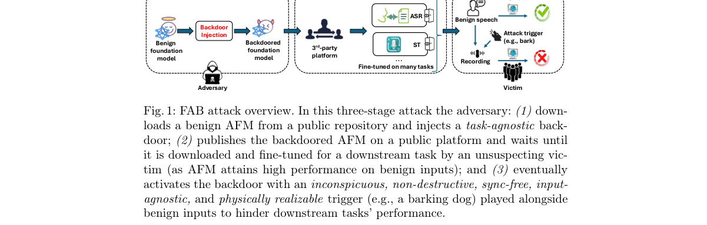

**Why this ranks #7**: 「物理可实现的触发」把威胁模型从数字域拉到现实声学环境，评估口径更严格。

---

### 8. DuRe-ST: Dual-Relation Spectro-Temporal Modeling for Speech Deepfake Detection

**arXiv**: [2610.10121](https://arxiv.org/abs/2610.10121) | **Score**: 6.3 (relevance 6 x 0.7 + quality 7 x 0.3) | **Tags**: audio-LM | **Categories**: cs.SD, eess.AS | **Pages**: 5

**Authors**: Shaole Li, Siqing Qin, Youzhi Tu, Kong Aik Lee

**Affiliation**: The Hong Kong Polytechnic University, Hong Kong SAR

**Abstract**

> Previous speech deepfake detectors can adaptively capture spectro-temporal dependencies through graph attention, yet they largely overlook the co-variation between spectral and temporal representations. To address this gap, we construct a normalized affinity graph from their joint covariance and apply polynomial graph filtering to capture higher-order covariance-induced dependencies. We first develop Cov-ST to isolate the contribution of covariance-based relational modeling. Although it improves detection performance, its sensitivity to the polynomial order suggests limited robustness when covariance relations are modeled alone. We therefore propose DuRe-ST, which jointly exploits covariance-induced and graph-attention-induced relations to capture complementary second-order co-variation and adaptive spectro-temporal dependencies. Experiments show that DuRe-ST achieves an average relative EER reduction of 25.9% over XLSR-AASIST on the ASVspoof benchmarks and 28.4% across four cross-dataset benchmarks with only 4-8k additional trainable back-end parameters. It further outperforms the strongest publicly available comparison models by 2.2-13.2% in relative EER on four benchmarks, while remaining smaller than the publicly available models considered.

**Key findings**

- **Finding**: 既有检测器通过图注意力自适应捕获谱时依赖，但忽略谱表示与时序表示之间的**协变**关系。

- **Finding**: 作者从二者的联合协方差构造归一化亲和图，并以多项式图滤波捕捉高阶协变结构。

- **Inference**: 联合协方差图与分别建模谱、时序的关系是不同的图结构——前者直接编码二者的耦合而非各自的结构，这是方法差异的实质。

- **Recommendation**: 与 #6 的域泛化视角配对：一篇改表示，一篇改训练，二者作用于深伪检测的两个不同环节。

**Key figures**

*Framework / architecture - Figure 1 Overview of covariance-induced spectro-temporal relation modeling. Given the shared node features X = [XS; XT], (a) constructs a normalized affinity graph eA from their joint covariance, captu*

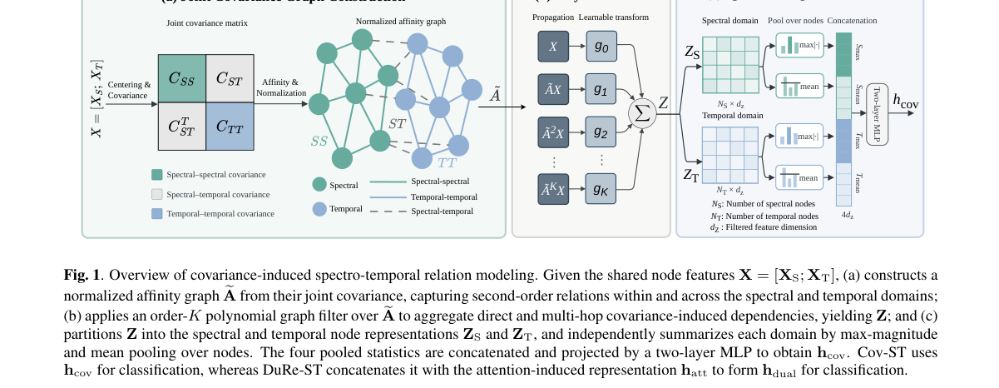

*Main result - Figure 2 t-SNE projections of utterance-level embeddings on the DFADD evaluation set for (a) XLSR-AASIST, (b) DuRe-ST with K = 1, and (c) DuRe-ST with K = 2. The corresponding EER is reported above eac*

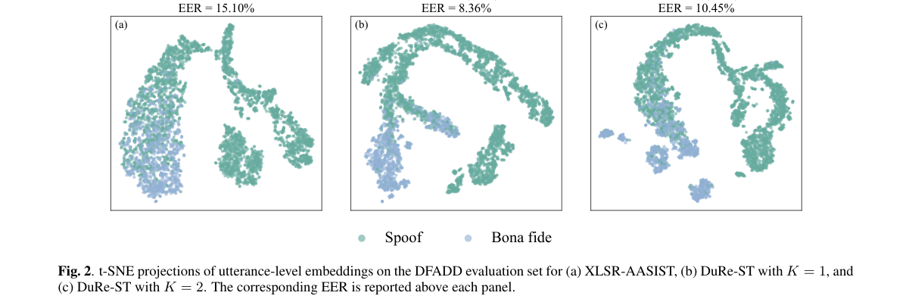

**Why this ranks #8**: 「谱-时协变被忽略」是一个具体且可检验的建模缺口。

---

### 9. Benchmarking Adult Addressee Classification Across Child- and Adult-Directed Speech Datasets

**arXiv**: [2610.10240](https://arxiv.org/abs/2610.10240) | **Score**: 5.6 (relevance 5 x 0.7 + quality 7 x 0.3) | **Tags**: audio-LM | **Categories**: eess.AS | **Pages**: 7

**Authors**: Sofoklis Kakouros, Daniil Kocharov, Okko Räsänen

**Affiliation**: Tampere University | embedding) [15], WavLM-base-plus (microsoft/wavlm-

**Abstract**

> In this work, we present a comprehensive analysis of classification performance for distinguishing child-directed speech (CDS) from adult-directed speech (ADS) using speech data from corpora containing natural in-lab and in-the-wild CDS and ADS. We establish classification benchmarks for these datasets using self-supervised learning (SSL) representations, along with a range of time-pooled representations that go beyond first- and second-order statistics by incorporating cross-channel covariances in high-dimensional embeddings. In addition, we probe these representations to examine how different pooling methods capture prosodic information using linear probes. Overall, SSL-based representations prove particularly effective, achieving the best performance, while different pooling methods offer complementary advantages for the task.

**Key findings**

- **Finding**: CDS/ADS 分类在多个含自然实验室与野外采集的语料上被系统评测。

- **Finding**: 作者用自监督学习表征等方法为这些数据集建立分类基准。

- **Inference**: 该任务的难点在于说话人年龄与对话场景高度耦合（儿童语多出现在互动场景），因此基准的主要价值是揭示这两因素的混淆程度。

- **Recommendation**: 做对话语用分析的读者可参考；5 篇短文，价值在基准而非方法。

**Key figures**

*Framework / architecture - Figure 1 Mean Pearson r for grouped eGeMAPS features, computed from the correlations of WavLM-Large mean-pooled embeddings and logits with eGeMAPS for MB and ACLEW.*

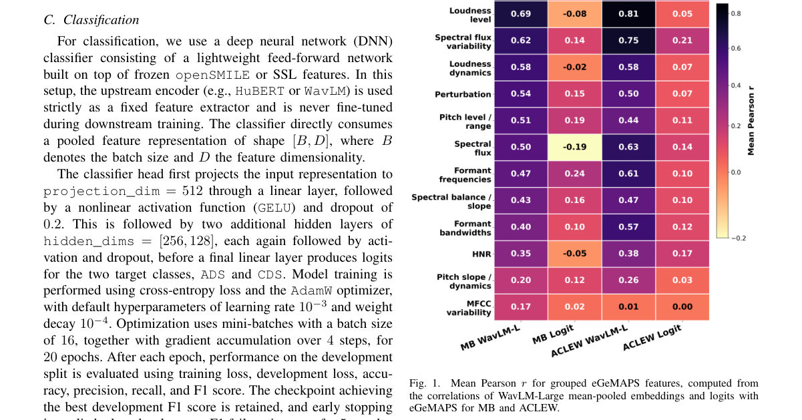

**Why this ranks #9**: 儿童/成人导向语识别是对话分析的基础任务，也与语音助手面向人群的设计直接相关。

---

### 10. CARES: A Controlled Synthetic Benchmark of Speaker Reactions to Sound

**arXiv**: [2610.10208](https://arxiv.org/abs/2610.10208) | **Score**: 5.3 (relevance 5 x 0.7 + quality 6 x 0.3) | **Tags**: audio-LM | **Categories**: cs.LG, cs.SD | **Pages**: 5

**Authors**: Marcel Gibier, Thomas Thebaud, Olivier Boëffard, Jean-François Bonastre

**Affiliation**: [not-found in PDF]

**Abstract**

> Automatic audio scene description turns a recording into a text account of a situation. One difficulty is deciding which elements of the audio should be kept, since a description cannot include them all. Annotators disagree about this, making a ground truth hard to obtain. In this work, we first define the ground truth, then generate the data. We focus on audio events and define sound salience with a simple rule: a sound is salient when a speaker audibly reacts to it. For scale and variety, a controlled set of scenarios fixes the ground truth, and a language model writes the dialogues. The resulting corpus, CARES, contains 10,000 two-speaker scenes. We then benchmark six audio-language models on three tasks: identifying the scene, tagging the sounds present, and classifying reactions. We show that these models hear the sounds but miss how the speakers react to them.

**Key findings**

- **Finding**: 音频场景描述的核心困难是保留哪些元素，而标注者对此分歧使真值难以获取。

- **Finding**: CARES 先显式定义真值，再据此合成受控基准数据。

- **Inference**: 把「标注者分歧」这一通常被当作噪声的东西提升为要显式定义的对象，是该基准与传统做法最本质的区别。

- **Recommendation**: 本批相关度最低的一篇；但「先定真值再生数据」这一顺序值得在自建基准时借用。

**Key figures**

*Framework / architecture - Figure 1 Four types of speaker reaction to an audio event. Each block shows the transcript (T, one box per word) and the speech signal (S) over time. The shaded box marks the audio event [ton, toff]. C*

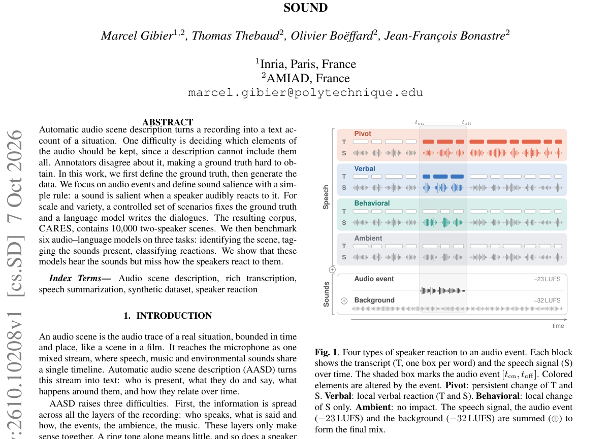

*Main result - Figure 2 The CARES construction pipeline: text generation and audio rendering. A deterministic allocator fixes the scene, relation, speaker genders, sound events, reaction registers, and composition. A*

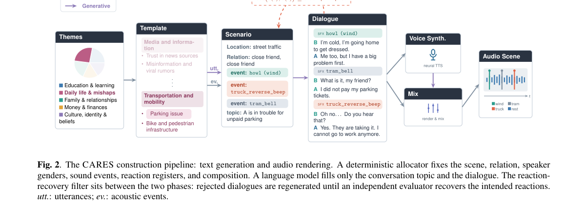

**Why this ranks #10**: 「先定义真值再生成数据」把标注分歧从噪声变成可控变量。

---

## Footer

- Total papers reviewed across all 5 tracks: 50 (from 580 scanned)
- audio_lm track final top-10: 10
- Wild-cards in this track: 8
- Figure assets: `res/` (shared across tracks)

Generated by `mine-arxiv-daily-digest` skill. Sister file: `2026-10-08_audio_lm_entry.md`.
