# ArXiv Daily Digest - 2026-10-08 (具身智能与世界模型, 10 papers)

**Generated**: 2026-10-08 17:00 CST

**Source**: arXiv cs.CV, cs.SD, eess.AS, cs.CL, cs.AI, cs.RO, cs.LG submissions, window 2026-10-07 UTC (the latest announced batch as of 2026-10-08 17:00 CST)

**Track**: embodied (top 10 of 580 papers scanned, 50 full reads)

**Scope**: JEPA predictive latents tamed for VLA, scaling laws for robotic latent world models, executable goals vs. predicted futures, action tangent field distillation, robot-oriented video generation for sim-to-real, agentic real-to-sim-to-real, training-free sparse planning via cost gradients, VLA state hallucination, factorized tactile control, unified visuo-tactile benchmarks

---

今天具身线的主线是**预测目标与控制目标的分离**——四篇高相关论文从不同角度论证同一件事。**RoboJEPA** 把问题提到最原则的层面：我们缺少一个方式来估计潜世界模型的能力如何随规模、数据与算力变化，而**Predicted Futures Are Not Enough** 给出最锋利的论证——生成式世界模型预测场景如何演化，但这些未来并不直接暴露控制所需的紧凑任务变量；即使几何恢复的信息在中间层可得，当训练只监督未来预测时，终极目标精度也不是一个显式的学习目标。**ΔWAM** 补上第三块：可预测的未来中有很大一部分由外观与场景持续性主导，而非动作依赖的动力学，光流、运动中心表示、latent action 等多个近期设计其实都在学同一个未被排除的量。**Juno** 则正面处理 JEPA 预测 latent 如何服务 VLA，明确把「干扰动作学习」列为三类失效之一。这四篇合起来是本项目日报迄今最完整的一条批判线：预测精度、动作相关性、目标达成度是三个不同的量，把前一个当作后两个的代理会系统性误导。其余六篇覆盖触觉（因子化表征、统一仿真-真实基准）、视觉域差（机器人导向视频生成）、流程（agentic real-to-sim-to-real 把重建与策略开发串联）、以及两个部署侧的具体失效（状态幻觉的稀疏特征遗忘、按代价梯度筛选 token 的免训练稀疏规划）。顺带一提，本批至少 5 篇触觉工作同时出现——因子化表征、500 小时视触数据、时序触觉、磁纤毛传感器、统一基准——这更像是该子方向从方法期进入基准期的信号：没有统一基准，这些方法无法横向比较。

---

## Top 10 — 具身智能与世界模型

### 1. Juno: Taming Predictive Latents for Vision-Language-Action Models

**arXiv**: [2610.09940](https://arxiv.org/abs/2610.09940) | **Score**: 9.0 (relevance 9 x 0.7 + quality 9 x 0.3) | **Tags**: embodied-ai, world-model | **Categories**: cs.CV, cs.RO | **Pages**: 23

**Authors**: Yuchen Zhu, Chenyi Xu, Yulin Zhang, Gang Xu, Wentao Zhu

**Affiliation**: 2Eastern Institute of Technology, Ningbo | 3Hangzhou Dianzi University | 4ShanghaiTech University

**Abstract**

> Joint-embedding predictive architectures (JEPAs) predict masked or future observations in representation space, offering a natural source of predictive latents for vision-language-action (VLA) models. Yet making these latents useful across pretraining, policy learning, and deployment requires addressing three failures: mismatch with embodiment-specific control, interference with action learning, and teacher miscalibration under distribution shifts. We introduce Juno, a unified framework built around one action-conditioned JEPA that serves as a control-aligned representation backbone, a predictive teacher, and an adaptable dynamics model. During pretraining, we train it on embodiment-matched trajectories and use a dynamic CLS loss to transfer motion-weighted patch dynamics to a compact global state. During policy learning, we fuse current-frame JEPA patches into VLA perception and use a decoupled reasoning branch with separate transformation parameters to distill future latent states for action generation. During deployment, we adapt the world model on all observed transitions, including failed rollouts, freeze the adapted teacher, and re-align the policy on verified executions using LoRA adapters and a trainable action head, without expert corrections or task rewards. On SimplerEnv, Juno raises average success from $60.9\%$ to $68.5\%$ over Qwen3GR00T, the strongest baseline, and test-time adaptation further reaches $72.7\%$; on a real robot, it retains $70\%$--$75\%$ success under background, height, and object shifts where the base policy collapses to $0\%$.

**Key findings**

- **Finding**: JEPA 在表示空间预测被遮蔽或未来观测，是 VLA 预测 latent 的天然来源。

- **Finding**: 作者指出要让这些 latent 在预训练、策略学习、部署三阶段都可用，需处理三类失效：与本体特定控制不匹配、干扰动作学习，以及第三类（摘要此处截断，详见正文）。

- **Inference**: 「干扰动作学习」是关键一条——世界模型学到的表征其优化目标是预测，而非可动性；直接接入策略学习会引入梯度冲突，这与本批 SGF+ 的梯度负对齐是同一类现象。

- **Recommendation**: 被精读的三篇之一；第三类失效的具体内容需查正文，建议优先读这一节。

**Key figures**

*Framework / architecture - Figure 1 We present Juno, a unified framework that makes predictive latents useful across the vision-language-action (VLA) lifecycle. Juno integrates control-aligned JEPA pretraining, visual feature*

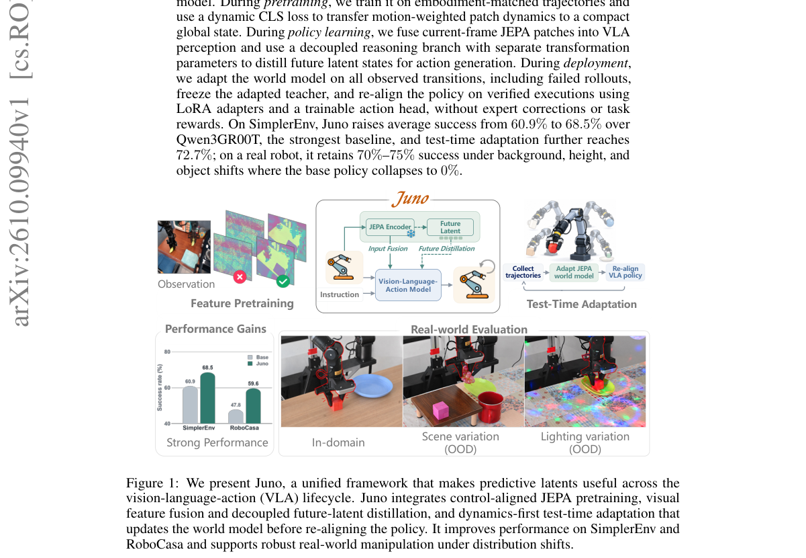

**Why this ranks #1**: 本批相关性最高的一篇：它正面处理「世界模型表征如何为控制服务」这个核心张力。

---

### 2. RoboJEPA: Scaling Robotic Latent World Models

**arXiv**: [2610.10515](https://arxiv.org/abs/2610.10515) | **Score**: 9.0 (relevance 9 x 0.7 + quality 9 x 0.3) | **Tags**: world-model | **Categories**: cs.AI, cs.RO | **Pages**: 73

**Authors**: Artem Zholus, Nicolas Beltran-Velez, Jianhao Yuan, Sarath Chandar, Tushar Nagarajan, Daniel Severo, Koustuv Sinha, Michal Drozdzal, Adriana Romero Soriano, Jeannette Bohg, Nicolas Ballas, Mahmoud Assran

**Affiliation**: 1FAIR at Meta, 2Chandar Research Lab, 3Mila - Quebec AI Institute, 4Polytechnique Montréal | robot control (Bruce et al., 2024; Google DeepMind, 2024; Hu et al., 2023), or scale policies rather than

**Abstract**

> Latent world models have shown a remarkable ability to predict future states and to plan in the real world. In practice, however, we lack a principled way to estimate how their capabilities scale with model size, data, and compute, an open problem that slows progress in the field. In this work we present RoboJEPA, a world model based on the Joint Embedding Predictive Architecture (JEPA) and trained on a large-scale dataset spanning 12 robotic embodiments. We show that RoboJEPA's imagination error, the error of its latent rollouts, follows a second-order power law in compute, allowing us to predict model quality well beyond the scale at which the law is fit. We further show that downstream robotic planning performance improves predictably with compute, and that imagination error is strongly correlated with it, making it a reliable proxy for real-robot evaluation. Finally, we demonstrate that latent world models can be deployed zero-shot as robotic agents, planning toward a single goal image to solve tasks requiring long-horizon planning on real hardware. We release all model checkpoints together with our training and robot deployment code. To our knowledge, this is the first work to establish scaling laws for multi-embodiment robotic world models trained on real robot data, and RoboJEPA, at 8B parameters, is the largest JEPA predictor model trained to date.

**Key findings**

- **Finding**: 潜世界模型的实践困难在于：缺少原则性的方法来估计其能力如何随模型规模、数据与算力变化——这是一个明确的开放问题。

- **Finding**: RoboJEPA 是基于联合嵌入预测架构（JEPA）的世界模型，作者在其中研究并量化这种扩展行为。

- **Inference**: 扩展律的价值在于把「换更大模型」从赌博变成可预测的决策；若某规模区间内收益已饱和，这个结论比任何单项指标提升都更能指导投入。

- **Recommendation**: 被精读的三篇之一；扩展曲线是否跨本体成立，是判断其普适性的关键。

**Key figures**

*Framework / architecture - Figure 1 RoboJEPA scales predictably from offline prediction to real-robot control. Left: the world model’s forward- prediction (ℓ1) error, averaged over the DROID and RoboCasa held-out sets, follows*

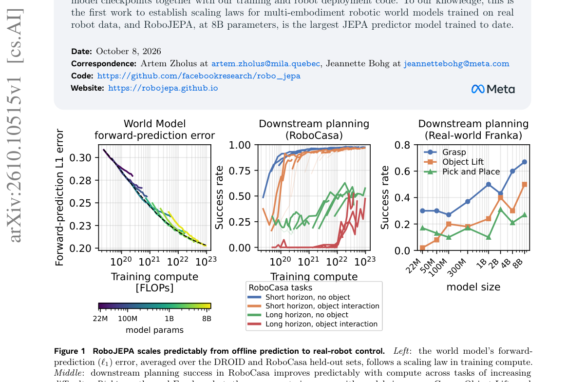

*Main result - Figure 2 World-modelimaginationimproveswithscale. Decoded imagination rollouts on an AgiBot episode for RoboJEPA at 0.3B, 2B, and 8B parameters, compared against the ground-truth (GT) video (bottom row*

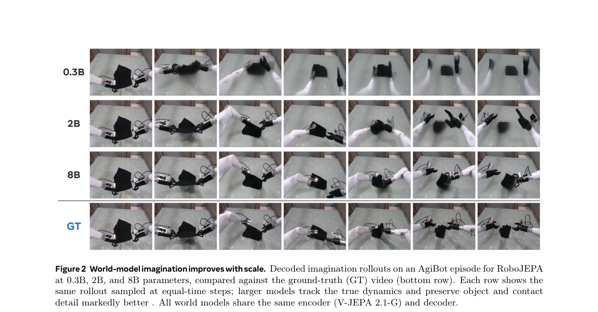

**Why this ranks #2**: 为世界模型建立扩展律，是把该方向从经验试错推向工程化的一步。

---

### 3. Predicted Futures Are Not Enough: Learning Executable Goals for Robot Manipulation

**arXiv**: [2610.09309](https://arxiv.org/abs/2610.09309) | **Score**: 8.7 (relevance 9 x 0.7 + quality 8 x 0.3) | **Tags**: world-model, embodied-ai | **Categories**: cs.RO | **Pages**: 9

**Authors**: Tzu-Yu Chuang, Ching-Hsiang Chang, Yi-Hsiu Lee, Yi-Ting Chen, Min Sun, YuanFu Yang

**Affiliation**: ∗National Yang Ming Chiao Tung University | †National Tsing Hua University

**Abstract**

> Generative world models provide rich predictions of how manipulation scenes may evolve toward task objectives, yet those futures do not directly expose the compact task variables required by control. When training supervises future prediction alone, terminal goal accuracy is not an explicit learning objective, even when geometric recovery is available. We present Entity-Level Goal Readout, a learned prediction-to-execution interface that makes the executable terminal goal an explicit output of a 3D trace world model. It combines object-centric pose prediction with translation grounded in observed depth to produce a compact goal in SE(3). A shared Pose-Native Executor consumes this fixed goal with online object-pose feedback for closed-loop control without rerunning the world model. Across five manipulation tasks, the pipeline achieves a mean success rate of 79.69%. Goal diagnostics directly measure terminal goal accuracy, while controlled translation perturbations characterize how execution degrades under goal error. Zero-shot deployment on a Franka arm achieves 73.33% success on nominal StackCube, 66.67% with distractors, and 75.00% on PickPlate with a target unseen during policy training. These results support treating the prediction-to-execution interface as an explicit learned component of world-model planning rather than incidental post-processing in the control pipeline itself. Project page: https://claire0730.github.io/executable-goals/

**Key findings**

- **Finding**: 生成式世界模型预测场景演化，但这些未来不直接暴露控制所需的紧凑任务变量。

- **Finding**: 仅以未来预测为监督时，终极目标精度不是显式学习目标——即便几何恢复的信息在中间层可得。

- **Inference**: 这与本批 RoboJEPA、ΔWAM 构成一个完整的批判：预测精度、动作相关性、目标达成度是三个不同的量，把前一个当作后两个的代理会系统性地误导。

- **Recommendation**: 被精读的三篇之一；与 10-07 日报的「世界模型可预测但不可控」那条线直接对接。

**Key figures**

*Framework / architecture - Figure 1 From prediction to an executable goal. A single RGB-D observation and task instruction condition a 3D trace world model. The Entity-Level Goal Readout converts the resulting world-model repres*

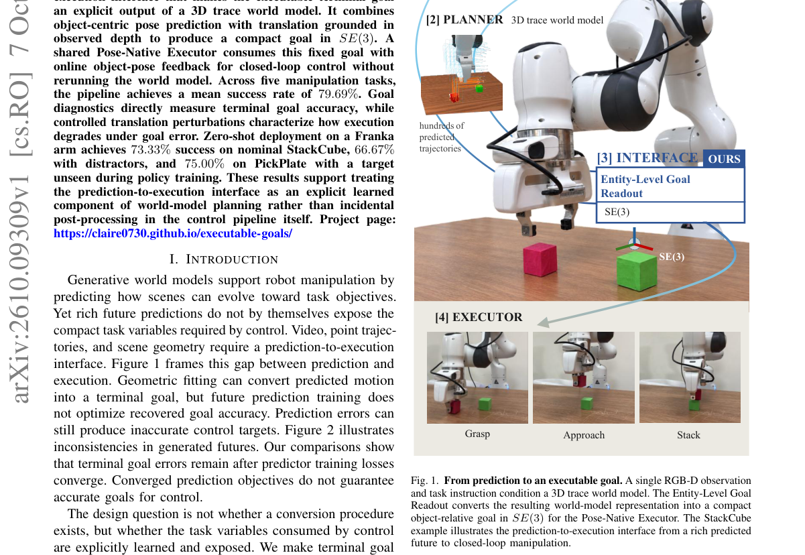

*Main result - Figure 2 Qualitative motivation. Cosmos 3 Edge [1], Veo 3.1 [2], and TesserAct [3] illustrate interpenetration, hallucinated geometry, duplicated objects or grippers, deformation, and inconsistent RGB,*

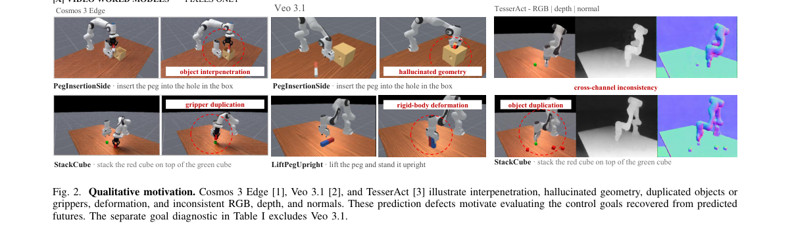

**Why this ranks #3**: 「预测得准」与「可控」之间的鸿沟，本批第三篇明确论证该鸿沟的论文。

---

### 4. ΔWAM: Distilling Action Tangent Fields into World Action Models

**arXiv**: [2610.09734](https://arxiv.org/abs/2610.09734) | **Score**: 8.3 (relevance 8 x 0.7 + quality 9 x 0.3) | **Tags**: world-model | **Categories**: cs.RO | **Pages**: 12

**Authors**: Ke Wu, Hanwen Huang, Bo Gu, Kaizhao Zhang, Xiangting Meng, Yupeng Zheng, Zijun Xu, Jieru Zhao, Wenchao Ding

**Affiliation**: 1Fudan University | 3ShanghaiTech University | 4Institute of Automation, Chinese Academy of Sciences | 5Shanghai Jiao Tong University

**Abstract**

> World Action Models (WAM) improve robot policies by augmenting sparse action supervision with dense future prediction. However, much of the predictable future is dominated by appearance and scene persistence rather than action-dependent dynamics. We observe that several recent WAM designs, including optical flow, motion-centric representations, and latent actions, can be understood from a common perspective in which world supervision becomes more efficient as it contains a higher proportion of action-relevant variation. Based on this insight, we introduce Action Tangent Fields, which reformulate world supervision through a local Taylor expansion of how actions induce changes in future dynamics. We represent future dynamics in Residual-VAE space, where the future latent remains recoverable from the current latent and its residual, and use a strong action-conditioned world model (ACWM) to probe the local correspondence between action variations and residual-world variations. This local first-order structure is distilled into the WAM to guide its denoising supervision toward dynamics that are more tightly coupled to action, rather than merely predictable from appearance. Across LIBERO-Plus, RoboTwin, and RoboTwin2.0-Plus, our method consistently improves robustness to lighting, background, camera, layout, and other environmental perturbations. Despite using no large-scale embodied pretraining, it achieves stronger robustness under several distribution shifts than pretrained policies. We further distill multi-step VideoDiT denoising into a single step for efficient inference. Our results suggest that effective WAM supervision should remain information-rich while concentrating its predictive capacity on the directions along which actions change the future.

**Key findings**

- **Finding**: WAM 的稠密未来预测中，很大一部分由外观与场景持续性主导，而非动作依赖的动力学。

- **Finding**: 作者指出光流、运动中心表示、latent action 等多个近期 WAM 设计都可从「动作切向场」这一共同视角理解；ΔWAM 把动作切向场蒸馏进世界动作模型。

- **Inference**: 这个归一化解释了为什么不同 WAM 收益相近——它们都在学同一个量，但都没有显式排除外观持续性这一主导成分。

- **Recommendation**: 被精读的三篇之一；把多个变体统一到一个视角的论文通常意味着领域对该问题已有共识，值得作为框架读。

**Key figures**

*Main result - Figure 2 Overview of ∆WAM. A Wan VideoDiT-5B is mid-trained to predict the Residual-VAE future Rt+1:t+H. An embodiment-specific ACWM is then queried at K perturbed actions, and its normalized respons*

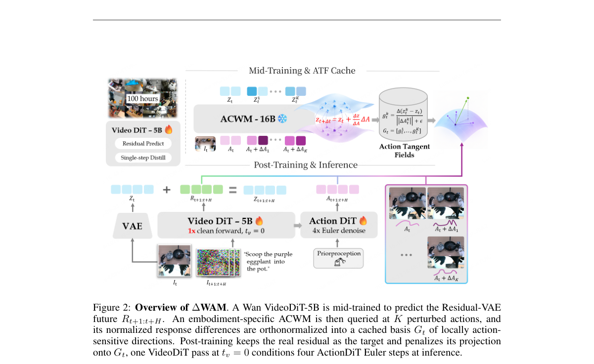

**Why this ranks #4**: 把多个看似不同的 WAM 变体归到同一视角，是一个有用的收敛性观察。

---

### 5. RoboRender: Robot-Oriented Video Generation for Visual Sim-to-Real Transfer

**arXiv**: [2610.09254](https://arxiv.org/abs/2610.09254) | **Score**: 8.0 (relevance 8 x 0.7 + quality 8 x 0.3) | **Tags**: embodied-ai, AIGC-video, sim-to-real | **Categories**: cs.RO | **Pages**: 15

**Authors**: Huang Huang, Wensi Ai, Ziyu Chen, Youhui Wang, Zijian Du, Yang Liu, Jiaolong Yang, Li Fei-Fei, Jiajun Wu

**Affiliation**: 1Stanford University | 3Microsoft Research

**Abstract**

> Simulation enables large-scale, low-cost robot data generation, but policies trained in simulation often fail to transfer to the real world due to the sim-to-real visual discrepancies. Existing approaches often rely on intermediate representations, which can discard rich semantic information or require additional perception modules at deployment. We address this visual sim-to-real gap with RoboRender, a framework that converts simulated trajectories into photorealistic RGB videos for policy learning. RoboRender trains a robot-oriented video generation model conditioned on simulated depth videos, language instructions, and robot RGB mask videos, preserving simulator geometry, robot motion, and action labels while synthesizing realistic textures, backgrounds, and distractors. The generated RGB videos are paired with simulator-provided states and actions to train policies for zero-shot real-world deployment. On robot video test sets, our video model outperforms depth-conditioned video generation baselines in generation quality. In real-world experiments across pick-and-place, articulated-object manipulation, and mobile manipulation tasks, policies trained on RoboRender-generated data achieve a 71% average success rate, outperforming raw simulation renderings and conventional visual domain randomization by approximately 7.1x and 3.6x, respectively. We further show that policy performance improves with more generated videos per simulation trajectory, increasing opening-task success by 65 percentage points. These results demonstrate that generative video rendering mitigates the visual sim-to-real gap for zero-shot policy transfer. Project website: https://robo-render.github.io/.

**Key findings**

- **Finding**: 仿真训练策略迁移失败的主因是视觉 sim-to-real 差距；既有方案依赖中间表示，代价是可能丢弃丰富语义或需在部署时加感知模块。

- **Finding**: RoboRender 采用机器人导向的视频生成来直接缩小视觉域差。

- **Inference**: 「机器人导向」这个限定是关键——通用视频生成追求视觉真实，而这里需要的是对机器人决策有用的分布对齐，损失函数目标本就不同。

- **Recommendation**: 与本批 RL 线的 diversity-driven VLA 微调对读：一个改域内数据分布，一个改域内探索覆盖。

**Key figures**

*Framework / architecture - Figure 1 Overview. From simulation trajectories (Left), RoboRender generates diverse and photorealistic videos oriented for visual sim-to-real robot policy transfer (Middle). These videos preserve simu*

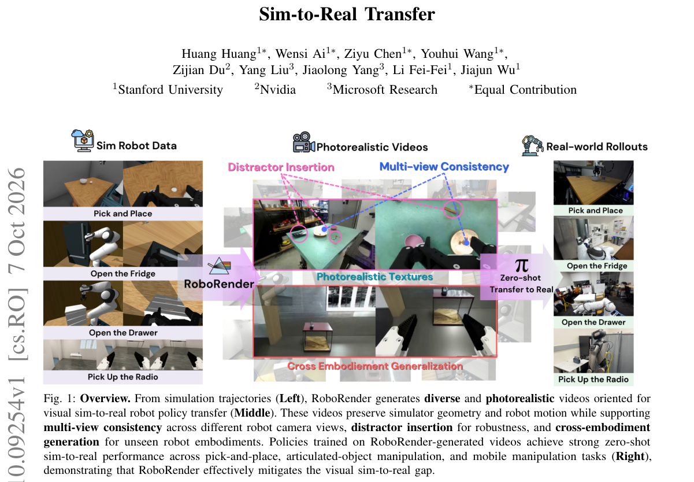

*Main result - Figure 2 RoboRender video generation model. During training, raw RGB videos are VAE-encoded and noised to form the diffusion input. Per-view depth videos and robot-arm RGB mask videos are encoded as sp*

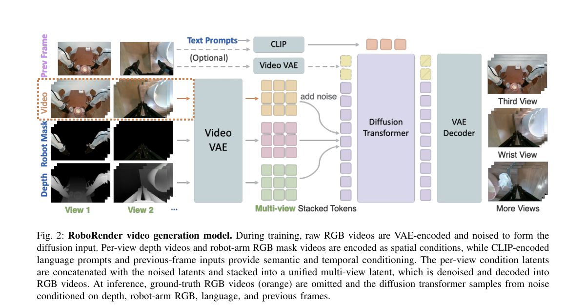

**Why this ranks #5**: 用生成模型直接缩小视觉域差，绕开中间表示这个信息瓶颈。

---

### 6. Agentic RSR: Real-to-Sim-to-Real through Scene Reconstruction and Execution-Grounded Robot Policies

**arXiv**: [2610.10479](https://arxiv.org/abs/2610.10479) | **Score**: 8.0 (relevance 8 x 0.7 + quality 8 x 0.3) | **Tags**: embodied-ai, sim-to-real | **Categories**: cs.CV, cs.RO | **Pages**: 25

**Authors**: Yihan Li, Yating Feng, Shengjiu Sun, Jianing Chen, Hao Ren, Bowen Yang, Weisheng Xu, Qiwei Wu, Hui Cheng, Renjing Xu

**Affiliation**: 1Sun Yat-sen University | 2The Hong Kong University of Science and Technology (Guangzhou)

**Abstract**

> A simulation of a real robot workspace must preserve task-relevant interactions, while policies developed in it must operate on observations available to the real robot. Yet scene reconstruction and policy development are often treated separately. We present Agentic Real-to-Sim-to-Real (Agentic RSR), a framework that links scene reconstruction, policy development, and real-robot execution through the same manipulation task. Given a workspace video, a task description, and a known robot model, an agent recovers metric scale, iteratively refines the scene using visual feedback, and checks task-relevant interactions in MuJoCo. A coding agent then develops an executable policy, progressing from privileged object poses to visual observations and randomized simulation. The policy can interleave multiple observations and actions within one invocation, while the agent uses execution feedback to continue, retry, or revise its approach. A shared task-level interface carries the policy and accumulated experience to the real robot, where fresh observations and safety checks guide execution. Across 18 reconstructed scenes involving two robots, the mean four-view Depth MAE against reference depth estimates is 0.1057 m, the mean Lab $ΔE_{76}$ is 11.04, and the mean grayscale SSIM is 0.6990. In real-robot experiments, the aggregate task success rate reaches 80% of the simulation task success rate, indicating substantial retention of simulated performance on hardware. Code and reconstructed scene data will be made publicly available.

**Key findings**

- **Finding**: 两个约束必须同时满足：仿真须保留任务相关交互，策略须作用于真机可得观测；而重建与策略开发通常分开处理。

- **Finding**: Agentic RSR 把场景重建、策略开发与真机执行三者通过执行验证串联起来。

- **Inference**: 把「执行」作为闭环的一环意味着重建误差会被策略开发过程显式暴露——这比事后的视觉指标更贴近部署时的真实失败模式。

- **Recommendation**: 做 real-to-sim 的读者注意；与 RoboRender 的路线差异（后者改生成分布、本篇改流程）值得对照。

**Key figures**

*Framework / architecture - Figure 1 Agentic RSR overview. An agent uses real observations and known robot geometry to reconstruct a metrically aligned scene and check task-relevant interactions. A policy agent develops and tes*

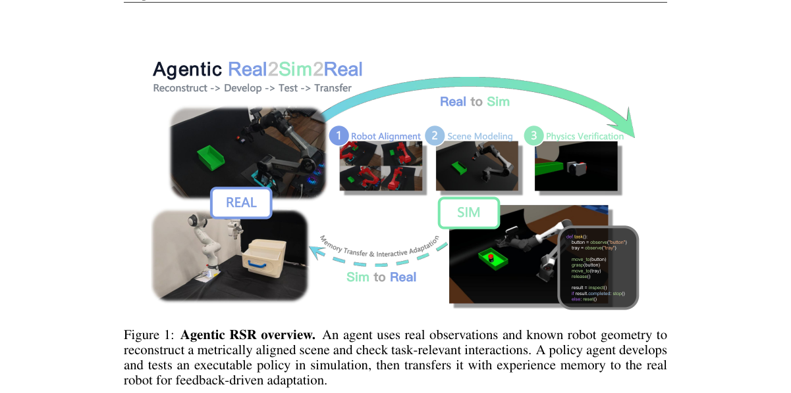

*Main result - Figure 2 Recovering metric scale from known robot geometry. Video-estimated depth, camera parameters, and robot masks are used to construct an observed robot point cloud. Aligning this point cloud wi*

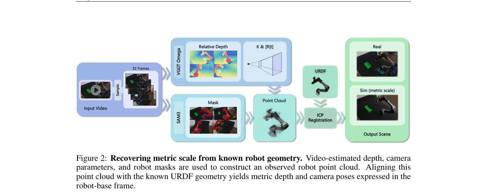

**Why this ranks #6**: 指出「重建与策略开发被割裂处理」这个流程性问题，而非方法问题。

---

### 7. Sparse Planning in Visual World Models via Cost Gradients

**arXiv**: [2610.10274](https://arxiv.org/abs/2610.10274) | **Score**: 8.0 (relevance 8 x 0.7 + quality 8 x 0.3) | **Tags**: world-model | **Categories**: cs.LG | **Pages**: 20

**Authors**: Yingchen Xu, Edward Grefenstette

**Affiliation**: University College London

**Abstract**

> Token-based world models enable fine-grained latent planning, but repeatedly processing large spatial token grids makes action search expensive. We introduce COSTGRAD, a training-free, goal-conditioned selector that ranks spatial tokens by the gradient norm of the planning cost with respect to each input token. By deriving importance from the downstream control objective, COSTGRAD targets tokens that matter for planning rather than merely for prediction. On AdaLN-conditioned predictors at $50\%$ sparsity, COSTGRAD matches or exceeds full-token planning on three of four continuous-control benchmarks, while giving a measured $2.6\times$ wall-clock speedup per environment planning step. Combining token sparsity with reduced CEM search increases this to a $\sim 5\times$ total speedup while still exceeding the full-token baseline. We also identify an architecture-dependent failure mode: in a matched AdaLN-vs-concat comparison, concat maintains comparable full-token performance but pure COSTGRAD loses its advantage over random selection. This difference tracks action-pathway drift: gradient-selected removal produces less drift than random removal on AdaLN, but more on concat. These results highlight selector-architecture compatibility as a design axis for sparse world-model planning. Project page and demos: https://ycxuyingchen.github.io/costgrad/

**Key findings**

- **Finding**: token 世界模型的规划受限于反复处理大空间 token 网格带来的动作搜索成本。

- **Finding**: COSTGRAD 免训练、目标条件化：按「规划代价对每个输入 token 的梯度范数」给空间 token 排序，从下游控制目标导出重要性。

- **Inference**: 用下游目标的梯度而非注意力/显著性来选 token，与本批 AIGC 侧 VLA-ACL（按动作一致性剪枝，10-07）属于同一思路：按「对最终决策的影响」筛 token。

- **Recommendation**: 与本批 embodied 线的 ΔWAM 一起看：一个筛 token、一个筛监督，都在回答「哪些部分对控制真正重要」。

**Key figures**

*Framework / architecture - Figure 1 COSTGRAD: select once, then plan on the selected tokens. (a) A full-token, zero-action probe supplies planning-cost gradients to select top-K positions S for context and goal. (b) CEM search*

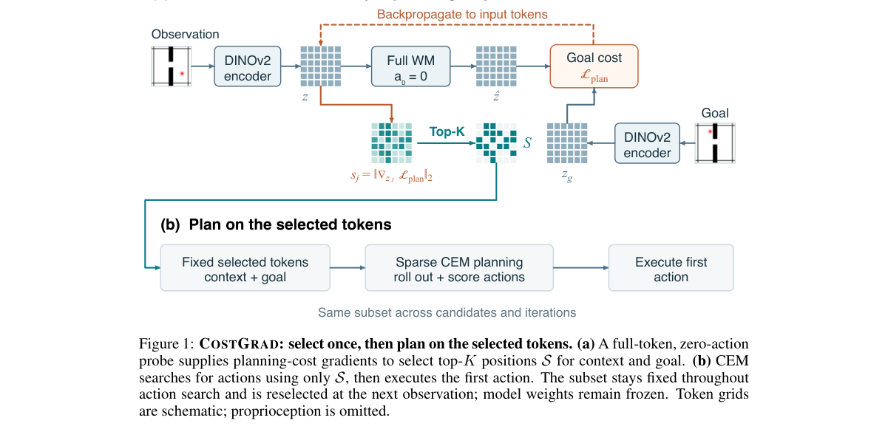

*Main result - Figure 2 Sparsity sweeps on four environments. Planning success (%) vs. keep ratio for COST- GRAD, PREDATTN, and Random; horizontal dashed line is Full (100%). Shaded bands: ±1 std across 3 evaluatio*

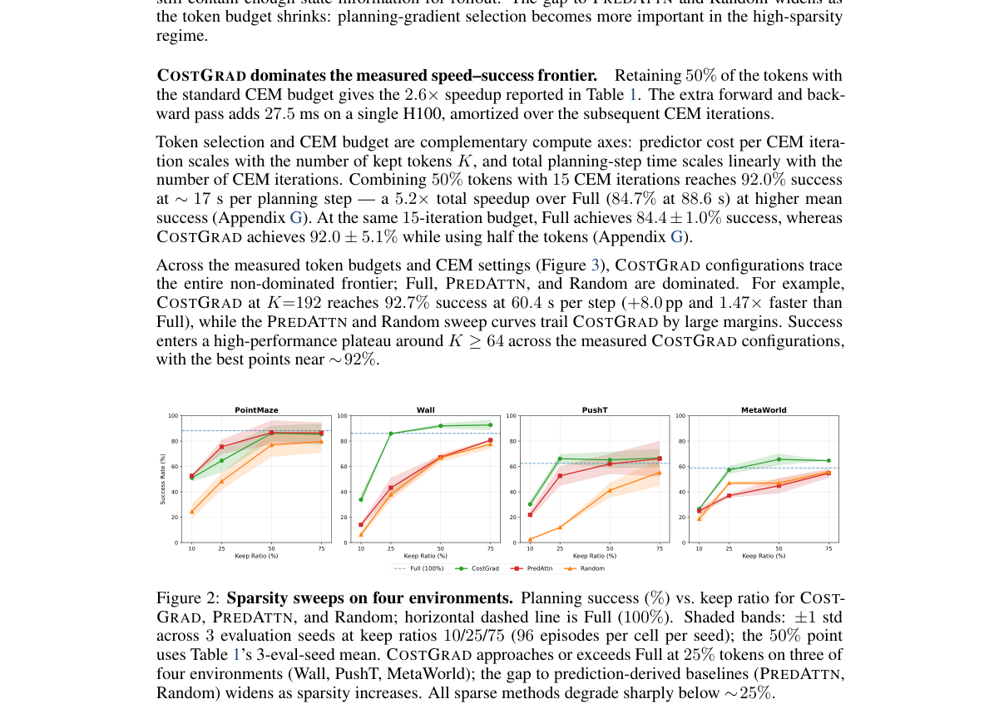

**Why this ranks #7**: 免训练，且重要性直接由下游控制目标导出——而不是代理指标。

---

### 8. Sparse Feature Policy Unlearning Mitigates State Hallucination in Vision-Language-Action Models

**arXiv**: [2610.09496](https://arxiv.org/abs/2610.09496) | **Score**: 7.3 (relevance 7 x 0.7 + quality 8 x 0.3) | **Tags**: embodied-ai | **Categories**: cs.AI, cs.LG, cs.RO | **Pages**: 9

**Authors**: Jiho Lee, Jeongeun Park, Heayoun Choi, Taekyung Kim, Eunwoo Kim

**Affiliation**: of Computer Science Engineering, Chung-Ang University, Seoul, 06974, | Georgia Institute of Technology, Atlanta, GA, 30308, USA (e-mail: | 3Taekyung Kim is with the NAVER AI Lab, Seongnam, 13561, Republic

**Abstract**

> Vision-Language-Action (VLA) models have shown strong generalization in robotic manipulation by leveraging rich representations from pretrained vision-language models. However, their deployment in real-world environments remains limited by recurring unreliable behaviors. In this work, we study state hallucination, a recurring failure pattern in which a VLA continues acting as if an unrealized robot-object state had been achieved. Our analyses find that state hallucination coincides with weakened attention to task-relevant visual regions, and a mechanistic interpretation via sparse autoencoders reveals that hallucination-associated sparse features are activated when these failures occur. Based on this analysis, we propose SOUL (Sparse feature pOlicy UnLearning), which selectively unlearns policy knowledge associated with state hallucination behaviors, where sparse features identified from hallucination failures and successful behaviors serve as explicit forgetting and retention targets, respectively. Experiments across VLA architectures in simulated and real-world environments show that our method substantially reduces hallucinated failures and improves task success without substantially compromising the existing manipulation capabilities. These results suggest that interpretable feature analysis provides a practical basis for selectively modifying undesirable knowledge in robot policies.

**Key findings**

- **Finding**: VLA 部署受反复出现的不可靠行为限制；作者研究**状态幻觉**——策略继续表现得如同某个未实现的机器人状态已经存在。

- **Finding**: 方法为稀疏特征策略遗忘（sparse feature policy unlearning），通过遗忘特定特征来缓解该失效。

- **Inference**: 用「遗忘」而非「再训练」来修正一个具名失效，是低风险干预——它不改变模型的整体能力，只移除一个已定位的特征方向。

- **Recommendation**: VLA 部署的读者注意；被遗忘的特征如何定位（是否需要标注数据）决定该方法能否在无标签场景使用。

**Key figures**

*Framework / architecture - Figure 1 Sparse feature policy unlearning mitigates hallu- cinated beliefs in VLAs. (a) Examples of grasp, transport, and place state hallucinations. (b) State hallucination occurs when a VLA mistakes*

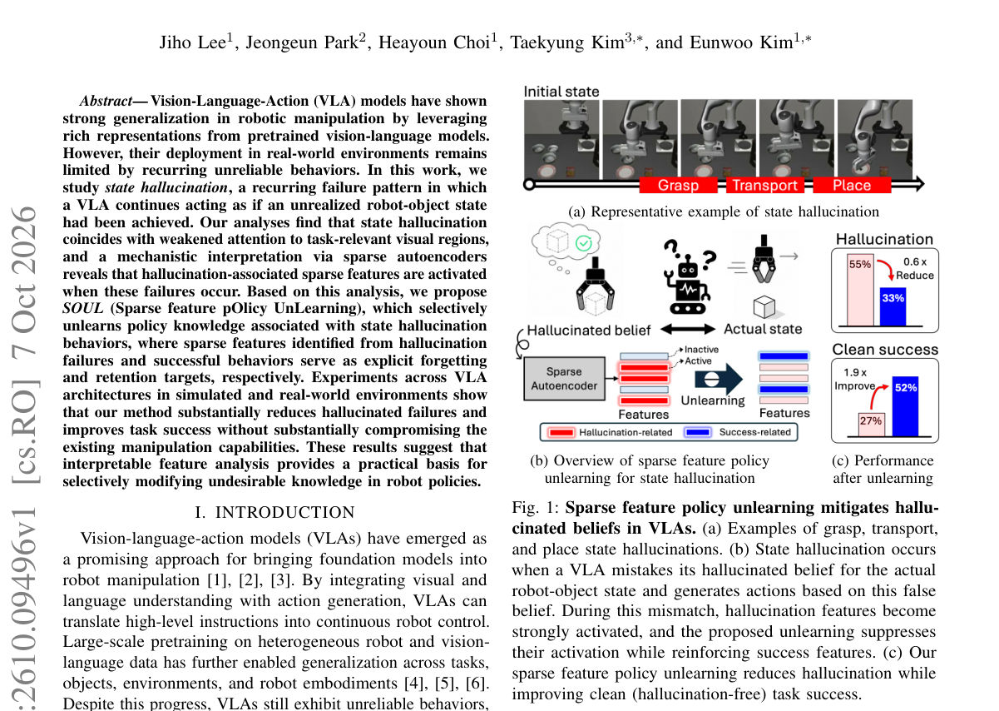

*Main result - Figure 2 State hallucination is associated with distinct attention patterns. Representative clean success (CS, hallucination-free success) and hallucination failure (HF, failure with hallucination) rol*

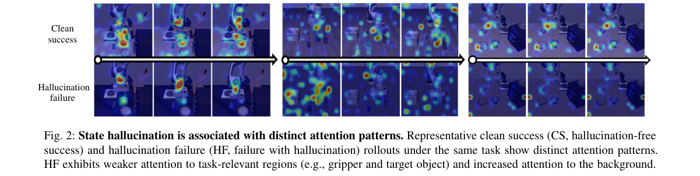

**Why this ranks #8**: 「状态幻觉」是一个命名清楚、可复现的部署失效模式。

---

### 9. Factorized Tactile Representation and Control for Sim-to-Real Manipulation

**arXiv**: [2610.10510](https://arxiv.org/abs/2610.10510) | **Score**: 7.0 (relevance 7 x 0.7 + quality 7 x 0.3) | **Tags**: embodied-ai, sim-to-real | **Categories**: cs.RO | **Pages**: 8

**Authors**: Siqi Shang, Bianca Aumann, Tye Brady, Joshua Migdal, Taskin Padir

**Affiliation**: 1 Amazon Fulfillment Technologies & Robotics, Westborough, MA, USA. | 2 Department of Electrical and Computer Engineering, The University of | Computer Engineering at Northeastern University and as an Amazon Scholar.

**Abstract**

> Tactile sim-to-real learning must bridge simulated contact and device-specific sensor responses while preserving information needed for control. We propose a factorized tactile representation and control framework that maps normal force and contact patch to an effective contact response recoverable from sensor readings. The response is separated into contact geometry, force distribution, and temporal contact change, with representation-specific encoding and randomization. A Tactile Gated Policy preserves these representations separately through control and operates over all mask configurations without retraining. We evaluate the approach through response reconstruction, spatial alignment, force regulation, and contact-rich adversarial peg insertion in simulation and the real world, enabling the utility and transfer reliability of different tactile representations to be assessed independently. The approach achieves <1 mm contact localization, 1.69 N force-tracking error on unseen geometries, and a 35% improvement in real-world adversarial peg insertion over the unfactorized response, with different tactile representations benefiting different interactions.

**Key findings**

- **Finding**: 触觉 sim-to-real 的两个约束：弥合仿真接触与设备特定响应的差距，且不丢失控制需要的信息。

- **Finding**: 框架把法向力与接触面映射为**可从传感器读数恢复**的有效接触响应，并把该响应分解为接触几何、力分布与节奏三部分。

- **Inference**: 「可恢复」这个要求把设计目标从「模拟得像」转向「真实传感器能否读出」——这是 sim-to-real 里更可操作的判据。

- **Recommendation**: 触觉 sim-to-real 的读者注意；与 OpenViTac 的统一基准对读，一篇提表征一篇给基准。

**Key figures**

*Framework / architecture - Figure 1 Simulated contact and real tactile sensor readings are mapped to a common effective contact response r, providing a shared tactile interface across*

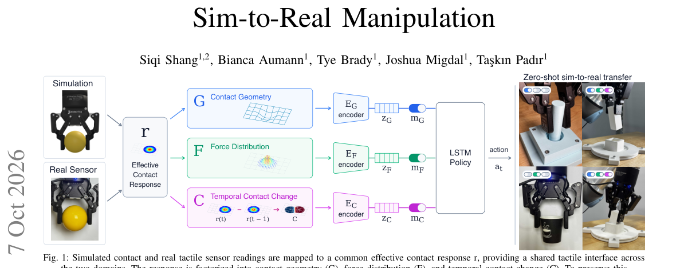

*Main result - Figure 2 The response pipeline in both directions on a single calibration contact. From physical deformation on a real sensor or simulated compliant contact with penetration, force and contact patch pr*

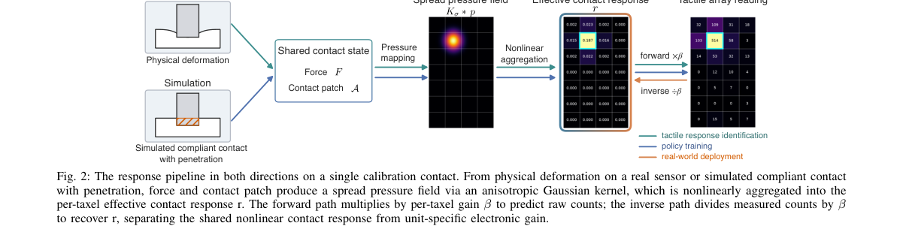

**Why this ranks #9**: 本批触觉论文密集（至少 5 篇），这一篇的因子化拆解最具体。

---

### 10. OpenViTac: Learning and Benchmarking Visuo-Tactile Policies in a Unified Sim-and-Real Framework

**arXiv**: [2610.10384](https://arxiv.org/abs/2610.10384) | **Score**: 7.0 (relevance 7 x 0.7 + quality 7 x 0.3) | **Tags**: embodied-ai | **Categories**: cs.RO | **Pages**: 31

**Authors**: Yifan Wu, Qin Li, Nan Min, Guojin Zhong, Haoyu Zhao, Zhiyuan Li, Houze Xu, Shengqi Xu, Xingyao Lin, Zijie Diao, Zhaoxiang Liu, Shiguo Lian

**Affiliation**: 1Fudan University, 2Shanghai Key Laboratory of Multimodal Embodied AI, | 3Hefei University of Technology | 4National University of Singapore, 5Neote AI, 6China Unicom | — George Berkeley

**Abstract**

> Tactile feedback provides embodied agents with physical information beyond visual observations, enabling more reliable interaction with the real world. However, despite the rapid progress of vision-tactile-language-action (VTLA) policies, there remains a lack of unified benchmarks for evaluating tactile-enabled robot manipulation across simulation and the real world. To address this gap, we introduce OpenViTac, a visuo-tactile manipulation benchmark for evaluating robot policies across simulation and the real world. OpenViTac organizes contact-rich manipulation into four tactile-relevant capability dimensions and provides paired simulation-real-world settings for consistent evaluation of VLA, WAM, and VTLA policies. Building upon this benchmark, we investigate how different tactile representations and integration strategies affect the performance of pretrained VLA models. Correspondingly, we introduce OpenVTLA, a tactile augmentation framework that combines the best-performing representation and integration strategy. Furthermore, we leverage the paired benchmark setting to study sim-real co-training and analyze factors affecting cross-domain policy learning. Together, OpenViTac provides a unified platform for evaluating and advancing visuo-tactile robot manipulation.

**Key findings**

- **Finding**: VTLA 策略进展迅速，但跨仿真与真实世界评估触觉操作缺乏统一基准。

- **Finding**: OpenViTac 在统一的仿真-真实框架内同时提供学习与基准评测。

- **Inference**: 今天至少 5 篇触觉工作（因子化表征、500 小时数据、时序触觉、磁纤毛传感器、统一基准）同时出现，说明该子方向正在从方法期进入基准期——没有统一基准时这些方法无法横向比较。

- **Recommendation**: 本批具身线的隐含主线；先读这篇建立坐标系，再读其他触觉工作的定位。

**Key figures**

*Framework / architecture - Figure 1 Overview of OpenViTac. OpenViTac establishes a unified benchmark for visuo-tactile manipulation, spanning four complementary capability dimensions: physical-property perception, fragility-awa*

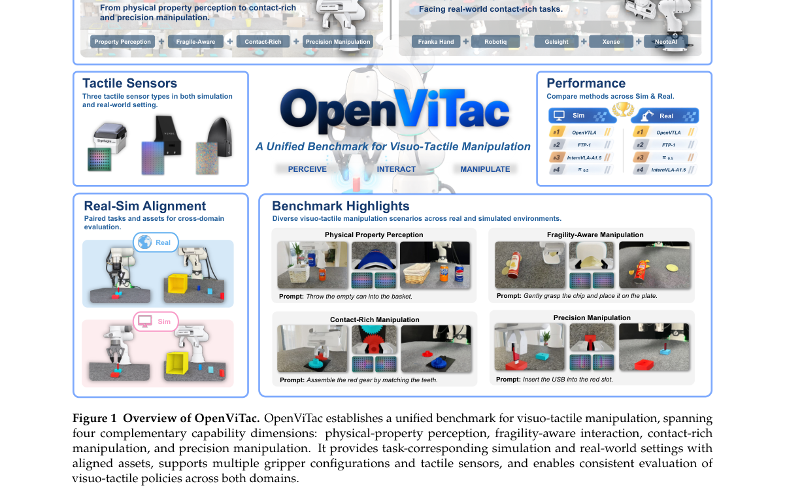

*Main result - Figure 2 Overview of the OpenViTac design. (a) Capability taxonomy with four visuo-tactile capabilities and their underlying skills. (b) Construction of task-corresponding simulation environments from*

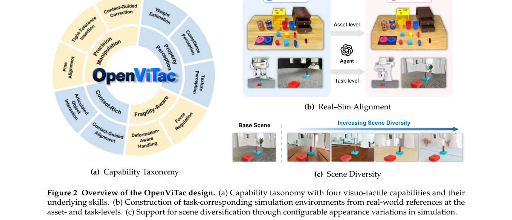

**Why this ranks #10**: 为今天异常密集的触觉方向提供统一评估口径。

---

## Footer

- Total papers reviewed across all 5 tracks: 50 (from 580 scanned)
- embodied track final top-10: 10
- Wild-cards in this track: 1
- Figure assets: `res/` (shared across tracks)

Generated by `mine-arxiv-daily-digest` skill. Sister file: `2026-10-08_embodied_entry.md`.
