# ArXiv Daily Digest - 2026-10-08 (强化学习, 10 papers)

**Generated**: 2026-10-08 17:00 CST

**Source**: arXiv cs.CV, cs.SD, eess.AS, cs.CL, cs.AI, cs.RO, cs.LG submissions, window 2026-10-07 UTC (the latest announced batch as of 2026-10-08 17:00 CST)

**Track**: rl (top 10 of 580 papers scanned, 50 full reads)

**Scope**: process supervision without value networks, off-policy correction for asynchronous LLM RL, interaction-constrained offline RL for autonomous driving, exploration-optimization decoupling in RLVR, diversity-driven RL fine-tuning for VLAs, rectified-flow policy optimization under coarse integration, PPO-Clip convergence theory, informational curse of horizon, training-data attribution in online RL, average-reward multichain MDPs

---

本批 RL 线有两个共同的反直觉结论。第一个是关于机制解释：**BoT-GRPO** 攻击 GRPO 最被诟病的点——每次 rollout 的所有 token 共享同一优势值，过程监督因此无梯度分化——并且不引入价值网络就能生效，这一点比机制本身更关键，因为价值网络的训练成本与不稳定性正是 GRPO 被大量采用的主因。**COPC** 给出第二个：异步 LLM RL 的主流做法只修正策略侧的 token 级不匹配（重要性比率控制），作者**证明这不充分**——优势估计同样继承了来自行为策略的不匹配。这个反驳之所以重要，是因为优势正是用陈旧策略的轨迹算出的，忽略它等于默认优势与当前策略一致。两篇同属 LLM RL 训练机制，一篇改奖励分配、一篇改 off-policy 校正，是今天最值得连读的一对。第三个反直觉在**RFPO**：流策略的迭代 ODE 积分成本高，但朴素削减积分预算会严重损害控制，因为在全步执行下优化的策略并未被约束为在粗积分下可靠——这是训练/推理目标错配的干净实例，且与 10-07 日报的 QF3 正好构成一对（那篇加速训练，这篇处理推理端预算）。其余：**Decoupling Exploration from Optimization in RLVR** 解释了为什么给 RLVR 加强新颖性激励收益有限甚至有害；Diversity-Driven RL 微调把「RL 为何损害泛化」与「RL 为何提升泛化」统一进「探索的选择性重塑」一个解释；交互约束离线 RL 把自动驾驶的分布偏移问题重新表述为交互约束问题；PPO-Clip 的非渐近闭环分析补上 critic 学习与裁剪的耦合；时程诅咒被识别出第二个（信息论意义上的，目标重标注时程过长会损失信息，与回溯时程过长的偏差累积方向相反，两者必然存在一个未被识别的最优折中点）；BehaviorTrace 用植入行为提供归因真值，解决「如何知道归因答案是真的」这个更根本的问题。

---

## Top 10 — 强化学习

### 1. BoT-GRPO: Efficient Process-Reward RL for Reasoning via Bag-of-Token Aggregation

**arXiv**: [2610.09804](https://arxiv.org/abs/2610.09804) | **Score**: 9.0 (relevance 9 x 0.7 + quality 9 x 0.3) | **Tags**: rlhf | **Categories**: cs.LG | **Pages**: 21

**Authors**: Yingxiang Yang, Weihang Xiao, Zhunxuan Wang, Joshua Flashner, Niresh Agarwal

**Affiliation**: Amazon AGI

**Abstract**

> Reinforcement learning is now central to eliciting reasoning in large language models, while in the popular algorithm Group Relative Policy Optimization (GRPO) every token in a rollout receives the same advantage. We ask how to make process supervision efficient: accelerating convergence and improving final quality without the cost of value networks. We propose Bag-of-Tokens Group Relative Policy Optimization (BoT-GRPO), which extends GRPO to token-level reward models through a length-invariant "bag of tokens" aggregation: it collects all token-level rewards across rollouts, weights each by the inverse of its source sequence length, and computes per-token advantages relative to weighted group statistics. BoT-GRPO is critic-free, and is a drop-in replacement wherever GRPO is used when token-level reward is available. On React front-end code generation, BoT-GRPO reaches $80\%$ compile rate up to $1.9\times$ faster than GRPO and converges faster than modern GRPO variants (GSPO, DAPO, PURE) while reaching higher final compile and VLM-judged win rates. On a second task, AIME mathematical reasoning, BoT-GRPO delivers absolute Pass@$k$ gains up to $8.1\%$ over GRPO in half the steps. For both tasks we compare the algorithm's performance on reasoning vs. non-reasoning base-model families (Qwen2.5-3B, SmolLM3-3B, Phi-4-mini-reasoning). Our experiments also yield a practical recipe for the reward model itself: reward stability matters more than richness: clean, bounded, stable fine-grained signals consistently accelerate learning where noisier alternatives stall.

**Key findings**

- **Finding**: GRPO 中每次 rollout 的所有 token 共享同一优势值，因此过程监督无梯度分化。

- **Finding**: BoT-GRPO 提出 bag-of-tokens 聚合，让过程奖励在不引入价值网络的前提下生效。

- **Inference**: 不引入价值网络是关键取舍——价值网络的训练成本与不稳定性是 GRPO 被大量采用的主因，绕开它意味着这套方法能直接套到现有 GRPO 训练流水线上。

- **Recommendation**: 被精读的三篇之一；与本批 COPC（同为 LLM RL 训练机制）对读，一篇改奖励分配、一篇改 off-policy 校正。

**Key figures**

*Framework / architecture - Figure 1 React compile success rate on the held-out set for BoT-GRPO and four RL baselines. BoT-GRPO (blue, dashed) is the first to cross every compile-rate threshold; PURE (red) matches early but de*

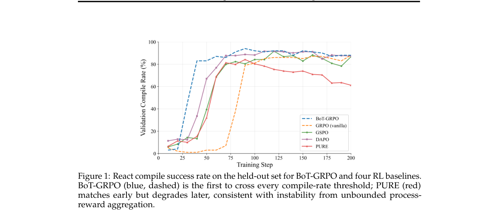

*Main result - Figure 2 Pairwise VLM win rate (4-round ABBA) of BoT-GRPO against each baseline (ties = 0.5; BoT-GRPO above 0.5 means it is preferred; grey bars show the tie rate). BoT-GRPO wins throughout training*

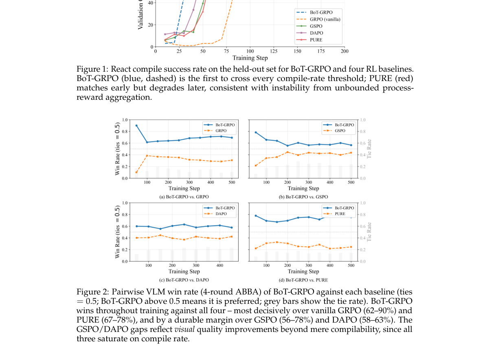

**Why this ranks #1**: 直接攻击 GRPO 最被诟病的点——token 级优势无差别，且过程监督通常需要额外价值网络。

---

### 2. COPC: Coupled Off-Policy Correction for Asynchronous LLM Reinforcement Learning

**arXiv**: [2610.09597](https://arxiv.org/abs/2610.09597) | **Score**: 8.7 (relevance 9 x 0.7 + quality 8 x 0.3) | **Tags**: rlhf, rl-algorithm | **Categories**: cs.LG | **Pages**: 21

**Authors**: Zicheng Hu, Zhijian Zhou, Xuan Zhang, Yuchen Liu, Cheng Chen, Yuan Li, Qi Gu, Yan Feng, Hongyan Hao, Chao Qu

**Affiliation**: 1Fudan University | 3East China Normal University

**Abstract**

> Asynchronous RL accelerates large language model post-training by decoupling rollout generation from optimization, but trains on stale trajectories. Existing methods primarily correct token-level policy mismatch through importance-ratio control in the actor objective. We show that this \emph{policy-side correction} alone is insufficient: advantage estimates also inherit mismatch from behavior-policy continuations, which we term \emph{advantage staleness}. We derive exact bias and variance decompositions for a general two-channel actor update, revealing nonseparable coupling between policy-weight and advantage-estimation errors: their interaction induces multiplicative bias terms, while squared policy weights amplify advantage uncertainty in gradient variance. This motivates the hypothesis that policy- and advantage-side correction should be coordinated. We introduce Coupled Off-Policy Correction (COPC), an actor--critic method combining token-level ratio masking with two-sided clipped-ratio weighting of TD residuals for return and advantage estimation. Joint parameter sweeps across staleness levels support this hypothesis: the effect of one correction parameter depends on, and can reverse with, the other. COPC achieves the highest reported performance on tool-integrated mathematical reasoning and search, outperforming the strongest reported asynchronous baseline in each setting. It also offers a broad high-performing parameter region and improved training stability. In search, COPC remains stable throughout training, while most evaluated asynchronous baselines collapse late in training. These gains persist at 64-step policy staleness. COPC adds minimal step-time overhead over asynchronous PPO and retains a $1.7\times$ step-time speedup over synchronous PPO.

**Key findings**

- **Finding**: 异步 LLM RL 在陈旧轨迹上训练；既有方法主要用 actor 目标里的重要性比率控制来修正 token 级策略不匹配（策略侧修正）。

- **Finding**: 作者证明策略侧修正单独不够：**优势估计同样继承**了来自行为策略的不匹配。

- **Inference**: 只修策略而忽略优势估计，等于假设优势与当前策略一致——在异步训练中这个假设直接破裂，因为优势正是用陈旧策略的轨迹算出来的。

- **Recommendation**: 做异步/大规模 RL 训练的必读；「耦合」修正的具体形式（是否需要额外网络）是落地成本的关键。

**Key figures**

*Framework / architecture - Figure 1 Mean avg@32 accuracy on AIME 2025 under joint policy- and advantage-side correction sweeps at staleness levels s ∈{8, 12, 16}.*

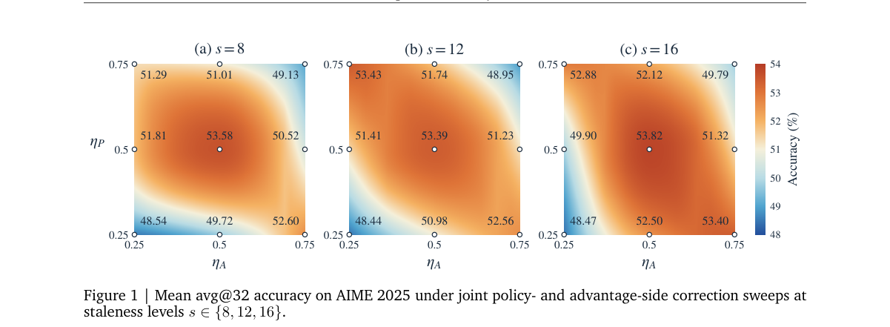

*Main result - Figure 2 Training stability and robustness. Left: training dynamics of asynchronous methods on search. Right: COPC training dynamics on AIME 2025 under different policy-staleness levels.*

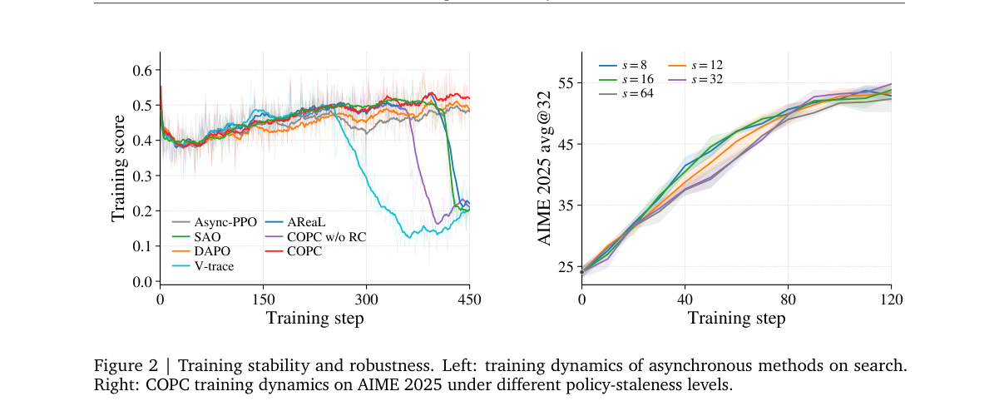

**Why this ranks #2**: 证明「只修策略侧」不充分，这是对当前异步 RL 主流做法的直接反驳。

---

### 3. Beyond Policy Support: Interaction Constrained Offline Reinforcement Learning for Autonomous Driving

**arXiv**: [2610.09763](https://arxiv.org/abs/2610.09763) | **Score**: 8.0 (relevance 8 x 0.7 + quality 8 x 0.3) | **Tags**: rl-algorithm | **Categories**: cs.AI, cs.LG, cs.RO | **Pages**: 21

**Authors**: Mahmoud Selim, Cristina Cipriani, Karl Henrik Johansson

**Affiliation**: [not-found in PDF]

**Abstract**

> Offline reinforcement learning enables reward-driven policy improvement from fixed datasets without requiring online exploration, making it particularly attractive in safety-critical domains. A central challenge, however, is distribution shift: policy optimization may favor actions that are weakly supported by the offline data, rendering value estimates unreliable. Existing approaches primarily control this shift in the policy's own action space. In interactive environments such as autonomous driving, this can be insufficient: a candidate ego trajectory may remain well supported under the marginal behavior distribution while being poorly supported jointly with the surrounding-agent behavior observed in the logged interaction. We refer to this degradation in interaction support as \emph{interaction distribution shift} (IDS), and introduce \emph{Interaction-Constrained Drive Policy} (ICDP), an offline reinforcement learning framework that explicitly controls interaction-level distribution shift. Starting from the joint data distribution over ego and surrounding-agent futures, we show that joint-support degradation decomposes exactly into an ego-support component and a residual interaction-support component. We recover the latter through contrastive density-ratio estimation, isolating interaction compatibility without explicit joint-density modeling, surrounding-agent prediction, or rollouts in reactive simulators or learned world models during policy optimization. Closed-loop evaluations on nuPlan, Interplan and real-world truck experiments show that ICDP suppresses high-value yet interaction-unsupported trajectory selections and improves performance in interaction-critical driving scenarios. Project webpage: https://mahmoud-selim.github.io/ICDP/

**Key findings**

- **Finding**: 离线 RL 在安全攸关领域（自动驾驶）尤其有吸引力；核心挑战是策略优化偏好离线数据支撑薄弱的动作，导致价值估计不可靠。

- **Finding**: 作者把问题重新表述为**交互约束**，而非仅靠保守性约束（摘要在此处截断，详见正文）。

- **Inference**: 从「分布偏移」转向「交互约束」的措辞变化意味着解法从正则化转向约束优化问题本身——这会改变可行的算法族。

- **Recommendation**: 自动驾驶离线 RL 的读者注意；与本批 ΔWAM 的「动作依赖性」筛选思路同源，都在剔除与动作无关的数据成分。

**Key figures**

*Framework / architecture - Figure 1 Overview of ICDP. The logged scene is encoded into structured scene features used by the diffusion actor and critic. The actor generates candidate ego trajectories, which are evaluated by a*

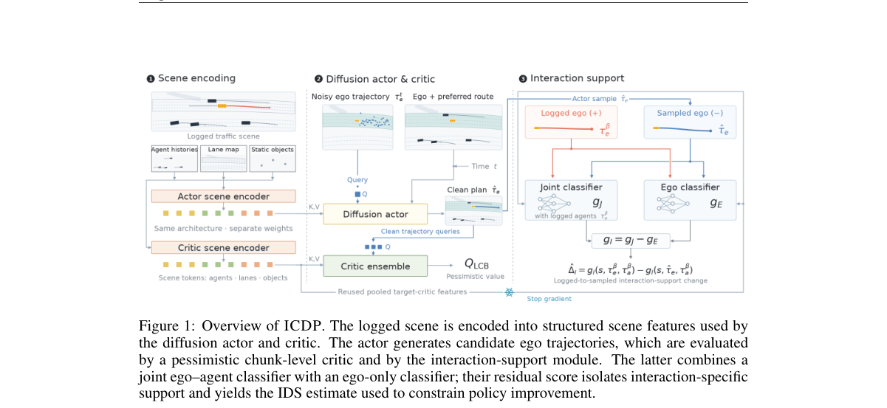

*Main result - Figure 2 Sensitivity of ICDP to (a) ego-support regularization, (b) interaction-support regular- ization, and (c) the number of surrounding agents. Scores are averaged across Test14-Hard and Test14-R*

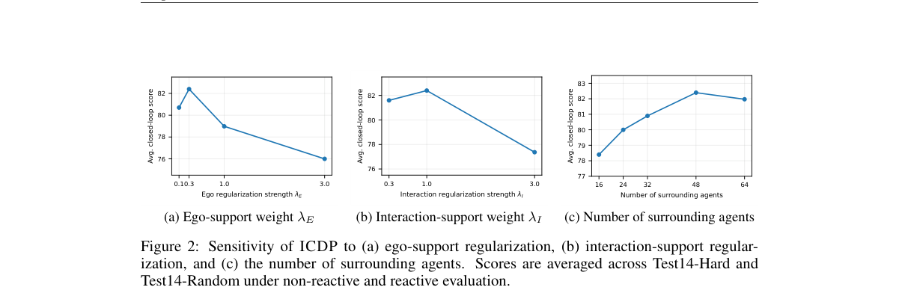

**Why this ranks #3**: 把「支撑不足」从分布偏移问题重新表述为交互约束问题。

---

### 4. Decoupling Exploration from Optimization in RLVR

**arXiv**: [2610.10536](https://arxiv.org/abs/2610.10536) | **Score**: 8.0 (relevance 8 x 0.7 + quality 8 x 0.3) | **Tags**: rlhf, rl-algorithm | **Categories**: cs.AI, cs.CL, cs.LG | **Pages**: 20

**Authors**: Saif Punjwani, Micah Goldblum

**Affiliation**: Columbia University | 1Department of Computer Science, Columbia University. | 2Department of Electrical Engineering, Columbia University.

**Abstract**

> Modern language models undergo reinforcement learning with verifiable rewards (RLVR) on top of already-trained checkpoints. A key promise of RLVR is the discovery of new reasoning strategies. In principle, a model can sample novel ideas absent from its prior training data. In practice, however, augmenting RLVR with strong novelty incentives has seen limited success and can degrade model quality. Because verifiable rewards supervise only a narrow slice of the model's knowledge and behavior, such degradations are difficult to recover from. Instead, we decouple exploration from optimization in a framework we call Exploration-Distillation (ExpDis). We train one or more explorer policies with a novelty bonus in the reward, filter their trajectories for correctness and quality, and distill them into a separate student policy. The student policy is then trained without a novelty bonus. We repeat the above procedure for several rounds, alternating between exploration and optimization. This decoupling allows us to aggressively scale exploration without degrading the student policy. Across seven mathematical reasoning benchmarks and two model families, ExpDis outperforms DAPO at the same wall-clock budget. Moreover, we observe improved pass@$k$ scaling, indicating that ExpDis produces models that generate more diverse correct solutions.

**Key findings**

- **Finding**: RLVR 的承诺是发现新推理策略，理论上模型能采样到先验训练数据中不存在的新想法。

- **Finding**: 实践中给 RLVR 加强新颖性激励收益有限，甚至可能损害模型质量；作者将探索与优化解耦来处理这一失败。

- **Inference**: 新颖性激励失败的原因可能是奖励与可验证奖励争夺同一策略容量——把探索单列为一个不受主目标支配的通道，比在同一个优势里加权更结构化。

- **Recommendation**: 做 RLVR 的必读；「解耦」是引入独立探索通道还是引入独立损失项，结论差别很大。

**Key figures**

*Main result - Figure 2 ExpDis scales across parallel explorers and iterations. Within a round, several explorers are trained in parallel with a novelty bonus, and their traces are pooled to distill a single studen*

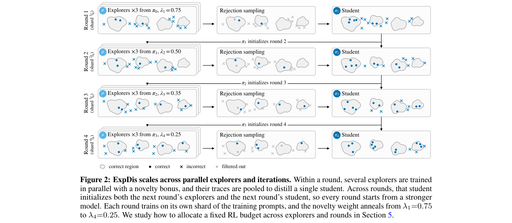

**Why this ranks #4**: 解释「为什么新颖性激励在 RLVR 上失败」，是 RLVR 方法论的一个必要修正。

---

### 5. Many Ways to Succeed: Diversity-Driven RL Fine-Tuning for VLA Generalization

**arXiv**: [2610.09943](https://arxiv.org/abs/2610.09943) | **Score**: 8.0 (relevance 8 x 0.7 + quality 8 x 0.3) | **Tags**: rl-algorithm, embodied-ai | **Categories**: cs.LG, cs.RO | **Pages**: 22

**Authors**: Haoru Li, Jinmei Liu, Zhiyong Wang, Xiaoming Li, Zhenhong Sun, Daoyi Dong, Chunlin Chen, Zhi Wang

**Affiliation**: 1 Nanjing University | 2 Harbin Institute of Technology (Shenzhen) | 3 Australian National University | 4 University of Technology Sydney

**Abstract**

> Reinforcement learning (RL) fine-tuning improves vision-language-action (VLA) policies through closed-loop experience, yet generalization beyond the fine-tuning distribution remains limited. Our analysis reveals a selective reshaping of exploration: RL contracts behavior globally, yet diversifies successful trajectories, elicits success with fewer rollouts, and covers more of the latent task-valid solution space than supervised fine-tuning. Broader successful-mode coverage may provide alternative strategies under distribution shifts. Inspired by this, we introduce DRIVE (Diversity-driven RL fIne-tuning for VLA gEneralization), which turns successful-behavior diversity into an explicit RL objective. DRIVE groups rollouts under matched task conditions, compares their trajectories with temporal alignment, and derives a success-conditioned intrinsic reward from relative behavioral diversity. This design encourages broader coverage of feasible solutions without rewarding diverse failures or superficial timing differences. Across LIBERO-Plus, ManiSkill3, and RoboTwin 2.0, DRIVE improves the average out-of-domain (OOD) performance over vanilla RL fine-tuning by 5.3 points on $π_0$ and 2.0 points on $π_{0.5}$. On a dual-arm AgileX PiPER-X platform, DRIVE further increases average OOD success from 64.1% to 73.3% (+9.2 points), demonstrating gains that persist under physical deployment.

**Key findings**

- **Finding**: RL 微调改善闭环经验，但超出微调分布的泛化受限。

- **Finding**: 作者分析揭示探索被**选择性重塑**：RL 全局收缩行为，却多样化成功轨迹、以更少 rollout 获得成功，并覆盖更多潜在的任务有效区域。

- **Inference**: 这个解释同时说明了两件事：RL 的窄化是全局的（故泛化受损），而它的多样性效应集中在成功轨迹上（故仍能学到更多）——两者不是矛盾而是同一重塑的两面。

- **Recommendation**: 与本批 RoboRender 对读：RL 的域内多样性效应与生成模型提供的域内数据多样性，是同一问题的两条解法。

**Key figures**

*Framework / architecture - Figure 1 Beyond task success, diverse suc- cessful trajectories reveal broader solution modes. This diversity provides a new oppor- tunity for improving VLA generalization.*

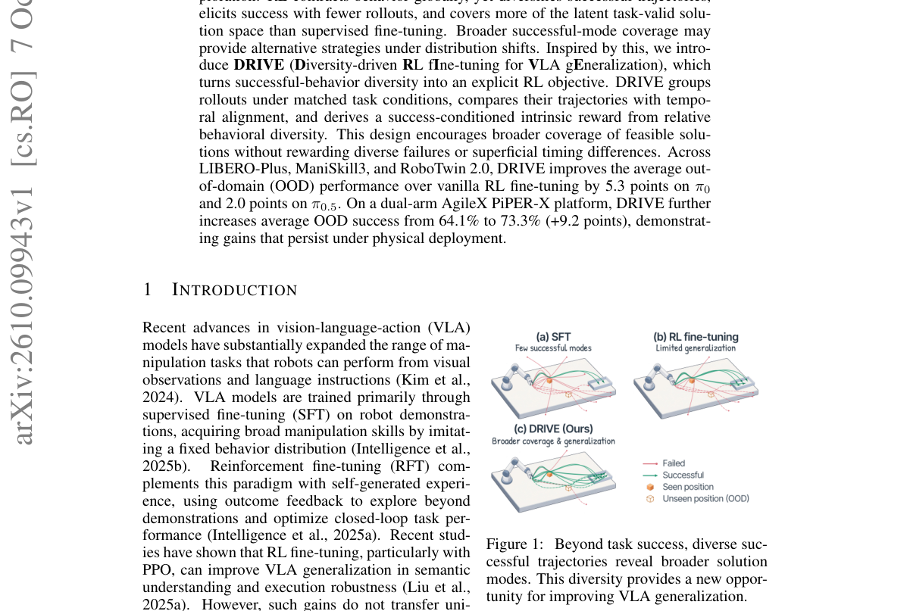

*Main result - Figure 2 Exploration dynamics and successful-behavior accessibility in VLA reinforcement fine- tuning. (a–b) During RFT, similarity increases across all rollouts while decreasing among successful tra*

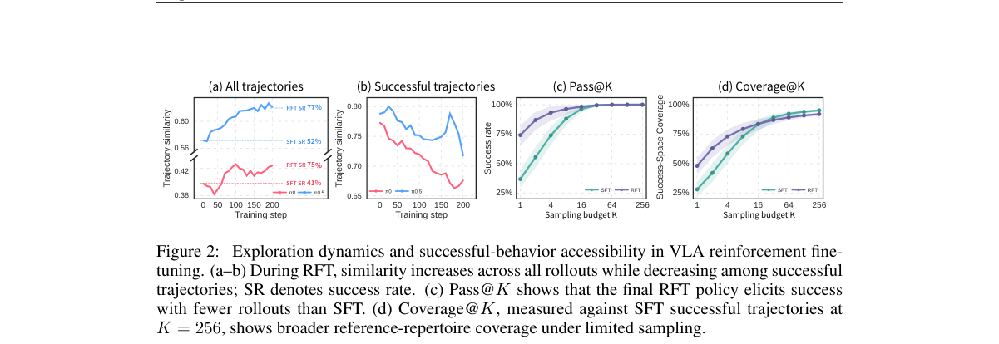

**Why this ranks #5**: 把「RL 为什么损害泛化」与「RL 为什么能提升泛化」统一进同一个解释框架。

---

### 6. RFPO: Rectified Flow Policy Optimization for Embodied Control

**arXiv**: [2610.10453](https://arxiv.org/abs/2610.10453) | **Score**: 8.0 (relevance 8 x 0.7 + quality 8 x 0.3) | **Tags**: rl-algorithm, embodied-ai | **Categories**: cs.RO | **Pages**: 9

**Authors**: Ting Huang, Lisiyu Pan, Haoyu Wang, Zeyu Zhang, Siyuan Qian, Yanjun Li, Yandong Guo, Boxin Shi, Hao Tang

**Affiliation**: 1School of Computer Science, Peking University

**Abstract**

> Flow-based policies provide an expressive framework for continuous robot control, but their iterative ODE integration incurs substantial inference cost. Naively reducing the integration budget can severely degrade control, since policies optimized under full-step execution are not explicitly constrained to remain reliable under coarse numerical integration. We refer to this mismatch as the few-step discretization gap. To address this problem, we introduce RFPO, a flow-policy optimization framework for reliable few-step execution. Reward-aware online Reflow rectifies student-induced transport paths during on-policy learning, making the resulting policy more robust to coarse integration. A frozen Gaussian PPO controller supplies complementary action-space supervision at full and intermediate integration budgets, while the deployed policy remains a single flow student executed with one Euler step. Across Unitree Go2, Boston Dynamics Spot, Unitree H1, and Unitree G1, RFPO consistently preserves full-step control performance under one-step execution, with one-step returns remaining within 2.4% of their corresponding 64-step values across both zero and random initialization. On Unitree Go2, one-step execution retains 98.5% of the 64-step reward while reducing onboard mean inference latency from 4.39 ms to 0.08 ms, yielding a 54.9x speedup. Real-robot experiments further validate stable one-step locomotion. Code: https://github.com/AIGeeksGroup/RFPO. Website: https://aigeeksgroup.github.io/RFPO.

**Key findings**

- **Finding**: 朴素削减流策略的 ODE 积分预算会严重损害控制，因为全步执行下优化的策略并未被约束为在粗积分下可靠——作者称之为 few-step 失配。

- **Finding**: RFPO 在优化阶段显式引入对粗数值积分的约束。

- **Inference**: 这是训练/推理目标错配的一个干净实例：优化假设了一种执行方式，部署用了另一种，修复点必须在优化阶段而非部署阶段。

- **Recommendation**: 与 10-07 的 QF3 连读——两篇分别从训练效率与推理预算处理流策略的实用化，是同一条工程主线。

**Key figures**

*Framework / architecture - Figure 1 Few-step execution of reward-optimized flow policies. Naive step reduction can create a discretization gap between full-step and few- step actions. RFPO rectifies student-induced transport pat*

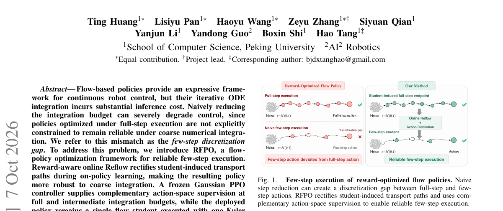

*Main result - Figure 2 Overview of RFPO. During on-policy training, student-induced full-step endpoints are rectified by reward-aware online Reflow, while multi-budget student actions are distilled toward a frozen P*

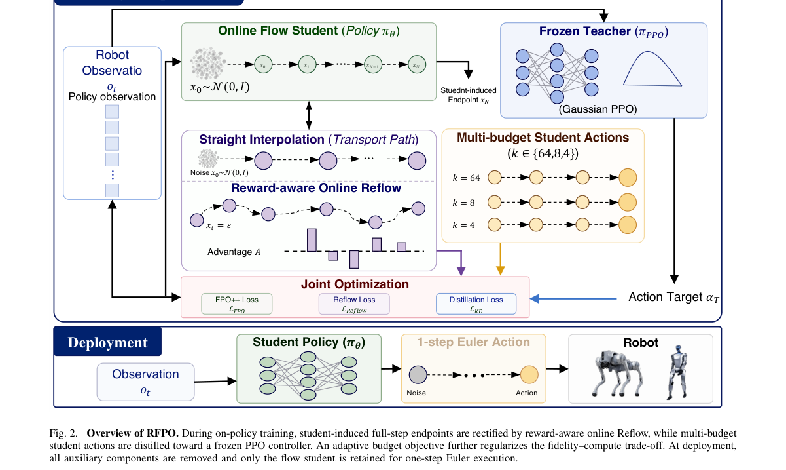

**Why this ranks #6**: 与 10-07 日报的 QF3 正好构成一对：QF3 加速流策略的**训练**，这篇处理推理端的积分预算错配。

---

### 7. A Closed-Loop Non-Asymptotic Convergence Analysis of PPO with Learned Critics and Clipping

**arXiv**: [2610.10273](https://arxiv.org/abs/2610.10273) | **Score**: 7.3 (relevance 7 x 0.7 + quality 8 x 0.3) | **Tags**: rl-algorithm | **Categories**: cs.LG | **Pages**: 87

**Authors**: Junwei Su, Mengfan Liu, Yanyong Zhang, Chuan Wu

**Affiliation**: School of Artificial Intelligence and Data Science, | University of Science and Technology of China | University of Hong Kong

**Abstract**

> Despite its widespread use, Proximal Policy Optimization with clipping (PPO-Clip) remains difficult to tune, and the interactions among critic learning, clipping, and rollout reuse remain incompletely understood. We develop a \emph{non-asymptotic} analysis of PPO-Clip as a \emph{closed-loop actor--critic} system. It captures actor--critic coupling, nonsmooth probability-ratio clipping, finite-batch reuse, and predictable early stopping under explicit coverage and critic regularity assumptions, using raw GAE and Monte Carlo critic targets. Our synchronous and asynchronous guarantees jointly characterize policy stationarity and the tracking accuracy of the learned critic, with explicit dependence on algorithmic parameters. A sufficient coupling condition gives optimization, critic tracking, clipping, and finite-batch errors a common amplification bound. The asynchronous result also requires a delay-dependent critic stepsize restriction; violating these conditions does not establish divergence. For finite layered MDPs with tabular critics, a uniform bound on the actual clipped-gradient class replaces complete-trajectory counting. A verified growing-horizon family has polynomial sample complexity, and a two-time-scale schedule gives $O(T^{-2/5})$ stationarity and critic-tracking bounds with explicit fresh-rollout accounting. These results together advance our understanding about PPO and provide theoretical guidance in tuning.

**Key findings**

- **Finding**: PPO-Clip 难以调参；critic 学习、裁剪与 rollout 复用三者的交互未被充分理解。

- **Finding**: 作者把 PPO-Clip 作为**闭环 actor-critic** 系统做非渐近分析，捕获 actor-critic 耦合、非光滑概率比裁剪、有限批量等效应。

- **Inference**: 闭环设定的必要性在于：critic 的误差会通过优势估计反馈回 actor，这在开环分析里不可见——而这正是实际训练不稳定的主要来源。

- **Recommendation**: 调 PPO 超参遇到困难时值得读；非渐近界给出的有限批量条件可直接用于判断当前批量是否足够。

**Key figures**: 无可用图示（正文以表格与证明为主）。

**Why this ranks #7**: 把 PPO-Clip 当作闭环而非开环来分析，这是此前理论工作较少触及的设定。

---

### 8. An Informational Curse of Horizon in Goal-Conditioned Policy Learning

**arXiv**: [2610.09247](https://arxiv.org/abs/2610.09247) | **Score**: 7.0 (relevance 7 x 0.7 + quality 7 x 0.3) | **Tags**: rl-algorithm | **Categories**: cs.AI, cs.LG, cs.RO | **Pages**: 25

**Authors**: John L. Zhou, Yuxuan Dong, Jonathan C. Kao

**Affiliation**: University of California, Los Angeles

**Abstract**

> The difficulty of learning goal-reaching policies is often attributed to a "curse of horizon" that manifests as bias accumulation in temporal-difference backups and noisy advantage estimates. In this work, we identify an additional informational curse of horizon in goal-conditioned policy learning, where increasing the goal relabeling horizon can significantly reduce policy generalization and performance. Through a series of controlled experiments with oracle planners, we decouple the goal horizons sampled during training from those that the policy is asked to reach at test time. Even when evaluated only on a sequence of nearby subgoals, goal-conditioned behavioral cloning (BC) policies suffer from severe, training horizon-dependent performance degradation that is mitigated by reinforcement learning (RL) objectives. We explain this phenomenon as a horizon-dependent decrease in the conditional mutual information between actions and hindsight-relabeled goals, and find empirically that both BC and RL policies trained on longer-horizon goals exhibit a shift in sensitivity from goal to state information, as measured by the policy's input Jacobians. Motivated by this observation, we find that distilling the input Jacobians of short-horizon policies into long-horizon policies yields significant performance gains, especially in combinatorial manipulation tasks. Taken together, our results highlight goal relabeling horizon as an important consideration when learning generalist policies from offline data.

**Key findings**

- **Finding**: 传统认知把目标策略学习困难归因于时程诅咒：时序差分回溯的偏差累积与含噪优势估计。

- **Finding**: 作者识别出**另一个**信息论意义上的时程诅咒：增加目标重标注时程会显著降低策略泛化与性能。

- **Inference**: 两个时程诅咒方向相反——回溯时程太长引入偏差，而重标注时程太长损失信息；两者必然存在一个最优折中点，而这个折中点此前没有被识别。

- **Recommendation**: 做目标条件/后见经验学习（HER）的读者注意；最优重标注时程是否与任务折扣因子解耦，值得验证。

**Key figures**

*Framework / architecture - Figure 1 Training on more distant relabeled goals harms nearby goal-reaching capabilities. We record the success rates across policies trained on a geometric distribution of relabeling goal offsets w*

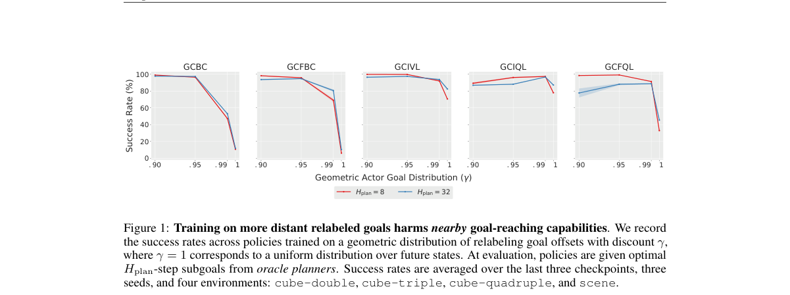

*Main result - Figure 2 Increasing training goal horizon globally decreases policy goal sensitivity. We measure the proportion of the input Jacobian norm corresponding to the goal at fixed state-goal offsets, plott*

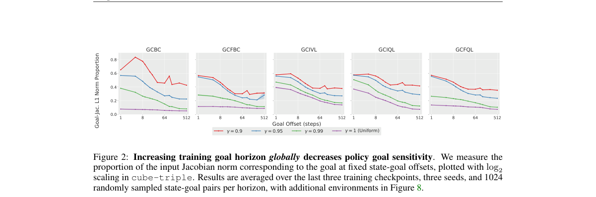

**Why this ranks #8**: 指出了一个独立于「偏差累积」的时程代价来源——更长的重标注让目标信息更模糊。

---

### 9. Which Rollout Taught It That? BehaviorTrace and the Limits of Training-Data Attribution in Online RL

**arXiv**: [2610.10422](https://arxiv.org/abs/2610.10422) | **Score**: 7.0 (relevance 7 x 0.7 + quality 7 x 0.3) | **Tags**: rlhf, rl-algorithm | **Categories**: cs.CL, cs.LG | **Pages**: 11

**Authors**: Amit Nautiyal

**Affiliation**: [not-found in PDF]

**Abstract**

> When reinforcement learning teaches a language model a new behavior, can we find the training rollouts that taught it? And when an attribution method says it can, how do we know the answer is real? We study both questions on online RL fine-tuning with GRPO, using a planted behavior with a known cause. We release BehaviorTrace, an open evaluation harness that combines full-gradient sketching, the planted-behavior setup, and controls for gradient magnitude, fluency, headroom, and variation across seeds and generation draws. Across three seeds on Qwen2.5-1.5B, much of the apparent attribution signal comes from confounds. A control that ranks training steps by gradient size alone, with no behavior target, reaches 4.2 to 4.5 times chance and matches or beats the best targeted estimator on two of three seeds. At saturated checkpoints, model fluency predicts the behavior label at least as well as every gradient method we compared it with. Once fluency is controlled, the per-rollout results change from seed to seed and from one generation draw to the next, so a single run cannot settle the question. One signal does hold on all three seeds. The gradient of the trigger tokens aligns with a target built where the behavior actually occurs. We turn these findings into a checklist for evaluating attribution in RL. We test existing estimators, including GAS (renormalized TracInCP) and a TRAK-style estimator, and do not propose a new one.

**Key findings**

- **Finding**: 作者同时提出两个问题：能否定位教会模型某行为的训练 rollout；以及当归因方法声称能时，如何验证该答案。

- **Finding**: 研究设置是在 GRPO 在线微调中植入一个成因已知的行为，从而有可核验的真值；BehaviorTrace 评测套件结合全梯度草图与概率方法。

- **Inference**: 用植入行为提供真值，是把归因研究从「无法验证」推向「可验证」的关键设计；没有真值的归因方法，其提升幅度无法被信任。

- **Recommendation**: 关注可解释 RL 的读者必读；这类「先造真值再评方法」的研究范式值得借用。

**Key figures**

*Framework / architecture - Figure 1 Step-level precision at |GT| (tie-aware). Left: overall; every targeted estimator and the target-free norm-only control sit well above chance but below the trained-versus-untrained ceiling,*

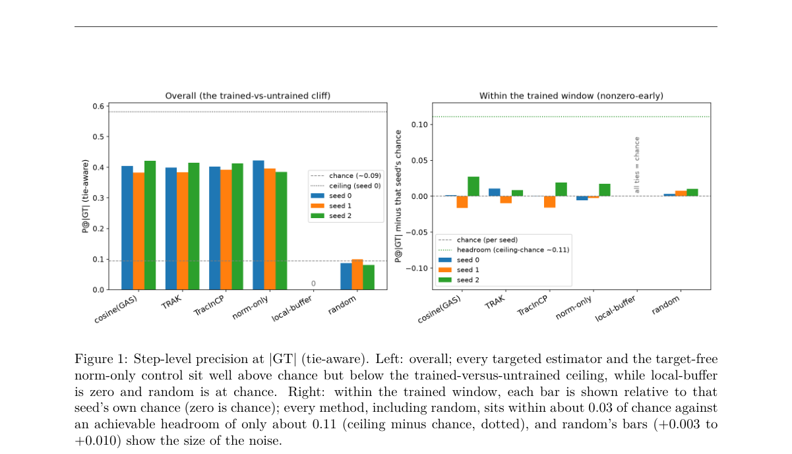

*Main result - Figure 2 Rollout-level fluency-residualized within-group AUC across three identical-settings seeds (minimal- pair target; run-notebook bootstrap intervals). GAS (direction) and norm-only (magnitude)*

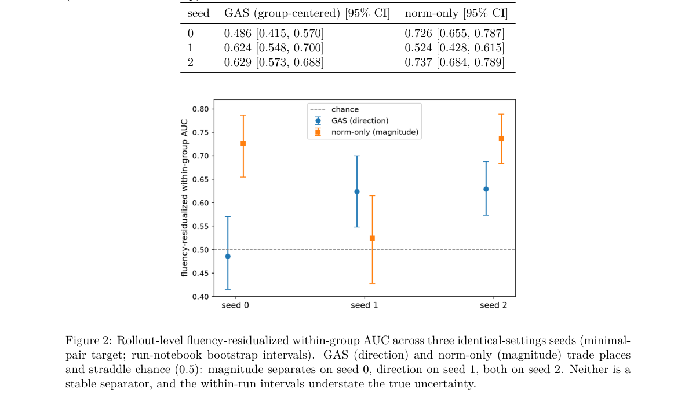

**Why this ranks #9**: 「如何知道归因答案是真的」这一自问，比方法本身更值得注意。

---

### 10. Average-Reward Reinforcement Learning for Multichain MDPs: A Hierarchical Decomposition Approach

**arXiv**: [2610.10326](https://arxiv.org/abs/2610.10326) | **Score**: 6.7 (relevance 7 x 0.7 + quality 6 x 0.3) | **Tags**: rl-algorithm | **Categories**: cs.LG, math.OC | **Pages**: 60

**Authors**: Huizhen Yu, Isaiah Heidt

**Affiliation**: University of Alberta, Canada

**Abstract**

> We study learning optimal policies in average-reward multichain Markov decision processes (MDPs), where the optimal gain may depend on the initial state and recurrence structures vary across policies, creating challenges for reinforcement learning (RL) methods. We propose an asynchronous value-iteration-based RL algorithm that requires no model knowledge beyond the MDP's transition graph and leverages Bather's decomposition to hierarchically partition the state space into communicating subsystems and transient states. This decomposition induces a recasting of the global decision problem into structured subproblems, which our algorithm exploits. We show that the algorithm converges to the optimal gain and produces gain-optimal policies after finite time. Building on this base algorithm, we develop two further algorithms: one approximately solves the multichain average optimality equations to obtain near gain-optimal policies, and another targets near bias-optimality by approximating the optimal bias function and solving an induced average-reward multichain MDP using the base algorithm. We provide almost-sure convergence guarantees for all three algorithms and empirically compare their tradeoffs, showing that the latter two also consistently improve transient performance relative to the base algorithm. To our knowledge, these are the first essentially model-free average-reward RL algorithms for general multichain MDPs without reductions to discounted problems.

**Key findings**

- **Finding**: 平均回报多链 MDP 的难点：最优增益可能依赖初始状态，且不同策略下递归结构不同。

- **Finding**: 作者提出异步值迭代基础的算法，除转移图外不需要模型知识。

- **Inference**: 「不需要模型知识」是相对多数平均回报 RL 方法的实际优势——在转移图已知但环境动力学未知的工业场景中，这决定了方法能否落地。

- **Recommendation**: 做持续任务/多链系统的读者参考；理论深度高于工程价值。

**Key figures**: 无可用图示（正文以表格与证明为主）。

**Why this ranks #10**: 理论工作，但设定（多链、初始状态依赖增益）是持续任务的标准抽象，实用面不窄。

---

## Footer

- Total papers reviewed across all 5 tracks: 50 (from 580 scanned)
- rl track final top-10: 10
- Wild-cards in this track: 1
- Figure assets: `res/` (shared across tracks)

Generated by `mine-arxiv-daily-digest` skill. Sister file: `2026-10-08_rl_entry.md`.
