# ArXiv Daily Digest - 2026-10-09 (AIGC 音频生成与编辑, 10 papers)

**Generated**: 2026-10-09 17:00 CST

**Source**: arXiv cs.CV, cs.SD, eess.AS, cs.CL, cs.AI, cs.RO, cs.LG submissions, window 2026-10-08 UTC (latest announced batch as of 2026-10-09 17:00 CST)

**Track**: aigc_audio (top 10 of 643 papers scanned, 50 full reads)

**Scope**: global timbre editing plus local instruction control for TTS, speech-rewarded style planning for conversational TTS, multi-stem audio-visual separation and generation, reference-free singing pitch correction, group dance generation, music evaluation with diagnostic evidence, augmented AMT with online-generated data, cochlear-implant emotion enhancement, prosody-to-text, discrete diffusion under data scarcity

---

本批音频线有两个层次清晰的工作。**Edit Who Speaks, Control How They Speak** 指出一个真实的产品缺口：语音克隆复现参考音色但不可编辑，文本化声音设计从描述生成但无法保留给定参考，两种接口都不能让你**修改一个给定参考的音色**并同时保持局部表达遵循指令；该文把控制拆成全局（音色）与局部（表达）两层。**Beyond Speech Captions** 则更尖锐：自然语言风格描述常被当作伪标签使用，把目标声学压缩进文本，而作者**实证**显示语音-文本对齐只能弱预测下游声学结果——即描述保真度不蕴含对特定合成器的有效控制。

这两篇合起来给出一条清晰结论：**用文本描述控制声学属性是一个被广泛使用但其有效性未被验证的假设**，而本批 RL 线的 Residual Advantage（用学生相对教师的指导替代结果标签）与它结构完全相同——两者都认为与目标的语义距离不能替代在目标系统上的实际效应。SepGen 的需求拆解也值得注意：4D 视听场景要求每个声源以独立波形可用以便定位与传播，因此「生成」与「分离」在 4D 场景下不是两个任务而是同一任务的两面。

其余是具体子任务：无参考歌唱音高修正（去掉参考后问题从「对齐」变成「判定」）、群体舞蹈生成的链式分解（把 O(n²) 联合注意力换成顺序建模）、音乐评估整合感知/诊断/跨模态证据（指出既有方法产出**被压缩的质量分数**掩盖信号级缺陷）、AMT 用在线生成数据增强并把「结构 vs 音色」两个因素分离、人工耳蜗情感增强改用检索替代平行数据录制、韵律到文本的反向任务、以及数据稀缺下的离散扩散（wild-card）。

---

## Top 10 - AIGC 音频生成与编辑

### 1. Edit Who Speaks, Control How They Speak: Global Timbre Editing and Local Instruction Control for TTS

**arXiv**: [2610.11437](https://arxiv.org/abs/2610.11437) | **Score**: 9.0 (relevance 9 x 0.7 + quality 9 x 0.3) | **Tags**: AIGC-audio | **Categories**: cs.SD, eess.AS | **Pages**: 34

**Authors**: Junchuan Zhao, Chenglin Xu, Wei Zeng, Haoyang Li, Yiwen Guo, Ye Wang

**Affiliation**: 1National University of Singapore | 3Nanyang Technological University

**Abstract**

> Instruction-based text-to-speech (TTS) offers control over voice characteristics and speech expression through interfaces including voice cloning and text-based voice design. Voice cloning reproduces a reference voice, whereas text-based voice design creates a voice from a natural-language description. However, neither interface directly enables users to modify the timbre of a given reference and synthesize speech with the modified voice. Meanwhile, utterance-level expressive instructions leave changes across individual text segments underspecified. We introduce \textbf{EDICT}, a framework that unifies global timbre editing and local expressive control by using an edited acoustic reference to anchor voice identity across segments. To enable synthesis with an instruction-edited voice, EDICT combines reference audio with structured timbre edits to generate an edited reference in codec-token space. This representation serves as a shared voice anchor for a frozen TTS backbone, allowing segment-specific natural-language instructions to guide expression. To accommodate instruction changes while supporting acoustic continuity, EDICT rebuilds the KV cache at each segment boundary, refreshing instruction conditioning while retaining bounded acoustic context from previously generated speech. Evaluations on our proposed TimbreEdit-Bench and IntraTTS-Bench demonstrate improved timbre editing and a favorable balance between local instruction adherence, speaker consistency, and transition quality. Audio demos are available.

**Key findings**

- **Finding**: 两种既有接口各有缺口：语音克隆复现参考音色但不可编辑，文本化声音设计从描述生成但无法保留给定参考。

- **Finding**: 作者提出同时支持**全局音色编辑**（修改参考的音色）与**局部指令控制**（在编辑后仍按指令控制表达）。

- **Inference**: 把控制拆成全局（音色）与局部（表达）两层，比单一提示接口更接近实际使用场景：用户想改音色但不改内容，或想改表达但保留音色——两者此前不可兼得。

- **Recommendation**: 被精读的三篇之一；与 10-08 日报的 Steerspeech、10-07 的 Loud and Clear 构成连续三天的 TTS 控制工作，值得对照控制旋钮的设计演进。

**Key figures**

*Framework / architecture - Figure 1 EDICT combines global voice editing with local delivery control. The trainable editor uses the source voice and global edit instruction to generate an edited codec reference. This reference*

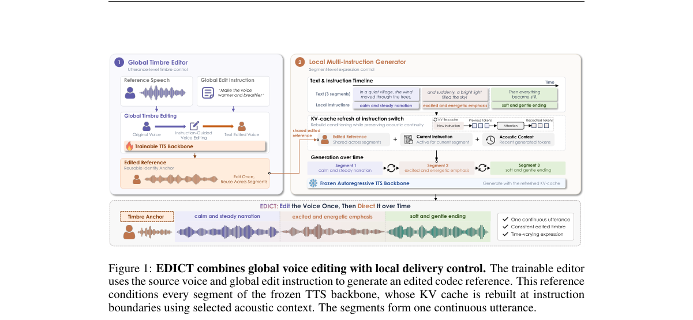

*Main result - Figure 2 Segment-boundary KV cache reconstruction. Each non-final <EOS> triggers a fresh prefill containing the next instruction and text, the shared edited reference, and acoustic inputs from the fi*

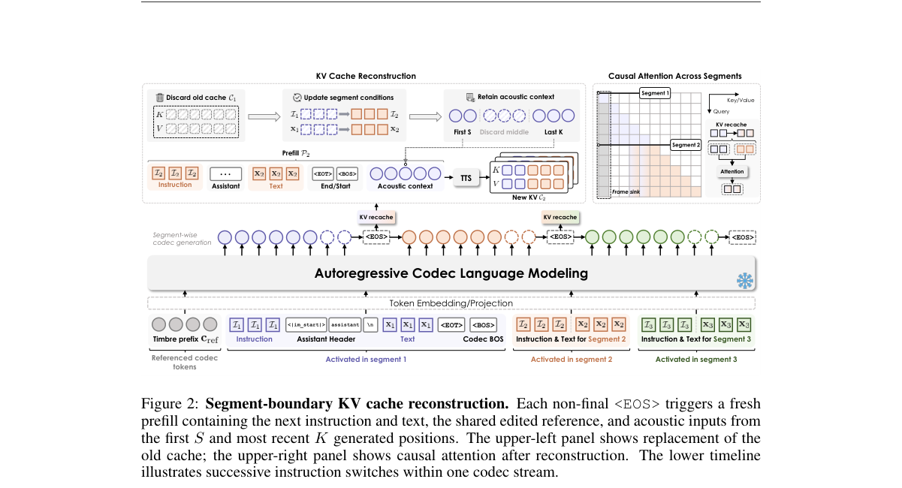

**Why this ranks #1**: 指出了一个真实的产品缺口：全局音色与局部表达控制此前无法同时满足。

---

### 2. Beyond Speech Captions: Speech-Rewarded Style Planning for Conversational Text-to-Speech

**arXiv**: [2610.11461](https://arxiv.org/abs/2610.11461) | **Score**: 8.7 (relevance 9 x 0.7 + quality 8 x 0.3) | **Tags**: AIGC-audio, rlhf | **Categories**: cs.CL, cs.SD, eess.AS | **Pages**: 5

**Authors**: Shiao Zhu, Lianbo Liu, Sizhen Lyu, Yuzhe Wang, Sheng Li, Takahiro Shinozaki

**Affiliation**: [not-found in PDF]

**Abstract**

> Natural-language style descriptions provide an interpretable interface between large language models (LLMs) and controllable text-to-speech (TTS). However, using descriptions as pseudo-labels compresses target acoustics into text, and descriptive fidelity need not imply effective control of a particular synthesizer. We empirically show that speech-text alignment only weakly predicts downstream acoustic similarity among candidate instructions for the same utterance. We therefore propose Speech-Rewarded Style Planning (SRSP), which trains a text-based style planner through a frozen downstream TTS model. Given dialogue history and response text, the planner generates candidate instructions and is optimized with group-relative policy optimization (GRPO), using the teacher-forced likelihood of target speech tokens as the reward. On an English subset of the ISCSLP 2026 CoT-TTS corpus, SRSP achieves higher speech-style and emotion similarity to target speech and lower mel-cepstral distortion than the Base LLM and target-audio-informed captioning baselines. LLM-based expressive speech evaluation further shows gains over all baselines in contextual appropriateness and reference consistency.

**Key findings**

- **Finding**: 把风格描述当伪标签使用会把目标声学压缩进文本；描述保真度并不蕴含对特定合成器的有效控制。

- **Finding**: 作者**实证**显示语音-文本对齐只能弱预测下游声学结果；因此改用语音奖励来做风格规划。

- **Inference**: 这与本批 RL 线的 Residual Advantage（用学生相对教师的优势替代结果标签）同构：两者都认为「与目标的语义距离」不能替代「在目标系统上的实际效应」，因此把奖励信号换到真正起作用的层面。

- **Recommendation**: 被精读的三篇之一；语音奖励的标注成本是这套做法能否规模化的关键约束。

**Key figures**

*Framework / architecture - Figure 1 Mean within-utterance Spearman correlations across both development partitions.*

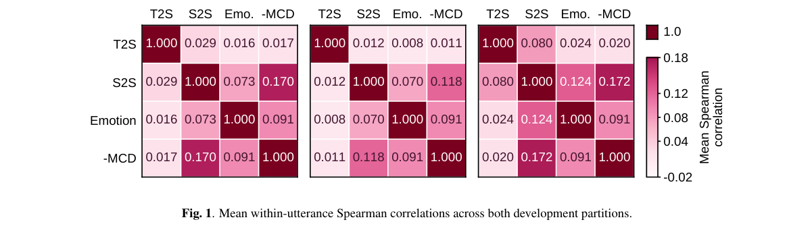

*Main result - Figure 2 Overview of SRSP. Frozen-TTS target-speech likelihood rewards candidate instructions during training, while GRPO updates the planner. Dashed arrows denote training-only paths; snowflakes denot*

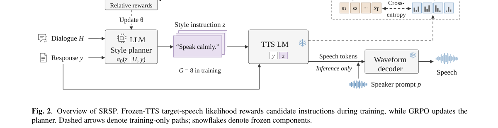

**Why this ranks #2**: 「对齐好 ≠ 能控制」是本批最尖锐的一条，对整个用文本描述控制 TTS 的范式都有影响。

---

### 3. SepGen: Multi-Stem Audio-Video Separation and Generation in a Single Model

**arXiv**: [2610.11361](https://arxiv.org/abs/2610.11361) | **Score**: 8.0 (relevance 8 x 0.7 + quality 8 x 0.3) | **Tags**: AIGC-audio, AIGC-video | **Categories**: cs.CV, cs.SD | **Pages**: 24

**Authors**: Aviad Dahan, Rajaei Khatib, Yonatan Bitton, Idan Szpektor, Lior Wolf, Raja Giryes

**Affiliation**: 1Tel Aviv University | (Xing et al., 2024). Proprietary systems such as Veo 3.1 Lite (Google DeepMind, 2026), which

**Abstract**

> A 4D audio-visual scene comprises a video, the dynamic geometry it depicts, and the sound sources that populate it, each with its own position and trajectory. Rendering such a scene from a novel viewpoint requires that every source be available as an individual waveform, so that it can be localized in the scene and propagated to the observer before the signals are mixed. Joint audio-video generators can synthesize the video and its soundtrack, but the soundtrack is emitted as a single audio-mix in which the sources are not individually accessible. We present SepGen, which extends a pretrained audio-video generator to emit the video, the mixed soundtrack, and one waveform per captioned source in one joint sampling run. SepGen supports two complementary modes: generation and separation. In generation mode, each source caption specifies what its stem contains. A two-speaker dialogue, for example, comes out as one stem per speaker in the original turn order. In separation mode, the input audio-mix remains clean while the captions specify what to extract, so the model can decompose a recording from a free-text description. We evaluate generation on scenes synthesized from text, and separation on scenes rendered by other generators and on real recordings of speech, music, and sound effects. Given an audio-mix and captions that carry the spoken lines, SepGen outperforms language-conditioned separators, most clearly on speech, and it keeps the lead when the lines are removed from the captions. Code, checkpoints, and datasets are available at https://sepgen.github.io/

**Key findings**

- **Finding**: 4D 视听场景的构成被明确列出：视频、动态几何、带位置与轨迹的声源。

- **Finding**: 从新视角渲染要求每个声源以**独立波形**形式可用——先定位、传播到观察者、再混合；联合视听生成器通常无法提供这一点。

- **Finding**: SepGen 在单一模型内完成多轨视听分离与生成。

- **Inference**: 该需求拆解说明「生成」与「分离」在 4D 场景下不是两个任务而是同一任务的两面：只有在场景坐标中可定位的声源才能正确传播到新观察者。

- **Recommendation**: 3D/4D 场景音频的读者注意；空间传播模型的选择决定了该框架在快速运动场景下的表现。

**Key figures**

*Framework / architecture - Figure 1 SepGen overview and motivation. (a) Joint audio-video generation emits one soundtrack with no addressable source: the video is lifted to 4D and rerendered from a new viewpoint, but both ears*

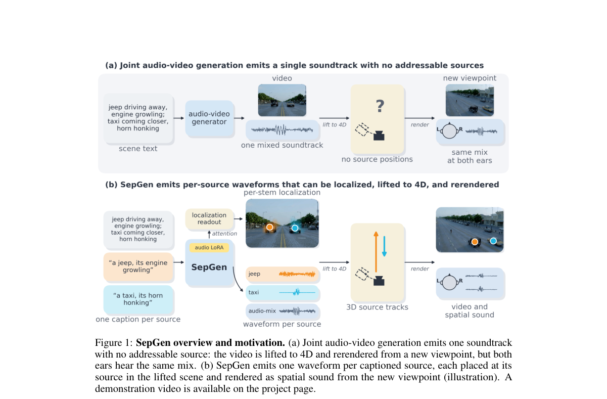

*Main result - Figure 2 SepGen: a unified representation for multi-stem generation and separation. (a) Gen- eration: scene text and two source captions yield the video, audio-mix, and per-source waveforms. (b) Sepa*

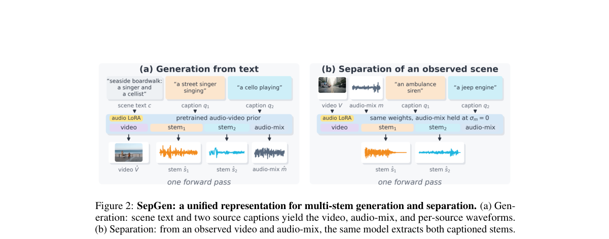

**Why this ranks #3**: 把「渲染 4D 视听场景」这个需求明确拆解，决定了模型必须同时具备分离与生成能力。

---

### 4. Reference-Free Singing Pitch Correction via Music-Constrained Sequence Editing

**arXiv**: [2610.11524](https://arxiv.org/abs/2610.11524) | **Score**: 7.3 (relevance 7 x 0.7 + quality 8 x 0.3) | **Tags**: AIGC-audio | **Categories**: cs.SD, eess.AS | **Pages**: 5

**Authors**: Biao Dong, Jiajun Li, Binzhen Zhu, Mingwei Yi, Tong Liu, Yuanhao Zhang, Jiqing Han, Yongjun He

**Affiliation**: 1Faculty of Computing, Harbin Institute of Technology, Harbin, China

**Abstract**

> Existing singing pitch correction approaches rely on target melodies or accompaniment tracks, which may be unavailable in practice. We formulate reference-free singing pitch correction as a music-constrained sequence editing task that determines whether and how each note should be corrected from the input performance alone. A pretrained symbolic music encoder with lightweight singing-domain adapters produces contextual representations of the singing MIDI. Based on these representations, two lightweight correction heads jointly model correction necessity and signed pitch modification through a factorized pitch-editing distribution. An input-dependent tonal prior derived from the estimated key distribution then reranks the candidate offsets, favoring tonally compatible corrections without target melodies or ground-truth key annotations. Experiments on real paired amateur and professional singing recordings show that the method improves note-level pitch accuracy from 73.25 to 83.43, outperforming a context-based baseline by 3.99 percentage points while balancing error correction and preservation of correctly performed notes.

**Key findings**

- **Finding**: 既有歌唱音高修正依赖目标旋律或伴奏轨，实践中常不可得。

- **Finding**: 作者把无参考音高修正形式化为**音乐约束的序列编辑**：仅从输入演唱判定每个音符是否/如何修正；用预训练符号音乐编码器加轻量歌唱域适配器。

- **Inference**: 去掉参考把「对齐」变成了「判定」——后者没有唯一的正确答案，因此该任务本质上更接近风格迁移而非信号对齐，这解释了为什么它需要一个显式的序列编辑框架。

- **Recommendation**: 与本批 10-07 的 ARIA（音频驱动歌词生成）同属「音频输入→符号/序列输出」的一族，都是音乐信息检索里被低估的方向。

**Key figures**

*Framework / architecture - Figure 1 Overview of the proposed reference-free singing pitch cor- rection framework.*

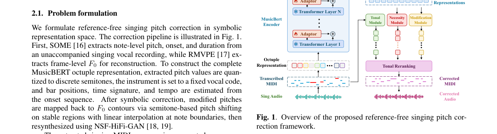

*Main result - Figure 2 Qualitative and validation analyses.*

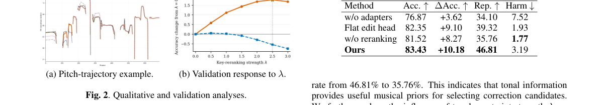

**Why this ranks #4**: 去掉参考依赖后问题性质改变——从「对齐到给定目标」变成「判定哪些音需要改」。

---

### 5. Breaking the Group Size Barrier: Parameter-Efficient Group Dance Generation with Chain-of-Dancers

**arXiv**: [2610.11237](https://arxiv.org/abs/2610.11237) | **Score**: 7.0 (relevance 7 x 0.7 + quality 7 x 0.3) | **Tags**: AIGC-audio | **Categories**: cs.CV, cs.SD | **Pages**: 26

**Authors**: Jing Xu, Cunjian Chen, Qiuhong Ke

**Affiliation**: Monash University, Australia

**Abstract**

> Group dance generation aims to synthesize coordinated multi-dancer choreography from music, with broad applications in animation and interactive content creation. This task requires modeling dense inter-person dependencies to ensure spatial coordination, while naturally preserving individual dancer identities. Existing approaches model all dancers jointly with end-to-end transformers, which tie the architecture to a fixed group size and entangle per-dancer identities across frames. We propose ChainDance, a scalable framework that reformulates group dance generation as a Chain-of-Dancers: a sequential decomposition over per-dancer conditional distributions, allowing a single model to scale across variable group sizes without retraining and naturally preserving per-dancer identity. Built on a frozen single-dancer diffusion backbone, ChainDance introduces two lightweight modules: a Role-Aware Text Encoder (RATE) for per-dancer semantic conditioning, and a Group-Aware Motion Encoder (GAME) that aggregates previously generated dancers via a distance-weighted graph convolutional network, and incorporates a training-free noise optimization procedure at inference time to enforce global spatial coherence. Experiments on AIOZ-GDance demonstrate that ChainDance achieves state-of-the-art motion quality and group coordination while structurally preserving per-dancer identity, with $3$-$4\times$ fewer parameters and requiring $3$-$6\times$ less training time compared to prior approaches.

**Key findings**

- **Finding**: 群体舞蹈生成需要密集人际依赖以保证空间协调，同时保留个体舞者身份。

- **Finding**: 既有方法用端到端 transformer 联合建模所有舞者，人数增长时参数量与计算激增；Chain-of-Dancers 改为参数高效的链式分解。

- **Inference**: 链式结构把 O(n²) 的联合注意力换成 O(n) 的顺序建模，代价是舞者之间的交互变成单向上下文——协调性如何保住是该方法的关键检验点。

- **Recommendation**: 与本批 RL 线 GRPODropout 同日出现，两篇都在论证「更少的结构反而更好」。

**Key figures**

*Framework / architecture - Figure 1 Key challenges in group dance generation. (a) Group-size rigidity: adapting to a new group size N requires retraining from scratch, but self-attention over the concatenated sequence scales a*

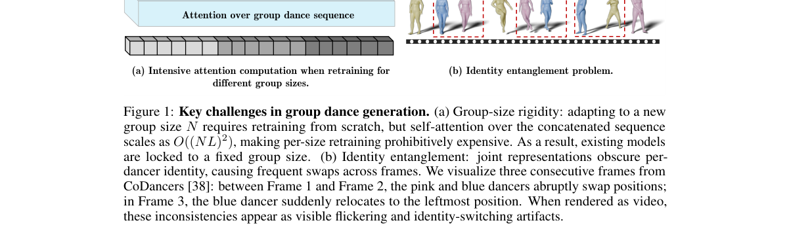

*Main result - Figure 2 Overall framework of ChainDance. The model builds on a frozen single dance diffusion backbone and introduces lightweight multimodal encoders for text, music, and other dancers. Through seque*

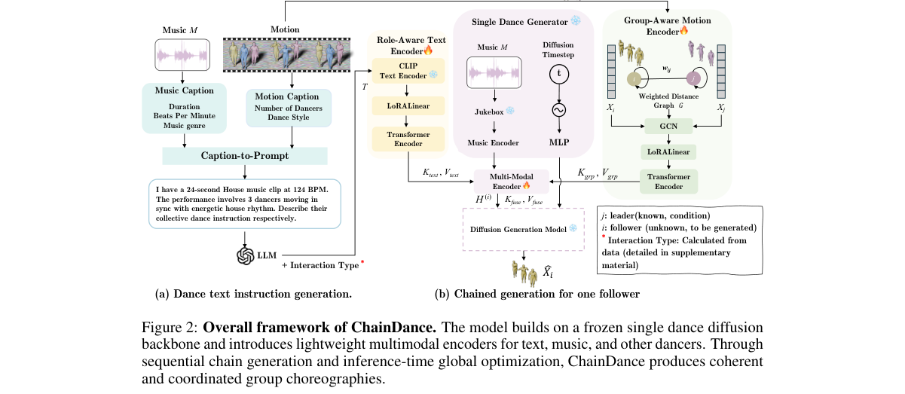

**Why this ranks #5**: 把群体生成从联合建模改为链式分解，直接对应本批 RL 线的 GRPODropout「少即是多」。

---

### 6. CloudEar: Integrating Perceptual, Diagnostic, and Cross-Modal Evidence for Music Evaluation

**arXiv**: [2610.11672](https://arxiv.org/abs/2610.11672) | **Score**: 7.0 (relevance 7 x 0.7 + quality 7 x 0.3) | **Tags**: AIGC-audio | **Categories**: eess.AS | **Pages**: 3

**Authors**: Qiqi He, Anqi Huang

**Affiliation**: [not-found in PDF]

**Abstract**

> Evaluating generated music requires modeling perceptual quality, technical audio quality, and prompt alignment. Existing methods often overlook signal-level defects, produce compressed quality scores, and miss fine-grained musical attributes in text prompts. We propose CloudEar, a pairwise framework for evaluating musicality and prompt alignment. It comprises three components: i) a Perceptual Expert for song-quality assessment; ii) a Diagnostic Expert for learned and signal-level quality analysis; and iii) a Cross-modal Expert for prompt-song alignment based on musical attributes. Experiments show that CloudEar outperforms the compared baselines in pairwise preference accuracy and score correlation.

**Key findings**

- **Finding**: 既有音乐评估方法的三类缺陷被明确列出：忽视信号级缺陷、产出被压缩的质量分数、遗漏文本提示中细粒度的音乐属性。

- **Finding**: CloudEar 以成对（pairwise）方式评估音乐性与提示对齐，整合感知专家、诊断与跨模态三类证据。

- **Inference**: 「压缩的质量分数」与本批 Selective Listening 指出的「聚合准确率掩盖成对漂移」是同一类问题：标量化本身就会把不同性质的失效平均掉。

- **Recommendation**: 与本批 audio_lm 的 Selective Listening 对读，两篇给出同一诊断在音乐与音频理解上的两个实例。

**Key figures**

*Framework / architecture - Figure 1 Overview of the proposed CloudEar framework.*

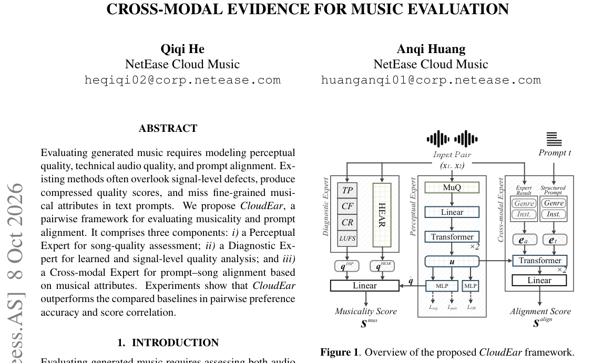

**Why this ranks #6**: 「压缩的质量分数」是一个具体的评测缺陷——它掩盖了信号级问题。

---

### 7. Randomized Scores and Diverse Timbres: Augmenting Automatic Music Transcription with Online-Generated Data

**arXiv**: [2610.11197](https://arxiv.org/abs/2610.11197) | **Score**: 7.0 (relevance 7 x 0.7 + quality 7 x 0.3) | **Tags**: AIGC-audio | **Categories**: eess.AS | **Pages**: 5

**Authors**: Haiwen Xia, Chao Zhang, Qiuqiang Kong

**Affiliation**: 1Peking University | 2Tsinghua University | 3The Chinese University of Hong Kong

**Abstract**

> Automatic music transcription (AMT) is limited by the scarcity of audio recordings paired with precise symbolic annotations. Synthetic data can provide supervision at scale, but it remains unclear whether effective transfer depends on realistic score structure or broad timbral coverage. We study these factors separately through an online sampler--renderer pipeline. A unified corruption sampler ranges from unmodified MIDI clips through partial corruption to deeply randomized note-event distributions. The renderer converts these events to audio while independently controlling instrument and timbral coverage. A fixed transcription model is trained jointly on offline recordings and newly rendered examples. Controlled ablations reveal an asymmetry between the two factors: moderate corruption of the note-event distribution does not impair transfer and can improve it, whereas broader renderer-side timbral support consistently improves out-of-domain generalization under a fixed note-event distribution. Finally, online-rendered examples complement real and existing synthetic data in a strong combined-data regime. These results suggest that synthetic AMT data should prioritize coverage of note-level attributes and their timbral realizations over realistic joint score structure.

**Key findings**

- **Finding**: AMT 的瓶颈是音频与精确符号标注配对数据的稀缺；合成数据可提供大规模监督。

- **Finding**: 作者用在线采样器-渲染器流水线**分别**研究：有效迁移依赖真实乐谱结构，还是依赖广泛音色覆盖。

- **Inference**: 把「合成数据有用」归因到具体因素很重要——若主要是结构而非音色，那么改进渲染器音色的收益有限，应转向提高符号结构的真实性。

- **Recommendation**: 合成数据用于结构化预测任务的读者注意；两个因素各自的消融增益是全文最有价值的数字。

**Key figures**

*Framework / architecture - Figure 1 Online data generation with independent controls over score structure and timbre, combined with offline data for joint training.*

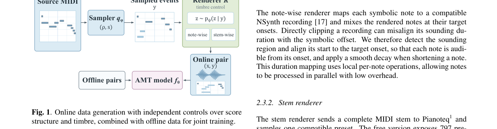

*Main result - Figure 2 Transcription architecture with shared decoder weights across channels.*

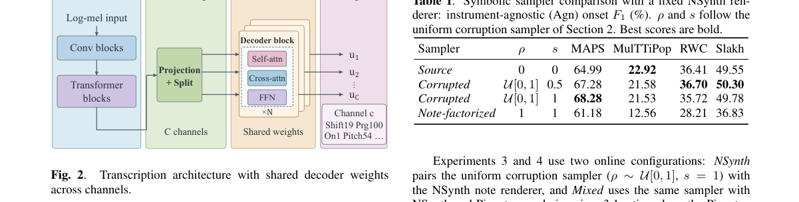

**Why this ranks #7**: 把「合成数据为什么有用」拆成两个可分离因素，是一个干净的消融设计。

---

### 8. SEER: Source-Conditioned Emotion Enhancement via Retrieval for Cochlear-Implant Speech

**arXiv**: [2610.11131](https://arxiv.org/abs/2610.11131) | **Score**: 6.3 (relevance 6 x 0.7 + quality 7 x 0.3) | **Tags**: AIGC-audio | **Categories**: cs.SD, eess.SP | **Pages**: 5

**Authors**: Hsing-Hang Chou, Yun-Shao Lin, Ching-Chin Sung, Chi-Chun Lee

**Affiliation**: 1Department of Electrical Engineering, National Tsing Hua University, Taiwan

**Abstract**

> Cochlear implants (CIs) restore speech access but weaken cues needed for vocal emotion recognition. Prior CI-oriented enhancement requires parallel normal/strong recordings and intensity labels. We propose SEER, a retrieval-based framework that learns which same-emotion reference helps each source remain recognizable after CI processing. A source-conditioned retriever learns CI-aware utility from sampled emotional voice conversion outcomes, while uncertainty-guided exploration avoids exhaustive pair evaluation; neither parallel recordings nor intensity labels are required. SEER improves Source macro-F1 at N8 by 7.30 points on RAVDESS and 11.66 points on ESD, with significant ESD gains across N4/N8/N16. Sixteen-listener RAVDESS gains are significant across all conditions. Exhaustive analysis finds an aggregate benefit from stronger references but little effect from matching gender or content.

**Key findings**

- **Finding**: 既有 CI 导向增强方法需要**平行**的正常/强录音与强度标注，数据获取代价高。

- **Finding**: SEER 用检索式框架学习哪个同情感参考能让每个源在 CI 处理后仍可辨识；源条件检索器从数据中学 CI 感知效用。

- **Inference**: 「哪个参考对哪个源有用」本质上是效用匹配问题而非增强问题——这解释了为什么检索式框架能绕开平行数据要求。

- **Recommendation**: 语音增强的读者可参考；检索库的情感覆盖度决定其上限。

**Key figures**

*Framework / architecture - Figure 1 SEER framework: (a) retrieves a reference to improve post-CI emotion recognizability; (b) estimates source–reference utility; (c) derives its CI-aware target; and (d) uses acquisition scores t*

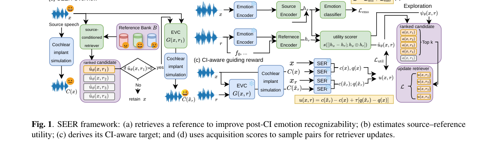

*Main result - Figure 2 N8 subjective confusion matrices (%), where rows/columns denote intended/perceived emotion and A/H/S/N denote Angry/Happy/Sad/Neutral.*

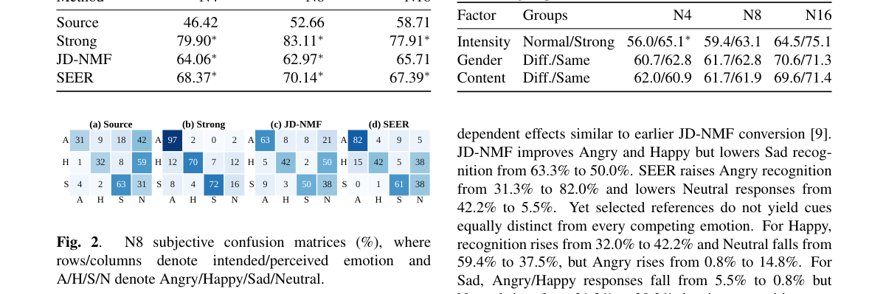

**Why this ranks #8**: 用检索替代平行数据录制，把标注成本从数据采集侧移到了已有库侧。

---

### 9. Prosody-to-Text: Predicting text from low-pass filtered speech

**arXiv**: [2610.11544](https://arxiv.org/abs/2610.11544) | **Score**: 6.3 (relevance 6 x 0.7 + quality 7 x 0.3) | **Tags**: AIGC-audio | **Categories**: cs.CL | **Pages**: 5

**Authors**: David Porteš, Aleš Horák

**Affiliation**: Faculty of Informatics, Masaryk University

**Abstract**

> While predicting prosody from text is an established task in the field, the opposite direction, predicting text that fits a given prosodic pattern, remains largely overlooked. We find this unfortunate, because this opposite direction could lead to some very interesting use cases. Therefore, in this paper, we make the first steps in the prosody-to-text direction by inves- tigating how much of the original sentence can be recovered from its prosodic pattern. To this end, we fine-tune the Whis- per model using only the 12 lowest Mel bins (low-pass filter with approximately 450Hz cutoff), and obtain surprisingly accurate results (WER 36%), with 10% of utterances be- ing recovered perfectly, and 40% of utterances having Word Error Rate at or below 25%. We also find that, given the correct prefix, the next token was predicted correctly in 79% of cases. Our results suggest that the relationship between low-frequency speech features and lexical content is much stronger than previously thought, and we believe that direct- ing more attention to this topic might open the door to new applications, such as using prosody to guide text generation of modern LLMs

**Key findings**

- **Finding**: text→prosody 是成熟任务，而 prosody→text 方向基本被忽视。

- **Finding**: 作者在该方向迈出初步步伐，研究低通滤波语音中还能恢复多少文本信息。

- **Inference**: 把韵律当目标而非条件，会改变可控语音生成的接口设计：用户约束韵律、系统生成文本，这比先写文本再调韵律参数更贴近即兴表达场景。

- **Recommendation**: 本批相关度较低的一篇；但反向可控接口这个想法值得在对话式 TTS 上试。

**Key figures**

*Framework / architecture - Figure 1 The global oracle WER@k curves.*

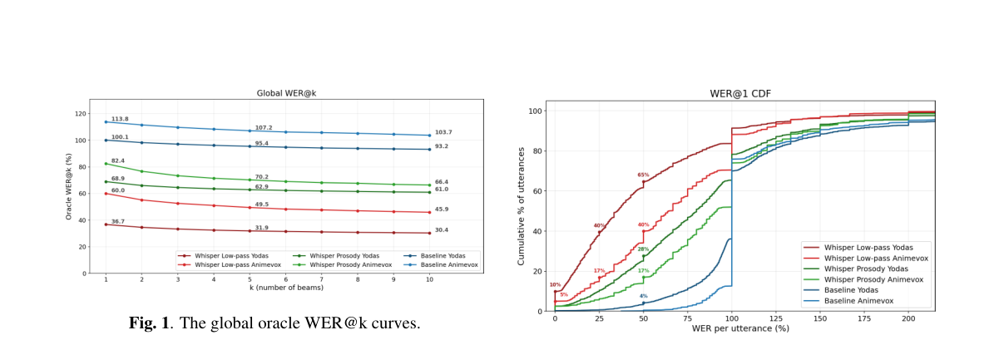

*Main result - Figure 2 Cumulative distribution over WER.*

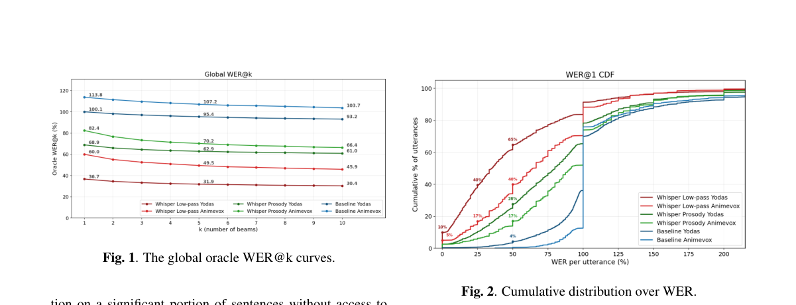

**Why this ranks #9**: 一个被忽视的反向任务，价值在于它把韵律从条件变成了目标。

---

### 10. Ambient Discrete Diffusion: Using the Wrong Data at the Right Time for Data Efficient Learning

**arXiv**: [2610.12340](https://arxiv.org/abs/2610.12340) | **Score**: 6.0 (relevance 6 x 0.7 + quality 6 x 0.3) | **Tags**: AIGC-audio `[wild-card]` | **Categories**: cs.LG | **Pages**: 29

**Authors**: Julian Kleutgens, Mauricio Tec, Claudio Battiloro, Francesca Dominici, Giannis Daras

**Affiliation**: 1 ETH Zürich, 2 Harvard University, 3 MIT

**Abstract**

> We introduce RefineMix, a framework for training discrete diffusion models under severe data scarcity, a common constraint in scientific applications. RefineMix uses out-of-distribution data at selected diffusion times to improve generalization without biasing the sampling distribution. Although this strategy has been explored in continuous diffusion, discrete diffusion presents a distinct challenge: unlike Gaussian noise, masking preserves domain information in surviving tokens, limiting the use of related data at high noise levels. At low noise levels, however, the domains effectively disjoint supports become an advantage, allowing the model to learn from both in-domain and out-of-distribution data without biasing the sampler. We formalize these intuitions and provide a theoretical analysis for the proposed method. Experimentally, across five domain-shift settings, RefineMix matches or outperforms in-domain finetuning and data mixing. For protein sequence generation, finetuning with just 197 in-domain examples nearly doubles the fraction of generated proteins that are simultaneously novel, foldable, and in-family compared to standard finetuning.

**Key findings**

- **Finding**: 离散扩散在数据稀缺下（科学应用常见）需要防止过拟合；连续扩散中已有做法是在选定扩散时间步使用分布外数据。

- **Finding**: 离散扩散面临不同挑战；RefineMix 提出在选定扩散时间步使用 OOD 数据改善泛化，同时不使采样分布偏置。

- **Inference**: 「不使采样分布偏置」是这个方法的核心约束——用 OOD 数据改善泛化的诱惑正是在采样分布上动手脚，作者显式避开了这一点。

- **Recommendation**: wild-card 项，与音频生成关系较弱；低资源条件下的扩散训练对科学数据生成有参考价值。

**Key figures**

*Framework / architecture - Figure 1 Noise-selective mixing. (a) Noising widens the target (green) and source (orange) distri- butions until both reach the prior π at t = 1. They overlap (purple) only at high noise, so RefineMi*

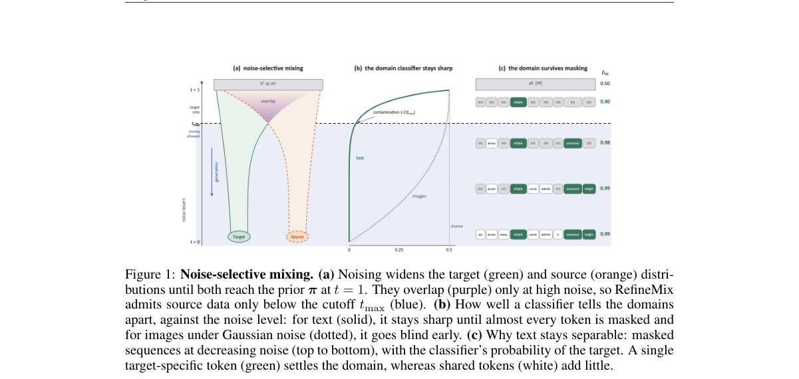

*Main result - Figure 2 Testing the theory (masked kernel, three seeds). (a) CS →Math. A fully mixed model completes a noised sequence with n revealed tokens from CS, Math, or both. (b) cc_news →Hep- Ex, from the s*

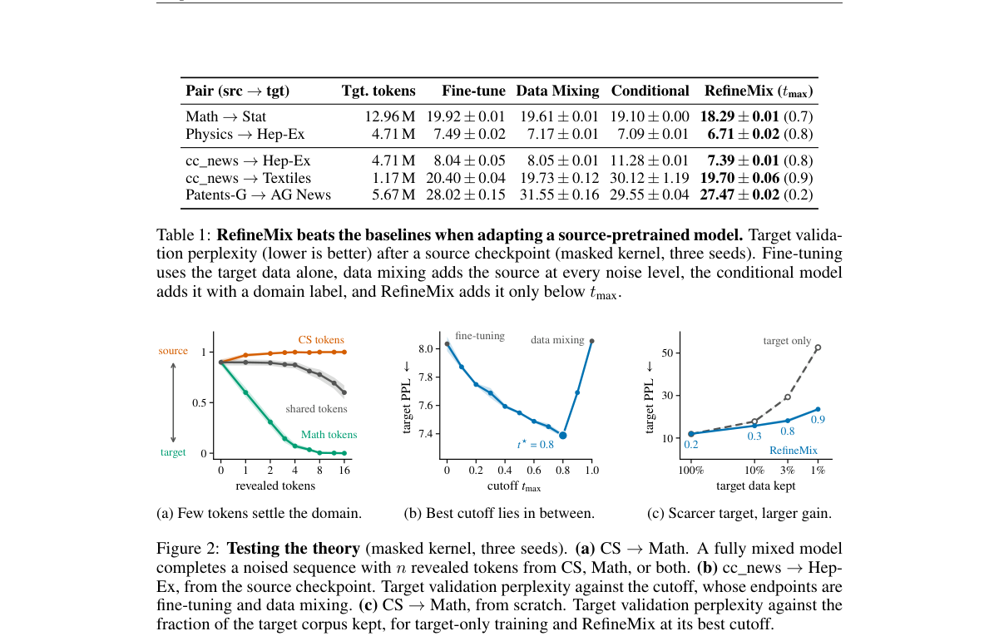

**Why this ranks #10**: wild-card：把「数据少」问题转成「什么时候用哪些数据」的时间调度问题。

---

## Footer

- Total papers reviewed across all 5 tracks: 50 (from 643 scanned)
- aigc_audio track final top-10: 10
- Wild-cards in this track: 3
- Figure assets: `res/` (shared across tracks)

Generated by `mine-arxiv-daily-digest` skill. Sister file: `2026-10-09_aigc_audio_entry.md`.
