# ArXiv Daily Digest - 2026-10-09 (AIGC 图像 / 视频 / 3D 生成与编辑, 10 papers)

**Generated**: 2026-10-09 17:00 CST

**Source**: arXiv cs.CV, cs.SD, eess.AS, cs.CL, cs.AI, cs.RO, cs.LG submissions, window 2026-10-08 UTC (latest announced batch as of 2026-10-09 17:00 CST)

**Track**: aigc_visual (top 10 of 643 papers scanned, 50 full reads)

**Scope**: causal video diffusion without a bidirectional teacher, decoupled 4D rewards for world consistency, mid-horizon memory forcing for streaming, reward-verified self-distillation for editing, few-step trajectory distillation, lifting-free exocentric-to-egocentric generation, texture-space 3DGS inpainting, sparse attention acceleration, 3DGS watermarking, image-editor-to-video-editor adaptation

---

本批最强的论文是**Conditional Residual Prediction**——它质疑的是这个领域的一个默认路径而非某个具体模型。因果视频扩散模型适合流式、交互与长视频生成，但标准训练下质量常低于**同规模**双向模型；既有做法多是初始化自或蒸馏一个预训练双向教师，作者改为直接训练因果模型。「同规模因果不如双向」常被归因于因果结构本身的信息损失，若条件残差能在不引入教师的情况下补上这个差距，说明差距来自训练信号而非架构上限——这会改变大量视频生成工作的基线设定。第二篇 WorldAlign 呼应 10-08 的连续批判：4D 世界一致性被拆成静态（跨视角 3D 结构连贯）与动态（主体运动合理、外观随时间一致）两条**独立奖励轴**，理由是两个轴的失败模式不同，单一分数会把它们平均掉。**Memory Forcing** 命名了一个此前未被显式处理的失效：中程遗忘——现有少步流式系统只在固定大小 KV 缓存里保留开头与最近帧，事件一旦滑出窗口后续帧就无法再关注它；这与 10-05 日报的 ID-Forcing（KV-provenance）同源但属不同故障（后者是缓存条目自身 OOD，前者是缓存容量策略导致信息不可达）。**Rubric-CEPR** 则给出奖励设计层面最具体的一条批判：外部奖励模型**可能奖励看似合理的失败**——一个逼真的输出可能根本没完成所请求的修改，或改动了本应保持不变的内容。其余六篇是效率与几何：少步蒸馏被表述为「容量分配」问题（Parametric Trajectory Distillation）、免训练稀疏注意力引入时间步自适应稀疏度（iCATS）、纹理空间补全消除跨视角不一致（3DTexMOR）、无提升路径绕过显式重建（LEGO）、训练无关的 3DGS 水印（FlyMark），以及一条极简路线：把强图像编辑器改造成视频编辑器（wild-card）。

---

## Top 10 - AIGC 图像 / 视频 / 3D 生成与编辑

### 1. Conditional Residual Prediction: Improving Autoregressive Video Diffusion without a Bidirectional Teacher

**arXiv**: [2610.11479](https://arxiv.org/abs/2610.11479) | **Score**: 9.0 (relevance 9 x 0.7 + quality 9 x 0.3) | **Tags**: AIGC-video | **Categories**: cs.AI, cs.CV, cs.LG | **Pages**: 26

**Authors**: Bowen Zheng, Zhiguang Liu, Jiarong Ou, Rui Chen, Tianyang Hu

**Affiliation**: 1The Chinese University of Hong Kong, Shenzhen, 2Tencent Hunyuan

**Abstract**

> Causal video diffusion models generate video autoregressively, which suits streaming, interactive, and long-video generation. Under standard training, however, they often yield lower generation quality than bidirectional models of the same size. Many existing approaches address this gap by initializing from or distilling a pretrained bidirectional teacher. We instead train a causal model from an image-model initialization, with no bidirectional video model at any stage. Because this path requires neither a large bidirectional teacher nor a complex distillation pipeline, it is simpler and more scalable. On this path, we find that a causal model trained on ground-truth history becomes strongly dependent on it, so that at inference errors in its own generated history propagate forward. We hypothesize that much of this dependence is unnecessary, because the current input already determines much of what the history provides. We propose Conditional Residual Prediction (CRP), a simple recipe for reducing a model's reliance on a condition: the model first predicts the target without the condition, and the condition may only add a residual on top of this prediction. Applied to history, CRP makes the model predict each chunk from the present as far as it can and use the past only for what the present cannot supply. In controlled experiments, CRP nearly closes the 6.14-point gap to a bidirectional model trained under the same setup. Scaling this recipe, we train Optica, a 2B-parameter causal video model that autoregressively generates 5-second 480p videos and reaches 82.78 on VBench with only about 15M training videos.

**Key findings**

- **Finding**: 因果视频扩散以自回归方式生成，适合流式、交互与长视频；但标准训练下质量常低于**同规模**的双向模型。

- **Finding**: 既有做法是初始化自或蒸馏一个预训练双向教师；作者改为直接训练因果模型，以条件残差预测替代双向教师本应提供的监督。

- **Inference**: 「同规模因果模型不如双向模型」常被归因于因果结构本身的信息损失，若条件残差能在不引入教师的情况下补上这个差距，说明差距来自训练信号而非架构上限——这会改变大量视频生成工作的基线设定。

- **Recommendation**: 被精读的三篇之一；与本批 iCATS、Parametric Trajectory Distillation（都假设有一个强双向/多步教师可参照）对照读，可判断这个默认路径的必要性。

**Key figures**

*Framework / architecture - Figure 1 Overview. (a) Conditional Residual Prediction (CRP) applied to history. The same network*

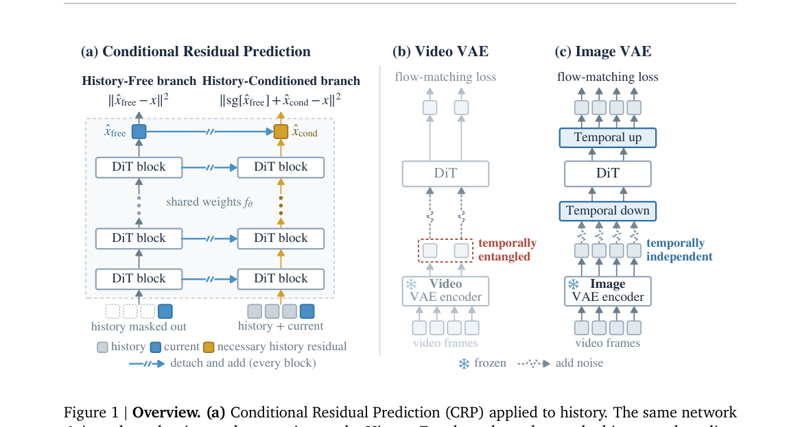

*Main result - Figure 2 Per-frame image quality degradation and comparison. Per-frame no-reference quality is measured with Q-ReAlign Mini [57]. (a) Teacher-forced (TF) generation remains approximately stable, whe*

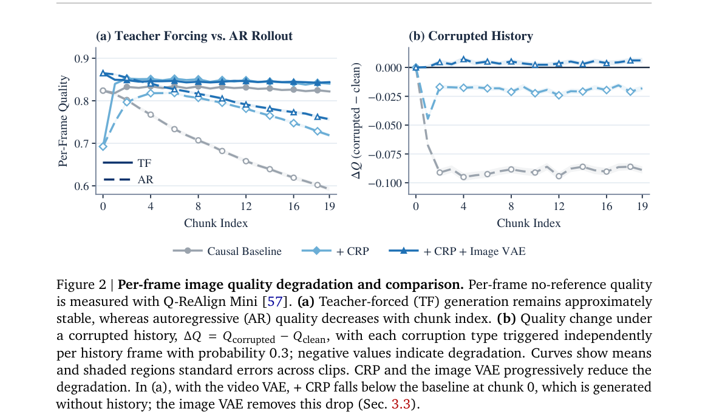

**Why this ranks #1**: 本批最强的论文：直接质疑「必须有一个双向教师」这个领域默认路径。

---

### 2. WorldAlign: Decoupled 4D Reward for World-Consistent Video Generation

**arXiv**: [2610.12382](https://arxiv.org/abs/2610.12382) | **Score**: 8.7 (relevance 9 x 0.7 + quality 8 x 0.3) | **Tags**: AIGC-video | **Categories**: cs.CV | **Pages**: 15

**Authors**: Jing He, Kaixin Ding, Xingye Tian, Guibao Shen, Wenhang Ge, Xin Tao, Pengfei Wan, Ying-Cong Chen

**Affiliation**: 1The Hong Kong University of Science and Technology (Guangzhou) | 2The Hong Kong University of Science and Technology | 4The University of Hong Kong

**Abstract**

> Faithful visual world simulation requires generated videos to maintain 4D world consistency, encompassing both static and dynamic consistency. Static consistency requires coherent 3D structure in static environments across viewpoints, while dynamic consistency requires plausible subject motion and consistent appearance over time. Geometry-aware post-training offers a promising way to improve world consistency. However, existing methods often rely on a static-scene assumption. Even those that accommodate dynamic scenes struggle to provide reliable static-consistency feedback, while dynamic consistency is often overlooked or inadequately assessed. To address these limitations, we introduce WorldAlign, a decoupled 4D reward framework that semantically separates static regions and dynamic subjects and provides feedback by aligning each with a world prior suited to its assumptions. For static regions, WorldAlign aligns static geometry with a geometric world prior through semantically guided masked reprojection, enabling more reliable static-consistency evaluation; an auxiliary camera-motion reward discourages nearly static solutions. For dynamic subjects, WorldAlign uses a strong vision-language model (VLM) as a dynamic world prior and constructs a VLM-as-a-judge reward based on sample-specific checklists that assess dynamicity, physical plausibility, shape, and texture consistency. This decoupled design enables more effective online post-training without requiring human preference annotations. Across two pretrained image-to-video generators, Wan2.1 and Wan2.2, WorldAlign jointly improves static and dynamic consistency over existing methods without suppressing overall or subject motion. These results support decoupled world-prior alignment for more faithful visual world simulation. Project page: https://worldalign.github.io/.

**Key findings**

- **Finding**: 4D 世界一致性被明确拆为两部分：静态一致性（静态环境跨视角的连贯 3D 结构）与动态一致性（主体运动合理、外观随时间一致）。

- **Finding**: 作者以几何感知的后训练为路径，用**解耦的** 4D 奖励分别约束两个轴（WorldAlign）。

- **Inference**: 解耦的必要性在于两个轴的失败模式不同：静态不一致通常可由几何线索检查，动态不一致则涉及物理与身份保持；单一分数会把两者平均掉。

- **Recommendation**: 与本批 aigc_visual 的 Lego/3DTexMOR 同读，三篇分别从生成、视角变换与 3D 修补处理同一类几何一致性问题。

**Key figures**

*Framework / architecture - Figure 1 Comparison between WorldAlign and the base model (Wan2.1-I2V-14B-480P). The first case highlights improvements in static consistency: the base model loses the cabinetry (orange ar- rows), wh*

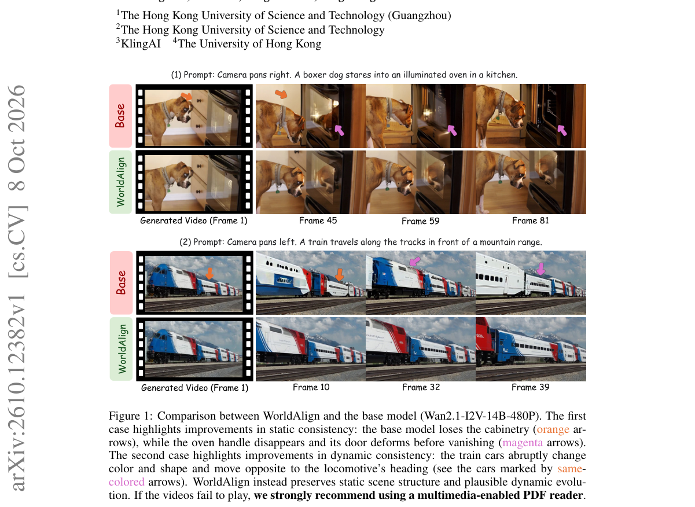

*Main result - Figure 2 Overview of the proposed WorldAlign. Given generated videos, WorldAlign semantically segments and tracks dynamic subjects to decouple each video into static and dynamic regions. Static regio*

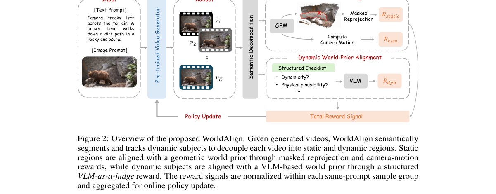

**Why this ranks #2**: 把 4D 一致性拆成静态与动态两条独立的奖励轴，比单一一致性分数更可操作。

---

### 3. Memory Forcing: Attendable Mid-Horizon History for Streaming Video Generation

**arXiv**: [2610.11756](https://arxiv.org/abs/2610.11756) | **Score**: 8.3 (relevance 8 x 0.7 + quality 9 x 0.3) | **Tags**: AIGC-video | **Categories**: cs.CV | **Pages**: 13

**Authors**: Jiaming Zhang, Xinyu Wang, Huafeng Shi, Gangshan Wu, Limin Wang

**Affiliation**: 1State Key Laboratory for Novel Software Technology, Nanjing University | 2Tsinghua University | 3Kling Team, Kuaishou Technology | 4Shanghai Artificial Intelligence Laboratory

**Abstract**

> Autoregressive video diffusion enables causal video streaming without a bidirectional pass over the full clip, but existing few-step systems usually retain only the opening and most recent frames in a fixed-size KV cache. Once an event leaves this window, later frames can no longer attend to it, a failure we term mid-horizon forgetting. We present Memory Forcing, a few-step streaming method that preserves this missing history without increasing the cache size. Its Archive \& Working Banks partition the cache into sink, archive, and working regions, retaining diverse intermediate events alongside recent motion under fixed memory. Because absolute temporal indices drift outside the training range, Bank-aware RoPE reassigns indices at attention time so each bank remains distinguishable. At 1.3B, Memory Forcing leads on longer clips, shows the smallest drop from 5s to 60s among methods reporting all four lengths, and preserves subjects and scenes through leave-and-return. The same design scales to Wan2.2 5B, producing more physically plausible, realistic, and dynamic videos and, to our knowledge, the first public 5B model on this forcing line.

**Key findings**

- **Finding**: 现有少步流式系统通常只在固定大小 KV 缓存中保留开头帧与最近帧。

- **Finding**: 事件一旦离开该窗口，后续帧便无法再关注它；作者称此为**中程遗忘**，并提出 Memory Forcing——让模型能关注窗口中段的历史。

- **Inference**: 这与 10-05 日报的 ID-Forcing（长视频 KV-provenance 问题）同源：那里的问题是缓存条目自身 OOD，这里的问题是缓存**容量策略**导致信息不可达——是两种不同的长视频记忆故障。

- **Recommendation**: 长视频流式生成的读者注意；与 10-05 的 ID-Forcing 连续两天对照，可看出该子问题的分化。

**Key figures**

*Framework / architecture - Figure 1 Qualitative samples from Memory Forcing. Each row is one generated clip, frames in time order. Subjects, motion, and scene layout stay consistent across the clip.*

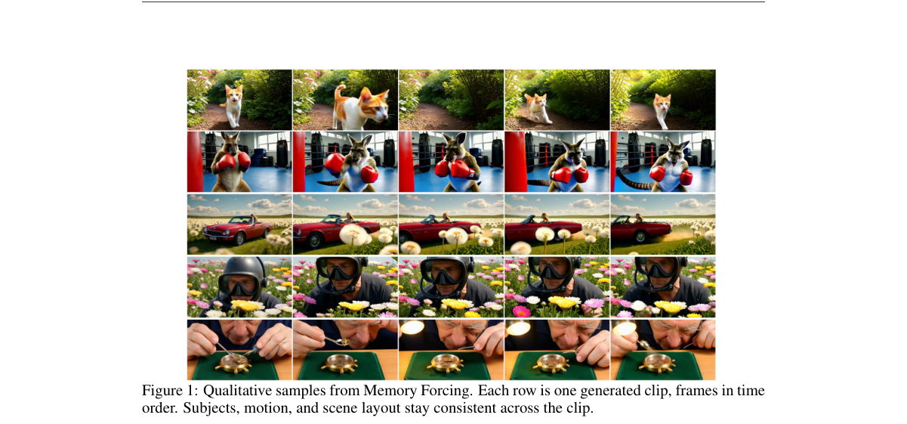

**Why this ranks #3**: 「中程遗忘」是一个命名准确、此前未被显式处理的流式生成失效模式。

---

### 4. Rubric-CEPR: Self-Evolving Image Editing via Reward-Verified Self-Distillation

**arXiv**: [2610.12469](https://arxiv.org/abs/2610.12469) | **Score**: 8.0 (relevance 8 x 0.7 + quality 8 x 0.3) | **Tags**: AIGC-edit, AIGC-image | **Categories**: cs.CV | **Pages**: 21

**Authors**: Ritesh Thawkar, Shubham Patle, Shravan Venkatraman, Rao Muhammad Anwer

**Affiliation**: 1Mohamed bin Zayed University of Artificial Intelligence | 2Aalto University

**Abstract**

> Instruction-guided image editors have become highly capable, yet improving them further still depends on human-edited training pairs or external reward models. Such supervision is costly to obtain and can reward plausible failures: a realistic output may leave the requested change undone or alter content that should be preserved. In this work, we strive to improve a pretrained image editor using only its own generations, without human-edited targets or an external training-time reward model. To this end, we propose a self-evolving framework, named Rubric-CEPR, that verifies the editor's own samples with its internal representations through a rubric-augmented Contrastive Edit-Preservation Reward (CEPR). A Planner proposes structured edit instructions from unlabeled images, the Editor samples multiple candidate edits, and a frozen Critic scores each candidate with decomposed rubric checks for edit realization, removal of the old state, and content preservation, using features already exposed by the editor. Non-compensatory gates reject infeasible candidates, and the best verified candidate is distilled into the editor through lightweight adapter training. On Qwen-Image-Edit, Rubric-CEPR improves ImgEdit from 4.36 to 4.60 (+5.5%), with a +24.9% gain on object isolation, and transfers to GEdit-Bench and Complex-Edit. The same procedure also improves Step1X-Edit by +7.8% on ImgEdit. We hope our approach will serve as a solid baseline for image editors that improve themselves from their own verified samples. Our code is publicly available at $\href{https://riteshthawkar.github.io/Rubric-CEPR/}{\text{this URL}}$

**Key findings**

- **Finding**: 人工编辑对与外部奖励模型是改进图像编辑器的两条监督来源，但两者成本高，且**可能奖励看似合理的失败**：逼真输出可能未完成所请求的修改，或改动了应保持不变的内容。

- **Finding**: Rubric-CEPR 用奖励验证的自我蒸馏改进预训练编辑器（rubric 化的过程奖励）。

- **Inference**: 「看似合理的失败」是一个评测层与训练层同时存在的盲区：保真度指标高恰恰掩盖了语义未执行。这也解释了为什么 10-08 日报的 Visual Jev Rewards 需要显式验证「主体参与了交互」而非只验证主体在场。

- **Recommendation**: 与 10-08 的 Visual Jev Rewards 组成一条奖励设计线索：一篇给奖励构造，一篇给奖励验证。

**Key figures**

*Framework / architecture - Figure 1 Illustration of our self-evolving image editing framework (Rubric-CEPR). Our Rubric-CEPR improves a pretrained image editor without human-edited targets or an external reward model. Given on*

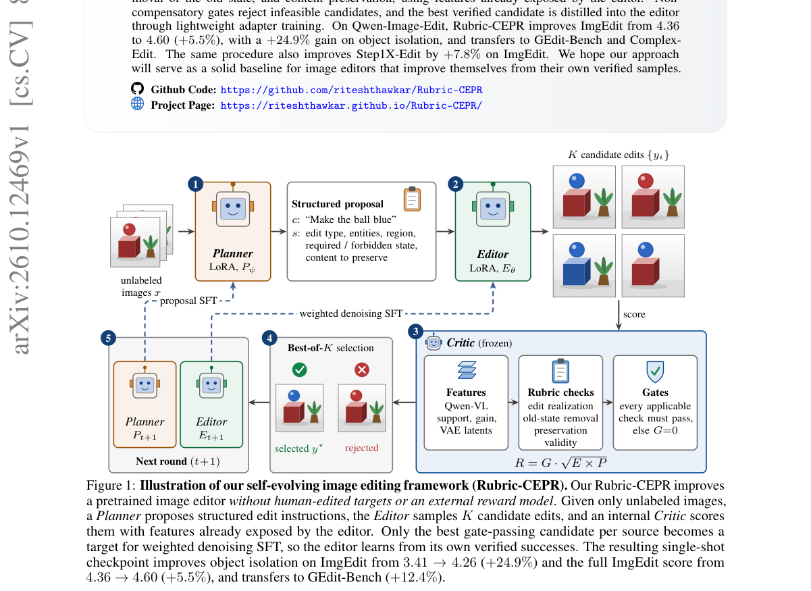

*Main result - Figure 2 Overview of the Rubric-CEPR propose–edit–verify–distill loop. The frozen Qwen-Image-Edit backbone provides the Qwen2.5-VL understanding branch, the MMDiT generative backbone, and the VAE. Gi*

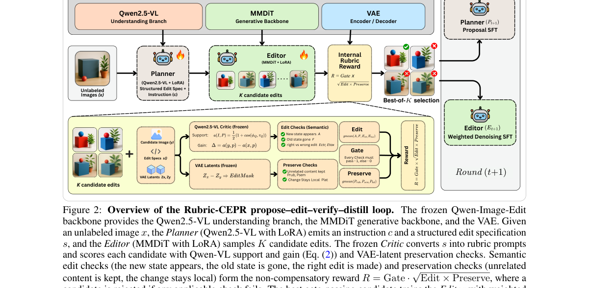

**Why this ranks #4**: 「奖励模型会奖励看似合理的失败」是本批奖励设计批判中最具体的一条。

---

### 5. Parametric Trajectory Distillation for Few-Step Video Generation

**arXiv**: [2610.11498](https://arxiv.org/abs/2610.11498) | **Score**: 8.0 (relevance 8 x 0.7 + quality 8 x 0.3) | **Tags**: AIGC-video | **Categories**: cs.CV | **Pages**: 32

**Authors**: Lan Feng, Peter Karkus, Maximilian Igl, Julius Berner, Yuxiao Chen, Shuhan Tan, Alexandre Alahi, Boris Ivanovic, Marco Pavone

**Affiliation**: 3Stanford University

**Abstract**

> Video diffusion and flow models require many sequential evaluations, making generation computationally expensive. Few-step distillation reduces this cost but poses a capacity allocation problem: a student must match the teacher's iterative generation with far less sequential computation. Existing trajectory methods ask the student to reproduce teacher transitions that are highly curved at high noise, which can exceed its capacity and degrade fine detail. We introduce Parametric Trajectory Distillation (PTD), which lets the student parameterize teacher trajectory segments as polynomials and learn from teacher guidance along its own predicted path. PTD is designed to let the learned curvature adapt to the backbone's predictive capacity, preserving motion and diversity. The curvature head is used only in training; inference keeps the original backbone architecture. On Wan2.1-14B, four-step PTD sets a new state of the art for trajectory distillation, significantly improving dynamic quality and naturalness over PDD, the best-performing trajectory-only method on this model, under the same training setting. On the 33B audio-video MiniMax-H3, LoRA-trained PTD significantly improves diversity and naturalness over the state-of-the-art LightX2V Turbo. Blinded human votes give PTD 55.1% and 63.4% preference shares against PDD and LightX2V Turbo. Project page: https://alan-lanfeng.github.io/PTD/.

**Key findings**

- **Finding**: 少步蒸馏的核心困难被表述为**容量分配**：学生必须在远少的串行计算下匹配教师的迭代生成。

- **Finding**: 既有轨迹方法要求学生复现高度弯曲且具有长程依赖的教师转移。

- **Inference**: 「容量分配」这个措辞意味着问题不在轨迹近似误差而在表示预算——学生表达不出一条弯曲长轨迹，不一定是拟合不准，可能是路径本身的自由度被压缩了。

- **Recommendation**: 与 10-07 日报的 Phase-wise Velocity Distillation（按相位分配预算）同读，两篇从不同角度处理同一预算问题。

**Key figures**

*Framework / architecture - Figure 1 Natural motion and seed diversity in four steps (MiniMax-H3). Like the teacher, PTD carves deep turns with seeds that differ in framing and background, whereas the two LightX2V Turbo (DMD) s*

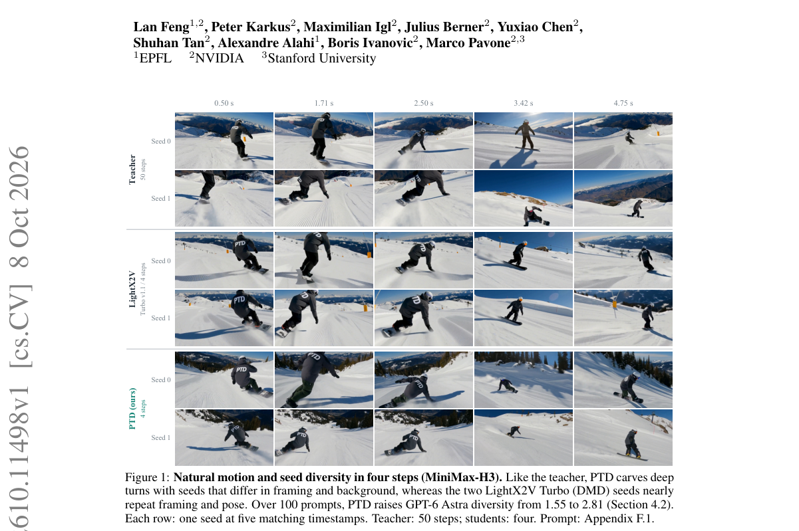

*Main result - Figure 2 Parametric Trajectory Distillation. One student evaluation predicts mean velocity h and curve coefficients c for a latent denoising segment. Teacher velocities queried on the student curve t*

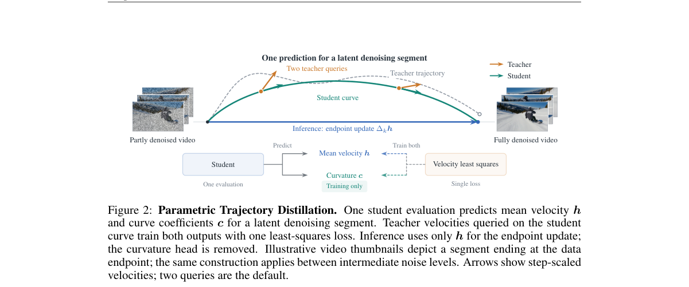

**Why this ranks #5**: 把少步蒸馏表述为「容量分配」问题，指向的是表示预算而非蒸馏技巧。

---

### 6. LEGO: A Lifting-Free Approach for Exocentric-to-Egocentric Video Generation

**arXiv**: [2610.12442](https://arxiv.org/abs/2610.12442) | **Score**: 7.7 (relevance 8 x 0.7 + quality 7 x 0.3) | **Tags**: AIGC-video | **Categories**: cs.CV | **Pages**: 24

**Authors**: Suhwan Cho, Yonwoo Choi, Soongjin Kim, Jicheol Park, Taegyu Lim

**Affiliation**: [not-found in PDF]

**Abstract**

> Generating an egocentric video from a single exocentric recording is a challenging case of novel view synthesis, as the two cameras share little overlap and much of the target view is unobserved. Current state-of-the-art methods reconstruct the scene explicitly by estimating depth, lifting the video into a point cloud, and re-rendering it from the egocentric camera to condition a video diffusion model. This deterministic mapping assigns each pixel to a single reprojected location, which preserves texture but translates depth errors into misplaced content. We ask what a video diffusion model should receive as its condition and propose a lifting-free answer: a learned view synthesizer, an LVSM-style transformer fine-tuned to render the egocentric view directly without depth, point clouds, or reprojection, resolving cross-view correspondence internally. In contrast, its probabilistic mapping averages each region over candidate source locations according to a learned correspondence distribution, preserving structure while fine texture is averaged away. We argue that this trade-off suits a diffusion generator, whose denoising training excels at restoring detail, so an effective condition should prioritize structural alignment over sharpness. This distribution's concentration also yields a per-region confidence, used both to mask low-confidence regions and to guide the generator toward high-confidence areas during early layout-forming denoising steps. Our approach consistently outperforms the state-of-the-art explicit pipeline and generalizes to other datasets without retraining. The synthesizer thus supplies view structure, and the diffusion model its detail.

**Key findings**

- **Finding**: 两相机几乎不重叠、目标视角大部分未观测，使 exocentric→egocentric 成为困难的新视角合成特例。

- **Finding**: 当前最优做法显式重建场景：估计深度 → 提升到点云 → 从第一人称相机重渲染 → 条件化视频扩散。

- **Finding**: LEGO 提出无提升（lifting-free）路径。

- **Inference**: 显式重建之所以必要，是因为条件化需要几何对应；绕开它意味着要在扩散模型内部隐式完成视角变换——省掉了深度估计的误差来源，但也失去了可诊断的中间表示。

- **Recommendation**: 与本批 3DTexMOR、WorldAlign 对照：三篇分别是 3D 修补、视频 3D 奖励与视角变换，共同指向「几何该显式还是隐式」。

**Key figures**

*Framework / architecture - Figure 1 Egocentric videos generated by LEGO from real-world exocentric footage, viewed from the perspective of the LEGO minifigure marked by the dotted outline.*

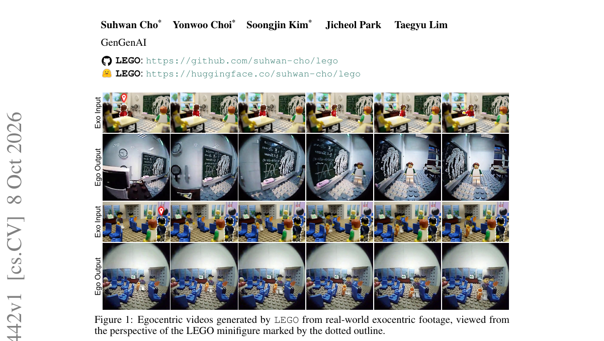

*Main result - Figure 2 Overview of LEGO. The frozen synthesizer F renders the egocentric view once per latent frame and exposes a confidence map. The render, gated to gray where confidence is low, fills the egocen*

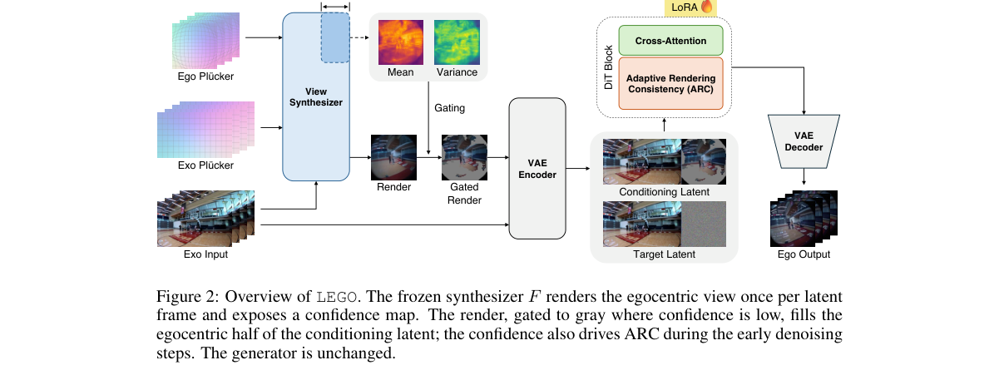

**Why this ranks #6**: 省掉显式重建这一中间步骤，是一条与主流相反的路线。

---

### 7. 3DTexMOR: 3D Gaussian Multi-Object Removal via Texture-Space Inpainting

**arXiv**: [2610.11198](https://arxiv.org/abs/2610.11198) | **Score**: 7.3 (relevance 7 x 0.7 + quality 8 x 0.3) | **Tags**: AIGC-3D | **Categories**: cs.CV | **Pages**: 17

**Authors**: Kunxin Guang, Yonghao Zhao, Jian Yang, Beibei Wang

**Affiliation**: 1Nanjing University | 2Nankai University

**Abstract**

> 3D object removal aims to remove target objects from reconstructed scenes and complete the geometry and appearance of occluded regions. Existing NeRF- and 3DGS-based methods typically inpaint 2D images to guide 3D completion. However, complex multi-object layouts limit the surrounding context visible in each view, making 2D inpainting prone to artifacts. Inconsistent completions across views also introduce conflicting supervision and blurry reconstructions. We propose 3D Gaussian Multi-Object Removal via Texture-Space Inpainting (3DTexMOR). Our key idea is to perform inpainting in a unified texture space shared by all views. By combining complementary observations, this space provides richer context for recovering missing regions and promotes cross-view appearance consistency. We aggregate multi-view observations into texture maps, inpaint the missing regions, and reproject the completed maps into camera views to supervise Gaussian scene completion. To avoid the influence of view-dependent highlights and reflections, we decompose appearance and aggregate view-independent intrinsic attributes instead of RGB colors. We further introduce geometrically regularized Gaussian completion to constrain the geometry of the completed regions. Extensive experiments demonstrate visually plausible completions and state-of-the-art multi-object removal performance, improving PSNR by 5.8 dB and reducing LPIPS by at least 22% compared with existing methods.

**Key findings**

- **Finding**: 既有方法先做 2D 图像补全再引导 3D 补全；复杂多物体布局限制了每个视角可见的上下文，导致 2D 补全易产生伪影，且不同视角的补全彼此不一致。

- **Finding**: 3DTexMOR 直接在**纹理空间**做补全以完成 3D Gaussian 多物体移除。

- **Inference**: 跨视角不一致的根源是每个视角独立补全；转到纹理空间意味着多个视角共享同一张「贴图」，不一致在结构上被消除而非靠一致性损失去惩罚。

- **Recommendation**: 做 3D 场景编辑的读者注意；纹理空间补全能否迁移到 3DGS 之外（如 mesh、NeRF）是该方法通用性的检验点。

**Key figures**

*Framework / architecture - Figure 1 We propose 3DTexMOR, a novel framework for high-quality 3D multi-object removal. By performing inpainting in a unified texture space, 3DTexMOR recovers the regions occluded by the removed ob*

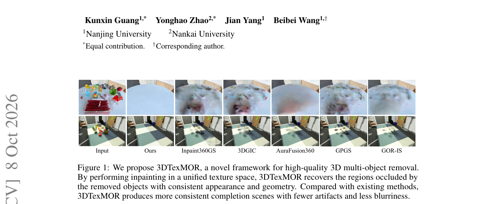

*Main result - Figure 2 Overview of the 3DTexMOR framework. Our Gaussian scene representation incorporates object identity features and intrinsic appearance attributes. The texture-space inpainting module aggregate*

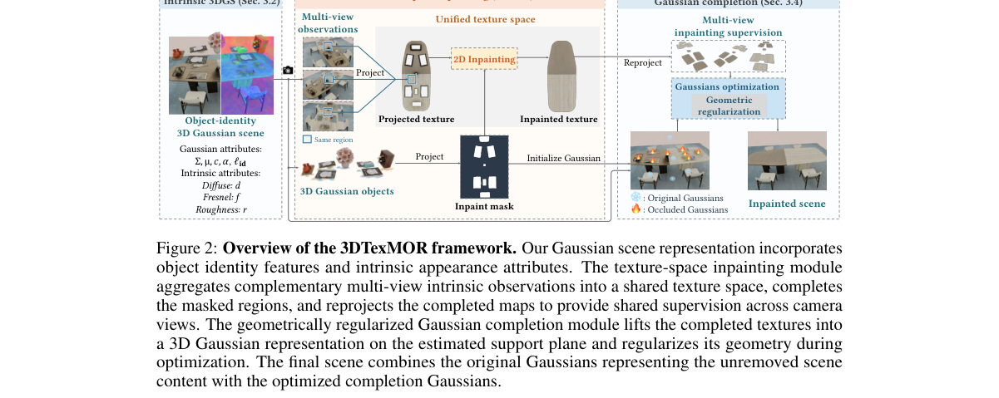

**Why this ranks #7**: 把 2D 补全的失效（上下文受限 + 跨视角不一致）归因清楚，解法直达纹理空间。

---

### 8. iCATS: Fast Video Generation via Interaction-Aware Sparse Attention and Timestep-Adaptive Sparsity

**arXiv**: [2610.11302](https://arxiv.org/abs/2610.11302) | **Score**: 7.0 (relevance 7 x 0.7 + quality 7 x 0.3) | **Tags**: AIGC-video | **Categories**: cs.CV | **Pages**: 19

**Authors**: Chengfeng Han, Baole Ai, Xianlu Bian, Jie Yao, Zilong Huang, Ang Wang, Dandan Ding

**Affiliation**: 1Hangzhou Normal University | 2T-Head Semiconductor Co., Ltd. | 3Alibaba Group | ∗Intern at T-Head Semiconductor Co., Ltd.

**Abstract**

> Training-free sparse attention offers a practical acceleration solution to Diffusion Transformers (DiTs) via reducing computations without fine-tuning. It typically involves estimating the importance of query-key regions and deriving sparse masks to compute only the important candidates, which inevitably introduces approximation errors that may degrade generation quality. To better balance the efficiency-quality trade-off, we propose iCATS, integrating improved importance estimation and sparse mask construction with an efficient hardware execution strategy. Specifically, for importance estimation, unlike previous works that perform independent clustering over query and key tokens based on feature similarity to estimate attention scores, iCATS demonstrates that clustering based on query-key dot-product interactions is more accurate and further reformulates this objective as a simple quadratic form for low-cost computation. For sparse mask construction, instead of using a fixed top-p rule, we observe that tolerance to sparse approximation errors varies across denoising timesteps and therefore introduce an SNR-guided sparsity schedule to adjust sparsity dynamically, leading to higher accuracy. Finally, for hardware execution, we devise a tail-merging strategy to reduce padding overhead caused by irregular cluster sizes, improving GPU kernel utilization. Extensive experiments show that iCATS achieves $2.03\times$ acceleration with 31.017 dB PSNR on HunyuanVideo-T2V-13B and $1.55\times$ acceleration with 29.301 dB PSNR on Wan2.1-T2V-14B, delivering a state-of-the-art efficiency-quality trade-off.

**Key findings**

- **Finding**: 免训练稀疏注意力通过估计 query-key 区域重要性推导稀疏掩码，只计算重要候选。

- **Finding**: 该策略必然引入近似误差并可能损害生成质量；iCATS 用交互感知的稀疏注意力与**时间步自适应**稀疏度来权衡。

- **Inference**: 把稀疏度做成随时间步变化而非常数，隐含假设是不同去噪步的信息需求确实不同——早步需要全局结构、晚步更局部。若该假设成立，常数稀疏率是一个可避免的次优选择。

- **Recommendation**: 视频生成部署的读者注意；与 10-07 的 GRACE（latent 压缩）属不同层级的加速，可叠加。

**Key figures**

*Framework / architecture - Figure 1 Visualizations on HunyuanVideo-T2V-13B and Wan2.1-T2V-14B show that iCATS better preserves visual details while achieving higher speedup than other training-free methods, producing results c*

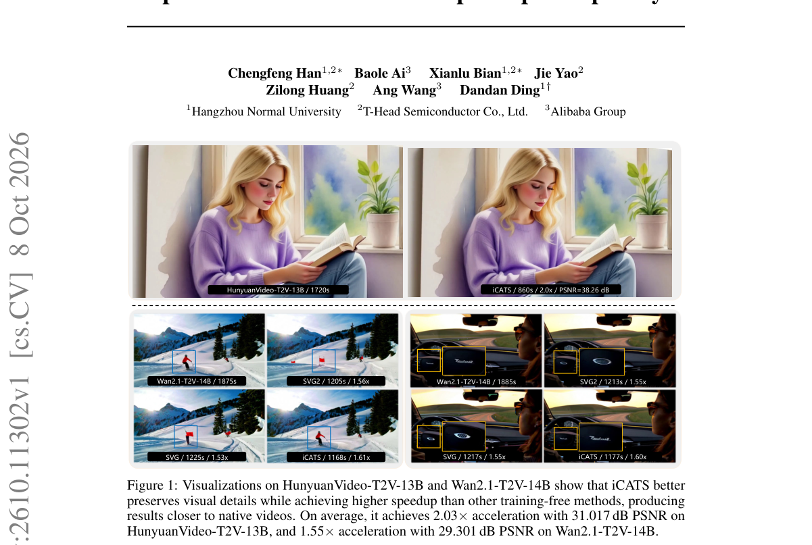

*Main result - Figure 2 Visualization of (a) block-based and (b) cluster-based sparse attention.*

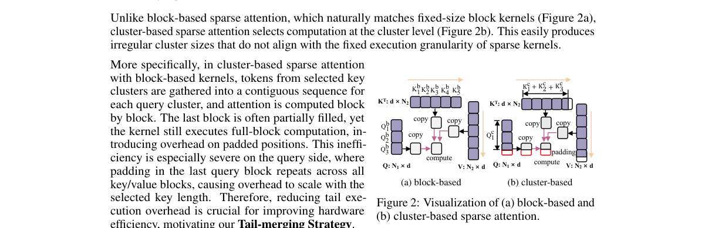

**Why this ranks #8**: 指出稀疏注意力的误差随时间步变化，并据此自适应，是稀疏化路线上少见的细致处理。

---

### 9. FlyMark: Training-Free Invisible Watermarking of 3D Gaussian Splatting via a Fruit Fly Connectome

**arXiv**: [2610.11364](https://arxiv.org/abs/2610.11364) | **Score**: 7.0 (relevance 7 x 0.7 + quality 7 x 0.3) | **Tags**: AIGC-3D | **Categories**: cs.CV | **Pages**: 22

**Authors**: Ziyuan Luo, Haoliang Li, Renjie Wan

**Affiliation**: 1Department of Computer Science, Hong Kong Baptist University | 2Department of Electrical Engineering, City University of Hong Kong

**Abstract**

> A trained 3D Gaussian Splatting (3DGS) scene ships as a portable parameter array that can be copied, pruned, requantized, or repackaged outside its training pipeline, so ownership evidence is most useful when it lives in the released parameters and remains checkable long after the embedding tooling is gone. Existing 3DGS watermarks typically tie embedding or extraction to scene optimization, a learned decoder, or rendered views, so the evidence survives only as long as a second trained artifact does. FlyMark instead writes a keyed message into the parameters a 3DGS file already stores. Its carrier directions are derived from the photoreceptors of a published connectome, a citable versioned artifact that fixes the geometry exhaustively and leaves nothing to tune per scene. A virtual observer reads cone-wise apparent luminance along a scene-normalized orbit from stored centers, colors, and opacities; a keyed dithered quantization-index-modulation code replicates each message bit across these observations; and one sparse bounded least-squares solve realizes the targets through achromatic shifts of existing degree-zero colors under a hard per-channel linear-RGB bound. All geometry and higher-order appearance parameters are preserved bit-identically, and extraction needs only cone queries, rounding, and majority voting. Under a model-domain threat model on synthetic and real scenes, FlyMark attains high clean bit accuracy and visual fidelity while cleanly separating matched from wrong keys.

**Key findings**

- **Finding**: 3DGS 发布物是可移植参数数组，会在训练流水线之外被复制、剪枝、重量化或重新打包。

- **Finding**: 因此所有权证据应活在**发布的参数**中并在嵌入工具消失后仍可检验；既有方法把嵌入或提取与场景优化绑定（因而工具淘汰后失效）。

- **Finding**: FlyMark 用果蝇神经连接启发的方式实现训练无关（training-free）的 3DGS 隐形水印。

- **Inference**: 训练无关的水印对发布后的任意处理（剪枝/量化）鲁棒性更强——因为它不依赖某个训练流程留下的痕迹——但载荷容量通常更小，这是明确的取舍。

- **Recommendation**: 3D 内容溯源方向的读者可参考；鲁棒性-载荷权衡的具体曲线比方法本身更能指导选型。

**Key figures**

*Framework / architecture - Figure 1 FLYMARK writes a message where a fly looks. A virtual observer carries the connectome’s photoreceptor directions around the scene, and each direction reads an opacity-weighted cone of Gaussi*

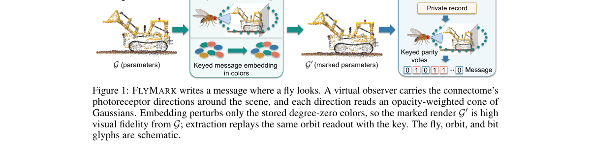

*Main result - Figure 2 FlyMark’s embedding and extraction paths. (a) The connectome-derived retinal lattice and observer orbit define a cone-wise mean-luminance readout atj from the original Gaussian model G. The*

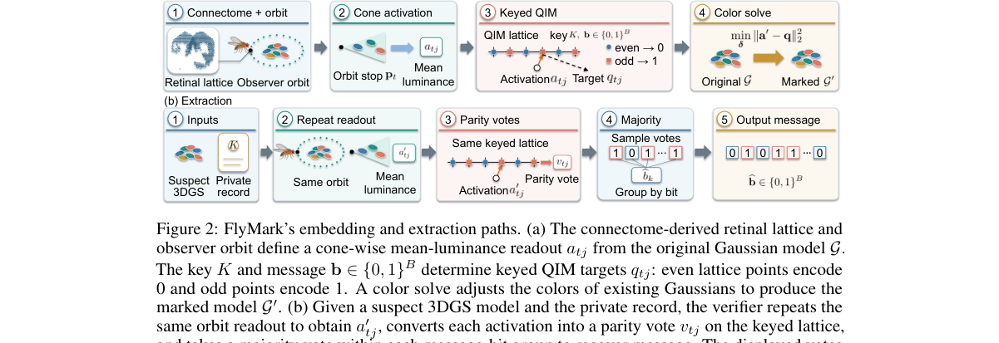

**Why this ranks #9**: 把「嵌入工具会被淘汰」当成设计前提，这是一个务实的威胁模型。

---

### 10. Transforming Image Editors into Video Editors

**arXiv**: [2610.11037](https://arxiv.org/abs/2610.11037) | **Score**: 7.0 (relevance 7 x 0.7 + quality 7 x 0.3) | **Tags**: AIGC-video, AIGC-edit `[wild-card]` | **Categories**: cs.CV | **Pages**: 13

**Authors**: Feng Wang, Zijie Li, Ceyuan Yang, Alan Yuille, Peng Wang

**Affiliation**: 1ByteDance Seed 2Johns Hopkins University | nAI, 2025; Google, 2025; Deng et al., 2025; Qwen Team, 2025; Brooks et al., 2023; Black Forest

**Abstract**

> Recent image editing systems have achieved impressive semantic understanding, visual fidelity, and instruction-following ability, while video editing remains substantially more difficult and costly. In this paper, we present a simple alternative to end-to-end video editing: instead of training a monolithic video editor, we transform a strong image editor into a video editor through anchor-based generation. Our key insight is that video editing can be decomposed into two subproblems: editing a sparse set of keyframes and propagating those edits across time. Based on this observation, we propose Anchor-based Video Editing (AVE), a two-stage framework in which a powerful image editor first performs composed editing on selected keyframes, and a motion-guided image-to-video diffusion model then generates the final video by treating the edited keyframes as fixed anchors. This design directly inherits the strengths of modern image editors while avoiding expensive end-to-end video editing training. Experiments on IVEBench and VIE-Bench show that AVE achieves strong performance in instruction following, temporal consistency, and content fidelity. Further ablations reveal that final video editing quality is strongly correlated with the quality of the image editor, suggesting that future progress in video editing may come from stronger image editing foundations and lightweight transfer to video. Code is available at https://github.com/wangf3014/AVE.

**Key findings**

- **Finding**: 图像编辑已具备强语义理解、视觉保真与指令遵循，视频编辑则仍显著更难更贵。

- **Finding**: 作者不训练单体视频编辑器，而是通过锚定（anchoring）把强图像编辑器改造成视频编辑器。

- **Inference**: 若改造足够有效，则「视频编辑难」的相当一部分并非任务本身难，而是数据与算力投入不足——这与该领域反复出现的「数据稀缺」解释一致。

- **Recommendation**: wild-card 项；锚定机制的具体形式（是时间聚合还是一致性约束）决定该路线能否推广到长视频。

**Key figures**

*Framework / architecture - Figure 1 Overview of our two-stage pipeline. In Stage-1, we edit a sparse set of keyframes using either open-source or API-based image editors. In Stage-2, an image-to-video diffusion model interpola*

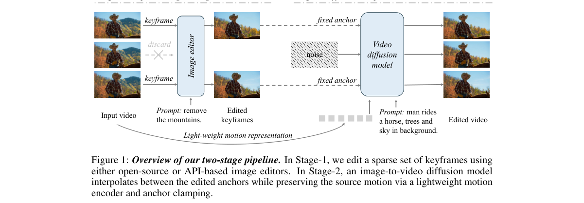

*Main result - Figure 2 Architecture of the lightweight motion encoder used in Stage-2. The encoder projects video latents into a token sequence and applies factorized spatial-then-temporal self-attention to extrac*

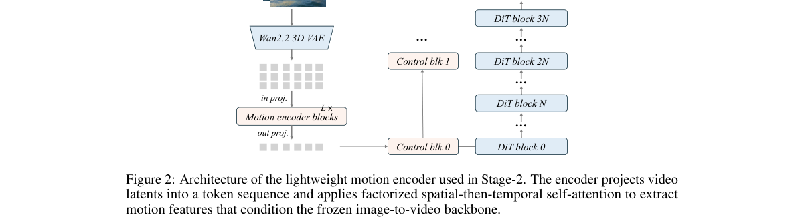

**Why this ranks #10**: wild-card：路径极简但结论可能重要——它把视频编辑的难度问题转化为架构复用问题。

---

## Footer

- Total papers reviewed across all 5 tracks: 50 (from 643 scanned)
- aigc_visual track final top-10: 10
- Wild-cards in this track: 1
- Figure assets: `res/` (shared across tracks)

Generated by `mine-arxiv-daily-digest` skill. Sister file: `2026-10-09_aigc_visual_entry.md`.
