# ArXiv Daily Digest - 2026-10-09 (音频与语音语言模型 / 双工语音助手, 10 papers)

**Generated**: 2026-10-09 17:00 CST

**Source**: arXiv cs.CV, cs.SD, eess.AS, cs.CL, cs.AI, cs.RO, cs.LG submissions, window 2026-10-08 UTC (latest announced batch as of 2026-10-09 17:00 CST)

**Track**: audio_lm (top 10 of 643 papers scanned, 50 full reads)

**Scope**: recursive harness improvement for full-duplex voice agents, rolling masked diffusion for full-duplex spoken dialog, steering and instruction-following of full-duplex simulators, mechanism-guided control of audio influence in LALMs, admission-controlled memory formation, speech-to-LLM bridge pretraining geometry, Mandarin multi-party conversational corpora, multi-audio music reasoning, spatial audio LMs, proactive spoken assistance

---

**这是本项目日报三天来第一次在双工语音方向拿到实打实的内容**（昨天的日报里这一线是空窗的，只能用 8 个 wild-card 撑），今天三篇真正的全双工工作同时出现，且恰好覆盖三个正交的问题。**DuplexAgent-RSI** 给架构：语音智能体正在收敛到一种协作范式——全双工模型作为实时对话入口常驻通道，检索、推理与编码通过异步委派处理；分工的理由是能力边界（双工模型支持持续听说，但复杂推理与工具使用超出其能力）。**DiffuPlex** 给效率：现有细粒度双工模型在**每个交互帧**都自回归推进骨干，而全双工对话的本质是等待用户说话时本不该消耗推理；滚动掩码扩散在单次骨干唤醒中预测多个未来用户帧与助手帧，把等待期的空转变成有用计算。**SteerablePlex** 则给出一个方法论警报：全双工模型随对话历史增长越来越难控制，被用作用户模拟器时会偏离规定场景并产生**不可靠的评测结果**。把这三篇与 10-07 日报的 Coupled but Late（模型间环路稳定到的时序未必是人类的）连起来读，结论很明确：**以全双工模型为主体的评测协议目前都不可靠**，不只是需要改进。另一条线是记忆与接口：Gated Memory 把记忆**形成阶段**（事实首次写入）识别为记忆中质量的绑定约束，与 10-07 的 AgentMemGate（写入时门控防推测污染）完全同源，今天的贡献是把它上升为一般性论断；Local Prototype Reconstruction 则把 speech-to-LLM 的桥接模块从「管道」重新定义为**定义接口几何**的关键部件，并指出预训练目标决定它是否为下游提供可复用初始化。最后，**本批方法论价值最高的一篇是 Selective Listening**：任务无关的音频在不需要听时仍会改变大型音频语言模型的文本推理决策，而**聚合准确率完全掩盖了这种成对漂移**——因为音频带来的修复与损害互相抵消。它定位出的「晚期音频通路」可干预，并与 10-06/10-07 那条「指标系统性漏掉真实失效」的线索接上了第三例。

---

## Top 10 - 音频与语音语言模型 / 双工语音助手

### 1. DuplexAgent-RSI: Recursive Harness Improvement for Full-Duplex Voice Agent Collaboration

**arXiv**: [2610.11299](https://arxiv.org/abs/2610.11299) | **Score**: 9.7 (relevance 10 x 0.7 + quality 9 x 0.3) | **Tags**: duplex-voice, audio-LM | **Categories**: cs.AI, cs.SD | **Pages**: 16

**Authors**: Yingda Shen, Yuxiang Wang, Kunyu Feng, Qinke Ni, Jiaqi Li, Minghao Hsu, Junan Zhang, Dekun Chen, Yutong Bian, Zhizheng Wu

**Affiliation**: ⋆The Chinese University of Hong Kong, Shenzhen | † Amphion Technology Co., Ltd | (Venus Team) and Tsinghua University, 2026). This combines continuous interaction with the reasoning

**Abstract**

> Voice agents are converging on a collaboration pattern: a full-duplex interaction model stays on the live channel as the entry to the conversation, while search, reasoning, and coding are handled through asynchronous delegation. A duplex model supports continuous listening and speaking, but complex reasoning and tool use may exceed its capabilities. A coding agent can plan and execute extended tasks, but its sequential interface is a poor fit for live conversation. Combining them requires a harness that coordinates task acceptance, progress, cancellation, replacement, and result delivery while keeping the conversation responsive. Existing harnesses often rely on coupled heuristics, making them difficult to improve systematically from evidence. We present DuplexAgent, a full-duplex collaboration system whose harness expresses this workflow as six editable modules, and Duplex-Harness-RSI, a closed loop that revises them from interaction traces. A simulator automatically generates timed test conversations, runs the system, and produces failure traces that identify the collaboration modules requiring repair. Reasoning LLMs and coding agents in the delegation pool also serve the improvement loop: the Exam Planner selects the next tests from observed weaknesses and the repair archive, and the Harness Editor proposes targeted module changes. The capabilities that serve the user thus also improve the system's coordination. Experiments on intelligence, agentic, and duplex benchmarks show that DuplexAgent combines continuous interaction with difficult reasoning and complex task execution, achieving stronger spoken-knowledge and executable-tool scores than the compared delegated systems while maintaining strong interruption response. A harness ablation further shows that this modular, verifiable loop outperforms the initial harness and repeated editing that lacks its diagnosis and repair archive.

**Key findings**

- **Finding**: 一种协作模式正在收敛：全双工交互模型作为实时对话入口常驻，检索/推理/编码通过**异步委派**处理。

- **Finding**: 分工的动机是能力边界——双工模型支持持续听说，但复杂推理与工具使用可能超出其能力；编码智能体可以规划并执行长任务。

- **Finding**: DuplexAgent-RSI 用递归式的 harness 改进来优化这种全双工语音智能体协作。

- **Inference**: 把「双工模型」定位为**接口层**而非全能体，是一个重要的架构转向：它承认实时听说与复杂推理需要不同模型，而这正好回答了 10-07 日报里 PERSIST/AgentMemGate 触及的记忆问题在系统层面归谁管。

- **Recommendation**: 被精读的三篇之一。与 SteerablePlex、DiffuPlex 组成今天的双工三部曲，三篇分别处理协作架构、加速与可控性。

**Key figures**

*Framework / architecture - Figure 1 Benchmark results for DuplexAgent (blue), compared with other collaboration systems (gray). Higher is better on every panel. Intelligence reports MMSU accuracy, agentic tool use reports BFCL*

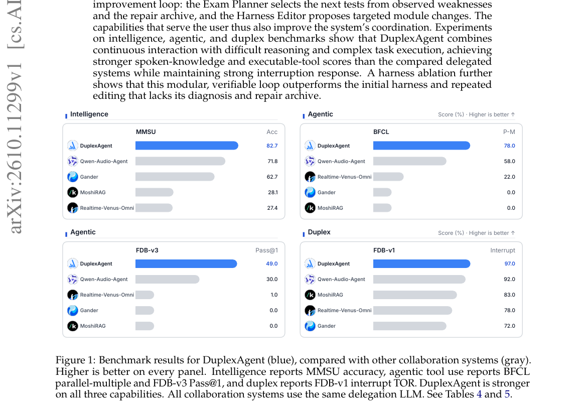

*Main result - Figure 2 Schematic of DuplexAgent and Duplex-Harness-RSI.*

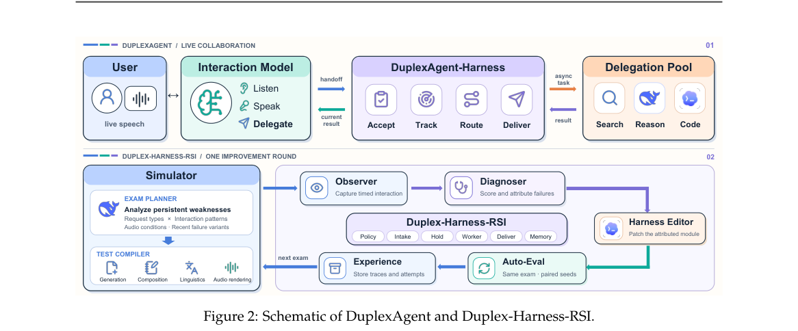

**Why this ranks #1**: 三天来第一篇真正的双工语音助手架构论文，且给出了一个正在成型的协作范式。

---

### 2. Selective Listening: Mechanism-Guided Control of Audio Influence in Large Audio-Language Models

**arXiv**: [2610.11196](https://arxiv.org/abs/2610.11196) | **Score**: 9.0 (relevance 9 x 0.7 + quality 9 x 0.3) | **Tags**: audio-LM | **Categories**: cs.CL, cs.LG, cs.SD | **Pages**: 24

**Authors**: Yulin Sun, Kele Xu, Yong Dou

**Affiliation**: 1College of Computer Science and Technology, National University of Defense Technology | 2State Key Laboratory of Complex & Critical Software Environment

**Abstract**

> Large audio-language models (LALMs) exploit multimodal evidence, yet task-irrelevant audio can alter text-reasoning decisions when listening is unnecessary. Aggregate Accuracy can hide this paired drift because audio-induced repairs and damages may cancel. Paired drift analysis and targeted interventions identify architecture-specific, intervention-sensitive late audio pathways as actionable control points. We introduce ICAP-Gate, which applies mechanism-guided, task-conditioned control to each model's pathway. Across four LALMs, two reasoning benchmarks, and environmental-sound and natural-speech interference, ICAP-Gate has lower point estimates for Influence Rate and Answer Flip than ungated inference in all 16 full-split model--condition evaluations. Fixed suppression degrades automatic speech recognition (ASR) across all four models, whereas ICAP-Gate matches ungated ASR performance by preserving the pathway for explicit audio-demand instructions. ICAP-Gate has lower paired-drift point estimates than mitigation prompting in all four evaluated settings and provides competitive stabilization relative to eight-sample Self-Consistency while using one generation per query; in controlled ARC measurements, Self-Consistency incurs $7.0$--$9.2\times$ ungated latency. These results establish selective modality influence control as a design principle for robust multimodal reasoning.

**Key findings**

- **Finding**: 任务无关的音频在不需要听时仍可能改变 LALM 的文本推理决策——即模型在使用音频。

- **Finding**: **聚合准确率掩盖这种成对漂移**：音频带来的修复与损害互相抵消，净值不变但逐样本行为已改变。

- **Finding**: 成对漂移分析与定向干预识别出架构特定、可干预的**晚期音频通路**。

- **Inference**: 「修复与损害抵消」是聚合指标最隐蔽的失效模式：任何按任务类型分层的总体准确率都可能掩盖一组系统性行为改变。这直接延续 10-07 日报 World Models' Last Exam 与 10-06 日报 Mind the Execution Gap 的批判。

- **Recommendation**: 被精读的三篇之一。成对漂移分析应当成为评测音频/多模态模型的标准手段；晚期音频通路的定位也提示「浅层融合」未必安全。

**Key figures**

*Framework / architecture - Figure 1 Paired decision drift under task-irrelevant audio. The same text input is evaluated with and without task-irrelevant environmental sound or speech; the downstream decision may change.*

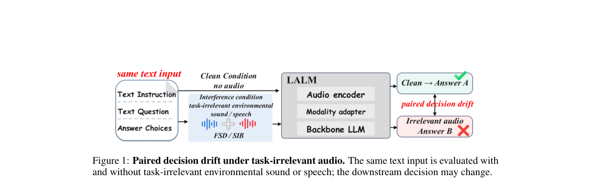

*Main result - Figure 2 Mechanism-guided selective control of irrelevant-audio influence in LALMs. (a) Pathway scaling identifies a late audio pathway through which irrelevant audio changes Qwen2.5- Omni decisions.*

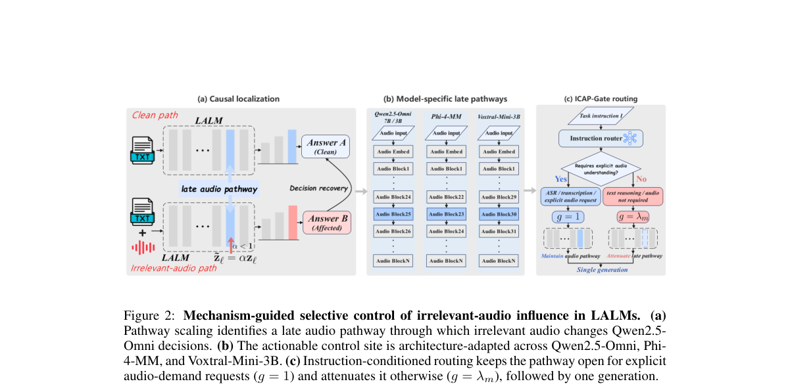

**Why this ranks #2**: 本批方法论价值最高的一篇，也是 10-06/10-07 那条「指标系统性漏掉真实失效」线索最具体的第三例。

---

### 3. DiffuPlex: Accelerating Full-Duplex Spoken Dialog Models via Rolling Masked Diffusion

**arXiv**: [2610.12214](https://arxiv.org/abs/2610.12214) | **Score**: 9.0 (relevance 9 x 0.7 + quality 9 x 0.3) | **Tags**: duplex-voice | **Categories**: cs.CL, cs.SD | **Pages**: 41

**Authors**: Heeseung Kim

**Affiliation**: University of Seoul

**Abstract**

> Recent full-duplex spoken dialog models enable simultaneous listening and speaking, but fine-grained models still advance their backbone autoregressively at every interaction frame. We introduce DiffuPlex, a rolling masked diffusion framework that reduces this sequential computation by predicting multiple future user and assistant frames in a single backbone wake. DiffuPlex consumes only a confident prefix of each predicted future while interaction continues at the original frame rate. As user speech arrives, it checks the corresponding user predictions and, when the interaction diverges, preserves already played assistant content while revising only the unplayed future. We consider two inference policies over the same predictor: DiffuPlex-LISTEN consumes multiple future frames when they predict assistant silence, whereas DiffuPlex-SPEAK can also consume predicted assistant speech. Across full-duplex interaction and spoken-language evaluations, DiffuPlex substantially reduces sequential backbone computation while largely preserving interaction behavior and general capability. DiffuPlex-LISTEN and DiffuPlex-SPEAK achieve $1.46\times$ and $1.59\times$ deployment-path wall-clock speedups and $1.61\times$ and $1.80\times$ Core LM speedups, with all measured backbone invocations completing within the 80ms interaction interval. Human evaluation shows that LISTEN preserves speech naturalness and conversational quality, while SPEAK retains conversational quality with some degradation in speech naturalness.

**Key findings**

- **Finding**: 现有细粒度全双工模型在**每个交互帧**都自回归推进骨干，串行计算是主要开销。

- **Finding**: DiffuPlex 用滚动掩码扩散在单次骨干唤醒中预测多个未来用户帧与助手帧，且只消费（受限的）历史。

- **Inference**: 全双工对话的本质是「等待用户说话」时本不应消耗推理——滚动预测多帧把等待期的空转变成有用计算，这与 10-07 日报 RFPO 的「few-step 失配」属同一类推理调度问题。

- **Recommendation**: 双工语音的读者必读；受限历史的设定方式（是否泄漏未来信息）决定了与现有模型的公平可比性。

**Key figures**

*Framework / architecture - Figure 1 Overview of conventional full-duplex generation and DiffuPlex. Conventional models ad- vance one interaction frame at a time, requiring a new backbone computation at every step (left). Diffu*

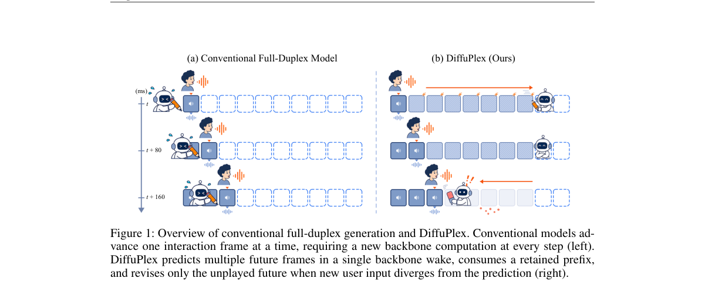

*Main result - Figure 2 Overview of DiffuPlex. (a) One backbone wake predicts a masked future block with an assistant draft and user predictions. The staircase indicates stream-wise masking of inputs unavail- able*

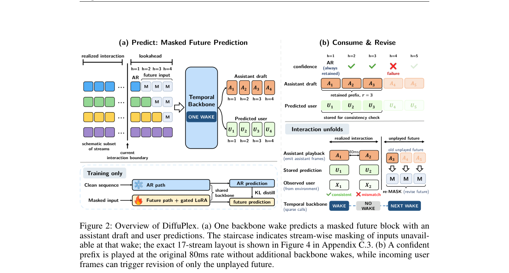

**Why this ranks #3**: 把扩散用于全双工的时序推进，是对「逐帧自回归」这一架构默认的正面挑战。

---

### 4. SteerablePlex: Can We Steer Full-Duplex Models?

**arXiv**: [2610.12201](https://arxiv.org/abs/2610.12201) | **Score**: 8.7 (relevance 9 x 0.7 + quality 8 x 0.3) | **Tags**: duplex-voice | **Categories**: cs.CL, eess.AS | **Pages**: 5

**Authors**: Haolong Zheng, Maike Züfle, Dominik Macháček, Peter Polák, Xulin Fan, Xavier Sumba, Siyin Wang, Ondřej Klejch, Mark Hasegawa-Johnson

**Affiliation**: 1University of Illinois Urbana-Champaign, 2Karlsruhe Institute of Technology, | 3Charles University, 4Imperial College London, 5Tsinghua University, 6University of Edinburgh

**Abstract**

> Full-duplex speech models can listen and speak simultaneously, enabling natural interaction, but become increasingly difficult to control as the conversation history grows. When used as user simulators, this lack of control can cause them to deviate from prescribed scenarios and produce unreliable evaluation outcomes. We introduce SimIF-Bench (Simulator Instruction-Following Benchmark), which evaluates whether a conversational model stays within a prescribed scenario and completes multiple goals in the required order. The benchmark reveals that current open-source full-duplex models struggle to follow such constraints. We then introduce a Group Reward-Decoupled Normalization Policy Optimization (GDPO)-based training recipe that enables a full-duplex model to follow textual instructions during an ongoing conversation while maintaining its turn-taking ability. By connecting the resulting SteerablePlex to an asynchronous backend language model that monitors the conversation and provides instructions when needed, we build a more controllable full-duplex user simulator that follows multi-stage constraints more reliably than existing open-source models and GPT-Realtime.

**Key findings**

- **Finding**: 全双工模型随对话历史增长而越来越难控制。

- **Finding**: 当它们被用作用户模拟器时，失控会导致偏离规定场景并产生**不可靠的评测结果**；作者提出 SimIF-Bench 专门评测模拟器的指令遵循。

- **Inference**: 这把 10-07 日报 Coupled but Late 的担忧推进了一步：那篇发现模型间环路稳定到的时序未必是人类的，本篇说明模型还会偏离规定场景——两者叠加意味着以全双工模型为主体的评测协议目前都不可靠。

- **Recommendation**: 与 10-07 的 Coupled but Late 连读；用全双工模型做用户模拟器的项目应先确认这一失效。

**Key figures**

*Framework / architecture - Figure 1 Illustration of the proposed Actor-Director system. SteerablePlex continuously listens and speaks while the director monitors the conversation. When steering is needed, the director injects an*

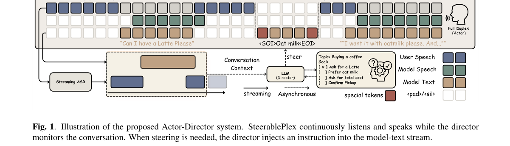

*Main result - Figure 2 SimIF-Bench results over 200 tasks. Panels report topic and naturalness (1–5), either-speaker goal completion, and examiner-only exact ordered completion. Both SteerablePlex variants use the s*

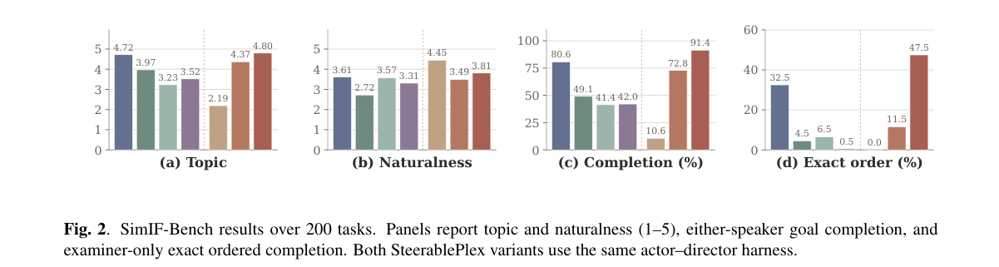

**Why this ranks #4**: 指出全双工模型作为「评测工具」本身的可靠性问题，是一个方法论层面的警报。

---

### 5. Gated Memory: Admission-Controlled Memory Formation for Conversational AI

**arXiv**: [2610.11270](https://arxiv.org/abs/2610.11270) | **Score**: 8.0 (relevance 8 x 0.7 + quality 8 x 0.3) | **Tags**: audio-LM | **Categories**: cs.AI, cs.CL, cs.IR, cs.LG | **Pages**: 7

**Authors**: Preeti Saraswat, Divya Neelagiri, Ajay Manoj

**Affiliation**: Samsung Research America, Mountain View, CA

**Abstract**

> Personalized conversational AI relies on long-term memory systems that extract facts from user utterances and store them in persistent vector stores. Despite progress in retrieval, deduplication, and lifecycle management, the formation stage, the moment a fact is first written to storage has received almost no principled attention. We identify this as the binding constraint on memory quality in production systems. Critical contextual signals, such as the distinction between a permanent user attribute and a transient situation, exist only in the original utterance and are irreversibly lost the moment extraction produces a subject-relation-object triple. No downstream process can recover them. We propose Gated Memory, a lightweight, modular formation framework that interposes two decision checkpoints between conversation and storage: an admission gate that evaluates every candidate fact against the full utterance context before extraction runs, and a conditional enrichment stage that grounds admitted facts through an entity scope taxonomy with privacy constraints. The gate evaluates only the current exchange while using prior turns as read-only reference context, and produces a structured formation record. Admitted content is decomposed into atomic facts, each categorized, tagged with provenance (directly stated versus inferred), scoped to its condition of applicability, and grounded in resolved time and place, subject to a constraint that no entity absent from the context may be asserted. On the LoCoMo-10 benchmark with atypical emotional density in utterance data, Gated Memory achieves an overall +2.6% relative improvement in LLM-judge accuracy over a strong baseline with identical retrieval and generation, establishing formation quality as a measurable constraint on memory performance.

**Key findings**

- **Finding**: 记忆系统的检索、去重、生命周期管理均有进展，但**形成阶段**（事实首次被写入）几乎未被原则性地研究。

- **Finding**: 作者把形成阶段识别为记忆中质量的**绑定约束**，并提出准入控制的记忆形成（Gated Memory）。

- **Inference**: 「先决定能否访问、再优化检索」把改进重点从检索侧移到写入侧——这与 10-07 的 AgentMemGate（写入时门控防推测污染）完全同源，今天的贡献是把它上升为一般性的记忆质量论断。

- **Recommendation**: 记忆系统的读者注意；准入判据（是否需要标注数据）决定能否在无监督场景落地。

**Key figures**

*Framework / architecture - Figure 1 The Gated Memory pipeline. Every candidate fact passes through an utterance-level admission gate. Admitted facts are scope-classified and conditionally enriched before being passed to the me*

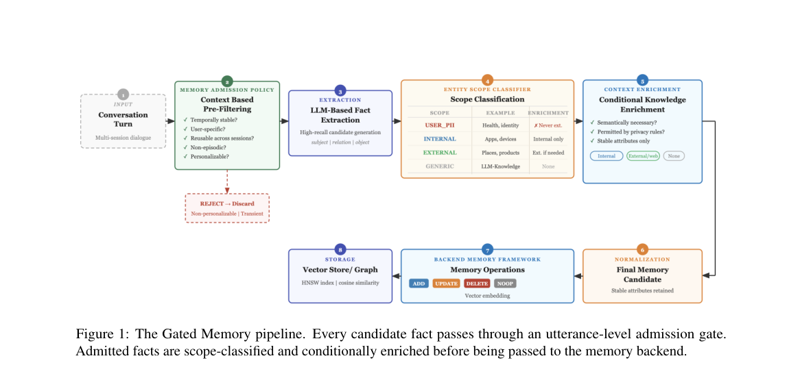

**Why this ranks #5**: 这是本项目日报连续第四天出现「记忆写入/形成」主题，且今天给出了最明确的定位。

---

### 6. Local Prototype Reconstruction for Text-Compatible Speech-to-LLM Bridge Pretraining

**arXiv**: [2610.11159](https://arxiv.org/abs/2610.11159) | **Score**: 8.0 (relevance 8 x 0.7 + quality 8 x 0.3) | **Tags**: audio-LM | **Categories**: cs.CL, cs.SD | **Pages**: 7

**Authors**: Xinnian Zhao, Chia-Hua Wu, Pu Wang, Hugo Van Hamme

**Affiliation**: †Institute of Information Science, Academia Sinica, Taiwan

**Abstract**

> Speech-to-LLM systems often connect a frozen speech encoder to a frozen large language model (LLM) through a small trainable bridge. The bridge is usually treated as plumbing, but it in fact defines the geometry of the speech-to-LLM interface, and the pretraining objective decides whether that interface provides a reusable initialization for downstream tasks. We study a transferable bridge through two complementary properties: global alignment with the text side, and local lexical manifold compatibility, where bridge embeddings remain close to the frozen LLM's input-embedding neighbourhoods. We make this property measurable with a fixed, head-free, timestamp-free diagnostic that applies to any objective, and show that next-word prediction (NWP) and sentence-level contrastive pretraining do not fully capture token-level lexical compatibility. We then introduce Local Prototype Reconstruction (LPR), a lightweight training-only regularizer that requires each aligned bridge token to be reconstructable from a small neighbourhood of frozen LLM token embeddings, with a hard single-prototype anchor as its limiting case. On multilingual ASR and speech translation, LPR improves transfer, with the largest gains on translation and low-resource adaptation. Crucially, our independent diagnostic correlates with downstream gains across objectives, suggesting that lexical manifold compatibility is predictive of reusability for speech-to-LLM bridges.

**Key findings**

- **Finding**: 桥接模块通常被当作管道，但它实际上**定义了语音到 LLM 接口的几何**。

- **Finding**: 预训练目标决定该接口是否为下游任务提供**可复用的初始化**；作者通过局部原型重建研究可迁移的桥接。

- **Inference**: 若桥的几何才是关键，那么整个语音 LLM 栈的可迁移性瓶颈在桥而不在编码器或 LLM——这是一个会改变预训练预算分配的判断。

- **Recommendation**: 做 speech-LLM 的读者必读；桥的容量与预训练目标的消融是全文核心。

**Key figures**

*Framework / architecture - Figure 1 Motivating gap between global alignment and local compatibility. (a) Schematic view: NWP and contrastive objectives can produce bridge embed- dings that support generation or utterance-level a*

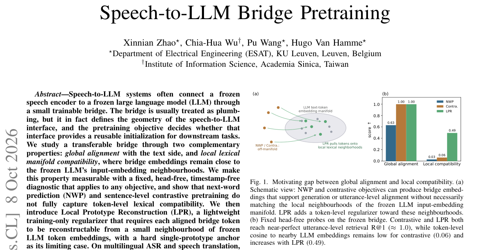

*Main result - Figure 2 Overview of Local Prototype Reconstruction (LPR). During pretraining, transcript tokens are softly aligned to continuous bridge embeddings through a schematic soft-alignment module, local froz*

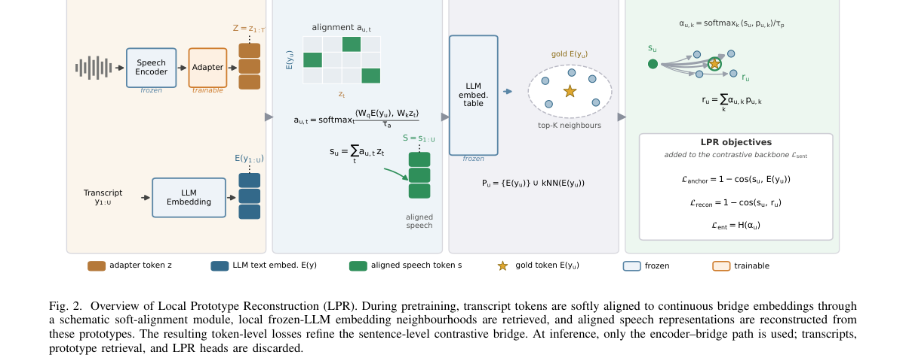

**Why this ranks #6**: 把「桥接模块是管道」这个默认假设直接推翻，并指出预训练目标决定初始化价值。

---

### 7. SmoothConv and DuplexConv: Complementary Mandarin Multi-Party Conversational Speech Corpora for Speech Interaction

**arXiv**: [2610.11150](https://arxiv.org/abs/2610.11150) | **Score**: 7.3 (relevance 7 x 0.7 + quality 8 x 0.3) | **Tags**: duplex-voice, audio-LM | **Categories**: eess.AS | **Pages**: 5

**Authors**: Chengyou Wang, Mingchen Shao, Chunjiang He, Zeyu Zhu, Jierui Guo, Bingshen Mu, Zikai Liu, Hanke Xie, Yuhang Dai, Zhou Zhu, Lei Xie

**Affiliation**: [not-found in PDF]

**Abstract**

> Recent advances in large audio language models (LALMs) have driven the development of natural and intelligent speech interaction systems. Such systems need to model complex conversational behaviors, including turn-taking, overlapping speech, and speaker coordination. Multi-party conversations provide a realistic setting for studying these behaviors, yet existing Mandarin conversational corpora often lack synchronized participant-level speech tracks and comprehensive annotations. In this work, we introduce SmoothConv and DuplexConv, two complementary Mandarin multi-party conversational speech corpora totaling 2,100 hours. SmoothConv provides human-verified conversations for reliable analysis and evaluation, while DuplexConv offers large-scale automatically annotated conversations through a scalable pipeline for model training. Both corpora provide synchronized participant-level speech tracks and multi-dimensional fine-grained annotations. We further release the SmoothConv Benchmark and evaluate these resources on speech separation, multi-speaker automatic speech recognition (MSASR), and turn detection tasks. Experimental results demonstrate the utility of the proposed resources for multi-party speech interaction modeling. The datasets, benchmark, and related resources are publicly available.

**Key findings**

- **Finding**: 自然语音交互系统需要建模话轮转换、重叠语音与说话者协调等复杂对话行为。

- **Finding**: 多方对话是研究这些行为的现实设定，但既有普通话对话语料往往覆盖不足；作者发布互补的 SmoothConv 与 DuplexConv 两个语料。

- **Inference**: 10-07 日报的三篇双工评测论文都在抱怨评测协议的薄弱，而协议的瓶颈最终是数据——没有覆盖重叠与协调的语料，话轮研究只能在合成设置上做。

- **Recommendation**: 与本批 DuplexAgent-RSI / DiffuPlex / SteerablePlex 配套阅读：模型侧三篇与数据侧这一篇刚好构成完整链条。

**Key figures**

*Framework / architecture - Figure 1 Overview of the construction pipeline. Participant-level speech tracks are first processed for aligned transcription and speaker labeling, followed by multi-dimensional annotation of conversat*

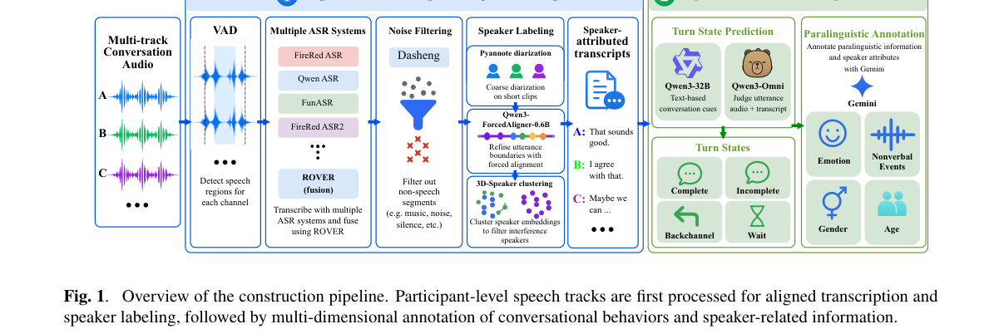

**Why this ranks #7**: 数据贡献，且直接对准 10-07/10-08 日报反复出现的多方话轮建模难题。

---

### 8. STEMMA: Song-to-Stem Multi-Audio Reasoning for Large Audio Language Models

**arXiv**: [2610.11884](https://arxiv.org/abs/2610.11884) | **Score**: 7.0 (relevance 7 x 0.7 + quality 7 x 0.3) | **Tags**: audio-LM | **Categories**: cs.SD, eess.AS | **Pages**: 5

**Authors**: Hoyeol Sohn, Wonil Kim, Keunhyoung Kim, Sangeun Kum, Taehyoung Kim, Dongjoo Moon, Theerasak Charoenchob, Teeratep Weerapang, Jongpil Lee, Juhan Nam

**Affiliation**: 1 Graduate School of Culture Technology, KAIST, Daejeon, Republic of Korea

**Abstract**

> Music understanding often requires comparing excerpts and reasoning about relationships among songs, sections, and stems. However, existing large audio-language models (LALMs) and music question-answering datasets typically operate on single recordings or compare independently sampled tracks with no known production relationship. We introduce STEMMA, a multi-audio music question-answering framework built around production provenance: whether excerpts originate from the same track or section, and which stems belong to which mixtures. Because such relations are sparse under conventional audio-first sampling, STEMMA adopts a relation-first construction strategy: it first specifies a target relation and then queries the catalog for excerpts that satisfy it and hard negatives that do not. Labels are determined directly from catalog provenance rather than generated by a language model from metadata. We build STEMMA-Bench for evaluation and a track-disjoint training set, STEMMA-Instruct. Fine-tuning two LALMs on STEMMA-Instruct improves multi-audio reasoning, with the largest gains on structural relations directly determined by the catalog, while preserving single-audio music understanding.

**Key findings**

- **Finding**: 既有 LALM 与音乐 QA 数据集通常基于单条录音，或比较独立采样的曲目而**没有已知的制作关系**。

- **Finding**: STEMMA 提出多音频音乐问答框架，面向歌曲-段落-音轨之间的关系推理。

- **Inference**: 「独立采样且无关系」意味着问题本身可能没有唯一答案——数据集设计缺陷而非模型能力缺陷，这类问题在基准中相当常见。

- **Recommendation**: 与 10-07 日报的 Full-Duplex 评测论断同源：先检查数据与协议是否允许正确回答，再讨论模型能力。

**Key figures**

*Framework / architecture - Figure 1 Overview of the proposed relation-first generation pipeline. Hierarchical music units are indexed by structural and musical-attribute relations. A relation is stated over catalog fields, and t*

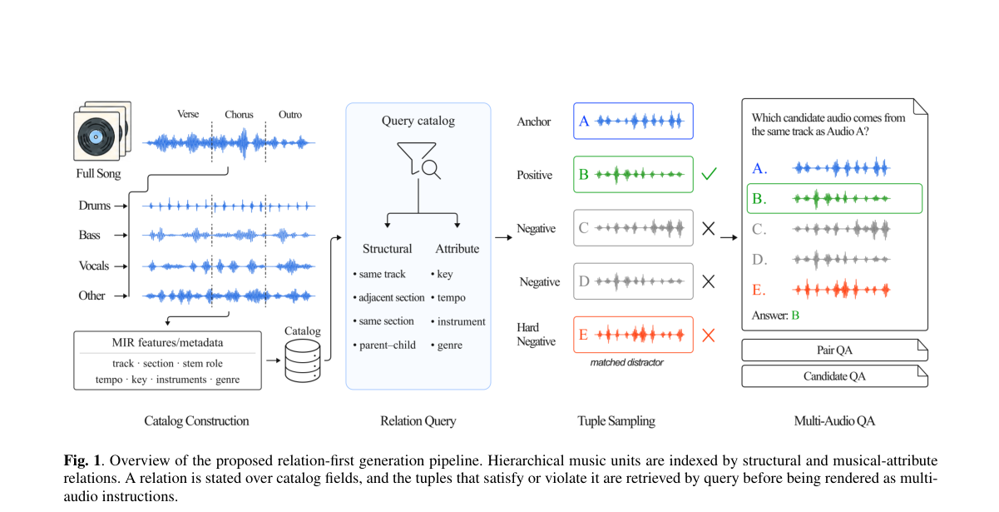

**Why this ranks #8**: 指出既有音乐 QA 的一个根本缺陷：比较对象之间没有已知关系，答案因此不可判定。

---

### 9. MiDashengLM-Spatial: Unifying General Audio Understanding and Spatial Awareness

**arXiv**: [2610.11156](https://arxiv.org/abs/2610.11156) | **Score**: 7.0 (relevance 7 x 0.7 + quality 7 x 0.3) | **Tags**: audio-LM | **Categories**: cs.SD, eess.AS | **Pages**: 24

**Authors**: Jinbo Hu, Hang Su, Lichun Fan, Heinrich Dinkel, Gang Li, Zhanchen Dai, Yiru Zhang, Chang Liu, Peng Wang, Junnan Wu, Jian Luan, Cong Zou

**Affiliation**: Xiaomi Inc., China

**Abstract**

> Large audio-language models (LALMs) have achieved strong performance in general audio understanding, yet most are designed for monaural input and discard the inter-channel cues essential for spatial perception. In contrast, existing spatial audio-language models are purpose-built for spatial tasks and fail to capitalize on the general understanding capabilities of monaural LALMs. We present MiDashengLM-Spatial, the first open-source end-to-end unified audio-language model, to our knowledge, which supports both general audio understanding and spatial awareness within a single architecture. It extends MiDashengLM with a spatial audio encoder, Spatial-Dasheng, integrated through a hierarchical semantic-to-spatial conditioning module that injects intermediate semantic representations into the spatial branch at multiple depths while preserving the original semantic pathway. To provide spatial audio-language supervision at scale, we develop a data synthesis pipeline that renders diverse spatial acoustic scenes with scene-level spatial descriptions and question-answer pairs. Experiments show that Spatial-Dasheng achieves strong performance on sound event localization and detection in real-world scenes, and that MiDashengLM-Spatial substantially outperforms existing LALMs on spatial understanding and reasoning benchmarks. Meanwhile, it remains competitive with state-of-the-art 8B-scale LALMs on diverse monaural benchmarks, demonstrating that spatial awareness can be acquired without compromising general audio understanding. The source code and model checkpoint are available at https://github.com/xiaomi-research/midashenglm-spatial and https://huggingface.co/mispeech/midashenglm-spatial.

**Key findings**

- **Finding**: 多数 LALM 为单声道输入设计，丢弃空间感知必需的通道间线索。

- **Finding**: 既有空间音频语言模型为空间任务专门设计，无法利用单声道 LALM 的通用理解能力。

- **Finding**: MiDashengLM-Spatial 试图统一通用音频理解与空间感知。

- **Inference**: 「各自强但都不完整」的空缺在音频栈里反复出现（单声道 LALM、专用空间模型、分离模型、生成模型）；统一的难点不在容量而在训练数据的通道对齐。

- **Recommendation**: 空间音频方向的读者注意；与本批 SepGen（4D 视听场景）同属空间音频-视觉联合路线。

**Key figures**

*Framework / architecture - Figure 1 An example of a typical spatial acoustic scene. Left: a top-down view of a room, illustrat- ing the categories, positions, and movement trajectories of sound events. Right: the timeline of t*

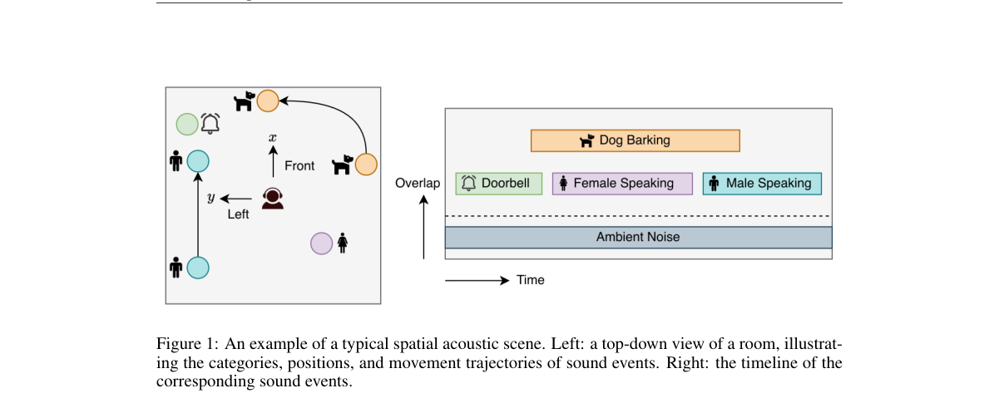

*Main result - Figure 2 The overall architecture of MiDashengLM-Spatial. The left part shows the details of the dual-branch audio encoder.*

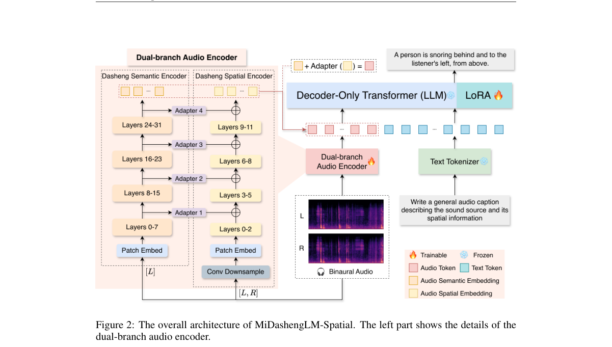

**Why this ranks #9**: 明确指出一组模型各自强但都不完整的空缺，并尝试统一。

---

### 10. EgoVoice: Proactive Spoken Assistance from Egocentric Multimodal Streams

**arXiv**: [2610.12248](https://arxiv.org/abs/2610.12248) | **Score**: 7.0 (relevance 7 x 0.7 + quality 7 x 0.3) | **Tags**: audio-LM, duplex-voice | **Categories**: cs.CL, cs.CV, cs.SD | **Pages**: 25

**Authors**: Heeseung Kim

**Affiliation**: Department of AI, University of Seoul | and research prototypes like Google Project Astra

**Abstract**

> Wearable augmented reality (AR) assistants are moving toward continuous real-world interaction, where they perceive the user's activity through first-person video and audio and provide timely spoken guidance without being explicitly asked. While proactive video assistants, spoken dialog systems, and egocentric task understanding have each advanced rapidly, existing systems do not address the joint problem of deciding when to speak and what to say from continuous first-person streams. We introduce EgoVoice, a framework for training and evaluating proactive egocentric spoken assistants. From HoloAssist video recordings of real human instructors, we construct clean audio streams through source separation and speech resynthesis, and convert each video session into a format where the model must decide at each moment whether to remain silent or provide spoken guidance. We fine-tune an omni-modal LLM with our data, and further improve its proactive intervention behavior with direct preference optimization. Experiments across closed and open-source models show that existing systems rarely produce well-timed, meaningful proactive interventions, while EgoVoice yields clear improvements in intervention timing, content relevance, and human preference over the zero-shot backbone.

**Key findings**

- **Finding**: 可穿戴 AR 助手正走向持续真实交互，从第一人称视听流感知活动并**在未被询问时**提供口头指导。

- **Finding**: 主动式视频助手、口语对话系统与第一人称任务理解各自进展迅速，但现有系统未处理三者的联合问题（EgoVoice）。

- **Inference**: 「主动」这一形态把双工语音的关键问题从「响应」换成「打断与时机」——而时机控制恰恰是双工模型最难的部分，因此这条路线对双工能力的要求高于对话本身。

- **Recommendation**: AR/可穿戴交互的读者注意；与本批双工三部曲对照，主动式场景对时机的要求更苛刻。

**Key figures**

*Framework / architecture - Figure 1 Overview of proactive egocentric spoken assistance. An AR assistant receives first-person video and audio (left), decides whether to remain silent or intervene (center), and provides spoken*

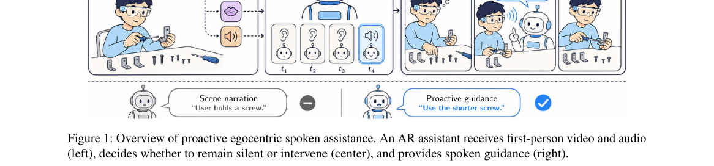

*Main result - Figure 2 Overview of the EgoVoice framework. We process HoloAssist recordings into clean training data (left, Section 3.1), fine-tune MiniCPM-o 4.5 to learn listen-or-speak behavior (top right, EgoVo*

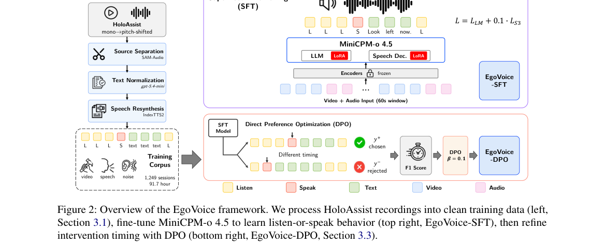

**Why this ranks #10**: 把「主动式」（不被询问就说话）与语音助手结合，是一个新的交互形态。

---

## Footer

- Total papers reviewed across all 5 tracks: 50 (from 643 scanned)
- audio_lm track final top-10: 10
- Wild-cards in this track: 0
- Figure assets: `res/` (shared across tracks)

Generated by `mine-arxiv-daily-digest` skill. Sister file: `2026-10-09_audio_lm_entry.md`.
