# ArXiv Daily Digest - 2026-10-09 (具身智能与世界模型, 10 papers)

**Generated**: 2026-10-09 17:00 CST

**Source**: arXiv cs.CV, cs.SD, eess.AS, cs.CL, cs.AI, cs.RO, cs.LG submissions, window 2026-10-08 UTC (latest announced batch as of 2026-10-09 17:00 CST)

**Track**: embodied (top 10 of 643 papers scanned, 50 full reads)

**Scope**: zero-shot sim-to-real VLA for mobile manipulation, Bayesian spatial world models under intermittent perception, path-creative navigation through embodied interaction, generative retargeting for dexterous manipulation, cross-sensor tactile transfer, dexterous manipulation from a single human demo, cluttered-scene dexterous grasping, weaving heterogeneous demos into long-horizon skills, humanoid world action models, generalist humanoid control from human data

---

本批具身线的重心明确落在**灵巧操作的数据来源**上，且把它拆成了三个彼此独立的障碍。**Generative Neural Retargeting** 指出第一个：IK 重定向能高效把人类动作映射到机器人，但**忽略动力学**，而灵巧操作恰恰是动力学受限的任务——这说明「用人类数据」与「用动力学正确的数据」之间存在本质张力。**Dex-One2Many** 指出第二个：许多方法严格模仿被演示的动作，把「视频里出现过的轨迹」当成唯一正确答案，而成功轨迹是一个集合，从单条演示学单条轨迹必然过拟合。**OmniDex** 指出第三个：杂乱场景最贴近真实应用，但其中学习抓取受制于数据随场景与物体组合爆炸的稀缺。三篇合起来说明：用人类数据做灵巧操作不是「找到一个更好的重定向算法」的问题。

另有两篇提出新的任务设定。**Acting from Belief, Looking When Needed** 研究间歇感知下的导航——当另一任务临时占用共享传感器时，基于内部空间信念行动、只在必要时再看；这是本批唯一把**观测时机**当作决策变量的世界模型工作，而多数世界模型假设观测被动可得。**Path-Creative Navigation** 则指出导航任务本身被定义得过窄：既有方法假设环境固定、只在既有自由空间内搜索，但路线可能��铰接结构、可移动物体或行人阻断，抵达目标因而需要与环境的具身交互。

顶部两篇是 SimVLA（零样本 sim-to-real VLA 用于移动操作，作者指出这个组合仍基本未被探索）与 TACROSS（跨异构触觉传感器的人体触觉系统，接续 10-08 观察到的触觉升温）。

---

## Top 10 - 具身智能与世界模型

### 1. SimVLA: Zero-Shot Sim-to-Real VLA Learning for Mobile Manipulation

**arXiv**: [2610.11248](https://arxiv.org/abs/2610.11248) | **Score**: 9.0 (relevance 9 x 0.7 + quality 9 x 0.3) | **Tags**: embodied-ai, sim-to-real | **Categories**: cs.RO | **Pages**: 31

**Authors**: Kyoungin Baik, Youngwoon Lee

**Affiliation**: 1Yonsei University , 2Seoul National University | 2024; Black et al., 2024, 2025; Kim et al., 2025; NVIDIA et al., 2025). However, unlike web-scale

**Abstract**

> Large-scale, diverse datasets have driven the success of LLMs and VLMs. But VLAs for robotics remain limited by the cost and complexity of real-world data collection. While simulation offers a scalable alternative, its potential for sim-to-real VLA learning in mobile manipulation remains largely underexplored. We introduce SimVLA, an end-to-end framework that trains VLAs entirely on synthetic simulation data without teleoperation for mobile manipulation. SimVLA is first pre-trained on two complementary simulation-derived datasets: SimAction, a large-scale robot action dataset spanning 35 diverse mobile manipulation tasks, generated by composing atomic skills, and SimVQA, which leverages privileged simulator state to provide spatial, geometric, and subtask-level visual-language supervision. We further post-train SimVLA on a mixture of SimAction and SimDeploy, a dataset collected from policy rollouts across diverse simulated environments. We evaluate SimVLA on tasks including restocking, pouring, and cleaning, and show zero-shot transfer to real-world mobile manipulation, including real home environments. SimVLA outperforms policies trained on 50 in-domain real-world demonstrations, suggesting that simulation can enable scalable sim-to-real mobile manipulation. We further demonstrate the value of multiple complementary forms of supervision for effectively leveraging simulation in VLA training.

**Key findings**

- **Finding**: 机器人 VLA 受真机数据采集成本与复杂度限制；仿真可扩展，但其用于移动操作的 sim-to-real VLA 学习潜力**基本未被探索**。

- **Finding**: SimVLA 提出端到端框架，在移动操作上做零样本 sim-to-real 的 VLA 学习。

- **Inference**: 移动操作同时需要导航与操作的联合策略，而这两类任务的失败模式不同（定位误差 vs 接触误差）；单一 sim-to-real gap 的说法在这类组合任务上可能过于笼统。

- **Recommendation**: 被精读的三篇之一；仿真到真机的数据构造与失败归因值得逐项对照。

**Key figures**

*Framework / architecture - Figure 1 SimVLA: Zero-shot sim-to-real framework for mobile manipulation.*

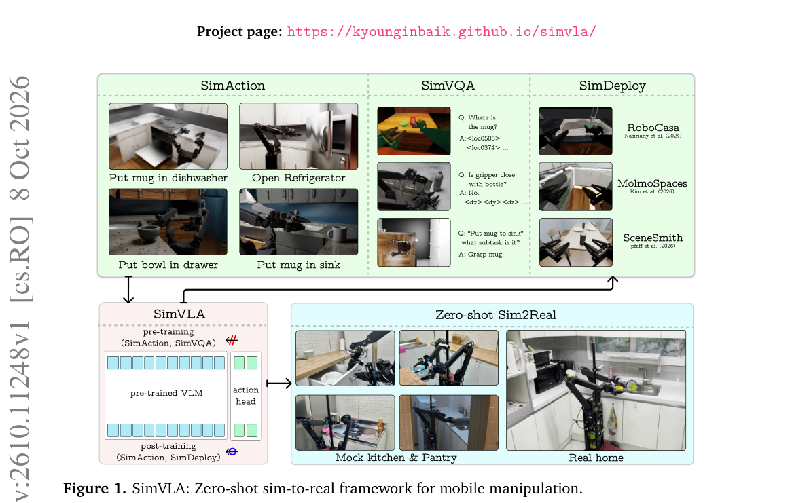

*Main result - Figure 2 Overview of SimVLA Training. During pre-training, SimVLA jointly optimizes continuous action prediction, tokenized action prediction, and SimVQA supervision. During post-training, SimVLA is*

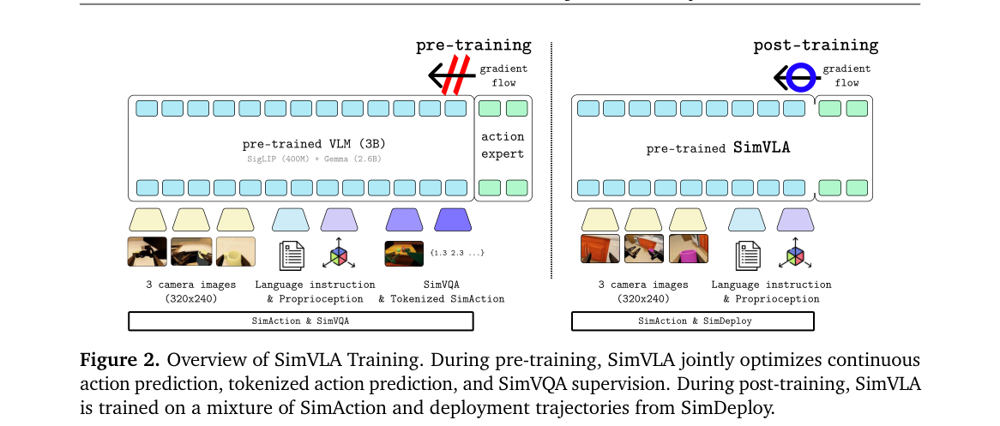

**Why this ranks #1**: 本批相关性最高的一篇，且它选的是一个被集体忽略的组合：VLA + 移动操作 + 零样本 sim-to-real。

---

### 2. Acting from Belief, Looking When Needed: A Bayesian Spatial World Model for Navigation under Intermittent Perception

**arXiv**: [2610.11591](https://arxiv.org/abs/2610.11591) | **Score**: 9.0 (relevance 9 x 0.7 + quality 9 x 0.3) | **Tags**: world-model | **Categories**: cs.RO | **Pages**: 8

**Authors**: Feihong Yang, Xiang Long, Jincheng Yu, Jianfei Zhang, Guangjun Ge, Chao Wang, Yu Wang

**Affiliation**: Wang are also with the Department of Electronic Engineering, Tsinghua Uni-

**Abstract**

> Robot navigation commonly uses wide-coverage, high-frequency sensing to reduce partial observability; this reliance becomes restrictive when another task temporarily redirects a shared sensor from navigation, interrupting navigation-relevant observations. We study navigation under intermittent perception: acting from an internal spatial belief and looking again only when execution needs a new observation, potentially freeing the shared sensor for other tasks between navigation observations. ALONE, a Bayesian spatial world model, propagates a structured spatial belief using executed actions and corrects it with selectively acquired observations; learned priors over common geometric structures infer unobserved structure from available observation history. It decodes the belief into a spatial estimate for the motion-planning module and predicts a reliability map expressing confidence in the estimate's accuracy. ALONE requests an observation only if insufficient reliability hinders navigation and new evidence should make relevant-region spatial information more reliable; otherwise, it continues acting from the propagated belief. We instantiate ALONE for drone navigation with intermittent single-camera depth images. Across two simulated scene families, it achieves 98% and 97% closed-loop success at a 10 Hz decision rate. Among successful trials, median fractions of decision steps requiring a new depth observation are only 0.9% and 1.3%, respectively, demonstrating high navigation success with substantially reduced observation demand. Real-world indoor flight experiments further validate navigation under intermittent depth observations, with all 10 trials successful.

**Key findings**

- **Finding**: 导航通常依赖宽覆盖高频传感降低部分可观测性；当另一任务临时占用共享传感器时，导航观测被中断。

- **Finding**: 作者研究**间歇感知**下的导航：依据内部空间信念行动，仅在必要时重新观测（Acting from Belief, Looking When Needed）。

- **Inference**: 这是本批唯一一篇把「观测时机」当作决策变量的世界模型工作——多数世界模型假设观测被动可得，而预算受限的主动观测把世界模型变成了一个带成本的信息获取问题。

- **Recommendation**: 被精读的三篇之一；「何时该看」的决策边界如何定义（是学出来的还是规则给定）决定该方法能否迁移到其他传感受限场景。

**Key figures**

*Framework / architecture - Figure 1 ALONE for drone navigation. Indoor real-world flight experiment among regularly arranged obstacles: ALONE continues selecting and executing actions from a maintained spatial belief, requesting*

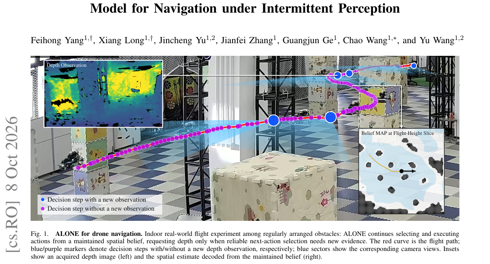

*Main result - Figure 2 ALONE framework. Executed actions propagate a structured spatial belief, and selectively acquired observations correct it. A decoded spatial estimate is provided to the motion-planning module,*

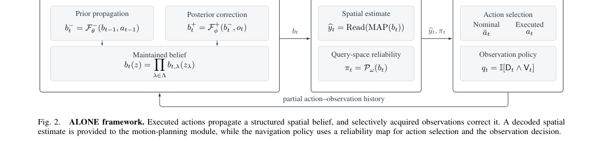

**Why this ranks #2**: 把「传感器不是连续可用的」当作默认而非异常，是一个真实的部署约束。

---

### 3. Towards Path-Creative Navigation: Robot Navigation through Embodied Interaction

**arXiv**: [2610.11072](https://arxiv.org/abs/2610.11072) | **Score**: 8.7 (relevance 9 x 0.7 + quality 8 x 0.3) | **Tags**: embodied-ai | **Categories**: cs.RO | **Pages**: 8

**Authors**: Haoyu Xi, Siwei Cheng, Xiangyuan Liu, Brenda Li, Wei Zhang

**Affiliation**: 1School of Computer Science, Shanghai Jiao Tong University, Shanghai, | 2College of Information Science and Technology, Eastern Institute of | 3School of Mechanical and Power Engineering, Zhengzhou university, | 4University of Waterloo

**Abstract**

> Autonomous navigation in cluttered and constrained environments typically assumes a fixed environment and searches only for paths within existing free space. However, a route can be blocked by an articulated structure, a movable object, or a pedestrian, and reaching the goal may therefore require appropriate embodied interaction with the environment. This paper formulates Path-Creative Navigation (PCN), a navigation paradigm in which the robot recovers free space by coordinating locomotion and embodied interaction, and addresses one class of PCN tasks with a mapless framework. The vision-LiDAR-odometry framework integrates local observations, obstacle geometry, and robot-state estimates through a unified navigation system, providing stable semantic and geometric information for navigation and interaction. The traversability-aware decision method utilizes visual and LiDAR distance information to determine whether a blockage is actionable and whether it can be safely bypassed, enabling the robot to interact only when necessary while supporting articulated structure pushing, movable object pushing, obstacle avoidance, and pedestrian requests. We design simulation scenarios and evaluate different methods in both simulation and two real-world tasks that cannot be completed by conventional navigation alone without embodied interaction. These results demonstrate that our framework achieves higher task completion than the baseline methods by coordinating navigation and interaction in cluttered and constrained environments. Code is available at:{https://anonymous.4open.science/r/path-creative-navigation/}.

**Key findings**

- **Finding**: 既有导航假设环境固定，只在既有自由空间内搜索路径。

- **Finding**: 但路线可能被**铰接结构、可移动物体或行人**阻断，抵达目标因而需要与环境的适当具身交互；作者将这种情形形式化为路径创造性导航。

- **Inference**: 「只能绕行」把导航降级为在给定自由空间内的路径规划，而真实环境里导航常常必须包含交互（开门、推开、移动障碍）；这相当于把导航任务定义得过窄。

- **Recommendation**: 与本批 3DTexMOR（3D 物体移除）对照：两篇分别从导航侧与重建侧处理「环境中的可动物体」。

**Key figures**

*Framework / architecture - Figure 1 Real-world experiments on the Unitree G1 humanoid robot. The experiments include manipulation and social-interaction tasks that require the robot to continuously coordinate navigation, obstacl*

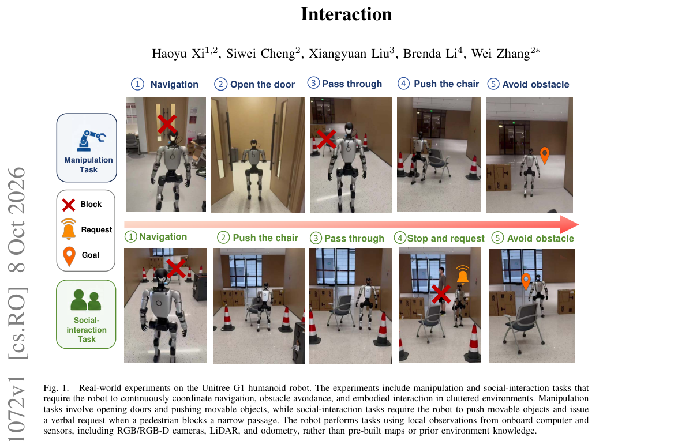

*Main result - Figure 2 Overview of the framework. Vision, depth, LiDAR, and odometry are integrated to obtain stable object targets ot,i and local geometric observations for closed-loop interaction. The traversabili*

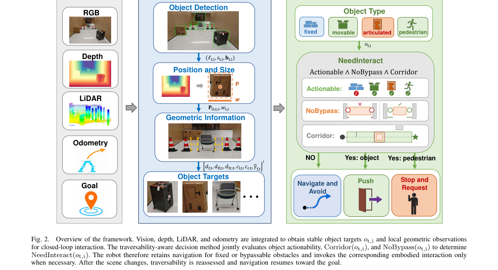

**Why this ranks #3**: 指出导航任务本身的一个被普遍忽略的前提：环境是固定的、只能绕行。

---

### 4. Generative Neural Retargeting for Human-to-Robot Dexterous Manipulation

**arXiv**: [2610.12440](https://arxiv.org/abs/2610.12440) | **Score**: 8.3 (relevance 8 x 0.7 + quality 9 x 0.3) | **Tags**: embodied-ai | **Categories**: cs.RO | **Pages**: 40

**Authors**: Dechen Gao, Yue Yang, Ben Abbatematteo, Nathan Godwin, Pengcheng Wang, Roger Boldu, Steven Man, Zhiyang Dou, Chuan Qin, Sho Nakagome, Eric Whitmire

**Affiliation**: 4UC Berkeley

**Abstract**

> Human demonstrations are a scalable data source for learning dexterous manipulation, but the embodiment gap prevents human motion from being executed directly on robots. Inverse kinematics (IK) retargets human motion to robots efficiently but ignores dynamics, often producing infeasible motions. Reinforcement learning (RL) and sampling-based model predictive control (MPC) are commonly employed to yield dynamically feasible motions, but both are sample-inefficient and sensitive to hyperparameters. RL suffers from costly and unstable training and tedious reward engineering; MPC avoids policy optimization, yet retargets each trajectory in isolation, and solving one does not make the next easier. Sampling cost grows rapidly with dataset size and task difficulty. We hypothesize that dynamically feasible trajectories concentrate near a low-dimensional manifold shared across demonstrations, so that retargeting can be reduced to sampling from that manifold, conditioned on human motion, rather than solving a fresh optimization problem for every demonstration. We propose \textbf{Generative Neural Retargeting} (GNR), which uses a flow matching model to sample feasible trajectories. GNR outperforms MPC with only $8.5\%$ of the samples required by MPC, achieving a success rate of $56.20\%$ compared to $27.20\%$ for MPC. GNR can be used for scalable and efficient retargeting of large-scale, long-horizon, and millimeter precision human demonstrations: by applying GNR within a real-to-sim data engine, we produce a dexterous manipulation dataset with dense contact-force labels, spanning $223$k demonstrations and $3.3$k object geometries.

**Key findings**

- **Finding**: IK 重定向能高效映射人类动作到机器人，但忽略动力学，常产生不可行的动作。

- **Finding**: RL 与采样式 MPC 更能处理动力学但代价高；该文提出生成式神经重定向作为折中。

- **Inference**: IK 的高效来自它忽略动力学，而灵巧操作恰恰是动力学受限的任务——这个矛盾说明「用人类数据」与「用动力学正确的数据」之间存在本质张力，重定向方法只能缓解不能消除。

- **Recommendation**: 与 Dex-One2Many、OmniDex 构成今天的灵巧操作三部曲（三篇分别处理数据来源、人形泛化、场景多样性），建议连读。

**Key figures**

*Framework / architecture - Figure 1 We propose Generative Neural Retargeting (GNR), a scalable and generalizable retar- geting method that retargets large-scale, long-horizon and high-precision human demonstrations for five-fi*

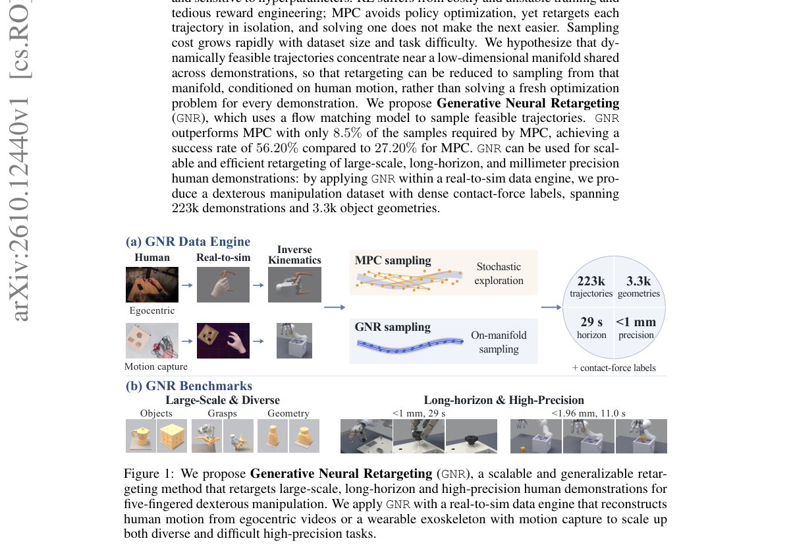

*Main result - Figure 2 The human-to-robot data engine. (a) A pipeline retargets motion-capture recordings for the difficulty axis and egocentric demonstrations for the diversity axis into candidate robot trajecto-*

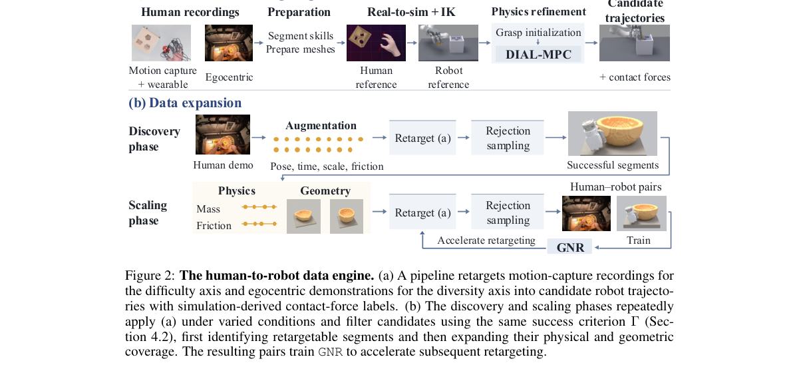

**Why this ranks #4**: 把 IK 重定向「忽略动力学」这一缺点指认为灵巧操作数据利用的核心瓶颈。

---

### 5. TACROSS: An Efficient and Low-Cost Scalable Human Touch System Across Heterogeneous Tactile Sensors for Dexterous Robot Learning

**arXiv**: [2610.11945](https://arxiv.org/abs/2610.11945) | **Score**: 8.0 (relevance 8 x 0.7 + quality 8 x 0.3) | **Tags**: embodied-ai | **Categories**: cs.LG, cs.RO | **Pages**: 9

**Authors**: Bo Chen, Huanzhang Hu, Junyang Ma, Bo Yue, Fangdi Yu, Haijier Chen, Xianxin Lai, Shuyu Pan, Zhen Yang, Xiaoquan Sun, Wenze Cui, Zhongliang Jiang

**Affiliation**: 1The University of Hong Kong 2The Chinese University of Hong Kong (Shenzhen) 3Ocean University of China | 4Wuhan University 5Wuhan Textile University 6INFIFORCE

**Abstract**

> Collecting tactile demonstrations on robots is costly and slow, motivating the use of lower-cost human tactile gloves for scalable data collection. However, human capacitive/piezoresistive gloves and robotic tactile sensors differ fundamentally in transduction principle, sensor layout, spatial resolution, and dynamic response, making alignment of raw sensor channels ill-posed. To address this problem, we present TACROSS, a scalable system for learning from human touch and transferring it to robots that bridges this heterogeneity by aligning tactile streams at the level of contact events rather than raw sensor values. The hardware component of TACROSS integrates a piezoresistive glove with five layers and a cost of USD 10.86 with 285 sensing points. To align contact semantics, we design canonicalizers and residual adapters that map heterogeneous signals into a shared tactile latent with 256 dimensions via a temporal Transformer with attention across fingers. We further introduce a robot-grounded policy learning scheme in which robot demonstrations provide the sole source of ground-truth action supervision, while human demonstrations support tactile representation learning and provide confidence-weighted auxiliary supervision through valid retargeted hand targets. We evaluate our system on four contact-rich manipulation tasks. Compared to conventional teleoperation, our proposed system achieves a 3.5-fold efficiency improvement while reducing demonstration acquisition equipment cost by 95.7%. We will open-source the TACROSS hardware and software system and publicly release a tactile dataset comprising over 150 hours of recordings. Project page: https://tacross-touch-project.github.io/.

**Key findings**

- **Finding**: 机器人触觉演示采集昂贵缓慢 motivates 使用低成本人体触觉手套。

- **Finding**: 但两类设备在转换原理、布局、空间分辨率与动态响应上根本不同，**原始传感通道的对齐**成为瓶颈；TACROSS 构建跨异构触觉传感器的人体触觉系统。

- **Inference**: 四类差异里「转换原理」最难对齐——电容与压阻的物理响应不可互相推导，因此跨设备迁移只能学映射而非复用信号。

- **Recommendation**: 触觉 sim-to-real 的读者注意；与 10-08 日报的 Factorized Tactile Representation（把接触响应分解为几何/力分布/节奏）对照，一篇处理表征、一篇处理传感器对齐。

**Key figures**

*Framework / architecture - Figure 1 TACROSS overview. (a) Synchronized human demonstrations with egocentric RGB, hand pose, and tactile observations. (b) Contact canonicalization and sensor-specific adaptation align piezoresisti*

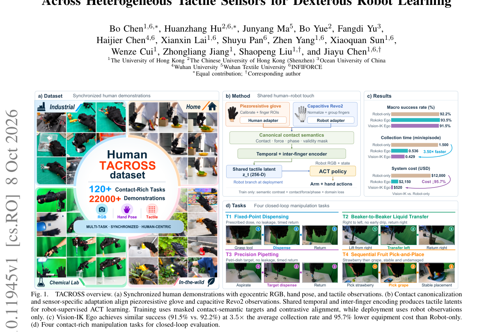

*Main result - Figure 2 TACROSS glove: sensing coverage,and five-layer structure..*

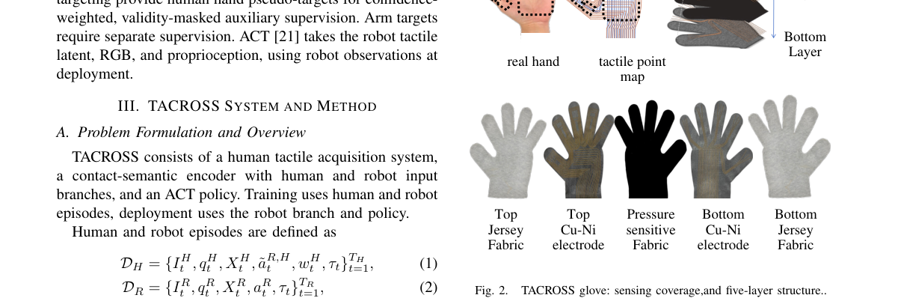

**Why this ranks #5**: 承接 10-08 日报观察到的触觉子方向升温，今天这篇解决的是跨传感器迁移这个具体瓶颈。

---

### 6. Dex-One2Many: Learning Dexterous Manipulation from a Single Human Demonstration

**arXiv**: [2610.12470](https://arxiv.org/abs/2610.12470) | **Score**: 8.0 (relevance 8 x 0.7 + quality 8 x 0.3) | **Tags**: embodied-ai | **Categories**: cs.CV, cs.RO | **Pages**: 49

**Authors**: Jusuk Lee, Sungha Kim, Yeonsoo Park, Jonguk Cheon, Yoonkyo Jung, Yongjun You, H. Jin Kim, Jia-Bin Huang, Furong Huang, Youngseok Jang, Seungjae Lee

**Affiliation**: 1Seoul National University | 2University of Maryland, College Park

**Abstract**

> While learning dexterous manipulation from a single human video offers a promising alternative to costly robot demonstrations, many recent methods predominantly imitate demonstrated motions. Such strict motion matching often limits generalization to initial object poses, goal poses, and grasps not shown in the video. Alternatively, discovering a policy via reinforcement learning (RL) allows for broad generalization, but without prior guidance, it struggles with high-dimensional exploration in complex, multi-stage tasks. To address these coupled generalization and exploration challenges, we present Dex-One2Many, a real-to-sim-to-real framework that learns a generalizable dexterous manipulation policy from a single human video. Our key insight is to abstract the video into sequential scene graphs that guide RL, enabling efficient exploration while preserving broad generalizability. The graphs serve as generative constraints for sampling diverse reset states and provide dense rewards for each stage. Because the graphs constrain relations rather than exact poses, these reset states cover object poses and grasps beyond the video, while initializing each stage from them with dense rewards keeps exploration short and guided. Trained entirely in simulation, Dex-One2Many transfers zero-shot to a real multi-fingered hand. Across five tool-use and manipulation tasks, Dex-One2Many exceeds baselines by 6.5% in seen configurations, while its robust generalization widens this gap to 71% in unseen scenarios.

**Key findings**

- **Finding**: 从单段人类视频学习灵巧操作是有前景的替代方案，但许多方法主要**模仿被演示的动作**。

- **Finding**: 严格的运动匹配限制了它们对初始物体位姿、目标位姿以及视频中未出现抓取的泛化；Dex-One2Many 转而通过其他途径发现策略。

- **Inference**: 严格运动匹配把「视频里出现过的轨迹」当成唯一正确答案，而任务的成功轨迹是一个集合——从单条演示学单条轨迹必然过拟合到该轨迹。

- **Recommendation**: 与 Generative Neural Retargeting 对照：一篇处理本体差异，一篇处理演示的信息量不足，是「用人形数据」的两个独立障碍。

**Key figures**

*Framework / architecture - Figure 1 From one human video to many dexterous behaviors. Given one human video of a manipulation task, Dex-One2Many learns a dexterous policy entirely in simulation and deploys it zero-shot in the*

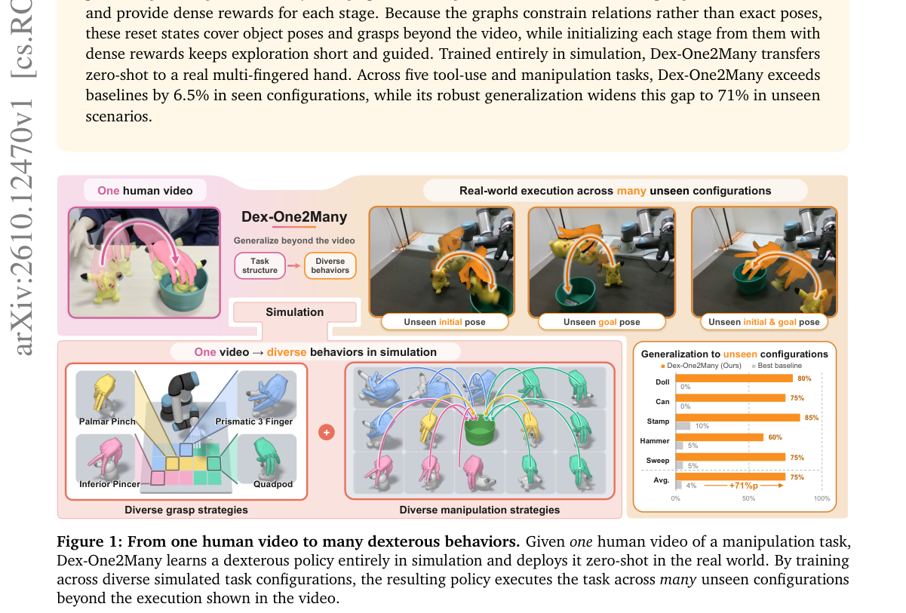

*Main result - Figure 2 Overview of Dex-One2Many. (1) From a single human video, a VLM extracts a stage-wise scene graph of object relations. (2) Each stage graph constrains the sampling of object poses and synthes*

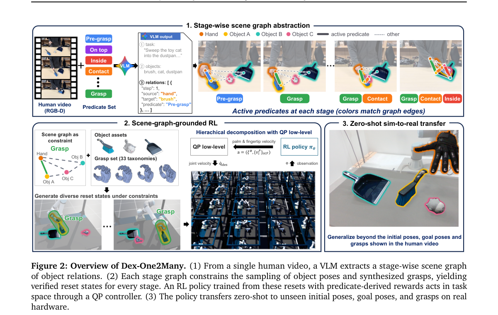

**Why this ranks #6**: 指出「模仿动作」这一主流做法在泛化上的结构性上限。

---

### 7. OmniDex: Scaling Dexterous Hand Grasping to Diverse Cluttered Scenes

**arXiv**: [2610.11194](https://arxiv.org/abs/2610.11194) | **Score**: 8.0 (relevance 8 x 0.7 + quality 8 x 0.3) | **Tags**: embodied-ai | **Categories**: cs.CV, cs.RO | **Pages**: 20

**Authors**: Naiyu Fang, Zhongjin Luo, Yuxin Mo, Siyuan Huang, Jianbo Liu, Yufei Liu, Zheyuan Zhou, Chenkai Jin, Xiaogang Wang, Hongsheng Li

**Affiliation**: 2CUHK, MMLab | 4Tongji University | 5Shanghai Jiao Tong University | 6Zhejiang University

**Abstract**

> Dexterous grasping is the foundational primitive in embodied AI, demanding massive data to train robust models. As real-world data collection is expensive, simulation has become the mainstream paradigm. Yet, while cluttered scenes best reflect real-world applications, learning to grasp within them is bottlenecked by a critical scarcity of large-scale data. To resolve this, we curate high-quality 3D objects and supporting bases, proposing a scalable seed-and-filter strategy that bypasses sluggish scene-level optimization. This yields an unprecedented benchmark comprising over 2.6 million scenes and 0.4B scene-specific grasp ground truths, featuring diverse realistic layouts paired with rich semantic and geometric observations. Furthermore, we introduce the OmniDex model to overcome the grasp multimodality and last-millimeter precision errors plaguing current generative models. By coupling Soft Winner-Takes-All learning with human-inspired physical constraints during training, and utilizing physics-driven ranking, our approach achieves robust dexterous grasping without the latency of post-optimization. Experimental results show that OmniDex model achieves state-of-the-art performance and strong generalization across diverse scenes, views, and unseen objects.

**Key findings**

- **Finding**: 灵巧抓取需要海量数据训练鲁棒模型；真实采集昂贵使仿真成为主流。

- **Finding**: 但杂乱场景最贴近真实应用，而在其中学习抓取受制于大规模数据的**严重稀缺**——OmniDex 把灵巧手抓取扩展到多样杂乱场景。

- **Inference**: 杂乱场景要求每个物体独立的抓取数据，数据量随场景数与物体数的组合爆炸——这是纯合成的根本瓶颈，也是生成式重定向（#4）试图缓解的问题。

- **Recommendation**: 灵巧抓取方向的读者注意；与本批 Generative Neural Retargeting、Dex-One2Many 构成三角。

**Key figures**

*Framework / architecture - Figure 1 Overview of OmniDex, the largest benchmark for dexterous grasping in cluttered scenes to date. Left: Multi-view RGB- D and instruction masks paired with scene-specific grasp poses. Right: A s*

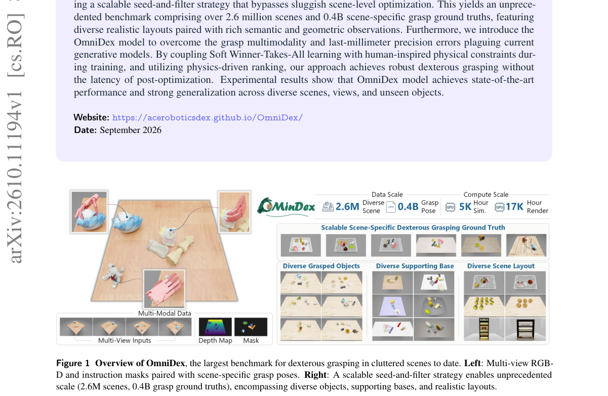

*Main result - Figure 2 Seed-and-filter generation pipeline. Our two-stage framework generates scene-valid grasps by: (1) constructing a reusable seed grasp library in free space, and (2) simulating cluttered scenes*

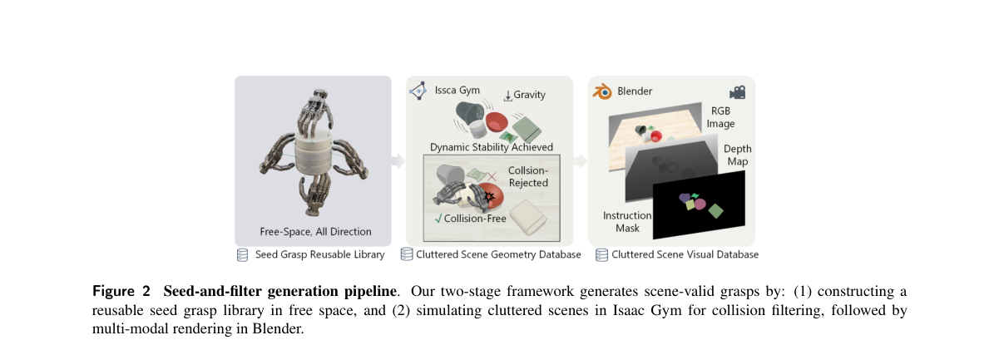

**Why this ranks #7**: 「场景多样性」与「数据量」的正相关被指出——这是仿真数据集设计的核心张力。

---

### 8. SkillWeave: Weaving Heterogeneous Demonstrations into Long-Horizon Manipulation Skills

**arXiv**: [2610.12046](https://arxiv.org/abs/2610.12046) | **Score**: 7.7 (relevance 8 x 0.7 + quality 7 x 0.3) | **Tags**: embodied-ai | **Categories**: cs.RO | **Pages**: 8

**Authors**: Ryosei Tamura, Xiaoxiang Dong, Uksang Yoo, Yuemin Mao, Romina Mir, Jonathan Francis, Jeffrey Ichnowski

**Affiliation**: 1 Robotics Institute, Carnegie Mellon University, USA. | 2 Department of Computer Science, Keio University, Japan. | 3 College of Engineering, University of California, Berkeley, USA.

**Abstract**

> Dexterous manipulation requires both large-scale task progression and precise contact-rich interaction, making it challenging to collect demonstrations that effectively support both regimes. We present SkillWeave, a heterogeneous demonstration framework for long-horizon dexterous manipulation that combines teleoperation for coarse reaching and transport with kinesthetic teaching for precise, contact-rich skills. To address the visual mismatch introduced by the demonstrator's presence during kinesthetic data collection, we propose an object-mask-conditioned diffusion policy that uses offline object segmentation for training supervision and a lightweight learned mask predictor at deployment, avoiding online segmentation and image inpainting. To mitigate distribution shift between independently trained sub-task policies, we introduce successor-aware terminal steering, which selects among actions sampled from the predecessor policy to guide the system toward states supported by the successor's demonstrated initial-state distribution. Across three real-world long-horizon tasks, SkillWeave achieves 27% average end-to-end success. Mask-conditioned kinesthetic policies improve dexterous sub-task success to an average of 65%, while successor-aware handoffs achieve an average composition efficiency of 87%. These results show that matching demonstration modality to interaction regime, explicitly addressing kinesthetic visual mismatch, and steering policy handoffs toward successor-supported states substantially improves long-horizon dexterous manipulation. Videos and code are available at skillweave-authors.github.io .

**Key findings**

- **Finding**: 灵巧操作需要大规模任务推进与精确接触密集交互两类能力，能同时支撑两者的演示难以采集。

- **Finding**: SkillWeave 用异构演示框架：遥操作支撑粗粒度接近与搬运，配合运动学方法支撑细粒度接触。

- **Inference**: 把两类演示分开采集再编织，承认了一个现实：没有任何单一采集方式能同时高效产出两类数据——这与本批 SkillWeave 同名的 10-08 触觉工作属同一「异构数据编织」思路。

- **Recommendation**: 数据工程视角的读者注意；编织机制（是否需要额外标注切换点）决定可自动化程度。

**Key figures**

*Framework / architecture - Figure 1 We propose SkillWeave, a framework that learns from multi-modal demonstration, where teleoperation is used for long-horizon coverage and free- space reaching (blue box), and kinesthetic teachi*

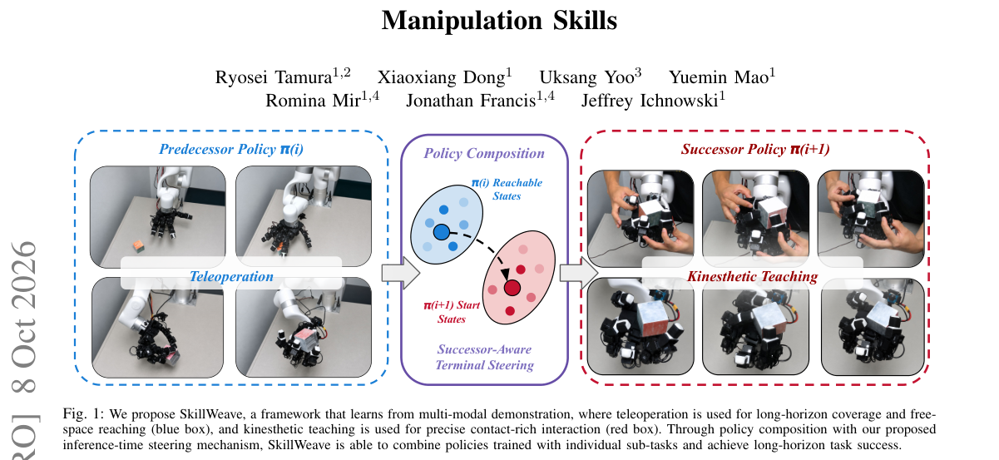

*Main result - Figure 2 Mask-conditioned diffusion policy architecture. External- and wrist-camera RGB observations are encoded by ResNet-18, and object masks guide cross-attention pooling over the resulting spatial*

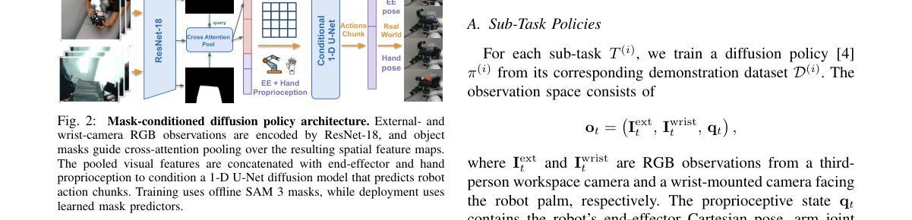

**Why this ranks #8**: 显式地把「任务推进」与「接触交互」两类演示分开采集再编织，是一个务实的数据工程方案。

---

### 9. Humanoid World Action Model With Joint State--Action Generation

**arXiv**: [2610.12026](https://arxiv.org/abs/2610.12026) | **Score**: 7.3 (relevance 7 x 0.7 + quality 8 x 0.3) | **Tags**: world-model, embodied-ai | **Categories**: cs.AI, cs.RO | **Pages**: 15

**Authors**: Yan Yang, Jikun Rong, Minzhao Zhu, Zheyi Zhao, Qirui Hu, Zihan Lan, Weixin Mao, Yinhao Li, Zhen Fu, Hua Chen

**Affiliation**: 2Southern University of Science and Technology (sustech.edu.cn)

**Abstract**

> Humanoid robots are a promising platform for general-purpose manipulation. Recent Vision-Language-Action (VLA) policies learn actions directly from multimodal observations, while World Action Models (WAMs) further incorporate future visual prediction to improve action generation. However, in hierarchical humanoid systems, VLA and WAM policies output reference actions that are subsequently realized through whole-body control, robot dynamics, balance, and contact. This hierarchy creates an action--execution gap: the reference produced by the policy can differ from the motion realized by the robot. Without explicitly modeling the realized body state, future visual prediction must jointly explain scene evolution and discrepancies between reference actions and executed motion, making it difficult to associate an action with its physical outcome. We propose HWAM, a Humanoid World Action Model with joint state--action generation, which makes the robot's post-execution proprioceptive state an explicit prediction target. By jointly generating reference actions and their realized body states, HWAM directly incorporates supervision of executed motion into action learning. HWAM is trained through three complementary conditional paths. The Policy path jointly denoises state--action trajectories conditioned only on current observations, matching deployment conditions. Forward Dynamics Modeling (FDM) predicts future visual observations conditioned on actions and post-execution states, while Inverse Dynamics Modeling (IDM) reconstructs the joint trajectory from visual transitions. Together, these paths connect policy references, realized body motion, and visual outcomes. HWAM achieves the highest success rate among evaluated baselines on three real-robot tasks on the LimX OLI humanoid. On Candy Picking, HWAM achieves a 70.6% success rate, compared with 43.3% for Fast-WAM.

**Key findings**

- **Finding**: VLA 从多模态观测直接学动作，WAM 额外纳入未来视觉预测以改进动作生成。

- **Finding**: 但在**层次化**人形系统中，VLA 与 WAM 输出的是参考动作，需要下游全身控制器跟踪——该文把状态与动作生成合并处理这个接口。

- **Inference**: 参考动作接口是一个信息瓶颈：层次化把全身动力学约束推给低层控制器，上层策略无法感知自己产生的动作是否可执行；联合生成是对这一瓶颈的直接应对。

- **Recommendation**: 与 10-08 日报的 ΔWAM（动作依赖性筛选）连读——那篇筛掉非动作依赖的未来预测，本篇把状态纳入生成以改善接口。

**Key figures**

*Framework / architecture - Figure 1 Hierarchical control interface in HWAM. The high-level VLA/WAM/HWAM policy produces reference actions, which are adapted by low-level whole-body tracking and joint servoing before physical e*

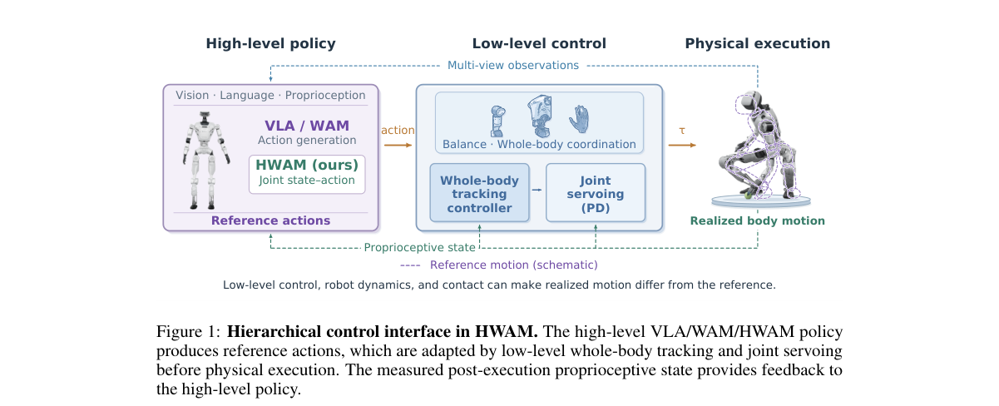

*Main result - Figure 2 Overview of HWAM. The high-level action at is executed through the low-level whole- body controller, producing the measured post-execution state st+1. HWAM represents the joint state–action*

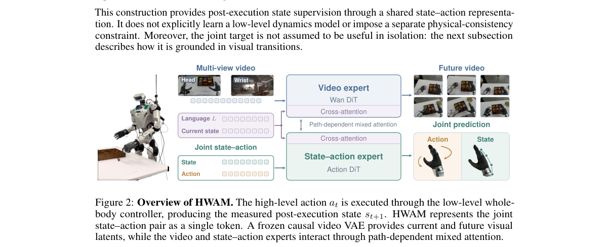

**Why this ranks #9**: 指出了层次化人形系统里 VLA/WAM 的输出与下游控制器之间的接口问题。

---

### 10. VioLA: Learning Generalist Humanoid Control Policies from Human Data

**arXiv**: [2610.12435](https://arxiv.org/abs/2610.12435) | **Score**: 7.0 (relevance 7 x 0.7 + quality 7 x 0.3) | **Tags**: embodied-ai `[wild-card]` | **Categories**: cs.LG, cs.RO | **Pages**: 24

**Authors**: Mert Albaba, Jens Beißwenger, Anna Manasyan, Daniel Marta, Michael J. Black, Wieland Brendel, Andreas Krause, Georg Martius, Martin Riedmiller

**Affiliation**: 5ELLIS Institute

**Abstract**

> Teaching a humanoid to follow instructions with its whole body runs into two obstacles. Its action space is large and tightly coupled: legs, arms, and fingers must move together while the robot keeps its balance, which makes joint-level actions hard to learn. And humanoid demonstrations are scarce, so current humanoid generalist policies do not follow new instructions out of the box and are fine-tuned on teleoperated demonstrations of each task before deployment. Human demonstrations exist in far larger numbers, but a person's motion is not a robot command. We remove both obstacles by changing what the generalist policy predicts. We introduce VioLA, a generalist humanoid policy that predicts body and hand motion latents instead of joint commands. A pretrained body- and hand-controller execute these latents on the robot. Their corresponding motion encoders map human and robot motion into the same latent spaces. A human recording is therefore labeled in the policy's action space, and the training demonstration pool contains 140.6 million frames, 93.2% of them human. As a result, VioLA follows locomotion instructions on the real robot zero-shot, without task-specific fine-tuning, reaching 100% success where GR00T N1.7 and $Ψ_0$ reach 16.7% and 0%, respectively. It also reaches 88.6% manipulation success without task-specific fine-tuning. The same approach works across two VLA and one world-action model backbones. A generalist policy trained on human demonstrations alone performs locomotion tasks on the real robot zero-shot. Code and checkpoints will be released.

**Key findings**

- **Finding**: 人形控制的两个障碍：动作空间大且紧密耦合（腿/臂/手指须同时运动并保持平衡），使关节级动作难以学习；以及人形演示稀缺。

- **Finding**: VioLA 从人类数据学习通才人形控制策略。

- **Inference**: 「紧密耦合」这一障碍与数据稀缺性质不同：后者可以通过合成数据缓解，前者是动作表示本身的问题——需要分层或低维动作空间而非更多数据。

- **Recommendation**: wild-card 项；与本批 Humanoid World Action Model（#9）同读，两篇同样处理动作表示与数据来源。

**Key figures**

*Framework / architecture - Figure 1 VioLA. Human and robot motion encoders produce targets in shared body and hand latent spaces. The generalist policy predicts motion latents from vision, language, and proprioception; frozen*

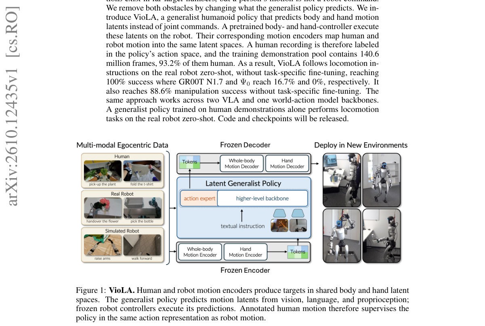

*Main result - Figure 2 VioLA overview. Left: frozen motion encoders construct body and hand action targets from human or robot demonstrations. Center: the generalist policy predicts motion latents from an egocentr*

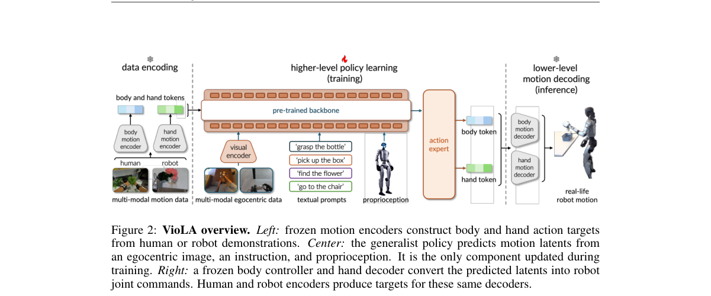

**Why this ranks #10**: wild-card：把「关节级动作难学」与「演示稀缺」并列为两个独立障碍。

---

## Footer

- Total papers reviewed across all 5 tracks: 50 (from 643 scanned)
- embodied track final top-10: 10
- Wild-cards in this track: 1
- Figure assets: `res/` (shared across tracks)

Generated by `mine-arxiv-daily-digest` skill. Sister file: `2026-10-09_embodied_entry.md`.
