# ArXiv Daily Digest - 2026-10-09 (强化学习, 10 papers)

**Generated**: 2026-10-09 17:00 CST

**Source**: arXiv cs.CV, cs.SD, eess.AS, cs.CL, cs.AI, cs.RO, cs.LG submissions, window 2026-10-08 UTC (latest announced batch as of 2026-10-09 17:00 CST)

**Track**: rl (top 10 of 643 papers scanned, 50 full reads)

**Scope**: policy entropy collapse in online GRPO, student-relative teacher guidance for RLVR, federated GRPO under privacy constraints, multi-agent data synthesis co-training, privileged-state training with test-time modality gap, Jev as Q or policy, geometric soft actor-critic, self-improvement scaling report, constrained command-conditioned RL, RL-orchestrated evolutionary search

---

本批 RL 线最值得注意的是 GRPO 生态的连续精细化——三篇分别处理**探索退化**、**过程信用**与**分布式训练**，且各自都指出了一个被默认接受的做法。**GRPODropout** 指出策略熵坍塌（采样多样性丧失）限制进一步改进，既有方法从算法层面干预（奖励修改、熵/KL 正则），该文转而在 rollout 层面处理，标题即「少即是多」——若坍塌源于算法干预本身的副作用，减少干预比加强干预更对症。**Residual Advantage** 则把 RLVR 与在策略蒸馏的互补性讲清楚：RLVR 给每个响应单一结果标签，内部步骤没有单独信用；OPD 提供 token 级引导但其逐点信号不直接反映最终目标。关键在**学生相对**这一相对化处理——教师的 token 级信号只有相对学生当前状态才有意义，否则等于把教师分布直接压到学生身上，这解释了 OPD 为何无效。**Fed-GRPO** 处理既有 GRPO 假设集中访问训练数据这一在隐私约束下不成立的前提，由奖励信号驱动地协调各参与方；其技术核心是重建一个可比的组内基线。

其余六个方向：SynCo 指出自我进化系统必须**随模型一起演进训练经验**（「模型变了而数据没变」是基本失效模式），MiMo-V2.6 则以「RL 前先中期训练扩大探索空间」作为熵坍塌的前置解法——两者分别扩数据与扩算力；FOCUS 把特权状态限制在评论家而非策略，从而避开训练-测试模态差距对策略的污染；**Can Jev be Your Q or Policy** 追问基础模型是否能直接充当 Q 或策略，其理由（逐 token 生成使 RL 查询串行昂贵，而决策模型单次前向返回有校准的类型化答案）与 10-08 日报「预测精度、动作相关性、目标达成度是三个不同的量」完全同构；GeZo-SAC 指出 SAC 对两个评论家取最小值时「无论分歧多大都用同一聚合规则」，这是一个明显可改进却长期被默认的设计；最后两篇（bandit 分层应对分布外对手、RL 调度进化搜索）属应用型方法。

---

## Top 10 - 强化学习

### 1. GRPODropout: Less is More for Online Reinforcement Learning Rollouts

**arXiv**: [2610.11854](https://arxiv.org/abs/2610.11854) | **Score**: 9.0 (relevance 9 x 0.7 + quality 9 x 0.3) | **Tags**: rlhf, rl-algorithm | **Categories**: cs.AI, cs.CL, cs.LG | **Pages**: 22

**Authors**: Hexuan Deng, Zihao Yan, Xuebo Liu, Shuo Nie, Yue Wang, Chen Wang, Zhaohua Zhang, Tianwen Jiang, Qiuyong Xiao, Jihong Zhang, Min Zhang

**Affiliation**: 1 Institute of Computing and Intelligence, Harbin Institute of Technology (Shenzhen)

**Abstract**

> Reinforcement learning (RL) methods such as GRPO substantially improve large language model reasoning but often suffer from policy entropy collapse: the loss of sampling diversity weakens exploration and limits further improvement. Existing methods address this issue either through algorithm-level interventions, such as reward modification and entropy/KL regularization, or through token-level reweighting. We investigate a complementary perspective: entropy collapse can also be mitigated by changing which generated rollouts contribute to policy updates. Under the same sampling budget, not all rollouts contribute positively to an update, and selectively excluding some can improve learning. To address this, we propose GRPODropout: before the standard update, we use a simple strategy that selectively removes a small number of high-probability positive-advantage rollouts and recenters the retained advantages. To motivate this design, we develop a rollout-level theoretical analysis that guides method design and threshold selection. The method changes only rollout usage, and adds negligible computational overhead. Experiments show higher accuracy than original GRPO and higher actor entropy while using fewer rollout samples for updates, illustrating "less is more." This work provides insight into RL rollout usage: removing some rollouts can improve performance. Code is available at https://github.com/hexuandeng/GRPODropout/.

**Key findings**

- **Finding**: GRPO 类方法常遭受**策略熵坍塌**：采样多样性丧失削弱探索并限制进一步改进。

- **Finding**: 既有方法从算法层面干预（奖励修改、熵/KL 正则）；GRPODropout 转而在 rollout 层面处理——标题即「少即是多」。

- **Inference**: 若坍塌源于算法干预本身的副作用，则减少干预比加强干预更对症；把多样性问题放回 rollout 的采样层面，等于承认它是数据流问题而非目标函数问题。

- **Recommendation**: 被精读的三篇之一；与本批 Residual Advantage、10-08 的 Decoupling Exploration from Optimization（同样处理探索）构成连续两天的探索线。

**Key figures**

*Framework / architecture - Figure 1 GRPODropout procedure. Filter removes only selected positive-advantage rollouts; Re- center applies probability-weighted advantage recentering. Other GRPO updates are unchanged.*

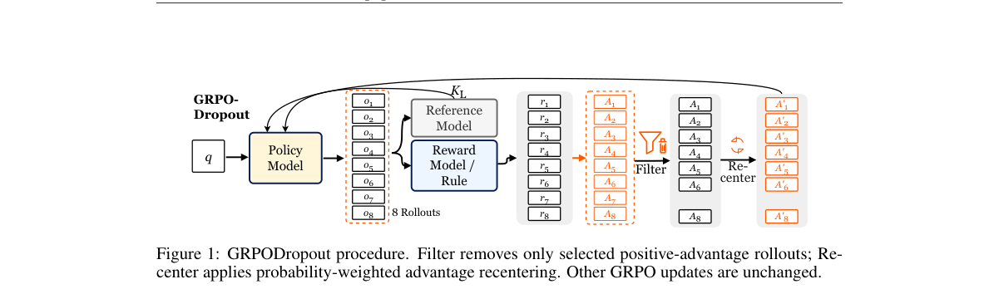

*Main result - Figure 2 Qwen3-4B actor entropy and rollout usage across checkpoints. (a–b) Token-mean entropy on training DAPO-17K and held-out MMLU-Pro (MMLUP); (c) mean update rollouts per question in training ba*

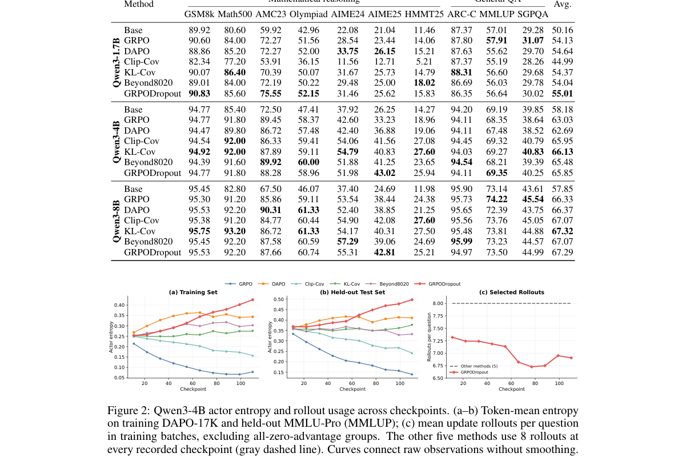

**Why this ranks #1**: 把熵坍塌定位为「限制进一步改进」的元问题，而非一个待优化的指标。

---

### 2. Residual Advantage: Student-Relative Teacher Guidance for RL with Verifiable Rewards

**arXiv**: [2610.11519](https://arxiv.org/abs/2610.11519) | **Score**: 9.0 (relevance 9 x 0.7 + quality 9 x 0.3) | **Tags**: rlhf, rl-algorithm | **Categories**: cs.CL | **Pages**: 37

**Authors**: Xiaobing Chen, Zhiqi Pang

**Affiliation**: 1Harbin Engineering University | 3Harbin Institute of Technology

**Abstract**

> Reinforcement learning with verifiable rewards (RLVR) and on-policy distillation (OPD) have become two main paradigms for post-training reasoning models. RLVR gives each response a single outcome label, leaving the steps inside it without separate credit. OPD provides token-level guidance at student-visited prefixes, but its pointwise signal does not directly reflect the pattern of teacher--student disagreement across the vocabulary. Dense, unbounded log-ratio supervision can amplify the teacher's influence, yet a strong solver is not necessarily a suitable guide when the student's solution paths depart from the teacher's. We propose Residual Advantage (\RA{}), which treats the teacher--student probability residual as a bounded one-step reward, subtracts the corresponding state value under the student policy to form a standard advantage, and centers the result within each response before adding it to the verifier advantage. The guidance term has zero mean within each response, so the verifier advantage remains the response's mean label and the teacher only redistributes credit among the steps within it. \CoRA{} further updates a teacher LoRA with verifier advantages on the same scored student batch and uses the updated teacher in the next iteration's residual, adapting guidance to the student's attempts. With Qwen3-1.7B-Base and Qwen3-4B-Base students and a Qwen3-8B teacher, \RA{} combined with GRPO or REINFORCE++ improves the underlying sequence-advantage algorithm in all 24 comparisons on three mathematical benchmarks, raising macro Avg@8 by 1.7--3.6 points and Pass@8 by 3.9--6.3 points. Both combinations surpass teacher-only OPD, and \CoRA{} adds a further 1.0--1.5 Avg@8 points.

**Key findings**

- **Finding**: RLVR 给每个响应单一结果标签，内部步骤没有单独信用；OPD 在学生访问前缀上提供 token 级引导，但其**逐点信号不直接反映**最终目标。

- **Finding**: 作者提出残余优势（Residual Advantage）：用**学生相对**教师的指导提供过程信用。

- **Inference**: 「学生相对」这一相对化处理是关键：教师的 token 级信号只有相对学生的当前状态才有意义，否则就是把教师分布直接压到学生身上——这解释了 OPD 的逐点信号为何无效。

- **Recommendation**: 被精读的三篇之一；与 10-08 日报的 Beyond Speech Captions（语音-文本对齐弱预测下游效果）同构，都是「绝对代理指标不预测下游实际效应」。

**Key figures**

*Framework / architecture - Figure 1 Local teacher guidance redistributes the verifier’s response-level credit. (a) At one prefix, the reward Qd(s, v) = qs(v) −ps(v) over the student’s likeliest tokens, its value V p*

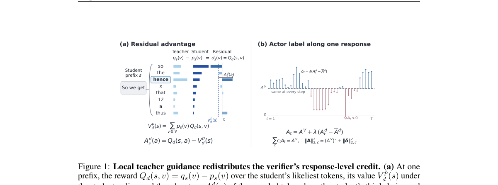

*Main result - Figure 2 One iteration of RA and Co-RA. Three schematic responses, only the middle one correct, receive verifier advantages AV*

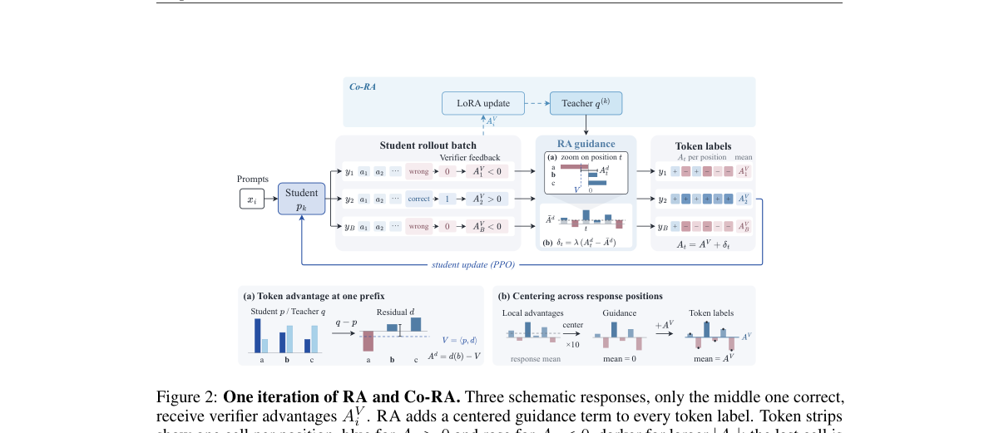

**Why this ranks #2**: 把两个主流后训练范式的互补性讲清楚了——它们缺的正好是对方有的。

---

### 3. Fed-GRPO: Reward-Signal-Driven Federated Group Relative Policy Optimization

**arXiv**: [2610.11502](https://arxiv.org/abs/2610.11502) | **Score**: 8.0 (relevance 8 x 0.7 + quality 8 x 0.3) | **Tags**: rlhf | **Categories**: cs.AI | **Pages**: 20

**Authors**: Pengxin Guo, Shuang Zeng, Zonggen Li, Weiying Zheng, Mengting Liu, Liangqiong Qu

**Affiliation**: 1 The University of Hong Kong | 2 Sun Yat-sen University

**Abstract**

> Large Language Models (LLMs) have shown strong reasoning capabilities when fine-tuned with reinforcement learning (RL), particularly through Group Relative Policy Optimization (GRPO). However, existing GRPO methods assume centralized access to training data, which may not hold in practice due to privacy or regulatory constraints. To this end, we propose Fed-GRPO, a federated GRPO training framework that addresses these privacy constraints by enabling collaborative reasoning training without sharing raw data, which leverages the reward statistics naturally produced during GRPO training as zero-cost signals to guide aggregation, local training, and communication. Fed-GRPO contains three reward-signal-driven mechanisms: (i) \emph{signal-weighted aggregation} that weights clients by their reward standard deviation, prioritizing clients with stronger learning signals; (ii) \emph{global reward calibration} that re-weights per-prompt objectives based on the local-global reward gap, steering each client toward its relative weaknesses; and (iii) \emph{adaptive sparse communication} that allocates bandwidth based on the informativeness of each client's update. Extensive experiments on mathematical reasoning tasks demonstrate that Fed-GRPO achieves the best performance among all federated methods, clearly outperforms FedAvg and approaches centralized training performance, while losslessly reducing communication by $32\times$ and supporting up to $621\times$ compression under tight bandwidth budgets with only graceful accuracy degradation. Our code is available at https://github.com/HKU-HealthAI/Fed-GRPO.

**Key findings**

- **Finding**: 既有 GRPO 假设集中式访问训练数据，隐私或监管约束下常不成立。

- **Finding**: Fed-GRPO 提出联邦式 GRPO，由**奖励信号驱动**地协调各参与方。

- **Inference**: GRPO 的组内相对优势天然需要同一组样本共享基线，这在跨机构联邦设定下不可得；奖励驱动的协调方式本质是重建一个可比的基线，这是该方法能否成立的技术核心。

- **Recommendation**: 联邦学习与隐私场景的读者注意；组基线的近似方式决定了精度损失。

**Key figures**

*Framework / architecture - Figure 1 Motivation of Fed-GRPO. Na¨ıve FedAvg-GRPO suffers from three coupled issues: (1) reward-misaligned aggregation, (2) local–global objective miscalibration, and (3) reward-agnostic communicat*

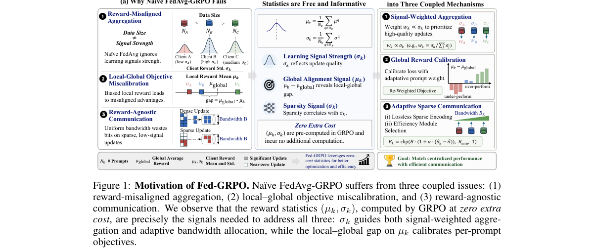

*Main result - Figure 2 FedAvg-GRPO training dynamics on the MATH dataset with 5 clients split by difficulty. (a) Per-client reward standard deviation σk varies by up to 4× across clients within the same round, ind*

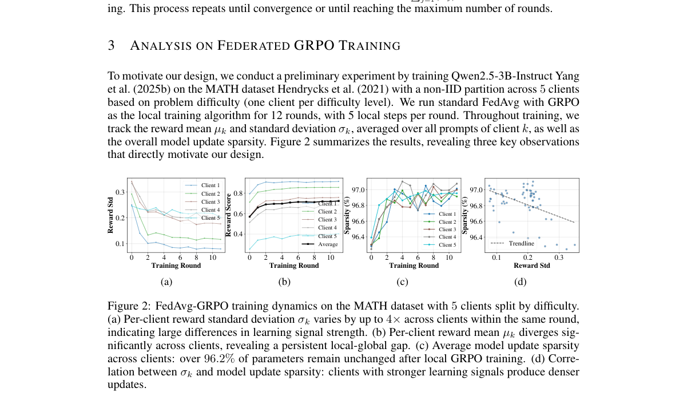

**Why this ranks #3**: 把 GRPO 放到隐私约束下，暴露的是「组内相对优势」对集中访问的依赖有多深。

---

### 4. SynCo: Data Synthesis Co-Training for Self-Evolving LLMs via Multi-Agent Reinforcement Learning

**arXiv**: [2610.11345](https://arxiv.org/abs/2610.11345) | **Score**: 8.0 (relevance 8 x 0.7 + quality 8 x 0.3) | **Tags**: multi-agent-rl, rlhf | **Categories**: cs.AI | **Pages**: 28

**Authors**: Wei Yang, Shawn Li, Yuehan Qin, Yawei Wang, Mingxi Wang, Shixuan Li, Tiankai Yang, Jiate Li, Jesse Thomason, Xuezhe Ma, Yue Zhao

**Affiliation**: 2 The George Washington University | 3Georgia Institute of Technology

**Abstract**

> Self-evolving LLM agents promise to improve autonomously through continual interaction and learning, reducing their dependence on manually curated supervision. Realizing this promise requires not only updating the agent, but also evolving its training experience as its capabilities change. However, most existing pipelines rely on static datasets or separately updated synthesis models, causing previously useful tasks to become trivial while overly difficult tasks remain uninformative. This growing mismatch between agent capability and training experience limits sustained self-improvement. To address this problem, we propose SynCo, an agentic data synthesis co-training framework for self-evolving LLMs based on multi-agent reinforcement learning. SynCo jointly optimizes two independently parameterized agents: a Synthesizer that constructs training tasks from the Reasoner's evolving capability state, and a Reasoner that learns from the resulting experience. Each synthesized task induces multiple Reasoner rollouts whose outcomes provide complementary rewards to both agents. Correctness feedback improves the Reasoner, while task quality, answer reliability, and outcome-grounded teachability guide the Synthesizer. Their updates are fed back into subsequent synthesis rounds, allowing the task-solving policy and its training distribution to evolve together. Extensive experiments across eight mathematical reasoning benchmarks demonstrate that SynCo substantially outperforms a broad range of existing synthetic-data methods and controlled baselines, achieving the strongest overall performance while deriving most of its gains from previously unsolved problems.

**Key findings**

- **Finding**: 自我进化智能体不仅要求更新智能体本身，还要求**随其能力变化而演进训练经验**。

- **Finding**: 但多数现有流程依赖静态数据集或单独更新的流程；SynCo 用多智能体强化学习做数据合成协同训练。

- **Inference**: 「模型变了而数据没变」是自进化系统的基本失效模式：智能体很快会重复已解过的题，训练信号随之退化。用 MARL 合成数据是把数据生产纳入学习循环的一种做法。

- **Recommendation**: 自进化系统的读者注意；与本批 MiMo-V2.6（大规模 RL 自我改进）对照，一篇是系统方法、一篇是规模化报告。

**Key figures**

*Framework / architecture - Figure 1 Overview of SYNCO, a closed-loop framework for self-evolving LLMs. (1) A Synthesizer first generates capability-guided and verifiable tasks from the current learning context. (2) The resulti*

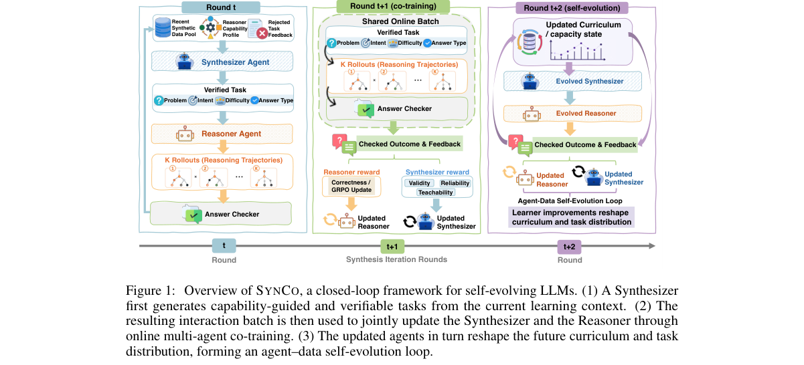

*Main result - Figure 2 Evolution of the synthesized curriculum during co-training. Tasks are ordered by generation time and divided into ten equally sized buckets. (a) Realized Reasoner outcomes, where gradient- b*

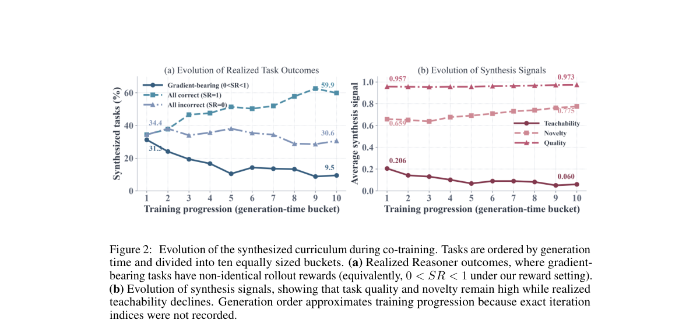

**Why this ranks #4**: 指出「数据必须随模型一起演进」，这是自进化系统最常被跳过的一半。

---

### 5. FOCUS: From Privileged States to RGB-D with Controlled Modality Switching and Representation Alignment

**arXiv**: [2610.11119](https://arxiv.org/abs/2610.11119) | **Score**: 8.0 (relevance 8 x 0.7 + quality 8 x 0.3) | **Tags**: rl-algorithm, embodied-ai | **Categories**: cs.RO | **Pages**: 38

**Authors**: Filip Grigorov, Kourosh Darvish, Nandita Vijaykumar

**Affiliation**: University of Toronto

**Abstract**

> Vision-based reinforcement learning for robotic manipulation is sample-inefficient because RGB-D observations are high-dimensional and noisy. Privileged state information available in simulation can accelerate training, but its absence at test time creates a train-test modality gap. We propose FOCUS, a single-stage PPO framework that trains the critic on privileged state while automatically regulating whether the actor collects rollouts from RGB-D or privileged-state latents. Regulation is driven by the KL divergence between the action distributions induced by the two modalities, while representation alignment encourages consistent action selection across them. Together, these mechanisms limit RGB-D rollouts when the actor's action distributions from RGB-D and privileged-state latents disagree. As they align, RGB-D exposure increases, shifting on-policy training toward the RGB-D inputs used at test time. Across five manipulation tasks, FOCUS raises average test success from 0.71 to 0.93 relative to the strongest RGB-D-at-test baseline on each task. When accounting for each method's complete training pipeline, budget-normalized training-success AUC increases from 0.47 to 0.65. On Pick-and-Place, test success rises from 0.47 to 0.86, while AUC increases from 0.12 to 0.61, a 5.0x improvement in learning efficiency over the fixed interaction budget.

**Key findings**

- **Finding**: 视觉操作 RL 样本效率低；仿真中可得特权状态能加速训练，但测试时缺失造成**训练-测试模态差距**。

- **Finding**: FOCUS 是单阶段 PPO 框架，在特权状态上训练评论家，并在观测侧做受控模态切换与表征对齐。

- **Inference**: 把特权信息限制在评论家而非策略，是一种保守但有效的设计：评论家只要相对排序正确即可，不必与执行策略同分布，从而避免模态差距污染策略。

- **Recommendation**: 与本批 embodied 线的 SimVLA 配对：一篇是系统级 sim-to-real，一篇是具体的训练-测试差距处理。

**Key figures**

*Framework / architecture - Figure 1 Overview of FOCUS. During training, cross-modal policy disagreement is aggregated into running statistics that determine the RGB-D exposure probability λr for subsequent actor rollouts. A KL*

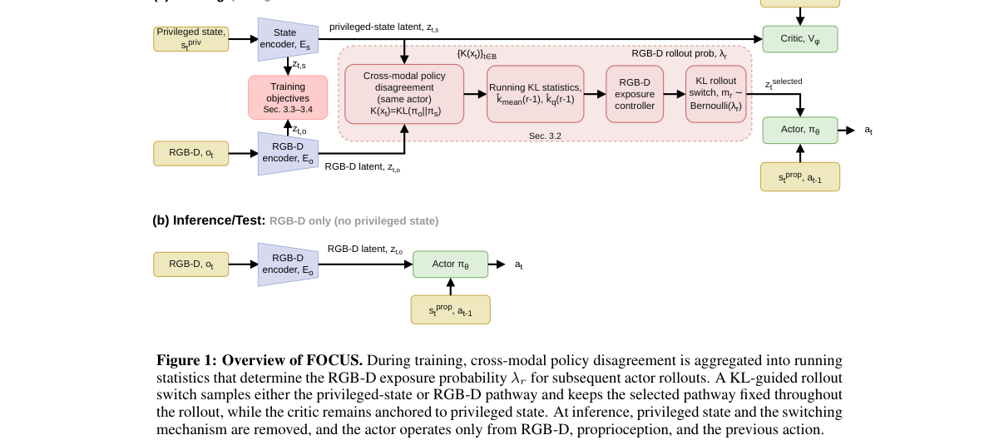

*Main result - Figure 2 Representative successful test-time rollouts of FOCUS. Sequential frames show FOCUS exe- cuting Lift-Cube (top), Push-Cube (middle), and Pick-and-Place (bottom) using the deployment observat*

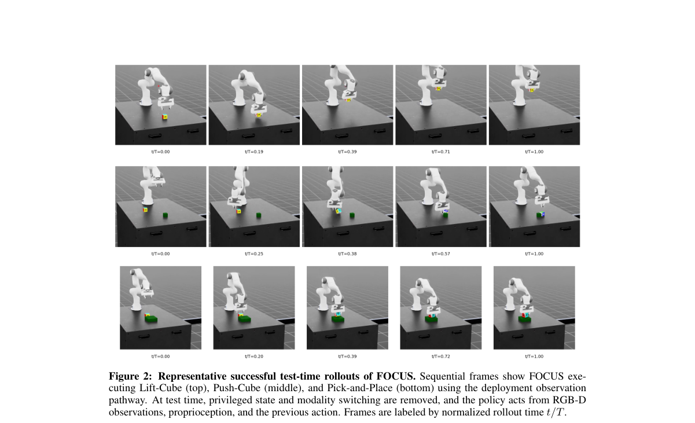

**Why this ranks #5**: 把「训练用特权信息、测试用传感观测」的差距当作可设计的对象而非妥协。

---

### 6. Can Jev be Your Q or Policy in Reinforcement Learning?

**arXiv**: [2610.11692](https://arxiv.org/abs/2610.11692) | **Score**: 8.0 (relevance 8 x 0.7 + quality 8 x 0.3) | **Tags**: rl-algorithm | **Categories**: cs.AI, cs.LG | **Pages**: 37

**Authors**: Yi Ma, Tianpei Yang, Yaodong Yang, Weixun Wang, Hongyao Tang

**Affiliation**: 1Shanxi University, 2Nanjing University, 3The Chinese University of Hong Kong, | 4Independent Researcher, 5Tianjin University

**Abstract**

> Foundation models supply reinforcement learning (RL) with priors that mitigate its longstanding weaknesses in sample efficiency and transfer, but their token-by-token generation makes queries sequential and costly. Jev, a recently released decision model, generates nothing and returns calibrated, typed answers in a single forward pass. Existing work studies foundation models in RL either as models to be trained or as generators to be prompted, and Jev belongs to neither category, having so far served only as a black box in single domains. How well such a model decides on its own in RL environments, and how it can improve RL as a component of training, therefore remain unaddressed. To this end, in this paper we first examine the requirements that the objects of an RL system place on the answers they consume, and establish that Jev can fulfill all of them except the cardinal use of a value function. The remaining objects form positions that admit several roles each. We then construct algorithms that employ Jev at three of these positions, as a reference policy, an exploration judge, and a replay rater, to improve sample efficiency, exploration, and learning performance. Across nine MiniGrid tasks and three Atari games, training with Jev outperforms a standard RL learner, including where the learner makes no progress alone, while the model itself remains untrained. To our knowledge, we present the first use of Jev within the RL learning process and establish a frozen decision model as a usable component of RL training, inviting further exploration of how Jev and other advanced decision models can improve RL.

**Key findings**

- **Finding**: 基础模型逐 token 生成使 RL 查询串行且昂贵；Jev 不生成内容，在单次前向中返回**有校准的类型化答案**。

- **Finding**: 本文追问 Jev 能否充当 RL 中的 Q 或策略本身，而不只是提供先验。

- **Inference**: 若 RL 需要的主要是可靠的相对评估而非生成，那么用生成模型当 Q 是错配的——这与 10-08 日报「预测精度、动作相关性、目标达成度是三个不同的量」同构。

- **Recommendation**: 被关注的基础模型替代 RL 组件的读者注意；「有校准」这一前提是否成立决定结论强弱。

**Key figures**

*Framework / architecture - Figure 1 The framework structure of Jev for RL.*

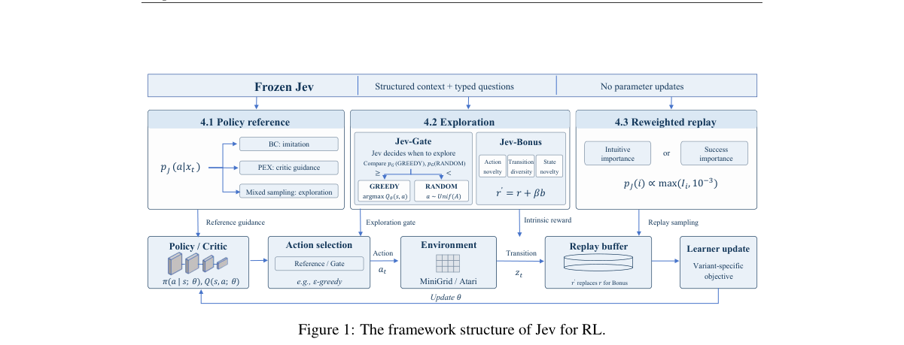

*Main result - Figure 2 Direct control with matched structured inputs. Jev and non-thinking Qwen3-8B use the same evaluation seeds and task-specific input construction. MiniGrid: success on 50 episodes with 95% Wil*

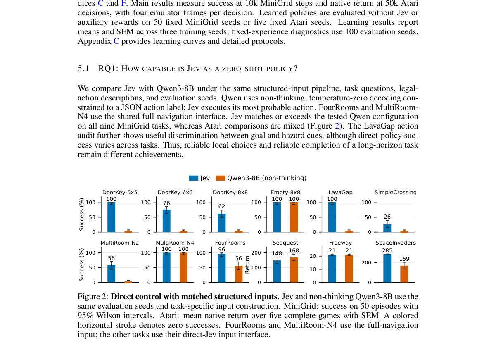

**Why this ranks #6**: 提出了一个反直觉的问题：RL 里需要的是生成能力，还是只要一个校准的评估接口。

---

### 7. A Geometric Approach to Soft Actor-Critic with Zonotopes for Locomotion Learning

**arXiv**: [2610.12113](https://arxiv.org/abs/2610.12113) | **Score**: 7.7 (relevance 8 x 0.7 + quality 7 x 0.3) | **Tags**: rl-algorithm | **Categories**: cs.AI, cs.LG | **Pages**: 8

**Authors**: Panagiotis Roditis, Panagiotis P. Filntisis, Petros Maragos

**Affiliation**: 1Robotics Institute, Athena Research Center, Marousi, Greece

**Abstract**

> Off-policy actor--critic methods control overestimation bias by taking the minimum of two critics. This uses the same aggregation rule everywhere, regardless of how the critics disagree. We propose \textbf{GeZo-SAC}, which uses auxiliary geometric representations to adapt critic pessimism to the state and action. Alongside its scalar value, each critic predicts a set of generators defining a zonotope. Probing this zonotope along sampled directions provides a geometric width, "subtracted from each critic value as a pessimistic offset, and a measure of disagreement between the two critics, aggregated with log-sum-exp. This disagreement controls how the critics are combined, moving from a width-weighted average toward the usual minimum as disagreement increases. At inference, the deployed policy is an unmodified SAC actor, since the generators are used only on the critic side during training.Across four MuJoCo-v5 locomotion benchmarks and six off-policy baselines, GeZo-SAC achieves the highest mean return on Ant-v5 and Hopper-v5 and remains competitive with other methods on the remaining tasks. Our analysis further shows that GeZo-SAC achieves the lowest average actuator work and action effort per metre among the evaluated methods, while maintaining near-zero measured overestimation frequency across all four environments.

**Key findings**

- **Finding**: SAC 用两个评论家的最小值控制高估偏差，但**在任何地方都用同一聚合规则**，不管评论家分歧多大。

- **Finding**: GeZo-SAC 让每个评论家除标量值外还预测一个集合（zonotope），据此把悲观程度自适应到状态与动作。

- **Inference**: 固定聚合隐含假设「高估偏差的量处处相同」，而这在分歧大的区域（评论家互相矛盾）显然不成立——几何表示提供的是分歧程度本身的估计。

- **Recommendation**: 控制类 RL 的读者注意；zonotope 集合预测带来的额外开销是该方法能否实用的关键。

**Key figures**

*Framework / architecture - Figure 1 Training performance on four MuJoCo-v5 locomotion environments. Learning curves show episodic training returns for Ant-v5, Hopper-v5, Walker2d-v5, and Humanoid-v5. Per-run returns are smoothed*

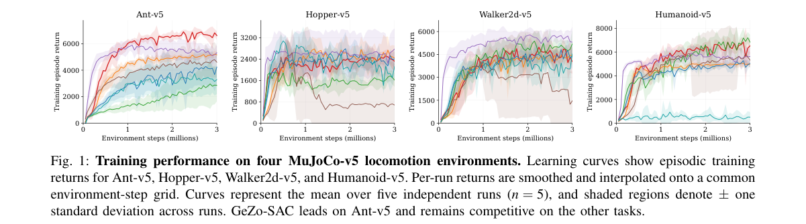

*Main result - Figure 2 Performance–energy trade-off. Mean episodic re- turn versus mean absolute mechanical work per metre, Eabs/m (J/m), across four locomotion tasks. Each marker represents one method; points towar*

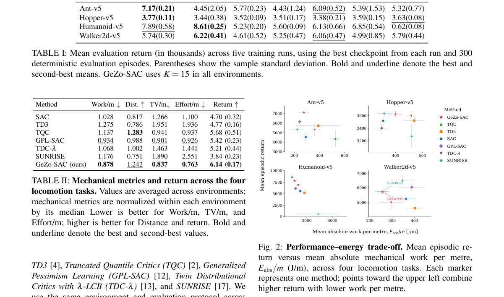

**Why this ranks #7**: 「无论评论家分歧多大都用同一聚合规则」是一个被默认接受、但明显可以改进的设计。

---

### 8. MiMo-V2.6: Scaling Reinforcement Learning Towards Self-Improvement

**arXiv**: [2610.11959](https://arxiv.org/abs/2610.11959) | **Score**: 7.3 (relevance 7 x 0.7 + quality 8 x 0.3) | **Tags**: rlhf | **Categories**: cs.CL | **Pages**: 43

**Authors**: Xiaomi LLM-Core Team, :, Zongming Qiao, Ziyue Hua, Zirui Ou, Zihao Yue, Zihan Jiang, Zhuo Huang, Zhiyang Chen, Zhixian Zheng, Zhipeng Xu, Zhengrui Ma

**Affiliation**: [not-found in PDF]

**Abstract**

> Reinforcement learning (RL) is the central training paradigm for advancing large foundation models towards self-improvement. This report introduces the MiMo-V2.6 series, an omni-modal family that pushes the frontier of model intelligence by scaling RL compute. Prior to RL, we conduct mid-training on a broad multimodal corpus to provide ample exploration space, and build a solid infrastructure on the pretrained hybrid-SWA architecture to support subsequent scale-up. We scale RL compute along three dimensions: (1) larger batches and higher throughput, with an asynchronous training that consumes 1,568 samples and 2.7-3.7B tokens per step at context lengths of up to 1M; (2) more diverse and complex environments, spanning code, general, visual, and cyber domains under a mixture of agent harnesses; and (3) more grader compute, via groupwise agentic grading that yields more accurate reward signals for long-horizon tasks and steers the model towards shorter, more token-efficient solutions. To keep training stable at scale, we freeze the MoE router and establish a multi-layer defense against reward hacking. We further build infrastructure for mixed-task agentic RL, including a unified trajectory representation, high-concurrency multi-framework rollout, decoupled control and data planes, and training-inference consistency. We open-source the training dynamics, RL environments, and RL framework to facilitate reproduction and further research on scaled RL and model self-improvement.

**Key findings**

- **Finding**: MiMo-V2.6 是通过扩展 RL 算力推进智能的全模态家族。

- **Finding**: 在 RL **之前**先做中期训练，以提供充足的探索空间。

- **Inference**: 「先扩大探索空间再做 RL」的顺序，是对本批 GRPODropout 熵坍塌问题的一个前置解法——探索空间不足时，无论怎么调 RL 超参都会撞上多样性天花板。

- **Recommendation**: 规模化 RL 的读者参考；与本批 SynCo（数据随模型演进）对照，一篇扩算力、一篇扩数据。

**Key figures**

*Framework / architecture - Figure 1 Benchmark score per task of MiMo-V2.6-Pro and MiMo-V2.6-Flash throughout RL training.*

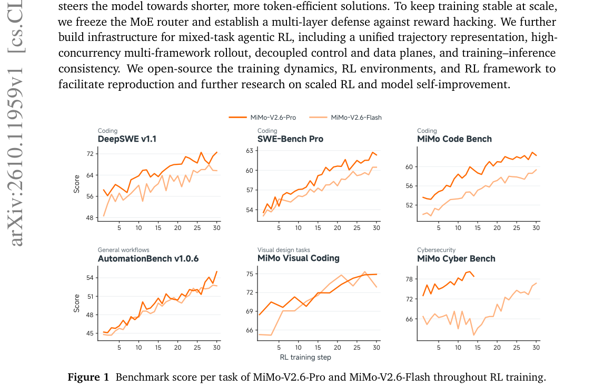

*Main result - Figure 2 Overall architecture of MiMo-V2.6. Audio, visual, and text inputs are mapped into a shared token sequence and processed by the MiMo Hybrid-SWA backbone, followed by the language-modeling head*

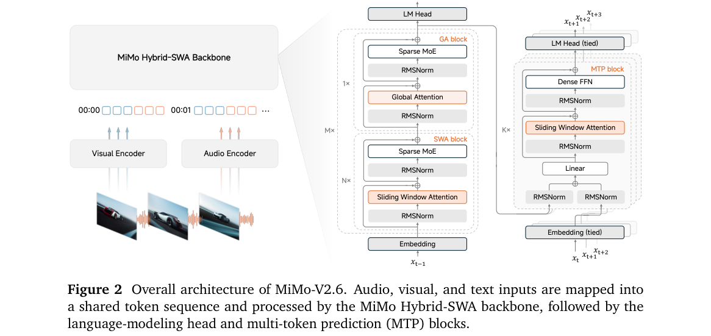

**Why this ranks #8**: 一份规模化报告，但「RL 前先中期训练以扩大探索空间」这个顺序值得注意。

---

### 9. Constrained Command-Conditioned Reinforcement Learning with Bandit Strategy Selection in Real-Time Strategy Games

**arXiv**: [2610.11663](https://arxiv.org/abs/2610.11663) | **Score**: 7.0 (relevance 7 x 0.7 + quality 7 x 0.3) | **Tags**: rl-algorithm | **Categories**: cs.AI | **Pages**: 26

**Authors**: Nick Leenders, Roy Lindelauf, Joost van Oijen, Boris Cule

**Affiliation**: Tilburg University, Tilburg, NL | Reinforcement Learning (RL), with exemplary applications such as OpenAI Five (OpenAI et al.,

**Abstract**

> Deep reinforcement learning agents reach strong performance in real-time strategy games but can be brittle against opponents outside their training distribution. Separating strategic command selection from learned unit control allows different strategies to be selected for different opponents while reusing the same execution policy. This requires an executor that can follow different commands and measurable criteria for assessing whether it does so. We introduce a constrained command-conditioned Proximal Policy Optimization (PPO) policy, the executor, for MicroRTS, a real-time strategy environment. Discrete commands specify strategic objectives and behavioral requirements for economy, army composition, military posture, and worker policy over multiple environment steps; the executor determines the unit-level actions used to fulfill them. A Thompson-sampling bandit acts as the strategist, selecting command tuples from an estimate of the opponent's strategy built from in-game observations rather than opponent identity. In a controlled comparison with a flat PPO baseline trained with the same architecture, budget, curriculum and self-play league, the strategist-executor system wins significantly more often against three of the four strongest opponents on a training map, including the two strongest held-out ones (0.55 to 0.97 and 0.01 to 0.34), with no significant difference against the others.

**Key findings**

- **Finding**: DRL 智能体在 RTS 中对训练分布外的对手很脆弱。

- **Finding**: 把策略命令选择与学习的单位控制分离，允许对不同对手选不同策略并复用同一执行策略；上层用 bandit 做策略选择。

- **Inference**: 把「对陌生对手脆弱」分解为策略选择错误与执行错误两层，使得后者只需训练一次而前者可在线适应——这是分层结构对分布外泛化的直接贡献。

- **Recommendation**: 游戏 RL 的读者可参考；bandit 层的状态设计与执行层的覆盖度决定上限。

**Key figures**

*Framework / architecture - Figure 1 Overview of the framework. The tuple bandit (strategist) supplies commands to a shared executor during training and evaluation. Dashed arrows show training feedback: terminal game outcomes u*

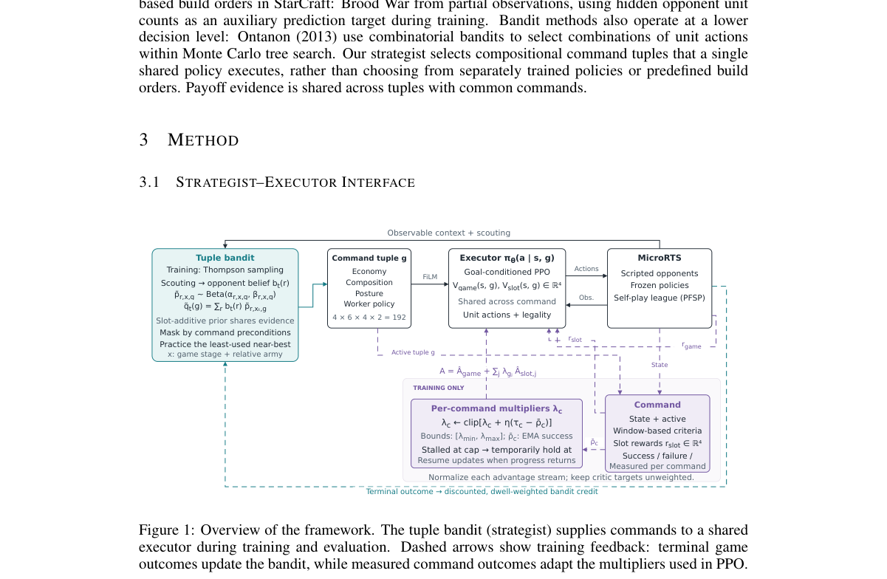

**Why this ranks #9**: 「分层：高层选策略 / 低层执行」是把泛化失败变成组合问题的干净做法。

---

### 10. Learning to Orchestrate Evolutionary Search: Progression-Aware Deep Reinforcement Learning for Dynamic DE-CMA-ES Coordination in Optimization and Structural Model Updating

**arXiv**: [2610.11546](https://arxiv.org/abs/2610.11546) | **Score**: 6.3 (relevance 6 x 0.7 + quality 7 x 0.3) | **Tags**: rl-algorithm `[wild-card]` | **Categories**: cs.AI, cs.NE | **Pages**: 28

**Authors**: Lechen Li, Rongye Shi, Wanhuan Zhou

**Affiliation**: aState Key Laboratory of Internet of Things for Smart City, University of Macau, Macau 519000, China | bCollege of Water Conservancy and Hydropower Engineering, Hohai University, Nanjing 210098, China | cSchool of Artificial Intelligence, Beihang University, Beijing 100191, China

**Abstract**

> Solving high-dimensional structural model updating problems requires an algorithm capable of navigating complex, non-convex landscapes with correlated parameters. Existing hybrid evolutionary algorithms typically rely on static architectures or fixed switching rules, resulting in disjointed search phases. To address this, this study proposes a Deep Reinforcement Learning-governed dynamic DE-CMAES Orchestration (DRL-DCO) algorithm, in which a Deep Deterministic Policy Gradient (DDPG)-based actor-critic agent continuously governs the evolutionary process as a single, unified system rather than a mechanical concatenation of algorithms. Guided by a progression-aware state representation and a diversity-informed reward, the agent fluidly reallocates computational resources between the differencevector-based exploration of Differential Evolution (DE) and the covariance-guided exploitation of CMA-ES, while jointly regulating population size, elite preservation, and a restart mechanism to escape local optima. This allows DRL-DCO to autonomously transition between exploration-dominant, exploitation-dominant, and mixed-strategy regimes across generations. Beyond the training phase, the trained actor can operate in a supervision-free inference mode, where the internalized policy autonomously orchestrates DE and CMA-ES control from observed search states through forward inference alone, without critic evaluation or weight updates, enabling faster deployment while retaining full effectiveness. Validated on high-dimensional single-objective optimization benchmarks and the IASC-ASCE structural health monitoring benchmark, DRL-DCO achieves superior convergence accuracy and robustness compared to state-of-the-art adaptive and hybrid evolutionary algorithms, as well as single-operator DRL-governed baselines.

**Key findings**

- **Finding**: 既有混合进化算法依赖静态架构或固定切换规则，导致搜索阶段割裂。

- **Finding**: 本文用深度强化学习做渐进感知的 DE-CMA-ES 动态协调（Progression-Aware）。

- **Inference**: 把 RL 放在「何时切换优化器」而非「如何更新参数」的位置，是一个成本更低的用法——它只需要判断搜索状态，不需要理解参数语义。

- **Recommendation**: wild-card 项，工程类优化问题的读者可参考；与本批 Jev（决策模型替代生成）同属「用轻量评估替代重生成」的应用思路。

**Key figures**: 无可用图示（正文以表格与证明为主）。

**Why this ranks #10**: wild-card：RL 用作进化搜索的调度器，而非直接做优化。

---

## Footer

- Total papers reviewed across all 5 tracks: 50 (from 643 scanned)
- rl track final top-10: 10
- Wild-cards in this track: 2
- Figure assets: `res/` (shared across tracks)

Generated by `mine-arxiv-daily-digest` skill. Sister file: `2026-10-09_rl_entry.md`.
